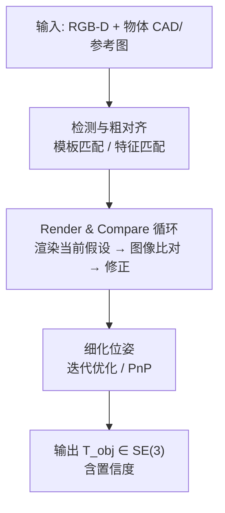

> **系列导航**：前两篇解决了"动得了"的问题，本篇解决"看得见、摸得着"。感知是 VLA 模型输入端的最后一公里：观测表示选得不好，再强的策略也白搭。本篇按"传感器 → 视觉几何 → 3D 表征 → 物体位姿 → 触觉 → SLAM"推进。

## TL;DR

> **TL;DR 1｜机器人的眼睛不是分类器**：自动驾驶关心"那是什么车"，机器人关心"那个杯子在哪、口朝哪、我能从哪个角度抓"——**6-DoF 位姿与几何**才是核心输出。这决定了 PointNet/3DGS 等几何表征在具身智能中的地位远高于普通视觉任务。

> **TL;DR 2｜PointNet 的灵魂是一个对称函数**：点云是无序集合，网络必须对输入排列置换不变。PointNet 用共享 MLP + max-pooling 实现这一点：$f(\{x_1,...,x_n\}) = \gamma\left(\max_{i}\ h(x_i)\right)$，max 是天然对称的[1](https://arxiv.org/abs/1612.00593)。

> **TL;DR 3｜2024 年后感知栈正在被"基础模型化"**：深度估计有 Depth Anything[2](https://arxiv.org/abs/2401.10891)，位姿估计有 FoundationPose（零样本泛化到新物体）[3](https://arxiv.org/abs/2312.08344)，场景重建有 3DGS[4](https://arxiv.org/abs/2308.04079)。"自己训感知模型"的需求在下降，"把开源模型拼成可靠的观测管线"成为工程主战场。

## 1. 传感器矩阵：先认识你的输入

| 传感器 | 输出 | 优点 | 缺点 | 典型用途 |
|--------|------|------|------|---------|
| RGB 相机 | 图像 | 便宜、语义丰富 | 无深度 | 场景理解、VLA 输入 |
| RGB-D（RealSense 等） | 彩色+深度 | 米级精度深度 | 反光/透明面失效 | 抓取位姿、避障 |
| LiDAR | 点云 | 远距、精确 | 贵、无颜色 | 移动机器人/车 |
| IMU | 加速度+角速度 | 高频（kHz）、便宜 | 漂移 | 本体状态估计 |
| 关节编码器/力矩 | $q,\tau$ | 直接本体感知 | — | 运动控制必备 |
| F/T 传感器 | 六维力/力矩 | 接触事件检测 | 贵、易漂移 | 装配、打磨 |
| 视触觉（GelSight/DIGIT） | 接触面高分辨率图像 | 亚毫米纹理感知 | 标定复杂 | 灵巧操作 |

**本体感觉（proprioception）vs 外部感受（exteroception）**的划分贯穿全领域：第 02 篇 locomotion 只用前者即可盲走；操作任务两者都要。

## 2. 相机模型与标定：五分钟版

针孔模型把三维点投影到像素：

$$
s \begin{bmatrix} u \\ v \\ 1 \end{bmatrix} = K \begin{bmatrix} R | t \end{bmatrix} \begin{bmatrix} X_w \\ Y_w \\ Z_w \end{bmatrix}, \qquad K = \begin{bmatrix} f_x & 0 & c_x \\ 0 & f_y & c_y \\ 0 & 0 & 1 \end{bmatrix}
$$

内参 $K$（焦距/主点）与外参 $[R|t]$（相机在世界中的位姿）通过张正友棋盘格标定求解。机器人特有的额外一步是**手眼标定（hand-eye calibration）**：求相机挂在手臂上时相机系与末端法兰系的固定变换 $X$，满足 $AX=XB$（OpenCV 有现成 API）。90% 的"抓不准"最终查出来都是外参或手眼标定的毫米级偏差。

## 3. 单目深度与基础模型化

双目/ToF 硬件之外，单目深度估计已经基础模型化：

- MiDaS：跨数据集混合训练实现零样本泛化的开山作[5](https://arxiv.org/abs/1907.01341)；
- Depth Anything：6200 万张未标注图 + 大教师-小学生蒸馏，把相对深度做到"即插即用"[2](https://arxiv.org/abs/2401.10891)。

注意其输出通常是**仿射不变的相对深度**，用于抓取前需用稀疏真值（如少量激光测距点）做尺度对齐——这是工程中常见的坑。

## 4. 点云深度学习：PointNet 的数学骨架

### 4.1 置换不变性为什么是硬约束

点云 $\{x_i\}_{i=1}^N$ 是集合而非序列：同一桌子的扫描换个扫描顺序，物理上是同一个东西。因此要求：

$$
f(\{x_{1},...,x_{n}\}) \equiv f(\{x_{\pi(1)},...,x_{\pi(n)}\}),\quad \forall \pi \in S_n
$$

PointNet 的解法优雅至极：逐点共享 MLP 提特征 $h(x_i)$，再用对称函数 max 聚合：

$$
f(S) = \gamma\left( \max_{x_i \in S} \, h(x_i) \right)
$$

理论上证明了：任意连续集合函数都能被这种形式逼近，关键维度是 max 后的瓶颈特征长度 $K$[1](https://arxiv.org/abs/1612.00593)。变量映射：

| 符号 | 代码变量 | Shape | 说明 |
|---:|:---|:---:|:---|
| $S=\{x_i\}$ | `points` | `(B, N, 3)` | N 个点的 xyz |
| $h$ | `self.mlp` | `(B,N,3)→(B,N,K)` | 共享权重逐点卷积 |
| $\max_i h(x_i)$ | `torch.max(dim=1)` | `(B, K)` | 全局特征（对称！） |
| $\gamma$ | 头部 MLP | `(B,K)→(B,C)` | 分类/分割头 |

### 4.2 PointNet++ 与后续

PointNet 的 max 丢失全部局部结构。PointNet++ 引入**分层采样 + 局部邻域分组**（类似 CNN 的层次感受野），在弯曲表面细节上大幅领先[6](https://arxiv.org/abs/1706.02413)。此后点云骨干一路演化（DGCNN/VoxelNet/…），但具身智能里你最常见的还是这两个祖先及其变体——例如第 04 篇 DP3 就是用轻量点云编码器替换 Diffusion Policy 的图像编码器。

## 5. 神经场景表示：NeRF → 3DGS

### 5.1 一分钟原理对比

| 方法 | 表示 | 渲染方式 | 训练/渲染速度 | 对机器人的意义 |
|------|------|---------|--------------|---------------|
| NeRF[7](https://arxiv.org/abs/2003.08934) | MLP 隐式场 $(x,d)\to(c,\sigma)$ | 光线行进积分 | 慢/慢 | 高保真实景建模 |
| 3DGS[4](https://arxiv.org/abs/2308.04079) | 数百万各向异性高斯椭球 | 可微光栅化 | 快/**实时** | real2sim 主力 |

3DGS 把场景显式参数化为 $\{\mu_i, \Sigma_i, \alpha_i, c_i\}$（中心/协方差/不透明度/球谐颜色），渲染像素颜色是对光线穿过的高斯做 alpha blending：

$$
C = \sum_i c_i\, \alpha_i \prod_{j<i}(1-\alpha_j)
$$

因为光栅化可微且并行，训练几分钟、渲染 100+ FPS——机器人领域立刻把它用于**real2sim**：手机扫一圈桌子，得到可交互的仿真背景资产（第 07 篇详述流水线）。

## 6. 物体级感知：6-DoF 位姿估计

抓取一个物体 = 在相机系解出它的位姿 $T_{obj}\in SE(3)$，然后规划手到哪。难点在"没见过的物体"：

- **MegaPose**：render-and-compare 思想的代表作，对全新物体零样本估姿，已成为大量操作论文的标准前端[8](https://arxiv.org/abs/2212.06870)；
- **FoundationPose**（NVIDIA, CVPR 2024 best paper candidate）：统一"新物体 + 新类别"的位姿估计与跟踪，模型基/无模型两种模式一个框架搞定[3](https://arxiv.org/abs/2312.08344)，代码开源（GitHub: `NVlabs/FoundationPose`，未本地验证）。

**工程真相**：位姿估计在反光金属袋、透明玻璃杯、堆叠杂乱场景依然会翻车。成熟系统都带"位姿不可信→退回反应式策略"的降级逻辑。

## 7. 触觉：被低估的第三只眼

人类抓鸡蛋靠的不是视觉而是指尖力学反馈。视触觉传感器的思路是把"接触"变成"图像"：

- **GelSight** 系：弹性凝胶背面涂膜+相机观察形变，输出亚毫米级接触几何（官网 gelsight.com）；
- **DIGIT**（Meta 开源）：低成本紧凑设计，广泛用于 in-hand 操作研究；
- **AnySkin**（Meta, 2024）：模块化可替换胶皮、即插即用，试图解决"传感器坏了要重标定"的量产痛点[9](https://arxiv.org/abs/2409.08276)。

触觉数据目前没有 ImageNet 级别的公开生态，是公认的数据荒地——也是差异化研究的机会窗口。

## 8. SLAM 最小知识包

机器人导航需要回答"我在哪"（定位）+"世界长什么样"（建图），两者耦合求解即为 SLAM。最小概念集：

| 概块 | 内容 | 你需要的程度 |
|------|------|-------------|
| 前端里程计 | 帧间特征匹配/PnP/ICP 给增量位姿 | 会调 ORB-SLAM3/LIO-SAM 即可 |
| 后端优化 | 因子图平滑全局轨迹（g2o/GTSAM） | 知道回环检测为何能消漂移 |
| 地图表示 | 占据栅格/TSDF/ESDF/点云 | 导航规划用 ESDF，操作用 TSDF |
| 视觉惯性 | VIO 融合 IMU 补帧间快速运动 | 知道纯视觉会糊就行 |

诚实的建议：除非立志做移动机器人方向，**不要陷进 SLAM 工程深水区**。具身智能研究者只需要：会用现成 SLAM 输出的轨迹和地图，理解其误差量级（厘米级漂移），并把不确定性传给下游规划。推荐系统学习路径见高翔《视觉 SLAM 十四讲》（第二版，电子工业出版社）——中文社区公认的入门标准教材。

## Lab Exercises

1. **PointNet 手搓体验**：安装 Open3D（`pip install open3d`），下载 ModelNet10 子集，跑通官方 PointNet PyTorch 最小实现（约 200 行），然后做一个破坏性实验：测试时随机打乱点序，验证精度不变；再把 `torch.max` 换成 `torch.mean`，对比 ModelNet40 精度变化并解释。
2. **Depth Anything 尺度对齐实验**：用 Depth Anything V2 开源权重（HuggingFace: `depth-anything` 系列，未本地验证）对一张室内照片推相对深度，再用 RealSense 采 20 个稀疏真值点做线性尺度回归，报告绝对相对误差（AbsRel）改善幅度。
3. **FoundationPose 上手**：按官方仓库 README 准备 YCB-V 数据或自拍视频，对一个新物体跑 zero-shot 位姿跟踪，故意用反光材质物体复现失败案例，记录置信度曲线——体会"什么时候该降级到盲抓"。

## 参考文献与延伸阅读

- [1] Qi et al., *PointNet*. [arXiv:1612.00593](https://arxiv.org/abs/1612.00593)；[6] *PointNet++*. [arXiv:1706.02413](https://arxiv.org/abs/1706.02413)
- [4] Kerbl et al., *3D Gaussian Splatting*, SIGGRAPH 2023 最佳论文. [arXiv:2308.04079](https://arxiv.org/abs/2308.04079)；官方项目页 `repo-sam.inria.fr/fungraph/3d-gaussian-splatting/`
- [3] Wen et al., *FoundationPose*. [arXiv:2312.08344](https://arxiv.org/abs/2312.08344)
- 中文资源：《视觉 SLAM 十四讲》配套开源讲义（GitHub: `gaoxiang12/slambook2`，未本地验证）；B 站"手写 VIO"、"三维点云处理（深蓝学院）"系列课程口碑良好（站内检索）。

*下一篇：《04 操作》——终于来到具身智能皇冠上的明珠：让机械臂学会人类的"手感"。Diffusion Policy 为什么碾压了十年的 MSE 回归？ALOHA 如何用 2 万美元改写数据采集经济学？*
