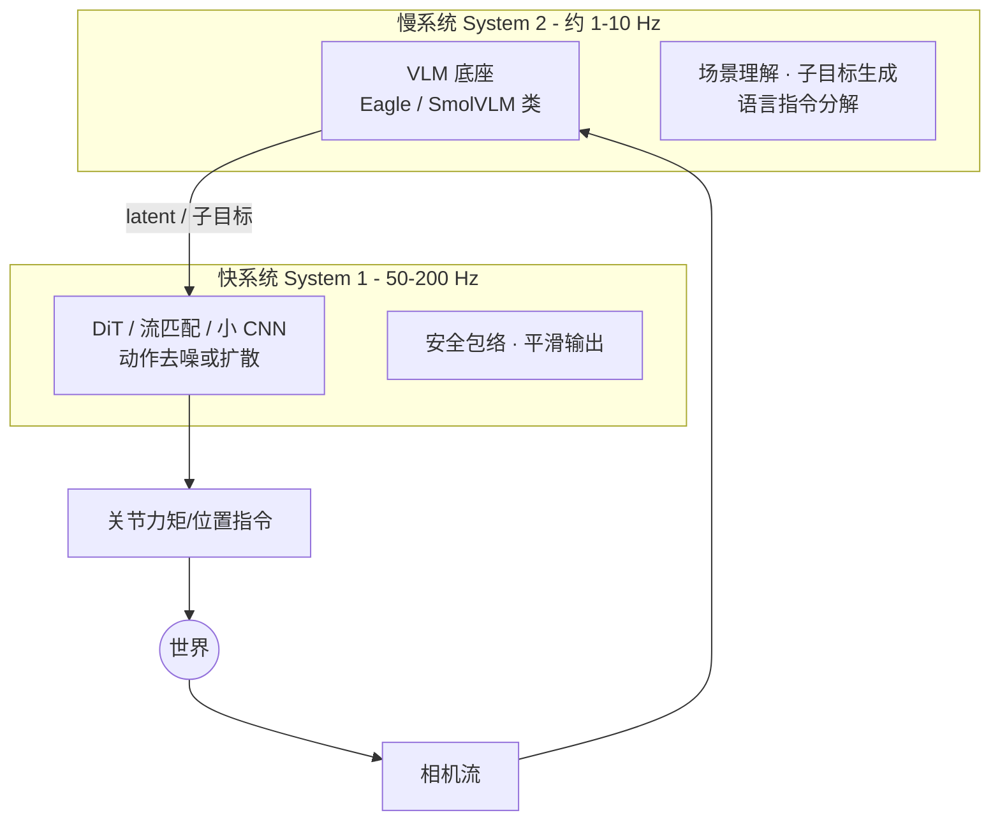

> **系列导航**：前四篇的所有积累在本篇汇流：大模型先验（00）+ 控制分层（01）+ 学习范式（02）+ 感知输入（03）+ 操作技能（04）。VLA（Vision-Language-Action Model）是当前整个领域的主赛道，本篇按时间线讲透架构演进的每一步"为什么"，并深潜 π0 的流匹配数学。

## TL;DR

> **TL;DR 1｜VLA 的定义**：以预训练 VLM 为底座、输出机器人动作的模型。RT-2 的历史性证明：动作可以就是**文本 token**，于是网络级语义知识（"什么是泰勒·斯威夫特"）零成本迁移到控制[1](https://arxiv.org/abs/2307.15818)。

> **TL;DR 2｜架构三大流派**：① 自回归离散 token（OpenVLA/FAST 系：简单、可复用 LLM 全套生态）；② 扩散头（Octo/RDT：多模态表达好）；③ **流匹配头（π0 系：连续动作+少步采样，正在成为新默认）**。分歧本质是"动作该离散还是连续"。

> **TL;DR 3｜双系统成为 2025 共识**：快系统（~50Hz 运动技能）+ 慢系统（Hz 级语义规划），GR00T N1[2](https://arxiv.org/abs/2503.14734)、Helix[3](https://www.figure.ai/news/helix)、Gemini Robotics[4](https://arxiv.org/abs/2503.20020)不约而同收敛到这一拓扑——与第 01 篇的分层控制遥相呼应，只是每一层都换成了学习出来的模块。

## 1. 前史：把 Transformer 装进机器人

- **Gato**（DeepMind, 2022）：一个 transformer 打通 600+ 任务（打字、对话、操纵机械臂……），证明"序列建模"是通用接口，但机器人任务表现平平[5](https://arxiv.org/abs/2205.06175)。
- **RT-1**（Google, 2022）：13 万条真机演示、700+ 任务指令，EfficientNet 观测编码器 + Transformer 输出离散化动作 bin，97% 训练任务成功率，且对未见物体有泛化[6](https://arxiv.org/abs/2212.06817)。它确立了"Robotics Transformer"范式，但没有利用任何语言模型先验。

## 2. 2023 年的两个关键跳跃

### 2.1 PaLM-E：把世界塞进 LLM 的上下文

Google 把图像/状态等连续模态作为 token 注入 PaLM，得到 562B 参数的多模态 LLM，能做视觉问答式的规划（"把抽屉拉开后里面是什么颜色的薯片？"）[7](https://arxiv.org/abs/2303.03378)。它证明了：**embodied 数据不会损害语言能力，反而随规模出现正迁移**——为 RT-2 扫清了心理障碍。

### 2.2 RT-2：动作即 token

$$
\text{Co-fine-tune:} \quad \underbrace{\mathcal{D}_{web}}_{\text{互联网图文}} \cup \underbrace{\mathcal{D}_{robot}}_{\text{真机轨迹}} \longrightarrow \pi_\theta(\,\text{tokens}\,)
$$

动作离散化为 256 个 bin，用专用 token 表示（如 `"1 128 91 ..."`），模型仍是标准 VLM 解码。三大发现：

1. **语义涌现**："把可乐挪到泰勒·斯威夫特照片旁"这类需要网络知识的指令，7B 模型接近失败、55B 模型成功率翻倍；
2. **符号推理迁移**：理解"把恐龙挪到数字最小的物体上"（需 OCR+比较）；
3. 底座越大泛化越强，robot 数据占比下降也不崩。

## 3. 开源化浪潮：OXE → Octo → OpenVLA

| 工作 | 年份 | 关键贡献 | 引用 |
|------|-----|---------|------|
| Open X-Embodiment (RT-X) | 2023 | 21 机构、22 种本体、100 万+ 轨迹统一格式；跨本体训练互相增益 | [8](https://arxiv.org/abs/2310.08864) |
| Octo | 2024 | 完全开源的通用策略：Transformer 骨干 + 扩散头，灵活观测/动作空间，可读 goal 图像 | [9](https://arxiv.org/abs/2405.12213) |
| OpenVLA | 2024 | 7B（Llama2 + DINOv2/SigLIP 双视觉塔），动作离散 256 bins；LoRA 微调友好；970k OXE 轨迹训练 | [10](https://arxiv.org/abs/2406.09246) |

OXE 的工程细节值得记住：不同本体的动作空间（末端速度 vs 关节位置）、维度、单位全然不同，RT-X 用**逐数据集归一化到 $[-1,1]$ 再映射回各本体原生空间**的方案解决——"跨 embodiment 泛化"的第一性难题其实是数据格式的统一。

OpenVLA 的实用价值在于微调成本：单张 A100 用 LoRA 即可在自有小数据上适配新机器人，这让高校实验室第一次玩得起基础模型。微调配方（示意）：

```python
# 基于 openvla 官方 repo（GitHub: openvla/openvla，未本地验证）
from peft import LoraConfig
lora_cfg = LoraConfig(r=32, lora_alpha=16,
                      target_modules=["q_proj","k_proj","v_proj","o_proj"])
# 冻结 7B 底座, 只训 LoRA 分支: 显存 ~40GB, 单 A100 可跑
```

## 4. Physical Intelligence π 系列：流匹配登基

### 4.1 为什么不用自回归 token

自回归方案的两个痛点：① 每个动作维一个 bin，长动作块推理慢（控制频率上不去）；② 离散化丢失连续微操精度。π0 的答案：**VLM 只管"想"，动作专家专管"动"**。

架构：PaliGemma VLM（3B）处理图文 → 动作专家（约 300M 的独立权重块）通过 cross-attention 复用 VLM 的 KV 缓存，输出**连续动作块** $a_t \in \mathbb{R}^{H\times d_a}$（$H{=}50$ 步，50Hz 下 1 秒）[11](https://arxiv.org/abs/2410.24164)。

### 4.2 流匹配最小推导

Flow Matching 学习一个时变速度场，把噪声分布"搬运"到数据分布。取最简单的线性插值路径：$t\in[0,1]$，

$$
x_t = (1-t)\,x_0 + t\,\epsilon, \qquad x_0\sim p_{data},\ \epsilon\sim\mathcal N(0,I)
$$

沿该路径的真实速度对时间求导（一步链式法则）：

$$
\frac{d x_t}{dt} = \epsilon - x_0
$$

训练目标即回归这个速度场（条件于观测 $o$）：

$$
L_{FM} = \mathbb{E}_{t,x_0,\epsilon}\left[\big\|\,v_\theta(x_t,\ t,\ o) - (\epsilon - x_0)\,\big\|^2\right]
$$

推理：从纯高斯噪声 $x_1$ 出发，欧拉积分 $O(10)$ 步即可到达数据流形——比 DDPM 的上百步去噪便宜一个数量级。变量映射：

| 符号 | 代码变量 | Shape | 说明 |
|---:|:---|:---:|:---|
| $x_0$ | `clean_action` | `(B, H, d_a)` | 专家动作块 |
| $\epsilon$ | `noise` | `(B, H, d_a)` | 高斯噪声 |
| $x_t$ | `noisy_action` | `(B, H, d_a)` | 插值中间态 |
| $v_\theta$ | `action_expert` | `(B,H,d_a)→(B,H,d_a)` | 条件于 VLM 特征 |
| $t$ | `time` | `(B,)` | 连续（区别于扩散的整数步） |

```python
import torch
B, H, Da = 8, 50, 32                      # π0: H=50 步动作块
x0   = torch.randn(B, H, Da)              # 专家动作（示意）
eps  = torch.randn(B, H, Da)
t    = torch.rand(B, 1, 1)                # 连续时间 U[0,1]
xt   = (1 - t) * x0 + t * eps             # 线性插值路径
v_target = eps - x0                       # dx/dt = ε - x₀
loss = torch.nn.functional.mse_loss(v_net(xt, t, obs_emb), v_target)
# 推理: x=x1(噪声) 出发, for i in range(N): x += v(x, t_i, emb) * dt
```

### 4.3 FAST：自回归派的反击

Physical Intelligence 自己也补了自回归路线的短板：FAST 用 DCT 变换压缩动作冗余后做 BPE 式 token 化，训练效率提升约 14 倍，使自回归 VLA 在高频场景可用[12](https://arxiv.org/abs/2501.09747)。两条技术路线的竞争远未终结。π0.5 进一步引入分层（高层子目标生成 + 低层技能执行）实现开放环境家庭服务[13](https://arxiv.org/abs/2504.16054)。

## 5. 双系统时代：GR00T N1 / Helix / Gemini Robotics



| 系统 | 快系统设计 | 慢系统底座 | 特色 | 引用 |
|------|-----------|-----------|------|------|
| GR00T N1 (NVIDIA) | DiT 扩散头，"Flattened Action Tokens" | Eagle VLM | 全开源权重+仿真数据管线 | [2](https://arxiv.org/abs/2503.14734) |
| Helix (Figure) | S1: 80M 小 CNN，200Hz | S2: 7B VLM，7-9Hz | 上身 35 DoF 全 VLA 控制，家用场景部署 | [3](https://www.figure.ai/news/helix) |
| Gemini Robotics (DeepMind) | 动作解码器（ALOHA 类双臂验证） | Gemini 2.0 | 强调 zero-shot 本体迁移与物理交互推理 | [4](https://arxiv.org/abs/2503.20020)；1.5 版 [14](https://arxiv.org/abs/2510.03342) |

三家不约而同的架构选择不是巧合：VLM 前向太慢（物理约束），而小网络又缺语义——**只有异构分工能同时满足两个时钟域**。

## 6. 中国力量与差异化路线

- **RDT-1B**（清华等）：1.2B 扩散 Transformer，双语双臂操作，强调扩散头的多模态表达能力[15](https://arxiv.org/abs/2410.07864)；
- **GR-1/GR-2**（字节跳动）：用大规模视频生成预训练获得世界知识再接动作头[16](https://arxiv.org/abs/2312.13139)；
- **RoboFlamingo**（上海AI Lab）：开源 Flamingo 改造的语言条件操作基线[17](https://arxiv.org/abs/2311.01378)；
- **GraspVLA**（银河通用）：十亿级**合成**抓取数据预训练抓取基础模型，"合成数据优先"路线的代表[18](https://arxiv.org/abs/2505.03233)；
- **AgiBot World**（智元）：百台真机数据工厂产出百万级轨迹开源数据集（第 07 篇详述）[19](https://arxiv.org/abs/2503.06669)。

## 7. 世界模型：另一条通往通用的路

VLA 学的是"看到 X 做 Y"的反应式映射；世界模型学的是 $p(s_{t+1}|s_t,a_t)$——**可想象、可规划、可评测**：

- DreamerV3：RSSM 潜变量世界模型 + 想象中训练 actor-critic，同一套超参横扫 150+ 任务，并在 Minecraft 首次无人类数据采集钻石[20](https://arxiv.org/abs/2301.04104)；其前身 DayDreamer 直接在四个真实机器人上在线学习，数小时内学会行走[21](https://arxiv.org/abs/2206.14176)；
- Genie/Genie 2：从无标注视频学习"可玩的"潜动作世界模型[22](https://arxiv.org/abs/2402.15391)；
- NVIDIA Cosmos：视频生成式世界基础模型平台，定位为 Physical AI 的"合成数据工厂"[23](https://arxiv.org/abs/2501.03575)。

世界模型与 VLA 并非对立：前者正在成为后者的**评测器**（在想象中 roll-out 筛选策略）和**数据引擎**（生成边缘场景）。TD-MPC2 展示了两者合体的雏形：模型预测控制跑在世界模型的潜空间里[24](https://arxiv.org/abs/2310.16828)。

## 8. 架构选型速查表（2025 中视角）

| 维度 | 自回归 token | 扩散头 | 流匹配头 |
|------|-------------|--------|---------|
| 代表 | OpenVLA、FAST-π0 | Octo、RDT-1B、GR00T N1 | π0/π0.5 |
| 多模态分布 | 差（模式坍缩风险） | 好 | 好 |
| 推理延迟 | 高（逐 token） | 中（N 步去噪） | 低（~10 步积分） |
| 可复用 LLM 生态 | ★★★ | ★ | ★★ |
| 连续控制精度 | 受 bin 分辨率限 | 高 | 高 |

## Lab Exercises

1. **流匹配玩具实验**：一维双峰分布（如 $\frac12\mathcal N(-2,0.1^2)+\frac12\mathcal N(2,0.1^2)$），用两层 MLP 学 $v_\theta$，欧拉积分 10 步采样 1000 个样本画直方图，验证多峰被完整还原——对比直接 MSE 回归的均值坍缩。
2. **OpenVLA LoRA 微调**：官方 repo 提供 BridgeData 微调脚本，单卡 A100/H100 数小时可得适配 checkpoint；没有卡的话改跑 SmolVLA（450M 参数，消费级 GPU 可训，HuggingFace: `lerobot/smolvla_base`，未本地验证）[25](https://arxiv.org/abs/2506.01844)，在 LeRobot 内置仿真任务上对比微调前后成功率。
3. **架构考古报告**：精读 RT-2 论文 §3（动作表示）与 π0 论文 §3.2（action expert），各画一张张量流动图并标注 shape，写 500 字对比笔记——这是面试高频题。

## 参考文献与延伸阅读

- [1] RT-2 [2307.15818](https://arxiv.org/abs/2307.15818)；[8] Open X-Embodiment [2310.08864](https://arxiv.org/abs/2310.08864)；[11] π0 [2410.24164](https://arxiv.org/abs/2410.24164)
- Flow Matching 数学起源：Lipman et al., *Flow Matching for Generative Modeling*, ICLR 2023. [arXiv:2210.02747](https://arxiv.org/abs/2210.02747)
- 社区动态：Physical Intelligence 博客（physicalintelligence.company）、NVIDIA GTC 具身智能专场回放、HuggingFace LeRobot Discord（均为未本地验证入口，检索官方名即可）。

*下一篇：《06 导航与规划》——VLA 解决"手上的活"，那"去哪里、按什么顺序做"呢？SayCan 如何用价值函数给 LLM 说的话"验货"？*
