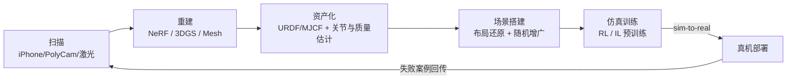

> **系列导航**：算法篇到此收官（01–06），本篇进入"基础设施"层。具身智能的摩尔定律不在芯片而在数据管线：谁能源源不断地生产"带动作标签的物理交互数据"，谁的模型就赢。本篇回答三件事：在哪练（仿真器）、拿什么喂（数据集）、怎么打分（评测）。

## TL;DR

> **TL;DR 1｜仿真器选型口诀**：接触保真选 MuJoCo[1](https://mujoco.readthedocs.io)，大规模 RL 选 Isaac Lab（Isaac Gym 的官方继任者）[2](https://arxiv.org/abs/2108.10470)，操作任务+资产生态选 ManiSkill/SAPIEN[3](https://arxiv.org/abs/2003.08515)[4](https://arxiv.org/abs/2302.04659)。Genesis 号称单卡每秒 4300 万步的极限速度（项目页数据，未复测）[5](https://genesis-embodied-ai.github.io)——但速度从来不是唯一指标，**接触求解器行为与真机的相关性**才是。

> **TL;DR 2｜数据集的三代演进**：一代是机构自采小数据（RT-1 的 13 万条）；二代是多机构联盟拼盘（OXE 百万条，格式统一但质量参差[6](https://arxiv.org/abs/2310.08864)）；三代是**工业级数据工厂**（DROID 76k 条精细标定[7](https://arxiv.org/abs/2403.12945)、AgiBot World 百台机器人产线级数据[8](https://arxiv.org/abs/2503.06669)）。

> **TL;DR 3｜Scaling Law 已被实证**：清华团队在双臂平台上系统扫参发现：模仿学习性能随数据量呈幂律提升；**同量级下场景多样性带来的增益远大于演示条数**；且仿真预训练数据与真机微调数据存在可观的正迁移[9](https://arxiv.org/abs/2410.18647)。这给整个行业的数据战略提供了理论地基。

## 1. 仿真器战场地图

| 平台 | 物理内核 | GPU 并行 | 强项 | 典型用户 | 引用 |
|------|---------|---------|------|---------|------|
| MuJoCo | 软约束凸优化接触模型 | MJX(JAX) | 接触精度口碑、可复现性 | 学术界默认 | [1](https://mujoco.readthedocs.io) |
| Isaac Gym / Isaac Lab | PhysX | ✅ 数千并行 | 大规模 locomotion RL | legged 系论文标配 | [2](https://arxiv.org/abs/2108.10470) |
| SAPIEN / ManiSkill2/3 | PhysX + 部件级关节资产 | ManiSkill3 ✅ | 操作任务丰富、铰链物体资产库 | manipulation 论文 | [3](https://arxiv.org/abs/2003.08515)[4](https://arxiv.org/abs/2302.04659) |
| robosuite | MuJoCo | ❌ | 标准化操作 benchmark 套件 | ALOHA/ MimicGen 底座 | [10](https://arxiv.org/abs/2009.12293) |
| PyBullet | Bullet | ❌ | 安装零门槛 | 入门教学 | pybullet.org |
| Genesis | 多内核混合（含 MPB） | ✅ | 极速、多材料耦合（宣传口径） | 社区新锐 | [5](https://genesis-embodied-ai.github.io) |

**接触仿真的三个深坑**（每个都值得写进事故报告）：

1. **求解器迭代数不足** → 穿透与"幽灵弹跳"，随机化 solver 参数可能训出利用求解器 bug 的策略；
2. **时间步长敏感**：刚性接触下 $\Delta t$ 减半结果剧变，跨平台迁移策略时首查此项；
3. **渲染-物理不一致**：视觉观测来自渲染器而真值来自物理引擎，域随机化要同时覆盖两者。

## 2. 数据集全景表

| 数据集 | 规模 | 本体 | 采集方式 | 特色 | 引用 |
|--------|------|------|---------|------|------|
| Open X-Embodiment | 100万+ 轨迹 | 22 种 | 21 机构汇聚 | 跨本体泛化基石 | [6](https://arxiv.org/abs/2310.08864) |
| BridgeData V2 | 6 万+ 轨迹 | WidowX 等 | 自主脚本+遥操 | 便宜桌面平台、被 VLA 广泛用于微调 | [11](https://arxiv.org/abs/2308.12952) |
| RoboNet | 15 万+ 轨迹 | 14 种 | 多实验室历史数据 | OXE 前身 | [12](https://arxiv.org/abs/1910.11215) |
| DROID | 7.6 万条 / 564 场景 | Franka ×564 环境 | 分布式多国采集 | 标定与元数据最完整 | [7](https://arxiv.org/abs/2403.12945) |
| AgiBot World | 100 万+ 轨迹（规划中） | 智元自研 | 百台机器人工厂 | 中国首个工业级开源数据集群 | [8](https://arxiv.org/abs/2503.06669) |
| RoboMIND | 10.7 万条 | 5 种本体 | 多机构(清华系) | 双臂/灵巧手占比高 | [13](https://arxiv.org/abs/2412.13877) |
| RH20T | 11 万+ 轨迹 | 多本体+人类视频 | 清华系 | 人机配对数据 | [14](https://arxiv.org/abs/2307.00595) |

读表要点：**规模 ≠ 质量**。OXE 各子集的相机位姿精度、力矩标注、成功率过滤标准差异巨大——π0 团队公开分享过"子集配比比总量更重要"的经验教训（其技术报告与博客）。选数据集先看：控制频率、观测同步性、是否有失败片段（负样本对 BC 是金子）。

## 3. 评测基准：从"刷分内卷"到可信度量

### 3.1 仿真 benchmark 梯队

| Benchmark | 任务类型 | 特点 | 引用 |
|-----------|---------|------|------|
| Meta-World | 50 个机械臂任务 | 元 RL 经典 | [15](https://arxiv.org/abs/1910.10897) |
| RLBench | 100 个桌面任务 | 首个大规模式样化操作套件 | [16](https://arxiv.org/abs/1909.12271) |
| CALVIN | 语言条件长时程 | 技能串联、抗干扰矩阵 | [17](https://arxiv.org/abs/2112.03227) |
| LIBERO | 130 个终身学习任务 | 知识迁移四象限设计 | [18](https://arxiv.org/abs/2306.03310) |
| RoboCasa | 大规模厨房场景 | 资产生成+人视频动作合成 | [19](https://arxiv.org/abs/2406.02523) |
| SimplerEnv | 真实策略仿真重放 | 用真机数据建仿真来**校准 sim-real 相关度** | [20](https://arxiv.org/abs/2405.05941) |

### 3.2 评测科学三大未解问题

1. **饱和与天花板效应**：LIBERO 等基准已被 VLA 刷到 95%+，区分度消失，社区急需更难版本；
2. **sim-real 相关性弱**：仿真排名靠前的策略真机未必强，SimplerEnv 的贡献正是量化这个相关系数（部分任务对上、部分对不上）[20](https://arxiv.org/abs/2405.05941)；
3. **统计功效不足**：20 次 rollout 的 80% 成功率置信区间宽达 ±17%，大量论文结论实际不可分辨——建议报告 Wilson 区间并做多种子。

## 4. Real2Sim：把世界扫进仿真

关键环节的现状：

- **重建**：3DGS 以实时渲染+照片级外观成为主流选择（原理见第 03 篇）[21](https://arxiv.org/abs/2308.04079)；从 NeRF/3DGS 提取可碰撞 mesh 的工具链（如 SuGaR 类方法）在快速成熟；
- **资产**：Objaverse 等开放 3D 资产库提供数十万物体模型；ManiSkill 的 PartNet-Mobility 提供带关节结构的家具（可开抽屉的门轴已定义好）；
- **数字孪生闭环**：真机失败案例回灌仿真复现（replay + 扰动搜索），定位根因后定向增广——这是头部公司内部管线的核心机密地带，开源实现以 NVIDIA Isaac Lab 的 domain randomization 配置体系最完整（GitHub: `isaac-sim/IsaacLab`，未本地验证）。

## 5. 数据飞轮的设计模式

综合 π0/DROID/AgiBot World 的公开实践，可持续的数据引擎包含四个模块：

1. **生产**：遥操作工厂（人力）+ 脚本化自主（policy 采集，如 QT-Opt 式自举）+ 合成（仿真/世界模型生成，GraspVLA 的十亿级抓取全靠合成[22](https://arxiv.org/abs/2505.03233)）；
2. **清洗**：VLM 自动标注语言指令、检测失败轨迹、去重切片；
3. **消费**：预训练（海量异质数据）→ 微调（高质量同分布数据）两段式已成 VLA 标准流程；
4. **回流**：部署端收集真实失败 → 人工/VLM 标注 → 下轮训练。特斯拉 FSD 十几年验证过的飞轮正在机器人领域重演。

**多样性 > 数量**的定量证据：清华 scaling law 实验[9](https://arxiv.org/abs/2410.18647)给出可操作的工程准则——预算固定时，优先增加环境/物体/光照组合而非单纯堆演示条数；这一结论与 LLM 时代"数据质量与多样性决定上限"的经验完全一致。

## Lab Exercises

1. **仿真器横向对比实验**：同一台 Panda 机械臂 pick-and-place，分别在 PyBullet 和 ManiSkill2 中跑脚本化抓取，对比：① 同参数下的抓取成功率差异；② 把摩擦系数 ±30% 扰动后成功率的方差差异。你会直观看到"接触求解器性格不同"。
2. **SimplerEnv 校准体验**：跑通 SimplerEnv 的 BridgeData 重放环境（GitHub: `simpler-env`，未本地验证），用同一个开源 VLA checkpoint 分别在 SimplerEnv 与其报告的真机成绩对比排名变化，体会"仿真评测能信几分"。
3. **Scaling 复现（缩小版）**：用 LIBERO-Spatial 子集，按 {5, 10, 25, 50} 条/任务采样演示训 Diffusion Policy，画 log-log 成功率曲线拟合幂律指数；再构造"同数量但翻倍场景光照/纹理"的对照组验证多样性红利。

## 参考文献与延伸阅读

- [9] Lin et al., *Data Scaling Laws in Imitation Learning for Robotic Manipulation*（清华，2024）. [arXiv:2410.18647](https://arxiv.org/abs/2410.18647)
- [7] Khazatsky et al., *DROID*. [arXiv:2403.12945](https://arxiv.org/abs/2403.12945)；droid-dataset.github.io
- 各平台文档：MuJoCo[1](https://mujoco.readthedocs.io)；Genesis 项目页[5](https://genesis-embodied-ai.github.io)；ManiSkill 网站 mani-skills（检索 "ManiSkill3" 即达）。
- LeRobot 生态：HuggingFace 开源库统一了 ACT/Diffusion Policy/SmolVLA 的训练评测接口，是目前个人入门的最佳一站式入口（GitHub: `huggingface/lerobot`，未本地验证）。

*下一篇（终章）：《08 产业版图与学习路线图》——硬件解剖、公司棋局、岗位技能矩阵，以及一份可以直接照着做的 90 天上手动线。*
