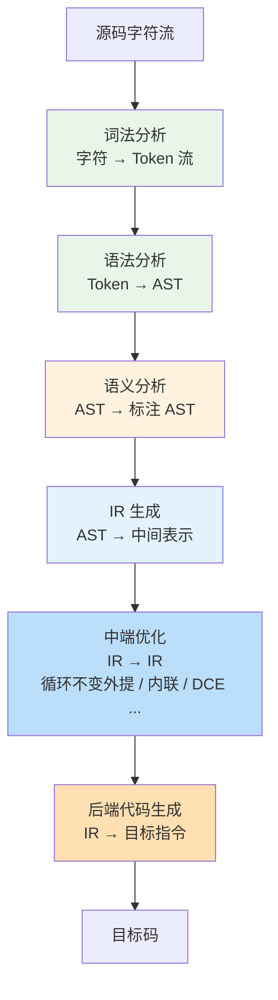
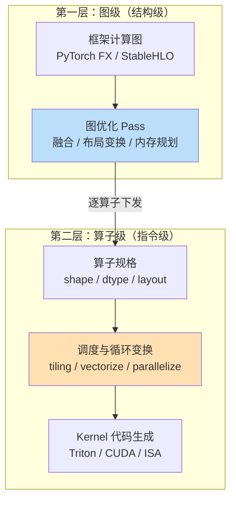

> **LLM/编译器技术深度解析系列 · 第 0 篇 / 共 13 篇**

**TL;DR**
* 编译器的本质是**程序变换器**：把一种程序表示（源码、计算图、字节码）语义保持地变换为另一种更高效的表示（机器码、融合 kernel、引擎序列化）。理解编译器 = 掌握"表示的层次设计 + 跨层语义保持变换"这两件事。
* 本系列分三部分：**A. 知识体系骨架**（词法→语法→语义→IR→优化→代码生成，01~04）、**B. 主流编译器剖析**（GCC / LLVM / TVM / XLA+MLIR+IREE / torch.compile+Triton+TensorRT，05~09）、**C. 开发实战**（从零写经典编译器与迷你 AI 编译器 + 工程化，10~12）。
* AI 编译器不是新物种，而是编译原理在"张量程序"上的实例化：图级 IR ≈ 结构级中间表示，算子调度 ≈ 循环变换与指令选择，auto-tuning ≈ 迭代编译（iterative compilation）。学经典原理的每一分钟都会在 AI 编译器上兑现。
* 本文是全系列导航与知识地图，读完你应能回答："我要解决的问题处在编译器栈的哪一层？该用哪个现成系统？要自研的话需要补哪些模块？"

---

## 目录

- [1. 什么是编译器：一条光谱而非二元对立](#1)
- [2. 分层知识地图：七个阶段与两次"降维"](#2)
- [3. 经典编译器 vs AI 编译器：一张对照表](#3)
- [4. 主流编译器版图速览](#4)
- [5. 学习路径：教材、课程与动手项目](#5)
- [6. 本系列导航](#6)
- [7. 批判与展望](#7)
- [FAQ](#faq)
- [参考资料](#参考)

## 1. 什么是编译器：一条光谱而非二元对立

教科书定义是"把高级语言翻译为低级语言的程序"，但这个定义在 2026 年已经不够用了。更有解释力的定义：

> **编译器 = 以语义保持为约束、以执行效率为目标、以多级表示为手段的程序变换系统。**

按这个定义，下面这些系统都在编译器光谱上：

| 光谱位置 | 系统 | 输入 → 输出 | 特点 |
|---------|------|------------|------|
| 纯解释 | CPython 解释器 | 字节码 → 逐条执行 | 无（或极少）提前变换 |
| 即时编译 JIT | V8、JVM HotSpot、ORC（LLVM） | 字节码/IR → 运行时机器码 | 用运行时画像换优化机会 |
| 提前编译 AOT | GCC、Clang、rustc | 源码 → 目标文件 | 编译期信息最全，无运行时开销 |
| 源到源 transpiler | SWIG、f2c、Emscripten | 高级语言 → 高级语言 | 变换发生在同一抽象层级附近 |
| 领域专用编译器 | TensorRT、XLA、torch.compile | 计算图 → 引擎/kernel | 只服务一个领域，换取激进优化空间 |

三个关键观察：

1. **解释与编译的界限正在消失**。CPython 3.13 起自带实验性 JIT[1]，PyPy 一直是"用 JIT 编译 Python"，而 torch.compile 的默认模式就是"捕获计算图 → 生成 Triton kernel → 缓存复用"，每次 shape 变化触发重编译——这是典型的 trace-based JIT 行为。
2. **抽象层级决定优化空间**。TensorRT 敢做 kernel 级激进融合，是因为它把输入限定为神经网络算子集合；Clang 必须支持任意 C++，就只能做保守变换。**DSL 编译器的自由度是用表达力换来的**。
3. **正确性判据统一且苛刻**：无论哪一层，变换前后对合法输入必须可观测等价。这句话说起来一行，做到要整个第 12 篇来讲（差分测试、fuzzing、数值容差）。

## 2. 分层知识地图：七个阶段与两次"降维"

经典编译器前端到后端的流水线（每个阶段都是独立的知识模块，也是本系列 Part A 的四篇文章）：

这张图有两个容易忽略的结构性事实：

**第一，IR 是编译器的"宪法"**。前端的多样性（C/C++/Rust/Python…）和后端的多样性（x86/ARM/RISC-V/GPU…）都被 IR 吸收了：$$N$$ 个前端 + $$M$$ 个后端的问题从 $$O(N \times M)$$ 降为 $$O(N + M)$$。这是 LLVM 生态成功的根本原因，也是 MLIR 把"多层 IR"本身做成基础设施的动机。

**第二，AI 编译器是同一张图的两次实例化**。它把上述单层流水线复制成两层：

图级对应经典编译器的**过程间分析与内存优化**，算子级对应**循环变换与指令级并行**。区别在于：AI 编译器的"指令"是 GEMM/卷积这样的张量原语，且因为搜索空间巨大，引入了经典编译器较少使用的**迭代调优**（MetaSchedule、TensorRT tactic 枚举、Inductor autotune）。

## 3. 经典编译器 vs AI 编译器：一张对照表

网上流传的对照表大多停在"输入不同、目标不同"。下面这版补充了工程上真正重要的维度：

| 维度 | 经典编译器（GCC/LLVM） | AI 编译器（TVM/XLA/TensorRT…） |
|------|----------------------|-------------------------------|
| 输入表示 | 命令式源码，任意控制流 | 声明式计算图，控制流受限或需静态化 |
| 核心数据对象 | 标量 / 数组元素 | 张量（带 shape/dtype/layout） |
| IR 层级 | 单主线多层变体（GIMPLE/RTL 或 LLVM IR） | 显式两层甚至三层（图级 + 算子级 + 物理布局级） |
| 优化的主要收益来源 | 消除冗余计算、提高 ILP、缓存友好 | 减少 HBM 往返（融合）、提高 DLP/TP 并行度 |
| 正确性判据 | 位级等价（整数）/ IEEE 语义（浮点，受 fast-math 影响） | 数值容差内等价（fp16/bf16 下误差预算是设计参数） |
| Shape 处理 | 符号变量天然支持 | 动态 shape 是难点：guard 重编译 vs bucket 化 vs 符号推导 |
| 性能不确定性的处理 | 编译期启发式为主 | 大量迭代调优：枚举/搜索 + 实测反馈 |
| 生态接口 | 语言标准委员会驱动 | 框架版本驱动（半年一变的破坏性风险） |
| 典型调试手段 | -O0 对比、IR dump、llvm-mca | 逐层数值对比、kernel profile、autotune 日志 |

一个常被误解的点：**AI 编译器的"编译期"经常包含实测**（tuning 一个 matmul 可能跑几百个候选配置），这让它的构建产物依赖构建时的硬件状态，也带来了经典编译器没有的复现性问题——同样的模型在不同机器上"编译"出不同引擎是常态而非 bug。

## 4. 主流编译器版图速览

下表是本系列 Part B 要逐一剖析的系统，先给一句话定位（版本信息以官方站点为准；GCC 当前稳定线为 15.x，16 系列已进入发布流程[2]）：

| 系统 | 一句话定位 | 关键 IR / 概念 | 本系列篇目 |
|------|-----------|---------------|-----------|
| **GCC** | GNU 工具链旗舰，Linux 默认 C/C++ 编译器 | GENERIC → GIMPLE → RTL 三层 IR | 第 05 篇 |
| **LLVM / Clang** | 编译器基础设施事实标准，"编译器界的乐高" | LLVM IR（SSA）、New PassManager、MC 层、ORC JIT | 第 06 篇 |
| **Apache TVM** | 开源深度学习编译栈，端到端覆盖训练/推理 | Relax（图级）+ TensorIR（算子级）+ MetaSchedule | 第 07 篇（另见本地已有 TVM 系列[3][4]） |
| **XLA / StableHLO** | Google 系（JAX/TF/PyTorch-XLA）的加速线性代数编译器 | HLO → StableHLO（可移植算子交换格式） | 第 08 篇 |
| **MLIR / IREE** | 多层 IR 基础设施与其旗舰端侧编译器 | Dialect 渐进降级；IREE 的 flow/stream/hal 分层 | 第 08 篇 |
| **torch.compile + Triton** | PyTorch 官方即时编译方案 + OpenAI 开源的 kernel DSL | TorchDynamo guards、Inductor codegen、Triton block-level IR | 第 09 篇（另见算子集成篇[5]） |
| **TensorRT** | NVIDIA 闭源推理引擎（本质是 GPU 专用编译器+runtime） | Network → Engine，tactic 自动选择 | 第 09 篇 |

选型直觉（详细论证在各篇展开）：
* 要**最大兼容性与极致单机 CPU/GPU 性能** → LLVM 生态（含 MLIR 定制路线）；
* 要**快速对接新硬件** → TVM 的 BYOC 或 MLIR 自建 dialect；
* 在 **PyTorch 世界里求省事** → torch.compile，不行再下沉手写 Triton；
* **NVIDIA 卡上追求部署极限**且能接受闭源 → TensorRT。

## 5. 学习路径：教材、课程与动手项目

三本主流教材定位截然不同，不要硬啃"龙书"从头到尾：

| 资源 | 定位 | 怎么用 |
|------|------|--------|
| 《Compilers: Principles, Techniques & Tools》（龙书） | 理论百科：文法、自动机、数据流分析的数学基础 | 当工具书查；词法/语法部分配合本系列 01~02 |
| 《Engineering a Compiler》（Cooper & Torczon） | 工程视角最好的平衡，寄存器分配/调度讲得透 | Part A 的主教材，对应本系列 03~04 |
| 《Crafting Interpreters》（Nystrom） | 从零写两个完整解释器，代码即教材 | 建立手感最快的一本，免费在线阅读[6] |
| LLVM Kaleidoscope 教程 | 官方入门：10 章做出带 JIT 的小语言 | 本系列第 10 篇的蓝本[7] |
| MLIR Toy Tutorial | 7 章体验方言设计与渐进降级 | 进入 MLIR 的唯一正道[8] |
| Stanford CS143 / 各校公开课 | 系统听一遍前端 | 配合龙书前半部 |

动手项目梯度（每级都有明确验收标准，第 10/11 篇给出完整实现）：
1. 手写 lexer + 递归下降 parser（验收：能报错行号并恢复）；
2. AST → 自己设计的 SSA 式 IR（验收：能打印 CFG）；
3. 接入 LLVM 后端跑通 JIT（验收：`fib(30)` 比树遍历解释器快两个数量级以上）；
4. 迷你 AI 编译器：图捕获 → 融合 → 生成 Triton/numpy kernel（验收：数值与 eager 实现在容差内一致）。

## 6. 本系列导航

| 篇目 | 文件 | 内容 |
|------|------|------|
| 00（本文） | `00_series_overview.md` | 知识体系全景 |
| 01 | [`01_lexing_parsing.md`](/2026/08/25/compiler-01-lexing-parsing/) | 词法分析（RE→DFA 数学构造）与语法分析（LL/LR、递归下降实战） |
| 02 | [`02_semantic_ir.md`](/2026/08/25/compiler-02-semantic-ir/) | 语义分析、符号表、类型检查、IR 设计原则与 SSA 入门 |
| 03 | [`03_dataflow_optimization.md`](/2026/08/25/compiler-03-dataflow-opt/) | 数据流方程与不动点迭代、支配树、SSA 构造、DCE/GVN 案例 |
| 04 | [`04_backend_codegen.md`](/2026/08/25/compiler-04-backend-codegen/) | 指令选择、寄存器分配（图染色/线性扫描）、指令调度 |
| 05 | [`05_gcc_anatomy.md`](/2026/08/25/compiler-05-gcc-anatomy/) | GCC 架构剖析 |
| 06 | [`06_llvm_clang_anatomy.md`](/2026/08/25/compiler-06-llvm-clang/) | LLVM/Clang 架构剖析 |
| 07 | [`07_tvm_anatomy.md`](/2026/08/25/compiler-07-tvm/) | TVM 架构剖析 |
| 08 | [`08_xla_mlir_iree.md`](/2026/08/25/compiler-08-xla-mlir-iree/) | XLA 与 MLIR/IREE 生态 |
| 09 | [`09_torch_triton_tensorrt.md`](/2026/08/25/compiler-09-torch-triton-tensorrt/) | torch.compile / Triton / TensorRT |
| 10 | [`10_build_classic_compiler.md`](/2026/08/25/compiler-10-build-classic-compiler/) | 从零开发经典编译器（全流程实战） |
| 11 | [`11_build_mini_ai_compiler.md`](/2026/08/25/compiler-11-build-mini-ai-compiler/) | 从零开发迷你 AI 编译器（纯 Python MVP） |
| 12 | [`12_compiler_engineering.md`](/2026/08/25/compiler-12-engineering/) | 编译器工程化：测试、fuzzing、benchmark、自研决策 |

建议路径：**AI Infra 工程师** 00→01→02→07→09→11；**系统/芯片软件工程师** 00→01→04→06→05；**科班补强** 按 A 部分顺序全读再跳 B。

## 7. 批判与展望

* **"编译原理过时论"是短视的**。LLM 能生成代码，但生成结果的确定性执行、性能优化、跨硬件迁移仍然完全依赖编译器栈。恰恰因为代码供给暴增，"让程序跑得又快又省"的编译技术变得更稀缺。AI 编译器岗位近年在国内大厂（昇腾、寒武纪、地平线等自研芯片团队）持续扩张即是佐证。
* **AI 反过来也在改造编译器**：MLGO（Google 用 RL 做 LLVM inlining/register allocation 决策）、compiler gym 类环境、以及用 LLM 辅助 pass 编写都已有实际工作。但截至写作时，它们改变的是"策略搜索"环节，IR 设计、语义分析这些骨架并未被替代。
* **本系列的边界**：不展开形式化验证（CompCert 路线）、不做 GC 与运行时的深水区、GPU 硬件微架构只讲到够用的程度（更深的见本地芯片系列[9]）。

## FAQ

**Q1：直接学 TVM/MLIR 不学经典编译原理行不行？**
行得通但天花板低。不懂数据流分析就看不懂 pass 为什么正确，不懂寄存器分配就读不了 backend 代码。反过来，懂了经典原理再看 AI 编译器，80% 的概念可以直接映射。

**Q2：为什么 AI 编译器要两层 IR，一层不行吗？**
一层也能跑（早期 Relay 直接 lowering 到 TIR），但图级融合/内存规划与算子级调度的关注点、变化频率、测试方式完全不同。MLIR 的 Rationale 文档对此有系统论述：异构抽象无法用单一 IR 高效承载[8]。

**Q3：本系列的实验代码依赖什么环境？**
Python 3.9+（Part A/C 实验），可选 clang/llvmlite（第 10 篇提供纯手写 LLVM IR 文本的降级路线）。所有实验脚本随文章给出，固定随机种子可复现。

## 参考

[1] CPython 3.13 release notes（experimental JIT）：https://docs.python.org/3/whatsnew/3.13.html
[2] GCC 官网（当前版本线）：https://gcc.gnu.org/
[3] 本地文章《TVM/MLIR 3 个月学习路线图》（见 congyuan_blogs 仓库 technology/ai_compiler/ 目录）
[4] 本地 wiki《AI Compiler 主题页》（见同仓库 llm-wiki/topics/）
[5] 本地文章《编译器集成：手写 Kernel 如何与 torch.compile 协同》（见同仓库 technology/operator/ 目录）
[6] Crafting Interpreters（免费在线）：https://craftinginterpreters.com/
[7] LLVM Kaleidoscope Tutorial：https://llvm.org/docs/tutorial/
[8] MLIR Toy Tutorial 与 Rationale：https://mlir.llvm.org/docs/Tutorials/Toy/
[9] 本地芯片系列《从沙子到 Tapeout》（见同仓库 technology/ai_compiler/chip/ 目录）

---

> **下一篇**：[第 01 篇 词法分析与语法分析](/2026/08/25/compiler-01-lexing-parsing/)——从正则表达式到 DFA 的数学构造，递归下降 parser 手把手实战，所有代码可运行。
