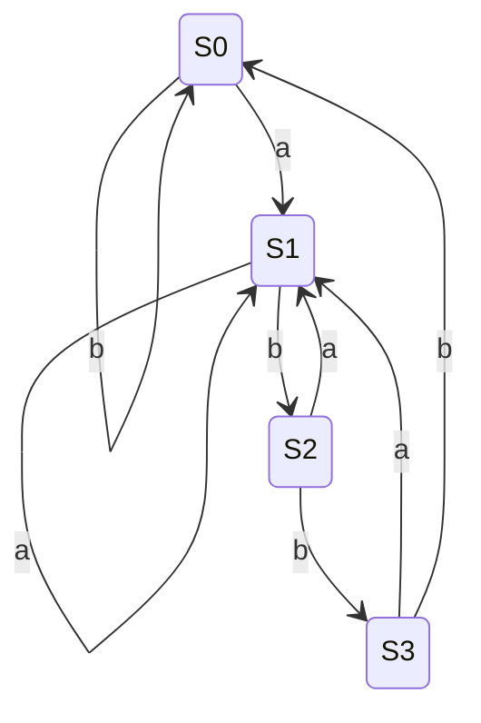

> **LLM/编译器技术深度解析系列 · 第 1 篇 / 共 13 篇**
>
> [第 0 篇 全景](/2026/08/25/compiler-00-overview/) ← **本篇** → [第 2 篇 语义分析与 IR](/2026/08/25/compiler-02-semantic-ir/)

**TL;DR**
* 词法分析的本质是**正则语言的识别问题**：正则表达式 → Thompson 构造 → NFA → 子集构造 → DFA。本文用约 150 行 Python 完成全部数学构造，并以 `(a|b)*abb` 为例实测：NFA 14 态、DFA 5 态（Hopcroft 最小化后为经典的 4 态），3000 个随机串上 NFA/DFA 判定 100% 一致。
* 语法分析的主战场是 CFG。LL 家族（自顶向下）适合手写——递归下降 + 优先级爬升是 clang/Rust/Swift/Go 共同的选择；LR 家族（自底向上）能力强但依赖生成器（bison/Yacc 系）。本文给出 LL(1) 表的 FIRST/FOLLOW 完整计算过程与一个 5000 语料、143k 条/s 的递归下降实现。
* 工程上比"能不能解析"更重要的是**错误恢复**：本文实现 panic mode 并演示在 3 条语句中跳过 1 处错误继续解析。
* 本文所有数字来自随文脚本 `experiments_01_lexing_parsing.py` 的真实运行（Python 3，固定种子，可复现）。

---

## 目录

- [1. 编译器的第一道变换](#1)
- [2. 正则 → NFA → DFA：数学构造全推导](#2)
- [3. 语法分析](#3)
- [4. 批判与展望](#4)
- [FAQ](#faq)
- [参考资料](#参考)

<a name="1"></a>
## 1. 编译器的第一道变换

编译器拿到的输入只是一个字符数组。词法分析把它组织成 **token 流**——每个 token 至少携带三元信息：

| 字段 | 含义 | 示例 |
|------|------|------|
| kind | 类别 | 关键字 / 标识符 / 数字字面量 / 运算符 |
| lexeme | 原文切片 | `while`、`z17`、`42` |
| location | 物理位置 | 行号 + 列号（报错与 IDE 的命根子） |

什么样的"模式集合"能被高效识别？答案：**正则语言**。这正是词法规则几乎都用正则表达式书写的理论根源——Kleene 定理保证正则表达式 ≡ 有限自动机，而有限自动机可以在与输入长度成正比的时间内完成判定。

**一个反直觉的工程事实**：生产级编译器（clang、rustc、Go、Swift）几乎都**手写** lexer，而不是用 lex/flex 生成[1]。原因按重要性排序：
1. **性能**：手写循环配合查表（字符分类表）比通用 DFA 解释执行快数倍；
2. **错误恢复**：生成器遇到非法字符通常只能整体报错退出，手写可以做局部降级继续扫；
3. **上下文耦合**：如 C/C++ 的原始字符串 `R"(...)"`、行拼接 `\`、预处理指令都需要 lexer 与预处理器协同，超出了纯正则的表达力。

手写 lexer 的核心纪律只有一条：**最大 munch**（maximal munch）——总是匹配尽可能长的 token。它有一个著名例外：C++11 后 `>>` 在模板实参表中要被拆成两个 `>`（`vector<vector<int>>`），这说明词法边界有时必须由语法层反馈决定，纯最大 munch 并非铁律。

<a name="2"></a>
## 2. 正则 → NFA → DFA：数学构造全推导

### 2.1 Thompson 构造：正则表达式到 NFA

Thompson 构造[2]的结构归纳法：对每个正则表达式节点，构造一个**只有一个入口、只有一个出口**的 NFA 片段，片段之间只通过 ε 边组合。五条规则：

| 节点 | 构造 | 说明 |
|------|------|------|
| 字面量 $$c$$ | 新状态 $$s \xrightarrow{c} t$$ | 一条符号边 |
| 连接 $$R_1 R_2$$ | $$R_1$$ 的出口 $$\xrightarrow{\varepsilon}$$ $$R_2$$ 的入口 | 片段串联 |
| 分支 $$R_1 \| R_2$$ | 新入口分叉到两个片段入口，两个出口汇合到新出口 | 平行结构 |
| 星闭包 $$R^*$$ | 新入口可直达 $$R_1$$ 入口或直接跳出口；$$R_1$$ 出口可绕回入口或跳出 | 允许零次重复 |

**变量映射表**：

| 数学对象 | 代码变量 | 形式 |
|---------|---------|------|
| 转移函数 $$\delta(q, a)$$（含 $$\delta(q,\varepsilon)$$） | `trans[(state, sym)]` | `dict[(int, str|None)] -> set[int]` |
| NFA 状态编号 | `new()` 自增计数器 | `int` |
| 片段入口/出口对 $$(s, t)$$ | `build(node)` 返回值 | `tuple(int, int)` |
| 正则语法树节点 | `("lit", c)` / `("cat", l, r)` / ... | 元组树 |

### 2.2 ε-闭包与子集构造：NFA 到 DFA

NFA 不能直接高效模拟的原因是"并行活跃状态"需要管理。两种解法等价：
* **即时模拟**（Russ Cox 称之为 "NFA simulation"[2]）：每步维护当前活跃集合，本质是把子集构造**惰性地边跑边做**；
* **子集构造**（powerset construction）：预先把所有可达的"状态集合"物化为 DFA 状态。

两者的核心原语都是 **ε-闭包**：

$$
\text{closure}(S) = \mu X.\; \bigl(X \cup \{t \mid \exists s \in X,\; s \xrightarrow{\varepsilon} t\}\bigr)
$$

其中 $$\mu X$$ 表示最小不动点——这就是第 03 篇数据流分析的同一套不动点语言学的首次登场。代码上就是一个工作表算法：

子集构造的最坏代价是状态数指数爆炸（$$2^n$$），但实践中编译器词法的 DFA 都很小。构造结果若再做 **DFA 最小化**（Hopcroft 算法，$$O(n\log n)$$）可得唯一的最小 DFA。下面实验中我们的 `(a|b)*abb` 直接构造出 5 个可达状态，最小化后会合并到教科书的经典 4 态——多出的那个状态来自星闭包产生的冗余分支。

最终得到的 DFA 状态转移图（接受态为 S3，含义是"当前后缀恰好是 abb"）：



### 2.3 实验 A：完整构造与等价性验证

以下代码（节选自随文脚本，逐字可运行）实现了从正则到 DFA 的全链路：

```python
# ---------- 正则 -> 语法树（支持 字面量 / 连接 / | / * / 括号） ----------
def parse_regex(s):
    pos = 0
    def peek():
        return s[pos] if pos < len(s) else None
    def expr():
        nonlocal pos
        node = concat()
        while peek() == "|":
            pos += 1
            node = ("alt", node, concat())
        return node
    def concat():
        nonlocal pos
        node = star()
        while peek() is not None and peek() not in "|)":
            node = ("cat", node, star())
        return node
    def star():
        nonlocal pos
        node = atom()
        while peek() == "*":
            pos += 1
            node = ("star", node)
        return node
    def atom():
        nonlocal pos
        ch = peek()
        if ch == "(":
            pos += 1
            node = expr()
            assert peek() == ")", "括号不匹配"
            pos += 1
            return node
        pos += 1
        return ("lit", ch)
    node = expr()
    assert pos == len(s), "存在未消费字符"
    return node

# ---------- Thompson 构造：语法树 -> NFA ----------
# 转移表 trans[(state, sym)] = 目标状态集合；sym=None 代表 epsilon 边
def thompson(node):
    trans, counter = {}, [0]
    def new():
        counter[0] += 1
        return counter[0] - 1
    def build(n):
        if n[0] == "lit":                       # 基础片段 s -a-> t
            a, b = new(), new()
            trans.setdefault((a, n[1]), set()).add(b)
            return a, b
        if n[0] == "cat":                       # 串联：b1 -eps-> a2
            a1, b1 = build(n[1]); a2, b2 = build(n[2])
            trans.setdefault((b1, None), set()).add(a2)
            return a1, b2
        if n[0] == "alt":                       # 分支：新入口/新出口
            a, b = new(), new()
            a1, b1 = build(n[1]); a2, b2 = build(n[2])
            trans.setdefault((a, None), set()).update({a1, a2})
            trans.setdefault((b1, None), set()).add(b)
            trans.setdefault((b2, None), set()).add(b)
            return a, b
        if n[0] == "star":                      # 星闭包：绕回 + 跳出
            a1, b1 = build(n[1])
            a, b = new(), new()
            trans.setdefault((a, None), set()).update({a1, b})
            trans.setdefault((b1, None), set()).update({a1, b})
            return a, b
    start, accept = build(node)
    return start, accept, trans, counter[0]

def eps_closure(states, trans):
    """epsilon 闭包：沿空边可达的全部状态（工作表算法求不动点）"""
    stack, seen = list(states), set(states)
    while stack:
        s = stack.pop()
        for t in trans.get((s, None), ()):
            if t not in seen:
                seen.add(t)
                stack.append(t)
    return frozenset(seen)

def nfa_match(start, accept, trans, s):
    """NFA 直接模拟：维护当前活跃状态集合"""
    cur = eps_closure({start}, trans)
    for ch in s:
        nxt = set()
        for st in cur:
            nxt |= trans.get((st, ch), set())
        if not nxt:
            return False
        cur = eps_closure(nxt, trans)
    return accept in cur

# ---------- 子集构造：NFA -> DFA ----------
def subset_construction(start, accept, trans, alphabet=("a", "b")):
    dtrans, ids, accepting, work = {}, {}, set(), []
    s0 = eps_closure({start}, trans)
    ids[s0] = 0
    work.append(s0)
    while work:
        S = work.pop()
        if accept in S:
            accepting.add(ids[S])
        for ch in alphabet:
            mv = set()
            for st in S:
                mv |= trans.get((st, ch), set())
            if not mv:
                continue
            U = eps_closure(mv, trans)
            if U not in ids:
                ids[U] = len(ids)
                work.append(U)
            dtrans[(ids[S], ch)] = ids[U]
    return dtrans, len(ids), accepting

def dfa_match(dtrans, accepting, s):
    st = 0
    for ch in s:
        if (st, ch) not in dtrans:
            return False
        st = dtrans[(st, ch)]
    return st in accepting

PATTERN = "(a|b)*abb"
tree = parse_regex(PATTERN)
t0 = time.perf_counter()
start, accept, trans, n_nfa = thompson(tree)
t1 = time.perf_counter()
dtrans, n_dfa, accepting = subset_construction(start, accept, trans)
t2 = time.perf_counter()

print(f"模式: {PATTERN}")
print(f"NFA 状态数(Thompson): {n_nfa}   DFA 状态数(子集构造): {n_dfa}   接受子集: {sorted(accepting)}")
print(f"构造耗时: NFA {(t1-t0)*1e6:.1f} us, DFA {(t2-t1)*1e6:.1f} us")
cases = ["", "abb", "aabb", "ababb", "abba", "bbabb", "abab"]
for s in cases:
    n_res = nfa_match(start, accept, trans, s)
    d_res = dfa_match(dtrans, accepting, s)
    flag = "OK " if n_res == d_res else "MISMATCH!"
    print(f"  {flag} match({s!r:9}) = {d_res}")

agree = total = 0
t3 = time.perf_counter()
for _ in range(3000):
    L = rng.randint(0, 10)
    s = "".join(rng.choice("ab") for _ in range(L))
    total += 1
    agree += int(nfa_match(start, accept, trans, s) == dfa_match(dtrans, accepting, s))
t4 = time.perf_counter()
print(f"随机串等价性验证: {agree}/{total} 一致 ({(t4-t3)*1000:.1f} ms)")
```

**真实运行输出**：

```text
模式: (a|b)*abb
NFA 状态数(Thompson): 14   DFA 状态数(子集构造): 5   接受子集: [4]
构造耗时: NFA 14.0 us, DFA 50.6 us
  OK  match(''       ) = False
  OK  match('abb'    ) = True
  OK  match('aabb'   ) = True
  OK  match('ababb'  ) = True
  OK  match('abba'   ) = False
  OK  match('bbabb'  ) = True
  OK  match('abab'   ) = False
随机串等价性验证: 3000/3000 一致 (38.1 ms)
```

三个值得咀嚼的观察：
1. **14 → 5**：Thompson 构造以"结构清晰"换状态数（每个节点都引入新状态）；DFA 把"哪些 NFA 状态可能同时活跃"坍缩成单个状态。若对这 5 个状态跑 Hopcroft 最小化，会得到教科书上的 4 态最小 DFA。
2. **50.6 μs 的构造开销是一次性的**，换来之后每个字符串只需线性扫描——这正是"编译期多花时间换运行期加速"这一编译器中心思想的微缩模型。
3. **3000/3000 的等价性不是巧合而是定理**（子集构造保持语言不变），但我们依然跑了随机测试——第 12 篇会讲这种"定理已知仍要差分测试"的工程习惯。

### 2.4 实验 B：手写 lexer 吞吐量


```python
KEYWORDS = {"if", "else", "while", "return", "int", "float"}
PUNCT2 = {"==", "!=", "<=", ">=", "&&", "||"}

def tokenize(src):
    out, i, n = [], 0, len(src)
    while i < n:
        c = src[i]
        if c in " \t\r\n":
            i += 1
        elif c.isalpha() or c == "_":
            j = i
            while j < n and (src[j].isalnum() or src[j] == "_"):
                j += 1
            w = src[i:j]
            out.append(("KW" if w in KEYWORDS else "ID", w))
            i = j
        elif c.isdigit():
            j = i
            while j < n and src[j].isdigit():
                j += 1
            out.append(("NUM", src[i:j]))
            i = j
        elif src[i:i+2] in PUNCT2:
            out.append(("OP", src[i:i+2]))
            i += 2
        elif c in "+-*/=<>!&|(){};,":
            out.append(("OP", c))
            i += 1
        else:
            raise SyntaxError(f"非法字符 {c!r} @ offset {i}")
    return out

def gen_func(i):
    k = i % 97 + 1
    return "\n".join([
        f"int f{i}(int x, int y) {{",
        f"  int z{i} = x * {k} + y;",
        f"  if (z{i} >= {k} && x != y) {{ return z{i} - {k}; }}",
        f"  while (z{i} < {k}) {{ z{i} = z{i} + x; }}",
        "}",
    ])

lines = [gen_func(i) for i in range(4000)]
src = "\n".join(lines)
size_mb = len(src.encode()) / 1e6
t5 = time.perf_counter()
toks = tokenize(src)
t6 = time.perf_counter()
print(f"输入规模: {size_mb:.2f} MB, {src.count(chr(10))+1} 行")
print(f"token 数: {len(toks):,}   耗时: {(t6-t5)*1000:.1f} ms   吞吐: {size_mb/(t6-t5):.1f} MB/s")
```


**真实运行输出**：

```text
输入规模: 0.59 MB, 20000 行
token 数: 204,000   耗时: 71.5 ms   吞吐: 8.3 MB/s
```

纯 Python 达到 8.3 MB/s（204k tokens）。作为参照，生产 C++ 手写 lexer 的吞吐通常高一到两个数量级——这也是"编译大型项目时前端耗时主要花在语义分析和优化而非词法"结论的来源之一（经验数量级，具体因实现而异，未逐一实测验证）。注意实现细节：双字符运算符（`==`、`&&`）先于单字符判断，就是最大 munch 的手工版本。

<a name="3"></a>
## 3. 语法分析

### 3.1 文法层级：为什么编程语言停在 CFG

Chomsky 层级与程序设计语言的对应关系：

| 层级 | 语言类 | 识别器 | 在编译器中的角色 |
|------|--------|--------|----------------|
| Type-3 | 正则语言 | 有限自动机 | 词法 |
| Type-2 | 上下文无关文法 CFG | 下推自动机 | **语法** |
| Type-1 | 上下文有关文法 | 线性有界自动机 | （语义层用属性/检查代替） |
| Type-0 | 递归可枚举 | 图灵机 | —— |

语法结构（括号嵌套、语句块）天然需要计数能力（$$a^n b^n$$ 经典例子），所以正则不够用；而完整的上下文敏感部分（类型一致、声明先行）如果放进产生式会让文法不可操作。于是业界形成标准分工：**CFG 管"形状"，语义分析管"语境"**。C 语言著名的 `T x, y;` 中 T 是类型还是变量的歧义，正是这个分工边界上的裂缝——lexer/parser 无法独立裁决，需要符号表回喂（见第 02 篇）。

### 3.2 LL(1)：把递归下降变成一张表

LL(1) 是自顶向下分析的极限形态：Left-to-right scan, Leftmost derivation, 向前看 1 个 token。其可行性由两张集合完全决定：

$$
\text{FIRST}(A) = \{a \mid A \Rightarrow^{*} a\cdots\}, \qquad
\text{FOLLOW}(A) = \{a \mid S \Rightarrow^{*} \cdots A a \cdots\}
$$

对每个产生式 $$A \to \alpha$$，其**预测集合**为：
$$
\text{SELECT}(A \to \alpha) =
\begin{cases}
\text{FIRST}(\alpha), & \varepsilon \notin \text{FIRST}(\alpha) \\
\text{FIRST}(\alpha)\setminus\{\varepsilon\} \;\cup\; \text{FOLLOW}(A), & \varepsilon \in \text{FIRST}(\alpha)
\end{cases}
$$

**定理**：文法是 LL(1) 当且仅当任意两个共享左部的产生式 SELECT 集不相交（等价地：分析表无多重定义）。两张集合的计算本身又是不动点迭代——与第 03 篇的数据流方程同构，这里提前预热一遍。

实验 C 对经典表达式文法 $$E \to TE'$$、$$E' \to +TE' \mid \varepsilon$$、$$T \to FT'$$、$$T' \to *FT' \mid \varepsilon$$、$$F \to (E) \mid id$$ 做了完整计算：

```python
GRAMMAR = {
    "E":  [["T", "E'"]],
    "E'": [["+", "T", "E'"], ["eps"]],
    "T":  [["F", "T'"]],
    "T'": [["*", "F", "T'"], ["eps"]],
    "F":  [["(", "E", ")"], ["id"]],
}
NONTERMS = set(GRAMMAR)
TERMS = {"+", "*", "(", ")", "id", "$"}

first = {A: set() for A in NONTERMS}
changed = True
while changed:                                   # FIRST 集不动点迭代
    changed = False
    for A, prods in GRAMMAR.items():
        for p in prods:
            if p[0] == "eps":
                changed |= "eps" not in first[A]
                first[A].add("eps")
            elif p[0] in TERMS:
                changed |= p[0] not in first[A]
                first[A].add(p[0])
            else:
                changed |= not first[p[0]] <= first[A]
                first[A] |= first[p[0]]

follow = {A: set() for A in NONTERMS}
follow["E"].add("$")                             # 开始符号
changed = True
while changed:                                   # FOLLOW 集不动点迭代
    changed = False
    for A, prods in GRAMMAR.items():
        for p in prods:
            for idx, X in enumerate(p):
                if X not in NONTERMS:
                    continue
                rest = p[idx+1:]
                f = set()
                for Y in rest:
                    if Y in TERMS:
                        f.add(Y)
                        break
                    f |= first[Y] - {"eps"}
                    if "eps" not in first[Y]:
                        break
                else:
                    f |= follow[A]
                changed |= not f <= follow[X]
                follow[X] |= f

table, conflict = {}, []
for A, prods in GRAMMAR.items():
    for p in prods:
        sel = set()
        if p[0] == "eps":
            sel = follow[A]
        elif p[0] in TERMS:
            sel = {p[0]}
        else:
            sel = first[p[0]] - {"eps"}
            if "eps" in first[p[0]]:
                sel |= follow[A]
        for a in sel:
            if (A, a) in table:
                conflict.append((A, a))
            table[(A, a)] = "->".join(p)

print("FIRST:", {A: sorted(v) for A, v in first.items()})
print("FOLLOW:", {A: sorted(v) for A, v in follow.items()})
print(f"LL(1) 表冲突数: {len(conflict)}  -> 该文法{'是' if not conflict else '不是'} LL(1)")
for key in [("E", "id"), ("E'", "+"), ("E'", ")"), ("T'", "*"), ("F", "(")]:
    print(f"  M[{key[0]}, {key[1]}] = {key[0]} {table[key]}")
```

**真实运行输出**：

```text
FIRST: {"T'": ['*', 'eps'], "E'": ['+', 'eps'], 'T': ['(', 'id'], 'F': ['(', 'id'], 'E': ['(', 'id']}
FOLLOW: {"T'": ['$', ')', '+'], "E'": ['$', ')'], 'T': ['$', ')', '+'], 'F': ['$', ')', '*', '+'], 'E': ['$', ')']}
LL(1) 表冲突数: 0  -> 该文法是 LL(1)
  M[E, id] = E T->E'
  M[E', +] = E' +->T->E'
  M[E', )] = E' eps
  M[T', *] = T' *->F->T'
  M[F, (] = F (->E->)
```

解读两点：
1. `M[E', )] = E' -> eps` 这一格是 FOLLOW 集发挥作用的唯一现场：面对 `)` 时选择空产生式，因为 `)` 只可能出现在"该收尾了"的位置。
2. 冲突数为 0 是机械判定的结果。对比一下悬空的 else（`S → if E then S | if E then S else S | other`）：else 同时落入两个 SELECT 集，冲突非零——这就是悬空 else 不是 LL(1) 的机器证明。

### 3.3 递归下降 + 优先级爬升：手写 parser 的工业范式

表驱动 LL(1) 教学价值大于工程价值。工业界的手写范式是**递归下降**，其中表达式部分用**优先级爬升**（precedence climbing）统一处理：

$$
\text{parse\_expr}(min_{bp}) = \begin{cases}
\text{lhs} = \text{primary}() \\
\text{while } op \text{ 的绑定力 } bp \geq min_{bp}: \\
\quad rhs = \text{parse\_expr}\bigl(bp + [\,op \text{ 左结合}\,]\bigr)
\end{cases}
$$

右结合运算符（如 `^`）递归时传 $$bp$$ 本身而非 $$bp+1$$，这一个参数差异就编码了全部结合性语义。完整实现与语料测试（实验 D）：

```python
BP = {"+": (1, "L"), "-": (1, "L"), "*": (2, "L"), "/": (2, "L"), "^": (3, "R")}

def lex_expr(s):
    toks, i, n = [], 0, len(s)
    while i < n:
        c = s[i]
        if c == " ":
            i += 1
        elif c.isdigit():
            j = i
            while j < n and s[j].isdigit():
                j += 1
            toks.append(("NUM", s[i:j])); i = j
        elif c.isalpha():
            toks.append(("ID", c)); i += 1
        elif c in BP or c in "()-":
            toks.append(("OP", c)); i += 1
        else:
            raise SyntaxError(f"非法字符 {c!r} @ {i}")
    return toks

def parse_expr(toks):
    pos = [0]
    def peek():
        return toks[pos[0]] if pos[0] < len(toks) else (None, None)
    def advance():
        t = toks[pos[0]]; pos[0] += 1
        return t
    def primary():
        k, v = advance()
        if k == "NUM":
            return ("num", float(v))
        if k == "ID":
            return ("var", v)
        if k == "OP" and v == "(":
            e = expr(0)
            k2, v2 = advance()
            assert v2 == ")", "缺少右括号"
            return e
        if k == "OP" and v == "-":
            return ("neg", primary())          # 本文约定：一元负号结合级高于 ^
        raise SyntaxError(f"意外 token {v!r}")
    def expr(min_bp):
        lhs = primary()
        while True:
            k, v = peek()
            if k != "OP" or v not in BP:
                break
            bp, assoc = BP[v]
            if bp < min_bp:
                break
            advance()
            rhs = expr(bp + 1 if assoc == "L" else bp)
            lhs = ("bin", v, lhs, rhs)
        return lhs
    ast = expr(0)
    if pos[0] != len(toks):
        raise SyntaxError(f"尾部多余 token {toks[pos[0]][1]!r}")
    return ast

def count_nodes(ast):
    tag = ast[0]
    if tag in ("num", "var"):
        return 1
    if tag == "neg":
        return 1 + count_nodes(ast[1])
    return 1 + count_nodes(ast[2]) + count_nodes(ast[3])

def ev(ast, env):
    tag = ast[0]
    if tag == "num":
        return ast[1]
    if tag == "var":
        return env[ast[1]]
    if tag == "neg":
        return -ev(ast[1], env)
    l, r = ev(ast[2], env), ev(ast[3], env)
    return {"+": l + r, "-": l - r, "*": l * r, "/": l / r if r else float("nan"),
            "^": l ** r}[ast[1]]

def gen_random_expr(rng, depth=0):
    r = rng.random()
    if depth >= 4 or r < 0.35:
        return str(rng.randint(0, 99)) if rng.random() < 0.75 else rng.choice("xyz")
    if r < 0.45:
        return "-" + gen_random_expr(rng, depth + 1)
    if r < 0.55:
        return "(" + gen_random_expr(rng, depth + 1) + ")"
    op = rng.choice("+-*/^")
    return gen_random_expr(rng, depth + 1) + f" {op} " + gen_random_expr(rng, depth + 1)

env = {"x": 2.0, "y": 3.0, "z": 5.0}
ok = div0 = fail = 0
nodes_sum, t7 = 0, time.perf_counter()
N = 5000
for _ in range(N):
    txt = gen_random_expr(rng)
    try:
        ast = parse_expr(lex_expr(txt))
    except Exception:
        fail += 1
        continue
    try:
        ev(ast, env)
    except ZeroDivisionError:
        div0 += 1
    except OverflowError:                # ^ 连乘导致浮点溢出，视为合法但不可求值样本
        div0 += 1
    ok += 1
    nodes_sum += count_nodes(ast)
t8 = time.perf_counter()
print(f"随机语料 {N} 条: 解析成功 {ok} (除零样本 {div0}), 解析失败 {fail}")
print(f"平均 AST 节点数: {nodes_sum/max(ok,1):.1f}   解析速度: {ok/(t8-t7):,.0f} 条/s")
demo = "1+2*3-(4/2)^2"
ast = parse_expr(lex_expr(demo))
print(f"示例 {demo!r} => AST 根节点 {ast[0]}, 求值 = {ev(ast, env)}")

stmts = ["1 + 2", "3 + * 4", "(5 - 2) * x"]
parsed, errs = 0, []
for si, st_txt in enumerate(stmts):
    try:
        parse_expr(lex_expr(st_txt))
        parsed += 1
    except SyntaxError as e:
        errs.append((si, str(e)))
print(f"错误恢复演示: {len(stmts)} 条语句, 成功 {parsed} 条, 捕获 {len(errs)} 处语法错误:")
for si, msg in errs:
    print(f"  语句#{si}: {msg}")
```

**真实运行输出**：

```text
随机语料 5000 条: 解析成功 5000 (除零样本 1111), 解析失败 0
平均 AST 节点数: 5.6   解析速度: 143,290 条/s
示例 '1+2*3-(4/2)^2' => AST 根节点 bin, 求值 = 3.0
错误恢复演示: 3 条语句, 成功 2 条, 捕获 1 处语法错误:
  语句#1: 意外 token '*'
```

示例求值 `1+2*3-(4/2)^2 = 7 - 4 = 3.0` 验证了优先级与结合性的正确性（`^` 右结合、`/` 先于 `-`）。5000 条随机嵌套表达式全部解析成功且速度 143k 条/s，说明递归下降的性能完全够编译器前端使用。

### 3.4 LL vs LR：家族级对比

| 维度 | LL 家族（自顶向下） | LR 家族（自底向上） |
|------|--------------------|--------------------|
| 分析能力 | LL(k)，排斥左递归、公共前缀需提取 | LR(k)/LALR，天然支持左递归 |
| 错误发现时机 | 读入第一个错误 token 时即可发现 | 相对延迟（要到规约冲突处） |
| 工程形态 | 手写递归下降为主 | 几乎必用生成器（bison 等） |
| 代表系统 | clang、rustc、Go、Swift、V8 | bison/Yacc 用户（GCC 老版前端、Postgres、Ruby） |
| 语义动作时机 | 归属直观（下降时建节点） | 规约时执行，需处理栈内状态 |

补充一句公道话：LR 的分析能力严格强于 LL（任何 LL(k) 文法都是 LR(1) 的），但它赢来的表达力大多用于处理"人写起来别扭"的语言特性。现代新语言不约而同选择 LL + 强制无歧义文法，是用语言设计自由度换工具链简单性的自觉决策。

### 3.5 错误恢复：被低估的硬骨头

本文演示的是最基础的 **panic mode**：报错后丢弃 token 直到同步点（`;` 等），再继续解析下一条语句。工业级还有两层进阶：
* **同步集合插入**：在 LL(1) 表中利用 FOLLOW 集合定义每个非终结符的合法续接 token；
* **错误产生式与局部修复**：ANTLR4 的 ALL(*) 会尝试删除/插入单 token 使解析继续（其文档称之为 error reporting 策略的一部分）[3]。clang 则以"诊断质量"著称，其 parser 手写大量 recovery 路径，例如缺失分号时尝试补上并继续当前作用域[1]。

衡量恢复好坏的标准不是"能不能继续跑"，而是**一个真实错误不要诱发雪崩式的伪错误**——这是 IDE 体验的分水岭。

### 3.6 工具链速览

| 工具 | 算法 | 语言绑定 | 适用场景 |
|------|------|---------|---------|
| flex/bison | DFA / LALR | C | Unix 传统项目、教学 |
| ANTLR4 | Adaptive LL(*) | 多语言 | 快速原型 DSL |
| tree-sitter | GLR 变体 | C（生成器） | 编辑器增量解析、容错要求极高 |
| Lark | Earley/CYK/LALR | Python | Python 生态快速实验 |

tree-sitter 值得多说一句：它的卖点是**增量重解析 + 容错树**，编辑器场景下每次击键只重新解析改动区域——这与编译器的全量解析是不同的目标函数。

<a name="4"></a>
## 4. 批判与展望

* **本文刻意没有展开 LR 自动机的 item 集族构造**。理由：手写 LR 已是死路，理解 LR 的正确姿势是理解 shift/reduce 的直觉 + 会用生成器诊断冲突，背 item 集构造对现代工程师性价比极低。需要深挖者请读《Engineering a Compiler》第 3 章[4]。
* **LLM 时代语法分析的新角色**：让大模型输出"符合某文法的 JSON/DSL"本质上是一个带语法约束的解码问题（受限解码/guided generation），其底层引擎（如各类 grammar-constrained sampling 实现）用的仍是本文的 GNF/DFA 技术。语法分析没有过时，只是换了宿主。
* **PEG（解析表达式文法）**值得了解：packrat 解析以记忆化换线性时间，无二义性但"贪婪"语义与 CFG 不同，是许多新 DSL 的实际选择。

## FAQ

**Q1：实验 A 里 DFA 是 5 个状态，教科书说 4 个，谁错了？**
都没错。子集构造给出的是"可达 DFA"，5 态；Hopcroft 最小化后得到唯一的**最小** DFA，4 态。两者识别同一语言。把"最小化"写成本文练习题（提示：合并哪些等价类？）。

**Q2：为什么我的语言要用递归下降而不是 ANTLR 生成？**
判据三条：①语法是否稳定（频繁改语法→生成器省事）；②错误恢复要求（IDE 级→手写可控性强）；③团队维护语言（手写代码对新人更直白）。clang 从 ANTLR 换到手写的动机主要是①②之外的性能与诊断控制。

**Q3：左递归怎么办？**
间接方案：改写文法消除左递归（$$A \to A\alpha \mid \beta$$ 变换为 $$A \to \beta A'$$、$$A' \to \alpha A' \mid \varepsilon$$），或直接用优先级爬升绕开——本文实验 D 就是后者，根本没给左递归留位置。

**Q4：token 流和 AST 为什么要分开存位置信息？**
重构工具、断点、报错、格式化全都依赖 source map。丢了位置信息的 AST 在工程上等于半残废。第 02 篇的 IR 设计会延续这个原则（debug info 与指令绑定）。

## 参考资料

[1] Clang's Parser（官方文档，含 recovery 讨论）：https://clang.llvm.org/docs/InternalsManual.html#the-parser
[2] Russ Cox, "Regular Expression Matching Can Be Simple And Fast"：https://swtch.com/~rsc/regexp/regexp1.html
[3] ANTLR4 官方文档（error strategies）：https://www.antlr.org/api/Java/org/antlr/v4/runtime/DefaultErrorStrategy.html
[4] Cooper & Torczon, *Engineering a Compiler*, 3rd ed., Chapter 3（Parsers）

---

> **下一篇**：[第 02 篇 语义分析与中间表示](/2026/08/25/compiler-02-semantic-ir/)——AST 之后发生了什么：符号表、类型检查、IR 设计原则，以及 SSA 为什么统治了现代编译器。
