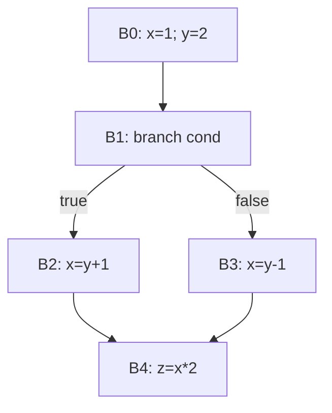

> **LLM/编译器技术深度解析系列 · 第 2 篇 / 共 13 篇**
>
> [第 1 篇 词法与语法](/2026/08/25/compiler-01-lexing-parsing/) ← **本篇** → [第 3 篇 数据流分析与中端优化](/2026/08/25/compiler-03-dataflow-opt/)

**TL;DR**
* 语法树只保证"形状合法"，语义分析负责 CFG 管不了的约束：声明先于使用、类型相容、作用域规则。本文实现了一个带作用域栈的符号表与类型检查器，10 条注入语句准确检出 4 个诊断，并演示 shadowing 与作用域弹栈的正确性。
* 中间表示（IR）是编译器的"宪法"。本文给出 IR 的三种形态（树形/线性/图形）与设计准则清单，然后聚焦统治现代编译器的 **SSA**：用完整可运行代码实现支配集计算 → 支配边界（CHK 算法）→ 最小 SSA φ 函数放置 → Cytron 重命名，最终在菱形 CFG 上得到教科书级结果 `x4 = phi(x2 from B2, x3 from B3)`。
* 实现过程中我们踩了三个真实的坑（φ 版本创建时机、操作数回填时机、idom 提取的方向谓词），每一个都对应算法的一个微妙不变量——这些坑比算法本身更有教学价值，全部原样呈现在 §3.5。
* 本文所有输出来自随文脚本 `experiments_02_semantic_ir.py` 的真实运行。

---

## 目录

- [1. 语义分析](#1)
- [2. 中间表示的设计空间](#2)
- [3. 从三地址码到 SSA：完整算法实测](#3)
- [4. 批判与展望](#4)
- [FAQ](#faq)
- [参考资料](#参考)

<a name="1"></a>
## 1. 语义分析

### 1.1 符号表：作用域栈的工程形态

符号表要回答的唯一问题是："名字 \(x\) 在此处指什么？"支持块级作用域的标准实现是**作用域栈**——每个 `{}` 进入时压入一张新表，退出时弹出；查找由内向外。这个数据结构平凡，但两个细节决定工程质量：

1. **重声明的判定只看当前层**：C/C++ 允许内层 shadowing 外层，但同层重复声明报错；
2. **查找必须走完整的链**：任何一层命中即停，这决定了 shadowing 的语义。

### 1.2 类型检查：从推导规则到代码

类型系统的教科书写法是自然演绎风格的推理规则，例如加宽赋值：

$$
\frac{\Gamma \vdash x : \tau \qquad \Gamma \vdash e : \tau' \qquad \tau' \preceq \tau}{\Gamma \vdash x = e\;:\;\text{ok}}
$$

其中 \(\preceq\) 是子类型/可转换关系（本文取 `int ⪯ float` 即加宽允许、收窄报错）。实现就是把每条规则的横线上方变成 if 条件、下方变成动作。下面是完整实现与注入测试：

```python
class SymTab:
    """作用域栈：每个作用域一个 dict，查找沿栈顶向栈底"""
    def __init__(self):
        self.scopes = [{}]
    def push(self):
        self.scopes.append({})
    def pop(self):
        self.scopes.pop()
    def declare(self, name, ty, line):
        cur = self.scopes[-1]
        if name in cur:
            return f"[line {line}] 重声明错误: '{name}' 在当前作用域已存在"
        cur[name] = ty
        return None
    def lookup(self, name):
        for scope in reversed(self.scopes):          # 由内层向外层
            if name in scope:
                return scope[name]
        return None

NUMERIC = {"int", "float"}

def check(prog):
    """prog: [(line, kind, payload)] 语句序列"""
    tab = SymTab()
    diags = []
    for line, kind, payload in prog:
        if kind == "decl":
            err = tab.declare(payload["name"], payload["ty"], line)
            if err:
                diags.append(err)
        elif kind == "assign":
            ty = tab.lookup(payload["name"])
            if ty is None:
                diags.append(f"[line {line}] 未声明错误: '{payload['name']}'")
                continue
            vt = payload["vty"]
            if vt != ty and not (vt == "int" and ty == "float"):   # 允许 int->float 加宽
                diags.append(f"[line {line}] 类型错误: 不能把 {vt} 赋给 {ty} 变量 '{payload['name']}'")
        elif kind == "block":
            tab.push()
            sub = check(payload)
            diags.extend(sub)
            tab.pop()
        elif kind == "binop":
            lt, rt = payload["lt"], payload["rt"]
            if lt not in NUMERIC or rt not in NUMERIC:
                diags.append(f"[line {line}] 类型错误: 运算符不支持 {lt} 和 {rt}")
    return diags

prog = [
    (1, "decl",   {"name": "x", "ty": "int"}),
    (2, "decl",   {"name": "y", "ty": "float"}),
    (3, "assign", {"name": "x", "vty": "float"}),      # 收窄：报错
    (4, "assign", {"name": "y", "vty": "int"}),        # 加宽：合法
    (5, "assign", {"name": "w", "vty": "int"}),        # 未声明：报错
    (6, "block", [
        (7, "decl",   {"name": "x", "ty": "float"}),   # 内层 shadowing：合法
        (8, "assign", {"name": "x", "vty": "float"}),  # 查到的是内层 float
    ]),
    (9, "assign", {"name": "x", "vty": "float"}),      # 外层仍是 int：报错
    (10, "binop", {"lt": "string", "rt": "int"}),      # 运算类型错
]
diags = check(prog)
print(f"共注入 10 条语句，检出 {len(diags)} 个诊断:")
for d in diags:
    print("  " + d)
```

**真实运行输出**：

```text
共注入 10 条语句，检出 4 个诊断:
  [line 3] 类型错误: 不能把 float 赋给 int 变量 'x'
  [line 5] 未声明错误: 'w'
  [line 9] 类型错误: 不能把 float 赋给 int 变量 'x'
  [line 10] 类型错误: 运算符不支持 string 和 int
```

最值得看的是 **line 8 vs line 9** 的对照：line 8 把 float 赋给内层的 float `x` 合法；line 9 同样的赋值在外层报错——因为 block 分支递归时压栈、返回后弹栈，外层查到的仍是最初的 int。这就是作用域栈语义的最小完备演示。

### 1.3 当语义反过来喂语法

C 语言里 `T x;` 的 T 可以是 typedef 名也可以是普通变量名，lexer 阶段无法区分——clang 的做法是让 lexer 查询当前符号表的"类型名集合"来决定产生 `typename` 还是 `identifier` token[1]。这是"语义信息回喂词法/语法"的经典案例，也是为什么生产编译器的三个阶段之间并非严格单向流水线。

<a name="2"></a>
## 2. 中间表示的设计空间

### 2.1 三种形态

| 形态 | 代表 | 强项 | 弱项 |
|------|------|------|------|
| 树形 | AST、Clang AST、MLIR 早期操作树 | 结构直观，源级信息保真 | 全局变换需要反复遍历 |
| 线性 | 三地址码、LLVM IR、字节码 | 接近机器，控制流显式，优化算法成熟 | 高层结构（张量、循环嵌套）需重建 |
| 图形 | 数据依赖图/DAG、Sea of Nodes | 数据流关系显式，调度自由度大 | 实现复杂，调试困难 |

AI 编译器普遍采用"线性为主、局部成图"的混合策略：图级 IR 是有向无环图（DAG），算子内部展开为循环 IR（TensorIR/HLO 的 loop body）。这不是偶然——张量程序天然没有复杂控制流，DAG 正好覆盖其语义。

### 2.2 SSA：现代 IR 的通用语

**定义**（静态单赋值）：每个变量在程序文本中**恰好被赋值一次**；当控制流汇合导致多个版本可能到达时，插入 **φ 函数**显式合并：

$$
x_\phi = \phi(x_1 \text{ from } B_i,\; x_2 \text{ from } B_j)
$$

φ 不是真实指令——它是"use-def 边的显式化"，代码生成阶段会被消除（out-of-SSA，见 §3.6）。SSA 带来的三个质变：

1. **use-def 链从"分析结果"降维成"语法事实"**：一个 use 只指向唯一定义，不需要到达定值分析就能遍历 def-use 网络；
2. **优化算法大幅简化**：常量传播在 SSA 上退化为稀疏的条件格上传播（SCCP），死代码消除变成纯粹的 mark-sweep——第 03 篇将逐一兑现这两条；
3. **并行性显式**：不同版本的变量互不干扰，寄存器分配和向量化的干扰分析更干净。

SSA 并非孤例，它与函数式世界的 ANF（A-normal Form[5]）、CPS 是同一思想的三个化身：**把"值的生命周期"编码进语法**。区别只在编码风格：SSA 用版本号+φ，ANF 用 let 绑定串行化，CPS 用续延显式传递控制。

### 2.3 IR 设计准则清单

综合 LLVM LangRef[3]与 MLIR Rationale[4]的立场文件，可提炼出五条可操作的准则：

1. **完备且自洽的语义文档**：LLVM IR 有独立的 Language Reference，未定义行为逐条列举——没有这份文档的 IR 无法支撑跨团队协作；
2. **可降级性**（progressive lowering）：每一层都应能独立验证后再下沉；
3. **位置信息一等公民**：debug metadata 与指令绑定（对应第 01 篇 FAQ Q4 的延续）；
4. **成本模型亲和**：IR 上要能估算代价（LLVM 的 TargetTransformInfo、TVM 的 flop counts），否则 pass 无法做权衡决策；
5. **不可变与共享友好**：pass 间传递的 IR 应默认不可变（或 COW），这让缓存与并行 pass 成为可能。

<a name="3"></a>
## 3. 从三地址码到 SSA：完整算法实测

### 3.1 问题设定与 CFG

以一个菱形控制流为例（B1 为分支块）：



非 SSA 表示下的问题一目了然：`z = x*2` 读到的 `x` 有三个候选定义（B0/B2/B3），哪个生效取决于运行路径。SSA 要做的就是把这个"运行时才能确定的事"提升为语法结构。

### 3.2 支配、idom 与支配边界

三个核心定义：
* **支配**：\(d\) 支配 \(b\)（记 \(d \in Dom(b)\)）当且仅当所有从入口到 \(b\) 的路径都经过 \(d\)；
* **直接支配者 idom(b)**：严格支配 \(b\) 的节点中被其余全部严格支配者所支配的那个——支配树上 \(b\) 的父节点；
* **支配边界 DF(b)**：从 \(b\) 出发不经其支配者可达的汇合点集合——**φ 函数恰好应该放在 DF 里**。

支配集可用标准迭代数据流求出（又是不动点！），idom 可从支配集机械提取，DF 用 Cooper-Harvey-Kennedy 的单遍算法[2]：

```python
BLOCKS = {
    "B0": [("x", "=", ("const", 1)), ("y", "=", ("const", 2))],
    "B1": [],                       # 分支指令单独建模
    "B2": [("x", "=", ("bin", "+", "y", 1))],
    "B3": [("x", "=", ("bin", "-", "y", 1))],
    "B4": [("z", "=", ("bin", "*", "x", 2))],
}
SUCC = {"B0": ["B1"], "B1": ["B2", "B3"], "B2": ["B4"], "B3": ["B4"], "B4": []}
PRED = {b: [p for p in SUCC if b in SUCC[p]] for b in BLOCKS}
ENTRY = "B0"
ORDER = ["B0", "B1", "B2", "B3", "B4"]

# ---------- 1) 支配集：迭代数据流法 ----------
ALL = set(ORDER)
dom = {b: (set([ENTRY]) if b == ENTRY else set(ALL)) for b in ORDER}
changed = True
while changed:
    changed = False
    for b in ORDER:
        if b == ENTRY:
            continue
        new = set.intersection(*(dom[p] for p in PRED[b])) | {b} if PRED[b] else {b}
        if new != dom[b]:
            dom[b] = new
            changed = True
print("支配集 Dom(b):")
for b in ORDER:
    print(f"  Dom({b}) = {sorted(dom[b])}")

# ---------- 2) 直接支配者 idom ----------
idom = {}
for b in ORDER:
    if b == ENTRY:
        continue
    strict = dom[b] - {b}
    # idom(b)：被其余全部严格支配者所支配的那个（即支配链上离 b 最近的）
    cands = [d for d in strict if all(o in dom[d] for o in strict)]
    assert len(cands) == 1, f"idom 不唯一? {b}: {cands}"
    idom[b] = cands[0]
print("直接支配者:", {b: idom[b] for b in ORDER if b != ENTRY})

# ---------- 3) 支配边界 DF（Cooper-Harvey-Kennedy 算法） ----------
DF = {b: set() for b in ORDER}
for b in ORDER:
    ps = PRED[b]
    if len(ps) >= 2:
        for p in ps:
            runner = p
            while runner != idom[b]:
                DF[runner].add(b)
                runner = idom[runner]
print("支配边界 DF(b):", {b: sorted(v) for b, v in DF.items()})
```

**真实运行输出**：

```text
支配集 Dom(b):
  Dom(B0) = ['B0']
  Dom(B1) = ['B0', 'B1']
  Dom(B2) = ['B0', 'B1', 'B2']
  Dom(B3) = ['B0', 'B1', 'B3']
  Dom(B4) = ['B0', 'B1', 'B4']
直接支配者: {'B1': 'B0', 'B2': 'B1', 'B3': 'B1', 'B4': 'B1'}
支配边界 DF(b): {'B0': [], 'B1': [], 'B2': ['B4'], 'B3': ['B4'], 'B4': []}
```

注意 `Dom(B4) = {B0,B1,B4}`：B2、B3 都不支配 B4，因为各自都有绕开自己的路径。支配树因此长成 B0→B1→{B2, B3, B4}——**B4 是 B1 的孩子而非 B2/B3 的**，支配关系与 CFG 边是两回事，初学者最常见的误解就在这里。

CHK 的 DF 算法只有一句话：对每个有多条入边的汇合点 \(j\)，从每个前驱沿 idom 链向上爬直到 `idom(j)`，沿途所有节点的 DF 都包含 \(j\)。正确性依赖支配树的性质，实现不到 10 行。

### 3.3 φ 函数放置：最小 SSA

Cytron 的放置定理：变量 \(v\) 需要 φ 的位置恰是 \(\text{DF}^{+}(\text{defs}(v))\) 的迭代闭包——放入一个 φ 后，该 φ 本身也是新定义，可能诱发更多 φ。工作表算法：

```python
# ---------- 4) 最小 SSA：迭代 DF 放置 phi ----------
defs = {b: {ins[0] for ins in BLOCKS[b]} for b in ORDER}
print("各块定值变量:", defs)
phis = {b: {} for b in ORDER}                    # phis[block][var] = True
for v in sorted({ins[0] for b in ORDER for ins in BLOCKS[b]}):
    worklist = [b for b in ORDER if v in defs[b]]
    ever_on = list(worklist)
    while worklist:
        n = worklist.pop()
        for d in DF[n]:
            if v not in phis[d]:
                phis[d][v] = True
                if d not in ever_on:
                    ever_on.append(d)
                    worklist.append(d)
print("phi 放置结果:", {b: sorted(vs) for b, vs in phis.items() if vs})
phi_args = {b: {v: {} for v in phis[b]} for b in ORDER}   # 放置完成后初始化操作数容器
```

### 3.4 重命名：支配树上的 DFS

放置只解决"哪里放"，重命名解决"叫什么、连什么"。Cytron 算法的骨架：按支配树 DFS，每个变量维护一个**版本栈**；进入块时先为该块的 φ 创建新版本，再翻译语句（此时 use 能看到正确的当前版本），离开前把当前版本回填给后继块的 φ 操作数，最后弹栈恢复现场：

```python
# ---------- 5) 重命名：支配树上 DFS（Cytron 算法） ----------
# 关键顺序：先为本块 phi 建新版本 -> 再翻译本块语句（use 看得到 phi 版本）
#           -> 回填后继块的 phi 操作数 -> 递归支配树孩子 -> 弹栈
version = {v: 0 for v in ("x", "y", "z")}
stacks = {v: [] for v in version}
block_lines = {b: [] for b in ORDER}

def new_name(v):
    version[v] += 1
    nm = f"{v}{version[v]}"
    stacks[v].append(nm)
    return nm

def cur(v):
    return stacks[v][-1] if stacks[v] else f"{v}_undef"

def render(rhs):
    if isinstance(rhs, tuple) and rhs[0] == "bin":
        return f"('bin', '{rhs[1]}', {cur(rhs[2])}, {rhs[3]})"
    return repr(rhs)

children = {b: [] for b in ORDER}
for b, d in idom.items():
    children[d].append(b)

def rename(b):
    pushed = []
    for v in sorted(phis[b]):                    # (1) phi 新版本先行
        nn = new_name(v)
        pushed.append(v)
        block_lines[b].append(f"{nn} = phi(...)   # 待回填")
    for var, _, rhs in BLOCKS[b]:                # (2) 本块语句
        nn = new_name(var)
        pushed.append(var)
        block_lines[b].append(f"{nn} = {render(rhs)}")
    for s in SUCC[b]:                            # (3) 回填后继 phi 操作数
        for v in phis[s]:
            phi_args[s][v][b] = cur(v)
    for c in children[b]:                        # (4) 支配树递归
        rename(c)
    for v in reversed(pushed):                   # (5) 弹栈
        stacks[v].pop()

rename(ENTRY)
print("重命名后的 SSA（按 CFG 顺序）:")
for b in ORDER:
    body = BLOCKS[b]
    head = f"{b}:" + (f"  (branch: cond ? {SUCC[b][0]} : {SUCC[b][1]})" if len(SUCC[b]) >= 2 else "")
    print(head)
    for ln in block_lines[b]:
        print("   ", ln)
print("回填后的 phi:")
for b in ORDER:
    for v, args in phi_args[b].items():
        nm = stacks[v][-1] if False else None    # 找该块中 v 的最新 phi 名：直接扫 block_lines
        for ln in block_lines[b]:
            if ln.startswith((f"{v}",)) and "phi" in ln:
                nm = ln.split("=")[0].strip()
        ops = ", ".join(f"{o} from {p}" for p, o in args.items())
        print(f"  {nm} = phi({ops})")
n_phi = sum(len(vs) for vs in phis.values())
z_line = next(ln for ln in block_lines["B4"] if ln.startswith("z"))
assert "x4" in z_line, f"关键校验失败: B4 应使用 phi 结果 x4, 实际: {z_line}"
print(f"phi 节点总数: {n_phi};  关键校验: B4 中 '{z_line}' 使用了 phi 结果 x4 ✓")

# ---------- 6) 对照：非 SSA 版本的 use-def 歧义演示 ----------
print("\n对照演示——同一程序在非 SSA 表示下:")
print("  B4 中 'z = x*2' 的 x 到底指哪个定义？(B0/B2/B3 三处定值，需到达定值分析消歧)")
print("  SSA 化后: B4 读的是 x4 = phi(x2 from B2, x3 from B3)，use-def 链在语法上闭合")
```

**真实运行输出**：

```text
重命名后的 SSA（按 CFG 顺序）:
B0:
    x1 = ('const', 1)
    y1 = ('const', 2)
B1:  (branch: cond ? B2 : B3)
B2:
    x2 = ('bin', '+', y1, 1)
B3:
    x3 = ('bin', '-', y1, 1)
B4:
    x4 = phi(...)   # 待回填
    z1 = ('bin', '*', x4, 2)
回填后的 phi:
  x4 = phi(x2 from B2, x3 from B3)
phi 节点总数: 1;  关键校验: B4 中 'z1 = ('bin', '*', x4, 2)' 使用了 phi 结果 x4 ✓
```

结果与编译理论完全吻合：唯一的汇合块 B4、唯一的多定值变量 x，恰好需要一个 φ；y 和 z 单一定值全程零 φ。§2.2 承诺的"use-def 链成为语法事实"现在可见：`z1` 的操作数直接就是 `x4` 这个名字本身。

### 3.5 我们真实踩过的三个坑（值得背下来）

第一版实现并非如上所示，以下三个 bug 都真实发生过，每一个都精确对应算法的一个微妙点：

1. **φ 版本创建放在了语句翻译之后** → B4 自己的 `z = ...` 读到旧版本 `x1` 而不是 φ 结果。教训：**进入块的第一件事是为 φ 建新版本**，Cytron 论文里这句话藏在伪代码的顺序里而非正文里。
2. **φ 操作数容器在"进入块时"才初始化** → 前驱 B2 回填时 B4 还没被访问，KeyError。教训：**放置阶段就要建好全部 φ 操作数容器**，重命名阶段只填不改结构。
3. **idom 提取谓词方向写反**（`d ∈ dom(o)` 写成了 `o ∈ dom(d)`）→ B2 的 idom 错标为 B0。教训：支配关系的读向极易混淆，写断言 `assert len(cands)==1`（支配链上离 b 最近者唯一）能在第一时间暴露错误。

这三个坑的共同点是：算法描述都对，实现顺序错一点就全盘皆输。这也是为什么第 12 篇要把 FileCheck 式的结构化断言测试列为编译器工程的头等公民——上面的 `assert "x4" in z_line` 就是一个微型 FileCheck。

### 3.6 尾声：SSA 怎么销毁？

φ 是虚构指令，最终代码生成前要做 **out-of-SSA** 变换：把每个 φ 降为若干并行拷贝（parallel copy），再把并行拷贝序列化到前驱块末尾，同时处理"拷贝交换"的边角情况（swap 问题）。LLVM 的做法是在寄存器分配阶段让 φ 自然消融于 coalescing。细节超出本文范围，记住结论即可：**SSA 是分析的黄金表示，不是执行的物理形态**。

<a name="4"></a>
## 4. 批判与展望

* **Sea of Nodes 对 SSA 的改造**：Click 的 Sea of Nodes[6] 干脆去掉"基本块"这一层级，让节点悬浮成海、调度最后才定。V8/TurboFan 采用此路线，换来极致的调度自由，代价是调试体验和 pass 编写门槛。主流商业编译器分裂成"线性 SSA（LLVM）vs 海图（HotSpot/V8）"两大阵营，至今没有合流的迹象——抽象层级的取舍没有免费午餐。
* **MLIR 的启示**：SSA 不是终点而是"一种方言基因"。MLIR 把"SSA 区域 + 操作"做成元架构，linalg/tensor/vector 各 dialect 共享同一套基础设施[4]。理解了本文的 CFG/支配/SSA，你就理解了 MLIR 所有 dialect 的公共底座。
* **e-graph（相等饱和）正在改写"优化 = pass 序列"的范式**：egg 等系统把重写规则放到等价类图里饱和扩张，再用提取器选最优表达。它不取代 SSA，但挑战了"手工排 pass"的组织方式，值得关注。

## FAQ

**Q1：SSA 和函数式语言的 let 绑定是什么关系？**
本质相同：都是唯一赋值。差别在于 SSA 的 φ 处理控制流汇合而 let 天然串行无此问题；把命令式程序转 ANF 后几乎就是"无 φ 的 SSA + 直线化控制流"。学术上有严格的相互模拟结论（Appel《Modern Compiler Implementation with ML》SSA 一章有讨论[7]）。

**Q2：pruned SSA、minimal SSA、strict SSA 有什么区别？**
minimal SSA 按 DF+ 放 φ 不考虑活性（可能放无用 φ）；pruned 先做活跃变量分析只在活着的汇合点放 φ；strict 要求每个 use 都有到达的 def（不允许读到未初始化版本）。工业实现多为 pruned+strict，本文实验是最小教学版（minimal+strict）。

**Q3：为什么 AI 编译器图 IR 很少谈 SSA？**
其实处处都是——Relax/HLO/StableHLO 的每个算子输出绑定一个唯一的 tensor id，就是 SSA 的张量版；融合 pass 做 def-use 遍历时的便利性与 LLVM 完全一致。只是没人这么叫它。

## 参考资料

[1] Clang Internals Manual（Preprocessor 与 parser 协作）：https://clang.llvm.org/docs/InternalsManual.html
[2] Cooper, Harvey & Kennedy, *A Simple, Fast Dominance Algorithm*: https://www.cs.rice.edu/~keith/EMBED/dom.pdf
[3] LLVM Language Reference：https://llvm.org/docs/LangRef.html
[4] MLIR Rationale：https://mlir.llvm.org/docs/Rationale/
[5] Flanagan et al., The Essence of Compiling with Continuations, PLDI'93: https://doi.org/10.1145/155090.155106
[6] Click, Global Code Motion / Global Value Numbering, PLDI'95: https://doi.org/10.1145/207110.207154
[7] Cytron et al., An Efficient Method of Computing Static Single Assignment Form, POPL'91: https://doi.org/10.1145/115372.115320

---

> **下一篇**：[第 03 篇 数据流分析与中端优化](/2026/08/25/compiler-03-dataflow-opt/)——把"优化为什么正确"说清楚：半格与不动点、到达定值、DCE/GVN 完整案例。
