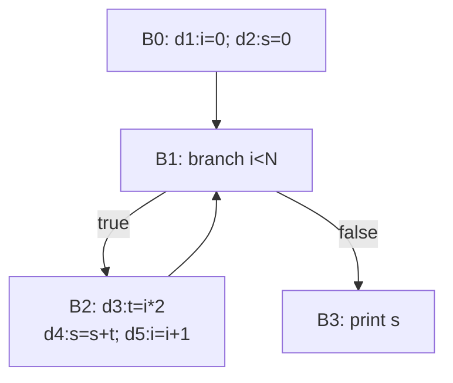

> **LLM/编译器技术深度解析系列 · 第 3 篇 / 共 13 篇**
>
> [第 2 篇 语义分析与 IR](/2026/08/25/compiler-02-semantic-ir/) ← **本篇** → [第 4 篇 后端代码生成](/2026/08/25/compiler-04-backend-codegen/)

**TL;DR**
* 中端优化的一切都建立在同一个数学骨架上：**半格上的单调函数求最小不动点**。本文用通用工作表求解器完整实现到达定值分析，在一个循环程序上展示 3 轮收敛的全过程，并解释为什么"必然终止"是定理而非运气。
* SSA 的真正红利在第 02 篇只讲了一半；本篇兑现另一半：**常量传播从"对每个程序点的全变量集做稠密迭代"退化为"沿 def-use 边做稀疏传播"**。实验演示 φ 函数的 meet 语义如何让 `phi(3, 3) → 3` 成立，进而级联触发分支删除。
* DCE 在 SSA 上退化为一次标记清扫，且传递性死亡（n1 仅被 e1 使用 → e1 死后 n1 级联变死）由闭包自动处理。实验移除 8 条指令中的 3 条，零误杀。
* 本文所有输出来自随文脚本 `experiments_03_dataflow_opt.py` 的真实运行。

---

## 目录

- [1. 正确性的数学骨架](#1)
- [2. 实验 A：到达定值分析](#2)
- [3. 稀疏化：SSA 上的常量传播](#3)
- [4. DCE 与 GVN：两个最常用 pass 的解剖](#4)
- [5. 批判与展望](#5)
- [FAQ](#faq)
- [参考资料](#参考)

<a name="1"></a>
## 1. 正确性的数学骨架

### 1.1 数据流分析的四个象限

所有经典数据流问题都能放进同一张 $2 \times 2$ 分类表：

| | **may 分析**（并集语义） | **must 分析**（交集语义） |
|---|---|---|
| **前向** | 到达定值（Reaching Definitions） | 可用表达式（Available Expressions） |
| **后向** | 活跃变量（Liveness） | 非常忙表达式（Very Busy Expressions） |

四个问题的传递函数和边界条件不同，但**求解器是同一个**——这正是 Kildall 1973 年统一框架[1]的贡献：给定一个完备格 $L$、单调转移函数族 $f_e: L \to L$，数据流方程组的解就是方程

$$
X_b = \bigwedge_{p \in \text{pred}(b)} f_{p \to b}(X_p)
$$

的最小不动点（may）/最大不动点（must），其中 $\bigwedge$ 是格的 meet 运算。

### 1.2 为什么必然终止：两条定理撑腰

**单调性 ⇒ 不动点存在**（Knaster–Tarski 定理[2]）：完备格上的单调函数必有不动点，且全体不动点构成完备格。

**有限高度 ⇒ 快速收敛**：若格的严格降链长度有界为 $h$（链高等于格中变量的位宽加一），则从 $\top$ 出发的迭代至多 $h \times |\text{edges}|$ 步内到达不动点。这就是实验 A 中 3 轮收敛的原因——不是巧合，是可以提前算出上界的保证。

工程上唯一要警惕的是**转移函数不单调**的自制 pass：结果会震荡或依赖遍历顺序，而且往往只在特定输入上暴露。写自定义数据流 pass 时，先证明单调性再动手是纪律而非洁癖。

### 1.3 工作表算法

朴素的全量迭代每轮重算所有节点，工作表（worklist）版本只重算入边发生变化的节点，是所有实用求解器的形态：

```text
初始化：IN[entry] = 边界条件；其余 IN = ⊥（may 前向时）
工作队列 = 所有块
while 队列非空:
    b = 弹出
    new_in = ⋃ OUT[p], p ∈ pred(b)          # meet 用 ∪（may 语义）
    new_out = f_b(new_in)                    # gen/kill 传递函数
    if (new_in, new_out) != (IN[b], OUT[b]):
        更新并把 b 的后继压回队列
```

<a name="2"></a>
## 2. 实验 A：到达定值分析

**到达定值**回答："程序点 p 处，变量 x 的当前值可能来自哪个定义？"它是构建 def-use 链、计算活跃范围、寄存器分配的基础设施。

测试程序是一个典型的循环累加：



gen/kill 的机械推导规则：块内按顺序扫描，同变量的多个定值只有最后一个进入 gen；kill 为该变量在**全程序**的其余定值。完整实现：


```python
DEF_VAR = {"d1": "i", "d2": "s", "d3": "t", "d4": "s", "d5": "i"}
BLOCK_INSTRS = {
    "B0": ["d1", "d2"],
    "B1": [],                                # 分支块无定值
    "B2": ["d3", "d4", "d5"],
    "B3": [],
}
SUCC = {"B0": ["B1"], "B1": ["B2", "B3"], "B2": ["B1"], "B3": []}
PRED = {b: [p for p in SUCC if b in SUCC[p]] for b in BLOCK_INSTRS}
ENTRY = "B0"

# 每个 var 的全部定值（用于 kill）
ALL_DEFS_OF = {}
for d, v in DEF_VAR.items():
    ALL_DEFS_OF.setdefault(v, set()).add(d)

# gen/kill：块内按顺序扫描，同变量只留最后一个定值进 gen；kill 为该变量的其余全部定值
GEN, KILL = {}, {}
for b, ins in BLOCK_INSTRS.items():
    g = {}
    for d in ins:                            # 后写的覆盖先写的
        g[DEF_VAR[d]] = d
    GEN[b] = set(g.values())
    KILL[b] = set()
    for d in ins:
        KILL[b] |= ALL_DEFS_OF[DEF_VAR[d]] - {d}

IN = {b: set() for b in BLOCK_INSTRS}
OUT = {b: (set(GEN[ENTRY]) if b == ENTRY else set()) for b in BLOCK_INSTRS}

round_no = 0
changed = True
while changed:
    changed = False
    round_no += 1
    snapshot = {}
    for b in BLOCK_INSTRS:
        new_in = set().union(*(OUT[p] for p in PRED[b])) if PRED[b] else set()
        new_out = GEN[b] | (new_in - KILL[b])
        snapshot[b] = sorted(new_in)
        if new_in != IN[b] or new_out != OUT[b]:
            IN[b], OUT[b] = new_in, new_out
            changed = True
    print(f"第 {round_no} 轮: IN = {snapshot}")

print(f"收敛于第 {round_no} 轮")
print("最终 OUT:")
for b in BLOCK_INSTRS:
    pretty = ", ".join(f"{d}:{DEF_VAR[d]}" for d in sorted(OUT[b]))
    print(f"  OUT[{b}] = {{{pretty}}}")
reaching_s = sorted(d for d in IN["B3"] if DEF_VAR[d] == "s")
print(f"到达出口 print(s) 的 s 定值: {reaching_s} "
      f"-> 循环携带依赖使初始值 d2 与循环内更新 d4 同时可达")
```


**真实运行输出**：

```text
第 1 轮: IN = {'B0': [], 'B1': ['d1', 'd2'], 'B2': ['d1', 'd2'], 'B3': ['d1', 'd2']}
第 2 轮: IN = {'B0': [], 'B1': ['d1', 'd2', 'd3', 'd4', 'd5'], 'B2': ['d1', 'd2', 'd3', 'd4', 'd5'], 'B3': ['d1', 'd2', 'd3', 'd4', 'd5']}
第 3 轮: IN = {'B0': [], 'B1': ['d1', 'd2', 'd3', 'd4', 'd5'], 'B2': ['d1', 'd2', 'd3', 'd4', 'd5'], 'B3': ['d1', 'd2', 'd3', 'd4', 'd5']}
收敛于第 3 轮
最终 OUT:
  OUT[B0] = {d1:i, d2:s}
  OUT[B1] = {d1:i, d2:s, d3:t, d4:s, d5:i}
  OUT[B2] = {d3:t, d4:s, d5:i}
  OUT[B3] = {d1:i, d2:s, d3:t, d4:s, d5:i}
到达出口 print(s) 的 s 定值: ['d2', 'd4'] -> 循环携带依赖使初始值 d2 与循环内更新 d4 同时可达
```

三个解读要点：
1. **第 1→2 轮的信息回流**：`d5:i=i+1` 的定值沿回边 B2→B1 流回头部，这是循环分析区别于直线代码的本质特征；第 2→3 轮集合不再变化，确认收敛。
2. `s` 的双定值 `{d2, d4}` 同时可达出口——**这不是分析的无能而是事实**：第一次迭代用 d2，之后都用 d4。任何声称"s 只有一个来源"的分析都必须借助归纳变量识别等更强的变换才能成立。
3. 收敛速度由信息在 CFG 上的传播距离决定，逆序遍历（此处近似逆拓扑）比正序快——生产实现的块序选择（RPO：反向后序）就是为了把轮数压到接近理论下界。

<a name="3"></a>
## 3. 稀疏化：SSA 上的常量传播

### 3.1 稠密 vs 稀疏：一个数量级的差距

传统常量传播也是数据流问题，但它要在**每个程序点维护全部变量的取值格**——稠密且昂贵。SCCP（Sparse Conditional Constant Propagation，Wegman & Zadeck[3]）的关键洞察：在 SSA 上，值的流动路径与 def-use 边完全一致，只需给**每条 SSA 边**挂一个格值，沿边传播即可。

本文实验实现其核心机制的一个简化切片（假设所有控制流边可行；完整 SCCP 还会用可行性反推删除不可达边，形成"传播⇄剪枝"的相互加速）。格的定义：

```text
        ⊤ (未定值)
      / | \
   c1  c2  c3 ...     各常量互不可比
      \ | /
        ⊥ (过定义 overdefined)
meet(c, c) = c;  meet(c1, c2) = ⊥ (c1≠c2);  meet(x, ⊥) = ⊥
```

φ 函数就是操作数格值的 meet——这一条让"两臂同值"的分支自动坍缩：


```python
OVER = ("over", None)

def meet(a, b):
    """格的 meet：同常量保持，异则过定义"""
    if a == OVER or b == OVER:
        return OVER
    return a if a == b else OVER

def binval(op, l, r):
    if l[0] == "over" or r[0] == "over":
        return OVER
    a, b_ = l[1], r[1]
    return ("const", {"+": a + b_, "-": a - b_, "*": a * b_,
                      "/": a // b_ if b_ else None}[op])

def sparse_const_prop(instrs, env):
    """instrs: [(name, kind, payload)] 直线代码；env 提供入口已知值"""
    lat = dict(env)
    for name, kind, payload in instrs:
        if kind == "const":
            lat[name] = ("const", payload)
        elif kind == "bin":
            l = lat.get(payload[1], OVER)
            r = lat.get(payload[2], OVER) if isinstance(payload[2], str) else ("const", payload[2])
            lat[name] = binval(payload[0], l, r)
        elif kind == "phi":
            vals = [lat.get(x, OVER) for x in payload]
            acc = vals[0]
            for v in vals[1:]:
                acc = meet(acc, v)
            lat[name] = acc
    return lat

# 程序一：分支两臂依赖未知条件（对应第 02 篇菱形）
progA = [
    ("x2", "bin", ("+", "y", 1)),
    ("x3", "bin", ("-", "y", 1)),
    ("x4", "phi", ["x2", "x3"]),
    ("z1", "bin", ("*", "x4", 2)),
]
latA = sparse_const_prop(progA, {"y": OVER})
print("程序一（两臂依赖 y，y 过定义）:")
for name, _, _ in progA:
    v = latA[name]
    print(f"  {name} -> {'过定义(不可折叠)' if v == OVER else f'常量 {v[1]}'}")

# 程序二：两臂赋同一常量（编译器视角下分支可整体消除）
progB = [
    ("x2", "const", 3),
    ("x3", "const", 3),
    ("x4", "phi", ["x2", "x3"]),
    ("z1", "bin", ("*", "x4", 2)),
]
latB = sparse_const_prop(progB, {})
print("程序二（两臂同为常量 3）:")
for name, _, _ in progB:
    v = latB[name]
    print(f"  {name} -> {'过定义(不可折叠)' if v == OVER else f'常量 {v[1]}'}")
zv = latB["z1"]
assert zv == ("const", 6)
print(f"结论: phi({{'const',3}}, {{'const',3}}) 折叠成功, z1 = {zv[1]} -> 分支删除与死代码级联成为可能")
```


**真实运行输出**：

```text
程序一（两臂依赖 y，y 过定义）:
  x2 -> 过定义(不可折叠)
  x3 -> 过定义(不可折叠)
  x4 -> 过定义(不可折叠)
  z1 -> 过定义(不可折叠)
程序二（两臂同为常量 3）:
  x2 -> 常量 3
  x3 -> 常量 3
  x4 -> 常量 3
  z1 -> 常量 6
结论: phi({'const',3}, {'const',3}) 折叠成功, z1 = 6 -> 分支删除与死代码级联成为可能
```

两个程序的对比精确展示了优化的"知识边界"：程序一中污染源只有一个（入口的 y 过定义），污染沿 def-use 边扩散到全图——稀疏性让你能看清**污染的传播路径**；程序二中没有任何过定义，整条链折叠成 `z1 = 6`，随后分支判断成为常量、整个菱形可被替换为一个直通块。AI 编译器里的 shape 传播本质上是同一套格机器，只是格的元素换成了符号维度表达式。

<a name="4"></a>
## 4. DCE 与 GVN：两个最常用 pass 的解剖

### 4.1 DCE：SSA 上的标记清扫

死代码消除在 SSA 上简单到不像优化：从"本质指令"（对外可见副作用：存储、打印、返回值）出发反向标记操作数闭包，未被标记者即死。它的正确性论证几乎免费——SSA 保证每个名字只有一个定义，删它不会牵连别人。

```python
PROG = [
    ("i1", ["const"]),           # 常量定义视为无操作数
    ("n1", ["const"]),
    ("a1", ["i1"]),
    ("b1", ["a1", "a1"]),
    ("c1", ["b1", "i1"]),
    ("d1", ["a1", "b1"]),        # 死：无人使用
    ("out1", ["c1", "c1"]),      # 本质（对外输出）
    ("e1", ["n1", "a1"]),        # 死：无人使用
]
USES = {name: ops for name, ops in PROG}
ESSENTIAL = {"out1"}

marked = set(ESSENTIAL)
frontier = list(ESSENTIAL)
while frontier:                       # 反向标记闭包
    cur = frontier.pop()
    for op in USES[cur]:
        if op != "const" and op not in marked:
            marked.add(op)
            frontier.append(op)

dead = [name for name, _ in PROG if name not in marked]
kept = [name for name, _ in PROG if name in marked]
print(f"原指令数: {len(PROG)}   标记存活: {len(marked)} ({sorted(marked)})")
print(f"清扫移除: {len(dead)} 条 ({dead})")
assert set(dead) == {"d1", "e1", "n1"}, "n1 应随 e1 的死亡而级联变死"
print("注意: n1 仅被 e1 使用 -> e1 死后 n1 级联死亡（标记闭包自动处理传递性）")
```

**真实运行输出**：

```text
原指令数: 8   标记存活: 5 (['a1', 'b1', 'c1', 'i1', 'out1'])
清扫移除: 3 条 (['n1', 'd1', 'e1'])
注意: n1 仅被 e1 使用 -> e1 死后 n1 级联死亡（标记闭包自动处理传递性）
```

注意 `n1` 的死亡不是显式写出来的规则，而是闭包的自然结果：它唯一的用户 e1 死了，它就死了。**级联效应是 SSA+mark-sweep 组合的标志性能力**——非 SSA 表示下你需要反复迭代"删一轮再看谁变成死的"，这里一遍完成。

### 4.2 GVN：值编号与"免费的公共子表达式"

全局值编号（GVN）的目标：证明两条指令计算出相同的值，合并为一。经典教科书里它依赖可用表达式分析（must 象限），而在 SSA 上有个更优雅的实现视角——**支配树上的哈希编号**（Click 的 GCM/GVN 路线[4]）：自顶向下遍历支配树，每条指令按 `(opcode, 操作数值编号)` 打哈希，哈希撞车即等价。因为支配关系保证了比较双方的定义点都可达使用点，正确性再次"免费"。

这也解释了一个初学者的常见困惑：**为什么 SSA 里几乎听不到"公共子表达式消除"这个独立 pass？** 因为语法形如 `%x = add %a %b` 出现两次时，第二次根本无法构造（名字已被占用）——CSE 的功能被 SSA 构造过程吸收了大半，GVN 只需处理"经过变换后才暴露的等价"。

### 4.3 归纳变量与强度削减：循环优化的余晖

乘法转加法（`i*8 → i+=8`）的经典强度削减在 RISC 化时代收益缩水（乘法延迟已大幅改善），但它的现代继承者依然重要：
* 循环不变量外提（LICM）仍是热循环优化的第一刀；
* 归纳变量的**线性递推形式**是向量化（识别 stride）和多面体模型（polyhedral）的入口条件；
* AI 编译器的 tiling/scheduling 本质上就是在张量层面重做这件事。

<a name="5"></a>
## 5. 批判与展望

* **pass 序列的脆弱性**是中端的真痛点：DCE 放在 GVN 前还是后、内联阈值怎么设，组合空间爆炸且效果非线性。MLGO（用 RL 学 LLVM 的 inlining 决策[5]）代表了"策略搜索自动化"的方向，但截至写作时仍限于少数 pass。
* **e-graph / 相等饱和**提供了另一种组织方式：不做序列决策，而是把所有重写规则的闭包一次性算出来再提取最优解。egg[6] 及其在 Superoptimization 中的实践值得跟踪。
* **对 AI 编译器工程师的提醒**：图级融合 pass 的正确性论证（§1 的框架 + §4.1 的判据）与标量世界完全同构。你在 TVM/Inductor 里写的每一个 pattern rewrite，都欠自己一份"格 + 单调性"级别的正确性说明——否则动态 shape 一来就翻车。

## FAQ

**Q1：may 和 must 总记混怎么办？**
记语义不记表格：may = "至少一条路径成立就用 ∪"（保守地多报）；must = "所有路径成立才算 ∧"（保守地少报）。两者都是保守近似，只是方向相反。所有优化变换只允许基于 must 或"may 但配合运行时检查"。

**Q2：为什么我的数据流 pass 会不收敛？**
九成是转移函数引入了非单调运算（比如对格值取反、减法）。检查每条规则是否满足 $x \preceq y \Rightarrow f(x) \preceq f(y)$。剩下的一成是把 may/must 的 meet 运算接反了。

**Q3：这些 1970 年代的技术今天还用吗？**
LLVM 的 `mem2reg` 就是"构建 SSA 的到达定值+活跃变量"打包；Inductor 的 size hint 系统是格传播；TVM 的 FoldConstant 是 SCCP 子集。技术不过时，只是换了宿主和方言。

## 参考资料

[1] Kildall, A Unified Approach to Global Program Optimization, POPL'73: https://doi.org/10.1145/512927.512945
[2] Knaster–Tarski 定理（维基百科条目，含证明梗概）：https://en.wikipedia.org/wiki/Knaster%E2%80%93Tarski_theorem
[3] Wegman & Zadeck, Constant Propagation with Conditional Branches, ACM TOPLAS 13(2), 1991（无开放获取链接，可经 ACM DL 检索）
[4] Click, Global Code Motion/Global Value Numbering, PLDI'95: https://doi.org/10.1145/207110.207154
[5] Google MLGO 项目主页（RL for LLVM heuristics）：https://github.com/google/ml-compiler-opt
[6] Willsey et al., egg: Fast and Extensible Equality Saturation, POPL'21: https://doi.org/10.1145/3434304

---

> **下一篇**：[第 04 篇 后端代码生成](/2026/08/25/compiler-04-backend-codegen/)——指令选择、寄存器分配、指令调度三件套：IR 如何变成真正的机器码。
