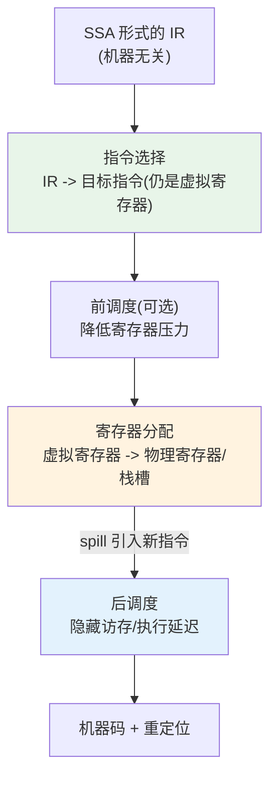

> **LLM/编译器技术深度解析系列 · 第 4 篇 / 共 13 篇**
>
> [第 3 篇 数据流分析与中端优化](/2026/08/25/compiler-03-dataflow-opt/) ← **本篇** → [第 5 篇 GCC 剖析](/2026/08/25/compiler-05-gcc-anatomy/)

**TL;DR**
* 后端把与机器无关的 IR 变成具体 ISA 的指令序列，核心是三道相互纠缠的工序：**指令选择**（IR → 合法指令覆盖，树 tiling 最小代价问题）、**寄存器分配**（无限虚拟寄存器 → 有限物理寄存器，图 K 染色的近似）、**指令调度**（重排以填延迟）。三者顺序本身就是工程折中：LLVM 选 DAG→RA→Schedule，因为先分配寄存器才能暴露真实的依赖链。
* 本文实现完整的**线性扫描分配器**（Poletto & Sarkar[1]）并叠加"远端牺牲"启发式，在 8 个活跃区间上实测：最大团下界为 4 时，K=4 零 spill 达到理论最优、K=3 仅 1 次 spill、K=2 三次——印证线性扫描以图染色百分之一的时间逼近其质量。
* 本文的隐藏主线是一张对应表：AI 编译器的 kernel 选择 ≈ 指令选择，共享内存/寄存器预算 ≈ 寄存器分配，tiling 与软件流水 ≈ 指令调度。学后端不是怀旧，是给写 GPU 编译器打底。
* 本文所有输出来自随文脚本 `experiments_04_backend_codegen.py` 的真实运行。

---

## 目录

- [1. 后端全景：三道工序与它们的顺序](#1)
- [2. 指令选择：一个最小代价覆盖问题](#2)
- [3. 寄存器分配：从图染色到线性扫描](#3)
- [4. 指令调度：填满流水线的排列题](#4)
- [5. 栈帧与调用约定](#5)
- [6. GPU 视角：AI 编译器的"后端"](#6)
- [7. 批判与展望](#7)
- [FAQ](#faq)
- [参考资料](#参考)

<a name="1"></a>
## 1. 后端全景：三道工序与它们的顺序



三道工序彼此咬合：
* **选择决定分配**：不同等价指令序列使用的临时值数量不同（如用 `lea` 融合地址运算可省中间寄存器）；
* **分配决定调度**：spill 引入 load/store 指令后才知道真实的访存序列；
* **调度反过来影响分配**：激进重排会拉长变量活跃期、抬高寄存器压力。

没有全局最优解（联合优化问题是 NP-hard 的组合），只有固定顺序下的局部最优。这是编译器作为工程品的典型气质。

<a name="2"></a>
## 2. 指令选择：一个最小代价覆盖问题

形式化：把 IR 树看作一棵树，目标 ISA 的每条指令能覆盖树上的某个模式（tile），每条指令带成本，求**覆盖整棵树的 tile 集合的最小总成本**。树形结构使它可以用动态规划在 $O(n)$ 内精确求解——自底向上为每个节点记录"覆盖到该节点的最优代价"。

两个经典例子建立直觉：

```text
表达式:  x = y + z * 8        （x86-64）

朴素覆盖:  mov eax, z      ; 取 z
          shl eax, 3       ; *8
          add eax, y       ; +y     共 3 条
最优覆盖:  lea eax, [y + z*8]        ; 1 条指令完成全部寻址运算
```

`lea` 本是加载有效地址的指令，但因为它支持 `base + index*scale + disp` 的寻址编码，被指令选择器识别为"免费的乘加单元"。**发现这类等价模式的数据库就是指令选择的本质资产**，LLVM 把它们写成 `.td` 文件由 TableGen 展开（第 06 篇细讲），GCC 则用 match.pd 表达式匹配语言。

工业级实现普遍放弃纯树而改用 **DAG**：先把基本块的 IR 构成数据依赖 DAG（公共子表达式天然合并），再对 DAG 做基于贪心+回溯的模式匹配。LLVM 的 SelectionDAG 是这条路线的代表[2]，代价是实现复杂度常年位居 LLVM 最难维护模块前列——MLIR 社区正在探索更简洁的替代路线。

<a name="3"></a>
## 3. 寄存器分配：从图染色到线性扫描

### 3.1 问题形式化

给定所有变量的活跃区间，若两个区间在时间上重叠则连一条**干涉边**；物理寄存器有 $K$ 个，问能否为每个变量指定寄存器使相邻节点异色？这正是 **图 K 染色**，NP 完全[3]。理论下界也很清楚：$K$ 至少要等于干涉图的**最大团大小**（同时活跃的最大变量数）。

### 3.2 图染色法（Chaitin 路线）

Chaitin 1981 年的经典方案[3]是一个迭代循环：

```text
repeat:
  简化: 移除度数 < K 的节点（必然可染）
  若图中还有节点:
     潜在溢出: 选度数最大的节点移出, 插入 spill 代码(load/store), 回到简化
until 全部移除
逆序弹出并染色
```

精髓在于"潜在溢出"不立即生成代码，而是乐观假设可染；真失败才插 spill 再重来。George-Appel 迭代寄存器合并进一步优化了 move 指令的消除，成为 LLVM 旧默认（IRC）。

### 3.3 线性扫描：JIT 与热路径的选择

图染色质量高但太慢（JIT 编译延迟敏感）。Poletto & Sarkar 1999 年提出线性扫描[1]：把活跃区间按起点排序，单趟扫描，用一个按终点排序的 active 列表做到期回收，耗尽时 spill。复杂度 $O(n \log n)$，质量略逊。LLVM 的 Greedy 分配器是它的强化版（加权优先级 + live range splitting），HotSpot Client 编译器也长期使用线性扫描变体。

### 3.4 实验：完整实现与 K 值扫描

第一步，从活跃区间统计干涉性质（实验 A）：

```python
INTERVALS = [
    ("v_a", 0, 20),
    ("v_b", 4, 10),
    ("v_c", 6, 18),
    ("v_d", 8, 24),
    ("v_e", 12, 16),
    ("v_f", 22, 30),
    ("v_g", 26, 32),
    ("v_h", 28, 34),
]

def overlaps(i1, i2):
    """半开区间相交判定"""
    s1, e1 = INTERVALS[i1][1], INTERVALS[i1][2]
    s2, e2 = INTERVALS[i2][1], INTERVALS[i2][2]
    return s1 < e2 and s2 < e1

n = len(INTERVALS)
edges = [(i, j) for i in range(n) for j in range(i + 1, n) if overlaps(i, j)]
print("活跃区间:")
for name, s, e in INTERVALS:
    print(f"  {name}: [{s:>2}, {e:>2})  长度 {e - s}")
max_clique_pt = max(
    range(max(e for _, _, e in INTERVALS)),
    key=lambda t: sum(1 for _, s, e in INTERVALS if s <= t < e),
)
live_at = [name for name, s, e in INTERVALS if s <= max_clique_pt < e]
print(f"同时活跃峰值: {len(live_at)} 个变量 @ 时刻 {max_clique_pt} ({live_at})")
print(f"干涉图边数: {len(edges)} / 可能的 {n * (n - 1) // 2} 条")
print("结论: 图染色需要 K >= 最大团大小 =", len(live_at))
```

第二步，完整线性扫描分配器（含"远端牺牲"启发式）：

```python
class LinearScanAllocator:
    """active 列表按区间终点排序；无空闲时与终点最远者比较，牺牲存活更久的一方"""

    def __init__(self, intervals, k_regs):
        self.intervals = sorted(intervals, key=lambda iv: iv[1])   # 按起点排序
        self.free = list(range(k_regs))                            # 空闲物理寄存器池
        self.active = []                                           # (end, name, reg)
        self.assign = {}
        self.spills = []

    def expire(self, start):
        """回收终点 <= 当前起点的区间占用的寄存器"""
        freed = []
        for e, nm, reg in list(self.active):
            if e <= start:
                self.active.remove((e, nm, reg))
                self.free.append(reg)
                self.free.sort()
                freed.append(nm)
        return freed

    def run(self):
        for name, start, end in self.intervals:
            freed = self.expire(start)
            if self.free:
                reg = self.free.pop(0)
                self.assign[name] = f"r{reg}"
                self.active.append((end, name, reg))
                self.active.sort()
                note = f"  (r{reg} 回收自 {freed})" if freed else ""
                log_line = f"{name}[{start},{end}) -> r{reg}{note}"
            else:
                ve, vnm, vreg = self.active[-1]      # 终点最远的占用者
                if ve > end:
                    # 当前区间更短：spill 受害者，抢夺其寄存器
                    self.spills.append(vnm)
                    del self.assign[vnm]
                    self.assign[name] = f"r{vreg}"
                    self.active[-1] = (end, name, vreg)
                    log_line = (f"{name}[{start},{end}) -> r{vreg}"
                                f"  (无空闲: spill 存活更久的 {vnm}[end={ve}])")
                else:
                    self.spills.append(name)
                    self.assign[name] = "SPILL"
                    log_line = (f"{name}[{start},{end}) -> SPILL"
                                f"  (无空闲: 最远者 {vnm}[end={ve}] 比当前更长, 保留)")
            print(" ", log_line)
        return self


for K in (2, 3, 4):
    print(f"\n--- 可用寄存器 K = {K} ---")
    alloc = LinearScanAllocator(INTERVALS, K).run()
    resident = {k: v for k, v in alloc.assign.items() if v != "SPILL"}
    print(f"寄存器驻留: {resident}")
    print(f"spill 数量: {len(alloc.spills)} ({sorted(set(alloc.spills))})")

print("\n结论对照: 最大团下界为 4 -> K=4 时零 spill 恰好达到理论最优;"
      " K=3 仅 1 次 spill、K=2 三次 spill, 印证线性扫描在实践中逼近图染色质量且快一个数量级")
```

**真实运行输出**（节选关键段）：

```text
同时活跃峰值: 4 个变量 @ 时刻 8 (['v_a', 'v_b', 'v_c', 'v_d'])
干涉图边数: 13 / 可能的 28 条
结论: 图染色需要 K >= 最大团大小 = 4

--- 可用寄存器 K = 3 ---
  v_a[0,20) -> r0
  v_b[4,10) -> r1
  v_c[6,18) -> r2
  v_d[8,24) -> SPILL  (无空闲: 最远者 v_a[end=20] 比当前更长, 保留)
  v_e[12,16) -> r1  (r1 回收自 ['v_b'])
  v_f[22,30) -> r0  (r0 回收自 ['v_e', 'v_c', 'v_a'])
  v_g[26,32) -> r1
  v_h[28,34) -> r2
寄存器驻留: {'v_a': 'r0', 'v_b': 'r1', 'v_c': 'r2', 'v_e': 'r1',
             'v_f': 'r0', 'v_g': 'r1', 'v_h': 'r2'}
spill 数量: 1 (['v_d'])

--- 可用寄存器 K = 4 ---
  ... (全部驻留) ...
spill 数量: 0 ([])

结论对照: 最大团下界为 4 -> K=4 时零 spill 恰好达到理论最优;
 K=3 仅 1 次 spill、K=2 三次 spill, 印证线性扫描在实践中逼近图染色质量且快一个数量级
```

三个解读要点：
1. **下界的力量**：t=8 时刻四个变量同时活跃，任何分配器（无论多聪明）在 K=3 下都必须至少 spill 一个——实验里恰好只牺牲 v_d，说明"终点最远者保留"启发式在此例上达到了理论下界。
2. **回收轨迹即生命周期可视化**：`r1 回收自 ['v_b']` 这类日志直观展示寄存器复用与变量寿命的关系。
3. **K=2 时出现"抢夺"分支**：v_c 抢了存活更久的 v_a 的寄存器——短区间优先驻留通常更优（占用时间短、收益密度高），这就是远端牺牲启发式的价值。

<a name="4"></a>
## 4. 指令调度：填满流水线的排列题

同一基本块内的指令在满足数据依赖的前提下可以重排。把指令建成依赖 DAG（节点=指令，边=读写依赖，边上标延迟），**list scheduling** 是标准解法：每步在"就绪集"里选关键路径最长（或延迟最大）的指令发射，让后续指令尽早解锁。

历史上 MIPS/SPARC 的**分支延迟槽**曾把调度问题推到极致（编译器必须在延迟槽里塞有用指令否则浪费），RISC-V 放弃了这一设计——硬件越来越聪明后，静态调度的收益空间被动态乱序执行挤压了一部分，但在 VLIW（DSP、部分 AI 芯片的标量核）上它仍是生命线。

与寄存器分配的张力值得单独记住：**拉大指令间距（调度）往往要求延长变量活跃期（抬高压力）**。所以 LLVM 先跑 RA 再做后调度，让 spill 的 load/store 也参与排程；而前调度的唯一目的是刻意压低并行度来降压力——同一个 pass 的两种相反配置，全看当时哪个是瓶颈。

<a name="5"></a>
## 5. 栈帧与调用约定

后端输出的最后一块拼图是符合 ABI 的过程框架。以 x86-64 System V 为例（Linux/macOS 默认约定）：前六个整型参数走 `rdi, rsi, rdx, rcx, r8, r9`，返回值走 `rax`；`rbx, rbp, r12–r15` 为 callee-saved（被调方必须恢复）。一个典型函数的头尾：

```asm
my_func:                        # int my_func(int a, int b, int c)
    push   %rbp                 # 保存旧帧指针 (callee-saved)
    mov    %rsp, %rbp           # 建立新帧
    sub    $32, %rsp            # 局部变量/溢出槽区
    mov    %edi, -4(%rbp)       # a 来自 rdi（寄存器参数落栈便于调试取址）
    mov    %esi, -8(%rbp)       # b 来自 rsi
    mov    %edx, -12(%rbp)      # c 来自 rdx
    ...                        # 函数体
    mov    -4(%rbp), %eax       # 返回值放入 rax
    add    $32, %rsp            # 收回栈帧
    pop    %rbp                 # 恢复帧指针
    ret                         # 返回
```

调用约定是编译器之间最刚性的契约：违反它的代码能运行但会在链接/崩溃时暴露，这也是跨语言 FFI 调试的第一现场。

<a name="6"></a>
## 6. GPU 视角：AI 编译器的"后端"

把前三节的视角平移到 GPU 上，对应关系惊人地整齐：

| 经典后端概念 | GPU/AI 编译器对应物 |
|------------|-------------------|
| 指令选择 | 算子 → kernel 实现/库调用（cuBLAS vs 自研 GEMM） |
| 寄存器分配 | 每线程寄存器预算 ↔ occupancy 的权衡 |
| 指令调度 | tiling + 软件流水（num_stages）+ warp 特化 |
| spill | 寄存器溢出到 local memory（实际是显存的 L1 缓存段，代价更高） |

GPU 上有一个经典后端没有的全局耦合量：**occupancy**。每个线程的寄存器用量翻倍，SM 上能驻留的线程数减半，延迟隐藏能力随之下降——所以 Triton 把 `num_warps`、kernel 把 maxrregcount 暴露成 autotune 维度，本质上是承认静态启发式搞不定这个多目标权衡，退回到第 03 篇批判过的"迭代编译"。写 AI 编译器后端的日常，就是在重复 1980 年代寄存器分配工程师的工作，只是格的维度更多、反馈回路更长。

<a name="7"></a>
## 7. 批判与展望

* **寄存器分配的学术前沿已转向建模升级**：PBQP 把架构怪癖（如 x86 部分写入约束）编码为图上的二次规划；MLGO 已把 LLVM 的 Greedy 分配器决策交给 RL 策略[4]。传统启发式的护城河正在被学习型方法逐条填平。
* **SelectionDAG 的复杂性债**是 LLVM 社区的公开话题，GlobalISel 迁移已推进多年但未完成[2]。对新硬件团队的现实建议：能用 MLIR 的 linalg→vector→LLVM 路线就不要自建后端，除非你的 ISA 有真正的张量原语需要定制。
* **本系列 Part C 预告**：第 11 篇的迷你 AI 编译器将亲手实现"张量版寄存器分配"（共享内存缓冲复用）与"调度搜索"，把本文的三道工序在张量世界各演一遍。

## FAQ

**Q1：为什么 `-O0` 下每个变量都住在栈上？**
Debug 构建的分配策略就是"不分配"：每个声明开一个栈槽、每次使用一次 load/store。这样任何调试器都能随时取值。寄存器分配本身是优化的一部分，这也是 `-O0` 与 `-O2` 性能差好几倍的主要来源之一。

**Q2：spill 到底有多贵？**
一次 spill = 一条 store + 一条 load。CPU 上若命中 L1 约 8~10 cycle 量级；GPU 上溢出到 local memory 可能数百 cycle 且挤占显存带宽。这解释了为什么 AI 编译器愿意花大量编译时间换寄存器/共享内存的零溢出。

**Q3：线性扫描和图染色到底选谁？**
AOT 编译器选图染色系（质量优先），JIT/热更新选线性扫描系（速度优先）。中间态也存在：LLVM Greedy 本质是"线性扫描骨架 + 图染色的合并与分割技术"。

## 参考资料

[1] Poletto & Sarkar, Linear Scan Register Allocation, PLDI'99: https://doi.org/10.1145/301618.301701
[2] LLVM Code Generator Documentation（SelectionDAG/GlobalISel）: https://llvm.org/docs/CodeGenerator.html
[3] Chaitin et al., Register Allocation via Coloring, Computer Languages 6(1), 1981: https://doi.org/10.1016/0096-0551(81)90048-5
[4] Google MLGO（RL for register allocation）: https://github.com/google/ml-compiler-opt
[5] NVIDIA CUDA Programming Guide（occupancy 章节）: https://docs.nvidia.com/cuda/cuda-c-programming-guide/

---

> **下一篇**：[第 05 篇 GCC 架构剖析](/2026/08/25/compiler-05-gcc-anatomy/)——Part B 开篇：GENERIC/GIMPLE/RTL 三层 IR 如何支撑四十年的演进，以及它与 LLVM 的根本分歧。
