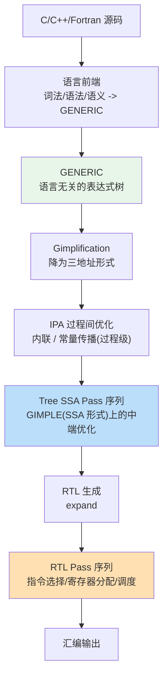

> **LLM/编译器技术深度解析系列 · 第 5 篇 / 共 13 篇**（Part B 主流编译器剖析 · 1/5）
>
> [第 4 篇 后端代码生成](/2026/08/25/compiler-04-backend-codegen/) ← **本篇** → [第 6 篇 LLVM/Clang 剖析](/2026/08/25/compiler-06-llvm-clang/)

**TL;DR**
* GCC 的全部秘密藏在它的三层 IR 里：**GENERIC**（语言无关树）→ **GIMPLE**（三地址码 + SSA，自 GCC 4.0 起）→ **RTL**（LISP 风格、由机器描述文件驱动的寄存器传输级表示）。前端只对接第一层，目标机只描述最后一层，中间的一切优化都发生在这条降级链上。
* 与 LLVM 最根本的分歧不在优化强弱，而在**架构哲学**：GCC 的优化管线是编译期固化的静态序列（`passes.def`），LLVM 则把管线本身做成可配置数据。前者换来四十年稳定演进的纪律，后者换来工具链生态的可编程性。
* 本文基于 GCC 官方 Internals 文档逐节核对[1][2][3]，版本信息以 gcc.gnu.org 当前发布为准（官网显示稳定线含 15.3 与 16 系列）。

---

## 目录

- [1. 历史定位](#1)
- [2. 三层 IR 全景](#2)
- [3. Pass 管理器与优化管线](#3)
- [4. 招牌优化技术](#4)
- [5. GCC vs LLVM：根本分歧对照](#5)
- [6. 动手观察 GCC 的内部](#6)
- [7. 批判与展望](#7)
- [FAQ](#faq)
- [参考资料](#参考)

<a name="1"></a>
## 1. 历史定位

1987 年 Richard Stallman 发布 GCC，初衷是为 GNU 系统提供自由编译器。四十年的沉淀使它成为：
* **Linux 内核的御用编译器**（内核对 GCC 扩展属性有大量依赖）；
* HPC 领域默认 Fortran/C/C++ 工具链（gfortran 无同级开源替代）；
* 几乎所有新 ISA（RISC-V、LoongArch 等）首发时最早支持的工具链之一。

但 2005 年后的十年是 GCC 与 LLVM 分道的历史：Apple 因 GPL 授权与工程灵活性考虑从 GCC 分叉，最终催生 Clang/LLVM 生态。理解这段历史的关键是看清两者的架构差异（§5），而不是站队。

<a name="2"></a>
## 2. 三层 IR 全景



| 维度 | GENERIC | GIMPLE | RTL |
|------|---------|--------|-----|
| 形态 | 表达式树 | 三地址元组（≤3 操作数） | LISP 风 S-表达式 |
| 抽象层级 | 接近源码 | 结构化控制流 + SSA | 寄存器传输级 |
| 是否 SSA | 否 | 是（GCC 4.0 起） | 否 |
| 主要使用者 | 语言前端作者 | 中端 pass 作者 | 后端/移植作者 |
| 对应 dump | `-fdump-tree-original` | `-fdump-tree-gimple` 等 | `-fdump-rtl-*` |

### 2.1 GENERIC：吸收多样性的海绵

各语言的语法构造千差万别（C++ 的重载决议、Fortran 的数组切片、Ada 的异常），GENERIC 以一棵足够通用的表达式树把它们统一收编。代价是它太"高级"以至于几乎无法直接在其上做全局优化——这正是第二层存在的理由。

### 2.2 GIMPLE：三地址化与 SSA 化

GCC 官方内部文档对 GIMPLE 的定义原文[2]：

> "GIMPLE is a three-address representation derived from GENERIC by breaking down GENERIC expressions into tuples of no more than 3 operands (with some exceptions like function calls)... Temporaries are introduced to hold intermediate values needed to compute complex expressions."

即：把复杂表达式拆解为至多三个操作数的元组，引入临时变量承载中间值。其血统来自麦吉尔大学 McCAT 项目的 SIMPLE 中间表示[2]。Gimplification 之后，GCC 4.0（2005 年）合并了 Tree SSA 工程，让 GIMPLE 以 SSA 形式参与中端优化——第 02/03 篇讲的所有机制（支配树、φ 函数、稀疏传播）在 GCC 里对应的就是这一层。

一个直观例子，C 源码：

```c
int f(int a, int b) {
    return (a + b) * (a - b);
}
```

经 gimplification 后大致呈（**示意性重构**，实际 dump 含更多临时命名细节）：

```text
f (int a, int b)
{
  int T1;
  int T2;
  int T3;

  T1 = a + b;
  T2 = a - b;
  T3 = T1 * T2;
  return T3;
}
```

每个元组不超过三个操作数、复合表达式全部扁平化——这就是"三地址"的含义。进入 Tree SSA 阶段后这些临时变量会进一步被改写成 `a_2(D)` 这类带版本号的 SSA 名字。

### 2.3 RTL：机器描述驱动的最后一级

RTL（Register Transfer Language）用 LISP 风格的 S-表达式描述每条"寄存器传输"，例如：

```lisp
(set (reg:SI 0) (plus:SI (reg:SI 1) (reg:SI 2)))   ; rax = rbx + rcx 类语义
```

关键机制是**机器描述文件**（`.md`）：每种目标架构用声明式规则描述自己的指令模式，生成器据此自动产出匹配代码。新增一个后端理论上只需编写 `.md` 描述与少量钩子——这是 GCC 能快速覆盖新兴 ISA 的结构性原因。第 04 篇讲的指令选择在这里表现为"RTL 模式匹配"，寄存器分配也发生在 RTL 层（GCC 未采用 SSA 式分配器）。

值得注意的不对称：**中端优化在 GIMPLE 上做，后端在 RTL 上做，两者之间没有往返**。一旦 expand 到 RTL，高层信息（类型、别名关系的一部分）就永久丢失——这决定了"哪些优化必须在哪层完成"的铁律。

<a name="3"></a>
## 3. Pass 管理器与优化管线

官方文档把整个编译过程划分为 Parsing → Gimplification → **Pass manager** → IPA → Tree SSA → RTL 六大段[3]。与 LLVM 最大的不同是：**这条管线在 GCC 编译期就由 `passes.def` 静态排定**，运行时只能通过 `-O` 级别、`-f*`/`-m*` 开关做开关式微调，无法像 LLVM NewPM 那样以任意顺序组装管线对象。

调试观测手段因此成为 GCC 工程师的核心技能：
* `-fdump-tree-all` / `-fdump-rtl-all`：导出每个 pass 后的完整 IR 快照；
* `-fopt-info-all`：让优化器主动报告"我在哪里做了什么"（向量化失败原因尤其有用）；
* `-fdump-passes`：列出当前选项下将执行的 pass 清单。

`-O0` 到 `-O3`/`-Os` 本质上是预置的 pass 子集 + 参数组合。Linux 发行版的默认构建多取 `-O2`：这是"可接受的编译时间 × 明确的性能收益"曲线上的拐点。

<a name="4"></a>
## 4. 招牌优化技术

**自动向量化**是 GCC 的旗舰能力之一，分两条路径：loop vectorizer（循环体改写为向量运算，含 if-conversion 处理条件执行）与 SLP（Basic-block 内同构语句打包）。`-fopt-info-vec-missed` 会告诉你每一条"为什么没向量化"——生产环境里排查热循环的第一入口。

**Graphite** 是 GCC 的多面体循环变换框架，处理仿射循环嵌套的交换/融合/tiling，理论漂亮、实战触发条件苛刻（需要精确的依赖分析），是"高级优化在真实代码上命中率有限"的典型案例。

**match.pd** 是 GCC 把"模式等价重写规则"集中化的 DSL：上千条代数恒等式（如 `(a & b) | (a & ~b) == a`）以统一语法维护，前后端共享。这与 LLVM 用 TableGen/InstCombine C++ 手写的路线形成方法论对照——声明式规则的规模化维护 vs 过程式代码的极致灵活。

**LTO（链接期优化）**打通编译单元边界，让 IPA 内联看到全程序。代价是链接时间暴涨与内存占用，实践中常见折中是 `-ffat-lto-objects` 或仅对热点库启用。

<a name="5"></a>
## 5. GCC vs LLVM：根本分歧对照

| 维度 | GCC | LLVM |
|------|-----|------|
| IR 层级 | 三层（GENERIC/GIMPLE/RTL），单向单向降级 | 主干单层（LLVM IR），辅以 MIR 视图 |
| Pass 组织 | 编译期静态管线（passes.def） | 运行时可配置管线（NewPM 显式 build） |
| 实现语言 | C（近年部分引入 C++） | C++ |
| 目标描述 | `.md` 机器描述 + 自动生成 | TableGen `.td` + 自动生成 |
| 插件边界 | 受限（GPL 边界争议，MELT 已淡出） | 宽松（BSD 授权，商业定制友好） |
| 诊断质量 | 传统良好 | Clang 以富文本诊断树立标杆 |
| 社区经验共识 | 优化深度在某些 FP 场景占优 | 编译速度、错误信息、工具链集成占优 |

最后一行特意标注为"社区经验共识"而非事实断言：两者的相对性能随版本迭代反复拉锯，任何"谁更快"的结论都必须绑定具体基准、版本与标志组合才成立。

真正值得记住的是第二条：**管线是否可编程**决定了下游能做什么。LLVM 的可配置管线让 opt 成为教学与研究工具（任意 pass 组合即插即用），也让 JIT 用户可以为不同负载定制流水线；GCC 的静态管线则保证了每一个发布版本的优化行为高度可预测——内核开发者更在意后者，研究者更在意前者，这是生态分裂的深层逻辑。

<a name="6"></a>
## 6. 动手观察 GCC 的内部

本文写作环境（macOS）没有原生 GCC（`/usr/bin/gcc` 实为 clang 别名），建议在 Linux 容器或服务器上执行以下命令亲眼看穿 GCC：

```bash
# 1. 查看 GIMPLE（三地址化结果）
cat > f.c <<'EOF'
int f(int a, int b) { return (a + b) * (a - b); }
EOF
gcc -O1 -fdump-tree-gimple f.c && cat f.c.*.t.gimple 2>/dev/null || cat f.c.*gimple*

# 2. 列出将被执行的 pass 清单
gcc -O2 -fdump-passes f.c

# 3. 让向量化器汇报失败原因
gcc -O3 -fopt-info-vec-missed -c loop.c

# 4. 观察某个具体优化的决策（如内联）
gcc -O2 -fdump-ipa-inline f.c
```

预期现象：dump 文件里能看到 SSA 版本号命名（`a_2(D)`）、`-fdump-passes` 输出按 ipa/tree/rtl 分组的长清单、missed 提示会给出"not vectorized: 数据依赖/非仿射下标"等具体理由。这些一手观察比任何二手教程都有效。

<a name="7"></a>
## 7. 批判与展望

* **模块化的历史欠账**：C 语言实现 + 全局状态使得 GCC 难以做增量式、并行式改造。JIT 能力（libgccjit）虽有但远不如 ORC 成熟，这在"编译器即服务"的时代是实打实的短板。
* **AI 硬件生态缺位**：GPU/NPU 后端生态几乎完全绕开 GCC（CUDA/ROCm/TVM/MLIR 各自为战）。GCC 在张量时代的角色可能被锁定为"通用 CPU 工具链"。
* **仍在快速演进**：官网首页显示稳定线已推进到 16 系列[4]；C++23/26 支持持续跟进，Rust 前端（GCCRS）也在主线开发中（进度以官方仓库为准）。判断"GCC 要死"的预言过去三十年从未应验过。
* **对本系列读者的一句话**：如果你只学一个编译器的中端，选 LLVM（工具友好）；但要理解"工业级编译器如何用纪律管理复杂度"，GCC 的静态管线哲学是最好的教材。

## FAQ

**Q1：既然 GIMPLE 也是 SSA，它和 LLVM IR 能互相翻译吗？**
语义上高度相似（都是三地址 + SSA + 显式 CFG），学术转换器已有多个。现实障碍是语义细节：未定义行为清单、内存模型假设、别名信息表示都不同，机械翻译会产生合法但性能迥异的代码。

**Q2：为什么 Linux 内核坚持 GCC（对 Clang 支持后来才有）？**
历史惯性 + 内核大量使用 GCC 特有扩展（语句表达式、`__builtin_*`）。Clang 支持是逐步补齐这些扩展后实现的，至今部分特性仍有行为差异。

**Q3：我能给 AI 加速卡写 GCC 后端吗？**
技术上可行（写 .md + RTL 钩子），但生态上孤岛：框架侧的图优化、kernel 库、runtime 都不会经过 GCC 栈。AI 硬件的现实选择是 MLIR/TVM/BYOC 路线（第 07/08 篇展开）。

## 参考资料

[1] GCC Internals: GENERIC（官方文档）: https://gcc.gnu.org/onlinedocs/gccint/GENERIC.html
[2] GCC Internals: GIMPLE（官方文档，含定义原文与 McCAT 渊源）: https://gcc.gnu.org/onlinedocs/gccint/GIMPLE.html
[3] GCC Internals: Passes and Files of the Compiler（官方文档）: https://gcc.gnu.org/onlinedocs/gccint/Passes.html
[4] GCC 官网（版本发布信息）: https://gcc.gnu.org/

---

> **下一篇**：[第 06 篇 LLVM/Clang 架构剖析](/2026/08/25/compiler-06-llvm-clang/)——单一 IR 的胜利：Clang 前端管线、New PassManager、MC 层与 ORC JIT，全部配本机可复现的 opt/llc 实测。
