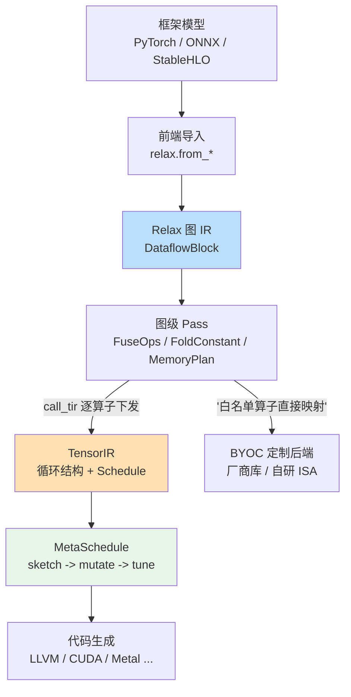

> **LLM/编译器技术深度解析系列 · 第 7 篇 / 共 13 篇**（Part B 主流编译器剖析 · 3/5）
>
> [第 06 篇 LLVM/Clang 剖析](/2026/08/25/compiler-06-llvm-clang/) ← **本篇** → [第 8 篇 XLA 与 MLIR/IREE](/2026/08/25/compiler-08-xla-mlir-iree/)

**TL;DR**
* TVM 的架构答案是"两层 IR + 一条搜索回路"：**Relax**（图级 IR，管融合/内存规划/动态 shape）逐算子下发到 **TensorIR**（算子级 IR，管循环变换），再由 **MetaSchedule** 把调度选择变成可缓存的搜索问题。这与第 04 篇的经典后端三工序形成精确同构。
* 本文是架构级解剖，聚焦三个机制的设计动机：`call_tir` 约定如何让图级与算子级解耦、DataflowBlock 如何标注融合边界、tuning record 如何让编译产物跨机器复用。手把手操作层面请配合本地已有文章[1][2]。
* 客观评价放在最后：TVM 是开源 AI 编译器中"教学完备度"最高的项目，但工业落地率低于其声量——原因值得每一个自研编译器团队深思。

---

## 目录

- [1. 定位与演进史](#1)
- [2. 分层架构总览](#2)
- [3. Relax：为动态 shape 而生的图 IR](#3)
- [4. TensorIR：算子级调度代数](#4)
- [5. MetaSchedule：把调优变成搜索](#5)
- [6. BYOC：务实的旁路](#6)
- [7. 批判与展望](#7)
- [FAQ](#faq)
- [参考资料](#参考)

<a name="1"></a>
## 1. 定位与演进史

TVM 起源于陈天奇等人的 OSDI'18 论文《TVM: An Automated End-to-End Optimizing Compiler for Deep Learning》[3]，2020 年成为 Apache 顶级项目。它的历史包袱也是它的历史价值：

| 阶段 | 图级 IR | 算子级 | 调优 |
|------|---------|--------|------|
| 原始版（2017~） | NNVM | Tir 前身 | AutoTVM（模板式） |
| Relay 时代（2019~） | Relay | TensorIR 渐进引入 | Ansor（免模板，OSDI'20[4]） |
| **Unity/Relax（2023~至今）** | **Relax** | **TensorIR** | **MetaSchedule** |

从 Relay 到 Relax 的重构不是改名，而是对 LLM 时代需求的正面回应：动态 shape 成为一等公民、控制流进入图 IR、跨层抽象（DLPack/closure）重新设计。

<a name="2"></a>
## 2. 分层架构总览



读这张图的正确姿势是带着第 04 篇的对应表：Relax pass ≈ 经典中端，TensorIR ≈ 指令选择+调度空间，MetaSchedule ≈ 迭代编译，BYOC ≈ 内联汇编的逃逸舱口。

<a name="3"></a>
## 3. Relax：为动态 shape 而生的图 IR

### 3.1 设计动机

Relay 的静态 shape 推导在 LLM 场景全面失灵：变长序列、batch 动态、KV cache 增长都要求"shape 是运行时值而非编译期常量"。Relax 的应对是把 shape 提升为一等符号对象（`T.SymbolicVar`），推导从"算出具体数字"改为"维护符号约束"。

### 3.2 两个关键机制

**`call_tir` 约定**——图级与算子级解耦的接缝。Relax 中一个算子调用最终形如：

```python
lv1 = R.call_tir(te_matmul, (lv0, w0), out_sinfo=R.Tensor((M, N), "float16"))
```

语义被严格限定为"纯函数：给定输入张量，写满输出张量，无副作用"。这个约定带来两个结构性收益：
1. 图级 pass 不需要理解算子内部即可做融合决策（只看纯函数边界）；
2. 下发的 TensorIR 可以独立缓存/独立调优——编译产物天然分块。

**DataflowBlock**——融合范围的显式声明。Relax 函数体由若干 `R.dataflow()` 块组成，块内的中间张量保证不被外部引用（locality 保证），因此块内可以做积极的内存复用与融合，块边界则是保守屏障。这相当于把经典编译器的"use 不逃逸分析"结果做成了语法结构，pass 不必再自己证明。

### 3.3 Relay → Relax 对照

| 维度 | Relay | Relax |
|------|-------|-------|
| Shape 处理 | 编译期静态推导，失败即编译失败 | 符号 shape + 运行时校验 |
| 控制流 | If/Match 以表达式形式受限支持 | 一等公民（配合 VM） |
| 算子下发 | 隐式 | 显式 `call_tir` |
| 内存计划 | 后置 pass | dataflow 块内一等支持 |
| 微内核互操作 | 弱 | DLPack 张量协议 + closure |

<a name="4"></a>
## 4. TensorIR：算子级调度代数

TensorIR 的形式：一个张量程序的**初始状态**（朴素循环实现）加上一组合法的**调度变换**（schedule primitives）。核心思想继承 Halide（算法与调度分离，PLDI'13），但把调度从 DSL 属性升级为**可验证的程序变换代数**。

常用原语速查（按作用分层）：

| 层次 | 原语 | 作用 |
|------|------|------|
| 循环结构 | split / fuse / reorder | 划分并行维度、调整遍历顺序 |
| 计算放置 | compute_at / compute_inline | 控制中间量的物化位置或消除之 |
| 执行形态 | vectorize / unroll / parallel / bind | 绑定 SIMD、展开、多线程/GPU 线程 |
| 缓冲 | cache_read / cache_write / storage_align | 引入共享内存/寄存器级暂存 |

以 GEMM 为例的典型变换序列（伪代码示意）：

```text
初始:  for i, j, k: C[i,j] += A[i,k] * B[k,j]
  split i,j by 128/8        -> block tiling（提高局部性）
  cache_write C to shared   -> 共享内存 staging
  split k by 16             -> 流水线深度
  vectorize innermost       -> 128-bit 向量访存
  bind i_outer to blockIdx.x, j_outer to threadIdx.y ...
```

每一步都是**语义保持的循环变换**，这正是第 03 篇数据流框架的镜像应用：合法性证明（依赖不破坏）在先，收益靠实测评估在后。本地已有文章对 schedule 有源码级拆解[1]，此处不再展开操作细节。

<a name="5"></a>
## 5. MetaSchedule：把调优变成搜索

调度空间太大（原语组合爆炸），人工排布不可持续。MetaSchedule 的管线三段式：

1. **Sketch**：按规则生成结构骨架（哪些维度可 tile、哪里可向量化）——把无穷空间剪成多项候选；
2. **Mutation**：在骨架上随机扰动参数（tile 大小、unroll 因子……），生成具体候选；
3. **Measure**：真实跑一遍取时延，写入 tuning record 数据库。

三段式的精髓在**知识的持久化**：tuning record 按 target + workload 键控存储，换机器只需增量调优，CI 里可以离线回放。这解决了 AutoTVM 时代"每次发版重调一周"的工程噩梦。

与 Ansor 的关系值得澄清：Ansor 的贡献是免模板的搜索空间生成（derivation rules 替代人工模板），MetaSchedule 在工程上继承了其思想并统一进 TensorIR 抽象。两者论文分别见[3][4]。

<a name="6"></a>
## 6. BYOC：务实的旁路

不是所有硬件都值得写全栈后端。BYOC（Bring Your Own Codegen）允许把"白名单算子子图"直接交给厂商库（cuBLAS/CANN/自研工具链），其余留在 TVM 主线。架构上是把"部分图替换"做成通用 pass 框架——本质是第 02 篇讲的 pattern rewrite 的商业应用。

选型判断标准一句话：**有成熟厂商库且算子覆盖率 >80%，用 BYOC；需要极致定制（新 ISA、特殊数据流），才考虑全栈接入 TensorIR**。地平线等国内团队的实践复盘见本地文章[2]。

<a name="7"></a>
## 7. 批判与展望

* **声量与落地的落差**：TVM 学术引用与社区热度极高，但一线大厂推理主力多为 TensorRT/自研闭源栈。原因不在技术而在**产品化缺口**：没有官方长期维护的高性能 runtime 发行版、版本兼容策略激进、企业级支持缺失。自研团队引以为戒：编译器项目的成败一半在仓库之外。
* **MLIR 阵营的分流效应**：大量原本可能贡献给 TVM 的产业资源流向了 MLIR/IREE 生态（下一章）。TVM 的回应是深耕 MLC-LLM 等 LLM 应用层，用场景拉动栈演进。
* **仍然无可替代的部分**：作为学习 AI 编译器的教材，TVM 至今无出其右——代码规模可控（相对 LLVM）、文档覆盖从论文到源码、Python 入口友好。本系列 Part C 的迷你编译器（第 11 篇）多处借鉴其分层。

## FAQ

**Q1：现在入坑应该学 Relay 还是 Relax？**
Relax。Relay 已处于维护模式，官方文档的 deep dive 系列全部围绕 Relax 组织[5]。任何仍以 Relay 为中心的教学材料都应视为过时。

**Q2：TensorIR 和 Triton 是竞争关系吗？**
定位不同。TensorIR 是完整调度语言（tiling/layout/异步流水全覆盖），Triton 是面向 kernel 作者的生产力 DSL（隐藏了大部分 layout 细节）。前者表达力上限高、上手陡；后者相反。Inductor 选 Triton、部分 NPU 团队选 TensorIR，都是各自约束下的理性选择。

**Q3：MetaSchedule 调出来的结果能信任吗？**
要区分两种信任：数值正确性由 TensorIR 变换的可验证性保证（可信）；性能最优性只是"测过的候选里最好"，换硬件/换输入分布就可能失效——所以 tuning record 必须绑定 target 元数据，部署前建议抽样复测。

## 参考资料

[1] 本地文章《TVM/MLIR 3 个月学习路线图》（含 TensorIR/Schedule/MetaSchedule 实操，见 congyuan_blogs 仓库 technology/ai_compiler/ 目录）
[2] 本地 wiki《AI Compiler 主题页》及其收录的 TVM 系列文章索引（见同仓库 llm-wiki/topics/）
[3] Chen et al., TVM: An Automated End-to-End Optimizing Compiler for Deep Learning, OSDI'18: https://arxiv.org/abs/1810.00852
[4] Zheng et al., Ansor: Generating High-Performance Tensor Programs for Deep Learning, OSDI'20: https://arxiv.org/abs/2004.00287
[5] TVM 官方文档 · Relax Deep Dive: https://tvm.apache.org/docs/deep_dive/relax/abstraction.html
[6] TVM 官方文档 · Architecture Overview: https://tvm.apache.org/docs/arch/index.html

---

> **下一篇**：[第 08 篇 XLA 与 MLIR/IREE](/2026/08/25/compiler-08-xla-mlir-iree/)——Google 系编译栈的演进（HLO→StableHLO）与 MLIR 多方言体系：两条路线的分野与合流。
