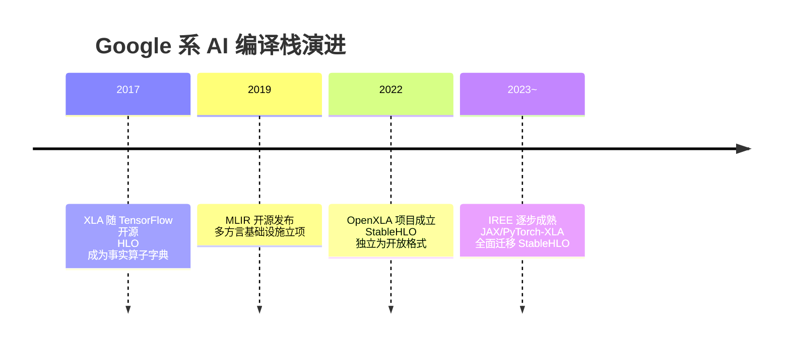
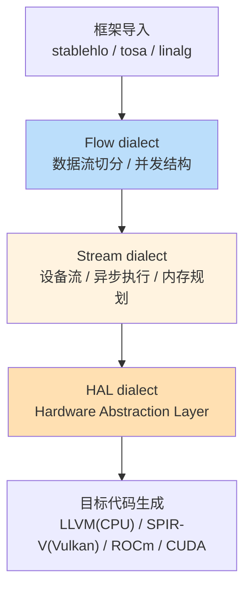

> **LLM/编译器技术深度解析系列 · 第 8 篇 / 共 13 篇**（Part B 主流编译器剖析 · 4/5）
>
> [第 07 篇 TVM 剖析](/2026/08/25/compiler-07-tvm/) ← **本篇** → [第 9 篇 torch.compile/Triton/TensorRT](/2026/08/25/compiler-09-torch-triton-tensorrt/)

**TL;DR**
* 本篇讲一条主线两个主角：**XLA**（Google 系加速器编译器）证明了"领域限定换优化空间"的价值，但它的 HLO 算子字典绑死在单一生态里；**StableHLO** 把字典解耦成开放交换格式；**MLIR** 则更进一步——不再争论哪层 IR 正确，而是把"多层 IR + 渐进降级"本身做成基础设施；**IREE** 是这套理念在端侧推理上的旗舰实现。
* 本文对 IREE 的分层（Flow/Stream/HAL 核心 dialect、stablehlo/tosa/linalg 输入、六类部署目标）依据 iree.dev 官方开发者文档逐项核对[1]；XLA 部分因官方文档站在当前网络环境不可达，基于社区共识知识撰写并标注。
* 一个贯穿性判断：**AI 编译器的竞争焦点正在从"单个编译器做得好"转向"IR 交换标准谁定义"**——StableHLO 与 ONNX 之争就是这个战场。

---

## 目录

- [1. 时间线：五年三代](#1)
- [2. XLA 与 HLO：领域限定的胜利与代价](#2)
- [3. StableHLO：把字典从项目里解耦](#3)
- [4. MLIR：多方言基础设施](#4)
- [5. IREE：渐进降级的端侧旗舰](#5)
- [6. TVM / XLA / IREE 三方对照](#6)
- [7. 批判与展望](#7)
- [FAQ](#faq)
- [参考资料](#参考)

<a name="1"></a>
## 1. 时间线：五年三代



理解这条线的关键：每一步都是在解决上一步的**耦合问题**——XLA 耦合了框架，于是有 StableHLO 解耦算子；算子解耦后各编译器仍各自造轮子，于是有 MLIR 统一基础设施；最后 IREE 证明这套理念能一路打到裸金属。

<a name="2"></a>
## 2. XLA 与 HLO：领域限定的胜利与代价

XLA（Accelerated Linear Algebra）的输入是 **HLO**（High-Level Optimizer IR）——一张以算子为节点、以张量形状/dtype 为边的 DAG。它的核心竞争力来自两条约束：

1. **算子集合封闭且语义精确**：融合 pass 可以放心地把 `add/multiply/reduce` 链折叠成单 kernel，因为每个算子的数值行为都有严格规范；
2. **shape 信息完整**：静态 shape 下内存规划可以做满（对比第 03 篇 FAQ 提到的动态 shape 困境）。

执行模式上 XLA 同时提供 JIT（`jax.jit/pjit` 触发即时编译并缓存）与 AOT（移动端提前编译），缓存键是 shape+dtype 签名——这也是它面对 LLM 变长输入时痛苦的原因：签名爆炸导致反复重编译，社区以 bucketing（把变长维度分桶取整）缓解。

**代价**：HLO 长期是 TensorFlow/JAX 的内部接口，第三方编译器若想消费 HLO 必须跟进其随版本漂移的语义——这就是"算子字典被单一项目垄断"的结构性问题，也是 StableHLO 出场的理由。

<a name="3"></a>
## 3. StableHLO：把字典从项目里解耦

2022 年 Google 联合 ARM/Intel/NVIDIA 等成立 OpenXLA 项目（多方治理的开源联盟），StableHLO 从中独立：一个以 **MLIR dialect 形式**定义的可移植算子集，定位是"框架与编译器之间的契约层"：

```text
PyTorch ─┐                                    ┌─> XLA
JAX ─────┤--> [Portable Artifact: StableHLO] ──┼─> IREE
TF ──────┘        （序列化、版本化、向后兼容）    └─> 其他编译器
```

三个设计承诺值得注意（细节以其规范文档为准，当前环境无法访问其仓库故不展开具体条目）：
* **兼容性承诺**：老版本序列化的程序在新版工具链下行为不变——这是 HLO 从未给过的；
* **MLIR 载体**：直接复用 MLIR 的解析/验证/变换基础设施，而非自造序列化格式；
* **与 ONNX 竞争**：同为"模型交换格式"，ONNX 胜在覆盖面与工具生态，StableHLO 胜在语义精确性与编译器亲和度。这场标准之争尚未落幕。

<a name="4"></a>
## 4. MLIR：多方言基础设施

MLIR（Multi-Level Intermediate Representation）的核心立场写在它的 CGO'21 论文标题里："Scaling Compiler Infrastructure for Domain Specific Computation"[2]。三个核心概念：

| 概念 | 一句话 | 对应本系列 |
|------|--------|-----------|
| Operation | 万物皆操作（含属性、区域、结果） | 第 02 篇 IR 节点的泛化 |
| Dialect | 操作的命名空间 + 语义域 | "IR 家族"的打包分发单位 |
| Progressive Lowering | 合法程序逐级降级，每级可独立验证 | 第 02 篇设计准则 #2 |

典型降级梯队在 MLIR 主干里清晰可见：

```text
stablehlo / linalg          （结构化计算，循环嵌套语义）
      ↓ tiling/fusion
tensor                      （抽象张量值）
      ↓ bufferization
memref                      （显式内存）
      ↓ tiling/vectorization
vector                      （SIMD 抽象）
      ↓ lowering
arith / scf / cf            （标量运算与控制流）
      ↓
llvm dialect -> LLVM IR     （交给第 06 篇的后端栈）
```

每一级都是独立可验证、可测试、可定制的层——**"哪层 IR 最优"的争论被消解成"你的场景需要插在哪一层"的工程决策**。这是对第 02 篇 §2.3 设计准则的体系化兑现。

学习入口是官方 Toy 教程：七章走完"自定义语言 → 自建 dialect → shape 推导 → 降到 LLVM"全流程[3]，是理解 MLIR 唯一的正道入门。

<a name="5"></a>
## 5. IREE：渐进降级的端侧旗舰

IREE（Intermediate Representation Execution Environment）是展示 MLIR 理念完整落地的旗舰项目。以下分层信息依据官方开发者总览文档核对[1]。

### 5.1 编译管线



三层核心 dialect 各司其职：
* **Flow**：把输入程序切成可并发的数据流片段（dispatch 工作），回答"哪些计算彼此独立"；
* **Stream**：把 Flow 片段编排到设备流上，做异步调度与显存分配——相当于把第 04 篇的"寄存器分配"抬升到设备内存层级；
* **HAL**：硬件抽象层，向上暴露统一的 executable interface，向下对接各类驱动（Vulkan/Metal/CUDA/HIP/裸金属）。

### 5.2 部署矩阵

官方文档列出的部署配置覆盖 CPU、bare-metal（无 OS 直跑 MCU）、Vulkan、ROCm、CUDA、Metal 六类目标[1]——同一份 StableHLO 输入，产出从服务器 GPU 到微控制器的全谱系产物。"一份 IR 打天下"在这里不是口号而是 CI 里每天验证的事实。

### 5.3 差异化价值

相对传统推理引擎，IREE 的杀手锏是**异步执行模型的一等公民化**：host/device 流水线、多流并发、事件依赖全部编码进 Stream 层而非 runtime hack。对延迟敏感的端侧场景（车载、XR），这是架构级优势而非调参优势。

<a name="6"></a>
## 6. TVM / XLA / IREE 三方对照

| 维度 | TVM | XLA(+StableHLO) | IREE |
|------|-----|------------------|------|
| 图级 IR | Relax | HLO / StableHLO | stablehlo→Flow |
| 算子级 | TensorIR + MetaSchedule | 融合 kernel + 库调用 | Codegen dialects(linalg→vector) |
| 调优哲学 | 显式搜索(tuning record) | 启发式为主 | 编译期推导为主 |
| 强项 | 教学完备、BYOC 灵活 | JAX/TPU 生态深度 | 端到端可移植、异步模型 |
| 短板 | 产品化缺口 | 生态绑定、动态 shape 弱 | 社区规模、算子覆盖速度 |
| 适合谁 | 学习者/新硬件团队 | JAX 用户/TPU 集群 | 端侧产品团队 |

没有赢家通吃：三者分别代表"搜索驱动""生态驱动""架构驱动"三条路线的最优实践。

<a name="7"></a>
## 7. 批判与展望

* **标准之争是下一个十年主战场**：StableHLO 与 ONNX 的竞争本质是"编译器亲和 vs 工具链普及"。国内厂商自研芯片普遍两者都接，实际是把选择权留给客户——聪明的策略，但也意味着双倍适配成本长期存在。
* **MLIR 不是银弹**：dialect 泛滥、版本兼容、ODS 学习曲线让不少团队"上了车才发现维护成本"。经验法则：只有当你要服务 ≥3 种硬件或 ≥2 个前端时，MLIR 的抽象税才开始回本。
* **对本系列的衔接**：下一章回到工程一线——torch.compile/Triton/TensorRT 是当下大多数工程师真正摸到的编译栈；而 Part C 第 11 篇的迷你编译器将借用本文 Flow 层"切分并发"与 Stream 层"内存规划"的思路。

## FAQ

**Q1：HLO 和 StableHLO 到底什么关系？**
可以理解为"HLO 的开源规范化分支"：语法近似 MLIR 化、语义文档化、承诺跨版本稳定。XLA 内部仍在使用自己的 HLO 表示，边界处做转换。

**Q2：为什么 IREE 不直接用 TensorIR 或 Triton 做 kernel？**
路线之争：IREE 选择 linalg→vector 的编译期推导路线（覆盖广、无调优数据库依赖）；TensorIR/Triton 选择搜索/元编程路线（峰值性能上限高）。两者甚至可以在同一系统共存——dispatch 粗粒度用库，热点细粒度用生成 kernel。

**Q3：MLIR dialect 会像 Python 包一样碎片化吗？**
已经发生（上游数十个 dialect + 各家私有 dialect）。MLIR 的应对是"核心 dialect 精简稳定 + 外围自由竞争"，类似 LLVM 对后端的治理。选型时优先用主干 dialect 构建的栈，私有 dialect 要审慎评估其退出成本。

## 参考资料

[1] IREE 官方文档 · Developer Overview（dialect 分层与部署矩阵，已核对）: https://iree.dev/developers/general/developer-overview/
[2] Lattner et al., MLIR: Scaling Compiler Infrastructure for Domain Specific Computation, CGO'21: https://arxiv.org/abs/2002.11054
[3] MLIR Toy Tutorial（ chapters 1–7）: https://mlir.llvm.org/docs/Tutorials/Toy/
[4] IREE 异步调度设计文档（导航确认存在，未逐字核读）: https://iree.dev/developers/design-docs/async-scheduling/
[5] OpenXLA / StableHLO 仓库: https://github.com/openxla/stablehlo （当前网络环境不可达，内容未核验）

---

> **下一篇**：[第 09 篇 torch.compile/Triton/TensorRT](/2026/08/25/compiler-09-torch-triton-tensorrt/)——回到工程一线：Dynamo 如何捕获你的模型，Inductor 如何生成 Triton kernel，以及 TensorRT 的 tactic 枚举哲学。
