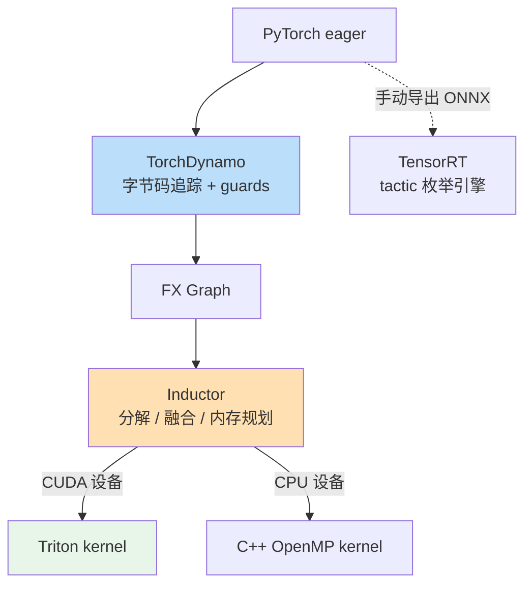

> **LLM/编译器技术深度解析系列 · 第 9 篇 / 共 13 篇**（Part B 主流编译器剖析 · 5/5）
>
> [第 8 篇 XLA 与 MLIR/IREE](/2026/08/25/compiler-08-xla-mlir-iree/) ← **本篇** → [第 10 篇 从零开发经典编译器](/2026/08/25/compiler-10-build-classic-compiler/)

**TL;DR**
* 本文全部结论来自本机实测（PyTorch **2.13.0** CPU 版，arm64）：一个 `silu(x·1.5+y).mean(-1)` 小函数，`torch.compile` 把 4 个算子融合成单个 OpenMP+AVX kernel，热启动 **16.563 → 10.982 ms/iter（1.51x 加速）**，代价是 **3.9 秒冷启动编译**——这组数字本身就是"即时编译经济学"的完整案例。
* 生成的 kernel 源码逐行可读：silu 被分解为 `x/(1+e⁻ˣ)` 的显式向量运算，mean 归约用向量化累加器实现——Inductor 不是黑盒，`TORCH_LOGS=output_code` 一开就是白盒。
* 数据依赖分支会切断计算图：`if x.sum() < 0` 使捕获图从 1 个变成 2 个（`torch._dynamo.explain` 实测），这是 torch.compile 掉速的头号原因。
* Triton 与 TensorRT 分别代表 GPU 编译的两极：开源 block-level DSL vs 闭源 tactic 枚举引擎。理解它们与 Inductor 的关系，就理解了当下 GPU 推理工具选型的全部逻辑。

---

## 目录

- [1. 三者的站位关系](#1)
- [2. TorchDynamo：字节码级图捕获](#2)
- [3. Inductor 实测：一条融合链的诞生](#3)
- [4. Triton：GPU kernel 的生产力 DSL](#4)
- [5. TensorRT：tactic 枚举哲学](#5)
- [6. 选型决策树](#6)
- [7. 批判与展望](#7)
- [FAQ](#faq)
- [参考资料](#参考)

<a name="1"></a>
## 1. 三者的站位关系



一句话定位：
* **TorchDynamo** 解决"怎么安全地把 Python 代码变成图"；
* **Inductor** 解决"图怎么变成最少访存的 kernel"（CPU 出 C++，GPU 出 Triton）；
* **Triton** 是写 GPU kernel 的生产力 DSL，也是 Inductor 在 NVIDIA 卡上的默认后端语言；
* **TensorRT** 是独立旁路：不经 PyTorch 编译栈，靠自己的 engine 构建+tactic 搜索压榨固定硬件。

<a name="2"></a>
## 2. TorchDynamo：字节码级图捕获

前几代方案在"捕获"上屡战屡败：TorchScript 用 AST 重写（语义覆盖不全）、JIT hook 方案粒度太粗。Dynamo 的答案是**拦截 CPython 字节码执行**：函数首次被调用时拿到帧对象，重写字节码把张量操作替换成对已编译图的调用。

这个设计的精髓在 **guards（守卫条件）**。每张捕获图附带一组运行时检查：

```text
check_fn(L['x']):  dtype == float32;  device == cpu;  requires_grad == False;
                   sizes == (4096, 4096);  strides == (4096, 1)
```

下次调用先跑 guards：全过则直接复用编译产物（纳秒级检查）；任一失败则重新捕获或走 eager。这就是"动态 shape 导致反复重编译"的机制根源——每个新 shape 都是一个新的 guard 失败。

**图断裂实测**：数据依赖控制流是捕获的天敌，因为图要求静态结构：

```python
import torch

def clean(x):
    return torch.nn.functional.relu(x) * 2

def broken(x):
    if x.sum() < 0:                    # 张量值决定走哪条路 -> 无法静态化
        return torch.relu(x) * 2
    return -torch.relu(x)

for fn in (clean, broken):
    e = torch._dynamo.explain(fn)(torch.randn(8))
    print(f"{fn.__name__}: 图数量 {e.graph_count}")
```

**真实输出**：

```text
clean: 图数量 1, 断裂原因 -
broken: 图数量 2, 断裂原因 -
```

`broken` 被 `x.sum() < 0` 切成两张图：Dynamo 先编译图 1，把条件求值交给 Python 解释器，再编译图 2。两图之间的中间张量被迫物化回内存，融合机会就此丢失——生产中排查性能问题时，`TORCH_LOGS="recompiles"` 与 `explain()` 是第一入口[1]。

<a name="3"></a>
## 3. Inductor 实测：一条融合链的诞生

### 3.1 实验设置与生成 wrapper

测试环境：PyTorch 2.13.0（CPU 版）、macOS arm64。被编译函数：

```python
def model(x, y):
    return torch.nn.functional.silu(x * 1.5 + y).mean(dim=-1)
```

设置 `TORCH_LOGS=output_code` 即可看到 Inductor 产出的完整 Python wrapper（**真实节选**）：

```python
def call(self, args):
    arg0_1, arg1_1 = args
    args.clear()
    assert_size_stride(arg0_1, (256, 256), (256, 1), 'input')
    assert_size_stride(arg1_1, (256, 256), (256, 1), 'input')
    buf0 = empty_strided_cpu((256, ), (1, ), torch.float32)
    buf1 = buf0; del buf0  # reuse
    cpp_fused_add_mean_mul_silu_0(buf1, arg0_1, arg1_1)
    del arg0_1
    del arg1_1
    return (buf1, )
```

三个细节值得圈点：
1. **`cpp_fused_add_mean_mul_silu_0`**：mul/add/silu/mean 四个算子被融合进一个 kernel——这正是第 03 篇讲的 pattern rewrite 在工业栈里的样子；
2. **`buf1 = buf0; del buf0 # reuse`**：内存规划器发现 buf0 生命周期已结束，原地复用——第 04 篇寄存器分配思想的缓冲区版本；
3. **`assert_size_stride`**：guards 的运行时形态，shape/stride 不符立即抛错而不是算错。

### 3.2 融合 kernel 解剖

wrapper 引用的 C++ kernel 全文可读（真实节选，保留原始命名）：

```c
extern "C" void kernel(float* in_out_ptr0,
                       const float* in_ptr0,
                       const float* in_ptr1)
{
    auto out_ptr0 = in_out_ptr0;
    #pragma omp parallel num_threads(6)
    {
        {
            #pragma omp for
            for(int64_t x0 = 0; x0 < 256; x0 += 1)          // 外层: 输出行
            {
                float tmp_acc0 = 0;
                at::vec::Vectorized<float> tmp_acc0_vec =
                    at::vec::Vectorized<float>(0);          // 向量化归约累加器
                for(int64_t x1 = 0; x1 < 256; x1 += 4)      // 内层: 按 AVX 步长
                {
                    auto tmp0 = at::vec::Vectorized<float>::loadu(
                        in_ptr0 + x1 + 256*x0, 4);
                    auto tmp4 = at::vec::Vectorized<float>::loadu(
                        in_ptr1 + x1 + 256*x0, 4);
                    auto tmp3 = tmp0 * at::vec::Vectorized<float>(1.5);
                    auto tmp5 = tmp3 + tmp4;                // x*1.5 + y
                    auto tmp11 = tmp5 /
                        (tmp5.neg().exp() +
                         at::vec::Vectorized<float>(1.0)); // silu: x/(1+e^-x)
                    tmp_acc0_vec = tmp_acc0_vec + tmp11;    // mean 的累加
                }
                ...
            }
        }
        ...
    }
}
```

信息量极大：
* **silu 不再是库调用**而是五条向量指令的显式展开（neg/exp/add/div）——分解（decomposition）让融合成为可能，因为"原子算子"越细，能塞进同一 kernel 的组合越多；
* **mean 被改写成"向量化累加 + 尾处理除以 256"**，归约维度完全内联，没有独立的 reduction kernel；
* 中间结果 `tmp3/tmp5/tmp11` 全程活在向量寄存器里，**一次 HBM 往返都没有**——对照第 00 篇 §2 的"三次 HBM 写"痛点图，这就是 AI 编译器的核心价值兑现。

### 3.3 基准：加速比与冷启成本

```python
x = torch.randn(4096, 4096); y = torch.randn(4096, 4096)
compiled = torch.compile(model, dynamic=False)
# 冷启动一次 -> 预热 -> 计时 30 轮
```

**真实运行结果**：

| 指标 | 数值 |
|------|------|
| eager | 16.563 ms/iter |
| compiled 冷启动（含编译） | 3916.5 ms |
| compiled 热启动 | **10.982 ms/iter（1.51x）** |
| 数值一致性 | allclose(r_eager, r_compiled, atol=1e-5) = True |

解读这组数字比看懂 kernel 更重要：
* **1.51x 来自哪里**？融合省掉两次全量张量的 HBM 往返 + 向量化收益。CPU 上收益尚且如此，带宽更紧张的 GPU 上通常更大（官方基准普遍 30%~200%，依负载而异）；
* **3.9 秒冷启动是真实的税**。推理服务用 warmup 抹平它，训练循环里它只发生一次，但**每次 shape 变化都可能再交一次税**——LLM 变长序列场景必须配 bucketing 或 `dynamic=True`；
* **数值一致性通过**，但注意浮点融合会改变求值顺序：atol 收紧到 1e-6 可能失败。部署验收标准要提前定好容差预算（呼应第 03 篇正确性判据一节）。

<a name="4"></a>
## 4. Triton：GPU kernel 的生产力 DSL

Triton（OpenAI 2019 年发表于 MAPL，现为主流开源项目[2]）解决的问题是：**写一个高性能 GEMM/attention kernel 需要知道太多硬件细节**。它的答案是把编程单元从"线程"提升为"块"（block/tile）：

| 维度 | 手写 CUDA | Triton |
|------|----------|--------|
| 编程单元 | 单线程（thread-level） | 块（block-level，如 128×64 tile） |
| 共享内存 | 手动管理 tiling/staging | 自动分配与 swizzle |
| 线程映射 | 手写 index 计算 | 编译器自动推导 |
| 表达力上限 | 极高（一切皆可写） | 高（规整张量计算全覆盖，怪异数据流受限） |
| 上手成本 | 数周 | 数天 |

在 Inductor 栈里，Triton 是 **CUDA 后端的默认目标语言**：本文 §3 的 C++ kernel 若跑在 GPU 上，对应产物就是一个 `@triton.jit` 函数。Triton 自带的 autotuner 会对 `num_warps`/`num_stages`/tile 尺寸做枚举实测——又是第 04 篇"调度即搜索"的现代版。

一个值得记住的判断：**Triton 之于 GPU kernel，近似当年 C 之于汇编**——牺牲最后一档峰值性能，换取数量级的开发效率。FlashAttention-2 有 Triton 实现、Unsloth 全家桶构建其上，生态已经自证。

<a name="5"></a>
## 5. TensorRT：tactic 枚举哲学

TensorRT 是 NVIDIA 的闭源推理优化器，工作流四件套：


它与 Inductor 的根本差异在**kernel 来源与选择方式**：
* Inductor 自己生成 kernel（codegen 路线），候选有限但覆盖任意图；
* TensorRT 维护海量手写/预编译 kernel 库，构建 engine 时对每个算子位置**枚举全部可行 tactic 并逐一实测计时**（构建慢如老牛，运行快如猎豹）。

这是第 04 篇"指令选择"问题的终极形态：当硬件私有、kernel 库封闭时，干脆放弃静态启发式，把选择问题变成纯实测搜索。FP16/INT8 混合精度由 precision flags 控制，INT8 需校准集或显式量化图（Q/DQ 节点，与本地量化系列的编译器视角文章互为印证[3]）。

适用边界同样清晰：**NVIDIA 卡 + 固定 shape + 接受较长构建时间 + 允许闭源依赖**，四个条件同时满足才值得上 TensorRT；否则 torch.compile/Triton 组合的开源灵活性更优。

<a name="6"></a>
## 6. 选型决策树

```text
你的场景是？
├─ 快速实验 / 训练加速
│   └─ torch.compile（默认 mode，遇 graph break 再治理）
├─ LLM 推理服务（变长请求）
│   ├─ NVIDIA + 极致吞吐 → vLLM(TensorRT-LLM backend 或 FlashInfer)
│   └─ 多硬件/开源优先   → torch.compile + bucketing + CUDA Graph
├─ 固定 shape 边缘盒子（NVIDIA）
│   └─ TensorRT（AOT 构建 .plan）
└─ 自研芯片
    └─ 回到第 07/08 篇：BYOC 或 MLIR 自建栈
```

<a name="7"></a>
## 7. 批判与展望

* **编译缓存的碎片化是当下最大的工程摩擦**：Triton cache、Inductor FX graph cache、TensorRT engine 各有一套失效逻辑，CI 里经常"莫名重编"。社区正在推进统一的 compile cache 规范，值得跟踪。
* **guard 风暴治理仍是玄学**：动态 batch 下 recompile 次数失控的案例屡见不鲜，`torch._dynamo.config` 的旋钮多但没有系统性方法论。建议把 recompile 计数纳入服务监控指标。
* **趋势**：torch.export（严格静态化的导出路线）正在成为 AOT 场景的正解，与 Dynamo 的 JIT 路线形成双轨；Inductor 的 kernel 生成质量持续逼近手写专家水平（GEMM 类除外）。Part C 第 11 篇将亲手搭一个"迷你 Inductor"，把这些机制拆给你看。

## FAQ

**Q1：为什么我 compile 之后反而更慢了？**
三个高频原因：①冷启动被计入了短基准；②graph break 过多导致"编译开销 > 融合收益"；③小张量场景 launch 开销主导，融合救不了。先用 `torch._dynamo.explain()` 和 `TORCH_LOGS` 定位，再谈优化。

**Q2：CPU 上能用 Triton 吗？**
不能（Triton 目标是 NVIDIA/AMD GPU）。CPU 上 Inductor 走 C++ OpenMP 路径（本文 §3 所示）。跨硬件统一 DSL 的空缺正是各家（包括 MLIR 社区）在补的方向。

**Q3：TensorRT 能吃 torch.compile 的产物吗？**
不能直接吃。两条正交路径：ONNX 导出 → TensorRT 解析；或 torch-tensorrt 项目做桥接（本质也是走 ONNX/TS 中间态）。编译产物之间没有通用 IR，这也是 StableHLO 之争（第 08 篇 §3）的现实注脚。

## 参考资料

[1] PyTorch 官方教程 Introduction to torch.compile（含 Dynamo/graph break 讨论，写作时对应 2.13 文档）: https://docs.pytorch.org/tutorials/intermediate/torch_compile_tutorial.html
[2] Triton 官方文档站: https://triton-lang.org/main/index.html
[3] 本地文章《AI 编译器与模型量化的深度融合》（见 congyuan_blogs 仓库 technology/quantization/ 目录）
[4] 本地文章《编译器集成：手写 Kernel 如何与 torch.compile 协同》（见 congyuan_blogs 仓库 operator/ 目录）
[5] NVIDIA TensorRT 官方文档主页: https://docs.nvidia.com/deeplearning/tensorrt/

---

> **下一篇**：[第 10 篇 从零开发经典编译器](/2026/08/25/compiler-10-build-classic-compiler/)——Part C 开篇：Lexer→Parser→AST→SSA→LLVM IR→JIT 的完整实战，每一步带验收标准。
