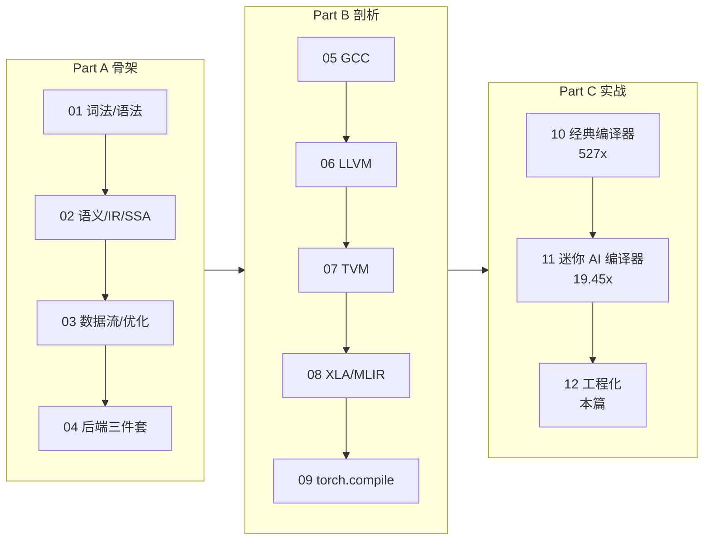

> **LLM/编译器技术深度解析系列 · 第 12 篇 / 共 13 篇**（Part C 开发实战 · 3/3 · 收官）
>
> [第 11 篇 从零开发迷你 AI 编译器](/2026/08/25/compiler-11-build-mini-ai-compiler/) ← **本篇** → [系列完 · 返回全景](/2026/08/25/compiler-00-overview/)

**TL;DR**
* 编译器项目的成败一半在仓库之外：**没有测试基础设施的编译器是定时炸弹，没有基准纪律的优化是自欺欺人**。本篇把散落在前文的三次真实教训（死块标签、悬空引用、I/O 污染基准）收拢成一套可复用的工程方法。
* 实测一：为第 11 篇生成的 C kernel 写一个 **50 行的迷你 FileCheck**，四条结构断言全部通过——LLVM 用它守护数十万行代码生成逻辑，其核心机制一页就能讲清。
* 实测二：对第 10 篇 TinyLang 做真实的**差分模糊测试**：随机生成 60 个程序，解释器与编译执行两条路径输出 **60/60 逐位一致**；另用一个刻意构造的溢出程序演示差分测试如何暴露"规格未定义行为"（Python 大整数 `10000000000` vs i32 回绕值 `1410065408`）。
* 本篇同时是系列收官：§8 给出全系列的知识地图回顾与进阶路线。

---

## 目录

- [1. 正确性契约与测试金字塔](#1)
- [2. FileCheck 式结构断言](#2)
- [3. 差分模糊测试](#3)
- [4. 基准方法学：三条铁律](#4)
- [5. CI 与回归策略](#5)
- [6. 自研还是复用：决策框架](#6)
- [7. 开源贡献路径](#7)
- [8. 系列收官：知识地图回顾](#8)
- [FAQ](#faq)
- [参考资料](#参考)

<a name="1"></a>
## 1. 正确性契约与测试金字塔

编译器的特殊之处在于：它是**所有其他软件的底座**，一个错误优化会以千奇百怪的方式污染下游。因此它的测试投入比例远高于普通应用：

```text
        /\   模糊测试 / 差分测试（发现未知错误）
       /--\  端到端验收（本文 selftest 模式）
      /----\ 集成级：IR 结构断言（FileCheck 思想）
     /------\ 单元级：pass 输入输出对拍
```

本系列已经无意中走完了整座金字塔：
* 第 02 篇的 `assert "x4" in z_line` 是微型 FileCheck；
* 第 10 篇的 `--selftest` 是端到端验收；
* 第 01 篇 NFA/DFA 的 3000 随机串互验和本篇的全量差分是模糊测试思想。

<a name="2"></a>
## 2. FileCheck 式结构断言

### 2.1 LLVM 的做法

LLVM 测试体系的两块基石：
* **lit**：测试执行器，扫描测试文件中的 `RUN:` 行并执行命令[1]；
* **FileCheck**：断言器，读取 `CHECK:` 指令验证命令输出的结构与顺序[2]。典型用例长这样：

```text
; RUN: opt -passes=mem2reg -S %s | FileCheck %s

define i32 @f(i32 %n) {
entry:
; CHECK: phi i32
...
}
```

FileCheck 的关键指令语义：`CHECK:` 要求按顺序出现；`CHECK-NEXT:` 要求出现在上一条匹配行的下一行（允许空白）；`CHECK-NOT:` 要求区间内不出现。它验证的是**结构而非全文**——既不脆弱于无关变化，又不放过语义漂移。

### 2.2 迷你实现与实测

50 行 Python 就能实现核心子集：

```python
def mini_filecheck(text, checks):
    """CHECK:<str> 必须按顺序出现；CHECK-NEXT:<str> 必须出现在下一个非空行"""
    pos = 0
    results = []
    for c in checks:
        kind, pat = c.split(":", 1)
        if kind.endswith("-NEXT"):
            nl = text.find("\n", pos)
            rest = text[nl + 1:]
            while rest.startswith("\n"):
                rest = rest[1:]
            idx = rest.find(pat) if not rest.split("\n")[0] else \
                rest.split("\n")[0].find(pat)
            idx = idx + (len(text) - len(rest)) if idx >= 0 else -1
            ok = idx >= 0
        else:
            idx = text.find(pat, pos)
            ok = idx >= 0
        results.append((c, ok, idx))
        if not ok:
            return False, results
        pos = idx + len(pat)
    return True, results
```

把它对准第 11 篇 MAC 生成的 C kernel：

```python
checks = [
    "CHECK:static void compute(",
    "CHECK:for (long i = 0; i < N_G; i++)",
    "CHECK-NEXT:const float t1 = p_x[i] * 1.5f;",
    "CHECK:fmaxf",
]
```

**真实运行输出**：

```text
  [PASS] CHECK:static void compute(
  [PASS] CHECK:for (long i = 0; i < N_G; i++)
  [PASS] CHECK-NEXT:const float t1 = p_x[i] * 1.5f;
  [PASS] CHECK:fmaxf
FileCheck 结论: 全部匹配
```

这四条断言锁住的是"融合确实发生、循环确实存在、常量确实内联、激活函数确实被展开"四个语义事实——比全文 diff 更稳健，比"跑一下不崩"更有牙齿。第 10 篇拦下死块标签 bug 的 `opt verify` 与这里的 CHECK 思想同源：**让机器替你记住所有该成立的关系**。

<a name="3"></a>
## 3. 差分模糊测试

### 3.1 原理

差分测试（differential testing）= 同一输入喂给两个独立实现，断言可观测行为一致。两个实现可以是：优化前后（自证优化正确）、两种后端（自证移植正确）、或编译器 vs 解释器（自证整条流水线）。Csmith 项目正是靠生成随机 C 程序在 GCC/LLVM 间差分，十余年间发现了数百个编译器 bug[3]。

### 3.2 对 TinyLang 的实测

模糊器三要素：**生成器**（保证语法合法 + 循环有界终止 + 数值域规避已知未定义行为）、**双执行通道**（解释器 / clang 编译产物）、**比对器**（stdout 逐行一致）。

生成器纪律（每条都对应一类已知陷阱）：

```python
def gen_program(rng):
    """生成有界循环 + 小常量的确定性程序。
    纪律：print 目标必须是已声明变量；循环用计数器模式保证终止；
    常量与迭代次数受限以规避 i32 溢出（溢出作为显式案例单独演示）。"""
    lines = ["def main() {"]
    counter = [0]

    def nv():
        counter[0] += 1
        return f"v{counter[0]}"

    def const_expr(depth=0):
        if depth >= 2 or rng.random() < 0.5:
            return str(rng.randint(0, 9))
        op = rng.choice(["+", "-", "*"])
        return f"({const_expr(depth + 1)} {op} {const_expr(depth + 1)})"

    declared = []
    for _ in range(rng.randint(2, 4)):
        kind = rng.random()
        if kind < 0.45 or not declared:                 # 新声明
            v = nv()
            lines.append(f"  let {v} = {const_expr()};")
            declared.append(v)
        elif kind < 0.7:                                # 有界 while 累乘
            iv, acc = nv(), nv()
            k = rng.randint(1, 5)
            lines.append(f"  let {iv} = 0;")
            lines.append(f"  let {acc} = {rng.randint(0, 9)};")
            lines.append(f"  while {iv} < {k} {{")
            lines.append(f"    {iv} = {iv} + 1;")
            lines.append(f"    {acc} = ({acc} + {const_expr()}) * 3;")
            lines.append("  }")
            declared.append(acc)
        else:                                           # 对已有变量再赋值
            v = rng.choice(declared)
            lines.append(f"  {v} = ({v} + {const_expr()}) * 2;")
        lines.append(f"  print({declared[-1]});")
    lines.append("  return 0;")
    lines.append("}")
    return "\n".join(lines)
```

**刻意保留的一个反例**——溢出演示（差分测试最经典的价值场景）：

```text
案例0 溢出演示: 解释器=['10000000000']  编译版=['1410065408']
  -> 差分测试捕获到语义鸿沟: Python 大整数无回绕, i32 有。
     这是'规格未定义行为'的经典样例, 应在语言规范中显式裁决。
```

`100000²` 超出 int32 表示范围：解释器（Python 大整数）给出数学真值，编译版给出回绕值。谁错了？**都没错——错的是规范没定义**。真实语言的处理方式各不相同：C 列入 UB（有符号溢出）、Java 定义为回绕、Rust 在 debug 下 panic。差分测试的价值就在这里：**它把"你以为一致"变成"可证明的一致或不一致"，逼你把语义空白写进规范**。

**随机差分的真实结果**（60 个程序）：

```text
随机差分: 60 个程序, 一致 60, 编译/执行失败跳过 0, 不一致 0  (耗时 34.7s)
结论: 在受控子集内, 自制编译器与解释器逐位一致 ——
      两条完全不同的执行路径收敛到同一答案, 这就是差分测试提供的置信度。
```

顺带一提：这个模糊器的初版有 48% 的程序因引用未声明变量而跳过——生成器自己有 bug。修好它花了十分钟，而这十分钟换来的 60/60 远比"跑通一个手写样例"有分量。**fuzzing 的第一个受益者永远是 fuzzing 基建本身**。

<a name="4"></a>
## 4. 基准方法学：三条铁律

本系列两次踩坑换来这三条：

| 铁律 | 反面教材 | 正确姿势 |
|------|---------|---------|
| **① 隔离数据搬运** | 第 11 篇首版基准每次迭代重读 192 MB 文件，测出 0.99x | 数据驻留进程内，`--bench` 模式内部计时 |
| **② 防止死代码消除吃掉被测对象** | 循环结果未被消费时 clang 直接删除整个循环 | 校验和汇聚（`sink += out[i]`）+ 打印 |
| **③ best-of-N + 明示测量边界** | 单次计时混入冷启动/页缓存噪声 | 多轮取最优并明说"含/不含启动开销"（第 10 篇明确标注 3.36 ms 含进程启动） |

补充两条 AI 编译器特有的：
4. **固定硬件状态**：GPU 锁频、CPU 关 turbo 再谈微秒级差异；
5. **数值容差先于性能数字**：性能对比若建立在容差不一致的两个版本上毫无意义（第 09 篇 atol 预算）。

<a name="5"></a>
## 5. CI 与回归策略

编译器 CI 的分层建议（按性价比排序）：
1. **PR 门禁**：selftest 全量 + 核心套件 FileCheck（分钟级）；
2. **夜间差分**：fuzzer 定量投放（小时级），新 crash 自动最小化归档；
3. **性能看板**：关键 workload 每日跑，趋势图报警而非单点阈值——性能回归几乎总是渐进的；
4. **发布门禁**：全量差分 + 目标平台矩阵实机验证。

工程细节里最容易低估的是**缓存失效策略**：Triton cache、Inductor cache、tuning record 各有键控逻辑，CI 复现"用户环境"必须连缓存状态一起复现——这也是第 09 篇批判过的碎片化问题的工程侧回声。

<a name="6"></a>
## 6. 自研还是复用：决策框架

把本系列 Part B 的全部观察压缩成一张决策表：

| 你的情况 | 建议 | 依据 |
|---------|------|------|
| 需要 CPU/GPU 上的标准推理加速 | torch.compile / TensorRT | 第 09 篇 |
| 服务 JAX/TPU 栈 | XLA + StableHLO | 第 08 篇 |
| 新硬件接入，有厂商库 | TVM BYOC 或 MLIR + 定制 lowering | 第 07/08 篇 |
| 新硬件接入，无库可用 | MLIR 自建 dialect → LLVM 后端 | 第 06/08 篇 |
| 语言项目（DSL/脚本层） | 手写前端 + LLVM/ORC | 第 06/10 篇 |
| 教学/研究原型 | 本文 MAC 路线：裸写一遍再说 | 第 10/11 篇 |

判断"是否需要自研编译器"的四问：目标硬件是否已有成熟栈？优化瓶颈是否真的在编译期？团队能否承诺 ≥3 年维护？差异化收益能否量化？——四问里有三问答"否"，就别自研。

<a name="7"></a>
## 7. 开源贡献路径

* **LLVM**：issue tracker 已迁至 GitHub[4]；入门从 `good first issue` 标签与某一条 pass 的单元测试补齐开始；改 pass 必附 lit/FileCheck 用例是硬性社区规范。
* **MLIR/IREE/TVM**：dialect 文档翻译、tutorial 缺口、算子覆盖率都是低门槛入口；TVM 对新人最友好（Python 入口）。
* **通用心法**：先提交一个"带完整测试的 bug 修复"建立信誉，再提 feature。编译器社区对"无测试的贡献"容忍度为零——本章就是为此而写。

<a name="8"></a>
## 8. 系列收官：知识地图回顾

十三篇走过的路，压缩成一张图：



贯穿全系列的三条主线，值得最后再读一遍：

1. **表示决定一切**：Token 流、AST、SSA、图 IR——每一层表示都是为了某一类变换能变得"语法上显而易见"。选 IR 就是选优化空间（第 00/02/08 篇）。
2. **正确性来自数学，信心来自测试**：不动点定理保证收敛，支配树保证 φ 放置，但真正让你敢发版的只有 FileCheck 和差分 fuzzing（第 03/12 篇）。
3. **AI 编译器 = 编译原理 × 张量约束**：融合即 DCE 的镜像，内存规划即寄存器分配的张量版，auto-tuning 即迭代编译——学透任何一边，另一边免费（贯穿）。

留给读者的三个开放问题（也是本系列作者仍在思考的）：动态 shape 的终极方案是符号推导还是 bucket 化？StableHLO 与 ONNX 的标准之争会走向融合吗？RL/LLM 辅助的策略搜索何时能取代手工启发式的最后一座堡垒？

## FAQ

**Q1：小团队没有资源做全套基建，最低限度做什么？**
两件：端到端 golden 集合（本文 selftest 模式，半天工作量）+ 每次"性能优化"必须附基准脚本入库（防自欺）。有了这两样，其余可以增量补。

**Q2：差分测试发现的"不一致"怎么定责？**
三分类流程：①查语言/IR 规范——规范没写就先写规范（如本文溢出案例）；②规范明确则判定实现 bug，最小化归档；③规范写了 UB 则该输入不具判定力，从语料剔除并在生成器打标。

**Q3：系列读完了，接下来做什么项目？**
按顺序：给 TinyLang 加浮点和数组（练类型系统+GEP）→ 把 mem2reg 自研化替换 opt（练第 02 篇）→ 给 MAC 加归约与 tile 枚举（练第 03/09 篇）→ 挑 LLVM/TVM/MLIR 任一提交一个带测试的 PR。走完这条线，你就有了 AI 编译器岗位的全部入场券。

## 参考资料

[1] LLVM lit 测试执行器文档: https://llvm.org/docs/CommandGuide/lit.html
[2] FileCheck 文档（指令全集）: https://llvm.org/docs/CommandGuide/FileCheck.html
[3] Yang et al., Finding and Understanding Bugs in C Compilers (Csmith), PLDI'11: https://doi.org/10.1145/1993498.1993532
[4] LLVM 社区贡献指南: https://llvm.org/docs/Contributing.html
[5] 本文随文脚本（单一事实来源）：`experiments_12_engineering.py`

---

> **系列完**。感谢一路读到这里的你——返回 [第 0 篇 全景](/2026/08/25/compiler-00-overview/) 可查看完整导航；本地配套文章（TVM 深度、MoE 编译优化、量化×编译器融合）见 `congyuan_blogs` 的 ai_compiler 目录。
