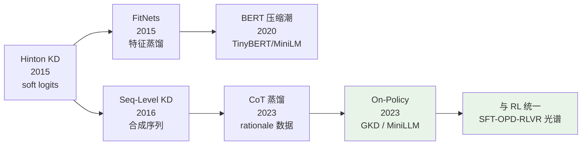

> **系列导航**：本文是《模型蒸馏》系列的综述入口。本博客已有三篇蒸馏方向的深度文章：《在线蒸馏方法全景》（[MiniLLM/GKD/OPD 理论统一](/2026/08/11/online-distillation-methods/)）、《On-Policy Distillation 单篇精读》（[OPD 深度剖析](/2026/08/11/on-policy-distillation-deepdive/)）以及打通 SFT/OPD/RLVR 的《[蒸馏与 RL 的统一损失光谱](/2026/08/22/distill-rl-unified-spectrum/)》。它们都默认读者熟悉经典 KD——本文补上这块地基：从 Hinton 2015 的软标签讲起，沿"输出级 → 特征级 → 序列级 → CoT 数据蒸馏 → on-policy 化"的脉络铺出完整地图。

## TL;DR

> **TL;DR 1｜一句话**：知识蒸馏的全部内容，是回答"学生到底该模仿老师的什么"——从 soft logits（经典 KD）、中间特征（FitNets 系）、完整输出序列（seq-level KD）、思维链数据（CoT 蒸馏），一路演进到模仿老师自生成分布的逐 token 决策（on-policy/GKD），模仿对象越来越接近"能力"而非"表面输出"。

> **TL;DR 2｜反直觉发现**：温度 $T$ 不是无关紧要的超参——它同时控制着梯度信噪比与类间距离信息的保留程度；而 2023 年后最重要的发现是，**在 token 级任务里，学生从自己的错误中学习（on-policy）远比逐词模仿老师（off-policy）高效**，这正是 GKD 与 MiniLLM 的共同结论。

> **TL;DR 3｜系列定位**：本文是全景地图与术语基准线；细节推导请进入三篇深度文章。读完本文你应当能判断：给定一个压缩/赋能需求，该选哪一支蒸馏、模仿什么信号、在线还是离线。

## 符号约定与变量映射表

| 数学符号 | 含义 | 代码变量 | 典型形状 |
|---|---|---|---|
| $z_t$ | teacher 的 logit | `teacher_logits` | `(B, V)` |
| $p_T(y\mid x)$ | teacher 分布 | `teacher_probs` | `(B, V)` |
| $q_S(y\mid x)$ | student 分布 | `student_probs` | `(B, V)` |
| $\tau$ | 蒸馏温度 | `temperature` | 标量 |
| $\mathcal{L}_{KD}$ | 蒸馏损失（KL 项） | `kd_loss` | 标量 |
| $f_l(x)$ | 第 $l$ 层特征图 | `hidden_states[l]` | `(B, L, D)` |
| $y^T$ | teacher 生成的序列 | `gen_ids` | `(B, Len)` |

## 1. 第一性原理：Dark Knowledge 与温度

Hinton 等人在《Distilling the Knowledge in a Neural Network》（[arXiv:1503.02531](https://arxiv.org/abs/1503.02531)）中给出的核心洞察是：**一个训练好的分类模型的输出概率里，藏着类与类之间的相似性结构**——一张宝马的图片被识别为卡车 0.02、胡萝卜 1e-9，这 0.02 就是"暗知识"，它告诉学生"宝马和卡车像在哪里"，而 one-hot 标签做不到。

带温度的软化公式：

$$p_T(y=i \mid x) = \frac{\exp(z_i / \tau)}{\sum_j \exp(z_j / \tau)}, \qquad \mathcal{L} = \alpha \cdot \tau^2 \, \mathrm{KL}\big(p_T \,\|\, q_S\big) + (1-\alpha)\,\mathrm{CE}(y, q_S)$$

两个工程要点：其一，$\tau > 1$ 抬高非最大类的概率、放大暗知识的信噪比，但过大后梯度趋于常数；其二，KL 项要乘 $\tau^2$ 做梯度尺度补偿——否则温度一调，硬标签与软标签的相对权重就悄悄变了。这个 $\tau$ 扫描是最值得动手复现的实验之一（见读者 Lab）。

## 2. 输出级之外：特征蒸馏谱系

logits 只能教"最终答案"。FitNets（《Hints for Thin Deep Nets》，[arXiv:1412.6550](https://arxiv.org/abs/1412.6550)）开了一支新流派：让学生模仿老师的**中间层特征**，此后衍生出注意力矩阵蒸馏、关系型蒸馏（样本间距离结构）等变体，并在 BERT 压缩时代集大成：

| 方法 | 模仿信号 | 特点 |
|---|---|---|
| FitNets ([arXiv:1412.6550](https://arxiv.org/abs/1412.6550)) | 隐层特征（hint layer） | 需要回归层对齐维度 |
| DistilBERT ([arXiv:1910.01108](https://arxiv.org/abs/1910.01108)) | logits + hidden + attention 三重损失 | 三项加权 $\lambda$ 是主要超参 |
| TinyBERT ([arXiv:1909.10351](https://arxiv.org/abs/1909.10351)) | 两阶段：先蒸馏隐层再微调 | 层级映射策略影响大 |
| MiniLM ([arXiv:2002.10957](https://arxiv.org/abs/2002.10957)) | 自注意力分布+值向量 | 只蒸最后一块，深教师浅学生 |

特征蒸馏在 CV 与 BERT 时代是主力，但在 decoder-only 的 LLM 里逐渐式微——原因很实际：层数上百、特征空间巨大，逐层对齐的工程成本高而收益被下一节的序列级方法覆盖。

## 3. 序列级蒸馏：暴露偏差问题的正式登场

分类任务的 teacher 给一个分布就够了，但生成任务是**逐步决策**：训练时学生吃 gold prefix、推理时却吃自己的输出，这个 train-test 错位就是暴露偏差。Kim & Rush 的《Sequence-Level Knowledge Distillation》（[arXiv:1606.07947](https://arxiv.org/abs/1606.07947)）给出至今仍最常用的解法：**让 teacher 先自回归生成完整序列 $y^T$，再用 gold-style 的交叉熵让学生在这些合成序列上训练**。成本几乎为零（一次 teacher 推理），效果立竿见影——原论文在 WMT14 上把 4 层 student 训到接近 8 层 teacher，这一招后来成为所有 LLM 合成数据蒸馏（如 Alpaca 式指令数据）的技术原型。

它的局限同样明显：学生永远在老师的轨迹上训练，从未见过并修正自己的错误——这个"off-policy"的天花板，要到七年后才被真正打破。

## 4. CoT 蒸馏：把推理过程当知识搬

2023 年后，蒸馏的对象从答案变成了**推理过程**。《Distilling Step-by-Step!》（[arXiv:2305.02301](https://arxiv.org/abs/2305.02301)）证明：用少量标注+LLM 自生成的 rationales做多任务训练，770M 学生可以在特定任务上超过 175B 的 teacher——知识不再只是参数里的统计规律，显式的中间推理步骤本身成了可迁移资产。这类方法的本质是**数据合成 + 序列级蒸馏**的组合拳，也是当下各家"小钢炮"模型（小参数高推理能力）的标准配方。

## 5. On-Policy 转向：从模仿输出到模仿分布

序列级蒸馏的根本缺陷在于训练信号来自 teacher 的轨迹而非学生的轨迹。GKD（[arXiv:2306.13649](https://arxiv.org/abs/2306.13649)）与 MiniLLM（[arXiv:2306.08543](https://arxiv.org/abs/2306.08543)）几乎同时指出修正方向：**让学生自己采样、老师在学生的状态上给反馈**。二者分别用 forward KL 的模式覆盖特性与 reverse KL 的 mode-seeking 特性解释了各自的选择，并把"蒸馏"推到了与 RLHF 仅一步之遥的位置——这条演化线的完整推导见《[在线蒸馏方法全景](/2026/08/11/online-distillation-methods/)》与《[On-Policy Distillation 深度剖析](/2026/08/11/on-policy-distillation-deepdive/)》；它与 RL 的数学统一则见《[蒸馏与 RL 的统一损失光谱](/2026/08/22/distill-rl-unified-spectrum/)》——SFT、OPD、RLVR 可以看作同一个目标函数在不同采样来源下的三次取值。

## 6. 批判与展望：Takeaway 与下一篇

### Takeaway

- **选型三问**：模仿什么信号（logits/特征/序列/CoT）？谁的轨迹（teacher off-policy / student on-policy）？有没有真实数据（data-free 可选项）？
- **温度与 $\tau^2$ 补偿是经典 KD 最容易做错的两处**；任何蒸馏实验都应先扫 $\tau$。
- **特征蒸馏在 LLM 时代性价比下降**，序列级/CoT 数据蒸馏 + on-policy 微调是当前主流组合。
- **蒸馏与 RL 正在合流**：当训练信号来自学生在自己轨迹上的评价时，两者的边界只剩"奖励来自 teacher 分布还是环境奖励"。
- 成本账要算全：teacher 生成数据的推理开销常常超过 student 训练本身，on-policy 方法尤其如此。

### 读者 Lab

三个可以立刻上手的练习：① 经典 KD 温度扫描——拿 MNIST/CIFAR 上的小 CNN，固定其他超参扫 $\tau \in \{1,2,4,8,16\}$，画出 student 精度曲线，亲手验证 $\tau^2$ 补偿去掉后的崩坏方式；② 序列级 KD 最小复现——用 HuggingFace 在 WMT14 en-de 子集上训练 2 层 student，对比用 6 层 teacher 合成数据与否的差异；③ 把本站《在线蒸馏方法全景》里的 GKD 伪代码改成 reverse KL 实现，观察生成多样性的变化。中文社区方面，知乎「知识蒸馏」「大模型蒸馏」话题下有大量 BERT 时代的实战复盘（zhihu.com），适合补充论文之外的实现细节。

下一篇将展开：《经典 KD 深度解析：温度、暗知识与梯度补偿的统计学》。

## 参考清单

**核心论文**

1. Hinton, Vinyals, Dean, *Distilling the Knowledge in a Neural Network*, NIPS Deep Learning Workshop 2015. [arXiv:1503.02531](https://arxiv.org/abs/1503.02531)
2. Romero et al., *FitNets: Hints for Thin Deep Nets*, ICLR 2015. [arXiv:1412.6550](https://arxiv.org/abs/1412.6550)
3. Kim & Rush, *Sequence-Level Knowledge Distillation*, EMNLP 2016. [arXiv:1606.07947](https://arxiv.org/abs/1606.07947)
4. Sanh et al., *DistilBERT*, 2019. [arXiv:1910.01108](https://arxiv.org/abs/1910.01108)
5. Jiao et al., *TinyBERT*, Findings of EMNLP 2020. [arXiv:1909.10351](https://arxiv.org/abs/1909.10351)
6. Wang et al., *MiniLM: Deep Self-Attention Distillation*, 2020. [arXiv:2002.10957](https://arxiv.org/abs/2002.10957)
7. Hsieh et al., *Distilling Step-by-Step!*, ACL Findings 2023. [arXiv:2305.02301](https://arxiv.org/abs/2305.02301)
8. Agarwal et al., *GKD: On-Policy Distillation of Language Models*, ICLR 2024. [arXiv:2306.13649](https://arxiv.org/abs/2306.13649)
9. Gu et al., *MiniLLM: Knowledge Distillation of Large Language Models*, ICLR 2024. [arXiv:2306.08543](https://arxiv.org/abs/2306.08543)

**开源实现**

- [HuggingFace transformers Trainer](https://huggingface.co/docs/transformers/main_classes/trainer)：配合自定义 KL 损失即可实现全部本文方法
- [TextDistillers / distillery 类社区项目](https://github.com/search?q=knowledge+distillation+huggingface&type=repositories)：序列级蒸馏的参考模板

**系列互引**

- 《[在线蒸馏方法全景：从 MiniLLM、GKD 到 OPD 的理论统一与工程实践](/2026/08/11/online-distillation-methods/)》
- 《[On-Policy Distillation 深度剖析](/2026/08/11/on-policy-distillation-deepdive/)》
- 《[蒸馏与 RL 的统一损失光谱](/2026/08/22/distill-rl-unified-spectrum/)》
