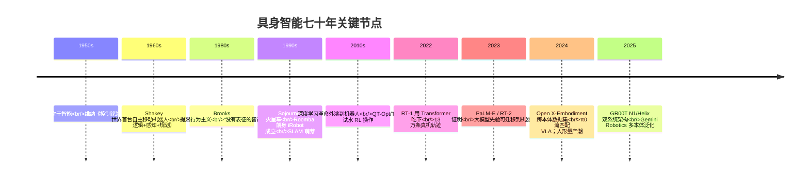
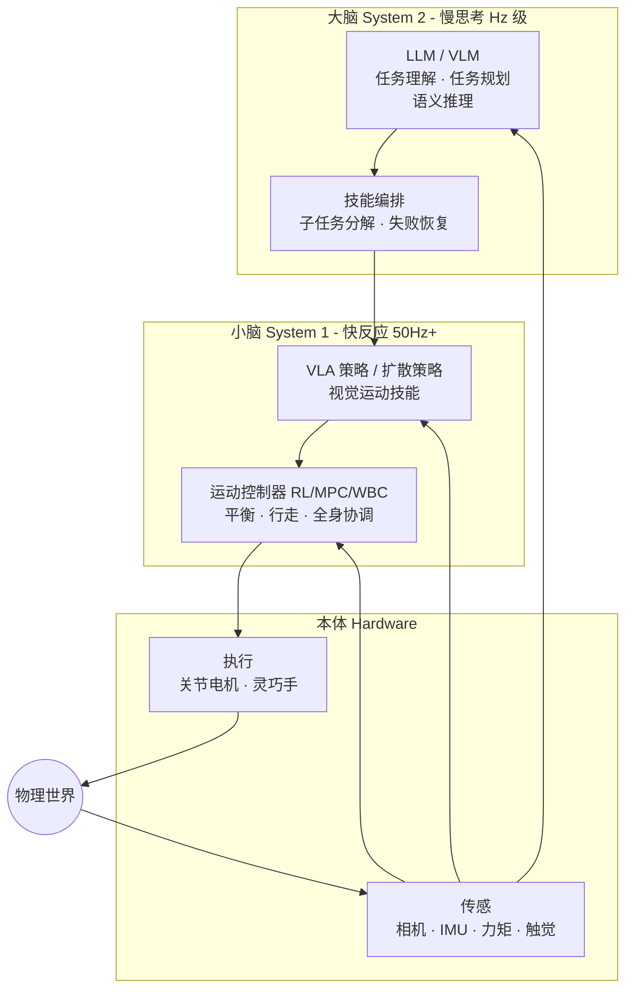
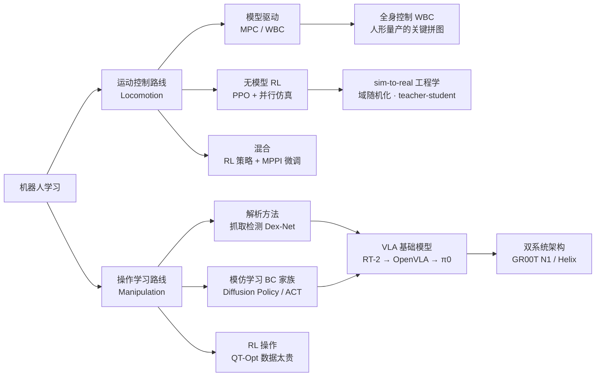
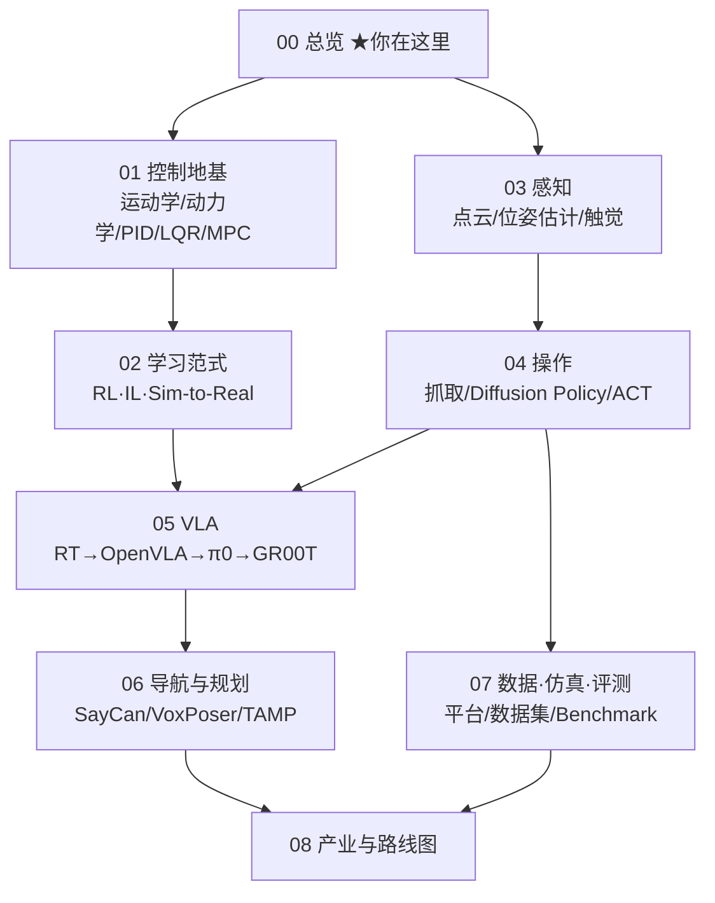

> **系列导航**：《具身智能》系列共 9 篇，目标是从零基础走到能读懂顶会论文、跑通开源项目的水平。本篇是总纲：回答"具身智能是什么、为什么是现在、整个领域的地图长什么样"。后续八篇依次深入控制地基、学习范式、感知、操作、VLA、导航规划、数据仿真评测与产业路线图。

## TL;DR

> **TL;DR 1｜一句话定义**：具身智能（Embodied AI）= 让智能体**通过身体与物理环境的闭环交互**来获取并运用智能。它与 LLM 的根本区别在于：LLM 的"世界"是文本分布，具身智能的"世界"是不可撤销的物理因果——打翻的水杯无法 Ctrl+Z。

> **TL;DR 2｜领域钥匙**：莫拉维克悖论——对 AI 来说，下棋推理是"简单"的，而让机器人抓起一个鸡蛋这种一岁小孩都会的事反而是"困难"的[1](https://en.wikipedia.org/wiki/Moravec%27s_paradox)。理解了这个悖论，就理解了为什么 2020 年前机器人学靠模型与控制论硬啃，而 2023 年后整个领域押注"大模型先验 + 大规模数据"。

> **TL;DR 3｜当前主线**："大脑"（VLA 视觉-语言-动作模型）+ "小脑"（RL 运动控制）+ "本体"（低成本高爆发执行器）+ 数据飞轮（遥操作/仿真/世界模型）。2023 年 RT-2 首次把网络级语义知识迁移到机器人控制[2](https://arxiv.org/abs/2307.15818)，2024 年 Open X-Embodiment 汇聚 22 种机器人本体百万级轨迹[3](https://arxiv.org/abs/2310.08864)，2024–2025 年 π0[4](https://arxiv.org/abs/2410.24164)、GR00T N1[5](https://arxiv.org/abs/2503.14734)、Helix 等把这条线推向人形量产前夜。

---

## 目录

- 1. 什么是具身智能（三要素正反例 · 与 LLM 的系统级对比 · 概念边界）
- 2. 七十年简史：这个领域是怎么走到今天的（控制论 → Shakey → 行为主义 → 深度 RL → VLA 元年）
- 3. 领域钥匙：莫拉维克悖论（进化论证 · 算力账本 · 三条技术推论）
- 4. 系统分层：大脑、小脑、本体（数据流与延迟带宽账本 · 数据金字塔数量级）
- 5. 为什么是现在：三大技术条件同时成熟
- 6. 方法谱系一张图（三条路线之争）
- 7. 产业版图速览（截至 2025 年中）
- 8. 本系列学习地图与前置知识自查
- Lab Exercises（3 个可动手实验）
- 参考文献与延伸阅读

---

## 1. 什么是具身智能

### 1.1 定义拆解：三要素的正例与反例

学术界对具身智能没有唯一权威定义，但主流表述收敛于三个要素：

| 要素 | 含义 | 反例 |
|------|------|------|
| **身体 Body** | 拥有物理形态与传感器/执行器 | 纯软件 Agent（如 ChatGPT 本身） |
| **环境 Environment** | 存在于真实或仿真的物理世界中 | 封闭测试集 |
| **交互闭环 Interaction** | 感知 → 决策 → 行动 → 改变世界 → 再感知 | 开环回放 |

表格只是骨架，三要素各自都有值得推敲的边界情况，逐条展开：

**要素一：身体（Body）——为什么"有个壳"不是重点，"能被物理规律惩罚"才是。**

- 正例：机械臂、四足机器人、人形机器人显然满足。但注意**具身不等于人形**——吸尘器机器人的形态由任务决定，Roomba 的圆盘形状本身就是一种"智能设计"（沿墙行走策略与外形耦合）；
- 反例：ChatGPT 没有身体，它的一切输入都已经被人类转写成 token，一切输出都要经过人类才能落到世界上——它**既不能感知原始物理信号，也不能施加原始物理作用**；
- 灰色地带：一个跑在仿真器里的虚拟机器人有没有身体？有——只要仿真环境对它的动作施加**不可绕过的物理约束**（重力、碰撞、摩擦），身体的意义就已经成立。这也是为什么本系列把仿真训练（第 02/07 篇）视为具身智能的一等公民而非"假 embodied"；
- 更深一层是**形态计算（morphological computation）**思想：部分"计算"可以卸载给身体本身——猫从高处落下靠脊柱反射与肢体构型而非大脑决策完成翻身，无源义肢靠机械结构被动适应地形。身体不只是传感器和执行器的容器，它本身就是控制器的一部分。

**要素二：环境（Environment）——关键词是"开放"与"非平稳"。**

- 正例：家庭厨房。物品会被移动、光照随昼夜变化、液体每次倾洒的动力学都不同——环境不会配合你的假设；
- 反例：ImageNet 测试集。数据分布冻结、无隐藏状态、答案唯一——它是环境的"标本"，不是环境本身；
- 关键区分：**环境 vs 场景**。自动驾驶常被认为"只差一步到具身智能"，正是因为道路环境被交通规则强约束、被基建持续维护，其开放性远低于家庭与工地。环境的开放程度决定了长尾问题的严重程度，这比传感器多少更本质。

**要素三：交互闭环（Interaction Loop）——这是三要素中最容易被低估的一条。**

- 正例：你伸手摸到一个杯子表面湿滑 → 立刻调整握力 → 杯子没掉 → 继续倾倒。感知与行动以毫秒级互相塑造；
- 反例一：**开环回放**。早期"机器人电视厨师"式的演示按预设脚本执行，感知结果从不影响后续动作——没有闭环就没有纠错，也就没有"智能行为"可言；
- 反例二：**视频生成模型**。Sora 类模型能生成逼真的倒水视频，但它不承担后果、不被物理世界校验——它可以违反守恒律而不受任何惩罚。这就是"看一万遍游泳视频学不会游泳"的形式化表述，也预告了第 07 篇要讨论的问题：视频数据到底能为机器人策略提供什么、不能提供什么；
- 闭环还意味着**因果方向反转**：监督学习的箭头是"数据 → 模型"，而具身闭环的箭头是"模型的当前策略 → 决定采集什么数据 → 反过来改变模型"。数据分布是策略的函数，这让整个学习理论（covariate shift、off-policy 问题）都变得微妙——第 02 篇会给出数学版本。

三个要素同时成立，才有完整意义上的具身智能。缺身体则退化为对话系统，缺开放环境则退化为程序自动化，缺闭环则退化为录像回放。

这个思想可以追溯到图灵 1950 年的预言：

> "给机器装上最好的传感器（摄像头、麦克风），再教它英语……这是制造智能机器的最佳路径。" —— A. M. Turing, *Computing Machinery and Intelligence*[6](https://doi.org/10.1093/mind/LIX.236.433)

有趣的是，AI 的历史恰恰反着走了一遍：先在纯符号/文本世界里做了 70 年，最近五年才回头补"身体"这一课。李飞飞将其概括为从"互联网 AI"到"具身空间 AI（Spatial Intelligence）"的迁移。她的论据很直观：人类婴儿不需要百万张带标签图片就能理解三维空间，因为**空间理解是通过移动自己的身体、观察世界如何回应而习得的**——这正是三要素定义的认知科学注脚。

### 1.2 与 LLM 的本质区别

$$
\underbrace{\pi_\theta(a_t \mid o_t)}_{\text{具身策略：观测}\to\text{动作}} \quad \neq \quad \underbrace{P(w_t \mid w_{<t})}_{\text{语言模型：token}\to\text{token}}
$$

两者的关键差异不在输入输出形式，而在三个物理属性上：

1. **不可撤销性**：物理动作有真实后果，探索代价高昂 → 数据天然稀缺；
2. **实时性**：控制回路往往要求 \(50\sim1000\,\mathrm{Hz}\)，而 LLM 前向传播一次是百毫秒级 → 架构必须分层；
3. **部分可观测 + 非平稳**：真实世界永远有未建模的摩擦、光照、形变 → 必须处理 sim-to-real gap。

把这三点展开成一张系统级对照表，差异会更加刺眼：

| 维度 | LLM | 具身智能系统 |
|------|-----|--------------|
| **数据分布 vs 物理因果** | 知识来自互联网文本的统计共现，分布即知识的全部来源；文本是对世界的描述，不是世界本身 | 知识必须来自与世界因果过程的交互；水杯会碎是因为力学定律，不是因为语料里这么写 |
| **错误可逆性** | 幻觉了就重新生成一次，边际代价约等于电费 | 打翻的水杯无法 Ctrl+Z；错误可能损坏硬件、弄伤旁人，因此每个动作都隐含安全约束 |
| **样本效率** | 一次预训练消耗万亿 token，之后单任务可零样本/少样本 | 每项技能都要专门采集：QT-Opt 学会抓取花了 7 台机械臂数月共 58 万次尝试[10](https://arxiv.org/abs/1806.10293)；物理探索无法并发复制粘贴 |
| **评估方式** | 封闭 benchmark 秒级可复现（MMLU、GSM8K），社区一天能刷完一轮榜单 | 真机评测慢且难复现——同一个初始状态几乎不可能精确重建；仿真 benchmark 又引入 sim-to-real gap（第 07 篇专论） |
| **失效模式** | 幻觉、偏见、prompt 注入——产出错误的**文本** | 振荡、跌倒、夹伤、长尾场景骤然失稳——产出错误的**动作**；失败模式必须用安全边界兜底，而不是靠人工审核 |
| **时间约束** | 吞吐导向，延迟宽松（用户可接受秒级首 token） | 硬实时分级（详见第 4 节延迟账本）：平衡回路错过一个周期就可能摔倒 |
| **监督信号** | next-token prediction 监督稠密、免费、自动生成 | 奖励要么稀疏（成功/失败），要么需要手工设计；演示数据按小时计费 |

这张表的最后一行其实暗含了一个残酷的不对称：**LLM 的监督信号是人类语言本身自带的，而具身智能的监督信号必须被制造出来**。整个领域过去十年的工程史，本质上就是一部"如何廉价地制造物理交互监督信号"的历史——遥操作、域随机化、世界模型都是这条主线上的变奏。

这三点决定了具身智能不能简单等于"LLM 加个机械臂接口"，也解释了后面所有技术选型。

### 1.3 一个容易混淆的概念边界

- **传统工业机器人**：高精度、封闭场景、预编程轨迹——有身体但几乎无学习；
- **自动驾驶**：有身体有学习，但任务空间被道路规则强约束，一般被视为具身智能的特例；
- **游戏 AI（AlphaGo/Voyager）**：有交互闭环但环境是虚拟的，常被称为"准具身"；其中 Voyager 用 LLM 在 Minecraft 中开放式积累技能库的思路[7](https://arxiv.org/abs/2305.16291)直接启发了大量机器人工作；
- **带工具的 LLM Agent**：能调用搜索、写文件、下单订机票，看似在"行动"，但其环境是数字化的、可撤销的、由人类维护语义的——按 1.1 的标准，它缺的是"被物理规律惩罚"这一环。一个实用的试金石：**把这个 Agent 的输出直接接到物理执行器上，它还能工作吗？** 目前答案普遍是否定的，而这个差距就是本系列要填的东西。

## 2. 七十年简史：这个领域是怎么走到今天的



几个必须记住的里程碑：

- **1966–1972，Shakey the Robot**（SRI International）：第一台能把感知、规划、行动整合的移动机器人，催生了 A* 搜索算法[8](https://ieeexplore.ieee.org/document/4082128)。
- **1991，Rodney Brooks《Intelligence without representation》**：挑战符号主义 AI，主张智能来自感知-行动的直接耦合，是具身智能哲学上的奠基文献之一[9](https://people.csail.mit.edu/brooks/papers/AIJ.pdf)。
- **2016–2019，深度 RL 试水真机**：Google 的 QT-Opt 用 7 台机械臂数月采集 58 万次抓取尝试学会抓取[10](https://arxiv.org/abs/1806.10293)，TossingBot 学会"抛投"超出训练分布的物体[11](https://arxiv.org/abs/1903.11239)。结论：RL 能学出人类写不出的策略，但**数据成本高得离谱**。
- **2022–2023，Robotics Transformer 元年**：RT-1 把 13 万条演示喂进 Transformer 得到能泛化的操作策略[12](https://arxiv.org/abs/2212.06817)；RT-2 证明把 VLM 动作 token 化可以继承网络语义知识（"把可乐挪到泰勒·斯威夫特照片旁边"这类零样本指令）[2](https://arxiv.org/abs/2307.15818)。
- **2024 至今，规模化与产业化并行**：Open X-Embodiment 横跨 21 个机构的 22 种机器人本体[3](https://arxiv.org/abs/2310.08864)；Physical Intelligence 的 π0 用流匹配生成连续动作块[4](https://arxiv.org/abs/2410.24164)；NVIDIA GR00T N1 提出"快慢双系统"[5](https://arxiv.org/abs/2503.14734)；Figure Helix 宣称在人形机器人上实现全上身 VLA 控制（官方技术报告）[13](https://www.figure.ai/news/helix)。

时间线只是骨架，下面按五个时代补充每个阶段的**关键技术细节与教训**——每一代人都解决了一个问题，同时留下一个问题给下一代。

### 2.1 史前史：维纳与反馈的发明（1948–1965）

1948 年，数学家诺伯特·维纳出版《Cybernetics: Or Control and Communication in the Animal and the Machine》，把"动物与机器共有的控制和通信"命名为控制论[25](https://en.wikipedia.org/wiki/Cybernetics)。这本书贡献了两个至今仍是机器人学底座的思想：

1. **负反馈即目的性行为**：恒温器、巡航导弹、人体血糖调节共享同一个数学结构——用输出与目标的偏差来修正输入。"目的"不再需要神秘主义解释，它就是反馈回路的涌现性质。今天的 PID 控制器（第 01 篇主角）是这一思想的最简形式，而全身控制 WBC 不过是把几十个这样的回路耦合起来求解；
2. **通信与控制同构**：感知（测量噪声中的信号）与行动（在有扰动的通道里施加影响）是同一个信息问题的两面。这个视角预言了后来的 SLAM（同时估计自身状态与环境地图）与 POMDP 形式化。

控制论时代的遗产延续至今：任何具身系统的最底层永远是一个反馈控制回路，这一点从未被任何新范式推翻过——深度学习改写了"回路里的映射怎么来"，但没有改写"必须是回路"。

### 2.2 符号主义豪赌：Shakey、STRIPS 与组合爆炸（1966–1985）

Shakey 项目（SRI International，1966–1972，DARPA 资助）的目标在今天看来依然激进：造一台能接收自然语言指令（"把箱子推到房间 B"）、自主感知、规划并执行的移动机器人。它留下了三项影响至今的技术遗产：

1. **A\* 启发式搜索**：Hart、Nilsson 和 Raphael 为 Shakey 的路径规划发明了 \(f(n)=g(n)+h(n)\) 的最优搜索框架，今天仍是最短路径问题的教科书默认答案[27](https://doi.org/10.1109/TSSC.1968.300136)；
2. **STRIPS 规划器**：Fikes 与 Nilsson 1971 年提出用"前置条件-删除表-添加表"三元组表达动作，把规划归约为定理证明[26](https://doi.org/10.1016/S0004-3702(71)80010-5)。STRIPS 语言至今活在 PDDL/TAMP 社区里（第 06 篇会重逢）；
3. **感知-规划-执行分层的原型**：Shakey 的架构就是"大脑-小脑-本体"分层的直系祖先。

但教训同样深刻：在当时的算力下，Shakey 完成一次完整的感知-建模-规划-执行周期动辄以小时计；世界模型稍有扰动（挪一把椅子）整套符号地图就作废。符号主义证明了**智能可以分解为形式化推理**，却低估了莫拉维克悖论——最难的部分根本不在推理层，而在"把像素变成符号"这一步。这个问题悬置了三十年，直到深度学习补上。

### 2.3 行为主义起义：Brooks 与包容架构（1986–2010）

1986 年，MIT 的 Rodney Brooks 发表《A Robust Layered Control System for a Mobile Robot》，提出包容架构（Subsumption Architecture）[28](https://doi.org/10.1109/JRA.1986.1087032)：不用中央世界模型，而是叠加一组越来越复杂的**行为层**（避障 → 游荡 → 探索 → …），高层可以抑制低层的输出但不能等待它。配套的哲学宣言就是 1991 年那篇《Intelligence without representation》[9](https://people.csail.mit.edu/brooks/papers/AIJ.pdf)——智能不需要显式符号表征，可以直接从感知到行动的快速耦合中涌现。

这个路线的实战成果超出学院派的想象：Brooks 联合创立的 iRobot 在 2002 年推出的 Roomba，其核心正是行为主义式的简单反应层组合——没有 SLAM、没有地图，却成了史上销量最大的家用机器人。六足步行机器人 Genghis 则证明：不建模动力学，靠每条腿独立的反射式步态也能走路。

行为主义的洞见（快速反应层、去中心化、感知-行动紧耦合）后来以新形态回归：今天分层架构里 200 Hz 的小脑策略，精神上就是包容架构的一个"可学习版本"；而它的局限同样清晰——纯反应式系统无法完成需要长期记忆与组合推理的任务。历史给出的答案是**两者都要**，这正是第 4 节双系统架构的伏笔。

### 2.4 深度 RL 攻克运动控制：locomotion 的范式转移（2016–2021）

深度学习外溢到机器人学的第一场决定性胜利发生在**运动控制**而非操作上，原因是结构性的：locomotion 的奖励好写（前进速度、能耗、不摔倒）、仿真误差容忍度高（足底接触比指尖接触"粗糙"得多）、且允许大规模随机重启。三个标志性节点：

1. **2018–2019，ETH Zurich 让 ANYmal 学会走路并走向户外**：Hwangbo、Hutter 等人先用神经网络拟合真实执行器的非线性响应（actuator network，替代理想化扭矩源），再在仿真中以 RL 训练策略，零样本迁移到真机——ANYmal 因此获得超越传统模型法控制器的动态性能与抗扰恢复能力，登上 Science Robotics[29](https://doi.org/10.1126/scirobotics.aau5879)。这篇论文确立了沿用至今的标准配方：**执行器辨识 + 域随机化 + teacher-student 蒸馏**（第 02 篇逐一拆解）；
2. **2021，GPU 并行仿真引爆迭代速度**：Isaac Gym 把物理步进搬进 GPU，万级环境并行使四足行走策略的训练从数天缩到 20 分钟以内[15](https://arxiv.org/abs/2108.10470)。训练速度提升四个数量级意味着"调奖励函数"第一次变成了可以试错的日常操作——工具的改变重塑了研究方法论；
3. **同期，DayDreamer 展示世界模型路线**：机器人在"脑内想象"中训练策略，真机只做部署，一小时真实交互就能让四足学会翻滚起身[16](https://arxiv.org/abs/2206.14176)。

至此，四足运动控制在 2022 年前后基本被"RL + sim-to-real"范式拿下——宇树等国产厂商能把四足卖到万元级并且出厂即会小跑，背后正是这套已经工程化的配方。而**操作（manipulation）没能复制这场胜利**：接触动力学太敏感、奖励太难写、真机数据太贵。这个不对称把领域推向了下一条路——模仿学习 + 大模型。

### 2.5 RT-1 与 VLA 元年：把互联网先验接进机械臂（2022 至今）

转折点的标志是 Google 机器人团队（后并入 DeepMind）连续三年的三次出手：

1. **RT-1（2022）**：把机器人控制当序列翻译——图像经 FiLM-EfficientNet 编码，动作离散成 256 个 bin 作为输出 token，Transformer 在 13 台机器人、17 个月、13 万条真机轨迹（覆盖 700 余种任务指令）上训练，取得对已见任务 97% 的成功率与显著优于 BC/QT-Opt 的泛化[12](https://arxiv.org/abs/2212.06817)。RT-1 的真正贡献不是精度而是**证明 Transformer 架构吃得下真机数据的规模化红利**；
2. **PaLM-E / RT-2（2023）**：PaLM-E 把图像与文本嵌入同一 token 序列做多模态推理[30](https://arxiv.org/abs/2303.03378)（未本地验证）；RT-2 干脆直接用 VLM 底座，把动作当作"第四种语言"输出，发现模型越大语义泛化越强的涌现现象[2](https://arxiv.org/abs/2307.15818)。VLA（Vision-Language-Action）作为一个正式范式在此确立——2023 年由此被称为 VLA 元年；
3. **开放化与产业化（2024 至今）**：Open X-Embodiment 用 21 个机构、22 种本体、百万级轨迹证明跨 embodiment 共训可行[3](https://arxiv.org/abs/2310.08864)；开源社区随即跟进 OpenVLA（7B 参数、LoRA 可微调）[31](https://arxiv.org/abs/2406.09246)（未本地验证）；π0 把扩散/流匹配引入动作头以输出平滑连续动作块[4](https://arxiv.org/abs/2410.24164)；GR00T N1[5](https://arxiv.org/abs/2503.14734)、Helix[13](https://www.figure.ai/news/helix)、Gemini Robotics[21](https://arxiv.org/abs/2503.20020)则把"System 1/System 2 双系统"变成行业共识架构。

回头看，这条线的精神内核一句话可以说完：**机器人学界七十年来第一次拥有了"借用互联网级知识"的能力，而不必从零教起。**

## 3. 领域钥匙：莫拉维克悖论

> "让计算机在智力测验或跳棋上达到成人水平相对容易；赋予它一岁儿童水平的感知与运动技能却极其困难，甚至不可能。" — Hans Moravec, 1988[1](https://en.wikipedia.org/wiki/Moravec%27s_paradox)

### 3.1 进化时长论证：为什么"感觉简单"的恰恰最难

Moravec 的进化论解释值得完整展开，因为它不是修辞而是有一套时间账本的论证：

- **感知-运动能力**：寒武纪大爆发（约 5.4 亿年前）出现了第一批具备眼睛与运动系统的复杂动物；此后五亿多年里，自然选择以近乎穷举的方式打磨"看-动"回路。凡是感觉"毫不费力"的技能（走路、抓握、识物），都经历了天文数字轮次的淘汰优化——**进化已经把它们压缩成了高度自动化的专用硬件**，所以主观上感觉不到难度；
- **抽象推理**：语言与形式化推理的历史不超过十万年量级，书面数学只有几千年。它们太新了，进化来不及将其固化为本能，只能占用晚近才扩容的前额叶皮层"手动运行"——所以我们做题要咬笔头，走路却可以想心事。

工程上的对应翻译：**越是主观感觉简单的任务，越是深度优化的专用系统，越缺乏可写的解析模型**。一岁小孩抓鸡蛋时，大脑运行的是五亿年打磨出来的分布式感觉运动回路；而下棋规则 1913 年就被 Duchamp 一类人形式化成了完全信息博弈。

### 3.2 算力账本：推理便宜，感知运动昂贵

用具体数量级感受一下这个倒挂：

| 任务 | 机器达到成人水平的算力需求（量级） | 备注 |
|------|----------------------------------|------|
| 国际象棋 | 专用 ASIC 每秒评估约 \(2\times10^8\) 个局面（Deep Blue，1997） | 完全信息、规则封闭，暴力搜索即可登顶 |
| 答题/考试 | LLM 推理一次约 \(10^{11}\sim10^{12}\) FLOPs | 已在多数标准化考试接近或超过人类 |
| 稳定抓取任意 household 物体 | 至今没有任何系统在开放世界里做到人类水平 | 接触动力学无解析解，感知遮挡、摩擦未知 |

Moravec 本人早在 1998 年就做过估算：把人脑折算成等效通用计算约需 \(10^{14}\) 条指令/秒（一亿 MIPS 量级），而且其中大头并非花在他人口中的"高级思维"，而是花在视觉与运动这类"低级"功能上[37](http://www.transhumanist.com/volume1/moravec.htm)（未本地验证，属历史估算而非严格测定）。与此同时，一颗人脑的功耗只有约 20 瓦——用一台笔记本的电力预算，实时完成了今天所有 GPU 集群加起来都无法全栈复现的感知-运动表演。

另一个角度：Deep Blue 1997 年就用专用芯片击败国际象棋世界冠军，而"通用家庭环境稳定抓取"在 2026 年仍是开放问题。**两者相差近三十年的不是智力，是感知-运动**——这就是悖论的时间戳证据。

### 3.3 从悖论到技术路线的三条推论

回到工程视角的对照表：

| 任务类型 | 信息量/自由度 | 可否显式建模 | 数据可获得性 |
|----------|--------------|--------------|--------------|
| 下棋/答题 | 离散、低维、规则封闭 | ✅ 可枚举 | 海量棋谱/网页文本 |
| 抓一个鸡蛋 | 连续、高维、接触动力学 | ❌ 接触力学至今没有解析解 | 几乎为零 |

**推论一：瓶颈是数据而非算法**。具身智能的核心瓶颈不是算法而是**数据**——互联网里没有"如何拧瓶盖"的语料。这解释了为什么本系列要用三篇的篇幅讲数据采集、仿真与世界模型（第 02/04/07 篇）。清华团队 2024 年的实证研究给出了定量版本：模仿学习性能随演示数据呈幂律提升，且**数据多样性比数量更重要**[14](https://arxiv.org/abs/2410.18647)。

**推论二：分层架构是被逼出来的**。既然感知-运动层无法用推理解决，就不该让它等待推理——把"快而笨"的反应层（学习得来的小脑）与"慢而聪明"的思考层（大模型大脑）解耦，各自用各自的技术栈喂各自的燃料。第 4 节的双系统架构、第 05 篇的 GR00T/Helix 分析，都是这一推论的产物。

**推论三：评测天然困难**。推理任务有封闭的正确性判据（棋局胜负、题目答案），感知-运动任务没有——"抓起来了但是捏变形了"算成功吗？这导致机器人领域的 benchmark 争议远大于 NLP，也是 SimplerEnv 这类"仿真代理评测"试图填补的空白（第 07 篇）。

## 4. 系统分层：大脑、小脑、本体

现代具身智能系统普遍采用分层架构（不同公司叫法各异，结构大同小异）：



| 层 | 典型频率 | 代表技术 | 本系列章节 |
|----|---------|---------|-----------|
| 大脑（任务层） | \(<1\,\mathrm{Hz}\) | LLM/VLM 规划、SayCan、Code as Policies | 第 05/06 篇 |
| 小脑（技能层） | \(10\sim50\,\mathrm{Hz}\) | VLA、Diffusion Policy、ACT | 第 04/05 篇 |
| 小脑（运动层） | \(100\sim1000\,\mathrm{Hz}\) | MPC、WBC、RL locomotion | 第 01/02 篇 |
| 本体 | — | 执行器、灵巧手、传感阵列 | 第 08 篇 |

### 4.1 数据流与时间尺度的数量级账本

分层不是审美偏好，而是被物理时间常数硬性决定的。大脑层的大模型前向传播一次是百毫秒到秒级，而人形机器人在单脚支撑相里留给平衡修正的窗口只有几十毫秒——**两层之间差着两三个数量级，谁也不能等谁**。把一条完整数据通路的典型数值列出来（均为工程常见量级，具体机型有出入）：

| 信号通路 | 典型频率/延迟 | 典型带宽/算力 | 说明 |
|----------|--------------|---------------|------|
| 相机（RGB/RGB-D） | 30~120 Hz | 数百 Mbps~Gbps（MIPI/USB3） | 感知入口，延迟含曝光+传输+推理 |
| IMU | 100~1000 Hz | KB/s 级 | 姿态估计的高频锚点，抗图像丢帧 |
| 关节编码器 + 电流环 | 1~40 kHz | 驱动器内闭环 | 电流环频率最高，力矩质量的决定因素 |
| 力/触觉传感器 | 50~1000 Hz | KB/s 级 | 接触密集任务的命门（第 03 篇） |
| 运动控制器（MPC/WBC） | 400~1000 Hz | 机载 CPU 即可 | 每周期解一个小 QP/优化问题 |
| RL locomotion 策略 | ~50 Hz | 机载 GPU 或 CPU | ANYmal 配方标准输出频率[29](https://doi.org/10.1126/scirobotics.aau5879) |
| VLA 策略（System 1） | 5~50 Hz 出动作块 | 机载 GPU 数十~数百 TOPS | π0 以 50 Hz 输出动作块[4](https://arxiv.org/abs/2410.24164)；Helix S1 官方称 200 Hz[13](https://www.figure.ai/news/helix) |
| LLM/VLM 规划（System 2） | 0.1~10 Hz | 云端或边缘大算力 | Helix S2 官方称约 7~9 Hz[13](https://www.figure.ai/news/helix) |
| 内部总线（CAN/EtherCAT） | — | 1~100 Mbps | 上位机到关节的指令通道 |

读这张表的正确方式是看**相邻两行的比值**：相机到感知推理差一个数量级，感知到 VLA 再差一个数量级，VLA 到大脑层再差一到两个数量级。每一级的缓冲方式也不同——底层用中断与硬实时调度，中间层用动作块（action chunking，一次预测未来若干步动作来掩盖推理延迟，第 04/05 篇详述），顶层用异步消息队列。**"大脑慢慢想、小脑不停手"的工程本质，就是在每层接口处放置合适粒度的缓存。**

顺带一提大脑层的一项经典技术：SayCan 把 LLM 输出的每个候选子任务与"该技能在当前场景的可执行性价值函数"相乘再做排序，从而让语言规划接地到物理可行性[32](https://arxiv.org/abs/2204.01691)（未本地验证）——这是"概率上说得通 × 机器人做得到"两个分布求交的最早范例之一。

### 4.2 数据金字塔：各层的规模数量级

**数据金字塔**（自底向上，成本递增、规模递减）：

```text
                    ┌─────────────────┐
          Tier 4    │  真机自主探索(RL) │  ← 最贵：QT-Opt 数月 7 台臂
                    ├─────────────────┤
          Tier 3    │  遥操作演示       │  ← ALOHA/DROID/AgiBot World
                    ├─────────────────┤
          Tier 2    │  仿真合成         │  ← Isaac Gym 万级并行、GraspVLA 十亿级抓取
                    ├─────────────────┤
          Tier 1    │  人类视频         │  ← YouTube/Ego4D：免费但有 embodiment gap
                    └─────────────────┘
```

给每一层配上具体的数量级锚点（单位尽量用可比的"交互小时数"或"轨迹条数"）：

| 层 | 代表数据源 | 规模数量级 | 单位成本 | 核心缺陷 |
|----|-----------|-----------|---------|---------|
| Tier 1 人类视频 | Ego4D：3670 小时第一人称视频[33](https://arxiv.org/abs/2110.07058)（未本地验证）；全网视频池更大但可用比例极低 | \(10^3\sim10^4\) 小时（可直接用于训练的部分） | 近似免费 | embodiment gap：没有动作标签、手型/视角与机器人不符 |
| Tier 2 仿真合成 | Isaac Gym 万级并行[15](https://arxiv.org/abs/2108.10470)；GraspVLA 十亿级合成抓取[24](https://arxiv.org/abs/2505.03233) | \(10^9\sim10^{11}\) 步交互（单次训练） | 电费级 | sim-to-real gap：物理与渲染都不完全保真 |
| Tier 3 遥操作演示 | OXE 汇聚百万级轨迹[3](https://arxiv.org/abs/2310.08864)；DROID 约 8.6 万条/350 小时[34](https://arxiv.org/abs/2403.12945)（未本地验证）；AgiBot World 百万轨迹[23](https://arxiv.org/abs/2503.06669) | \(10^5\sim10^6\) 条轨迹（单机构通常 \(10^4\) 级） | 数十~数百美元/小时 | 贵、慢，且继承人类操作员的分布局限 |
| Tier 4 真机自主探索 | QT-Opt：7 台臂 × 数月 × 58 万次抓取[10](https://arxiv.org/abs/1806.10293) | \(10^5\) 次真实尝试 | 最高（含损耗与安全监控） | 探索代价高、奖励设计困难 |

粗略的换算直觉：**每向上一层，单位样本的成本大约贵一到两个数量级，可获得的数据规模大约少两到三个数量级**。所谓"数据汇率"研究——多少仿真步顶一条真机轨迹、多少视频小时顶一条演示——正是当前最活跃的研究问题，第 07 篇会展开。而金字塔顶端还有一个正在生长的新选项：**世界模型**。DreamerV3 证明了单一世界模型可以横跨上百个任务学会行为[35](https://arxiv.org/abs/2301.04104)（未本地验证），Genie 系列则从纯视频学习可交互的潜在动作空间[36](https://arxiv.org/abs/2402.15391)（未本地验证）——如果"在想象中训练"的汇率足够好，金字塔的形状可能会被整体改写。

## 5. 为什么是现在：三大技术条件同时成熟

1. **大模型提供了通用先验**。RT-2 的核心发现：VLM 底座越大，机器人语义泛化越强——"把香蕉放到'2'上面"这种需要常识的指令，小模型完全失败，55B 参数模型成功率约 2 倍于 7B[2](https://arxiv.org/abs/2307.15818)。相当于白嫖了整个互联网的知识。
2. **GPU 并行仿真让"经验"变得便宜**。Isaac Gym 把物理步进搬到 GPU，单张 RTX 3090 可同时模拟上万个四足机器人，四足行走策略训练时间从数天压缩到 20 分钟以内[15](https://arxiv.org/abs/2108.10470)。DayDreamer 更进一步：世界模型让机器人在"脑内想象"中训练，真机只做部署[16](https://arxiv.org/abs/2206.14176)。
3. **硬件成本坍塌**。准直驱（QDD）执行器方案普及后，ALOHA 把一套双臂主从遥操作平台做到 2 万美元以内[17](https://arxiv.org/abs/2304.13705)，UMI 用手持夹爪把采集成本压到几百美元级[18](https://arxiv.org/abs/2402.10329)；国产人形整机价格已下探到十万元人民币区间（宇树 G1 发布价 9.9 万元，官网可查）[19](https://www.unitree.com/cn/g1)。

三者相乘，出现了经典的"飞轮"：更好的模型 → 更多资本 → 更多数据采集基础设施 → 更好的模型。

值得注意的是三条腿的**时间巧合**：VLM 底座的语义涌现（2022–2023）、GPU 物理仿真的工业成熟（2021）、QDD 执行器的供应链成熟（2020–2023）几乎同时到位——任何一个晚五年，飞轮都转不起来。这种多技术曲线交汇的时刻在整个 AI 史上只出现过少数几次（深度学习本身是 CNN+GPU+大数据的交汇），这也是"为什么是现在"最诚实的答案：不是某个天才想法降临，而是三条曲线刚好交叉。

## 6. 方法谱系一张图



三条技术路线的分歧与融合是 2024–2026 年最大的行业辩论：

| 路线 | 核心信念 | 代表 | 主要风险 |
|------|---------|------|---------|
| 端到端 VLA 一把梭 | 规模化数据会涌现通用能力 | PI π0、Figure Helix | 数据需求指数级、长尾失败难调试 |
| 分层系统（大脑+小脑） | 模块化可解释、各层独立进步 | GR00T N1、多数中国公司 | 层间误差复合、接口设计人工味重 |
| 世界模型优先 | 在想象中训练和评测，绕开真机数据瓶颈 | NVIDIA Cosmos、Genie 系 | 模型幻觉会被策略利用 |

对第三条路线多说一句：世界模型阵营内部其实有两种赌法——**作为训练器**（Dreamer 式，在想象中做 RL，省真机交互[35](https://arxiv.org/abs/2301.04104)）与**作为模拟器/评测器**（Cosmos 式，生成可控的合成经验与评测场景[22](https://arxiv.org/abs/2501.03575)）。前者风险是想象漂移会被策略利用（策略找到世界模型认为"好"但现实不成立的漏洞），后者风险更温和，因此产业界目前以后者落地的更多。三种路线大概率不是你死我活，而是在最终系统里分别占据大脑、小脑与数据工厂的位置——本系列第 05/06/07 篇会分别给出技术细节。

## 7. 产业版图速览（截至 2025 年中）

> ⚠️ 公司动态时效性强，以下融资/商业化为写作时点公开报道口径，**均待核实**，具体以官方渠道为准。

| 阵营 | 公司/机构 | 主打方向 | 技术路线 | 代表产品/技术 | 商业化状态（待核实） |
|------|----------|---------|---------|--------------|---------------------|
| 美国 | Tesla | 人形整车厂垂直整合 | 自研执行器 + FSD 同源视觉基座，倾向端到端 | Optimus 人形整机 | 量产时间表多次变动，工厂内部试用为主 |
| 美国 | Figure AI | 通用人形 + 自研 VLA | 端到端双系统 Helix[13](https://www.figure.ai/news/helix) | Figure 02 人形、Helix 模型 | 大额融资后加速商用试点（估值报道称数十亿美元级） |
| 美国 | Physical Intelligence | 只做"大脑"不做本体 | 流匹配 VLA：π0[4](https://arxiv.org/abs/2410.24164)、π0.5[20](https://arxiv.org/abs/2504.16054) | π 系列模型权重开源 | 多轮融资，累计金额达数亿美元级（媒体报道口径） |
| 美国 | Google DeepMind | 基础模型研究 | RT 系列 → Gemini Robotics 多本体泛化[21](https://arxiv.org/abs/2503.20020) | RT-1/RT-2、OXE、Gemini Robotics | 以研究与合作为主，人形整机依赖伙伴厂商 |
| 美国 | NVIDIA | 平台与算力，不做本体 | 仿真（Isaac）+ 基础模型（GR00T N1[5](https://arxiv.org/abs/2503.14734)）+ 世界模型（Cosmos[22](https://arxiv.org/abs/2501.03575)） | Isaac Lab、Jetson、GR00T 全家桶 | 卖铲人模式，平台生态快速扩张 |
| 中国 | 宇树 Unitree | 高性价比本体出货量领先 | 电驱执行器 + 强化学习运动控制 | 四足 Go 系列、人形 H1/G1[19](https://www.unitree.com/cn/g1) | G1 发布价 9.9 万元起[19](https://www.unitree.com/cn/g1)；上市进程推进中 |
| 中国 | 智元机器人 AgiBot | 本体 + 数据工厂 | 分层系统 + 遥操作数据规模化 | AgiBot World 百万轨迹数据集[23](https://arxiv.org/abs/2503.06669)、远征系列人形 | 数据集开源带动生态，量产爬坡中 |
| 中国 | 银河通用 Galbot | 抓取基础模型 | 合成数据预训练 + 真机微调 | GraspVLA 十亿级合成抓取[24](https://arxiv.org/abs/2505.03233) | 无人零售等封闭场景试点落地 |
| 中国 | 星动纪元/逐际动力/众擎 等 | 人形本体与运动控制 | 各家侧重本体、RL 运控或全身控制不一 | 各家 demo（详见第 08 篇） | 融资活跃，产品处于 demo 到小批量阶段 |
| 学术 | Stanford/Berkeley/CMU/MIT、清华/北大/上海AI Lab | 算法与开源生态 | 开源数据集、benchmark 与可复现工作流 | ALOHA[17](https://arxiv.org/abs/2304.13705)、OpenVLA、LeRobot 社区等 | 开源免费，是人才与创意的主要源头 |

读表的两个观察：其一，美国头部公司与中国的分化点不在硬件而在**数据基础设施**——谁能把遥操作/仿真的采集成本再压一个数量级，谁就掌握飞轮的转速；其二，NVIDIA 的存在感提示这个行业尚处"淘金热卖铲子"阶段，平台收入确定性暂时高于本体收入——这两点都会在第 08 篇展开。

## 8. 本系列学习地图



**前置知识自查清单**（缺哪补哪即可，不必全部精通再开始）：

- 线性代数：矩阵求导、SVD（推荐 3Blue1Brown 直觉版）
- 概率论：贝叶斯公式、高斯分布、期望
- Python + PyTorch：能写训练循环即可
- 经典 RL：MDP/Q-learning（强烈建议先读本站《从 MDP 到 GRPO》系列，与本系列第 02 篇无缝衔接）

对应到本文的四个核心概念，各篇的分工是：**三要素与 LLM 对比**（第 02/05 篇给出数学版本）、**莫拉维克悖论的数据推论**（第 04/07 篇正面解决）、**分层架构**（第 01 篇讲运动层、第 05 篇讲大脑-小脑接口）、**数据金字塔**（第 07 篇整篇）。

## Lab Exercises

以下三个实验都不需要真机，目标只有一个：把本文的概念变成你亲手碰过的东西。

### Lab 0-1：建立你的"论文雷达"

注册 [arXiv](https://arxiv.org/list/cs.RO/recent) cs.RO 板块的每日订阅（邮件或 RSS 均可），每天扫一遍标题。

**验收标准**：
- 连续坚持 14 天，积累不少于 20 条标题/一句话摘要卡片（任何笔记工具均可）；
- 输出一个关键词频次表（Top 5）与一句趋势判断，例如"VLA 相关标题占比是否在上升"；
- 对照本文第 6 节的三条路线，把你收藏的论文各自归类——归类不了的说明出现了新路线，值得单独标记。

### Lab 0-2：二十行代码感受"物理因果不可撤销"

安装并跑通最小物理闭环（PyBullet 无 GUI 版，任何笔记本都能跑）：

```bash
pip install pybullet pybullet-data && python -c "import pybullet; print('ready')"
```

```python
import pybullet as p
import pybullet_data

p.connect(p.DIRECT)                                   # 无渲染的物理后端
p.setAdditionalSearchPath(pybullet_data.getDataPath())
p.loadURDF("plane.urdf")                              # 地面
robot = p.loadURDF("r2d2.urdf", basePosition=[0, 0, 1.0])
p.setGravity(0, 0, -9.8)

for step in range(240):                               # 240 步 × 1/240 s = 1 秒
    p.stepSimulation()                                # 闭环：物理世界按固定节拍演化
pos, _ = p.getBasePositionAndOrientation(robot)
print("gravity on , final z =", round(pos[2], 3))

p.resetBasePositionAndOrientation(robot, [0, 0, 1.0], [0, 0, 0, 1])
p.setGravity(0, 0, 0)                                 # 反事实：关掉重力再放一次
for step in range(240):
    p.stepSimulation()
pos, _ = p.getBasePositionAndOrientation(robot)
print("gravity off, final z =", round(pos[2], 3))
```

**验收标准**：
- 第一次运行打印的 z 明显小于初始值 1.0（机器人坠地），第二次保持 1.0——请用自己的话解释：这两行的差别为什么就是"世界模型可以做反事实推演"的最小雏形；
- 把 `p.DIRECT` 改成 `p.GUI` 重跑，肉眼确认坠落过程；
- 思考题（写在笔记里）：如果让机器人自己选择"开不开重力"，它需要什么信息？——这就是部分可观测性的直观版本。

### Lab 0-3：解剖一条真实的机器人轨迹

打开 HuggingFace 的 LeRobot 数据可视化工具（`huggingface.co/spaces/lerobot/visualize_dataset`，规范地址，未本地验证；不可达时可改用 LeRobot 的 GitHub README 截图与文档示例），任选一个数据集（推荐 `lerobot/pusht` 或 DROID 子集）。

**验收标准**：
- 记录所选轨迹包含的全部模态字段（观测图像分辨率、状态向量维度、动作向量维度）与控制频率；
- 写一段 50 字以内的分析：指出一处 **embodiment gap** 或 **数据金字塔归属**（例如"Push-T 的夹爪自由度与我家的 xArm 不同，属于 Tier 3 演示，跨本体迁移需 OXE 式归一化"）；
- 把本文 1.2 节对照表中至少一行与你在数据里看到的现象对应起来（例如动作向量里为什么有力矩/位置两种表示）。

三个实验做完，你对"具身智能 = 闭环 + 因果 + 数据稀缺"的理解应该不再是比喻，而是踩过一脚的感觉。

## 参考文献与延伸阅读

**经典奠基**
- [6] Turing, *Computing Machinery and Intelligence*, Mind, 1950. [DOI](https://doi.org/10.1093/mind/LIX.236.433)
- [25] N. Wiener, *Cybernetics: Or Control and Communication in the Animal and the Machine*, MIT Press, 1948.[词条](https://en.wikipedia.org/wiki/Cybernetics)
- [9] Brooks, *Intelligence without representation*, AIJ, 1991. [PDF](https://people.csail.mit.edu/brooks/papers/AIJ.pdf)（未本地验证可达性）
- [28] Brooks, *A Robust Layered Control System for a Mobile Robot*（Subsumption Architecture）, IEEE J. RA, 1986. [DOI](https://doi.org/10.1109/JRA.1986.1087032)
- [1] Moravec's Paradox 词条（Wikipedia，需科学上网）；[37] Moravec, *When will computer hardware match the human brain?*, Journal of Evolution and Technology, 1998（算力估算出处，[链接](http://www.transhumanist.com/volume1/moravec.htm)，未本地验证）

**符号主义时代**
- [27] Hart, Nilsson, Raphael, *A Formal Basis for the Heuristic Determination of Minimum Cost Paths*（A\*）, 1968. [DOI](https://doi.org/10.1109/TSSC.1968.300136)
- [26] Fikes, Nilsson, *STRIPS: A New Approach to the Application of Theorem Proving to Problem Solving*, AIJ, 1971. [DOI](https://doi.org/10.1016/S0004-3702(71)80010-5)

**深度 RL 与 locomotion**
- [29] Hwangbo et al., *Learning agile and dynamic motor skills for legged robots*, Science Robotics, 2019. [DOI](https://doi.org/10.1126/scirobotics.aau5879)
- [15] Makoviychuk et al., *Isaac Gym*, 2021. [arXiv:2108.10470](https://arxiv.org/abs/2108.10470)
- [16] Wu et al., *DayDreamer*, 2022. [arXiv:2206.14176](https://arxiv.org/abs/2206.14176)

**RL 操作与数据成本**
- [10] Kalashnikov et al., *QT-Opt*, 2018. [arXiv:1806.10293](https://arxiv.org/abs/1806.10293)
- [11] Zeng et al., *TossingBot*, 2019. [arXiv:1903.11239](https://arxiv.org/abs/1903.11239)

**VLA 主线**
- [12] Brohan et al., *RT-1*, 2022. [arXiv:2212.06817](https://arxiv.org/abs/2212.06817)
- [30] Driess et al., *PaLM-E*, 2023. [arXiv:2303.03378](https://arxiv.org/abs/2303.03378)（未本地验证）
- [2] Brohan et al., *RT-2*, 2023. [arXiv:2307.15818](https://arxiv.org/abs/2307.15818)
- [3] Open X-Embodiment Collaboration, 2023. [arXiv:2310.08864](https://arxiv.org/abs/2310.08864)
- [31] Kim et al., *OpenVLA*, 2024. [arXiv:2406.09246](https://arxiv.org/abs/2406.09246)（未本地验证）
- [4] Black et al., *π0*, 2024. [arXiv:2410.24164](https://arxiv.org/abs/2410.24164)；[20] *π0.5*, 2025. [arXiv:2504.16054](https://arxiv.org/abs/2504.16054)
- [5] NVIDIA, *GR00T N1*, 2025. [arXiv:2503.14734](https://arxiv.org/abs/2503.14734)；[21] Google DeepMind, *Gemini Robotics*, 2025. [arXiv:2503.20020](https://arxiv.org/abs/2503.20020)
- [13] Figure AI, *Helix*（官方技术报告）. [figure.ai/news/helix](https://www.figure.ai/news/helix)

**数据与世界模型**
- [17] Zhao et al., *ALOHA*, 2023. [arXiv:2304.13705](https://arxiv.org/abs/2304.13705)；[18] Chi et al., *UMI*, 2024. [arXiv:2402.10329](https://arxiv.org/abs/2402.10329)
- [33] Grauman et al., *Ego4D*, 2021. [arXiv:2110.07058](https://arxiv.org/abs/2110.07058)（未本地验证）
- [34] Khazatsky et al., *DROID*, 2024. [arXiv:2403.12945](https://arxiv.org/abs/2403.12945)（未本地验证）
- [23] AgiBot World Team, 2025. [arXiv:2503.06669](https://arxiv.org/abs/2503.06669)；[24] *GraspVLA*, 2025. [arXiv:2505.03233](https://arxiv.org/abs/2505.03233)
- [35] Hafner et al., *DreamerV3*, 2023. [arXiv:2301.04104](https://arxiv.org/abs/2301.04104)（未本地验证）；[36] Bruce et al., *Genie*, 2024. [arXiv:2402.15391](https://arxiv.org/abs/2402.15391)（未本地验证）
- [22] NVIDIA, *Cosmos*, 2025. [arXiv:2501.03575](https://arxiv.org/abs/2501.03575)
- [32] Ahn et al., *Do As I Can, Not As I Say*（SayCan）, 2022. [arXiv:2204.01691](https://arxiv.org/abs/2204.01691)（未本地验证）
- [14] 清华 RPT 数据 scaling law 实证, 2024. [arXiv:2410.18647](https://arxiv.org/abs/2410.18647)

**入门资源**
- 综述入门视频：李飞飞 TED 演讲《With Spatial Intelligence, AI Will See the World》（YouTube 搜索标题即可）。
- 中文报告：中国信息通信研究院《具身智能发展报告》（2024/2025 版，官网 caict.ac.cn 可检索，未本地验证直链）。
- 动手工具：[PyBullet Quickstart](https://pybullet.org/wordpress/index.php/forum-2/)、[MuJoCo 文档](https://mujoco.readthedocs.io/)、[LeRobot](https://github.com/huggingface/lerobot)（后两者为规范地址，未本地验证）。

> 说明：本文写作时 arXiv API 网络校验不可用，标注「（未本地验证）」的条目为规范直链、ID 依据研究计划的批量核验记录，建议读者点击复核。

*下一篇：《01 数学与控制地基》——不懂数学也能用现成库，但想读懂 MIT Cheetah 和人形机器人论文，这一篇是门票。*
