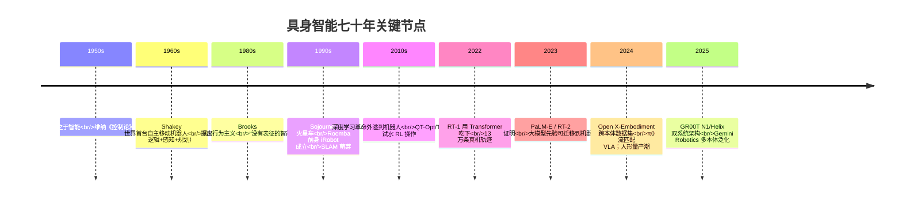
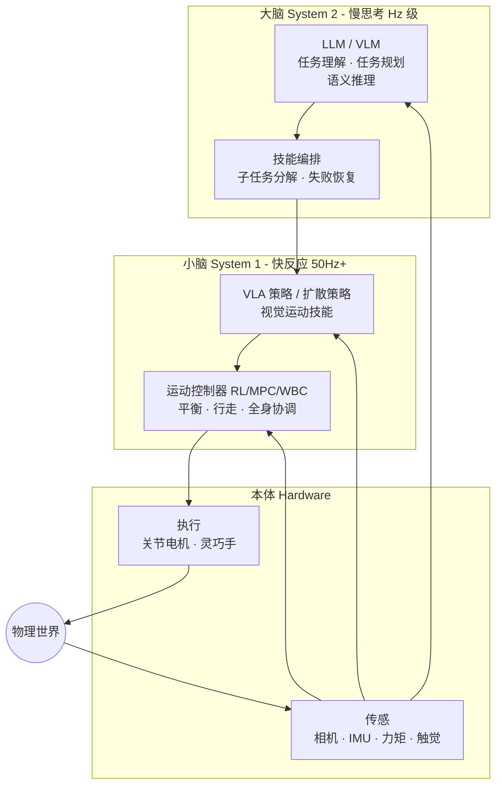
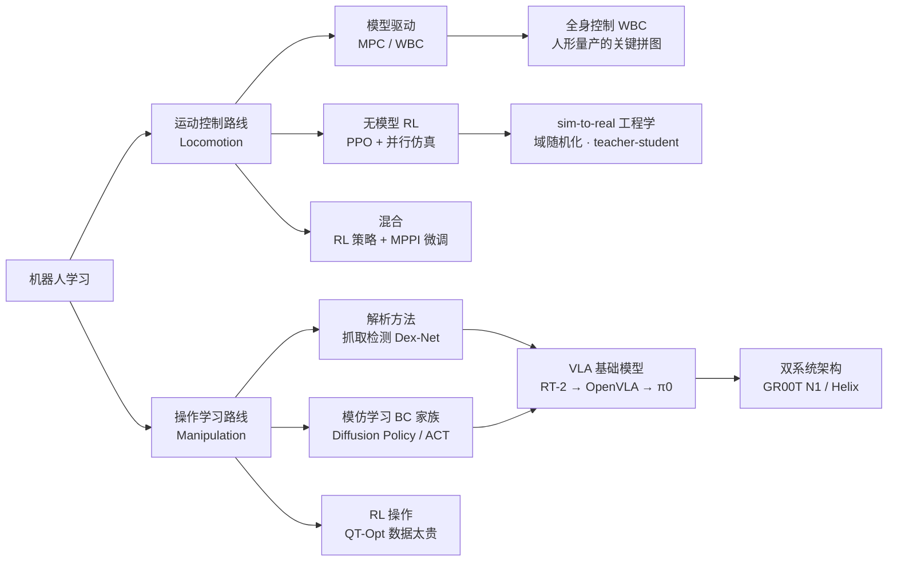
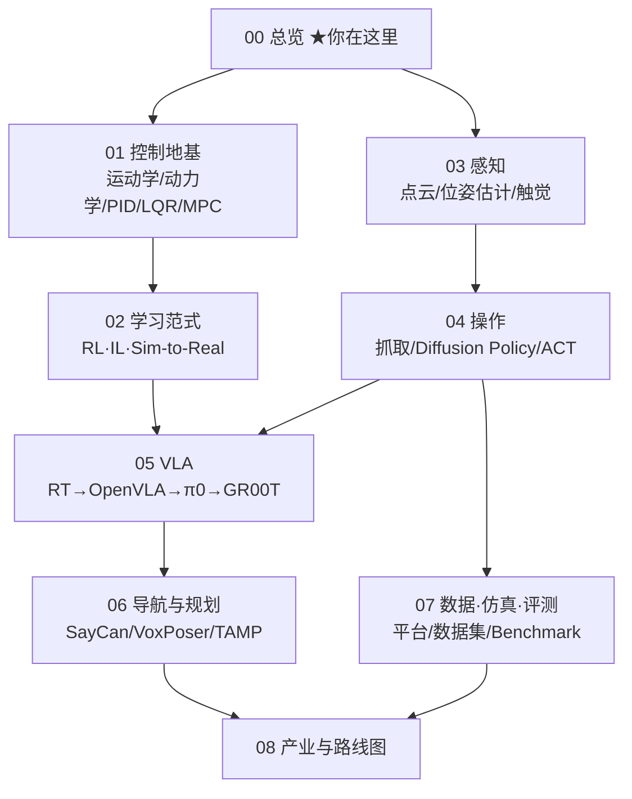

> **系列导航**：《具身智能》系列共 9 篇，目标是从零基础走到能读懂顶会论文、跑通开源项目的水平。本篇是总纲：回答"具身智能是什么、为什么是现在、整个领域的地图长什么样"。后续八篇依次深入控制地基、学习范式、感知、操作、VLA、导航规划、数据仿真评测与产业路线图。

## TL;DR

> **TL;DR 1｜一句话定义**：具身智能（Embodied AI）= 让智能体**通过身体与物理环境的闭环交互**来获取并运用智能。它与 LLM 的根本区别在于：LLM 的"世界"是文本分布，具身智能的"世界"是不可撤销的物理因果——打翻的水杯无法 Ctrl+Z。

> **TL;DR 2｜领域钥匙**：莫拉维克悖论——对 AI 来说，下棋推理是"简单"的，而让机器人抓起一个鸡蛋这种一岁小孩都会的事反而是"困难"的[1](https://en.wikipedia.org/wiki/Moravec%27s_paradox)。理解了这个悖论，就理解了为什么 2020 年前机器人学靠模型与控制论硬啃，而 2023 年后整个领域押注"大模型先验 + 大规模数据"。

> **TL;DR 3｜当前主线**："大脑"（VLA 视觉-语言-动作模型）+ "小脑"（RL 运动控制）+ "本体"（低成本高爆发执行器）+ 数据飞轮（遥操作/仿真/世界模型）。2023 年 RT-2 首次把网络级语义知识迁移到机器人控制[2](https://arxiv.org/abs/2307.15818)，2024 年 Open X-Embodiment 汇聚 22 种机器人本体百万级轨迹[3](https://arxiv.org/abs/2310.08864)，2024–2025 年 π0[4](https://arxiv.org/abs/2410.24164)、GR00T N1[5](https://arxiv.org/abs/2503.14734)、Helix 等把这条线推向人形量产前夜。

---

## 1. 什么是具身智能

### 1.1 定义拆解

学术界对具身智能没有唯一权威定义，但主流表述收敛于三个要素：

| 要素 | 含义 | 反例 |
|------|------|------|
| **身体 Body** | 拥有物理形态与传感器/执行器 | 纯软件 Agent（如 ChatGPT 本身） |
| **环境 Environment** | 存在于真实或仿真的物理世界中 | 封闭测试集 |
| **交互闭环 Interaction** | 感知 → 决策 → 行动 → 改变世界 → 再感知 | 开环回放 |

这个思想可以追溯到图灵 1950 年的预言：

> "给机器装上最好的传感器（摄像头、麦克风），再教它英语……这是制造智能机器的最佳路径。" —— A. M. Turing, *Computing Machinery and Intelligence*[6](https://doi.org/10.1093/mind/LIX.236.433)

有趣的是，AI 的历史恰恰反着走了一遍：先在纯符号/文本世界里做了 70 年，最近五年才回头补"身体"这一课。李飞飞将其概括为从"互联网 AI"到"具身空间 AI（Spatial Intelligence）"的迁移。

### 1.2 与 LLM 的本质区别

$$
\underbrace{\pi_\theta(a_t \mid o_t)}_{\text{具身策略：观测}\to\text{动作}} \quad \neq \quad \underbrace{P(w_t \mid w_{<t})}_{\text{语言模型：token}\to\text{token}}
$$

两者的关键差异不在输入输出形式，而在三个物理属性上：

1. **不可撤销性**：物理动作有真实后果，探索代价高昂 → 数据天然稀缺；
2. **实时性**：控制回路往往要求 $50\sim1000\,\mathrm{Hz}$，而 LLM 前向传播一次是百毫秒级 → 架构必须分层；
3. **部分可观测 + 非平稳**：真实世界永远有未建模的摩擦、光照、形变 → 必须处理 sim-to-real gap。

这三点决定了具身智能不能简单等于"LLM 加个机械臂接口"，也解释了后面所有技术选型。

### 1.3 一个容易混淆的概念边界

- **传统工业机器人**：高精度、封闭场景、预编程轨迹——有身体但几乎无学习；
- **自动驾驶**：有身体有学习，但任务空间被道路规则强约束，一般被视为具身智能的特例；
- **游戏 AI（AlphaGo/Voyager）**：有交互闭环但环境是虚拟的，常被称为"准具身"；其中 Voyager 用 LLM 在 Minecraft 中开放式积累技能库的思路[7](https://arxiv.org/abs/2305.16291)直接启发了大量机器人工作。

## 2. 七十年简史：这个领域是怎么走到今天的



几个必须记住的里程碑：

- **1966–1972，Shakey the Robot**（SRI International）：第一台能把感知、规划、行动整合的移动机器人，催生了 A* 搜索算法[8](https://ieeexplore.ieee.org/document/4082128)。
- **1991，Rodney Brooks《Intelligence without representation》**：挑战符号主义 AI，主张智能来自感知-行动的直接耦合，是具身智能哲学上的奠基文献之一[9](https://people.csail.mit.edu/brooks/papers/AIJ.pdf)。
- **2016–2019，深度 RL 试水真机**：Google 的 QT-Opt 用 7 台机械臂数月采集 58 万次抓取尝试学会抓取[10](https://arxiv.org/abs/1806.10293)，TossingBot 学会"抛投"超出训练分布的物体[11](https://arxiv.org/abs/1903.11239)。结论：RL 能学出人类写不出的策略，但**数据成本高得离谱**。
- **2022–2023，Robotics Transformer 元年**：RT-1 把 13 万条演示喂进 Transformer 得到能泛化的操作策略[12](https://arxiv.org/abs/2212.06817)；RT-2 证明把 VLM 动作 token 化可以继承网络语义知识（"把可乐挪到泰勒·斯威夫特照片旁边"这类零样本指令）[2](https://arxiv.org/abs/2307.15818)。
- **2024 至今，规模化与产业化并行**：Open X-Embodiment 横跨 21 个机构的 22 种机器人本体[3](https://arxiv.org/abs/2310.08864)；Physical Intelligence 的 π0 用流匹配生成连续动作块[4](https://arxiv.org/abs/2410.24164)；NVIDIA GR00T N1 提出"快慢双系统"[5](https://arxiv.org/abs/2503.14734)；Figure Helix 宣称在人形机器人上实现全上身 VLA 控制（官方技术报告）[13](https://www.figure.ai/news/helix)。

## 3. 领域钥匙：莫拉维克悖论

> "让计算机在智力测验或跳棋上达到成人水平相对容易；赋予它一岁儿童水平的感知与运动技能却极其困难，甚至不可能。" — Hans Moravec, 1988[1](https://en.wikipedia.org/wiki/Moravec%27s_paradox)

为什么？Moravec 的进化论解释：感官-运动能力经过了数亿年自然选择优化，早已高度自动化（因此感觉不到"难"）；而抽象推理只有几万年历史，皮层资源少反而显得"聪明"。工程上的对应解释：

| 任务类型 | 信息量/自由度 | 可否显式建模 | 数据可获得性 |
|----------|--------------|--------------|--------------|
| 下棋/答题 | 离散、低维、规则封闭 | ✅ 可枚举 | 海量棋谱/网页文本 |
| 抓一个鸡蛋 | 连续、高维、接触动力学 | ❌ 接触力学至今没有解析解 | 几乎为零 |

**推论**：具身智能的核心瓶颈不是算法而是**数据**——互联网里没有"如何拧瓶盖"的语料。这解释了为什么本系列要用三篇的篇幅讲数据采集、仿真与世界模型（第 02/04/07 篇）。清华团队 2024 年的实证研究给出了定量版本：模仿学习性能随演示数据呈幂律提升，且**数据多样性比数量更重要**[14](https://arxiv.org/abs/2410.18647)。

## 4. 系统分层：大脑、小脑、本体

现代具身智能系统普遍采用分层架构（不同公司叫法各异，结构大同小异）：



| 层 | 典型频率 | 代表技术 | 本系列章节 |
|----|---------|---------|-----------|
| 大脑（任务层） | $<1\,\mathrm{Hz}$ | LLM/VLM 规划、SayCan、Code as Policies | 第 05/06 篇 |
| 小脑（技能层） | $10\sim50\,\mathrm{Hz}$ | VLA、Diffusion Policy、ACT | 第 04/05 篇 |
| 小脑（运动层） | $100\sim1000\,\mathrm{Hz}$ | MPC、WBC、RL locomotion | 第 01/02 篇 |
| 本体 | — | 执行器、灵巧手、传感阵列 | 第 08 篇 |

**数据金字塔**（自底向上，成本递增、规模递减）：

```text
                    ┌─────────────────┐
          Tier 4    │  真机自主探索(RL) │  ← 最贵：QT-Opt 数月 7 台臂
                    ├─────────────────┤
          Tier 3    │  遥操作演示       │  ← ALOHA/DROID/AgiBot World
                    ├─────────────────┤
          Tier 2    │  仿真合成         │  ← Isaac Gym 万级并行、GraspVLA 十亿级抓取
                    ├─────────────────┤
          Tier 1    │  人类视频         │  ← YouTube/Ego4D：免费但有 embodiment gap
                    └─────────────────┘
```

每一层的"汇率"（多少下层顶一层上层）正是当前最活跃的研究问题，第 07 篇会展开。

## 5. 为什么是现在：三大技术条件同时成熟

1. **大模型提供了通用先验**。RT-2 的核心发现：VLM 底座越大，机器人语义泛化越强——"把香蕉放到'2'上面"这种需要常识的指令，小模型完全失败，55B 参数模型成功率约 2 倍于 7B[2](https://arxiv.org/abs/2307.15818)。相当于白嫖了整个互联网的知识。
2. **GPU 并行仿真让"经验"变得便宜**。Isaac Gym 把物理步进搬到 GPU，单张 RTX 3090 可同时模拟上万个四足机器人，四足行走策略训练时间从数天压缩到 20 分钟以内[15](https://arxiv.org/abs/2108.10470)。DayDreamer 更进一步：世界模型让机器人在"脑内想象"中训练，真机只做部署[16](https://arxiv.org/abs/2206.14176)。
3. **硬件成本坍塌**。准直驱（QDD）执行器方案普及后，ALOHA 把一套双臂主从遥操作平台做到 2 万美元以内[17](https://arxiv.org/abs/2304.13705)，UMI 用手持夹爪把采集成本压到几百美元级[18](https://arxiv.org/abs/2402.10329)；国产人形整机价格已下探到十万元人民币区间（宇树 G1 发布价 9.9 万元，官网可查）[19](https://www.unitree.com/cn/g1)。

三者相乘，出现了经典的"飞轮"：更好的模型 → 更多资本 → 更多数据采集基础设施 → 更好的模型。

## 6. 方法谱系一张图



三条技术路线的分歧与融合是 2024–2026 年最大的行业辩论：

| 路线 | 核心信念 | 代表 | 主要风险 |
|------|---------|------|---------|
| 端到端 VLA 一把梭 | 规模化数据会涌现通用能力 | PI π0、Figure Helix | 数据需求指数级、长尾失败难调试 |
| 分层系统（大脑+小脑） | 模块化可解释、各层独立进步 | GR00T N1、多数中国公司 | 层间误差复合、接口设计人工味重 |
| 世界模型优先 | 在想象中训练和评测，绕开真机数据瓶颈 | NVIDIA Cosmos、Genie 系 | 模型幻觉会被策略利用 |

## 7. 产业版图速览（截至 2025 年中）

> ⚠️ 公司动态时效性强，以下为写作时点信息，具体融资/产品以官方渠道为准。

| 阵营 | 公司/机构 | 主打方向 | 公开代表作 |
|------|----------|---------|-----------|
| 美国 | Tesla | 人形整车厂路线 | Optimus（自研执行器+FSD 同源视觉） |
| 美国 | Figure AI | 通用人形 + VLA | Helix 双系统[13](https://www.figure.ai/news/helix) |
| 美国 | Physical Intelligence | 只做"大脑"不做本体 | π0 / π0.5[4](https://arxiv.org/abs/2410.24164)[20](https://arxiv.org/abs/2504.16054) |
| 美国 | Google DeepMind | 基础模型研究 | RT 系列、Gemini Robotics[21](https://arxiv.org/abs/2503.20020) |
| 美国 | NVIDIA | 平台与算力 | Isaac Lab、GR00T N1[5](https://arxiv.org/abs/2503.14734)、Cosmos[22](https://arxiv.org/abs/2501.03575) |
| 中国 | 宇树 Unitree | 四足/人形硬件出货量领先 | H1/G1[19](https://www.unitree.com/cn/g1) |
| 中国 | 智元机器人 AgiBot | 本体+数据工厂 | AgiBot World 百万轨迹数据集[23](https://arxiv.org/abs/2503.06669) |
| 中国 | 银河通用 Galbot | 抓取基础模型 | GraspVLA 十亿级合成数据预训练[24](https://arxiv.org/abs/2505.03233) |
| 中国 | 星动纪元/逐际动力/众擎 等 | 人形本体与运动控制 | 各家 demo（详见第 08 篇） |
| 学术 | Stanford/Berkeley/CMU/MIT、清华/北大/上海AI Lab | 算法与开源生态 | ALOHA、OpenVLA、LeRobot 社区等 |

## 8. 本系列学习地图



**前置知识自查清单**（缺哪补哪即可，不必全部精通再开始）：

- 线性代数：矩阵求导、SVD（推荐 3Blue1Brown 直觉版）
- 概率论：贝叶斯公式、高斯分布、期望
- Python + PyTorch：能写训练循环即可
- 经典 RL：MDP/Q-learning（强烈建议先读本站《从 MDP 到 GRPO》系列，与本系列第 02 篇无缝衔接）

## Lab Exercises

1. **建立你的"论文雷达"**：注册 [arXiv](https://arxiv.org/list/cs.RO/recent) 的 cs.RO 板块 RSS，每天扫一遍标题。坚持两周，统计出现频率最高的关键词——你会直观看到 VLA/world model/humanoid 的热度曲线。
2. **零代码体验具身智能**：浏览器打开 Google DeepMind 的 MuJoCo Playground 或 NVIDIA 的 Isaac Lab 文档，找到最小示例。本系列第 07 篇会带你真正跑起来；今天只需要确认你的电脑能装 PyBullet：
   ```bash
   pip install pybullet && python -c "import pybullet; print('ready')"
   ```

## 参考文献与延伸阅读

- [6] Turing, *Computing Machinery and Intelligence*, Mind, 1950. [DOI](https://doi.org/10.1093/mind/LIX.236.433)
- [9] Brooks, *Intelligence without representation*, AIJ, 1991. [PDF](https://people.csail.mit.edu/brooks/papers/AIJ.pdf)（未本地验证可达性）
- [1] Moravec's Paradox 词条（Wikipedia，需科学上网）。
- 综述入门视频：李飞飞 TED 演讲《With Spatial Intelligence, AI Will See the World》（YouTube 搜索标题即可）。
- 中文报告：中国信息通信研究院《具身智能发展报告》（2024/2025 版，官网 caict.ac.cn 可检索，未本地验证直链）。

*下一篇：《01 数学与控制地基》——不懂数学也能用现成库，但想读懂 MIT Cheetah 和人形机器人论文，这一篇是门票。*
