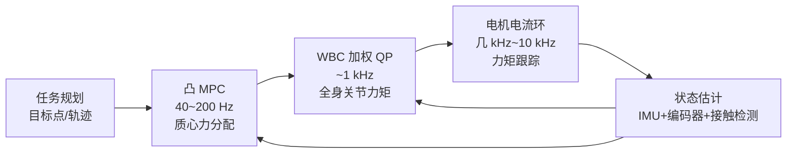
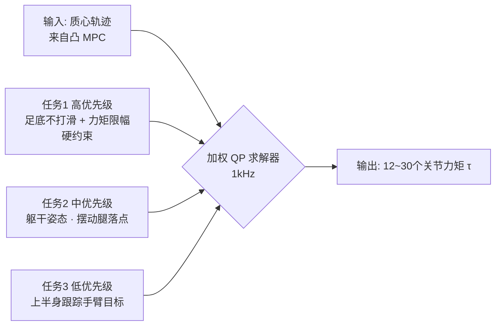

> **系列导航**：上一篇我们画出了具身智能的完整地图（[00 总览](/2026/08/25/embodied-ai-00-overview/)）。本篇补"小脑"最底层的地基：运动学、动力学与经典控制。无论后面学 RL locomotion 还是 VLA，这些数学都是绕不开的"普通话"。配套阅读：MIT《Underactuated Robotics》公开课（免费全文）[1](https://underactuated.mit.edu) 与教材《Modern Robotics》免费电子版[2](https://hades.mech.northwestern.edu/index.php/Modern_Robotics)。

## TL;DR

> **TL;DR 1｜一张知识依赖图**：正运动学（关节角→末端位置）→ 雅可比（速度映射+奇异位形）→ 动力学（力↔加速度，拉格朗日方程）→ 控制器（PID/LQR/MPC/WBC）。每一步都是下一步的"API"，跳着学会在论文里迷路。

> **TL;DR 2｜为什么 MPC 是机器人控制的事实标准**：PID 只看当前误差、LQR 假设线性系统且只能给"一个最优反馈律"；MPC 在每个周期滚动求解未来 $N$ 步的约束优化，天然处理关节限位、力矩饱和、障碍物约束——代价是算力。GPU 并行求解器让它 2020 年代在真机上复活。

> **TL;DR 3｜接触是分水岭**：自由空间运动用位置控制即可；一旦接触物体（装配、擦拭、灵巧手），必须切换到阻抗/力控视角——这是"操作类任务比移动类任务难十倍"的物理根源，也是第 04 篇 Diffusion Policy 类方法兴起的伏笔。

## 目录

- [1. 运动学：从关节角到空间位置](#1-运动学从关节角到空间位置)
  - [1.1 正运动学与 DH 参数：把机械臂写成矩阵连乘](#11-正运动学与-dh-参数把机械臂写成矩阵连乘)
  - [1.2 平面二连杆：手推一遍正解与逆解](#12-平面二连杆手推一遍正解与逆解)
  - [1.3 雅可比与微分逆运动学](#13-雅可比与微分逆运动学)
  - [1.4 奇异性、条件数与可操作度](#14-奇异性条件数与可操作度)
  - [1.5 伪逆、DLS 与零空间投影：数值 IK 全家桶](#15-伪逆dls-与零空间投影数值-ik-全家桶)
- [2. 动力学：力从哪来，加速度到哪去](#2-动力学力从哪来加速度到哪去)
  - [2.1 拉格朗日方程：从单摆推起](#21-拉格朗日方程从单摆推起)
  - [2.2 二连杆动力学完整推导：M、C、g 从哪来](#22-二连杆动力学完整推导mcg-从哪来)
  - [2.3 结构性质与三种计算路线](#23-结构性质与三种计算路线)
  - [2.4 为什么接触是分水岭](#24-为什么接触是分水岭)
- [3. 控制器三部曲](#3-控制器三部曲)
  - [3.1 PID：90% 的工业现场](#31-pid90-的工业现场)
  - [3.2 LQR：最优控制的入场券](#32-lqr最优控制的入场券)
  - [3.3 MPC：滚动时域优化](#33-mpc滚动时域优化)
  - [3.4 阻抗控制：与未知世界握手](#34-阻抗控制与未知世界握手)
- [4. 全身控制（WBC）：人形的最后一层拼图](#4-全身控制wbc人形的最后一层拼图)
  - [4.1 浮动基座与质心动力学](#41-浮动基座与质心动力学)
  - [4.2 任务优先级 QP：加权 vs 字典序](#42-任务优先级-qp加权-vs-字典序)
  - [4.3 接触模型一瞥：软接触与摩擦锥线性化](#43-接触模型一瞥软接触与摩擦锥线性化)
- [5. 工程实践清单](#5-工程实践清单)
- [Lab Exercises](#lab-exercises)
- [参考文献与延伸阅读](#参考文献与延伸阅读)

## 1. 运动学：从关节角到空间位置

### 1.1 正运动学与 DH 参数：把机械臂写成矩阵连乘

机械臂是一个运动链。**正运动学（Forward Kinematics）**回答：给定各关节角 $\mathbf{q}\in\mathbb{R}^n$，末端执行器在哪？

$$
T_0^n(\mathbf{q}) = T_1\,T_2\cdots T_n \in SE(3)
$$

其中 $T_i \in SE(3)$ 是相邻连杆间的齐次变换矩阵（旋转 + 平移），由 Denavit-Hartenberg 参数 $(a_i, \alpha_i, d_i, \theta_i)$ 参数化[2](https://hades.mech.northwestern.edu/index.php/Modern_Robotics)。

**DH 变换矩阵的显式形式**。标准（Distal）DH 约定下，四个参数各有物理含义：$a_i$ 连杆长度（相邻关节轴公垂线长度）、$\alpha_i$ 连杆扭角（两轴夹角）、$d_i$ 连杆偏距（沿 $z_{i-1}$ 轴）、$\theta_i$ 关节角（绕 $z_{i-1}$ 轴，旋转关节的运动变量）。相邻坐标系变换可分解为四次基本变换的复合：

$$
{}^{i-1}T_i = R_z(\theta_i)\, T_z(d_i)\, T_x(a_i)\, R_x(\alpha_i) =
\begin{bmatrix}
c_{\theta_i} & -s_{\theta_i}c_{\alpha_i} & \ s_{\theta_i}s_{\alpha_i} & a_i c_{\theta_i}\\
s_{\theta_i} & \ c_{\theta_i}c_{\alpha_i} & -c_{\theta_i}s_{\alpha_i} & a_i s_{\theta_i}\\
0 & s_{\alpha_i} & c_{\alpha_i} & d_i\\
0 & 0 & 0 & 1
\end{bmatrix}
$$

之所以只需 4 个参数就能确定 SE(3) 中一个任意位姿，是因为相邻关节轴之间存在公垂线约束——几何结构替我们省掉了 SE(3) 的 6 个自由度中的冗余[2](https://hades.mech.northwestern.edu/index.php/Modern_Robotics)。

**完整建模示例：平面 2R 机械臂**。按标准 DH 约定填表（基座 $z_0$ 竖直向上，各关节轴平行）：

| 连杆 $i$ | $\theta_i$ | $d_i$ | $a_i$ | $\alpha_i$ |
|:---:|:---:|:---:|:---:|:---:|
| 1 | $q_1$ | $0$ | $l_1$ | $0$ |
| 2 | $q_2$ | $0$ | $l_2$ | $0$ |

代入上式（$s_i=\sin q_i,\ c_i=\cos q_i$）：

$$
{}^{0}T_1 =
\begin{bmatrix}
c_1 & -s_1 & 0 & l_1 c_1\\
s_1 & c_1 & 0 & l_1 s_1\\
0 & 0 & 1 & 0\\
0 & 0 & 0 & 1
\end{bmatrix},\qquad
{}^{1}T_2 =
\begin{bmatrix}
c_2 & -s_2 & 0 & l_2 c_2\\
s_2 & c_2 & 0 & l_2 s_2\\
0 & 0 & 1 & 0\\
0 & 0 & 0 & 1
\end{bmatrix}
$$

连乘 ${}^{0}T_2 = {}^{0}T_1\,{}^{1}T_2$（利用和角公式 $c_1c_2-s_1s_2=c_{12}$）：

$$
{}^{0}T_2 =
\begin{bmatrix}
c_{12} & -s_{12} & 0 & l_1 c_1 + l_2 c_{12}\\
s_{12} & \ c_{12} & 0 & l_1 s_1 + l_2 s_{12}\\
0 & 0 & 1 & 0\\
0 & 0 & 0 & 1
\end{bmatrix}
$$

右上角平移列正是下一小节用纯几何推出的 $(x,y)$——**矩阵法与几何法在此会师**。"查表 → 代显式公式 → 连乘"这三步对任何开链臂都一样，工业协作臂（如 UR 系列）官方手册直接给出 DH 表，照抄即可得到 FK。

三个工程注记：

1. **约定陷阱**：标准 DH（Spong 教材体系）与改进 DH / MDH（Craig 教材体系）对同一台臂给出**不同的表**但等价的 FK；从论文或厂商文档抄表前先确认约定。
2. **错表不难看**：抄错一个符号后 FK 往往"看起来还是对的"（位置误差小、姿态怪异），所以第 5 节强调必须做数值单元测试。
3. **退化线索**：平行轴/相交轴的特殊几何会让某些参数为 0（本例中所有 $\alpha_i=0$），这是检查表格合理性的快速线索。

### 1.2 平面二连杆：手推一遍正解与逆解

对平面二连杆（长度 $l_1, l_2$），纯几何投影即得：

$$
x = l_1 c_1 + l_2 c_{12}, \qquad y = l_1 s_1 + l_2 s_{12}
$$

其中 $c_1=\cos q_1$、$s_{12}=\sin(q_1+q_2)$。**逆运动学（IK）**有解析解（余弦定理）：

$$
\cos q_2 = \frac{x^2+y^2-l_1^2-l_2^2}{2 l_1 l_2},\quad q_2 = \pm\arccos(\cdot)
$$

补全第二支：取 $s_2 = \pm\sqrt{1-c_2^2}$ 后，

$$
q_1 = \operatorname{atan2}(y,\,x) - \operatorname{atan2}\!\left(l_2 s_2,\; l_1 + l_2 c_2\right)
$$

可达性判据同样来自余弦定理——目标在工作空间环内当且仅当

$$
|l_1-l_2| \;\le\; \sqrt{x^2+y^2} \;\le\; l_1+l_2
$$

边界上 $\cos q_2 = \pm 1$，即 $q_2=0$ 或 $\pi$，恰好对应 1.4 节将定量讨论的**边界奇异位形**。

$\pm$ 说明 IK 多解——机器人要"决定抬肘还是压肘"，这个歧义在高维冗余臂上会爆炸式增长：典型 6 轴腕部分离臂最多 8 组解析解；冗余臂（$n>m$）的解集是连续流形，需要额外准则挑选——这正是 1.5 节零空间投影要解决的问题。

### 1.3 雅可比与微分逆运动学

高维臂没有解析 IK，工程上全部走数值路线。对正运动学求时间导数：

$$
\dot{\mathbf{x}} = J(\mathbf{q})\,\dot{\mathbf{q}}, \qquad J \in \mathbb{R}^{6\times n}
$$

平面 2R 的雅可比可以对 $x,y$ 逐项求偏导得到：

$$
J(\mathbf q)=
\begin{bmatrix}
\dfrac{\partial x}{\partial q_1} & \dfrac{\partial x}{\partial q_2}\\[6pt]
\dfrac{\partial y}{\partial q_1} & \dfrac{\partial y}{\partial q_2}
\end{bmatrix}
=
\begin{bmatrix}
-(l_1 s_1 + l_2 s_{12}) & -l_2 s_{12}\\
l_1 c_1 + l_2 c_{12} & l_2 c_{12}
\end{bmatrix}
$$

| 数学符号 | 代码变量 | Shape | 含义 |
|---:|:---|:---:|:---|
| $\mathbf{q}$ | `q` | `(n,)` | 关节角 |
| $\dot{\mathbf{q}}$ | `qd` | `(n,)` | 关节角速度 |
| $J(\mathbf{q})$ | `J` | `(6, n)` | 雅可比（几何/解析两种约定） |
| $\dot{\mathbf{x}}$ | `xd` | `(6,)` | 末端速度（线+角） |

两个必背的对偶性质：(1) 解析雅可比（对欧拉角参数求导）与几何雅可比（堆叠线速度+角速度）在角速度块相差一个随欧拉参数变化的线性变换，平面问题无此烦恼；(2) 静力学对偶 $\tau = J^\top f$——同一个 $J$ 既是速度放大器又是力缩小器，这是"输出力大则速度慢"的数学根源。

**微分 IK**：想要末端以 $\dot{\mathbf{x}}^{des}$ 运动，解 $\dot{\mathbf{q}} = J^{-1}\dot{\mathbf{x}}^{des}$。$J$ 通常非方阵，用阻尼最小二乘：

```python
import numpy as np

def jacobian_2link(q, l1=1.0, l2=1.0):
    """平面二连杆雅可比 (2xn)，推导自 dx/dq 逐项求导"""
    q1, q2 = q
    return np.array([
        [-l1*np.sin(q1)-l2*np.sin(q1+q2), -l2*np.sin(q1+q2)],
        [ l1*np.cos(q1)+l2*np.cos(q1+q2),  l2*np.cos(q1+q2)],
    ])

def diff_ik_step(q, xd_des, damping=0.05):
    # 阻尼最小二乘: dq = J^T (J J^T + λ²I)^{-1} xd
    # λ>0 保证 J 接近奇异时数值稳定（牺牲一点精度换鲁棒性）
    J = jacobian_2link(q)
    dq = J.T @ np.linalg.solve(J @ J.T + damping**2*np.eye(2), xd_des)
    return q + dq

q = np.array([0.3, 0.6])          # 初始关节角 (n,)
for _ in range(200):               # 数值迭代逼近目标
    q = diff_ik_step(q, np.array([0.1, -0.05]))   # 每步末端期望速度 (m/s)
```

上面这段演示的是**速度级跟踪**：给定期望末端速度，机械臂以一致的速度场跟随。若要做点到点 IK，把"期望速度"换成"指向目标的误差向量"再迭代即可（Lab Exercise 1 就是这个玩法）。

**奇异位形**：当 $J$ 秩亏（如手臂完全伸直），某方向速度不可实现，普通逆解会要求无穷大关节速度——阻尼项就是为此而生的。理解这一点，你就懂了为什么人形机器人的工作空间设计如此讲究。下一节把"奇异"变成可以计算的东西。

### 1.4 奇异性、条件数与可操作度

**行列式判据**。对方阵雅可比，奇异性即 $\det J = 0$。代入 1.3 的 2R 雅可比展开：

$$
\det J = \big[-(l_1 s_1 + l_2 s_{12})\big] (l_2 c_{12}) - (-l_2 s_{12})\,(l_1 c_1 + l_2 c_{12}) = l_1 l_2 \sin q_2
$$

（中间项成对抵消，只剩和角公式。）于是 $q_2 = 0$（完全伸直）或 $q_2 = \pi$（完全折叠）时奇异——与 1.2 的可达性边界完全吻合，这不是巧合：**奇异位形就是工作空间的边界在关节空间里的投影**。

**可操作度（manipulability）**。Yoshikawa 提出的标量度量把"离奇异多远"压缩成一个数：

$$
w(\mathbf q) = \sqrt{\det\big(J J^\top\big)} = l_1 l_2 \vert \sin q_2 \vert
$$

$w$ 最大在 $q_2 = \pm 90^\circ$——"手腕立起来最灵活"这句话的定量版本。轨迹优化常把 $w$ 或其倒数写进代价，主动远离奇异区。

**条件数视角**。对 $JJ^\top$ 做特征分解，末端可行速度集是以 $\sigma_{\max}\ge\sigma_{\min}>0$ 为半轴的椭球（$\sigma$ 为 $J$ 的奇异值）。条件数

$$
\kappa(J) = \frac{\sigma_{\max}}{\sigma_{\min}}
$$

衡量各向异性：$\kappa=1$ 各方向同等灵活（各向同性点，isotropic point），$\kappa\to\infty$ 即奇异。伸直手臂时 $\sigma_{\min}\to 0$，**径向**速度不可实现而切向仍正常——所以普通伪逆在奇异附近表现为"要求无穷大径向关节速度"，数值上就是解的元素爆炸。

**数值自检清单**（并入示例 1）：任意采样一批 $\mathbf q$，打印 $w$ 与 $\kappa$；$w<10^{-3}$ 的样本应全部落在 $q_2\approx 0/\pi$ 附近。这个 5 行检查能抓住绝大多数 FK/Jacobian 实现错误。

### 1.5 伪逆、DLS 与零空间投影：数值 IK 全家桶

**(1) 最小范数解与伪逆**。满行秩的 $J\in\mathbb{R}^{m\times n}$（$m<n$ 冗余情形）下，约束优化

$$
\min_{\Delta q}\ \Vert \Delta q\Vert^2 \quad \text{s.t.}\ J\Delta q = \Delta x
$$

用拉格朗日乘子法可解得唯一最小范数解 $\Delta q = J^\dagger \Delta x$，其中右伪逆

$$
J^\dagger = J^\top \big(J J^\top\big)^{-1}
$$

它回答的是"实现同一末端位移，最省力的关节运动方案"。

**(2) 奇异附近的病态**。$(JJ^\top)^{-1}$ 在 $\det JJ^\top \to 0$ 时元素爆炸，且伪逆解在穿越奇异面时**不连续**（不同分支间跳变）——直接用伪逆做微分 IK 的机器人在奇异附近会"抽风"。

**(3) 阻尼最小二乘（DLS）**。把问题改成正则化最小二乘：

$$
\Delta q = \arg\min_{\Delta q}\ \Vert \Delta x - J\Delta q\Vert^2 + \lambda^2 \Vert\Delta q\Vert^2
= J^\top\big(JJ^\top + \lambda^2 I\big)^{-1} \Delta x
$$

闭式解即第二个等号。几何解释：$\lambda$ 把速度椭球的最短半轴"垫高"到 $\lambda$ 以上，代价是引入跟踪误差（残差满足 $\Vert\Delta x - J\Delta q\Vert \le \lambda\Vert\Delta q\Vert$）。$\lambda$ 的选择是精度-鲁棒的旋钮：小 $\lambda$ 精度高、奇异附近激进；大 $\lambda$ 反之。工程上有按 $w(\mathbf q)$ 自适应调 $\lambda$ 的方案：离奇异远时 $\lambda\to 0$，靠近时平滑放大。

**(4) 零空间投影与第二目标**。冗余臂（$n>m$）的解流形给了我们自由度去做第二件事（避关节限位、避障、保持相机姿态）。通解：

$$
\dot{\mathbf q} = J^\dagger \dot{\mathbf x}^{des} + \big(I - J^\dagger J\big)\, \mathbf z
$$

其中 $N = I - J^\dagger J$ 是零空间投影算子，满足幂等性 $N^2=N$ 与主任务不变性 $JN=0$——任何塞进 $\mathbf z$ 的第二目标都**不会干扰主任务**（一阶近似下）。经典选择是 Liégeois 梯度投影：$\mathbf z = -\alpha\nabla_{\mathbf q} H(\mathbf q)$，让构型沿降低代价 $H$（如远离关节限位的势函数）的方向流动。

下面用 3 连杆平面臂（$n=3 > m=2$）演示：末端向右平移的同时向偏好姿态松弛：

```python
import numpy as np

def fk3(q, ls=(1.0, 0.8, 0.6)):
    """3 连杆平面臂正运动学: 累加角度后逐段投影"""
    cum = np.cumsum(q)
    return np.array([sum(l*np.cos(t) for l, t in zip(ls, cum)),
                     sum(l*np.sin(t) for l, t in zip(ls, cum))])

def jac3(q, ls=(1.0, 0.8, 0.6)):
    """位置雅可比 (2,3): 第 i 列 = sum_{j>=i} l_j * [-sin Θ_j, cos Θ_j]"""
    cum = np.cumsum(q); J = np.zeros((2, 3))
    for i in range(3):
        for j in range(i, 3):
            J[:, i] += ls[j] * np.array([-np.sin(cum[j]), np.cos(cum[j])])
    return J

def run(use_null=True, steps=500):
    q = np.array([0.9, -0.4, 0.3])               # 初始关节角 (n,)
    target = fk3(np.array([0.9, -0.4, 0.3])) + np.array([0.2, -0.5])  # 主任务: 固定目标点
    q_rest = np.array([-0.3, 0.9, 0.5])          # 第二目标: 偏好姿态 (n,)
    for _ in range(steps):
        err = target - fk3(q)                    # 任务误差闭环修正
        J = jac3(q)
        Jp = J.T @ np.linalg.inv(J @ J.T + 1e-4*np.eye(2))
        N = np.eye(3) - Jp @ J                   # 零空间投影 (n,n): N²=N, J·N=0
        dq = Jp @ err                            # 主任务分量
        if use_null:
            z = N @ (0.3*(q_rest - q))           # 第二目标分量
            nrm = np.linalg.norm(z)
            if nrm > 0.08: z *= 0.08/nrm         # 步长限幅, 防止喧宾夺主
            dq = dq + z
        if np.linalg.norm(dq) > 0.15:
            dq *= 0.15/np.linalg.norm(dq)        # 总步长限幅
        q = q + dq
    return q

qa = run(use_null=False)   # 只做主任务
qb = run(use_null=True)    # 主任务 + 姿态松弛
print("末端位置差:", np.abs(fk3(qa)-fk3(qb)).max())
print("关节角差:", np.abs(qa-qb).max())
print("qa", np.round(qa, 3), "\nqb", np.round(qb, 3))
# 实测预期: 末端位置差 ~1e-5 m 而关节角差 > 1 rad —— 零空间在不动末端的前提下大幅改变姿态
```

变量映射表：

| 数学符号 | 代码变量 | Shape | 含义 |
|:---:|:---|:---:|:---|
| $J(\mathbf q)$ | `jac3(q)` 返回值 | `(2, 3)` | 平面位置雅可比（无角速度行）|
| $J^\dagger$ | `Jp` | `(3, 2)` | DLS 近似伪逆（$\lambda^2=10^{-4}$）|
| $N = I - J^\dagger J$ | `N` | `(3, 3)` | 零空间投影算子 |
| $\mathbf x^{des}$ | `target` | `(2,)` | 主任务目标点（误差闭环）|
| $\alpha\nabla H$ | `0.3*(q_rest - q)` | `(3,)` | 向偏好姿态松弛的梯度项 |

## 2. 动力学：力从哪来，加速度到哪去

### 2.1 拉格朗日方程：从单摆推起

机械臂动力学的标准形式（**manipulator equation**）：

$$
M(\mathbf{q})\ddot{\mathbf{q}} + C(\mathbf{q},\dot{\mathbf{q}})\dot{\mathbf{q}} + g(\mathbf{q}) = \tau + J^T f_{ext}
$$

用拉格朗日力学推一遍（以单摆为例，质量 $m$、杆长 $l$、角度 $\theta$）：

1. 动能：$T = \frac{1}{2}m(l\dot\theta)^2$
2. 势能：$V = -mgl\cos\theta$
3. 拉格朗日量：$\mathcal{L} = T - V = \frac{1}{2}ml^2\dot\theta^2 + mgl\cos\theta$
4. 代入 Euler-Lagrange 方程 $\frac{d}{dt}\frac{\partial \mathcal L}{\partial \dot\theta} - \frac{\partial \mathcal L}{\partial \theta} = \tau$：
   - $\frac{d}{dt}\frac{\partial \mathcal L}{\partial \dot\theta} = ml^2\ddot\theta$
   - $\frac{\partial \mathcal L}{\partial \theta} = -mgl\sin\theta$
5. 得到 $ml^2\ddot\theta + mgl\sin\theta = \tau$

对照一般形式：$M = ml^2$（惯性，恒正定），$C=0$（单点质量无科氏力），$g = mgl\sin\theta$。变量映射：

| 符号 | 物理含义 | 单位 |
|---:|:---|:---|
| $M(\mathbf{q})$ | 关节空间惯量矩阵（对称正定） | $\mathrm{kg\,m^2}$ |
| $C(\mathbf{q},\dot{\mathbf{q}})\dot{\mathbf{q}}$ | 科氏力与离心力 | $\mathrm{N\,m}$ |
| $g(\mathbf{q})$ | 重力矩 | $\mathrm{N\,m}$ |
| $\tau$ | 关节力矩（控制输入） | $\mathrm{N\,m}$ |
| $J^T f_{ext}$ | 外力（接触力！）映射回关节 | $\mathrm{N\,m}$ |

**两个必背性质**：(1) $M$ 对称正定 → 系统天生稳定倾向；(2) 重力项可精确前馈补偿 ($\tau = g(\mathbf{q})$ 让机械臂"漂浮")——所有协作臂的拖动示教就是这么实现的。

注意单摆里 $C=0$ 不是巧合：惯量 $ml^2$ 不依赖构型。只要 $M$ 开始依赖 $\mathbf q$（比如摆长会变的摆、或多连杆），$C$ 就会出现——这正是下一节的主题。

### 2.2 二连杆动力学完整推导：M、C、g 从哪来

模型设定：两根无质量杆（长 $l_1,l_2$）端点各带一个点质量 $m_1,m_2$；广义坐标 $q_1$ 为第一杆与水平轴夹角、$q_2$ 为相对角；重力向下。记 $c_i=\cos q_i,\ s_{12}=\sin(q_1+q_2)$ 等。

**第一步：两个质量的笛卡尔位置**

$$
p_1 = \begin{pmatrix} l_1 c_1 \\ l_1 s_1\end{pmatrix},\qquad
p_2 = \begin{pmatrix} l_1 c_1 + l_2 c_{12} \\ l_1 s_1 + l_2 s_{12}\end{pmatrix}
$$

**第二步：速度平方**（链式求导，交叉项来自两个分量偏导的乘积）

$$
v_1^2 = l_1^2 \dot q_1^2
$$
$$
v_2^2 = l_1^2\dot q_1^2 + l_2^2(\dot q_1+\dot q_2)^2 + 2 l_1 l_2\, \dot q_1(\dot q_1+\dot q_2)\cos q_2
$$

**第三步：能量**。动能 $T=\tfrac12 m_1 v_1^2 + \tfrac12 m_2 v_2^2$，势能（$y$ 轴向上）$V=(m_1+m_2)gl_1 s_1 + m_2 g l_2 s_{12}$：

$$
T = \frac{1}{2}(m_1+m_2)l_1^2\dot q_1^2 + \frac{1}{2}m_2 l_2^2(\dot q_1+\dot q_2)^2 + m_2 l_1 l_2\, \dot q_1 (\dot q_1+\dot q_2)\cos q_2
$$

**关键观察**：$T$ 里出现了 $\cos q_2\cdot \dot q_1(\dot q_1+\dot q_2)$——动能依赖构型 $\mathbf q$ 且对 $\dot{\mathbf q}$ 二次。后续一切"诡异的速度相关项"都是从这里长出来的。

**第四步：代入 Euler–Lagrange**。对 $q_2$ 这一路完整展示（$q_1$ 同理，代数更多）：

$$
\frac{\partial \mathcal L}{\partial \dot q_2} = m_2 l_2^2 (\dot q_1+\dot q_2) + m_2 l_1 l_2 \dot q_1 \cos q_2
$$
$$
\frac{d}{dt}\frac{\partial \mathcal L}{\partial \dot q_2} = m_2 l_2^2(\ddot q_1+\ddot q_2) + m_2 l_1 l_2 \ddot q_1 \cos q_2 - m_2 l_1 l_2 \dot q_1 \dot q_2 \sin q_2
$$
$$
\frac{\partial \mathcal L}{\partial q_2} = \underbrace{- m_2 l_1 l_2 \dot q_1 (\dot q_1+\dot q_2)\sin q_2}_{\text{来自 } \partial T/\partial q_2} + m_2 g l_2 \cos(q_1+q_2)
$$

相减整理（$\tau_2$ 同理可得 $\tau_1$），写成标准形式。定义 $h \equiv m_2 l_1 l_2 \sin q_2$，则：

$$
M(q)=
\begin{bmatrix}
(m_1+m_2)l_1^2 + m_2 l_2^2 + 2 m_2 l_1 l_2 c_2 & m_2 l_2^2 + m_2 l_1 l_2 c_2\\[2pt]
m_2 l_2^2 + m_2 l_1 l_2 c_2 & m_2 l_2^2
\end{bmatrix}
$$

$$
C(q,\dot q)=
\begin{bmatrix}
-h\,\dot q_2 & -h\,(\dot q_1+\dot q_2)\\[2pt]
h\,\dot q_1 & 0
\end{bmatrix},
\qquad
C(q,\dot q)\,\dot q =
\begin{pmatrix}
-h\,(2\dot q_1\dot q_2 + \dot q_2^2)\\[2pt]
h\,\dot q_1^2
\end{pmatrix}
$$

$$
g(q)=
\begin{pmatrix}
(m_1+m_2)\,g\,l_1 c_1 + m_2\,g\,l_2 c_{12}\\[2pt]
m_2\,g\,l_2 c_{12}
\end{pmatrix}
$$

**第五步：科氏/离心项的来源剖析**。对 $\frac{\partial \mathcal L}{\partial \dot{\mathbf q}} = M(\mathbf q)\dot{\mathbf q}$ 求时间导数时，链式法则给出 $M(\mathbf q)\ddot{\mathbf q} + \dot M(\mathbf q,\dot{\mathbf q})\dot{\mathbf q}$——第二块 $\dot M$ 正是 $C\dot{\mathbf q}$ 的来源，因为 $M$ 经 $\cos q_2$ 依赖构型。按速度幂次归类：

- $\dot q_1^2$ 项（如 $\tau_2$ 中的 $h\dot q_1^2$）：**离心项**——第二杆随第一杆公转时"甩出去"的趋势；
- 交叉项 $\dot q_1 \dot q_2$：**科氏项**——两个旋转叠加产生的表观力；
- 它们合起来可用 Christoffel 符号系统构造：$C_{kij} = \tfrac12\big(\partial M_{kj}/\partial q_i + \partial M_{ki}/\partial q_j - \partial M_{ij}/\partial q_k\big)$。注意 $C(q,\dot q)$ 不唯一（可以加上任何使 $z^\top$ 双线性项不变的矩阵而不改变方程），但乘积 $C\dot{\mathbf q}$ 唯一。

**三个 sanity check**（读论文验公式的好习惯）：固定 $q_2$（锁死肘部）后退化为变形单摆；令 $m_2\to 0$ 则第二行全为零；所有项单位均为 $\mathrm{N\cdot m}$。

### 2.3 结构性质与三种计算路线

**斜对称性与无源性**。用上面的 Christoffel 构造可以验证

$$
\frac{d}{dt}M(\mathbf q) - 2C(\mathbf q,\dot{\mathbf q}) = S,\qquad S^\top = -S
$$

反对称 ⟹ 对任意向量 $z$ 有 $z^\top S z=0$。这直接导出系统的能量守恒/无源性，是"PD + 重力补偿全局渐近稳定"这类教科书定理的证明支柱[1](https://underactuated.mit.edu)[2](https://hades.mech.northwestern.edu/index.php/Modern_Robotics)。另一个实用性质：$M\succ 0$ 但非对角的 $M_{12}$ 表示两个关节的加速度互相耦合——高速运动时的抖动传导就是它在作祟。

**三种计算路线对比**：

| 路线 | 思路 | 复杂度 | 适用场景 |
|:---|:---|:---|:---|
| 拉格朗日（符号推导） | 能量法 → 显式 $M, C, g$ | 符号爆炸快，$O(n^3)$ 量级矩阵运算 | 教学、低维系统、推导验证 |
| Newton–Euler 递推 | 由内向外递推力/力矩平衡 | $O(n)$ | 实时控制的工业标配 |
| Featherstone 空间向量 | 6D 空间向量统一线/角速度代数 | $O(n)$，表达更紧凑 | 现代仿真器内核（MuJoCo/Drake/RBDL）[5](https://link.springer.com/book/10.1007/978-1-4899-7560-7) |

关键结论：**实时控制从不显式构造 $M$ 再求逆**（$O(n^3)$），而是走递推算法直接算出 $\tau$ 或正向动力学加速度；仿真器里的 `mj_forward`/Drake 的动力学查询底层全是 Newton–Euler/空间向量递推。

### 2.4 为什么接触是分水岭

自由空间里 $\tau$ 与 $\ddot{\mathbf{q}}$ 通过 $M$ 光滑映射；接触发生时 $f_{ext}$ 出现且**不连续**（碰或不碰，摩擦锥非线性）——动力学变成混杂系统（hybrid system）。这就是莫拉维克悖论在数学上的化身，也是第 04 篇中"为什么抓鸡蛋的演示数据比轨迹规划有效"的根源。（接触力的数学模型——互补性与摩擦锥线性化——见 4.3 节。）

## 3. 控制器三部曲

真实腿式机器人的控制栈是一个频率分层系统，本节的 PID/LQR/MPC/WBC 各占一层：



### 3.1 PID：90% 的工业现场

$$
\tau(t) = K_p e(t) + K_i \int_0^t e\,ds + K_d \dot{e}(t), \qquad e = q^{des} - q
$$

直觉：比例项像弹簧把误差拉回来，微分项像阻尼抑制超调，积分项消除稳态误差。调参口诀先 $K_p$ 后 $K_d$ 最后 $K_i$。局限：单回路假设、无法显式处理约束、增益固定不适配大范围姿态变化（重力矩随姿态剧烈变化时 PID 会疲软）。

两条立竿见影的升级路线：

1. **重力前馈**：$\tau = \mathrm{PID}(e) + g(\mathbf q)$，先把最大的非线性项喂掉，PID 只处理残余动态——这是新臂调试的第一步（第 5 节实践清单同款）。
2. **计算力矩控制（computed torque / feedback linearization）**：

$$
\tau = M(\mathbf q)\left(\ddot{\mathbf q}^{des} + K_d \dot e + K_p e\right) + C(\mathbf q,\dot{\mathbf q})\,\dot{\mathbf q} + g(\mathbf q)
$$

代入 2 节的动力学方程，所有非线性项精确抵消，误差动态变为线性系统 $\ddot e + K_d\dot e + K_p e = 0$——选 $K_p,K_d$ 让特征多项式 Hurwitz 即得指数收敛[2](https://hades.mech.northwestern.edu/index.php/Modern_Robotics)。模型不准时误差方程右边多出有界扰动项，靠高增益压制，但高增益放大测量噪声并可能激发机械柔性。

工程细节：积分项遇到力矩饱和会累积出巨大的"积分风球"（integral windup），解除饱和后猛烈回弹——anti-windup（钳位或反算）是 PID 实现的必备件而非可选项。

### 3.2 LQR：最优控制的入场券

把动力学线性化 $\dot{x} = Ax + Bu$，定义二次代价：

$$
J = \int_0^\infty \left( x^T Q x + u^T R u \right) dt
$$

最优反馈为状态线性函数 $u = -K x$，其中 $K = R^{-1}B^T P$，而 $P$ 是**代数 Riccati 方程（ARE）**的解：

$$
A^T P + P A - P B R^{-1} B^T P + Q = 0
$$

**推导要点（HJB + 完成平方）**：猜值函数 $J^*(x)=x^\top P x$（$P=P^\top$ 待定），则 $\nabla J^* = 2Px$。HJB 方程 $\min_u[\nabla J^*{}^\top(Ax+Bu)+x^TQx+u^TRu]=0$ 中被最小化的部分对 $u$ 求导置零：

$$
2\big(R u + B^\top P x\big) = 0 \;\Longrightarrow\; u^* = -R^{-1}B^\top P x \equiv -Kx
$$

回代并利用 $u^{*\top}Ru^* = x^\top PBR^{-1}B^\top Px$ 与转置对称性，被积式化为 $x^\top\big[Q + A^\top P + PA - PBR^{-1}B^\top P\big]x$；要求其对任意 $x$ 成立，括号内即为 ARE。$Q\succeq0$ 惩罚状态偏差、$R\succ0$ 惩罚能耗，二者比值就是你的"性格参数"。Math-Code 绑定（cart-pole 平衡）：

```python
import numpy as np
from scipy.linalg import solve_continuous_are as care

# 小车倒立摆在竖直平衡点的线性化: x = [θ, θ̇]
def cartpole_lqr(M=1.0, m=0.1, l=0.5, g=9.81):
    A = np.array([[0, 1],
                  [(M+m)*g/(M*l), 0]])          # 不稳定极点 -> 必须反馈
    B = np.array([[0], [-1/(M*l)]])
    Q = np.diag([10.0, 1.0])                    # 更在乎角度偏差
    R = np.array([[0.1]])                       # 更不在乎力矩大小
    P = care(A, B, Q, R)                        # 解 Riccati: AᵀP+PA-PBR⁻¹BᵀP+Q=0
    K = np.linalg.solve(R, B.T @ P)             # u = -K x
    return K

K = cartpole_lqr()
theta, theta_dot = 0.05, 0.0                     # 当前状态扰动
u = -K @ np.array([theta, theta_dot])            # 输出力矩标量
```

LQR 的美：一次离线求解、在线只需矩阵乘法（微秒级）；它的憾：只对线性系统全局最优、不能带约束。

#### 无限时域 Riccati：完整性质清单

有限时域 LQR 的值函数仍是二次型 $J^*(x,t) = x^\top P(t)\, x$，但 $P$ 变成时变的，反向积分**微分 Riccati 方程（DRE）**（终端条件 $P(t_f)=P_f$）：

$$
-\dot P = A^\top P + P A - P B R^{-1}B^\top P + Q
$$

当 $(A,B)$ 可镇定、$(A,Q^{1/2})$ 可检测时（几乎所有物理系统满足），DRE 有如下性质[1](https://underactuated.mit.edu)[6](https://underactuated.mit.edu/lqr.html)：

1. **单调收敛**：$P(t)$ 随 $t_f\to\infty$ 单调收敛到稳态解 $P_\infty$；
2. **对称正定唯一**：$P_\infty = P_\infty^\top \succ 0$ 是 ARE 的唯一镇定解（直觉：值函数非负且只在 $x=0$ 取零 ⟹ 正定）；数值求解时应使用保持对称性的算法（Schur 法、结构保持牛顿迭代），而不是朴素不动点迭代；
3. **增益收敛**：$K(t) = R^{-1}B^\top P(t)$ 从时变平滑过渡到常数 $K$——这就是"无限时域 LQR"作为时不变反馈律的合法性来源；
4. **闭环稳定**：$A - BK$ 特征值全部位于左半平面，且实部上界由 $Q,R$ 控制（加大状态权重 → 极点更快）；
5. **附赠鲁棒性**：单输入、全状态反馈的经典结论——增益裕度至少 $[\tfrac12, \infty)$、相位裕度至少 $60^\circ$[6](https://underactuated.mit.edu/lqr.html)。这是 LQR 统治航空航天 MIMO 系统几十年的真正原因：不仅最优，而且皮实。

#### LQR 与 PID 的关系

- 在双积分器 $\ddot x = u$ 上跑 LQR，得到的正是 $u = -k_p x - k_v \dot x$——**PD 控制的最优版**；再加积分增广状态 $\xi = \int e\,dt$（LQI/LQ servo）就覆盖了 PID 的全部结构。
- 所以 LQR 可以理解为"用最优化框架系统地算出 PID 增益"，换来三样东西：多变量耦合的自然解耦、明确的稳定性保证、以及上述裕度定理。
- 反过来看 PID 的生存空间：模型拿不到（LQR 需要 $A,B$）、执行器便宜到不值得建模、单回路场景——这就是为什么工厂里 90% 还是 PID，而四足/人形/无人机清一色 LQR/MPC。

下面的纯 NumPy 版本不用任何求解器库，用**离散 Riccati 值迭代**亲手把 $P,K$ 迭出来（cart-pole 前向欧拉离散化）：

```python
import numpy as np

def cartpole_ab(M=1.0, m=0.1, l=0.5, g=9.81, dt=0.05):
    """竖直平衡点线性化 + 前向欧拉离散化"""
    Ac = np.array([[0, 1],
                   [(M+m)*g/(M*l), 0]])          # 连续 A (2,2)
    Bc = np.array([[0], [-1/(M*l)]])             # 连续 B (2,1)
    return np.eye(2) + dt*Ac, dt*Bc              # Ad, Bd

def riccati_lqr(A, B, Q, R, tol=1e-10, iters=200000):
    """离散代数 Riccati 值迭代: P <- AᵀPA - AᵀPB(R+BᵀPB)⁻¹BᵀPA + Q"""
    P = Q.copy()                                  # 初值: 只有状态代价
    for _ in range(iters):
        S = R + B.T @ P @ B                       # (1,1) 控制有效代价
        K = np.linalg.solve(S, B.T @ P @ A)       # DLQR 增益 (1,2)
        P_next = Q + A.T @ P @ (A - B @ K)        # Riccati 更新 (2,2)
        if np.linalg.norm(P_next - P, ord=np.inf) < tol:
            return K, P_next
        P = P_next
    raise RuntimeError("Riccati 不收敛: 检查 (A,B) 是否可镇定")

if __name__ == "__main__":
    A, B = cartpole_ab()
    Q = np.diag([10.0, 1.0]); R = np.array([[0.1]])
    K, P = riccati_lqr(A, B, Q, R)
    print("K =", np.round(K.ravel(), 4),
          "| P 对称误差 =", abs(P - P.T).max(),
          "| P 最小特征值 =", np.linalg.eigvalsh(P).min())
    print("闭环极点:", np.abs(np.linalg.eigvals(A - B @ K)))   # 应全部 < 1
    x = np.array([0.05, 0.0])                     # 初始扰动: θ=0.05 rad
    for _ in range(120):                          # 闭环模拟 120*dt = 6 s
        x = (A - B @ K) @ x
    print("6 秒后状态:", x)                        # 应衰减到 ~1e-8 量级
```

预期运行结果（实测）：`K` 收敛到约 `[−21.97, −5.10]`（权重比例决定具体值）、P 严格对称正定、闭环谱半径约 0.84、初始 0.05 rad 扰动在 6 秒内衰减到 $10^{-10}$ 量级。变量映射表：

| 数学符号 | 代码变量 | Shape | 含义 |
|:---:|:---|:---:|:---|
| $A_d, B_d$ | `A`, `B` | `(2,2)` / `(2,1)` | 离散化线性系统 |
| $Q, R$ | `Q`, `R` | `(2,2)` / `(1,1)` | 状态/控制权重 |
| $P$ | `P` | `(2,2)` | Riccati 解（对称正定）|
| $K$ | `K` | `(1,2)` | 反馈增益，$u=-Kx$ |
| $S = R+B^\top PB$ | `S` | `(1,1)` | 控制有效代价（迭代中间量）|

### 3.3 MPC：滚动时域优化

模型预测控制在每个周期求解有限时域最优控制问题，然后**只执行第一步**，下个周期用新观测重新求解：

$$
\begin{aligned}
\min_{u_{0:N-1}} \quad & \sum_{k=0}^{N-1} \Big( x_k^T Q x_k + u_k^T R u_k \Big) + x_N^T P x_N \\
\text{s.t.} \quad & x_{k+1} = f(x_k, u_k) \\
& |u_k| \le u_{max}, \quad q_{min} \le q_k \le q_{max} \quad (\text{真实约束！})
\end{aligned}
$$

| 符号 | 代码变量 | 典型取值 | 说明 |
|---:|:---|:---:|:---|
| $N$ | `horizon` | 10~50 步 | 预测步长，越长越"远视"越耗算力 |
| $Q, R$ | `Q`, `R` | 对角阵 | 与 LQR 同义 |
| $f(x,u)$ | `dynamics_fn` | — | 可用完整非线性动力学 |
| 约束 | `bounds` | — | LQR 给不了的硬约束能力 |

四足机器人领域的里程碑工作（MIT Mini Cheetah 系列）证明了：把全身动力学简化为**质心单刚体模型**（centroidal dynamics，忽略关节惯性耦合），凸 MPC 可以在 1 kHz 内求解 12 个关节的力分配，实现奔跑、跳跃甚至后空翻[3](https://ieeexplore.ieee.org/document/8593885)。这篇 IROS 2018 论文的简化思想直接催生了整个"凸 MPC + WBC"流派。

#### QP 标准形：MPC 到底在解什么

对线性时不变预测模型 $x_{k+1}=Ax_k+Bu_k$，沿时域展开（**condensing**）：每个 $x_k$ 都是 $(x_0, u_{0:k-1})$ 的线性函数，于是整个 OCP 化为稠密 QP 标准形：

$$
\min_{z}\ \frac{1}{2} z^\top \mathcal H z + \big(\mathcal g + \mathcal F x_0\big)^\top z
\quad\text{s.t.}\quad \mathcal A z \le \mathcal b + \mathcal E x_0,
\qquad z = \begin{bmatrix} u_0\\ \vdots\\ u_{N-1}\end{bmatrix}
$$

$\mathcal H$ 由 $\mathrm{diag}(R,\dots,R) + $ 状态项聚集而成（对称正定），不等式装下力矩/限位/障碍约束。另一种主流做法是**稀疏（sparse）形式**：决策变量保留全部 $[x_1;\dots;x_N;u_0;\dots;u_{N-1}]$，动力学作为等式约束进入 KKT 系统——Hessian 呈块状稀疏，配合结构利用求解器（HPIPM/FORCES 一族）可将复杂度做到近似线性于 $N$。终端项 $x_N^\top P x_N$ 通常直接取对应无限时域 LQR 的 $P_\infty$，既保证递归可行性又改善稳定性（这是 MPC 理论连接 LQR 的桥梁之一）[8](https://sites.engineering.ucsb.edu/~jbraw/mpc/)。

#### 滚动时域伪代码

```
初始化: 用名义状态求解一次完整 OCP, 保存 U* = [u0,...,uN-1] 作为热启动序列
每个控制周期 (@ fc, 例如 50~200 Hz):
    1. 测量/估计当前状态 x̂0                      # 用最新观测刷新初值, 抵消模型漂移
    2. 以 (x̂0, U*) 为初值求解 QP                 # 热启动好时通常 1~5 次迭代收敛
    3. 只取首步 u0* 下发给底层执行                 # 只走第一步!
    4. 时间轴前移一位: U* <- [u1,...,uN-1,uN-1]   # 平移热启动, 回到第 1 步
```

#### 计算复杂度账本与实时性工程手段

| 方案 | 单周期成本（数量级） | 备注 |
|:---|:---|:---|
| 稠密 condensing + 通用 QP | $O((Nm)^3)$ | 小问题简单粗暴，$N\,m$ 上千就开始吃力 |
| 稀疏结构利用内点法 | $\sim O\big(N(n+m)^3\big)$ | HPIPM/acados 默认路径 |
| 显式 MPC（explicit） | 在线查表 $O(\log)$ | 离线枚举分段仿射解，仅限 2~5 维系统 |

把"理论 OCP"变成"1 kHz 真机"，靠的全是这些工程手段：

1. **热启动 + 实时迭代（RTI）**：上一周期的解是最优初值，甚至每次只做一轮 SQP/QP 迭代、把"求解"摊薄到每个周期里[8](https://sites.engineering.ucsb.edu/~jbraw/mpc/)[9](https://docs.acados.org)；
2. **降阶模型**：MIT Cheetah 用质心单刚体替代全身动力学[3](https://ieeexplore.ieee.org/document/8593885)；人形常用 6~9 维简化质心模型，把 NMPC 压成凸 QP；
3. **分层分频**：凸 MPC 以 40~200 Hz 输出接触力/质心指令，WBC 以 ~1 kHz 补全为关节力矩（第 4 节）——两层各自只做自己擅长的事；
4. **代码生成与嵌入部署**：CasADi/acados 离线生成 C 代码、编译进 MCU/机载电脑，避免运行时解释开销[9](https://docs.acados.org)；
5. **GPU 并行**：采样式 MPC（如 MPPI）与批量场景 QP 把数千条 rollout 并行摊到 GPU，适合非凸/随机动力学，是 2020 年代 MPC 复活的技术底座之一；
6. **软约束兜底**：给硬约束加松弛变量并重罚（$\rho\Vert\xi\Vert^2$），保证 QP 永远有解——控制器在线崩溃比违反一次限速严重得多。

开源求解器生态：qpOASES（活动集法，热启动友好）、OSQP（ADMM 分裂，稀疏大规模，接口极简）[7](https://arxiv.org/abs/1711.08013)、HPIPM/FORCES（内点法 + 结构利用）。选型原则一句话：**先 benchmark 自己的问题规模与约束密度，再集成**。

### 3.4 阻抗控制：与未知世界握手

位置控制假设环境已知；但擦桌子、插销子这类任务，你真正想控制的是**力和位移的关系**（就像肌肉的弹簧特性）：

$$
\tau = J^T\left[ K_x (x^{des} - x) + D_x(\dot{x}^{des} - \dot{x}) + f^{des} \right] + g(\mathbf{q})
$$

$K_x$ 调软（低刚度）→ 机械臂表现得"柔顺"，撞到人不会刚性地顶死。Hogan 的阻抗控制理论（1985）是现代协作臂与人形机器人力交互的基石[10](https://doi.org/10.1115/1.3140702)（未本地验证）。准直驱执行器（低减速比+电流环力矩控制）之所以成为人形机器人标配，就是为了让这种软件阻抗可以做到足够"透明"。

#### 目标阻抗模型的数学

任务空间逐轴解耦的二阶**目标阻抗（target impedance）**：

$$
M_d\,\ddot x + D_d\,(\dot x - \dot x^{des}) + K_x\,(x - x^{des}) = f_{ext} - f^{des}
$$

- 自由空间（$f_{ext}=0$）：退化为跟踪 $x^{des}$ 的质量-弹簧-阻尼系统，$M_d,D_d,K_x$ 三个对角阵就是你给机械臂"捏"出来的虚拟惯性、阻尼、刚度；
- **接触稳态**：顶住环境刚度 $k_{env}$ 的墙面时，稳态满足 $f_{ext} = K_x\,(x^{des}-x_{ss})$——接触力由"期望位置往墙里设多深 × 虚拟刚度"决定。想压 10 N 就把 $x^{des}$ 设进墙面 $10/K_x$ 米。这是"用位置控制实现力控"的全部秘密，也暴露其天花板：$K_x$ 越软越接近纯力控，但自由空间的位置跟踪就越差。

#### 稳定性条件

连续时间、单轴、刚度 $k_{env}$ 环境：闭环特征多项式 $M_d s^2 + D_d s + (K_x + k_{env})$，由二阶 Routh–Hurwitz 判据，系数全正即稳定，即 $D_d>0,\ K_x+k_{env}>0$。更有用的是阻尼比：

$$
\zeta = \frac{D_d}{2\sqrt{M_d\,(K_x + k_{env})}}
$$

**环境越硬 $\zeta$ 越低**——同一组阻抗参数在自由空间表现完美、怼上钢板就振颤。工程口诀："硬环境配软阻抗 + 大阻尼"。

**数字实现的天花板**：阻抗是在计算机里"演"出来的，控制周期 $\Delta t$ 与执行延迟会让高刚度等效引入负阻尼，超过临界刚度后自激振荡。经验规律：可实现的最大刚度大致随控制频率平方增长（具体数值因执行器带宽而异）——这正是准直驱执行器要把电流环力矩带宽做到 kHz 级的原因之一，也是 SEA（串联弹性执行器）用物理弹簧分担刚度的动机。

#### 力控实现路线对比

| 维度 | 直接阻抗（软件阻抗） | 导纳控制（admittance） | SEA（串联弹性） |
|:---|:---|:---|:---|
| 硬件前提 | 关节力矩可控（QDD/直驱/iiwa 类） | 高刚度位置臂 + 六维力传感器 | 弹性元件 + 双编码器 |
| 力信号来源 | 电流环估计，可不加外部传感 | 必须 F/T 传感器在外环测力 | 弹簧形变直接读出力 |
| 测什么、算什么 | 测运动、算力（力在内环） | 测力、算运动（力在外环） | 物理硬件直接呈现阻抗 |
| 高刚度表现 | 稳（软件上限高） | 刚性环境下外环易不稳 | 物理低刚度、安全但带宽低 |
| 典型代表 | Franka / KUKA iiwa / 人形整机 | 传统工业臂打磨改造 | Baxter / 早期 Cheetah 腿 |

一句话辨析：阻抗是"给机器装一条可调弹簧"，导纳是"给机器装一个听话的位移伺服"；Hogan 的经典论证表明，与环境发生交互的任务要求机器人呈现**有限的、可编程的机械阻抗**而非无穷刚度位置源，否则任何微小的位置误差都会被无穷刚度放大为无穷接触力[10](https://doi.org/10.1115/1.3140702)（未本地验证）。更早的混合力/位控制（Raibert & Craig, 1981）把任务空间正交分解为力控子空间与位控子空间分别指令；Khatib 的操作空间方法（operational space formulation）进一步把运动与力统一进任务空间框架，是现代 WBC 的直接祖先[11](https://doi.org/10.1109/JRA.1987.1087068)。

## 4. 全身控制（WBC）：人形的最后一层拼图

人形机器人每秒要做两类决策混排：质心怎么动（浮动基座 6 DoF）+ 各关节怎么动。主流方案是**任务优先级 QP**堆叠：



### 4.1 浮动基座与质心动力学

浮动基座机器人的广义坐标 $\mathbf q = [\text{基座位姿 } 6;\ n_a \text{ 个关节}]$，动力学形式不变但结构特殊：

$$
M(\mathbf q)\,\ddot{\mathbf q} + h(\mathbf q,\dot{\mathbf q}) = S^\top \tau + J_c^\top f
$$

- $S = [\,0_{6\times n_a}\ ;\ I\,]$ 是选择矩阵：方程的**前 6 行没有力矩项**——基座的平移/旋转只能靠接触外力驱动，这就是浮动基座系统的欠驱动本质；
- $f$ 堆叠了所有接触点的接触力（足底、手掌），$J_c$ 是对应的接触雅可比；
- 把上式向质心动量投影（对所有连杆求和积分），得到**质心动量动力学**：

$$
\frac{d}{dt}
\begin{bmatrix} m\,\dot c \\[2pt] L_G \end{bmatrix}
=
\sum_{i\,\in\,\text{contacts}}
\begin{bmatrix} f_i \\[2pt] (p_i - c)\times f_i \end{bmatrix}
+
\begin{bmatrix} -mg\,e_z \\ 0 \end{bmatrix}
$$

读法：质心线动量与角动量的变化**完全由外力决定**（重力 + 接触力）；关节力矩是内力，只能通过改变构型间接影响角动量。飞行相的猫翻身、跑酷的空转、MIT Cheetah 的后空翻全是这条方程的演出；凸 MPC 把全身简化成这一条 6 维方程的合法性也来源于此[3](https://ieeexplore.ieee.org/document/8593885)。静态行走的经典判据 ZMP（零力矩点）落在支撑多边形内，同样是它的准静态特例。WBC 层的任务就是把 MPC 给出的质心/接触力指令"翻译"回关节力矩，同时保住运动任务[12](https://arxiv.org/abs/1909.06586)（未本地验证）。

### 4.2 任务优先级 QP：加权 vs 字典序

完整的加权任务优先级 QP（含接触一致性约束与松弛兜底）：

$$
\begin{aligned}
\min_{\ddot{\mathbf q},\, \tau,\, f,\, \xi}\ \
& \sum_i w_i \left\Vert J_i \ddot{\mathbf q} + \dot J_i \dot{\mathbf q} - \ddot x_i^{des} - K_p e_i - K_d \dot e_i + \xi_i \right\Vert^2
+ \rho \Vert \xi \Vert^2 + \epsilon \Vert \tau \Vert^2 \\
\text{s.t.}\
& M \ddot{\mathbf q} + h = S^\top \tau + J_c^\top f && \text{(浮动基座动力学)}\\
& J_{c,st}\,\ddot{\mathbf q} + \dot J_{c,st}\,\dot{\mathbf q} = 0 && \text{(站立脚不滑动)}\\
& \mu\text{-锥线性约束 } \forall i && \text{(见 4.3)}\\
& \tau_{min} \le \tau \le \tau_{max}
\end{aligned}
$$

要点拆解：

- 任务写在**加速度级**并带 $K_p e + K_d \dot e$ 反馈：每层任务的误差都呈现二阶线性动态，而非裸前馈；
- 决策变量维度：$n_a$ 关节加速度 + $n_a$ 力矩 + 接触点数 × 每点力维数 + 松弛 $\xi$——对 30 DoF 人形约百维，QP 规模完全在毫秒级射程内；
- 松弛 $\xi$ 配大罚 $\rho$：约束冲突时优雅降级而不是不可行崩溃。

**加权 vs 字典序**两种优先级语义的取舍：

| 方案 | 数学形式 | 优点 | 缺点 |
|:---|:---|:---|:---|
| 加权（weighted） | 单层凸 QP，$w_i$ 编码优先级 | 一个问题一次求解，最快 | 权重互相耦合、跨任务单位不一致，调参玄学；高优先级任务可能被牺牲 |
| 字典序（lexicographic） | 级联 QP：第 $k$ 层把前面所有层的目标最优值作为等式约束加入 | 严格优先级，语义清晰可证 | 多轮 QP / 更大的 KKT 系统；数值容差敏感 |

工程现状：多数腿式控制器用精心手调的加权 QP（速度优先），研究侧字典序方法与零空间级联有严格理论保证，综述见 Escande 等的 IJRR 2014 论文（见参考文献 [13]，未本地验证）。加权方案的代表系统是 MIT Mini Cheetah 的"WBC 出力矩 + MPC 出质心指令"双栈[12](https://arxiv.org/abs/1909.06586)（未本地验证）。这套框架在 MIT Humanoid、宇树等各家控制器中反复出现（细节实现各异）。它和 RL 的关系不是取代而是互补：2024 年后的前沿是人形"RL 学技能 + QP 保安全"的混合栈，详见下一篇。

### 4.3 接触模型一瞥：软接触与摩擦锥线性化

WBC 和凸 MPC 都吃"接触力"这个变量，它从哪个模型来？三种主流抽象：

**(1) 刚性单边接触 = 互补性问题（complementarity / LCP）**。法向满足三选二：

$$
0 \le f_n \ \perp\ v_n \ge 0
$$

（力非负、分离速度非负、两者不能同时为正——接触要么"顶着但即将分离"要么"压着但零相对速度"。）切向服从**摩擦锥**：

$$
\mathcal F = \big\{ f : \Vert f_t\Vert_2 \le \mu f_n \big\}
$$

精确库仑锥是二阶锥约束，QP 解不了。

**(2) 摩擦锥线性化（内接金字塔）**。用 $k$ 面棱雉内接近似，最常用的四面棱雉（$k=4$）只需 4 条线性不等式：

$$
|f_{i,x}| + |f_{i,y}| \le \mu f_{i,z}
$$

它是保守近似（棱雉在锥内部），好处是完全 QP-ready——凸 MPC 与 WBC 全部采用这条路[3](https://ieeexplore.ieee.org/document/8593885)。想要更紧的近似就把 $k$ 升到 8，代价是多一倍的约束行。

**(3) 软接触（罚函数）**。给穿透深度 $\delta$ 配一个虚拟弹簧-阻尼：

$$
f_n = \max\big(0,\ k\,\delta + b\,\dot\delta\big)
$$

实现简单、处处光滑，但 $k,b$ 与最大穿透/反弹行为强耦合，调不好物体"蹦床化"；且刚性接触需要极大的 $k$，带来刚性问题。MuJoCo 走的是第四条路：把互补约束**软化**为带正则参数的光滑优化问题，兼顾物理合理性与梯度可用性——这也是它成为可微仿真/RL 生态宠儿的技术原因[4](https://mujoco.readthedocs.io)。

对具身智能的意义：不同仿真器的接触模型差异（刚性 vs 软化 vs 罚函数）是 sim-to-real gap 的重要成分——策略在仿真里学会的接触策略，到了真机的另一套接触物理面前未必成立。下一篇展开。

## 5. 工程实践清单

1. **仿真先行**：MuJoCo（接触建模精度口碑最好，DeepMind 开源维护）[4](https://mujoco.readthedocs.io)；Drake（Russ Tedrake 团队开发、丰田研究院支持，轨迹优化全家桶）。
2. **单位与坐标系**：90% 的"机器人抽风"来自单位错误（deg/rad）和左右腿坐标系搞反。写单元测试验证 $FK(I) $ 是否等于 DH 表给出的静止位姿。
3. **实时性**：控制循环必须硬实时（1kHz 抖动 <100μs），Linux 下用 PREEMPT_RT 补丁或单独 MCU 跑底层力矩环。
4. **重力补偿先行**：任何新臂上手第一件事 `τ = g(q)`，确认机械臂"漂浮"再叠加其他控制项。
5. **求解器选型先 bench 再集成**：WBC/凸 MPC 的 QP 求解器（qpOASES / OSQP / HPIPM）在最坏工况下的耗时分布比平均耗时重要——控制循环超时是系统性事故[7](https://arxiv.org/abs/1711.08013)。
6. **日志一切**：$\tau_{ref}$ vs $\tau_{meas}$、接触状态、QP 迭代次数与耗时、估计器协方差——事后复盘 90% 的"玄学问题"靠这些曲线定位。

## Lab Exercises

1. **手搓微分 IK**：用 `diff_ik_step` 改造成点到点版本（期望速度换成误差向量），从 $q=[0,0]$ 走到目标点 $(1.2, 0.5)$，画出末端轨迹与关节角曲线；然后把阻尼 $\lambda$ 从 0.05 改成 0.5，观察收敛步数变化并解释原因。
   **验收标准**：(a) $\lambda=0.05$ 时 ≤100 步内末端误差 < $10^{-3}$ m；(b) $\lambda=0.5$ 步数明显增加但全程稳定不发散；(c) 从奇异起点 $q=[0,0]$（完全伸直）出发，DLS 版本正常收敛（实测约 7 步），而换成裸伪逆 $(JJ^\top)^{-1}$ 时 `np.linalg.solve` 直接抛出 `Singular matrix` 异常——把两者的第一步关节增量对比写进实验记录。
2. **LQR 迭代 Riccati**：运行 3.2 节的纯 NumPy 示例；再把 Q 的角度权重从 10 改成 1000、R 从 0.1 改成 10，各记录一次 $K$ 的变化方向。
   **验收标准**：(a) 收敛时 $\Vert P - P^\top\Vert_\infty < 10^{-12}$（对称）且 $P$ 最小特征值 > 0（正定）；(b) 闭环极点半径全部 < 0.99；(c) 能口头解释"Q 角度权重 ↑ → 角度增益绝对值 ↑、R ↑ → 整体增益 ↓"的方向性规律并与实验一致。
3. **零空间投影实验**：运行 1.5 节 3 连杆示例，把 `use_null=True` 与 `False` 两组结果对比。
   **验收标准**：(a) 两组末端位置差 < $10^{-3}$ m（主任务不受干扰，参考值 $\sim 10^{-5}$）；(b) 任一关节角差 > 0.5 rad（第二目标生效，参考值 $\sim 1.5$）；(c) 打印 $\Vert N^2 - N\Vert$ 与 $\Vert JN\Vert$ 验证投影算子幂等性与主任务不变性（均应 < $10^{-12}$）。
4. **读一篇论文对照检查**：打开 MIT Cheetah 凸 MPC 论文[3](https://ieeexplore.ieee.org/document/8593885)，找到其简化模型假设清单（单刚体/忽略关节惯性/足底点接触），逐条标注它们分别省掉了本篇哪个公式里的哪一项。
   **验收标准**：列出 ≥4 条简化假设，每条对应到本文具体公式编号（例如"忽略关节惯性 ↔ 相对 4.1 质心动量方程，丢弃了对 $L_G$ 的关节构型贡献项"），并写出一条该假设失效的场景（如低速踩石头时足底力分配不再合理）。

## 参考文献与延伸阅读

- [1] MIT 6.832 *Underactuated Robotics* 全部讲义免费开放，Russ Tedrake。[链接](https://underactuated.mit.edu)
- [2] Lynch & Park, *Modern Robotics*（Cambridge Univ. Press），官方免费 PDF/视频课程。[链接](https://hades.mech.northwestern.edu/index.php/Modern_Robotics)
- [3] Di Carlo et al., *Dynamic Locomotion in the MIT Cheetah 3 Through Convex Model-Predictive Control*, IROS 2018. [IEEE](https://ieeexplore.ieee.org/document/8593885)
- [4] MuJoCo 官方文档与教程。[链接](https://mujoco.readthedocs.io)
- [5] Featherstone, *Rigid Body Dynamics Algorithms*, Springer, 2008（空间向量方法圣经，现代仿真器动力学内核的理论基础）。[链接](https://link.springer.com/book/10.1007/978-1-4899-7560-7)
- [6] Underactuated Robotics 第 8 章 LQR（含 ARE 完整推导与增益/相位裕度讨论）。[链接](https://underactuated.mit.edu/lqr.html)
- [7] Stellato et al., *OSQP: an operator splitting solver for quadratic programs*, arXiv:1711.08013（未本地验证）。[链接](https://arxiv.org/abs/1711.08013)
- [8] Rawlings, Mayne, Diehl, *Model Predictive Control: Theory, Computation, and Design*, 2nd ed.（MPC 理论-计算-设计一体化的标准研究生教材，官方页面提供全书 PDF）。[链接](https://sites.engineering.ucsb.edu/~jbraw/mpc/)
- [9] acados 官方文档（嵌入式快速最优控制的代码生成框架，支持 RTI）。[链接](https://docs.acados.org)
- [10] Hogan, *Impedance Control: An Approach to Manipulation, Part I–III*, ASME J. Dyn. Syst. Meas. Control, 1985. DOI [10.1115/1.3140702](https://doi.org/10.1115/1.3140702)（未本地验证）
- [11] Khatib, *A Unified Approach for Motion and Force Control of Robot Manipulators: The Operational Space Formulation*, IEEE J. Robot. Autom., 1987. DOI [10.1109/JRA.1987.1087068](https://doi.org/10.1109/JRA.1987.1087068)
- [12] Kim, Di Carlo, Katz, Bledt, Kim, *Highly Dynamic Quadruped Locomotion via Whole-Body Impulse Control and Model Predictive Control*, arXiv:1909.06586（未本地验证）。[链接](https://arxiv.org/abs/1909.06586)
- [13] Escande, Mansard, Wieber, *Hierarchical Quadratic Programming: Fast Online Hierarchical Optimizations*, Int. J. Robotics Research 33(7), 2014（字典序优先级的严格理论与综述；期刊论文，无稳定公开直链，图书馆获取）（未本地验证）

延伸阅读（不编号）：

- Spong, Hutchinson, Vidyasagar, *Robot Modeling and Control*（二连杆动力学与 Newton–Euler 递推的标准教科书叙述）。
- Liégeois (1977)，零空间冗余分辨率的开山之作（IEEE Trans. SMC，梯度投影方法的出处）。
- Raibert & Craig (1981)，*Hybrid Position/Force Control*（混合力位控制的起源）。
- Yoshikawa (1985)，可操作度/manipulability 度量的原始论文。
- 中文社区资源：B 站搜索"Modern Robotics 课程搬运"、"Underactuated 中文字幕"，多个优质翻译系列（具体 UP 主动态变化，站内检索即可）。

*下一篇：《02 学习范式》——当模型太复杂写不出来（比如沙地上的四足、被踩到的脚掌），工程师如何让机器人在 GPU 里"养蛊"一万次，再把幸存者搬到现实世界。*
