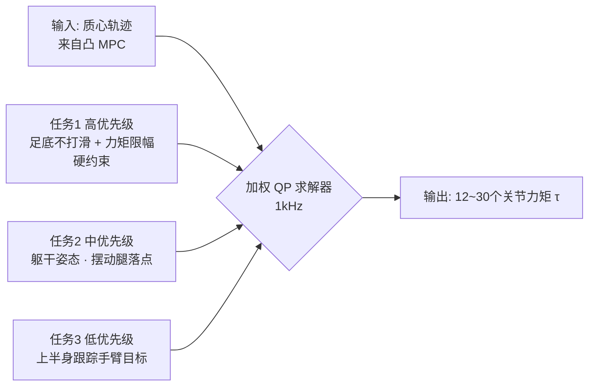

> **系列导航**：上一篇我们画出了具身智能的完整地图（[00 总览](/2026/08/25/embodied-ai-00-overview/)）。本篇补"小脑"最底层的地基：运动学、动力学与经典控制。无论后面学 RL locomotion 还是 VLA，这些数学都是绕不开的"普通话"。配套阅读：MIT《Underactuated Robotics》公开课（免费全文）[1](https://underactuated.mit.edu) 与教材《Modern Robotics》免费电子版[2](https://hades.mech.northwestern.edu/index.php/Modern_Robotics)。

## TL;DR

> **TL;DR 1｜一张知识依赖图**：正运动学（关节角→末端位置）→ 雅可比（速度映射+奇异位形）→ 动力学（力↔加速度，拉格朗日方程）→ 控制器（PID/LQR/MPC/WBC）。每一步都是下一步的"API"，跳着学会在论文里迷路。

> **TL;DR 2｜为什么 MPC 是机器人控制的事实标准**：PID 只看当前误差、LQR 假设线性系统且只能给"一个最优反馈律"；MPC 在每个周期滚动求解未来 $N$ 步的约束优化，天然处理关节限位、力矩饱和、障碍物约束——代价是算力。GPU 并行求解器让它 2020 年代在真机上复活。

> **TL;DR 3｜接触是分水岭**：自由空间运动用位置控制即可；一旦接触物体（装配、擦拭、灵巧手），必须切换到阻抗/力控视角——这是"操作类任务比移动类任务难十倍"的物理根源，也是第 04 篇 Diffusion Policy 类方法兴起的伏笔。

## 1. 运动学：从关节角到空间位置

### 1.1 正运动学与 DH 参数

机械臂是一个运动链。**正运动学（Forward Kinematics）**回答：给定各关节角 $\mathbf{q}\in\mathbb{R}^n$，末端执行器在哪？

$$
T_0^n(\mathbf{q}) = T_1\,T_2\cdots T_n \in SE(3)
$$

其中 $T_i \in SE(3)$ 是相邻连杆间的齐次变换矩阵（旋转 + 平移），由 Denavit-Hartenberg 参数 $(a_i, \alpha_i, d_i, \theta_i)$ 参数化[2](https://hades.mech.northwestern.edu/index.php/Modern_Robotics)。

### 1.2 平面二连杆：手推一遍

对平面二连杆（长度 $l_1, l_2$）：

$$
x = l_1 c_1 + l_2 c_{12}, \qquad y = l_1 s_1 + l_2 s_{12}
$$

其中 $c_1=\cos q_1$、$s_{12}=\sin(q_1+q_2)$。**逆运动学（IK）**有解析解（余弦定理）：

$$
\cos q_2 = \frac{x^2+y^2-l_1^2-l_2^2}{2 l_1 l_2},\quad q_2 = \pm\arccos(\cdot)
$$

$\pm$ 说明 IK 多解——机器人要"决定抬肘还是压肘"，这个歧义在高维冗余臂上会爆炸式增长。

### 1.3 雅可比与微分逆运动学

高维臂没有解析 IK，工程上全部走数值路线。对正运动学求时间导数：

$$
\dot{\mathbf{x}} = J(\mathbf{q})\,\dot{\mathbf{q}}, \qquad J \in \mathbb{R}^{6\times n}
$$

| 数学符号 | 代码变量 | Shape | 含义 |
|---:|:---|:---:|:---|
| $\mathbf{q}$ | `q` | `(n,)` | 关节角 |
| $\dot{\mathbf{q}}$ | `qd` | `(n,)` | 关节角速度 |
| $J(\mathbf{q})$ | `J` | `(6, n)` | 雅可比（几何/解析两种约定） |
| $\dot{\mathbf{x}}$ | `xd` | `(6,)` | 末端速度（线+角） |

**微分 IK**：想要末端以 $\dot{\mathbf{x}}^{des}$ 运动，解 $\dot{\mathbf{q}} = J^{-1}\dot{\mathbf{x}}^{des}$。$J$ 通常非方阵，用阻尼最小二乘：

```python
import numpy as np

def jacobian_2link(q, l1=1.0, l2=1.0):
    """平面二连杆雅可比 (2xn)，推导自 dx/dq 逐项求导"""
    q1, q2 = q
    return np.array([
        [-l1*np.sin(q1)-l2*np.sin(q1+q2), -l2*np.sin(q1+q2)],
        [ l1*np.cos(q1)+l2*np.cos(q1+q2),  l2*np.cos(q1+q2)],
    ])

def diff_ik_step(q, xd_des, damping=0.05):
    # 阻尼最小二乘: dq = J^T (J J^T + λ²I)^{-1} xd
    # λ>0 保证 J 接近奇异时数值稳定（牺牲一点精度换鲁棒性）
    J = jacobian_2link(q)
    dq = J.T @ np.linalg.solve(J @ J.T + damping**2*np.eye(2), xd_des)
    return q + dq

q = np.array([0.3, 0.6])          # 初始关节角 (n,)
for _ in range(200):               # 数值迭代逼近目标
    q = diff_ik_step(q, np.array([0.1, -0.05]))   # 每步末端期望速度 (m/s)
```

**奇异位形**：当 $J$ 秩亏（如手臂完全伸直），某方向速度不可实现，普通逆解会要求无穷大关节速度——阻尼项就是为此而生的。理解这一点，你就懂了为什么人形机器人的工作空间设计如此讲究。

## 2. 动力学：力从哪来，加速度到哪去

### 2.1 拉格朗日方程推导

机械臂动力学的标准形式（**manipulator equation**）：

$$
M(\mathbf{q})\ddot{\mathbf{q}} + C(\mathbf{q},\dot{\mathbf{q}})\dot{\mathbf{q}} + g(\mathbf{q}) = \tau + J^T f_{ext}
$$

用拉格朗日力学推一遍（以单摆为例，质量 $m$、杆长 $l$、角度 $\theta$）：

1. 动能：$T = \frac{1}{2}m(l\dot\theta)^2$
2. 势能：$V = -mgl\cos\theta$
3. 拉格朗日量：$\mathcal{L} = T - V = \frac{1}{2}ml^2\dot\theta^2 + mgl\cos\theta$
4. 代入 Euler-Lagrange 方程 $\frac{d}{dt}\frac{\partial \mathcal L}{\partial \dot\theta} - \frac{\partial \mathcal L}{\partial \theta} = \tau$：
   - $\frac{d}{dt}\frac{\partial \mathcal L}{\partial \dot\theta} = ml^2\ddot\theta$
   - $\frac{\partial \mathcal L}{\partial \theta} = -mgl\sin\theta$
5. 得到 $ml^2\ddot\theta + mgl\sin\theta = \tau$

对照一般形式：$M = ml^2$（惯性，恒正定），$C=0$（单点质量无科氏力），$g = mgl\sin\theta$。变量映射：

| 符号 | 物理含义 | 单位 |
|---:|:---|:---|
| $M(\mathbf{q})$ | 关节空间惯量矩阵（对称正定） | $\mathrm{kg\,m^2}$ |
| $C(\mathbf{q},\dot{\mathbf{q}})\dot{\mathbf{q}}$ | 科氏力与离心力 | $\mathrm{N\,m}$ |
| $g(\mathbf{q})$ | 重力矩 | $\mathrm{N\,m}$ |
| $\tau$ | 关节力矩（控制输入） | $\mathrm{N\,m}$ |
| $J^T f_{ext}$ | 外力（接触力！）映射回关节 | $\mathrm{N\,m}$ |

**两个必背性质**：(1) $M$ 对称正定 → 系统天生稳定倾向；(2) 重力项可精确前馈补偿 ($\tau = g(\mathbf{q})$ 让机械臂"漂浮")——所有协作臂的拖动示教就是这么实现的。

### 2.2 为什么接触是分水岭

自由空间里 $\tau$ 与 $\ddot{\mathbf{q}}$ 通过 $M$ 光滑映射；接触发生时 $f_{ext}$ 出现且**不连续**（碰或不碰，摩擦锥非线性）——动力学变成混杂系统（hybrid system）。这就是莫拉维克悖论在数学上的化身，也是第 04 篇中"为什么抓鸡蛋的演示数据比轨迹规划有效"的根源。

## 3. 控制器三部曲

### 3.1 PID：90% 的工业现场

$$
\tau(t) = K_p e(t) + K_i \int_0^t e\,ds + K_d \dot{e}(t), \qquad e = q^{des} - q
$$

直觉：比例项像弹簧把误差拉回来，微分项像阻尼抑制超调，积分项消除稳态误差。调参口诀先 $K_p$ 后 $K_d$ 最后 $K_i$。局限：单回路假设、无法显式处理约束、增益固定不适配大范围姿态变化（重力矩随姿态剧烈变化时 PID 会疲软）。

### 3.2 LQR：最优控制的入场券

把动力学线性化 $\dot{x} = Ax + Bu$，定义二次代价：

$$
J = \int_0^\infty \left( x^T Q x + u^T R u \right) dt
$$

最优反馈为状态线性函数 $u = -K x$，其中 $K = R^{-1}B^T P$，而 $P$ 是**代数 Riccati 方程**的解：

$$
A^T P + P A - P B R^{-1} B^T P + Q = 0
$$

推导要点：猜 $J^*(x)=x^TPx$ 代入 HJB 方程 $\min_u[\nabla J^*{}^T(Ax+Bu)+x^TQx+u^TRu]=0$，对 $u$ 求极小得 $u=-R^{-1}B^TPx$，回代整理即得上式。$Q\succeq0$ 惩罚状态偏差、$R\succ0$ 惩罚能耗，二者比值就是你的"性格参数"。Math-Code 绑定（cart-pole 平衡）：

```python
import numpy as np
from scipy.linalg import solve_continuous_are as care

# 小车倒立摆在竖直平衡点的线性化: x = [θ, θ̇]
def cartpole_lqr(M=1.0, m=0.1, l=0.5, g=9.81):
    A = np.array([[0, 1],
                  [(M+m)*g/(M*l), 0]])          # 不稳定极点 -> 必须反馈
    B = np.array([[0], [-1/(M*l)]])
    Q = np.diag([10.0, 1.0])                    # 更在乎角度偏差
    R = np.array([[0.1]])                       # 更不在乎力矩大小
    P = care(A, B, Q, R)                        # 解 Riccati: AᵀP+PA-PBR⁻¹BᵀP+Q=0
    K = np.linalg.solve(R, B.T @ P)             # u = -K x
    return K

K = cartpole_lqr()
theta, theta_dot = 0.05, 0.0                     # 当前状态扰动
u = -K @ np.array([theta, theta_dot])            # 输出力矩标量
```

LQR 的美：一次离线求解、在线只需矩阵乘法（微秒级）；它的憾：只对线性系统全局最优、不能带约束。

### 3.3 MPC：滚动时域优化

模型预测控制在每个周期求解有限时域最优控制问题，然后**只执行第一步**，下个周期用新观测重新求解：

$$
\begin{aligned}
\min_{u_{0:N-1}} \quad & \sum_{k=0}^{N-1} \Big( x_k^T Q x_k + u_k^T R u_k \Big) + x_N^T P x_N \\
\text{s.t.} \quad & x_{k+1} = f(x_k, u_k) \\
& |u_k| \le u_{max}, \quad q_{min} \le q_k \le q_{max} \quad (\text{真实约束！})
\end{aligned}
$$

| 符号 | 代码变量 | 典型取值 | 说明 |
|---:|:---|:---:|:---|
| $N$ | `horizon` | 10~50 步 | 预测步长，越长越"远视"越耗算力 |
| $Q, R$ | `Q`, `R` | 对角阵 | 与 LQR 同义 |
| $f(x,u)$ | `dynamics_fn` | — | 可用完整非线性动力学 |
| 约束 | `bounds` | — | LQR 给不了的硬约束能力 |

四足机器人领域的里程碑工作（MIT Mini Cheetah 系列）证明了：把全身动力学简化为**质心单刚体模型**（centroidal dynamics，忽略关节惯性耦合），凸 MPC 可以在 1 kHz 内求解 12 个关节的力分配，实现奔跑、跳跃甚至后空翻[3](https://ieeexplore.ieee.org/document/8593885)。这篇 IROS 2018 论文的简化思想直接催生了整个"凸 MPC + WBC"流派。

### 3.4 阻抗控制：与未知世界握手

位置控制假设环境已知；但擦桌子、插销子这类任务，你真正想控制的是**力和位移的关系**（就像肌肉的弹簧特性）：

$$
\tau = J^T\left[ K_x (x^{des} - x) + D_x(\dot{x}^{des} - \dot{x}) + f^{des} \right] + g(\mathbf{q})
$$

$K_x$ 调软（低刚度）→ 机械臂表现得"柔顺"，撞到人不会刚性地顶死。Hogan 的阻抗控制理论（1985）是现代协作臂与人形机器人力交互的基石。准直驱执行器（低减速比+电流环力矩控制）之所以成为人形机器人标配，就是为了让这种软件阻抗可以做到足够"透明"。

## 4. 全身控制（WBC）：人形的最后一层拼图

人形机器人每秒要做两类决策混排：质心怎么动（浮动基座 6 DoF）+ 各关节怎么动。主流方案是**任务优先级 QP**堆叠：



数学形式（简化的分层 QP）：

$$
\begin{aligned}
\min_{\tau,\,f,\,\ddot q}\ & \sum_i w_i \| J_i \ddot q + \dot J_i \dot q - \ddot x_i^{des} \|^2 \\
\text{s.t.}\ & M\ddot q + h = S^T\tau + J_c^T f, \qquad \text{(浮动基座动力学)}\\
& |f_{i,z}| \le \mu f_{i,n}, \qquad \text{(摩擦锥)}\\
& \tau_{min} \le \tau \le \tau_{max}
\end{aligned}
$$

这套框架在 MIT Humanoid、宇树等各家控制器中反复出现（细节实现各异）。它和 RL 的关系不是取代而是互补：2024 年后的前沿是人形"RL 学技能 + QP 保安全"的混合栈，详见下一篇。

## 5. 工程实践清单

1. **仿真先行**：MuJoCo（接触建模精度口碑最好，DeepMind 开源维护）[4](https://mujoco.readthedocs.io)；Drake（Russ Tedrake 团队开发、丰田研究院支持，轨迹优化全家桶）。
2. **单位与坐标系**：90% 的"机器人抽风"来自单位错误（deg/rad）和左右腿坐标系搞反。写单元测试验证 $FK(I) $ 是否等于 DH 表给出的静止位姿。
3. **实时性**：控制循环必须硬实时（1kHz 抖动 <100μs），Linux 下用 PREEMPT_RT 补丁或单独 MCU 跑底层力矩环。
4. **重力补偿先行**：任何新臂上手第一件事 `τ = g(q)`，确认机械臂"漂浮"再叠加其他控制项。

## Lab Exercises

1. **手搓微分 IK**：用上面的 `diff_ik_step` 从 $q=[0,0]$ 走到目标点 $(1.2, 0.5)$，画出末端轨迹与关节角曲线；然后把阻尼 $\lambda$ 从 0.05 改成 0.5，观察收敛步数变化并解释原因。
2. **LQR vs MPC 对比**：安装 `pip install do-mpc` 或手写 OCP，对单摆摆起（swing-up）任务分别跑 LQR（只在平衡点附近有效）和 NMPC（全程可行），记录各自能处理的初始角度范围，体会"局部 vs 全局"的含义。
3. **读一篇论文对照检查**：打开 MIT Cheetah 凸 MPC 论文[3](https://ieeexplore.ieee.org/document/8593885)，找到其简化模型假设清单（单刚体/忽略关节惯性/足底点接触），逐条标注它们分别省掉了本篇哪个公式里的哪一项。

## 参考文献与延伸阅读

- [1] MIT 6.832 *Underactuated Robotics* 全部讲义免费开放，Russ Tedrake。[链接](https://underactuated.mit.edu)
- [2] Lynch & Park, *Modern Robotics*（Cambridge Univ. Press），官方免费 PDF/视频课程。[链接](https://hades.mech.northwestern.edu/index.php/Modern_Robotics)
- [3] Di Carlo et al., *Dynamic Locomotion in the MIT Cheetah 3 Through Convex Model-Predictive Control*, IROS 2018. [IEEE](https://ieeexplore.ieee.org/document/8593885)
- [4] MuJoCo 官方文档与教程。[链接](https://mujoco.readthedocs.io)
- Khatib, *A Unified Approach for Motion and Force Control of Robot Manipulators*（操作空间方法，1987，IEEE 期刊，图书馆获取）
- 中文社区资源：B 站搜索"Modern Robotics 课程搬运"、"Underactuated 中文字幕"，多个优质翻译系列（具体 UP 主动态变化，站内检索即可）。

*下一篇：《02 学习范式》——当模型太复杂写不出来（比如沙地上的四足、被踩到的脚掌），工程师如何让机器人在 GPU 里"养蛊"一万次，再把幸存者搬到现实世界。*
