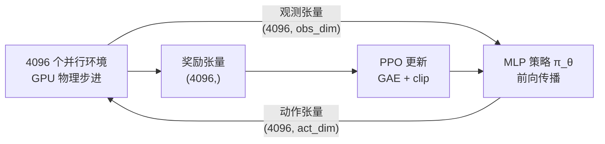
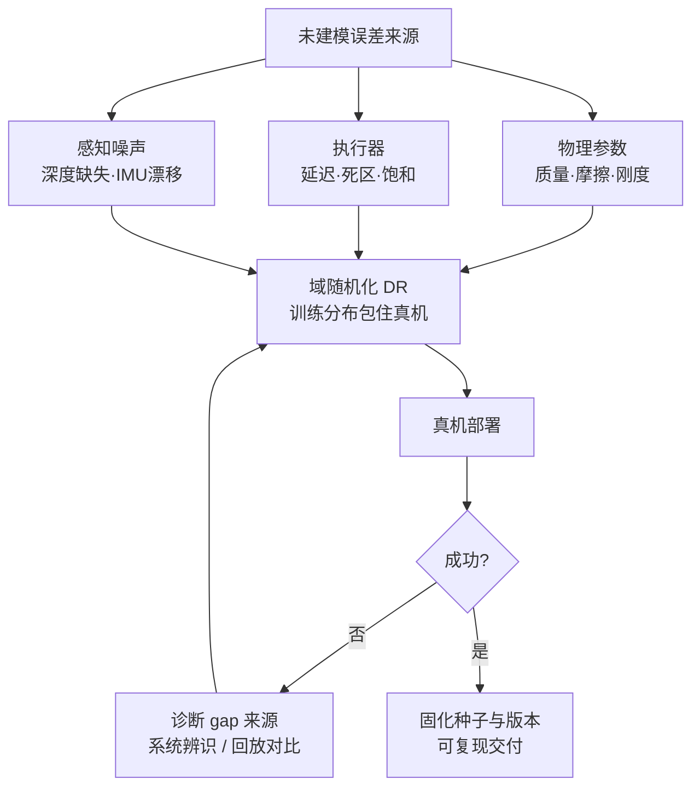

> **系列导航**：上一篇的 MPC/WBC 在结构化场景里所向披靡（[01 控制地基](/2026/08/25/embodied-ai-01-control-foundations/)），但四足机器人踩进草地、人形被撞了一下，解析模型立刻失灵。本篇讲"让机器人自己学"的两条路线：强化学习（试错）与模仿学习（照抄），以及把仿真策略搬上真机的 sim-to-real 工程学。RL 数学基础强烈建议先读本站《从 MDP 到 GRPO》系列第一篇[1](/2026/08/21/mdp-to-grpo-01-mdp-bellman-foundation/)，本篇直接复用其记号。

## TL;DR

> **TL;DR 1｜路线分工**：locomotion（走路、跑酷、抗冲击）已被 **PPO + 大规模并行仿真** 范式基本解决；manipulation（操作）因为接触动力学难仿真+数据贵，主流走 **模仿学习**。两条路线的分界不是玄学而是物理：自由空间的动力学好仿真，接触的动力学难仿真。

> **TL;DR 2｜Sim-to-Real 的本质是分布匹配**：域随机化把"训练一个鲁棒策略"转化为"在增广后的仿真分布上做期望优化" \(\min_\theta\ \mathbb{E}_{\xi\sim p(\xi)}[L(\pi_\theta;\xi)]\)。它有效的前提是真机参数落在随机化范围内；范围太大策略变平庸、太小则迁移失败——调这个范围就是调"方差换偏差"。

> **TL;DR 3｜模仿学习的阿喀琉斯之踵**：BC 只见过专家状态分布 \(d^{\pi^*}\)，自己跑偏后无人纠错，误差以二次速度复合（Ross 的协变量偏移定理）。DAgger 用"专家在线纠偏"修复，VLA 时代用 action chunking 缓解——这是贯穿第 04/05 篇的主线。

## 目录

- [1. 为什么运动控制选择了 RL](#1-为什么运动控制选择了-rl)
  - [1.1 MDP 最小回顾：把学走路写成数学](#11-mdp-最小回顾把学走路写成数学)
  - [1.2 PPO：机器人 RL 的默认引擎](#12-ppo机器人-rl-的默认引擎)
  - [1.3 为什么不是 SAC / TRPO](#13-为什么不是-sac--trpo)
- [2. GPU 并行仿真：范式革命的引擎](#2-gpu-并行仿真范式革命的引擎)
  - [2.1 CPU 到 GPU：管线迁移到底改了什么](#21-cpu-到-gpu管线迁移到底改了什么)
  - [2.2 吞吐账本与工程边界](#22-吞吐账本与工程边界)
- [3. Locomotion 标准配方（2024 共识版）](#3-locomotion-标准配方2024-共识版)
  - [3.1 奖励函数设计表](#31-奖励函数设计表)
  - [3.2 地形课程学习的数学](#32-地形课程学习的数学)
  - [3.3 Teacher-Student 特权蒸馏](#33-teacher-student-特权蒸馏)
  - [3.4 风格化：AMP 与像不像](#34-风格化amp-与像不像)
- [4. Sim-to-Real 工程学](#4-sim-to-real-工程学)
  - [4.1 域随机化的数学表述与分布鲁棒视角](#41-域随机化的数学表述与分布鲁棒视角)
  - [4.2 失效边界：四个已知的坑](#42-失效边界四个已知的坑)
  - [4.3 执行器网络：把电机模型交给数据](#43-执行器网络把电机模型交给数据)
  - [4.4 Locomotion vs Manipulation 的 gap 不对称](#44-locomotion-vs-manipulation-的-gap-不对称)
- [5. 模仿学习：从 BC 到离线 RL](#5-模仿学习从-bc-到离线-rl)
  - [5.1 行为克隆与协变量偏移定理](#51-行为克隆与协变量偏移定理)
  - [5.2 DAgger：请专家上车纠错](#52-dagger请专家上车纠错)
  - [5.3 GAIL：免奖励的分布匹配](#53-gail免奖励的分布匹配)
  - [5.4 离线 RL 一瞥：CQL 与 IQL](#54-离线-rl-一瞥cql-与-iql)
- [6. 人形机器人的 RL：2024–2025 进展速记](#6-人形机器人的-rl20242025-进展速记)
- [7. 两个最小可运行实现](#7-两个最小可运行实现)
  - [7.1 1D 环境 + PPO 最小骨架](#71-1d-环境--ppo-最小骨架)
  - [7.2 域随机化参数采样器](#72-域随机化参数采样器)
- [Lab Exercises](#lab-exercises)
- [参考文献与延伸阅读](#参考文献与延伸阅读)

---

## 1. 为什么运动控制选择了 RL

第 01 篇的模型驱动方法有一个隐含假设：\(f(x,u)\) 写得出来。现实中：

| 未建模效应 | 对解析方法的杀伤 |
|-----------|----------------|
| 沙地/草地/湿地反力 | 摩擦锥假设失效 |
| 减速器间隙与传动柔性 | 关节刚度模型失准 |
| 电机温升导致的力矩衰减 | 力矩限位漂移 |
| 足底磨损 | 接触几何改变 |

这些效应共同写不出来、但**仿真+真实混合下能被试错捕捉**。RL 直接优化累积回报：

$$
\max_\theta\ J(\theta) = \mathbb{E}_{\tau\sim \pi_\theta}\left[\sum_t \gamma^t r(s_t,a_t)\right]
$$

### 1.1 MDP 最小回顾：把学走路写成数学

先把记号钉死（与本站《从 MDP 到 GRPO》[1](/2026/08/21/mdp-to-grpo-01-mdp-bellman-foundation/)一致，此处只取 locomotion 需要的最小集）：

- **五元组** \(\mathcal{M}=(\mathcal{S},\mathcal{A},P,r,\gamma)\)：状态空间 \(\mathcal{S}\)（四足场景通常是 IMU 姿态/角速度 + 关节位置速度 + 上一步动作，约 30–50 维）、动作空间 \(\mathcal{A}\)（目标关节角偏移，12 维）、转移核 \(P(s_{t+1}\mid s_t,a_t)\)（由物理仿真器扮演）、奖励 \(r\)、折扣因子 \(\gamma\in[0,1)\)；
- **回报** \(G_t=\sum_{k\ge 0}\gamma^k r_{t+k}\)，\(\gamma\) 同时承担"远期视野"与"无穷级数收敛"两个职责——locomotion 常取 \(0.99\)，对应约 100 步的有效视野（50 Hz 下 2 秒），恰好是一个步态周期多一点；
- **价值函数族**：\(V^\pi(s)=\mathbb{E}_\pi[G_t\mid s_t=s]\)，\(Q^\pi(s,a)=\mathbb{E}_\pi[G_t\mid s_t=s,a_t=a]\)，优势 \(A^\pi(s,a)=Q^\pi-V^\pi\) 表示"这个动作比平均水平好多少"——它是后面一切算法的核心中间量。

**策略梯度定理**的三行推导（完整版见本站第二篇[《REINFORCE 与策略梯度》](/2026/08/21/mdp-to-grpo-02-policy-gradient-reinforce/)）：轨迹似然的对数可以拆成

$$
\nabla_\theta \log p_\theta(\tau) = \sum_t \nabla_\theta \log \pi_\theta(a_t\mid s_t) + \underbrace{\sum_t \nabla_\theta \log P(s_{t+1}\mid s_t,a_t)}_{=\,0,\ \text{环境不含 } \theta}
$$

于是 \(\nabla_\theta J = \mathbb{E}_{\tau\sim\pi_\theta}\left[\sum_t \nabla_\theta\log\pi_\theta(a_t\mid s_t)\,G_t\right]\)；再利用基线不变性（减去任何与动作无关的量不改变期望）把 \(G_t\) 换成方差更小的优势：

$$
\nabla_\theta J(\theta) = \mathbb{E}_{\pi}\left[\nabla_\theta \log \pi_\theta(a\mid s)\, A^\pi(s,a)\right]
$$

这个公式解释了 RL locomotion 的全部工程形态：**梯度的无偏性来自似然比技巧，梯度的高方差来自长轨迹乘积**——后面 PPO 的信任域、GAE 的 \(\lambda\) 插值、大规模并行仿真的海量样本，全是在跟这半个公式的缺陷搏斗。

### 1.2 PPO：机器人 RL 的默认引擎

策略梯度定理给出无梯度优化路径，但朴素梯度一步走太远会把策略打崩。工程标配 PPO[2](https://arxiv.org/abs/1707.06347)：裁剪重要性比率，把每次更新的信任域限制住（TRPO 的二阶约束如何退化为这一阶裁剪，见本站[第三篇 TRPO](/2026/08/21/mdp-to-grpo-03-trpo-trust-region/)与[第四篇 PPO](/2026/08/21/mdp-to-grpo-04-ppo-clipped-surrogate/)）。设新旧策略比率 \(r_t(\theta)=\dfrac{\pi_\theta(a_t\mid s_t)}{\pi_{\theta_{\text{old}}}(a_t\mid s_t)}\)，替代目标为：

$$
L^{\text{CLIP}}(\theta) = \mathbb{E}_t\left[\min\big(r_t(\theta)\hat A_t,\ \mathrm{clip}(r_t(\theta),\,1-\epsilon,\,1+\epsilon)\hat A_t\big)\right]
$$

**读这个 min 要看出它的不对称性**：当 \(\hat A_t>0\) 且 \(r_t>1+\epsilon\)（好消息但更新过猛），裁剪分支生效，梯度归零——不再奖励"更自信"；当 \(\hat A_t<0\) 且 \(r_t<1-\epsilon\)（坏消息且已在回避），同样截断。裁剪只在**让更新变得更糟的方向**立墙，好方向的改进不受限。这就是"悲观下界"的含义：目标函数是新目标的一个下界，最大化它不会过度外推。

**GAE（Generalized Advantage Estimation）**[17](https://arxiv.org/abs/1506.02438) 解决"\(\hat A_t\) 从哪来"。定义 TD 残差：

$$
\delta_t = r_t + \gamma V(s_{t+1}) - V(s_t), \qquad \hat A_t^{\text{GAE}(\gamma,\lambda)} = \sum_{l=0}^{\infty} (\gamma\lambda)^l\, \delta_{t+l}
$$

\(\lambda\) 是**偏差-方差旋钮**：\(\lambda=0\) 退化为单步 TD（低方差、高偏差，偏差来自 \(V\) 的估计误差）；\(\lambda=1\) 退化为 Monte Carlo（无价值函数偏差、高方差，来自整条轨迹的噪声叠加）。机器人场景几乎总取 \(\gamma=0.99,\lambda=0.95\)——这不是玄学：物理仿真里奖励密集、动态短（几百步一局），中等视野的优势估计信噪比最高。

**机器人场景调参经验**（legged_gym 风格默认值，社区高度一致的配置）：

| 超参 | 典型值 | 备注 |
|------|--------|------|
| \(\gamma\) / \(\lambda\) | 0.99 / 0.95 | 见上文视野论证 |
| clip \(\epsilon\) | 0.2 | 几乎从不调 |
| 学习率 | \(1\times10^{-3}\sim3\times10^{-4}\)，KL 自适应 | \(\mathrm{KL}>2\times\) 目标则降、\(<\frac{1}{2}\) 目标则升 |
| rollout 长度 | 24 步 × decimation 4 | 策略 50 Hz，物理 200 Hz |
| PPO epochs / minibatch | 5 / 4 | 数据便宜所以 epoch 少，防过拟合旧样本 |
| 优势归一化 | 每个 minibatch 减均值除标准差 | 数值稳定的第一功臣 |
| 观测归一化 | 运行均值/方差 | 观测尺度差异大（角度 vs 速度）|
| 动作语义 | \(\tanh\) 输出 × 0.25 rad，绕默认站姿 | 限幅 + 有意义的工作点 |

两条容易被忽略但致命的经验：其一，**区分 timeout 与摔倒**——到达时限的正常终止要 bootstrap（价值目标含 \(V(s_{T})\)），摔倒的真终止不要（否则"摔得快"反而被奖励存活价值），这正是前文张量表里 `time_out_buf` 单独存在的原因；其二，**早停（termination）本身是隐式课程**——摔倒立刻结束回合，等于把"学会不摔"变成密度最高的训练信号。

### 1.3 为什么不是 SAC / TRPO

TRPO 的共轭梯度 + Fisher 矩阵向量积在理论上优雅，但实现复杂、难与大规模并行采样流水线融合（详见本站第三篇的讨论）。SAC 这类 off-policy 算法样本效率高，但 replay buffer 与最大熵项在**非平稳、高维、接触丰富**的环境里维护成本高、超参敏感；而并行仿真把"样本贵"这个问题直接消灭了——既然一秒能采几十万步，就不必为一省样本引入 off-policy 的全部复杂性。**算力改变了算法选择的坐标系**，这是理解本领域"为什么偏偏是 PPO"的关键。

## 2. GPU 并行仿真：范式革命的引擎

Isaac Gym（NVIDIA, 2021）把物理步进和渲染整体搬进 CUDA，避免了 CPU-GPU 数据往返，单卡同时模拟 4096~16384 个环境，端到端吞吐提升 2~3 个数量级[3](https://arxiv.org/abs/2108.10470)。Rudin et al. 用它在 20 分钟内训出 ANYmal 四足行走策略（此前同类工作要数天）[4](https://arxiv.org/abs/2109.11978)：



Math-Code 绑定（并行采样的张量化视角）：

| 符号 | 代码变量 | Shape | 说明 |
|---:|:---|:---:|:---|
| \(o_t\) | `obs_buf` | `(N_env, n_obs)` | 观测批 |
| \(a_t\) | `actions` | `(N_env, n_act)` | 策略输出批 |
| \(r_t\) | `rewards` | `(N_env,)` | 奖励批 |
| done | `time_out_buf` | `(N_env,)` | 终止掩码 |

### 2.1 CPU 到 GPU：管线迁移到底改了什么

传统 CPU 栈（MuJoCo + 自写 trainer）有三个串行瓶颈：每个环境独立进程/线程各自步进物理、观测奖励在 Python 层逐环境计算、每步通过 IPC 把数据搬到 GPU 做神经网络前向。**瓶颈不在物理求解本身，而在数据搬运与调度开销**——单环境物理步进只要几十微秒，Python 循环和内存拷贝却能吃掉十倍于此的时间。

Isaac Gym 的解法是把整条管线塞进一张卡：

1. **状态常驻显存**：所有刚体的位姿/速度、关节状态放在 GPU buffer 里，物理求解器（PhysX 的 GPU 管线）直接读写，全程零拷贝；
2. **环境间隔离**：数千个环境互不碰撞（collision filtering），物理求解按环境分岛并行，规模上去后 kernel 启动开销被摊薄到接近零；
3. **观测/奖励向量化**：观测计算是若干次 `torch.cat` 与切片写入 `obs_buf`，奖励是一组逐元素算子（指数、平方、掩码求和），终止是一个布尔张量，全部天然批处理；
4. **reset 也是张量操作**：对 `terminations.nonzero()` 的环境索引做 scatter，把初始状态分布写回去——没有 Python 循环。

一个 RL step 的完整时序（对应 legged_gym 的 `step` 实现，伪代码）：

```python
obs_buf[:] = compute_observations()            # 张量切片拼接, 全程 GPU
actions = policy(obs_buf.detach())             # 一次批量前向, (N, act_dim)
clipped = act_scale * torch.tanh(actions)      # 动作限幅
for _ in range(decimation):                    # 策略 50Hz, 物理 200Hz
    torques = p_gains * (default_pos + clipped - dof_pos) - d_gains * dof_vel
    apply_torques(torques)                     # 写入 GPU 执行器缓冲
    simulate()                                 # PhysX GPU 子步
post_physics_refresh()                         # 刷新刚体状态缓冲
rewards[:] = compute_rewards()                 # 逐元素 torch 算子
reset_ids = terminated.nonzero(as_tuple=True)[0]
reset_idx(reset_ids)                           # scatter 初始分布
```

对 proprioceptive 任务还有个隐藏红利：**根本不需要渲染**。地形以 heightfield 形式常驻 GPU，需要高程图时做 raycast 即可，绕开了仿真领域最贵的部分（photorealistic rendering）。

### 2.2 吞吐账本与工程边界

账本很直白：4096 环境 × 50 Hz 控制 × 4 物理子步 = **每秒约 82 万次物理步进的聚合吞吐**（简单场景可达更高量级），而单环境串行采样通常只有数百至上千步/秒。20 分钟训练 = 约 10 亿量级的交互样本，深度 RL 从"跑不动"变成"试得起"，奖励函数设计的迭代速度随之质变——第 3 节的整套配方都建立在这个前提上。

边界同样要清楚：(1) GPU 管线的接触求解精度与 CPU 版 MuJoCo 并不完全一致，某些精细操作任务上软接触行为的可信度存疑；(2) 单卡显存与 SM 争用限制了单环境复杂度上限——环境越多，每个环境的刚体预算越少；(3) 渲染密集型任务（视觉 RL）要走另一套管线。开源生态方面，`legged_gym`（ETH Zurich）是事实起点，官方后继者 Isaac Lab（GitHub: `isaac-sim/IsaacLab`，未本地验证）补齐了传感器仿真与模块化资产体系并有专门论文[18](https://arxiv.org/abs/2511.04831)；PyTorch 侧等价物还有 Brax/MJX（JAX 版 MuJoCo）。

## 3. Locomotion 标准配方（2024 共识版）

一个能过审顶会的四足策略，配方大致如下（以 legged_gym 风格为例）：

### 3.1 奖励函数设计表

总奖励是任务项与惩罚项的加权和：

$$
r_t = \sum_i w_i^{+}\, r_i^{+}(s,a) \;-\; \sum_j w_j^{-}\, c_j(s,a)
$$

完整展开的常用项（权重为社区典型量级，具体数值随任务调整）：

| 奖励/惩罚项 | 公式形态 | 方向 | 典型权重直觉 |
|------------|---------|------|-------------|
| 线速度指令跟踪 | \(\exp\left(-\lVert v^{cmd}-v\rVert^2/\sigma^2\right)\)，\(\sigma\approx0.25\) | 正 | 主导项，决定"听不听话" |
| 角速度指令跟踪 | 同上，作用于偏航率 | 正 | 次主导 |
| 存活奖励 | 常数 \(w_{alive}\) | 正 | 小常数，防止自杀式摆烂 |
| 垂直速度/翻滚俯仰角 | \(\lVert v_z\rVert^2\)、\((roll,pitch)^2\) | 负 | 保持躯干平稳 |
| 基座高度偏离 | \((h-h^*)^2\) | 负 | 锁定站立高度 |
| 关节力矩 | \(\lVert\tau\rVert^2\) | 负 | 能耗惩罚 |
| 关节加速度 | \(\lVert\ddot q\rVert^2\) | 负 | 平滑，保护减速器 |
| 动作变化率 | \(\lVert a_t-a_{t-1}\rVert^2\) | 负 | 抑制抖动 |
| 动作能耗 | \(\lvert a\cdot\dot q\rvert\)（机械功率）| 负 | 比 \(\tau^2\) 更物理 |
| 关节限速/限位 | 超限二次罚 | 负 | 保护硬件 |
| 足底打滑 | 触地时足端速度平方 | 负 | 抑制滑步 |
| 足空时间 | 每步态相位的空中时长奖励 | 正 | 诱导规整摆动相 |
| 不期望接触 | 小腿/腹部/基座触地 | 负 | 语义约束（不许跪行）|
| 碰撞/自碰 | 接触事件脉冲罚 | 负 | 保护机身 |

**经验法则**：正奖励用 \(\exp(-\lVert\cdot\rVert^2/\sigma^2)\) 形式（处处可导、有界、天然实现"够好就行"的容差），负惩罚用二次形式（越界越痛）。权重每改一次都要重训——所以 Eureka 让 GPT-4 写奖励代码再自动迭代，在旋转笔任务上超过人类工程师设计[5](https://arxiv.org/abs/2310.12931)，本质是把"炼丹"变成了程序合成搜索。另一个反直觉的事实：**跟踪项的 \(\sigma\) 就是任务的容差定义**——\(\sigma=0.25\) m/s 意味着速度差超过 0.25 m/s 后奖励迅速趋零，策略不再为更精准的跟踪付出稳定性代价。

### 3.2 地形课程学习的数学

把地形难度做成阶梯（平地→缓坡→台阶→碎石），策略在简单关卡达标后解锁下一关。形式化为一个**难度状态机**：设离散难度 \(d\in\{0,1,\dots,L-1\}\)（如 10 级台阶高度/间距递增），环境 \(i\) 维护当前难度 \(d_i\)，每隔 \(K\) 个 step 计算滑动窗口平均回报 \(\mu_i\)：

$$
d_i \leftarrow \begin{cases} \min(d_i+1,\ L-1) & \mu_i > \theta_R \\ \max(d_i-1,\ 0) & \mu_i \le \theta_R \end{cases}, \qquad \theta_R = c\cdot r_{\max},\ c\approx 0.8
$$

即"平均回报超过最大可能回报的八成就升一级，否则降一级"。新回合的地形从当前难度附近的**窗口均匀分布**采样：

$$
d' \sim \mathrm{Unif}\big\{\max(0, d_i-m),\ \dots,\ \min(L-1, d_i+m)\big\}
$$

为什么用局部窗口而不是全局均匀？两个原因：近端难度持续出现在训练混合里，**防止升到高级后遗忘低级技能**（灾难性遗忘的课程化解法）；窗口随 \(d_i\) 上移，提供向上的探索压力而不至于跳崖。同一思想也用于指令课程：速度指令范围 \(R_{cmd}\) 随跟踪误差下降按比例放宽，以及 Rudin 论文展示的"随机推踢"强度课程[4](https://arxiv.org/abs/2109.11978)。这套机制的普适启示：**凡是能定义"当前能力测量值"的训练信号，都可以套这个 升/降级 + 窗口采样 的模板**。

### 3.3 Teacher-Student 特权蒸馏

训练时给教师策略"上帝视角"（真实摩擦系数、外力大小、地形高程图），部署时学生只能用本体传感器（IMU+关节编码器+触地信号）。形式化：教师 \(\pi_T(a\mid o_p, z)\) 中 \(z\) 是特权向量，学生 \(\pi_S(a\mid o_p')\) 只有部署可得观测。蒸馏损失有两种主流形态：

**动作级 KD**（直接模仿输出）：

$$
L_{\text{KD}} = \mathbb{E}\left[\lVert \pi_S(o_p') - \pi_T(o_p, z)\rVert_2^2\right]
$$

**隐层级 KD**（Lee et al., 登上 Science Robotics，ANYmal 盲走碎石陡坡[6](https://arxiv.org/abs/2010.11251)）：学生先学一个**估计器**从观测历史重建特权信息，再用估计值驱动策略：

$$
\hat z = e_\psi(o'_{t-w:t}), \qquad L_{\text{est}} = \lVert \hat z - z\rVert^2, \qquad L_{\text{pol}} = \lVert \pi_S(o_p', \hat z) - \pi_T(o_p,z)\rVert^2
$$

其中 \(w\) 是数十步量级的历史窗口。RMA（Rapid Motor Adaptation）给出了同思想的在线适应版本[19](https://arxiv.org/abs/2107.04034)：第一阶段联合训练编码器 \(\phi_E(z)\) 与策略 \(\pi(a\mid o_p,\phi_E(z))\)；第二阶段冻结二者，训练适应模块 \(\phi_A(\text{history})\) 以 MSE 对齐 \(\phi_E\) 的隐空间——部署时 \(\phi_A\) 充当"环境参数在线辨识器"。

**为什么有效？**三层解释：(1) 特权信息把 POMDP 松弛成了 MDP——教师的值函数面更平滑、信用分配更容易，RL 只需解决"知道一切的条件下怎么走"；(2) 蒸馏把"从历史推断不可观状态"这个困难问题从 RL 中剥离出来变成**监督学习**，梯度信号干净得多；(3) 学生的模仿过程本身是正则化，防止其在仿真里学到依赖特权信息的脆弱技巧。**失效模式**同样清晰：学生容量上限受限于互信息 \(I(o'_{t-w:t};\,z)\)——历史里根本没有的信息（比如从未蹭过的地面摩擦）谁也推不出来，这时只能靠主动激励（跺脚试探）或保守化处理。

### 3.4 风格化：AMP 与"像不像"

纯任务奖励常产出"癫痫式"步态——指标全绿但没人敢把它放到产品里。AMP（Adversarial Motion Priors）引入判别器区分"真狗运动片段"（来自动捕或手工动画的数据集 \(\mathcal{M}\)）与"策略生成的运动"，把判别器输出作为风格奖励加进总回报[7](https://arxiv.org/abs/2104.02180)。以"专家为正类"的约定写出最小二乘 GAN 目标：

$$
\min_D\ \mathcal{L}_D = \mathbb{E}_{(s,s')\sim p_{\mathcal{M}}}\big[(D(s,s')-1)^2\big] + \mathbb{E}_{(s,s')\sim p_{\pi}}\big[(D(s,s')+1)^2\big]
$$

生成器的风格奖励取：

$$
r_{style} = \max\big(0,\ 1 - 0.25\,(D(s,s') - 1)^2\big), \qquad r = r_{task} + w_s\cdot r_{style}
$$

（注：AMP 原文的标签极性与本文约定相反，两者相差一个符号翻转，实现时务必对齐自己代码库的约定。）判别器作用在**相邻状态对** \((s,s')\) 而非单帧上，这一点至关重要：单帧匹配只能约束姿态，转移对匹配才能约束动力学节奏——步频、摆动时序这些"像不像狗"的关键信息全藏在 \((s,s')\) 里。

工程上的坑与解法：判别器过强会让风格奖励梯度消失或被策略 hack（找到判别器的决策边界缝隙刷分），常见缓解是限制判别器更新频率、压小 \(w_s\)、以及保证专家数据集的运动多样性。前置工作 DeepMimic 的两个机制也被普遍继承：**参考状态初始化（RSI）**——每回合从参考运动的随机时刻出发，保证专家流形的各段都被充分访问；**运动库 early termination**——偏离参考超过阈值立即重置[20](https://arxiv.org/abs/1804.02717)。这本质是 GAIL 思想在 locomotion 的移植，也是后来人形机器人"拟人步态"研究的起点。

## 4. Sim-to-Real 工程学



### 4.1 域随机化的数学表述与分布鲁棒视角

设真机参数为向量 \(\xi^\star\)（摩擦、质量、PD 增益、延迟……），未知但固定。DR 在训练时从区间采样 \(\xi \sim p(\xi)\)：

$$
\max_\theta\ J(\theta) = \mathbb{E}_{\xi\sim p(\xi),\, \tau\sim\pi_\theta(\cdot|\xi)}\big[R(\tau)\big]
$$

这个目标值得放进**分布鲁棒优化（DRO）**的框架里看清楚。理想的鲁棒目标是最坏情形最优 \(\max_\theta \inf_{\xi\in\Xi} J(\theta;\xi)\)，但下确界不可导、不可采样。DR 用采样期望替换了下确界，而两者通过 Donsker–Varadhan 型变分恒等式联系起来：

$$
\sup_{q\ll p}\ \Big\{ \mathbb{E}_{q}[J] - \tau\,\mathrm{KL}(q\,\Vert\,p) \Big\} \;=\; \tau \log \mathbb{E}_p\Big[e^{J/\tau}\Big]
$$

温度 \(\tau\) 扫过两个极端：\(\tau\to\infty\) 时左端退化为 \(\mathbb{E}_p[J]\)——正是 DR 在优化的目标；\(\tau\to 0^+\) 时左端逼近 \(p\) 支撑内的最坏情形。所以**优化采样期望，等于在"平均情形"与"最坏情形"之间选了一个由 \(p\) 的支撑决定的软化位置**——\(p\) 的支撑就是保护域。这给出三条可直接操作的推论：

1. **支撑条件**：\(\xi^\star \in \mathrm{supp}(p)\) 是必要条件（不充分——还需要策略类有能力在整个支撑上同时表现好）；
2. **方差换偏差的定量来源**：\(\mathbb{E}_p[J]\) 的蒙特卡洛估计方差随支撑体积增大而增大，等效于梯度噪声变大；训练收敛后策略在"参数中心"处必然次优——这就是"随机化范围太大策略变平庸"的数学根源，调范围就是在调方差-偏差权衡；
3. **可辨识性约束**：若两组参数 \(\xi_1\ne\xi_2\) 产生相同观测历史却要求不同最优动作，则**无记忆策略原理上不可能同时应对两者**——必须引入 LSTM 或 RMA 式在线适应模块，让策略自己从历史里估计 \(\xi\)。

视觉侧的经典证据：Tobin et al. 证明对足够多样的渲染随机化，真机图像近似落在训练分布支撑内，策略无需知道真实外观即可泛化[8](https://arxiv.org/abs/1703.06907)；动力学侧，Peng et al. 在 MuJoCo 抓取任务上系统验证了对质量/摩擦等动力学参数随机化的迁移增益[21](https://arxiv.org/abs/1710.06537)。OpenAI 的 Dactyl 则展示了极限操作：上百个参数的随机化 + LSTM 记忆在线适应，单手解魔方[9](https://arxiv.org/abs/1808.00177)；其 **ADR（Automatic DR）**变体不再手工设定范围，而是从窄分布出发、只有当策略性能跌破阈值时才扩大——自动寻找"策略能力边界"，把 4.2 节的手工调参变成了闭环控制。后续 DeXtreme 的系统性消融进一步表明：自动 DR 的迁移效果优于手调固定范围，延迟与观测噪声维度的随机化贡献显著，而部分维度的过度随机化反而损害最终迁移[22](https://arxiv.org/abs/2210.13702)——DR 不是"随机化越多越好"的免费午餐。

### 4.2 失效边界：四个已知的坑

以下多为社区复现共识而非单一论文结论，但每一条都有明确的失败案例群：

1. **支撑失覆盖**：随机化范围 ⊅ 真机值 → 迁移必败；范围过大 → 策略过度保守。正确姿势是先做**系统辨识**收窄范围（称重、实测摩擦、扫频测延迟），DR 只负责兜住辨识残差，而不是从零开始猜参数；
2. **接触求解器不可靠随机**：MuJoCo/PhysX 的软接触行为随求解器参数（时间步、solref/solimp、迭代次数）剧变，随机化这些参数可能让策略学到"利用求解器 bug"的技巧（比如卡进穿透边缘获得异常支撑力），这类技巧到真机上必然消失甚至反噬；
3. **执行器必须单独建模**：齿轮间隙、摩擦死区、力矩带宽这些执行器非线性是手写模型的重灾区，通用做法是用实测数据拟合执行器网络（下一小节专述）；
4. **不可辨识参数需要记忆**：如 4.1 推论 3 所述，负载变化、地面类型这类"只能从交互历史反推"的参数，要么给策略喂历史（LSTM），要么外挂适应模块（RMA），要么靠特权蒸馏的学生估计器——三者是同一个问题的三种工程答案。

### 4.3 执行器网络：把电机模型交给数据

Hwangbo et al. 2019（Science Robotics，与 [6] 同组）的关键贡献：放弃手写电机模型，用一个**小型 MLP（执行器网络，actuator net）**直接拟合真机执行器行为[23](https://arxiv.org/abs/1901.08652)。

- **输入**：该关节过去数十步的位置误差历史 + 上一步输出的实际力矩；
- **输出**：当前步力矩；
- **训练**：真机上施加随机激励信号，同步记录指令位置序列与实测力矩，纯监督回归。

为什么一个小 MLP 能胜过解析模型？因为它**一次性吸收了所有难以建模的非线性**——齿轮迟滞、静摩擦锥、PWM 带宽限制、温度漂移的平均效应——不需要为每一项分别建方程。收益立竿见影：ANYmal 在户外碎石坡上的 trotting 显著更稳，后续几乎所有高质量四足工作（含 [4][6][16]）都继承了这一组件。代价也要诚实列出：每种硬件都要重新采数训练；黑箱模型对超出训练激励分布的工况外推不可靠；失去了解析模型的物理可解释性。**这是一个典型的工程交换：用数据管道的可复制性换取建模精度的跃升。**

### 4.4 Locomotion vs Manipulation 的 gap 不对称

| 维度 | 四足/人形行走 | 手臂操作 |
|------|--------------|---------|
| 接触复杂度 | 点/面接触，法向为主，同时接触数 ≤ 4 | 多指包裹，切向摩擦主导，接触模式连续切换 |
| 接触模式计数 | 少量离散模式（支撑/摆动） | \(n\) 指尖各有 分离/滑动/滚动/粘着，混合子模式达 \(4^n\) 量级 |
| 视觉依赖 | 弱（可盲走） | 强（抓取=毫米级视觉定位问题） |
| 仿真保真度 | 高（刚体近似够用） | 低（形变、绳、流体更糟；切向软接触最难保真） |
| 感知-控制耦合 | 松（感知可降级为高度估计） | 紧（视觉误差直接改变接触结果） |
| 主流方案 | RL + DR 直迁 | 模仿学习为主，仿真只做预训练 |

把"接触模式计数"那一行展开说透：行走本质上是**低频、离散、可预测的接触调度**——四条腿轮流进入支撑相，混合动力学的模式切换次数与步频同阶；而灵巧手抓取中每个指尖随时可能在滑动/滚动/粘着之间切换，接触模式的组合空间随手指数指数爆炸，且每次切换都是一次动力学不连续，仿真求解器在这些不连续处的近似误差会被任务目标急剧放大。再加上操作任务的成败以毫米级位姿和摩擦系数为条件——视觉噪声直接进入接触结果——而行走可以在完全无视觉的情况下完成。最后是经济学的最后一击：**把操作接触保真度提升一个档位所需的仿真工程成本，高于雇人遥操作收集同等价值演示的成本**，所以操作的主流数据源是真机演示而非仿真合成。这张表解释了为什么第 04 篇的主角是 [Diffusion Policy](/2026/08/28/embodied-ai-04-manipulation/) 而不是 PPO。

## 5. 模仿学习：从 BC 到离线 RL

### 5.1 行为克隆与协变量偏移定理

BC 就是监督学习：\(\min_\theta\ \mathbb{E}_{(s,a)\sim d^{\pi^*}}\left[\lVert\pi_\theta(s)-a\rVert^2\right]\)。便宜有效，但有**协变量偏移**：专家只在"好状态"附近给标签，策略一旦犯错进入未见状态，无人纠错、错误滚雪球。Ross & Bagnell 给出定量刻画[10](https://arxiv.org/abs/1011.0686)：设 \(\epsilon = \Pr_{s\sim d^{\pi^*}}[\pi_\hat{}(s)\ne\pi^*(s)]\) 为专家分布上的单步错误率，专家确定性且犯错有界代价 \(c\)，则

$$
J(\hat\pi) \;\le\; J(\pi^*) + O\big(c\,T^2\epsilon\big), \qquad \text{而存在交互式算法可达 } O\big(c\,T\epsilon\big)
$$

**证明草图**（值得亲手过一遍，它是理解一切 IL 补救方案的钥匙）：令 \(p_t\) 为 \(t\) 时刻状态已偏离专家分布的概率。归纳可得 \(p_{t+1}\le p_t+\epsilon\)——每一步至多以 \(\epsilon\) 的概率犯一个"把状态推出专家流形"的新错（关键假设：偏离后专家标签帮不上忙，错误不可自愈）。对时间求和，期望犯错步数 \(\le\sum_{t=1}^{T}p_t = O(T^2\epsilon)\)：**错误的增长率是线性的（每步新增 \(\epsilon\)），而错误的存量是二次的（累积 \(T\epsilon\)）**。DAgger 之所以能把指数降到线性，正是因为它让标签分布在"学生自己访问到的状态"上成立——\(p_t\) 不再增长，每步错误率恒为 \(\epsilon\)。

### 5.2 DAgger：请专家上车纠错

DAgger（Dataset Aggregation）循环：当前策略开环跑 → 专家对**策略访问到的状态**重新标注 → 数据集合并重训。理论保证混合策略满足悔恨界[10](https://arxiv.org/abs/1011.0686)：

$$
J(\mu_N) \;\le\; J(\pi^*) + C\,T\Big(\frac{\epsilon}{N} + N\,\epsilon_M\Big)
$$

\(N\) 为迭代轮数，\(\epsilon_M\) 是**专家自身的平均错误率**，\(C\) 为问题相关常数。两项各有深意：\(\epsilon/N\) 项说明轮数越多聚合策略越逼近专家；\(N\epsilon_M\) 项则是警告——**专家不完美时，纯 DAgger 的保证随轮数恶化**（每轮都在把专家的系统性缺陷注入数据）。这正是真机实践的痛点：人类遥操专家有反应延迟、标注有噪声，\(\epsilon_M\) 降不下来，于是衍生出 HG-DAgger（只在专家认为危险的状态请求标注）与 BC-Z（共享技能空间的条件多任务 BC，一次训练即可在线接受人类干预[24](https://arxiv.org/abs/2202.02005)）等折中。

VLA 时代实际采用的是它的"穷人版"：**action chunking**（一次预测未来 \(k\) 步动作，开环执行后再看一眼环境）。其缓解偏移的直觉可以用上面的框架说清：\(k\) 步开环把每回合的决策点从 \(T\) 减到 \(T/k\)，二次复合公式的基数缩小，总偏移近似按 \(1/k\) 量级改善；代价是 \(k\) 步反馈盲区，\(k\) 的选取成为精度-鲁棒性的权衡（ACT 的完整分析见第 04 篇，原始论文见[25](https://arxiv.org/abs/2304.13705)）。另一路是海量的多样化演示直接压制 \(d^{\pi^*}\) 之外的可达状态密度——数据规模换理论保证。

### 5.3 GAIL：免奖励的分布匹配

BC 逐点回归动作，从不关心"生成的状态分布长什么样"；GAIL 换了一个更本质的目标——**直接匹配专家与策略的占优测度（occupancy measure）** \(\rho_\pi(s,a)=\sum_t \gamma^t\Pr_\pi(s_t=s,a_t=a)\)。模仿即求解 \(\min_\pi\ \mathrm{JS}(\rho_{\pi},\rho_E)\)，对这个散度做 GAN 式对偶变换就得到对抗训练形式[11](https://arxiv.org/abs/1606.03476)：

$$
\min_\pi \max_D\ \mathbb{E}_{\rho_E}[\log D(s,a)] + \mathbb{E}_{\rho_\pi}[\log(1-D(s,a))]
$$

判别器 \(D\) 输出"此样本来自专家"的概率，而对内层取最优 \(D^*\) 后，外层的梯度等价于策略在接收一个**隐式奖励** \(r(s,a)=-\log(1-D^*(s,a))\) 做 policy gradient——这就是 GAIL 的精髓：**不用恢复显式奖励函数，对抗训练直接把"奖励信号"压缩进判别器**。对比 IRL（先逆推奖励再强化学习，两阶段间接）与 BC（逐点回归，不管分布），GAIL 卡在中间：比 BC 多了分布级约束、比 IRL 少了奖励可解释性，代价是对抗训练的不稳定性。第 3.4 节的 AMP 正是 GAIL 的 locomotion 特化：把 \((s,a)\) 换成转移对 \((s,s')\)、并与任务奖励线性混合。

### 5.4 离线 RL 一瞥：CQL 与 IQL

最后一块拼图：**连环境交互都没有**的场景——只有静态演示数据集 \(\mathcal{B}\)，不允许再采样。此时标准的 Q-learning 会爆炸：Bellman 算子里的 max 会在数据集没覆盖的动作上查询 \(Q\)，而这些外推值没有任何数据约束，误差被 max 反复放大。综述见 Levine et al.[27](https://arxiv.org/abs/2005.01643)。

- **CQL（Conservative Q-Learning）**[12](https://arxiv.org/abs/2006.04779)：直接压制分布外动作的 \(Q\) 值，在贝尔曼误差上加正则：

$$
\mathcal{L}_{\text{CQL}} = \mathcal{L}_{\text{BE}} + \alpha\,\mathbb{E}_{s\sim\mathcal{B}}\left[\log\sum_a \exp Q(s,a) - \mathbb{E}_{a\sim\mathcal{B}}[Q(s,a)]\right]
$$

第一项把任意动作的软最大 \(Q\) 往下拉，第二项把数据集内动作的 \(Q\) 往上托——净效果是 \(Q\) 只在见过的地方可信；

- **IQL（Implicit Q-Learning）**[26](https://arxiv.org/abs/2110.06169)：更巧的路线——**从头到尾不查询任何未见过的 \((s,a)\)**。用期望分位回归（expectile，\(\tau\in(0.7,0.9)\)）拟合 \(V\approx Q\) 的上分位来隐式表达 max，策略提取用优势加权回归 \(\max_\pi \mathbb{E}[\exp(\beta(Q-V))\log\pi(a\mid s)]\)——形式上就是"加权 BC"。

IQL 这个"退化形态"正是它与 VLA 的接口：机器人基础模型的后训练阶段大多不能自由探索真机（成本与安全约束），于是微调实际上在 CQL/IQL 与加权 BC 构成的光谱上进行——理解了本节，才能理解第 05 篇里 VLA 后训练为何常常"看起来就是 BC 加了个权重"。

## 6. 人形机器人的 RL：2024–2025 进展速记

四足配方（§3）+ 特权蒸馏 + 人类运动数据，2024 年在人形上快速收敛出一批标志性工作，逐项对比：

| 工作 | 平台 | 运动数据来源 | 训练管线 | 核心贡献 | 主要局限 |
|------|------|-------------|---------|---------|---------|
| Expressive Whole-Body Control | Unitree H1 | AMASS 人体动捕重定向 | 上半身模仿追踪 + 下半身 RL，AMP 风格约束 | 全身表情化手势（挥手/拳击），运动库驱动的上半身表达性 | 技能受限于参考运动库的覆盖 |
| HumanPlus（Stanford） | Unitree H1 | 自建 40h 影子数据集（RGB 人体姿态→实时重定向遥操） | RL 仿真微调 → 真机零样本部署 | 低门槛 RGB 遥操全链路 + 人形跟随（shadowing）系统 | 姿态估计误差直接传入演示数据 |
| OmniH2O | Unitree H1 | VR/iPhone/动捕服多模态遥操 | 运动学策略 → teacher-student RL 蒸馏出自主策略 | 遥操/自主双模统一，强调 sim-to-real 全链路闭环 | 自主技能复杂度仍有限 |
| Robot Parkour Learning | 四足（A1/Go1） | 无动捕，地形即课程 | 特权教师（scandots）→ 深度图学生蒸馏 | 极限地形跑酷（贴墙/钻缝/跳跃）出圈 demo | 学生感知能力受训练地形分布限制 |

对照读法：Expressive WBC 解决"**风格从哪来**"（人类动捕库），HumanPlus/OmniH2O 解决"**数据怎么采**"（把人形本体变成遥操平台），Robot Parkour 展示"**课程+记忆能走多远**"。共同趋势：**人类视频成为运动风格的免费数据源**，遥操作系统（HumanPlus/OmniH2O/DexCap）成为数据飞轮的入口——这条线索在第 07 篇[数据篇](/2026/08/31/embodied-ai-07-data-sim-benchmark/)汇合。

## 7. 两个最小可运行实现

### 7.1 1D 环境 + PPO 最小骨架

双积分器悬停任务（状态 \([x,v]\)，动作加速度），纯 PyTorch，约 80 行，可直接 `python` 运行：

```python
"""最小 PPO 骨架：1D 双积分器悬停。依赖: torch"""
import torch, torch.nn as nn
from torch.distributions import Normal

torch.manual_seed(0)
GAMMA, LAM, EPS, EPOCHS = 0.99, 0.95, 0.2, 6

class DoubleIntegrator:
    """state=[x, v]; action=加速度; reward=-(x^2+0.01v^2); 100 步一局"""
    def __init__(self):
        self.horizon, self.t = 100, 0
        self.reset()
    def reset(self):
        self.s = torch.tensor([2.0, 0.0]); self.t = 0
        return self.s.clone()
    def step(self, a):
        x, v = self.s
        v = v + 0.1 * max(-1.0, min(1.0, a))
        x = x + 0.1 * v
        self.s = torch.stack([x, v])
        self.t += 1
        return self.s.clone(), -float(x*x) - 0.01*float(v*v), self.t >= self.horizon

def mlp(inp, out):
    return nn.Sequential(nn.Linear(inp, 64), nn.Tanh(), nn.Linear(64, out))

class Agent(nn.Module):
    def __init__(self):
        super().__init__()
        self.pi_mu, self.v = mlp(2, 1), mlp(2, 1)
        self.log_std = nn.Parameter(torch.full((1,), -0.5))
    def act(self, s):
        dist = Normal(self.pi_mu(s).squeeze(-1), self.log_std.exp().squeeze(-1))
        a = dist.sample()
        return a.item(), dist.log_prob(a).item()

def compute_gae(rw, v, vp, dn):
    adv = torch.zeros_like(rw); gae = 0.0
    for t in reversed(range(len(rw))):
        delta = rw[t] + GAMMA * vp[t] * (1 - dn[t]) - v[t]
        gae = delta + GAMMA * LAM * (1 - dn[t]) * gae
        adv[t] = gae
    return adv

agent = Agent(); opt = torch.optim.Adam(agent.parameters(), lr=3e-4)
env = DoubleIntegrator()
for it in range(60):
    S, A, LP, R, D = [], [], [], [], []
    s, cur, ep_rets = env.reset(), 0.0, []
    for _ in range(2048):                          # 采样 rollout（无梯度）
        with torch.no_grad():
            a, lp = agent.act(s)
        s2, r, d = env.step(a)
        S.append(s); A.append(a); LP.append(lp); R.append(r); D.append(float(d))
        cur += r
        if d:
            ep_rets.append(cur); cur = 0.0; s = env.reset()
        else:
            s = s2
    with torch.no_grad():                          # 价值与 GAE（无梯度）
        V  = torch.cat([agent.v(x) for x in S])
        VP = torch.cat([agent.v(x) for x in S[1:]] + [torch.zeros(1)])
        adv = compute_gae(torch.tensor(R), V, VP, torch.tensor(D))
        ret = adv + V
    S_t, A_t, LP_t = torch.stack(S), torch.tensor(A), torch.tensor(LP)
    adv = (adv - adv.mean()) / (adv.std() + 1e-8)  # 优势归一化
    for _ in range(EPOCHS):                        # PPO 更新（有梯度）
        idx = torch.randperm(len(R))
        for b in idx.split(256):
            mu = agent.pi_mu(S_t[b]).squeeze(-1)   # 标量事件空间，杜绝广播事故
            dist = Normal(mu, agent.log_std.exp().squeeze(-1))
            ratio = (dist.log_prob(A_t[b]) - LP_t[b]).exp()
            surr = torch.min(ratio * adv[b], ratio.clamp(1-EPS, 1+EPS) * adv[b])
            vloss = (agent.v(S_t[b]).squeeze(-1) - ret[b]).pow(2).mean()
            loss = -surr.mean() + 0.5 * vloss
            opt.zero_grad(); loss.backward(); opt.step()
    if (it + 1) % 10 == 0:
        print(f"iter {it+1}: avg_episode_return "
              f"{sum(ep_rets) / max(1, len(ep_rets)):.1f}")
```

变量映射表（数学符号 ↔ 代码 ↔ Shape）：

| 符号 | 代码变量 | Shape | 说明 |
|---:|:---|:---:|:---|
| \(\pi_\theta(a\mid s)\) | `Normal(pi_mu(s).squeeze(-1), ...)` | 标量高斯 | 对角高斯策略 |
| \(\log\sigma\) | `log_std` | `(1,)` | 可学习参数 |
| \(V_\phi(s)\) | `v` | `(N,)`（逐状态 `(1,)`） | 价值网络 |
| \(r_t(\theta)\) | `ratio` | `(256,)` | 重要性比率 |
| \(\hat A_t\) | `adv`（归一化后） | `(2048,)` | GAE 优势 |
| \(\delta_t\) | `delta`（`compute_gae` 内） | 标量 | TD 残差 |
| \(\epsilon\) | `EPS=0.2` | — | clip 半径 |
| \(\gamma,\lambda\) | `GAMMA, LAM` | — | 折扣与 GAE 插值 |

预期行为：单回合回报从约 \(-270\) 爬升到 \(-45\) 上下（60 轮内；最优 bang-bang 控制约为 \(-35\)，"什么都不做"是 \(-400\)），策略学会先全力刹车再反推消除过冲。把 `DoubleIntegrator.step` 中的 `0.1`（积分步长）改成 `0.2` 再测同一策略，你会亲眼看到 §4 要解决的问题——**对动力学参数零容忍的脆弱性**。

### 7.2 域随机化参数采样器

纯标准库实现的课程式 DR 采样器，对应 §4.1 的数学表述（`progress` 即"支撑从中心向外扩张"的过程）：

```python
"""课程式域随机化采样器。依赖: 仅标准库"""
import random
from dataclasses import dataclass

@dataclass(frozen=True)
class Span:
    lo: float
    hi: float

@dataclass
class DomainRandomizer:
    friction:       Span = Span(0.3, 1.25)    # 地面摩擦系数
    mass_scale:     Span = Span(0.8, 1.2)     # 连杆质量倍率
    com_offset_m:   Span = Span(-0.05, 0.05)  # 质心水平偏移
    motor_strength: Span = Span(0.8, 1.2)     # 电机力矩倍率
    push_vel_mps:   Span = Span(0.0, 1.5)     # 随机推踢速度增量
    latency_ms:     Span = Span(0.0, 25.0)    # 动作链路延迟
    progress: float = 0.0                     # 课程进度 0 -> 1

    def _sample(self, span: Span) -> float:
        mid = 0.5 * (span.lo + span.hi)
        half = 0.5 * (span.hi - span.lo) * (0.1 + 0.9 * self.progress)
        return random.uniform(mid - half, mid + half)

    def sample_env_params(self) -> dict:
        return {
            "friction": round(self._sample(self.friction), 3),
            "mass_scale": round(self._sample(self.mass_scale), 3),
            "com_offset_m": round(self._sample(self.com_offset_m), 4),
            "motor_strength": round(self._sample(self.motor_strength), 3),
            "push_vel_mps": round(self._sample(self.push_vel_mps), 3),
            "latency_ms": round(self._sample(self.latency_ms), 1),
        }

if __name__ == "__main__":
    dr = DomainRandomizer(progress=1.0)
    for _ in range(3):
        print(dr.sample_env_params())
```

变量映射表（采样键 ↔ 仿真器落点 ↔ 对应数学对象）：

| 采样键 | 仿真器落点（Isaac/MuJoCo 习惯名） | 对应 \(\xi\) 分量 |
|:---|:---|:---|
| `friction` | PhysX 材质 `static_friction/dynamic_friction`；MuJoCo `geom/friction` | 地面摩擦系数 |
| `mass_scale` | rigid body `mass` 乘子 | 连杆质量 |
| `com_offset_m` | inertial origin 偏移 | 质心位置误差 |
| `motor_strength` | PD 输出力矩乘子（后 clamp 到额定值） | 执行器增益误差 |
| `push_vel_mps` | root state 速度扰动（训练中按间隔触发） | 外部冲量/未知载荷 |
| `latency_ms` | action queue 深度 \(=\lceil \text{latency}/\text{ctrl\_dt}\rceil\) | 通信/计算延迟 |

使用惯例：**每次环境 reset 重采样一套参数**（大 N 并行下天然形成参数-轨迹的独立配对），`progress` 由训练迭代数线性或余弦映射；`push_vel_mps` 在回合中途按固定间隔触发，模拟行人碰撞与负载突变。这套结构与 legged_gym 的 `DomainRandCfg` 一一对应，读懂它就读懂了所有四足训练配置文件的随机化段。

## Lab Exercises

1. **最小可行实验**：`pip install "gymnasium[classic-control]" stable-baselines3`，用 PPO 训 CartPole-v1 和 Pendulum-v1 各 20 万步，绘制 episode reward 曲线；然后人为把 `masscart` 改成 2 倍再测策略，体会"没做 DR 的策略有多脆"。进阶：把 §7.1 的骨架跑通后，将积分步长 0.1 改为 0.15/0.2，画出"动力学扰动 vs 回报衰减"曲线。
2. **感受大规模并行**：按 legged_gym README（GitHub: `leggedrobotics/legged_gym`，需 NVIDIA GPU，未本地验证）跑通 `python legged_gym/scripts/train.py task=anymal_c_flat`，记录 4096 并行环境下 20 分钟内的 reward 曲线，与你在 CartPole 上串行采样的吞吐量对比；顺手打开配置文件，把 §7.2 映射表里的每一项在 `DomainRandCfg` 中找出来。
3. **DAgger 思想验证**：写一个"完美专家"（用解析解控制小车），先收集 1000 条专家轨迹训 BC，再实现一轮 DAgger（新状态由学生生成、标签由专家给），对比两次训练的轨迹误差随时间增长曲线，亲手复现平方 vs 线性复合（对照 §5.1 的证明草图检查你的曲线形状）。
4. **找出 DR 失效边界**：基于 §7.2 采样器，固定其余维度，对 `friction` 支撑宽度做网格扫描（窄/中/宽三档），分别在"真机摩擦 = 分布中位数"与"真机摩擦 = 1.5 倍上界"两种设定下评估策略回报，验证 §4.1 的两条推论：支撑失覆盖必败、支撑过宽中心次优。

## 参考文献与延伸阅读

**本站系列**

- 《从 MDP 到 GRPO》五篇（MDP/贝尔曼方程 → 策略梯度 → TRPO → PPO → GRPO），与本篇记号互通：[第一篇](/2026/08/21/mdp-to-grpo-01-mdp-bellman-foundation/) · [第二篇](/2026/08/21/mdp-to-grpo-02-policy-gradient-reinforce/) · [第四篇](/2026/08/21/mdp-to-grpo-04-ppo-clipped-surrogate/)。
- 本系列前篇：[00 什么是具身智能](/2026/08/25/embodied-ai-00-overview/) · [01 数学与控制地基](/2026/08/25/embodied-ai-01-control-foundations/)。

**论文（编号与正文对应）**

- [1] 本站《从 MDP 到 GRPO》第一篇：MDP 与贝尔曼方程。
- [2] Schulman et al., *Proximal Policy Optimization Algorithms*. [arXiv:1707.06347](https://arxiv.org/abs/1707.06347)
- [3] Makoviychuk et al., *Isaac Gym: High Performance GPU-Based Physics Simulation For Robot Learning*. [arXiv:2108.10470](https://arxiv.org/abs/2108.10470)
- [4] Rudin et al., *Learning to Walk in Minutes Using Massively Parallel Deep Reinforcement Learning*. [arXiv:2109.11978](https://arxiv.org/abs/2109.11978)
- [5] Ma et al., *Eureka: Human-Level Reward Design via Coding Large Language Models*. [arXiv:2310.12931](https://arxiv.org/abs/2310.12931)
- [6] Lee et al., *Learning Quadrupedal Locomotion over Challenging Terrain*（Science Robotics 2020）. [arXiv:2010.11251](https://arxiv.org/abs/2010.11251)
- [7] Peng et al., *AMP: Adversarial Motion Priors for Stylized Physics-Based Character Control*. [arXiv:2104.02180](https://arxiv.org/abs/2104.02180)
- [8] Tobin et al., *Domain Randomization for Transferring Deep Neural Networks from Simulation to the Real World*. [arXiv:1703.06907](https://arxiv.org/abs/1703.06907)
- [9] OpenAI et al., *Learning Dexterous In-Hand Manipulation*（Dactyl/魔方）. [arXiv:1808.00177](https://arxiv.org/abs/1808.00177)
- [10] Ross, Gordon, Bagnell, *A Reduction of Imitation Learning and Structured Prediction to No-Regret Online Learning*（DAgger）. [arXiv:1011.0686](https://arxiv.org/abs/1011.0686)
- [11] Ho & Ermon, *Generative Adversarial Imitation Learning*. [arXiv:1606.03476](https://arxiv.org/abs/1606.03476)
- [12] Kumar et al., *Conservative Q-Learning for Offline Reinforcement Learning*. [arXiv:2006.04779](https://arxiv.org/abs/2006.04779)
- [13] Huang et al., *Expressive Whole-Body Control for Humanoid Robots*. [arXiv:2402.16796](https://arxiv.org/abs/2402.16796)
- [14] Fu et al., *HumanPlus: Humanoid Shadowing and Imitation from Humans*. [arXiv:2406.10454](https://arxiv.org/abs/2406.10454)
- [15] He et al., *OmniH2O: Universal and Dexterous Human-to-Humanoid Whole-Body Teleoperation and Learning*. [arXiv:2406.08858](https://arxiv.org/abs/2406.08858)
- [16] Zhuang et al., *Robot Parkour Learning*. [arXiv:2309.05665](https://arxiv.org/abs/2309.05665)
- [17] Schulman et al., *High-Dimensional Continuous Control Using Generalized Advantage Estimation*. [arXiv:1506.02438](https://arxiv.org/abs/1506.02438)
- [18] Radosavovic et al., *Isaac Lab: A GPU-Accelerated Simulation Framework for Multi-Modal Robot Learning*. [arXiv:2511.04831](https://arxiv.org/abs/2511.04831)
- [19] Kumar et al., *RMA: Rapid Motor Adaptation for Legged Robots*. [arXiv:2107.04034](https://arxiv.org/abs/2107.04034)
- [20] Peng et al., *DeepMimic: Example-Guided Deep Reinforcement Learning of Physics-Based Character Skills*. [arXiv:1804.02717](https://arxiv.org/abs/1804.02717)
- [21] Peng et al., *Sim-to-Real Transfer of Robotic Control with Dynamics Randomization*. [arXiv:1710.06537](https://arxiv.org/abs/1710.06537)
- [22] Handa et al., *DeXtreme: Transfer of Agile In-hand Manipulation from Simulation to Reality*. [arXiv:2210.13702](https://arxiv.org/abs/2210.13702)
- [23] Hwangbo et al., *Learning agile and dynamic motor skills for legged robots*（Science Robotics 2019，执行器网络）. [arXiv:1901.08652](https://arxiv.org/abs/1901.08652)
- [24] Janner et al., *BC-Z: Zero-Shot Task Generalization with Robotic Imitation Learning*. [arXiv:2202.02005](https://arxiv.org/abs/2202.02005)
- [25] Zhao et al., *Learning Fine-Grained Bimanual Manipulation with Low-Cost Hardware*（ACT/ALOHA）. [arXiv:2304.13705](https://arxiv.org/abs/2304.13705)
- [26] Kostrikov et al., *Offline Reinforcement Learning with Implicit Q-Learning*. [arXiv:2110.06169](https://arxiv.org/abs/2110.06169)
- [27] Levine et al., *Offline Reinforcement Learning: Tutorial, Review, and Perspectives on Open Problems*. [arXiv:2005.01643](https://arxiv.org/abs/2005.01643)

**博客与课程**

- 博客推荐：Lilian Weng《Policy Gradient Algorithms》《Exploration in Deep RL》[链接](https://lilianweng.github.io)；OpenAI Spinning Up 教程（GitHub: `openai/spinningup`，未本地验证）。
- 课程：Berkeley CS285（Sergey Levine，B 站有搬运）；ETH Zurich《Robot Dynamics»系列讲座。

*下一篇：《03 感知》——策略再好，看不见世界一切都是零。点云网络为什么用 max-pooling？FoundationPose 如何零样本估计新物体 6D 位姿？*
