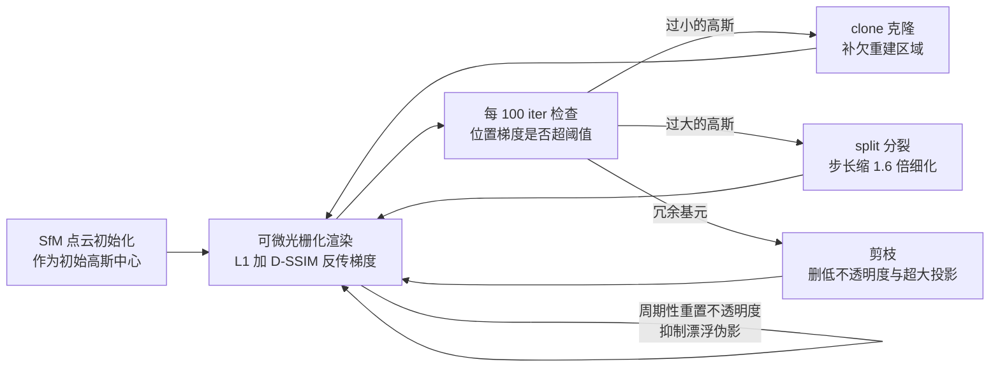
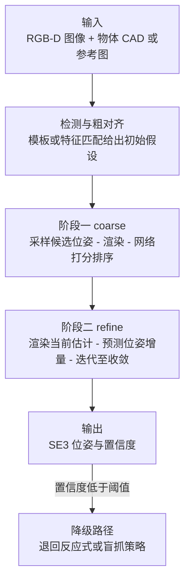

> **系列导航**：前两篇解决了"动得了"的问题，本篇解决"看得见、摸得着"。感知是 VLA 模型输入端的最后一公里：观测表示选得不好，再强的策略也白搭。本篇按"传感器 → 视觉几何 → 3D 表征 → 物体位姿 → 触觉 → SLAM"推进。

## TL;DR

> **TL;DR 1｜机器人的眼睛不是分类器**：自动驾驶关心"那是什么车"，机器人关心"那个杯子在哪、口朝哪、我能从哪个角度抓"——**6-DoF 位姿与几何**才是核心输出。这决定了 PointNet/3DGS 等几何表征在具身智能中的地位远高于普通视觉任务。

> **TL;DR 2｜PointNet 的灵魂是一个对称函数**：点云是无序集合，网络必须对输入排列置换不变。PointNet 用共享 MLP + max-pooling 实现这一点：$f(\{x_1,...,x_n\}) = \gamma\left(\max_{i}\ h(x_i)\right)$，max 是天然对称的[1](https://arxiv.org/abs/1612.00593)。

> **TL;DR 3｜2024 年后感知栈正在被"基础模型化"**：深度估计有 Depth Anything[2](https://arxiv.org/abs/2401.10891)，位姿估计有 FoundationPose（零样本泛化到新物体）[3](https://arxiv.org/abs/2312.08344)，场景重建有 3DGS[4](https://arxiv.org/abs/2308.04079)。"自己训感知模型"的需求在下降，"把开源模型拼成可靠的观测管线"成为工程主战场。

> **TL;DR 4｜几条看似无关的技术共享同一个数学内核**：NeRF 与 3DGS 的渲染都是同一条 alpha-blending 方程 $C=\sum_i c_i\,\alpha_i\prod_{j<i}(1-\alpha_j)$——差别只在 $\alpha$ 由 MLP 隐式算还是由显式高斯解析算[7](https://arxiv.org/abs/2003.08934)[4](https://arxiv.org/abs/2308.04079)；SLAM 后端的本质是因子图上的最大后验（MAP）推断。看穿这层共性，感知栈就不再是一堆工具的罗列。

## 目录

- [1. 传感器矩阵：先认识你的输入](#1-传感器矩阵先认识你的输入)
- [2. 相机模型与标定：从针孔到 PnP](#2-相机模型与标定从针孔到-pnp)
  - [2.1 针孔投影与内参矩阵](#21-针孔投影与内参矩阵)
  - [2.2 外参变换与机器人坐标系链](#22-外参变换与机器人坐标系链)
  - [2.3 径向与切向畸变模型](#23-径向与切向畸变模型)
  - [2.4 标定：张正友方法与手眼标定](#24-标定张正友方法与手眼标定)
  - [2.5 PnP：从 2D-3D 对应解出位姿](#25-pnp从-2d-3d-对应解出位姿)
  - [2.6 代码：针孔投影与去畸变的 NumPy 实现](#26-代码针孔投影与去畸变的-numpy-实现)
- [3. 单目深度估计与基础模型化](#3-单目深度估计与基础模型化)
  - [3.1 相对深度与度量深度](#31-相对深度与度量深度)
  - [3.2 Depth Anything：结构与蒸馏](#32-depth-anything结构与蒸馏)
  - [3.3 机器人管线中的用法与四个坑](#33-机器人管线中的用法与四个坑)
- [4. 点云深度学习：PointNet 的数学骨架](#4-点云深度学习pointnet-的数学骨架)
  - [4.1 置换不变性为什么是硬约束](#41-置换不变性为什么是硬约束)
  - [4.2 对称函数定理与证明草图](#42-对称函数定理与证明草图)
  - [4.3 十行代码：max-pooling 作为对称函数](#43-十行代码max-pooling-作为对称函数)
  - [4.4 PointNet++：分层采样、分组与 Set Abstraction](#44-pointnet分层采样分组与-set-abstraction)
  - [4.5 后续骨干一瞥](#45-后续骨干一瞥)
- [5. 神经场景表示：NeRF 到 3DGS](#5-神经场景表示nerf-到-3dgs)
  - [5.1 NeRF：体渲染方程完整推导](#51-nerf体渲染方程完整推导)
  - [5.2 层次采样](#52-层次采样)
  - [5.3 3DGS：高斯参数化、splatting 与致密化循环](#53-3dgs高斯参数化splatting-与致密化循环)
  - [5.4 对比总表与机器人视角](#54-对比总表与机器人视角)
- [6. 物体级感知：6-DoF 位姿估计](#6-物体级感知6-dof-位姿估计)
  - [6.1 问题定义与旋转表示陷阱](#61-问题定义与旋转表示陷阱)
  - [6.2 MegaPose：Render and Compare 两阶段](#62-megaposerender-and-compare-两阶段)
  - [6.3 FoundationPose：双模式统一框架](#63-foundationpose双模式统一框架)
  - [6.4 失败模式与工程降级](#64-失败模式与工程降级)
- [7. 触觉：被低估的第三只眼](#7-触觉被低估的第三只眼)
  - [7.1 三种代表性传感器的成像原理](#71-三种代表性传感器的成像原理)
  - [7.2 参数对比与选型](#72-参数对比与选型)
  - [7.3 视触融合与数据荒地](#73-视触融合与数据荒地)
- [8. SLAM 最小知识包](#8-slam-最小知识包)
  - [8.1 前端：特征法与直接法](#81-前端特征法与直接法)
  - [8.2 后端：滤波与图优化](#82-后端滤波与图优化)
  - [8.3 回环检测与因子图最小例子](#83-回环检测与因子图最小例子)
  - [8.4 视觉惯性与 LiDAR 里程计](#84-视觉惯性与-lidar-里程计)
  - [8.5 地图表示与务实建议](#85-地图表示与务实建议)
- [Lab Exercises](#lab-exercises)
- [参考文献与延伸阅读](#参考文献与延伸阅读)

## 1. 传感器矩阵：先认识你的输入

| 传感器 | 输出 | 优点 | 缺点 | 典型用途 |
|--------|------|------|------|---------|
| RGB 相机 | 图像 | 便宜、语义丰富 | 无深度 | 场景理解、VLA 输入 |
| RGB-D（RealSense 等） | 彩色+深度 | 米级精度深度 | 反光/透明面失效 | 抓取位姿、避障 |
| LiDAR | 点云 | 远距、精确 | 贵、无颜色 | 移动机器人/车 |
| IMU | 加速度+角速度 | 高频（kHz）、便宜 | 漂移 | 本体状态估计 |
| 关节编码器/力矩 | $q,\tau$ | 直接本体感知 | — | 运动控制必备 |
| F/T 传感器 | 六维力/力矩 | 接触事件检测 | 贵、易漂移 | 装配、打磨 |
| 视触觉（GelSight/DIGIT） | 接触面高分辨率图像 | 亚毫米纹理感知 | 标定复杂 | 灵巧操作 |

**本体感觉（proprioception）vs 外部感受（exteroception）**的划分贯穿全领域：第 02 篇 locomotion 只用前者即可盲走；操作任务两者都要。

工程上还有三个选型维度值得写进设计文档：

1. **频率与延迟**：IMU 200 Hz–1 kHz、F/T 约 1 kHz、RGB-D 30–90 fps、触觉 30–60 fps。高频通道喂状态估计器（VIO/WBC），低频通道喂语义模型——错配会把控制环路拖垮；
2. **同步**：多传感器必须硬件触发或统一时钟（PTP）。"RGB-D 与机械臂 TF 时间戳没对齐"造成的厘米级鬼影，是最常见的隐形 bug；
3. **失效模式互补**：RGB-D 怕反光和透明，LiDAR 怕玻璃（直接穿透），触觉只在接触后有效。可靠系统靠冗余通道交叉校验，而不是押注单一传感器。

## 2. 相机模型与标定：从针孔到 PnP

这一节是所有视觉感知的地基：**投影（3D→2D）与其逆问题的可控子集（PnP）**。后面每一节——单目深度对齐、位姿估计、SLAM 前端——都要反复用到这里的公式。

### 2.1 针孔投影与内参矩阵

针孔模型的物理图像：三维点 $(X_c,Y_c,Z_c)$ 沿穿过光心的直线成像在焦平面上，由相似三角形得 $x=fX_c/Z_c,\ y=fY_c/Z_c$。再考虑两个工程事实——感光单元不是正方形（焦距换算成像素要除以单元边长）、光轴不一定过图像中心——就得到完整的针孔投影：

$$
s \begin{bmatrix} u \\ v \\ 1 \end{bmatrix} = K \begin{bmatrix} R | t \end{bmatrix} \begin{bmatrix} X_w \\ Y_w \\ Z_w \end{bmatrix}, \qquad K = \begin{bmatrix} f_x & 0 & c_x \\ 0 & f_y & c_y \\ 0 & 0 & 1 \end{bmatrix}
$$

各参数的物理含义：

- $f_x=f/s_x,\ f_y=f/s_y$：物理焦距 $f$ 除以感光单元宽/高 $s_x,s_y$，单位是**像素**；多数镜头 $f_x\approx f_y$；
- $(c_x,c_y)$：主点，光轴与像平面交点的像素坐标，理想情况下约为图像宽高的一半；
- 左侧的 $s$ 即 $Z_c$：齐次坐标写法的意义在于把"除以深度"这一非线性操作吸收进尺度因子，使投影可以写成矩阵乘法。

注意 $K$ 是**相机自身的属性**（换镜头会变），与机器人放在哪里无关；它由标定一次性求出。

### 2.2 外参变换与机器人坐标系链

$[R|t]$ 把世界系点搬到相机系：$X_c = R_{cw}X_w + t_{cw}$，等价于刚体变换 $T_{cw}\in SE(3)$。机器人系统的特殊之处在于坐标系不止两个，而是一条**链**：

```text
world ──T_wb── base ──T_bf── flange ──T_fc── camera ──K,[R|t]── pixel
                    └─ T_bg gripper ─┘        └── T_co object ──┘
```

- $T_{bf}$（法兰位姿）由关节编码器经正运动学实时给出（第 01 篇的 DH 链）；
- $T_{fc}$ 就是**手眼标定**要求的外参（见 2.4），装配后固定不变；
- 目标位姿 $T_{co}$ 由位姿估计模块给出（第 6 节）。

任何一步的毫米级误差都会沿链传递叠加。**90% 的"抓不准"最终查出来都是外参或手眼标定的毫米级偏差**——这句话值得贴在实验室墙上。

### 2.3 径向与切向畸变模型

针孔模型假设光线直线传播，真实镜头会弯曲光线。OpenCV 约定的 Brown-Conrady 模型在**归一化坐标**$(x,y)$（即除以 $Z$ 之后、乘 $K$ 之前）上加非线性项：

$$
\begin{aligned}
x_d &= x\,(1 + k_1 r^2 + k_2 r^4 + k_3 r^6) + 2p_1xy + p_2(r^2+2x^2) \\
y_d &= y\,(1 + k_1 r^2 + k_2 r^4 + k_3 r^6) + p_1(r^2+2y^2) + 2p_2xy
\end{aligned}
\qquad r^2 = x^2+y^2
$$

- **径向项** $k_1,k_2,k_3$：透镜曲面引起的桶形/枕形弯曲，沿 $r$ 偶函数，是主导项；
- **切向项** $p_1,p_2$：组装时透镜与传感器不完全平行引起的"薄棱镜"偏移，量级通常小得多；
- 广角/鱼眼镜头（超过 120° 视场角）此模型发散，需换等距投影模型（OpenCV 的 fisheye 模块），机器人常用的 RealSense 属普通模型。

关键不对称性：**加畸变容易（正向多项式），去畸变难（多项式无闭式逆）**。实践中用不动点迭代数值求逆（2.6 的代码），OpenCV 则预计算查表 `initUndistortRectifyMap` 一次生成、逐帧查表。整条流水线的标准顺序是：**先去畸变，再做任何几何计算**。

### 2.4 标定：张正友方法与手眼标定

**内参与相机畸变**用张正友平面标定法[22]：打印一张棋盘格，从 ≥2 个（工程上拍 15–20 个姿态覆盖全画幅）不同角度拍摄，每个视角给出单应矩阵 $H = K\,[r_1\ r_2\ t]$；多个 $H$ 联立线性解出 $K$ 初值，再非线性精化 $K$ 与畸变系数（最小化重投影误差）。OpenCV `calibrateCamera` 一行搞定，产出 $K$、畸变向量和每张图的重投影 RMS——**RMS > 0.5 px 就该重拍**。

**手眼标定**是机器人特有的第二步：求法兰系到相机系的固定变换 $X$。以 eye-in-hand（相机装手上）为例，设标定板静止于世界系，机械臂在位姿 $i,j$ 各观测一次：

$$
\underbrace{T_{wf_j}^{-1}T_{wf_i}}_{A:\ 法兰相对运动} \cdot X = X \cdot \underbrace{T_{cb_i}T_{cb_j}^{-1}}_{B:\ 相机相对运动}
$$

左边由正运动学已知，右边由每次观测棋盘格的 $[R|t]$ 已知——这是一个经典的 $AX=XB$ 方程，可用 Tsai-Lenz 等闭式方法解旋转再解平移[23]，OpenCV `calibrateHandEye` 提供 API。eye-to-hand（相机固定在外部）只是 $X$ 挪到等式另一侧的同构问题。经验做法：采集 10 组以上大角度差异的运动对，解完后再用一次完整"识别-投影-比对"闭环验收。

### 2.5 PnP：从 2D-3D 对应解出位姿

Perspective-n-Point 是投影的"半逆问题"：已知 $n$ 个物体的 3D 点 $P_i$ 及其在图像上的投影 $u_i$，求 $[R|t]$ 使投影复原 $u_i$：

$$
[R^*,t^*] = \arg\min_{R,t} \sum_{i=1}^{n} \left\| u_i - \pi\big(K(RP_i+t)\big) \right\|^2, \quad \pi([X_c,Y_c,Z_c]) = \left[\frac{f_xX_c}{Z_c}+c_x,\ \frac{f_yY_c}{Z_c}+c_y\right]
$$

三个层次的理解：

1. **最小解 P3P**：恰好 3 个点即可约束出至多 4 组解（三角形在锥面上的多义性），需第 4 个点消歧——这是"最少信息量"的理论底线；
2. **线性解 DLT/EPnP**：把 $[R|t]$ 的 12 个元素当未知数线性化（DLT），或 EPnP 用 4 个虚拟控制点的加权和表达全部 3D 点，把复杂度降到 $O(n)$[24]；
3. **实践配方**：对应点带野值时套 RANSAC——随机抽 4 点解 P3P 统计内点数，再用全体内点跑非线性精化（Levenberg-Marquardt）。OpenCV `solvePnPRansac` 即此配方。

PnP 在本篇后面出现两次：SLAM 前端用它把匹配到的地图点变成帧间位姿（8.1），位姿估计流水线用它把 3D 物体模型对齐到 2D 检测框（第 6 节）。它是"几何感知"里出场率最高的单一算法。

### 2.6 代码：针孔投影与去畸变的 NumPy 实现

下面 40 行实现完整链路：世界系点 → 相机系 → 归一化平面 → 加畸变 → 像素，以及数值去畸变（不动点迭代），并验证往返一致性。

```python
"""针孔投影 + Brown-Conrady 畸变的最小实现（纯 NumPy）"""
import numpy as np

def distort(x_n, y_n, d):
    """归一化坐标加畸变：d = [k1, k2, p1, p2, k3]"""
    k1, k2, p1, p2, k3 = d
    r2 = x_n**2 + y_n**2
    radial = 1 + k1*r2 + k2*r2**2 + k3*r2**3      # 径向三项
    xd = x_n*radial + 2*p1*x_n*y_n + p2*(r2 + 2*x_n**2)
    yd = y_n*radial + p1*(r2 + 2*y_n**2) + 2*p2*x_n*y_n
    return xd, yd

def project(X_w, R, t, K, d):
    """世界系 3D 点 -> 含畸变像素坐标"""
    X_c = R @ X_w + t                              # 外参：世界系 -> 相机系
    x_n, y_n = X_c[..., 0]/X_c[..., 2], X_c[..., 1]/X_c[..., 2]  # 除深
    xd, yd = distort(x_n, y_n, d)
    return K[0, 0]*xd + K[0, 2], K[1, 1]*yd + K[1, 2]   # 内参升维

def undistort(x_d, y_d, d, iters=15):
    """数值求逆：不动点迭代（畸变多项式无闭式逆）"""
    x, y = x_d.copy(), y_d.copy()
    for _ in range(iters):
        xt, yt = distort(x, y, d)
        x += x_d - xt                              # 逐步抵消残差
        y += y_d - yt
    return x, y

if __name__ == "__main__":
    K = np.array([[600., 0, 320], [0, 590., 240], [0, 0, 1]])
    d  = [-0.3, 0.1, 1e-4, -5e-5, 0.0]             # 典型广角畸变量级
    R = np.eye(3); t = np.array([0.1, 0.05, 2.0])  # 相机前方 2 m 的点
    X_w = np.array([0.2, -0.1, 0.5])
    u, v = project(X_w, R, t, K, d)                # 世界系 -> 像素，含畸变
    xd = np.array([(u - K[0, 2])/K[0, 0],          # 由像素反推有畸变归一化坐标
                   (v - K[1, 2])/K[1, 1]])
    X_c = R @ X_w + t
    x_true = X_c[:2] / X_c[2]                      # 解析真值：无畸变归一化坐标
    x_rec = np.array(undistort(*xd, d))            # 数值去畸变
    print(f"pixel = ({u:.2f}, {v:.2f})")           # 投影像素
    print(f"undistort err = {np.abs(x_rec - x_true).max():.2e}")  # ~1e-9 收敛
```

变量映射表（公式 ↔ 代码 ↔ Shape）：

| 符号 | 代码变量 | Shape | 说明 |
|---:|:---|:---:|:---|
| $X_w$ | `X_w` | `(3,)` | 世界系点 |
| $R_{cw},t_{cw}$ | `R, t` | `(3,3)/(3,)` | 世界系到相机系的刚体变换 |
| $K$ | `K` | `(3,3)` | 内参矩阵 |
| $k_1..k_3,p_1,p_2$ | `d` | `(5,)` | 畸变系数（OpenCV 顺序） |
| $(x,y),(x_d,y_d)$ | `x_n,y_n / xd,yd` | 标量 | 归一化平面上的无畸变/有畸变坐标 |
| $(u,v)$ | `u, v` | 标量 | 像素坐标 |

## 3. 单目深度估计与基础模型化

### 3.1 相对深度与度量深度

双目立体匹配与 ToF 是"硬件深度"；单目深度估计是"学出来的深度"。它的根本困难在于：单张 RGB 的深度在数学上是病态的（同一张图可以缩小物体+拉远相机得到），因此模型学到的是**先验**（透视线索、遮挡关系、常见物件的尺寸统计）。这引出一个关键区分：

- **相对深度**：只关心"谁近谁远"，输出定义为仿射不变的量——存在未知的 $a>0,b$ 使得 $\hat d = a\cdot d + b$；
- **度量深度**：输出以米为单位，可直接进几何管线。难度高一个数量级，因为必须恢复出被病态性吞掉的尺度。

MiDaS 用跨 12 个数据集的混合训练 + 鲁棒损失首次实现零样本跨域相对深度，是这个方向的分水岭[5]。度量路线的代表 Metric3D 则发现：把训练数据统一到一个**规范相机**（canonical camera）内参下，再在推理时用真实内外参变换回去，可以让单一模型跨相机输出度量深度[11]。

### 3.2 Depth Anything：结构与蒸馏

Depth Anything 系列把"相对深度"推成了基础设施[2][10]。其技术内核有三条：

1. **大教师**：先用约 150 万张标注图训练一个大容量 ViT 教师（backbone 沿用 DINOv2 预训练权重——自监督视觉特征对密集预测的迁移性已被反复验证）；
2. **伪标签扩数据**：用教师在约 6200 万张无标注图上打伪标签，把训练池扩大 40 余倍——核心信念是**数据规模的多样性比标注精度更能买来泛化**；
3. **学生蒸馏加难**：训练学生时对无标注图施加强扰动（色彩/空间增广），迫使学生在"更难的题"上向教师看齐，而不是死记伪标签。V2 进一步用合成数据+精选高质量标注重造教师，再用同样的蒸馏管线压出 25M 到 1.3B 的全系学生，小模型也能实时跑[10]。

输出头是一个 DPT 风格的多层解码器，把 ViT 各层 token 融合成深度图；损失在相对深度空间（仿射不变对齐后的 scale-and-shift 不变性损失）计算，这也是它输出不带绝对尺度的原因。

### 3.3 机器人管线中的用法与四个坑

**正确用法**是把它当作"免费的稠密几何先验"：(a) 给 VLA 策略增加一路深度 token；(b) 与稀疏真值融合——用 RealSense 或激光测距取 20 个左右稀疏点，RANSAC 拟合 $\hat d \mapsto s\hat d + t$（甚至仅 scale）完成尺度对齐后再入 TSDF/八叉树；(c) 数据增广：给纯 RGB 数据集批量"脑补"深度通道。

四个必踩的坑：

1. **尺度歧义不是 bug 而是定义**：仿射不变输出意味着"绝对距离"信息本来就不在里面，不做对齐直接拿去规划等于用错误的米尺量地；
2. **边缘羽化**：物体轮廓处深度被平滑过渡，紧贴着抓取会在边缘处误判间隙；
3. **时序不一致**：逐帧独立推理，静态场景相邻帧深度会轻微抖动，闭环控制需要时序滤波；
4. **材质失效继承自 RGB-D 同源问题**：反光、透明物体在输入图像里就没有可信外观，模型只会自信地编一个深度。

一句话定位：**单目深度模型是"更好的猜测"，不是"测量"**。凡是需要毫米级几何的操作环节，最终仍要回到 RGB-D、LiDAR 或触觉。

## 4. 点云深度学习：PointNet 的数学骨架

### 4.1 置换不变性为什么是硬约束

点云 $\{x_i\}_{i=1}^N$ 是集合而非序列：同一桌子的扫描换个扫描顺序，物理上是同一个东西。因此要求：

$$
f(\{x_{1},...,x_{n}\}) \equiv f(\{x_{\pi(1)},...,x_{\pi(n)}\}),\quad \forall \pi \in S_n
$$

这不是风格偏好而是正确性问题——若把点序号当输入维度，网络会学到与扫描顺序相关的虚假特征。朴素方案有三种：把点云排成规范顺序（高维排序不稳定）、数据增广（只能软性鼓励不变）、或**设计天然对称的结构**。PointNet 选了第三条路：逐点共享 MLP 提特征 $h(x_i)$，再用对称函数 max 聚合：

$$
f(S) = \gamma\left( \max_{x_i \in S} \, h(x_i) \right)
$$

对称性的证明只需一行：集合 $\pi S$ 经过 $h$ 映射后得到的**多重集** $\{h(x):\ x\in\pi S\}$ 与 $\{h(x):\ x\in S\}$ 完全相同（$h$ 对所有点共享同一组权重），而 max 只依赖多重集本身，于是 $f(\pi S)=f(S)$。max 逐维独立取最大，是 $\mathbb{R}^K\times\mathbb{R}^K\to\mathbb{R}^K$ 上最简单的非平凡对称函数族之一。

### 4.2 对称函数定理与证明草图

PointNet 的理论贡献不止于"这样是对的"，而是"这样做是**万能的**"[1]：

> **定理（普适逼近）**：设 $f:2^{\mathcal{X}}\to\mathbb{R}$ 是关于 Hausdorff 距离连续的集合函数（即 $d_H(S,S')\le\varepsilon \Rightarrow |f(S)-f(S')|$ 充分小），则对任意 $\varepsilon>0$，存在连续函数 $h:\mathcal{X}\to\mathbb{R}^K$ 与连续函数 $\gamma$，使得对所有有界点集 $S$ 有 $|f(S)-\gamma(\max_{x_i\in S} h(x_i))|<\varepsilon$。

**证明草图**（一句话版）：把输入空间切成细网格，构造 $h$ 把每一点映为一个近似 one-hot 的指示向量（标记它落在哪个格子），max 聚合后得到"$S$ 占据了哪些格子"的占用指纹；$\gamma$ 只需在这有限的占用模式集合上逼近 $f$——格子切得足够细，连续性保证误差任意小。**连续性一句话**：两个集合 Hausdorff 距离近，则它们的格子占用模式只在边界格子上有差异，max 输出的变化就被限制住了。

两个重要推论：

- **瓶颈维度 $K$ 决定表达能力上限**：$\max_i h(x_i)\in\mathbb{R}^K$ 是全网的唯一信息瓶颈，$K$ 太小时可区分的模式数不够——原文实验中把 $K$ 从 1024 降到 64，分类精度显著下滑；
- **临界点集合**：对每个输出维度，max 只被少数几个点决定（这些点是"临界点"），网络实际上在做"寻找关键几何证据"，这与人类直觉一致（判断"这是个杯子"主要看把手和开口那几个局部）。

原文还配有 T-Net：一个预测 $3\times3$ 仿射阵的小网络对输入点云做空间对齐，属于工程增强而非理论必需。

### 4.3 十行代码：max-pooling 作为对称函数

下面的最小演示验证两件事：(1) 共享 MLP + max 的输出严格置换不变；(2) max 读出的是"存在性"（OR 逻辑），而同样对称的 mean 读出的是"密度"——后者无法承担定理要求的通用逼近角色。

```python
import numpy as np

def shared_mlp(P, W):                     # h(x)：同一份权重作用于每个点
    return np.maximum(P @ W, 0.0)         # ReLU

def pointnet_pool(H):                     # 对称聚合
    return H.max(axis=0), H.mean(axis=0)  # (max_feat, mean_feat)

rng = np.random.default_rng(0)
W = rng.normal(scale=2.0, size=(3, 8))
S = rng.uniform(-1, 1, size=(64, 3))            # 64 个点的点云
perm = rng.permutation(64)

f_max, _ = pointnet_pool(shared_mlp(S, W))
g_max, _ = pointnet_pool(shared_mlp(S[perm], W))
print("permutation invariant:", np.allclose(f_max, g_max))     # True

bins = ((shared_mlp(S, W)[:, :8] > 0)).astype(float)            # 8 个"格子"
exist, dens = bins.max(axis=0), bins.mean(axis=0)               # 存在性 vs 密度
print("max reads existence :", exist[:4])   # 有点落进该格则为 1
print("mean reads density   :", np.round(dens[:4], 3))          # 随点数稀释
```

变量映射与原文记号的对应：

| 符号 | 代码 | Shape | 备注 |
|---:|:---|:---:|:---|
| $S$ | `S` / `S[perm]` | `(64,3)` | 打乱后物理意义不变 |
| $h$ | `shared_mlp` | `(64,3)→(64,8)` | 权重共享是不变性的前提 |
| $\max_i h(x_i)$ | `.max(axis=0)` | `(8,)` | 对称函数本体 |
| 占用指纹 | `exist` | `(8,)` | 定理证明草图中的格子占用向量 |

### 4.4 PointNet++：分层采样、分组与 Set Abstraction

PointNet 的 max 把全部局部结构压扁——两只不同的手可能拥有相同的"点集指纹"。PointNet++ 把 CNN 的层次感受野思想搬回度量空间[6]，核心是三层循环结构 **Set Abstraction**：

1. **采样（Sampling）**：最远点采样 FPS——从任一点出发，每轮加入"距离已选集最远"的点，直到选出 $N'$ 个中心。贪心最大化最小间距，覆盖均匀、对密度不均鲁棒，且给定起点后确定性可复现（这点对机器人回归测试很重要）；
2. **分组（Grouping）**：以每个中心为球心做 ball query——取半径 $r$ 内至多 $K$ 个邻居。选球邻域而非 kNN 是刻意的：kNN 在稀疏区会被拉伸到很大的空间范围，而固定半径保证**局部几何的物理尺度一致**（同一只耳朵在不同扫描密度下学到的是同一块结构）；
3. **mini-PointNet**：组内邻居坐标（减去中心得到局部坐标）经共享 MLP 后 max-pool 成该中心的局部特征。

堆叠多层即得层次结构：点数 $N\to N/2\to N/4\dots$、特征维逐层上升、感受野逐层扩大——与 CNN 的金字塔完全同构。分类在顶层做全局池化接 FC；分割则需要 **feature propagation** 层按距离加权插值把特征传回稠密点集，并以跳连拼接浅层特征（U-Net 式）。

针对真实扫描的**非均匀密度**问题有两种补救：MSG 在每层同时用多个半径分组、拼接多尺度特征（训练时随机丢弃输入点模拟密度变化）；MRG 则根据局部密度在"高层聚合特征"与"浅层直接特征"之间加权取舍。

### 4.5 后续骨干一瞥

- **DGCNN**：把"邻域"从欧氏空间搬进特征空间，EdgeConv 对每条 kNN 边拼接 $(x_j-x_i, x_i)$ 学习边缘特征，图逐层动态重构[12]；
- **体素路线**：VoxelNet 把点云体素化后做稀疏 3D 卷积[13]，自动驾驶为了显存进一步压成柱状 BEV 表征（PointPillars 一系）；
- **具身视角**：操作任务的点云通常只有几千个近距点，不需要重型骨干——第 04 篇的 DP3 证明了用一个小 PointNet++ 风格编码器替换 Diffusion Policy 的图像编码器就能获得 3D 泛化红利[14]。**选型原则：几何先验越贴近任务（3D 对 3D），需要的模型和数据就越少。**

## 5. 神经场景表示：NeRF 到 3DGS

### 5.1 NeRF：体渲染方程完整推导

NeRF 把场景编码为一个连续函数 $F_\Theta:(x,d)\mapsto(c,\sigma)$：输入位置 $x\in\mathbb{R}^3$ 与视线方向 $d$，输出 RGB 颜色 $c$ 与体密度 $\sigma\ge0$[7]。两条结构性先验来自物理：$\sigma$ 只依赖位置（介质密度与观看方向无关），$c$ 依赖方向（镜面反射随视角变色）。MLP 直接吃低频坐标会有频谱偏差（学不出锐利细节），因此先把坐标经位置编码提升频率：

$$
\gamma(p) = \big(\sin(2^0\pi p),\cos(2^0\pi p),\ \dots,\ \sin(2^{L-1}\pi p),\cos(2^{L-1}\pi p)\big)
$$

**体渲染方程的推导**：对相机光心 $o$ 与方向 $d$，光线为 $r(t)=o+td$。设介质密度 $\sigma(t)$，则光线穿过微元 $[t,t+\mathrm{d}t]$ 被挡住的概率是 $\sigma(t)\mathrm{d}t$；令 $T(t)$ 为"存活到深度 $t$"（未被遮挡）的概率，微分方程 $\mathrm{d}T = -\sigma(t)T(t)\,\mathrm{d}t$ 解出：

$$
T(t) = \exp\!\Big(-\int_{t_n}^{t}\sigma(s)\,\mathrm{d}s\Big)
$$

期望颜色 = 每个微元的"存活概率 × 命中概率 × 发射颜色"沿深度积分：

$$
C(r) = \int_{t_n}^{t_f} T(t)\,\sigma\big(r(t)\big)\,c\big(r(t),d\big)\,\mathrm{d}t
$$

**积分离散化**：沿光线取 $N$ 个采样点，段长 $\delta_i = t_{i+1}-t_i$，段内 $\sigma$ 近似常数，则第 $i$ 段的"命中但不穿透"概率为

$$
\alpha_i = 1-\exp(-\sigma_i\delta_i)
$$

代入积分得离散合成式——这就是贯穿本节的 alpha blending：

$$
C = \sum_{i=1}^{N} c_i\,\alpha_i \prod_{j<i}(1-\alpha_j)
$$

权重 $w_i=\alpha_i\prod_{j<i}(1-\alpha_j)$ 非负且总和不超过 1（不透明处提前截断），构成深度 $t$ 上的一个分布——这个观察直接催生了 5.2 的采样策略，也给了 NeRF 免费的深度图输出。

训练即最小化渲染与真实像素的差：数据是多视角照片 + COLMAP 求得的位姿（又见第 2 节），对每张图随机采一批光线，损失为 $\sum_r \|C_{\text{pred}}(r)-C_{\text{gt}}(r)\|_2^2$。

### 5.2 层次采样

均匀采样浪费预算：大部分光线穿过大片空气。NeRF 用两级 MLP 做**重要性采样**：coarse 网络先在 $N_c$ 个均匀点上渲染，得到归一化权重 $\hat w_i$；把它当作 $t$ 上的经验分布（逆 CDF 变换）再采 $N_f$ 个点，交给 fine 网络；两个网络的渲染结果**一起**计入损失，保证 coarse 的采样分布也被正确学习。这套"渲染→按权重重点采样→再渲染"的循环，就是把 Monte Carlo 渲染中的 importance sampling 学成了网络的一部分。

### 5.3 3DGS：高斯参数化、splatting 与致密化循环

3D Gaussian Splatting 换掉了"MLP 隐式场"这块地基，保留了上面那条 alpha blending 方程[4]：

**参数化**：场景是数百万个各向异性 3D 高斯基元 $G_i$，每个由四组量描述——中心 $\mu_i\in\mathbb{R}^3$、协方差 $\Sigma_i$、不透明度 $o_i=\mathrm{sigmoid}(\cdot)$、球谐系数（低阶视角相关颜色，阶数随训练从 0 升到 3）。协方差必须保持半正定，直接回归矩阵不可控，于是分解为：

$$
\Sigma_i = R_i\, S_i\, S_i^\top R_i^\top
$$

其中 $S_i=\mathrm{diag}(\exp s)$（exp 保证正的半轴长）、$R_i$ 由**四元数**参数化（天然单位正交，避开旋转矩阵的约束优化）。各向异性椭球天然贴合表面的薄片状结构——这是它用极少基元达到高保真的关键。

**投影 splatting**：渲染时不做光线行进，而是把每个高斯"泼"到屏幕上。将世界协方差经视图旋转 $W$ 与透视投影的局部雅可比 $J$ 变换到 2D：

$$
J = \begin{bmatrix} f_x/Z & 0 & -f_x X/Z^2 \\ 0 & f_y/Z & -f_y Y/Z^2 \end{bmatrix}, \qquad \Sigma_i' = J W \Sigma_i W^\top J^\top
$$

像素处的响应即 2D 高斯积分：$\alpha_i = o_i \exp\big(-\tfrac12 (x-\mu_i')^\top \Sigma_i'^{-1}(x-\mu_i')\big)$。光栅化按 16×16 的 tile 组织：先按深度全局排序，再在每个 tile 内并行做前后向 alpha blending——**与 NeRF 离散渲染式逐项同构，只是 $\alpha$ 从 exp 采样变成了闭式高斯、求和顺序从沿光线变成了沿排序**。数学同构 + 硬件友好光栅化，共同换来训练几分钟、渲染 100+ FPS。

**优化循环**：初始化用 SfM 稀疏点云（又是第 2 节）；损失为 L1 + D-SSIM。真正独特的是**自适应密度控制**：



约 3 万次迭代收敛。整个循环的本质：**把"哪里需要更多基元"的决定交给渲染梯度的幅值**，而不是人工调网格——这是显式表示独有的自由度，也是它"可编辑"的来源（基元可以直接增删、搬动、绑定语义）。

顺带一提中间路线 Instant-NGP：多分辨率哈希编码把 NeRF 的训练压到秒级~分钟级[15]，说明"隐式 vs 显式"之外，**查询效率**本身就是一条独立的优化轴。

### 5.4 对比总表与机器人视角

| 维度 | NeRF[7](https://arxiv.org/abs/2003.08934) | 3DGS[4](https://arxiv.org/abs/2308.04079) |
|------|------|------|
| 场景表示 | 全局 MLP 隐式场 $(x,d)\to(c,\sigma)$ | 数百万显式各向异性高斯 |
| 求解 $\alpha$ | 光线上采样点逐一 MLP 前向 | 屏幕空间闭式高斯积分 |
| 训练时长 | 小时级（原始）；分钟级（Instant-NGP[15](https://arxiv.org/abs/2201.05989)） | 分钟级（单卡 30k iter） |
| 渲染速度 | 慢（原始版离线为主） | 快，实时 100+ FPS |
| 显式性 | 隐式，难以局部修改 | 完全显式，基元级可操作 |
| 可编辑性 | 弱（基本要重训） | 强（增删/搬动/接图形学管线） |
| 存储 | 一个 MLP（MB 级） | 百万级高斯（GB 级 ply） |
| 典型失效 | 细节糊、训练慢 | 漂浮伪影、镜面高光需高阶 SH、稀疏视角崩坏 |
| 机器人角色 | 高保真离线建模 | real2sim 主力与数字孪生 |

因为光栅化可微且并行，机器人领域立刻把它用于 **real2sim**：手机扫一圈桌子，得到可交互、可编辑的仿真背景资产（第 07 篇详述流水线）。再往前的想象空间：显式基元可被策略直接读写（移动某个高斯 = 改变世界状态），这让 3DGS 有潜力成为"可微分的场景记忆"而不只是背景板。

## 6. 物体级感知：6-DoF 位姿估计

### 6.1 问题定义与旋转表示陷阱

抓取一个物体 = 在相机系解出它的位姿 $T_{obj}\in SE(3)$，然后规划手到哪。$SE(3)$ 有 6 个自由度，但**怎么参数化这 6 个数是个陷阱**：

- 欧拉角：万向锁，两个轴对齐时丢失一个自由度；
- 四元数：回归目标是双覆盖的（$q$ 与 $-q$ 同一旋转），损失面上有天然的不连续，直接 MSE 回归会学到平均化的废结果；
- 旋转矩阵：9 个数回归出来不保证正交归一。

Zhou 等人给出了简洁的答案：回归 $SO(3)$ 的**前两列共 6 个数**，再 Gram-Schmidt 正交化补出第三列；他们从数学上证明了 $SO(3)$ 不存在连续的双射嵌入到低于 5 维的欧氏空间，所以 6D 是"连续可学"的最低维选择[16]。此后几乎所有学习式位姿/旋转输出都默认 6D 表示——这是"表示选择决定可学习性"的经典案例。

经典几何栈（检测框 → 点云配准 ICP → PnP）在已知物体+好特征时依然能打；学习方法的增量价值集中在**无纹理、无 CAD、杂乱遮挡**的开放世界——这正是下面两个工作的战场。

### 6.2 MegaPose：Render and Compare 两阶段

MegaPose 面向"全新物体 + 只有 CAD 模型（或几张参考图）"的零样本估姿[8]，流程分两阶段：

1. **Coarse（粗估）**：形状细化网络先把部分可见的观测补全成完整形状模型；然后在位姿空间采样数百个候选，逐一把 CAD 渲染成图像，与真实裁剪图一起送入打分网络比对排序，留下最优假设；
2. **Refine（精化）**：迭代执行"渲染当前位姿假设 → 卷积网络比对渲染图与真实图、预测位姿增量 $\Delta T$ → 更新假设"，数轮内收敛到亚厘米精度。

整个系统只在合成数据（大规模域随机化渲染）上训练，因此对真实新物体零样本泛化。Render & Compare 的哲学值得记住：**与其设计一个直接从图像回归位姿的黑箱，不如把"假设-验证"的循环做成可学习的模块**——验证比生成容易学得多。它已成为大量操作论文的标准前端。

### 6.3 FoundationPose：双模式统一框架

FoundationPose（NVIDIA，CVPR 2024 best paper candidate）把问题再推进一步：同一个框架同时支持两种输入条件[3]：

- **Model-based（有 CAD）**：用 CAD 渲染大量带位姿标签的合成图像，训练一个**神经对象编码**（neural object encoding）——把"这个特定物体的外观"压缩成特征场；
- **Model-free（无 CAD）**：先从几秒钟的物体多视角参考视频中重建出该物体的神经表征，再据此合成伪渲染，进入与 model-based 完全相同的下游流程。

下游统一为估计与跟踪两个分支：估计分支在位姿假设空间做 render & compare（transformer 结构的比对网络）；跟踪分支额外引入运动先验（上一帧速度模型）做初始化，把搜索范围收窄到增量空间，从而做到实时视频级 6-DoF 跟踪。开源代码（GitHub: `NVlabs/FoundationPose`，未本地验证）让它迅速成为具身实验室的默认位姿后端。

### 6.4 失败模式与工程降级



位姿估计在反光金属袋、透明玻璃杯、堆叠杂乱场景依然会翻车（失效机理与 RGB-D 同源：外观证据本身不可信）。成熟系统都带"位姿不可信→退回反应式策略"的降级逻辑：置信度阈值 + 时序一致性检验 + 力觉旁证（夹爪闭合时力曲线异常即放弃本次位姿假设）。**感知模块的价值不在于永不失败，而在于知道自己什么时候失败了。**

## 7. 触觉：被低估的第三只眼

人类抓鸡蛋靠的不是视觉而是指尖力学反馈。视触觉传感器的思路是把"接触"变成"图像"，让 CV 的整套工具箱（卷积、预训练、扩散模型）直接迁移到触觉。

### 7.1 三种代表性传感器的成像原理

- **GelSight 系**：弹性凝胶背面覆反光膜，内置多色 LED 从不同方向照明；接触时凝胶表面变形，反光图样随之变化，用**光度立体**类算法从明暗恢复接触面的法向场与深度图——分辨率可达微米级，能看清指纹纹理（官网 gelsight.com）；
- **DIGIT**（Meta 开源）：为规模化研究重新设计的紧凑方案——单相机 + 凝胶 + 环形照明，输出 160×120 RGB 视频（60 fps），物料成本约 15 美元（论文口径），软硬件全套开源，是 in-hand 操作论文里的常客[17]；
- **AnySkin**（Meta, 2024）：瞄准量产运维痛点——胶皮磨损不可避免，那就把**胶皮做成可即插即换的标准化模块**，配合自监督预训练表征，让换上去的新皮肤无需重新标定、旧模型直接可用[9]。

三者是同一条技术路线（光学式触觉成像）在不同约束下的三次产品化：GelSight 追极限分辨率，DIGIT 追低成本标准化，AnySkin 追可维护性。

### 7.2 参数对比与选型

| 维度 | GelSight 系 | DIGIT[17](https://arxiv.org/abs/2005.14679) | AnySkin[9](https://arxiv.org/abs/2409.08276) |
|------|------|------|------|
| 成像原理 | 反光膜 + 多色 LED 光度立体 | 单相机 + 环形 LED + 凝胶 | 标准化光学腔 + 可换胶皮 |
| 输出形态 | 法向/深度图（微米级细节） | 160×120 RGB 视频 | 触觉信号 + 自监督嵌入 |
| 成本量级 | 中高（商用成品） | 低（BOM 约 15 美元，论文口径） | 低（可自制，胶皮耗材化） |
| 胶皮可换 | 否（整体标定绑定） | 否 | 是（即插即用为核心卖点） |
| 生态 | 商业成熟、学术广泛 | Meta 全栈开源 | 2024 开源、生态起步 |
| 代表用途 | 纹理/滑动检测、精密装配 | in-hand 操作大规模实验 | 长时操作、量产部署 |

（表中数字为公开资料口径的约值，采购前请以厂商最新规格为准。）选型逻辑与相机器材一致：**分辨率、成本、可维护性三角**——实验室原型选 DIGIT/AnySkin，追求亚毫米工艺选 GelSight。

### 7.3 视触融合与数据荒地

视触融合目前有三条清晰的作业面：

1. **表征层**：Sparsh 用掩码自编码等自监督目标在多传感器触觉数据上预训练统一编码器，下游力估计、滑动检测、抓取成功预测只需轻量微调[18]——相当于触觉界的"自监督底座"尝试；
2. **控制层**：DIGIT 论文演示的 in-hand 重定向、AnySkin 演示的插销任务，都是"视觉粗对准 + 触觉闭环修正"的分工范式——视觉管"在哪"，触觉管"接触瞬间发生了什么"；
3. **数据层**：触觉-视觉-语言对齐数据集开始出现，但规模与 ImageNet 相差几个数量级，跨传感器（不同厂商、不同胶皮批次）的数据鸿沟刚刚被 AnySkin 这类工作正视。

触觉数据目前没有 ImageNet 级别的公开生态，是公认的数据荒地——也是差异化研究的机会窗口。

## 8. SLAM 最小知识包

机器人导航需要回答"我在哪"（定位）+"世界长什么样"（建图），两者耦合求解即为 SLAM。它本质上是一个**在线状态估计问题**：状态是全部历史位姿+地图，观测是各传感器数据。理解 SLAM 只需要抓住"前端提观测、后端管一致性"这条分工。

### 8.1 前端：特征法与直接法

前端（视觉里程计）负责从相邻帧提取运动增量，两大流派：

- **特征法**：每帧提取 ORB 等局部特征并计算描述子 → 跨帧匹配 → 对极几何恢复相对位姿 → 三角化出新地图点 → PnP（2.5 节）求当前帧位姿。优点是对光照变化鲁棒、可利用成熟匹配算法；代价是计算量大、弱纹理场景特征稀缺。代表作 ORB-SLAM3：视觉/视觉惯性/多地图一体，精度与工程完成度的标杆[19]；
- **直接法**：跳过特征，直接最小化**光度误差** $\min_T \sum_p \rho\big(I_{\text{ref}}(\pi(Tp)) - I_{\text{cur}}(\pi(p))\big)$，依据灰度不变假设在像素灰度上对位姿求导（半稠密版本选取梯度显著的像素子集）。优点是省去特征提取、弱纹理也有梯度可用；缺点是对光照变化和曝光失真敏感。

两者不是敌我关系：主流系统常用直接法跟踪 + 特征法回环的混搭。

### 8.2 后端：滤波与图优化

前端给出的增量位姿带着噪声，后端负责把它们融成全局一致的轨迹与地图。历史上有两条路线：

| 维度 | 滤波（EKF 系） | 图优化（现代主流） |
|------|------|------|
| 状态 | 当前位姿与地图的联合高斯分布 | 全部关键帧位姿 + 路标的批量表 |
| 求解方式 | 递归"预测-更新" | 批量非线性最小二乘（LM 等迭代求解） |
| 复杂度 | 协方差随地图点平方增长，须边缘化技巧 | 利用稀疏结构的稀疏 Cholesky，可增量求解（iSAM2） |
| 回环 | 全局修正困难 | 天然支持：回环只是一条额外的边 |
| 代表 | EKF-SLAM、MSCKF | g2o、GTSAM、Ceres |

趋势一句话：**滤波把不确定性压缩进当前时刻，图优化把不确定性摊在整个历史上**——计算存储便宜之后，后者全面胜出。

### 8.3 回环检测与因子图最小例子

里程计噪声积分造成漂移，量级随时间按随机游走增长（约 $\sqrt{t}$）。**回环检测**负责认出"我回到了来过的地方"，从而注入一条强约束把累积漂移拉回来；视觉方案的主流是词袋 BoW：把描述子量化成"视觉单词"倒排索引投票找相似帧，再用几何验证（RANSAC + PnP）确认。

后端的数学载体是**因子图**：节点是待估变量（位姿、路标），边是观测因子（里程计、回环、地标观测），MAP 估计即最小化所有因子的加权残差：

$$
X^* = \arg\min_X \sum_k \big\| r_k\big(X\big) \big\|^2_{\Sigma_k}
$$

一个三帧的最小例子足以看清回环的作用：机器人沿直线走，里程计报出 $x_2-x_1\approx1.0$、$x_3-x_2\approx1.0$，回环检测认定 $x_3$ 与 $x_1$ 是同一地点附近，给出 $x_3-x_1\approx2.2$（比里程计累积的 2.0 多了 0.2 的矛盾）。取等权最小二乘（固定 $x_1=0$ 作规范）：

$$
\min_{x_2,x_3}\ \big(x_2-1.0\big)^2 + \big(x_3-x_2-1.0\big)^2 + \big(x_3-2.2\big)^2
$$

令两个偏导为零得 $2x_2=x_3$ 与 $2x_3-x_2=3.2$，解出 $x_2\approx1.067,\ x_3\approx2.133$。注意 $x_2$ 被修正了 **+0.067**——尽管它自己的里程计观测毫无问题：回环矛盾被因子图按信息权重**反向分摊到了整条轨迹**上，这正是"全局一致性"的含义。真实系统里因子还带各自的信息矩阵 $\Sigma_k^{-1}$，权重自动偏向更可信的传感器。

### 8.4 视觉惯性与 LiDAR 里程计

纯视觉在快速运动、运动模糊、瞬时无纹理时会跟丢，标准补丁是融合 IMU（kHz 高频、短时精确、长时漂移）：

- **VINS-Mono**：滑窗 VIO + 回环 + 重定位的单目惯性全套方案，IMU 预积分把两帧间的上百个 IMU 读数压缩成一个相对运动约束[20]；
- **ORB-SLAM3**：视觉惯性 tightly-coupled + 多地图系统，跟踪丢失后可在新建子图中继续，回环时合并[19]；
- LiDAR 一侧是 LOAM 家族的激光惯性里程计（如 LIO-SAM，GitHub: `TixiaoShan/LIO-SAM`，未本地验证），室内外导航机器人的主力；
- 研究前沿还有端到端深度 SLAM：DROID-SLAM 用循环网络迭代更新光流与位姿，鲁棒性出色但吃 GPU，多见于研究而非产线[21]。

### 8.5 地图表示与务实建议

| 概块 | 内容 | 你需要的程度 |
|------|------|-------------|
| 前端里程计 | 帧间特征匹配/PnP/ICP 给增量位姿 | 会调 ORB-SLAM3/LIO-SAM 即可 |
| 后端优化 | 因子图平滑全局轨迹（g2o/GTSAM） | 知道回环检测为何能消漂移 |
| 地图表示 | 占据栅格/TSDF/ESDF/点云 | 导航规划用 ESDF，操作用 TSDF |
| 视觉惯性 | VIO 融合 IMU 补帧间快速运动 | 知道纯视觉会糊就行 |

诚实的建议：除非立志做移动机器人方向，**不要陷进 SLAM 工程深水区**。具身智能研究者只需要：会用现成 SLAM 输出的轨迹和地图，理解其误差量级（厘米级漂移），并把不确定性传给下游规划——比如把位姿协方差作为规划器的碰撞膨胀余量。推荐系统学习路径见高翔《视觉 SLAM 十四讲》（第二版，电子工业出版社）——中文社区公认的入门标准教材。

## Lab Exercises

1. **PointNet 手搓体验**：安装 Open3D（`pip install open3d`），下载 ModelNet10 子集，跑通官方 PointNet PyTorch 最小实现（约 200 行），然后做三个破坏性实验：测试时随机打乱点序，验证精度不变；再把 `torch.max` 换成 `torch.mean`，对比 ModelNet40 精度变化并解释；最后扫描全局特征维度 $K\in\{2,4,8,16,64,256\}$ 画精度曲线，对应 4.2 节"瓶颈维度决定表达能力"的论断。
2. **Depth Anything 尺度对齐实验**：用 Depth Anything V2 开源权重（HuggingFace: `depth-anything` 系列，未本地验证）对一张室内照片推相对深度，再用 RealSense 采 20 个稀疏真值点做 RANSAC 线性尺度回归，报告绝对相对误差的改善幅度，评价指标 $\mathrm{AbsRel}=\frac{1}{M}\sum_i \frac{|d_i-d_i^*|}{d_i^*}$；额外记录去掉最差 2 个对齐点后指标的变化，体会 RANSAC 的必要性。
3. **标定-投影闭环实验**：打印棋盘格标定你的 webcam（OpenCV `calibrateCamera`，验收线：重投影 RMS 小于 0.5 px）；用 2.6 节代码把桌面上一个已知 3D 点投回图像，手动核对像素误差小于 2 px；然后把外参平移人为扰动 5 mm，重新投影并估算该像素偏移在工作距离上对应多少厘米的实际偏差——写一段"为什么 90% 的抓不准是标定问题"的复盘笔记。
4. **因子图玩具求解**：用 NumPy 手写 8.3 节的三帧最小例子（高斯-牛顿 3 次迭代即可），把回环观测从 2.2 扫到 2.0，画出 $x_2,x_3$ 的解随之变化的曲线；再给里程计因子 10 倍权重重跑，观察修正量的分配如何改变。
5. **FoundationPose 上手**：按官方仓库 README 准备 YCB-V 数据或自拍视频，对一个新物体跑 zero-shot 位姿跟踪，故意用反光材质物体复现失败案例，记录置信度曲线——体会"什么时候该降级到盲抓"。

## 参考文献与延伸阅读

**核心论文（arXiv ID 均经 API 核实）**

- [1] Qi et al., *PointNet: Deep Learning on Point Sets for 3D Classification and Segmentation*. [arXiv:1612.00593](https://arxiv.org/abs/1612.00593)
- [2] Yang et al., *Depth Anything: Unleashing the Power of Large-Scale Unlabeled Data*. [arXiv:2401.10891](https://arxiv.org/abs/2401.10891)
- [3] Wen et al., *FoundationPose: Unified 6D Pose Estimation and Tracking of Novel Objects*. [arXiv:2312.08344](https://arxiv.org/abs/2312.08344)
- [4] Kerbl et al., *3D Gaussian Splatting for Real-Time Radiance Field Rendering*, SIGGRAPH 2023 最佳论文. [arXiv:2308.04079](https://arxiv.org/abs/2308.04079)；官方项目页 `repo-sam.inria.fr/fungraph/3d-gaussian-splatting/`
- [5] Ranftl et al., *Towards Robust Monocular Depth Estimation: Mixing Datasets for Zero-shot Cross-dataset Transfer*（MiDaS）. [arXiv:1907.01341](https://arxiv.org/abs/1907.01341)
- [6] Qi et al., *PointNet++: Deep Hierarchical Feature Learning on Point Sets in a Metric Space*. [arXiv:1706.02413](https://arxiv.org/abs/1706.02413)
- [7] Mildenhall et al., *NeRF: Representing Scenes as Neural Radiance Fields for View Synthesis*, ECCV 2020 最佳论文. [arXiv:2003.08934](https://arxiv.org/abs/2003.08934)
- [8] Labbé et al., *MegaPose: 6D Pose Estimation of Novel Objects via Render and Compare*. [arXiv:2212.06870](https://arxiv.org/abs/2212.06870)
- [9] Bhirangi et al., *AnySkin: Plug-and-play Skin Sensing for Robotic Touch*. [arXiv:2409.08276](https://arxiv.org/abs/2409.08276)
- [10] Yang et al., *Depth Anything V2*. [arXiv:2406.09414](https://arxiv.org/abs/2406.09414)
- [11] *Metric3D: Towards Zero-shot Metric 3D Prediction from A Single Image*. [arXiv:2307.10984](https://arxiv.org/abs/2307.10984)
- [12] Wang et al., *Dynamic Graph CNN for Learning on Point Clouds*（DGCNN）. [arXiv:1801.07829](https://arxiv.org/abs/1801.07829)
- [13] Zhou & Tuzel, *VoxelNet: End-to-End Learning for Point Cloud Based 3D Object Detection*. [arXiv:1711.06396](https://arxiv.org/abs/1711.06396)
- [14] Guo et al., *3D Diffusion Policy: Generalizable Visuomotor Policy Learning via Simple 3D Representations*（DP3）. [arXiv:2403.03954](https://arxiv.org/abs/2403.03954)
- [15] Müller et al., *Instant Neural Graphics Primitives with a Multiresolution Hash Encoding*（Instant-NGP）. [arXiv:2201.05989](https://arxiv.org/abs/2201.05989)
- [16] Zhou et al., *On the Continuity of Rotation Representations in Neural Networks*. [arXiv:1812.07035](https://arxiv.org/abs/1812.07035)
- [17] Lambeta et al., *DIGIT: A Novel Design for a Low-Cost Compact High-Resolution Tactile Sensor with Application to In-Hand Manipulation*. [arXiv:2005.14679](https://arxiv.org/abs/2005.14679)
- [18] Higuera et al., *Sparsh: Self-supervised touch representations for vision-based tactile sensing*. [arXiv:2410.24090](https://arxiv.org/abs/2410.24090)
- [19] Campos et al., *ORB-SLAM3: An Accurate Open-Source Library for Visual, Visual-Inertial and Multi-Map SLAM*. [arXiv:2007.11898](https://arxiv.org/abs/2007.11898)
- [20] Qin et al., *VINS-Mono: A Robust and Versatile Monocular Visual-Inertial State Estimator*. [arXiv:1708.03852](https://arxiv.org/abs/1708.03852)
- [21] Teed et al., *DROID-SLAM: Deep Visual SLAM for Monocular, Stereo, and RGB-D Cameras*. [arXiv:2108.10869](https://arxiv.org/abs/2108.10869)
- [22] Zhang, *A Flexible New Technique for Camera Calibration*, IEEE TPAMI 2000（张正友标定法原著，期刊文献无 arXiv 版）
- [23] Tsai & Lenz, *A New Technique for Fully Autonomous and Efficient 3D Robotics Hand/Eye Calibration*, IEEE Trans. Robotics and Automation 1989（AX=XB 手眼标定开山作）
- [24] Lepetit et al., *EPnP: An Accurate O(n) Solution to the PnP Problem*, IJCV 2009

**工具与教材**

- OpenCV 文档：`calibrateCamera` / `solvePnPRansac` / `calibrateHandEye` / `initUndistortRectifyMap`（docs.opencv.org）
- GTSAM 因子图库与配套教程（gtsam.org）
- 中文资源：《视觉 SLAM 十四讲》配套开源讲义（GitHub: `gaoxiang12/slambook2`，未本地验证）；B 站"手写 VIO"、"三维点云处理（深蓝学院）"系列课程口碑良好（站内检索）
- 3DGS 实操入口：nerfstudio / gsplat 开源库（GitHub，未本地验证）

*下一篇：《04 操作》——终于来到具身智能皇冠上的明珠：让机械臂学会人类的"手感"。Diffusion Policy 为什么碾压了十年的 MSE 回归？ALOHA 如何用 2 万美元改写数据采集经济学？*
