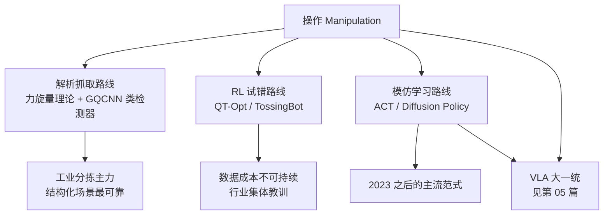
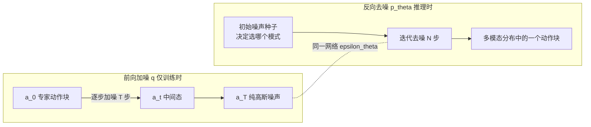

> **系列导航**：走路（第 02 篇）已被 RL 攻克，而"用双手做事"仍是皇冠上的明珠。本篇先讲解析抓取的几何理论，再深潜模仿学习两大明星架构——Diffusion Policy 与 ACT/ALOHA，最后盘点数据采集硬件的"军备竞赛"。本篇是理解第 05 篇 VLA 的必要前置。

## TL;DR

> **TL;DR 1｜多模态之死**：同一任务有多条等价轨迹时，MSE 回归会输出所有模式的**平均值**——向左绕和向右绕平均成"撞柱子直行"。这是 BC 十年停滞的元凶，也是扩散模型进入机器人学的根本理由。

> **TL;DR 2｜Diffusion Policy 一句话**：把动作序列当作图像去噪。训练学 $\nabla\log p(a|o)$，推理从高斯噪声迭代去噪出动作块；它天然表达多模态分布，代价是需要 $N$ 次前向传播（DDIM 蒸馏可缓解）[1](https://arxiv.org/abs/2303.04137)。

> **TL;DR 3｜ALOHA 的贡献一半在硬件**：低延迟主从双臂 + **action chunking**（一次预测未来 $k$ 步）把真机成功率从个位数推到 80%+，证明"数据质量 × 架构细节"比算法炫技更重要[2](https://arxiv.org/abs/2304.13705)。

## 目录

- [1. 任务分类学与难度金字塔](#1-任务分类学与难度金字塔)
- [2. 解析抓取：力旋量、摩擦锥与闭合判据](#2-解析抓取力旋量摩擦锥与闭合判据)
  - [2.1 力旋量 wrench：抓取世界的通用货币](#21-力旋量-wrench抓取世界的通用货币)
  - [2.2 摩擦锥及其线性化](#22-摩擦锥及其线性化)
  - [2.3 形闭合与力闭合：正张成与凸包判据](#23-形闭合与力闭合正张成与凸包判据)
  - [2.4 抓取质量的度量：从 Ferrari-Canny 到鲁棒化](#24-抓取质量的度量从-ferrari-canny-到鲁棒化)
  - [2.5 从几何到学习：Dex-Net 与 GraspNet 家族](#25-从几何到学习dex-net-与-graspnet-家族)
- [3. RL 操作路线：光辉与悲壮](#3-rl-操作路线光辉与悲壮)
  - [3.1 QT-Opt：规模化 batch RL 的巅峰与账单](#31-qt-opt规模化-batch-rl-的巅峰与账单)
  - [3.2 TossingBot：残差物理先验](#32-tossingbot残差物理先验)
  - [3.3 数据经济学：RL 为什么让位于模仿学习](#33-数据经济学rl-为什么让位于模仿学习)
- [4. 行为克隆的救赎：MSE 之死与两大生成式架构](#4-行为克隆的救赎mse-之死与两大生成式架构)
  - [4.1 MSE 为什么必然失败：条件均值的形式化](#41-mse-为什么必然失败条件均值的形式化)
  - [4.2 Diffusion Policy 完整推导](#42-diffusion-policy-完整推导)
  - [4.3 ACT/ALOHA：分块与条件 VAE](#43-actaloha分块与条件-vae)
- [5. 数据采集硬件军备竞赛](#5-数据采集硬件军备竞赛)
  - [5.1 ALOHA：主从臂的工程学](#51-aloha主从臂的工程学)
  - [5.2 UMI：把机器人从数据采集中移除](#52-umi把机器人从数据采集中移除)
  - [5.3 DexCap 与 VR 遥操：手指级与沉浸式](#53-dexcap-与-vr-遥操手指级与沉浸式)
  - [5.4 MimicGen：软件定义的数据扩增](#54-mimicgen软件定义的数据扩增)
  - [5.5 定位对比与趋势](#55-定位对比与趋势)
- [6. 评测的正确姿势](#6-评测的正确姿势)
- [Lab Exercises](#lab-exercises)
- [参考文献与延伸阅读](#参考文献与延伸阅读)

---

## 1. 任务分类学与难度金字塔

| 类别 | 例 | 核心难点 | 代表方法 |
|------|-----|---------|---------|
| Pick-and-place | 分拣、码垛 | 视觉定位 | 解析抓取 + 运动规划 |
| 接触密集 | 插销、拧盖、擦拭 | 力控+摩擦不确定性 | 阻抗控制 / 学习方法 |
| 形变物体 | 叠衣服、系鞋带 | 状态不可枚举 | 数据驱动为主 |
| 长时程 | 做一顿饭 | 误差复合+子目标选择 | 分层/VLA |
| 动态 | 抛接、颠勺 | 高频闭环 | RL |

操作与 locomotion 有一个常被忽略的本质区别：**接触的不连续性**。四足走路时脚-地面交互可以用光滑近似（第 02 篇的域随机化能吃掉大部分误差），而操作任务中动力学在接触/分离瞬间发生跳变——雅可比秩变、冲量瞬时产生、摩擦静/动切换。这带来三个连锁后果：

1. **梯度断崖**：基于梯度的策略优化在接触边界处失效，这是 RL 样本复杂度爆炸的深层原因之一；
2. **误差容忍度窄**：插销任务允许的位置误差可能只有毫米级，远小于感知噪声；
3. **控制必须柔顺**：刚性位置控制在接触瞬间会产生巨大约束力（第 01 篇阻抗控制的用武之地）。



本篇按这张图推进：先把最老的解析理论讲透（它至今活在工业界），再复盘 RL 路线为何退场，然后深潜模仿学习的两大架构与喂给它们的数据机器。

---

## 2. 解析抓取：力旋量、摩擦锥与闭合判据

### 2.1 力旋量 wrench：抓取世界的通用货币

刚体力学里，作用在物体上的广义力统一写成**力旋量（wrench）**$\mathcal{w}\in\mathbb{R}^6$——三维合力加三维合力矩：

$$
\mathcal{w} = \begin{bmatrix} f \\ \tau \end{bmatrix},\qquad \tau = r \times f
$$

其中 $r$ 是力的作用点相对参考点（通常取质心）的位置矢量。抓取分析的第一个动作是把每个指尖的接触力翻译成物体坐标系下的力旋量。设第 $i$ 个接触点位置为 $r_i$、三维接触力为 $c_i\in\mathbb{R}^3$（法向压力 + 两个切向摩擦力），则：

$$
\mathcal{w}_i = \begin{bmatrix} I_3 \\ [r_i]_\times \end{bmatrix} c_i \;\triangleq\; G_i\, c_i,\qquad
[r_i]_\times = \begin{bmatrix}
0 & -r_z & r_y \\
r_z & 0 & -r_x \\
-r_y & r_x & 0
\end{bmatrix}
$$

$G_i\in\mathbb{R}^{6\times 3}$ 称为**接触映射**，$[\cdot]_\times$ 是叉积的矩阵形式。$k$ 个接触堆叠成完整的**抓取矩阵**：

$$
\mathcal{w}_{total} = G c,\qquad G = \begin{bmatrix} I_3 & I_3 & \cdots & I_3 \\ [r_1]_\times & [r_2]_\times & \cdots & [r_k]_\times \end{bmatrix}\in\mathbb{R}^{6\times 3k}
$$

准静态平衡要求合力旋量为零：$Gc + \mathcal{w}_{ext}=0$，其中 $\mathcal{w}_{ext}$ 是重力等外部扰动。这里藏着抓取分析最重要的一招——**内外力解耦**：满足 $Gc=0$ 的力组合称为**内力（internal force）**，典型如双指对捏时的互相挤压——它们在物体上合力为零、物体纹丝不动，却大幅扩展了可用摩擦锥。捏得越紧、抗扰动余量越大，这就是"握力"与"平衡"的数学分工。

> **记号约定**：点接触不考虑摩擦力矩时 $c_i\in\mathbb{R}^3$；软手指（soft finger）模型额外允许绕接触法线的摩擦力矩，$c_i\in\mathbb{R}^4$，对应 $G_i\in\mathbb{R}^{6\times 4}$。本篇默认点接触。

### 2.2 摩擦锥及其线性化

库仑摩擦定律把每个接触的可行力集合限制在一个圆锥内——**摩擦锥（friction cone）**：

$$
\mathcal{F}_i = \left\{\, c_i :\ f_n \ge 0,\ \Vert f_t \Vert_2 \le \mu f_n \,\right\}
$$

$f_n$ 是法向压力（只能推不能拉），$f_t$ 是切向力，$\mu$ 是摩擦系数。锥的半顶角 $\varphi = \arctan\mu$（$\mu=0.5$ 时约 $26.6°$）。这个锥是抓取理论一切非线性的根源：它是**二阶锥**（SOC），让力闭合判定天然成为二阶锥规划（SOCP）问题。

工程实践几乎总把它**线性化**成内接棱锥：取 $n$ 个方向的锥边射线 $g_{ij}$ 作母线，用非负张成近似整个锥：

$$
\mathcal{F}_i \approx \mathrm{cone}\{g_{i1},\dots,g_{in}\},\qquad g_{ij} = \cos\theta_j\, n_i + \sin\theta_j\, t_i
$$

$n_i$、$t_i$ 是接触点的法向与切向基。代价与收益同样明确：内接多面体的有效摩擦系数缩水为 $\mu_{eff} = \mu\cos(\pi/n)$（$n=8$ 时保守约 $7.6\%$），换来的是**所有判据都变成线性代数**——可行域成为多面锥，力闭合检验成为线性规划。Dex-Net 系列的力学分析标签正是这样算出来的。

### 2.3 形闭合与力闭合：正张成与凸包判据

对"抓稳了"有两个层层递进的经典判据，全部可以写成上一节符号下的线性条件。

**形闭合（form closure）**：仅凭接触的几何约束（不计摩擦），物体就无法做任何一阶运动。等价条件是抓取映射满秩且存在一组同时"压紧"所有接触的内力：

$$
\mathrm{rank}(G) = 6 \quad\land\quad \exists\, \lambda \succ 0:\ G\lambda = 0
$$

直觉：$\lambda\succ 0$ 表示所有接触都在施加纯压力且合力为零——像虎钳一样把物体"焊死"。无摩擦点接触下，二维至少需要 **4** 个接触、三维至少 **7** 个（正张成 $\mathbb{R}^d$ 至少要 $d+1$ 个向量，而平面与空间操作的力旋量维数分别是 3 和 6）。

**力闭合（force closure）**：允许利用摩擦。定义放宽为——对**任意**扰动力旋量 $\mathcal{w}_{ext}$，都存在落在摩擦锥内的接触力组合将其抵消：

$$
\forall\, \mathcal{w}_{ext}\in\mathbb{R}^6,\ \exists\, c\in\mathcal{F}_1\times\cdots\times\mathcal{F}_k:\ Gc + \mathcal{w}_{ext}=0
\;\Longleftrightarrow\;
\mathrm{cone}\big(\textstyle\bigcup_i G_i\mathcal{F}_i\big) = \mathbb{R}^6
$$

右边读作：各接触摩擦锥映入力旋量空间后的**正锥**要覆盖整个空间。线性化之后有一个漂亮的等价判据——**凸包判据**：把每个接触锥边的单位法向力旋量 $\mathcal{w}_{ij} = G_i g_{ij}$ 收集成点集 $W$，则

$$
\text{力闭合}\ \Longleftrightarrow\ \mathbf{0} \in \mathrm{int}\,\mathrm{conv}(W)
$$

即**原点严格落在原始力旋量的凸包内部**。几何直觉：想象每个接触往力旋量空间投出一把"扇子"，把扇骨端点连成凸包——原点陷得越深，任何方向的扰动越容易被某组正系数顶回去；原点贴近包面，就存在"软肋方向"。这解释了两个经典事实：

1. **无摩擦时力闭合 ⟺ 形闭合**：没有摩擦锥，每个接触只剩一根法向射线，两判据退化为同一个正张成条件；
2. **两指捏铅笔是力闭合而非形闭合**：松手铅笔会掉（几何没锁死），捏着时靠摩擦锥它哪个方向都掉不下来——摩擦把 7 接触的需求砍到了 2。

平面双指还有更锋利的**对跖（antipodal）判据**（Nguyen, 1988）：若两接触连线方向同时落在两个摩擦锥内（把两锥平移到同一顶点后存在反向重叠区），则该两点抓取实现平面力闭合。"找一对锥边方向相反的接触点"——这句话就是 Dex-Net 2.0 候选抓取采样器的全部理论基础。

最后一个反直觉数值小例：边长为 2 的方块，**四个无摩擦指尖分别压在四面正中央并不构成一阶形闭合**——四个力旋量 $(\pm1,0,0)$、$(0,\pm1,0)$ 的凸包是过原点的零厚度菱形面，转轴方向完全不受约束（方块可自由微旋）。把接触错开（staggered）让力矩臂不全为零，才能撑起三维凸包。对称未必稳定，这是力旋量几何给"常识"上的第一课。

下面的最小代码实现这套判据的完整流水线（摩擦锥 8 边线性化 → 原始力旋量 → LP 检验原点是否在凸包内部），依赖 `numpy` 与 `scipy`：

```python
"""平面力闭合判定：摩擦锥线性化 + LP 检验 0 是否在 conv(W) 内部"""
import numpy as np
from scipy.optimize import linprog

def primitive_wrenches(contact, mu, n_edge=8):
    """contact = ((rx, ry), (nx, ny))：接触位置与内法向（单位向量）
    返回该接触在单位法向力下的原始力旋量集 (n_edge, 3)"""
    (rx, ry), (nx, ny) = contact
    tx, ty = -ny, nx                        # 切向基
    half = np.arctan(mu)                    # 摩擦半锥角
    W = []
    for a in np.linspace(-half, half, n_edge):
        fx = np.cos(a)*nx + np.sin(a)*tx    # 锥边方向 g_ij
        fy = np.cos(a)*ny + np.sin(a)*ty
        W.append([fx, fy, rx*fy - ry*fx])   # 平面力旋量 w = (fx, fy, tau)
    return np.array(W)

def force_closure(W):
    """0 在 conv(W) 内部 <=> rank(W)=d 且存在严格正组合抵消"""
    n, d = W.shape
    if np.linalg.matrix_rank(W) < d:          # 撑不满力旋量空间必非闭合（防退化凸包）
        return False
    c = np.append(np.zeros(n), -1.0)                              # 最大化 delta
    base = np.vstack([W.T, np.ones((1, n))])                      # 力平衡 + 归一化
    A_eq = np.hstack([base, np.zeros((d + 1, 1))])                # 补 delta 变量列
    b_eq = np.append(np.zeros(d), 1.0)
    A_ub = np.hstack([-np.eye(n), np.ones((n, 1))])               # delta - lam_i <= 0
    res = linprog(c, A_ub=A_ub, b_ub=np.zeros(n), A_eq=A_eq,
                  b_eq=b_eq, bounds=[(0, None)] * (n + 1), method="highs")
    return bool(res.success) and res.x[-1] > 1e-9

if __name__ == "__main__":
    two   = [((1, 0), (-1, 0)), ((-1, 0), (1, 0))]          # 左右对指
    mid4  = [((1, 0), (-1, 0)), ((-1, 0), (1, 0)),          # 四面正中
             ((0, 1), (0, -1)), ((0, -1), (0, 1))]
    wind4 = [((-1, -.9), (1, 0)),                           # 风车式错开的四接触
             ((1, .9), (-1, 0)),
             ((-.9, -1), (0, 1)),
             ((.9, 1), (0, -1))]
    print("two mu=0   :", force_closure(np.vstack([primitive_wrenches(c, 0)   for c in two])))   # False
    print("two mu=0.4 :", force_closure(np.vstack([primitive_wrenches(c, 0.4) for c in two])))   # True
    print("mid4 mu=0  :", force_closure(np.vstack([primitive_wrenches(c, 0)   for c in mid4])))  # False
    print("wind4 mu=0 :", force_closure(np.vstack([primitive_wrenches(c, 0)   for c in wind4]))) # True
```

预期输出 `False / True / False / True`：无摩擦双指必败；加摩擦后对捏成立；四面正中的对称四接触竟然也败（旋转自由，且注意它退化成两对对跖、凸包只有二维）；风车式错开后成立——四枚力旋量两两不再互为相反数，撑满三维空间。

变量映射表：

| 数学符号 | 代码变量 | Shape | 说明 |
|---:|:---|:---:|:---|
| $r_i$ | `contact[0]` | `(2,)` | 接触位置（相对质心） |
| $n_i$ | `contact[1]` | `(2,)` | 接触内法向 |
| $g_{ij}$ | 循环内的 `(fx, fy)` | `(2,)` | 线性化锥边方向 |
| $\mathcal{w}_{ij}$ | `W` | `(n_edge·k, 3)` | 原始力旋量集 |
| $\lambda$ | `res.x[:-1]` | `(n_edge·k,)` | 凸包组合系数 |
| $\delta^\*$ | `res.x[-1]` | 标量 | 判据：$\delta^\*>0$ 即力闭合 |

### 2.4 抓取质量的度量：从 Ferrari-Canny 到鲁棒化

力闭合是 0/1 判据，但工程上需要连续的"好/坏"排序。Ferrari 与 Canny（1992）在力旋量凸包上定义了沿用至今的**抓取质量度量**族：

- **ε-度量**：以原点为球心的**最大内切球半径**，等于原点到凸包各面的最小距离——"最坏方向的抵抗余量"；
- **L1-度量**：原点到凸包所有面的距离之和——"全方向的总余量"；
- **体积度量**：凸包体积本身。

三者都应在独立接触区域（Independent Contact Regions, ICR）上计算以避免退化凸包。ε-度量越大，抓取对扰动越鲁棒——但它假设几何与摩擦参数**精确已知**，而现实里物体位姿有毫米级误差、摩擦系数可能在 $[0.3, 1.0]$ 间漂移。如何把确定性度量变成不确定性下的概率？这正是 Dex-Net 2.0 的切入点。

### 2.5 从几何到学习：Dex-Net 与 GraspNet 家族

手工设计抓取度量在杂乱场景失效后，数据驱动接管。

**Dex-Net 2.0**（Berkeley, 2017）是一个两层设计：底层仍是 2.4 节的解析力学，顶层用深度网络学会"什么时候信它"[3](https://arxiv.org/abs/1703.09312)。具体地：

1. **鲁棒抓取质量函数**：把物体位姿、质量、质心位置、摩擦系数全部视为随机变量 $u$，给定候选抓取参数 $\theta$，定义

$$
Q(\theta) = P\big(\epsilon'(\theta, u) > 0\big)
$$

其中 $\epsilon'$ 是扰动环境 $u$ 下计算的 ε-型度量，$Q$ 用**蒙特卡洛估计**：采样几百次扰动环境，统计力闭合成立的频率。这一步把"鲁棒性"从形容词变成了可计算的监督信号；

2. **合成数据引擎**：在近九千个 3D 物体模型上渲染深度图，枚举对跖候选抓取（正是 Nguyen 判据的工程化），逐个跑力学分析打标签——共生成 **670 万**个带可靠性标签的（深度图, 抓取）样本，全程无需真机；
3. **GQCNN 架构**：输入是以候选抓取两个指尖落点为中心的一对深度图 patch；主体为共享的十余层卷积+池化，随后分成两条并行全连接支路（各自处理一块 patch）、拼接后再过全连接层输出单个 sigmoid 概率——"这个抓取会成功的概率"。交叉熵训练；推理时对数百个候选并行打分取最优。实机报告：已知物体约 93%、未见物体约 89% 的成功率。

它的哲学影响深远：**解析理论负责造标签，网络负责感知泛化**——这条"仿真力学分析当教师"的管线是后来一切合成数据工作的原型。

后续工作沿三条轴铺开，谱系如下：

| 系统 | 年份 | 输入 | 抓取空间 | 数据来源 | 方法范式 |
|------|------|------|----------|----------|----------|
| Dex-Net 2.0 | 2017 | 深度图 | 平面对跖（自顶向下+绕重力轴） | 仿真合成 670 万标注 | 判别式 GQCNN |
| GraspNet-1Billion | 2019/20 | 真实 RGB-D 杂乱场景 | 近平面矩形抓取 | 97,280 张真图+十亿级标注 | 统一基准 + AP 协议 |
| 6-DOF GraspNet | 2019 | 点云 | 任意 SE(3) 抓取位姿 | 仿真采样+解析检验 | 生成式 CVAE |
| DexGraspNet | 2022 | 物体网格 | Shadow Hand 多指 | 合成百万级位姿 | 力闭合校验的数据集 |

其中 **GraspNet-1Billion** 的贡献主要在评测侧：早期各家用各自的物体集自说自话，它提供大规模真实采集数据与统一的 average precision 协议，让抓取检测器第一次有了可比排行榜（其早期 arXiv 版标题为 *GraspNet: A Large-Scale Clustered and Densely Annotated Dataset for Object Grasping*，RA-L 发表版更为现名）[4](https://arxiv.org/abs/1912.13470)。**6-DOF GraspNet** 用条件变分自编码器把抓取位姿从"绕重力轴的一圈"解放到任意旋转——生成式建模对付多模态，与 4.3 节 ACT 同宗同源[5](https://arxiv.org/abs/1905.10520)。**DexGraspNet** 把路数推向灵巧手：万级物体、百万级多指抓取位姿全部经力闭合解析校验，成为灵巧手抓取学习的标准燃料[6](https://arxiv.org/abs/2210.02697)。

这条线的共同哲学：**把"抓取"压缩成一次前向推理**，给上层策略当原语调用——它至今仍是最可靠的工业方案，VLA 并没有完全取代它（见第 05 篇 GraspVLA 案例）。

## 3. RL 操作路线：光辉与悲壮

### 3.1 QT-Opt：规模化 batch RL 的巅峰与账单

QT-Opt（Google, 2018）证明了视觉操作可以被纯粹试错学出来，也顺手标出了价格。架构要点：

- **分布式 batch RL**：若干台真机当 actor 持续采经验写入巨型回放池，learner 异步拟合 Q 函数——训练与数据采集彻底解耦，这是它能吃下海量真机数据的前提；
- **离散化训练 + CEM 推理**：Q 网络输入（图像状态, 动作）输出标量价值；连续动作没法穷举，推理时用**交叉熵方法（CEM）**在动作空间迭代"采样→按 Q 筛选精英样本→refit 高斯"，逼近 $\arg\max_a Q(s,a)$——相当于把优化器外挂在价值函数上；
- **涌现技能**：回放池里混入了推动、拨开等探索动作，策略自发学会"先拨开干扰物再抓""抓歪后重试换角度"这类没人教的组合行为——这是 RL 路线最迷人的瞬间。

代价写在账单上：**7 台机械臂、数个月不间断真机运行、58 万次抓取尝试**，才换来对未见物体的抓取能力[7](https://arxiv.org/abs/1806.10293)。而且换个任务（从"抓起"改成"插入"），以上全部重来——探索要从零再烧一遍。

### 3.2 TossingBot：残差物理先验

TossingBot（Google, 2019）展示了 RL 路线更聪明的打开方式：**别让网络学物理，让网络学物理的残差**[8](https://arxiv.org/abs/1903.11239)。抛掷任务的弹道有近乎解析的模型：给定目标落点，反解抛体运动方程可得初始速度估计 $v_{ballistic}$；空气阻力、抓取滑移这些难建模的效应交给神经网络输出修正量：

$$
v = v_{ballistic}(\text{target}) + f_\theta(\text{observation})
$$

训练信号完全自监督：摄像头检测物体实际落点，落点偏差直接构成 $f_\theta$ 的回归标签——不需要人工奖励设计。结果是有效拾取速率达到约每小时 500 次（约为人类熟练操作员的两倍），且能把未见过的物体抛进视野外的盒子里。"物理先验打底 + 学习补残差"的思想，后来在 locomotion 与 VLA 微调中被反复复活。

### 3.3 数据经济学：RL 为什么让位于模仿学习

把两条路线放上天平，差距是数量级的：

| 成本项 | 真机 RL（QT-Opt 量级） | 模仿学习（ALOHA 量级） |
|--------|----------------------|----------------------|
| 数据量 | $5.8\times 10^5$ 次交互 | $50\sim 100$ 条演示 |
| 采集时长 | 数千机器人小时 | 数小时遥操作 |
| 边际成本 | 换任务全部重来 | 新任务只需新演示 |
| 监督来源 | 人工设计的奖励函数（本身就是专家劳动） | 人类技能的直接展示 |
| 失败代价 | 硬件磨损 + 现场恢复 | 几乎为零 |

三句话总结这场交接班：

1. **探索是指数级昂贵的**：接触事件的触发概率随时程指数衰减，无梯度探索要在天文数字的无效动作里捞出那几次有效接触；BC 直接把答案抄在卷面上；
2. **奖励工程不可复用**：每个任务的 reward 都是新的专家项目，而演示自带稠密监督；
3. **离线 RL 也救不了**：从固定数据集学策略遭遇分布偏移（第 02 篇 CQL/IQL 的动机），稳定性远逊于监督学习。

于是 2020 年前后操作研究的重心整体迁移：瓶颈不再是"怎么学"，而是"**演示从哪来、怎么用好**"——这个问题分裂出第 4 节的架构创新与第 5 节的硬件军备竞赛。RL 并未消失：动态技能（高速抛接、掌内重定向）仍属 RL 自留地，2024 年后又以"VLA + RL 微调"的形式试图回归（第 05 篇讨论）。

## 4. 行为克隆的救赎：MSE 之死与两大生成式架构

### 4.1 MSE 为什么必然失败：条件均值的形式化

行为克隆的标准配置是监督回归：给定观测 $o$，最小化 $\Vert a - \hat a(o)\Vert^2$。对任意预测器 $\hat a$ 做平方分解：

$$
\mathbb{E}\big[\Vert a - \hat a(o)\Vert^2 \mid o\big] = \underbrace{\mathbb{E}\big[\Vert a - m(o)\Vert^2 \mid o\big]}_{\text{不可约方差}} + \Vert m(o) - \hat a(o)\Vert^2,\qquad m(o) \triangleq \mathbb{E}[a\mid o]
$$

（展开 $\Vert (a-m)+(m-\hat a)\Vert^2$，交叉项因 $\mathbb{E}[a-m\mid o]=0$ 消失。）第二项恒非负，故**最优解唯一地是条件均值** $\hat a^* = m(o)$——无论网络多大、数据多少。问题在于：多模态分布的条件均值**不在任何一个模式上**。

一维双峰数值例：观测固定为 $o=0$，专家动作 $P(a=-1)=P(a=+1)=0.5$：

| 预测器 | 输出值 | 该处概率密度 | MSE | 备注 |
|--------|-------|------------|-----|------|
| 条件均值（MSE 最优） | $0$ | **0**（零密度点！） | $1$（=方差下限） | 执行必撞两峰之间的障碍 |
| 条件中位数（MAE 最优） | $\pm 1$ 任一 | $0.5$ | $1$ | L1 能逃出均值陷阱但不可控 |
| 众数 | $\pm 1$ | $0.5$ | $1$ | 语义上的正确模式 |

改成不对称混合 $P(+1)=0.7,\ P(-1)=0.3$：均值变成 $0.4$——依然是零密度点，只是偏了一点；中位数/众数回到 $+1$。**MSE 的病不在容量而在目标**：它被迫输出所有模式的重心，而重心处可能根本没有合理行为。轨迹层面更致命——两条合法轨迹随时间发散，其平均轨迹在运动学上就不成立（向左绕和向右绕的平均是撞柱直行）。

社区的逃离路线史值得一览：离散化动作 token（保住多模态但牺牲分辨率与平滑性，此路线在 VLA 时代借尸还魂，见第 05 篇 FAST）；隐变量模型（CVAE，见 4.3）；能量模型（Implicit BC 把推理变成 $\arg\min_a E(a,o)$ 的优化过程，证明"隐式回归"同样能表达多模态[13](https://arxiv.org/abs/2109.00137)）；以及最终胜出的扩散模型（4.2）。先用代码复现"塌缩"本身：

```python
"""1D 双峰数据上的 MSE 塌缩演示：单一观测 o=0，专家动作 ±1 各半"""
import torch, torch.nn as nn

torch.manual_seed(0)
n = 4096
x = torch.zeros(n, 1)                                  # 观测恒定：不确定性全在动作分布里
y = torch.where(torch.rand(n, 1) < 0.5,
                -torch.ones(n, 1), torch.ones(n, 1))   # 双峰采样 a^(j)

model = nn.Sequential(nn.Linear(1, 128), nn.ReLU(),
                      nn.Linear(128, 128), nn.ReLU(), nn.Linear(128, 1))

def fit(loss_fn, steps=3000):
    opt = torch.optim.Adam(model.parameters(), lr=1e-3)
    for _ in range(steps):
        opt.zero_grad()
        loss_fn(model(x), y).backward()                # 梯度把预测拉向分布的对应统计量
        opt.step()

fit(lambda p, t: ((p - t) ** 2).mean())                # MSE
print(f"MSE pred = {model(torch.zeros(1,1)).item():+.4f}")   # ≈ +0.000x：塌缩到零密度点
fit(lambda p, t: (p - t).abs().mean())                 # L1（续训同一网络）
print(f"L1  pred = {model(torch.zeros(1,1)).item():+.4f}")   # ≈ ±1.0x：跳到其中一个模式上
```

预期输出：MSE 阶段预测收敛到 $0.000x$（均值陷阱），切到 L1 后预测滑向 $\pm 1$（条件中位数）。变量映射：`y` ↔ 专家样本 $a^{(j)}$，`model(x)` ↔ 预测器 $\hat a(o)$；两种损失分别把预测拉向分布的均值/中位数——损失函数决定统计量，这是本节全部内容的代码版表述。

### 4.2 Diffusion Policy 完整推导

**核心思想**：把动作序列 $a_{0:T_a}$ 视为高维向量，用去噪扩散过程建模其条件分布 $p(a|o)$[1](https://arxiv.org/abs/2303.04137)[14](https://arxiv.org/abs/2006.11239)。

**前向加噪**（训练时人为破坏）：定义噪声调度 $\alpha_t$、$\bar\alpha_t=\prod_{i\le t}\alpha_i$，闭式采样任意时刻的加噪动作：

$$
q(a_t \mid a_0) = \mathcal{N}\!\left(a_t;\ \sqrt{\bar\alpha_t}\, a_0,\ (1-\bar\alpha_t)\, I\right)
$$

**训练目标**：网络 $\epsilon_\theta(a_t, t, o)$ 预测被加入的噪声，损失即加权去噪分数匹配：

$$
L = \mathbb{E}_{a_0\sim p_{data},\ t\sim[1,T],\ \epsilon\sim\mathcal N(0,I)}\left[\big\Vert\epsilon - \epsilon_\theta\big(\sqrt{\bar\alpha_t}a_0 + \sqrt{1-\bar\alpha_t}\epsilon,\ t,\ o\big)\big\Vert^2\right]
$$

这个简洁目标是哪里来的？完整推导链如下（DDPM 框架）[14](https://arxiv.org/abs/2006.11239)：

1. **变分下界**：逆过程参数化为 $p_\theta(a_{t-1}|a_t)=\mathcal{N}(\mu_\theta(a_t,t,o), \sigma_t^2 I)$，对负对数似然施 ELBO 分解成三项：

$$
L_{vlb} = \mathbb{E}_q\Big[\underbrace{D_{KL}\big(q(a_T|a_0)\,\Vert\,\mathcal{N}(0,I)\big)}_{\text{先验匹配，无参数}} + \sum_{t=2}^{T} D_{KL}\big(q(a_{t-1}|a_t,a_0)\,\Vert\,p_\theta(a_{t-1}|a_t)\big) - \log p_\theta(a_0|a_1)\Big]
$$

2. **后验闭式**：贝叶斯公式代入两个高斯、对 $a_{t-1}$ 配方，真实后验也是高斯：

$$
q(a_{t-1}\mid a_t,a_0)=\mathcal{N}\!\Big(\tilde\mu_t,\ \tilde\beta_t I\Big),\quad
\tilde\beta_t=\frac{1-\bar\alpha_{t-1}}{1-\bar\alpha_t}\beta_t,\quad
\tilde\mu_t=\frac{\sqrt{\bar\alpha_{t-1}}\,\beta_t}{1-\bar\alpha_t}a_0+\frac{\sqrt{\alpha_t}(1-\bar\alpha_{t-1})}{1-\bar\alpha_t}a_t
$$

3. **高斯 KL 逐项写出**：同方差高斯的 KL 是均值差的二次型，$L_t = \mathbb{E}\big[\Vert\tilde\mu_t - \mu_\theta\Vert^2 / (2\beta_t)\big]$；
4. **重参数化到噪声预测**：由 $a_0 = (a_t - \sqrt{1-\bar\alpha_t}\,\epsilon)/\sqrt{\bar\alpha_t}$，让 $\mu_\theta$ 采用与 $\tilde\mu_t$ 相同的结构、只把真值 $a_0$ 换成 $\epsilon_\theta$ 的预测，化简后被预测量统一为 $\epsilon$：

$$
L_t = \mathbb{E}\left[\frac{\beta_t^2}{2\sigma_t^2\,\alpha_t(1-\bar\alpha_t)}\big\Vert\epsilon - \epsilon_\theta(a_t,t,o)\big\Vert^2\right]
$$

DDPM 实验发现把前面的权重系数整个丢掉（均匀权重）效果反而更好——于是得到开头那个干净的 MSE。**推导要点**：该简化目标与变分下界的加权版本等价，而权重恰好让网络专注预测分数函数——$\nabla_{a_t}\log p(a_t\mid o) \approx -\epsilon_\theta(a_t,t,o)/\sqrt{1-\bar\alpha_t}$，即"往哪个方向去噪能让动作更像人话"。

**推理**：从纯噪声出发，逆过程迭代 $T$ 步（每步一步网络前向）：

$$
a_{t-1} = \frac{1}{\sqrt{\alpha_t}}\left(a_t - \frac{1-\alpha_t}{\sqrt{1-\bar\alpha_t}}\epsilon_\theta(a_t,t,o)\right) + \sigma_t z,\quad z\sim\mathcal N(0,I)
$$

**为什么它能表达多模态**：回归模型输出单个点估计，而扩散模型定义的是一个**采样器**——初始噪声 $a_T$ 充当隐式风格变量，不同种子沿不同去噪轨道收敛到不同模式；且损失始终作用在"噪声预测"上而非动作值上，不存在把两个模式平均化的梯度。多模态性不是网络的属性，而是采样过程的属性。



**DDIM 加速**：ancestral 采样的随机项使轨迹不可复现。DDIM 给出确定性更新——先估出干净动作 $\hat a_0$ 再重新加噪：

$$
a_{t-1}=\sqrt{\bar\alpha_{t-1}}\cdot\underbrace{\frac{a_t-\sqrt{1-\bar\alpha_t}\,\epsilon_\theta}{\sqrt{\bar\alpha_t}}}_{\hat a_0\ \text{（对干净动作的估计）}}+\sqrt{1-\bar\alpha_{t-1}-\sigma^2}\,\epsilon_\theta,\qquad \eta=0 \Rightarrow \sigma=0
$$

它允许跳步采样：100 步训练的模型用 10 步推理几乎无损，且 $\eta=0$ 时同种子可复现（便于调试与蒸馏）；一致性模型进一步把采样压到 1-2 步[15](https://arxiv.org/abs/2010.02502)[16](https://arxiv.org/abs/2303.01469)。

**Receding-horizon 视角看 action chunking**：Diffusion Policy 每次观测 $T_o$ 帧历史、预测 $T_a$ 步未来、执行其中一段后重新观测再规划——这正是 MPC 的拓扑结构，只是"求解器"换成了去噪迭代：

| MPC 术语 | Diffusion Policy 对应物 |
|---------|------------------------|
| 状态估计窗口 | 观测窗口 $T_o$ |
| 待优化的控制序列 $u_{0:H-1}$ | 动作块 $a_{1:T_a}$ |
| 目标函数 $J$ | （隐式的）去噪分数匹配目标 |
| 数值求解器迭代 | DDPM/DDIM 去噪迭代 |
| 重规划周期 | 每执行一段动作块后重新推理 |

chunking 在此框架下的意义：增大 $T_a$ 降低重规划频率、换取长时一致性；增大 $T_o$ 让网络看清速度/加速度趋势。DP 论文消融显示 $T_o=2$、$T_a=8$ 在多数仿真任务最优——太短的块退化为无反馈的单步回归（回到 4.1 老路），太长的块放大预测误差。

**CNN 与 Transformer 主干之争**（DP 论文系统对比过两者）[1](https://arxiv.org/abs/2303.04137)：

| 维度 | CNN 版本（1D 时序 U-Net） | Transformer 版本 |
|------|--------------------------|------------------|
| 时间归纳偏置 | 膨胀因果卷积，时序平移等变 | 全局注意力+正弦位置编码 |
| 扩散步条件注入 | FiLM 每层仿射调制 | adaLN / 交叉注意力 token |
| 小数据表现 | 更稳，不易过拟合 | 需更多数据或增广 |
| 多相机高维观测扩展性 | 一般 | 更强，图像 token 天然可拼 |
| 推理延迟 | 更低，适合高频闭环 | 相对较高 |
| DP 论文结论 | 仿真基准上全面占优 | 规模上限更高 |

后续演化一句话：**DP3** 把视觉编码器换成紧凑点云编码器（第 03 篇 PointNet 思想的直接应用），用 3D 几何换跨视角泛化[17](https://arxiv.org/abs/2403.03954)；**π0** 把扩散头换成流匹配塞进 VLA 底座（第 05 篇详述）[18](https://arxiv.org/abs/2410.24164)。

变量映射表（以 CNN 版本、观测窗口 $T_o{=}2$、动作块 $T_a{=}8$、7-DoF 臂为例）：

| 数学符号 | 代码变量 | Shape | 说明 |
|---:|:---|:---:|:---|
| $o$ | `obs` | `(B, To·Do)` 或图像张量 | 条件输入 |
| $a_0$ | `x0` / `action_gt` | `(B, Ta, Da)` = `(B,8,7)` | 干净动作块 |
| $a_t$ | `xt` / `noisy_action` | `(B, Ta, Da)` | 第 $t$ 步加噪动作 |
| $\epsilon_\theta$ | `noise_pred_net` | `(B,Ta,Da)→(B,Ta,Da)` | U-Net/Transformer |
| $t$ | `timesteps` | `(B,)` | 整型噪声等级 |
| $\epsilon$ | `eps` / `noise` | `(B, Ta, Da)` | 目标高斯噪声 |
| $\beta_t$ | `betas` | `(T,)` | 噪声调度表 |
| $\bar\alpha_t$ | `alphas_bar` | `(T,)` | 调度的累积乘积 |

完整的最小训练循环 + 采样循环（PyTorch 可直接运行；骨架对应官方 `real-stanford/diffusion_policy` 仓库结构，未本地验证）：

```python
"""简化 DDPM 训练循环：低维观测版 Diffusion Policy"""
import torch, torch.nn as nn

B, Ta, Da = 32, 8, 7          # batch / 动作块长度 / 动作维度
To, Do   = 2, 20              # 观测窗口长度 / 观测维度
T        = 100                # 扩散总步数

betas     = torch.linspace(1e-4, 0.05, T)      # β_t 线性调度 (T,)
alphas    = 1.0 - betas                         # α_t = 1 - β_t
alpha_bar = torch.cumprod(alphas, dim=0)        # ᾱ_t (T,)

class NoisePredNet(nn.Module):
    """εθ(a_t, t, o)：时间嵌入 + 条件注入的极简版（真实实现为 1D U-Net）"""
    def __init__(self):
        super().__init__()
        self.t_emb = nn.Sequential(nn.Embedding(T, 64), nn.SiLU(), nn.Linear(64, 64))
        self.a_mlp = nn.Sequential(nn.Linear(Ta*Da, 256), nn.SiLU(), nn.Linear(256, 256))
        self.c_mlp = nn.Sequential(nn.Linear(To*Do, 256), nn.SiLU(), nn.Linear(256, 256))
        self.head  = nn.Sequential(nn.SiLU(), nn.Linear(512, Ta*Da))
    def forward(self, a_t, t, obs):
        h_a = self.a_mlp(a_t.flatten(1))                 # (B,256)
        h_c = self.c_mlp(obs.flatten(1)) + self.t_emb(t) # (B,256)
        return self.head(torch.cat([h_a, h_c], -1)).view(-1, Ta, Da)

net = NoisePredNet(); opt = torch.optim.Adam(net.parameters(), lr=2e-4)
x0 = torch.randn(1024, Ta, Da)                  # 专家数据集（示意）

def train_step():
    idx = torch.randint(0, x0.shape[0], (B,))
    a0  = x0[idx]                                # a_0 ~ p_data
    t   = torch.randint(0, T, (B,))              # t ~ Uniform[0,T)
    eps = torch.randn_like(a0)                   # ε ~ N(0,I)
    ab  = alpha_bar[t].view(B, 1, 1)
    a_t = ab.sqrt()*a0 + (1-ab).sqrt()*eps       # q(a_t|a_0) 闭式加噪
    loss = torch.nn.functional.mse_loss(
        eps, net(a_t, t, torch.randn(B, To, Do)))     # L_simple
    opt.zero_grad(); loss.backward(); opt.step()
    return loss

for step in range(1000): train_step()

@torch.no_grad()
def sample(obs, n_steps=T):
    a = torch.randn(1, Ta, Da)                       # a_T ~ N(0,I)
    for t in torch.linspace(T-1, 0, n_steps).long(): # DDIM 可令 n_steps=10
        tb  = torch.full((1,), int(t))
        eps = net(a, tb, obs)
        al, ab = alphas[t], alpha_bar[t]
        a = (a - betas[t]/(1-ab).sqrt()*eps)/al.sqrt()   # 均值项
        if t > 0: a = a + betas[t].sqrt()*torch.randn_like(a)  # σ_t·z
    return a
```

### 4.3 ACT/ALOHA：分块与条件 VAE

ALOHA 团队发现精细双臂任务的杀手不是架构而是**误差复合**：单步小错 → 状态偏移 → 后续步步惊心。ACT（Action Chunking Transformer）开两味药[2](https://arxiv.org/abs/2304.13705)：

1. **Chunking**：每个观测一次性输出未来 $k{=}100$ 步（50Hz 下约 2 秒）动作，执行期间不看新观测——决策频率降为原来的 $1/k$，复合误差被截断在块边界；
2. **CVAE 建模多模态**：训练时编码器 $q_\phi(z\mid s,a)$ 把整段专家轨迹压成风格隐变量 $z$（如"这次从左绕"），解码器以 $(z,s)$ 生成分块。注意编码器同时吃**观测和目标动作**——这是"事后诸葛亮"通道，只在训练时存在：

$$
L_{ACT} = \underbrace{\big\Vert a_{pred}(s,z) - a_{gt}\big\Vert_1}_{\text{重建（L1）}} + w_{KL}\cdot D_{KL}\big(q_\phi(z\mid s,a)\,\Vert\,\mathcal N(0,I)\big),\qquad w_{KL}=10\ \text{（官方默认）}
$$

生成方向是标准 CVAE 三件套（Sohn et al., NeurIPS 2015）：先验 $p(z)=\mathcal N(0,I)$、似然 $p_\psi(a\mid s,z)$、近似后验 $q_\phi(z\mid s,a)$。KL 权重取到 10 是刻意为之的**强正则**——它压扁 $q_\phi$ 的方差，使解码器对 $z$ 几乎不敏感，从而推理时不采样也行。ACT 官方实现的两个推理细节值得记住：

- **k 个 style anchor**：评测时可从先验采 $K$ 个候选 $z^{(1..K)}$ 当作风格锚点；但论文最终发现直接令 $z=\mathbb{E}[p(z)]=\mathbf{0}$ 最稳——多模态性主要由 chunking 与数据覆盖承载；
- **Temporal ensembling**：每个时间步都查询策略，得到相互重叠的动作块，再按指数权重融合新旧预测：

$$
a_t^{exec} = \sum_i \omega_i\, a_t^{(i)}\Bigm/\sum_i \omega_i,\qquad \omega_i = e^{-i\tau}
$$

$i$ 索引该预测的"块龄"。这相当于对多个 receding-horizon 预测做软投票，进一步抑制抖动。

配合 4~8 台低成本主从臂（约 2 万美元）每周可采数百条高质量演示，最终在插电池片、拧瓶盖这类"RL 和解析方法都绝望"的任务上达到 80–96% 真机成功率[2](https://arxiv.org/abs/2304.13705)。Mobile ALOHA 给底盘装上轮子，用同样的遥操作框架采集全身移动操纵数据，并证明静态 ALOHA 数据共训能大幅拉高移动任务成功率[9](https://arxiv.org/abs/2401.02117)。ACT 已是 LeRobot 开源库的内置算法之一（GitHub: `huggingface/lerobot`，未本地验证）。

**ACT vs Diffusion Policy 取舍表**（两大架构正面交锋的场合很多，选型逻辑值得显式化）：

| 维度 | ACT/CVAE | Diffusion Policy |
|------|----------|------------------|
| 多模态机制 | 隐变量 $z$ 选择风格（粗粒度） | 噪声种子选择模式（细粒度） |
| 分布表达 | 单次前向，隐式 | 迭代采样，显式逼近整个分布 |
| 推理成本 | 一次前向，50Hz 无压力 | $N$ 次去噪（DDIM 缓解到 10 次） |
| 训练稳定性 | 对 KL 权重敏感 | 较稳，但对调度/EMA 敏感 |
| 输出确定性 | 近确定（z 固定后） | 天然随机（可固定种子变确定） |
| 典型主场 | 双臂精细装配（ALOHA 系任务） | Push-T、厨房长程操作 |
| 实现复杂度 | 中（双 Transformer） | 高（U-Net + 采样器 + EMA） |

## 5. 数据采集硬件军备竞赛

架构再好，没有数据就是无米之炊。这一节盘点四类代表性采集系统——它们的分歧本质是一个问题：**用什么样的"人机接口"把人类技能翻译成机器人可学的轨迹**。

### 5.1 ALOHA：主从臂的工程学

ALOHA 的硬件设计处处针对遥操作的两大死敌——**延迟**与**不同构**：

- **同构主从臂**：leader（主臂）与 follower（从臂）采用相同的连杆长度与关节布置，操作员的手部运动学 = 机器臂运动学，心智映射零学习成本；leader 反向驱动并做重力补偿，让操作员"感觉不到机械臂的重量"，从而做出精细动作；
- **成本拆解**：4 台自制 3D 打印 + Dynamixel 舵机机械臂（2 主 2 从）+ 4 台相机（2 腕部 + 2 全局）+ 一台工作站，整套约 **2 万美元**——同期商业遥操作方案普遍在 10 万美元量级，这直接把"实验室拥有多少条数据产线"变成了预算内的问题；
- **50Hz 同步**：四路相机与双臂关节角以 50Hz 硬同步录制，端到端控制链路延迟压在百毫秒级——对插电池片这类毫米级配合任务，任何一环掉帧都会毁掉演示。

这套"低成本 × 高保真 × 可复制"的组合拳，让 ALOHA 成为后续几乎所有双臂数据采集系统的参照系。

### 5.2 UMI：把机器人从数据采集中移除

UMI（Universal Manipulation Interface）走了一条更激进的路线[10](https://arxiv.org/abs/2402.10329)：既然人手本身就是最好的操作器，为什么不直接采人的操作？

- **手持夹爪 + GoPro 鱼眼**：一个 3D 打印的手持夹爪装上广角运动相机与 ArUco 标记立方体，人类拎着它完成任意任务；
- **SLAM 轨迹作为动作标签**：离线跑 ORB-SLAM3 从视频里恢复夹爪的 6-DoF 刚体轨迹，加上夹爪开合宽度，构成完整的演示标注——**动作不是人手关节角，而是末端位姿流**，天然规避了本体差异；
- **安装偏移不变性**：策略输入是腕部第一视角图像 + 夹爪坐标系下的位姿目标。因为接口是"自中心"的（egocentric），换一台安装方式不同的机械臂执行，只需改一个固定的外参变换——数据采集与部署本体彻底解耦，这正是名字里 Universal 的含义。

代价同样清晰：没有力觉信息（倒水可以，拧螺丝不行）、本体感知有 gap（夹爪宽度靠传感器近似）、户外 SLAM 漂移需要鱼眼+曝光锁定来缓解。UMI 的真正贡献是证明了：**embodied gap 可以被标定与工程手段填平**，"必须用机器人采数据"并不是铁律。

### 5.3 DexCap 与 VR 遥操：手指级与沉浸式

- **DexCap**[11](https://arxiv.org/abs/2403.07788)：可穿戴手部外骨骼，关节编码器直接读出手指角度，胸挂 SLAM 相机定位手臂根部位姿——无需动捕棚即可采集**手指级灵巧操作数据**，经重定向模型零改动映射到同构灵巧手（如 Allegro）。它是灵巧手模仿学习数据的最短路径；
- **VR 头显遥操**：Open-TeleVision 用头显提供沉浸式主动视觉反馈[19](https://arxiv.org/abs/2407.01512)，Bunny-VisionPro 实现基于 VisionPro 的双手灵巧遥操并直接训出真机策略[20](https://arxiv.org/abs/2407.03162)。上手门槛低、体验自然，是社区开源生态最活跃的一支。

### 5.4 MimicGen：软件定义的数据扩增

MimicGen 换了个思路：不新增硬件，而是**从少量人类演示自动合成海量新演示**[12](https://arxiv.org/abs/2310.17596)。原理三步：

1. 把每条人类演示切分成段，每段锚定到某个物体坐标系（object-centric segmentation）；
2. 新场景中读取当前物体位姿 $T'_O$，按记录的相对变换重算该段的机械臂目标：$T'_{ee} = T'_O\, T_{rel}$；
3. 机械臂逐段跟踪变换后的目标，成功即产出一条新的合成演示。

约 200 条人类演示由此扩增出跨 18 个任务的近 5 万条合成演示，用它们训练的 BC 策略成功率匹敌甚至超过用纯人类大数据训练的基线。它把数据瓶颈从"人力"转移到了"算力"——这是 MimicGen 之后所有 demo-amplification 工作（如 RoboCasa 场景级扩展）的共同起点。

### 5.5 定位对比与趋势

| 系统 | 形态 | 成本量级 | 力觉/本体保真 | 灵巧度 | 吞吐 | 最佳生态位 |
|------|------|---------|--------------|--------|------|-----------|
| ALOHA 主从臂 | 双臂对拷遥操 | 约 2 万美元 | 关节角全量（无力觉） | 双臂精细 | 中 | 双臂装配任务 |
| Mobile ALOHA | 主从臂+轮底盘 | 约 3.2 万美元 | 同上+底盘 | 双臂+移动 | 中 | 移动操纵 |
| UMI 手持夹爪 | 手持+GoPro+SLAM | 几百美元 | 无力觉，本体近似 | 人手级 | 高（人速） | 跨本体泛化研究 |
| DexCap 外骨骼 | 手部外骨骼+SLAM | 中 | 手指级全量 | 灵巧手五指 | 中 | 灵巧手模仿学习 |
| VR 遥操（OTV/Bunny-VisionPro） | 头显第一视角 | 中低 | 关节映射为主 | 双手灵巧 | 中高 | 社区快速采数 |
| MimicGen | 软件 | 算力 | 继承源演示 | 继承源演示 | 极高 | 仿真规模化 |

趋势判断：**遥操作正在从"实验室技能"变成"产业基础设施"**（智元等公司已建数百人规模的数据工厂，第 07 篇展开）。UMI 与 MimicGen 则代表两个降本方向——前者砍掉"机器人参与采集"，后者砍掉"人类重复劳动"；两条路线正在合流为"少量人类种子演示 + 自动化扩增"的标准管线。

## 6. 评测的正确姿势

报一个成功率数字远远不够，社区共识要报**泛化轴矩阵**：

- 物体泛化：未见实例 / 未见类别
- 位姿泛化：位置扰动 / 姿态扰动 / 光照变化
- 场景干扰物：有无 distractors
- 语言指令泛化：改写措辞是否失效
- 统计口径：几次随机种子 × 几次 rollouts

统计口径尤其值得强调：二项分布下，20 次 rollout 观测到 80% 成功率，其真实值的 95% 置信区间宽达 ±17 个百分点——**少于 20 次的成功率没有意义，两位数百分点的差异可能纯属噪声**。这套方法论后来被 LIBERO/CALVIN/SimplerEnv 等基准制度化（第 07 篇详述）。

## Lab Exercises

1. **亲手感受多模态失败**：运行 4.1 节代码，验证 MSE 收敛到 0（撞墙解）；再把两峰权重改成 0.7/0.3，观察均值漂移到 0.4 而中位数跳回众数——把这条规律写进你的直觉。
2. **跑通 Push-T**：LeRobot 提供 Push-T 任务 + ACT/Diffusion Policy 实现（GitHub: `huggingface/lerobot`，`examples/` 目录，未本地验证），用 50 条脚本生成的演示训 Diffusion Policy，记录成功率随演示数的曲线；再故意只用 5 条对比，体会数据饥饿。
3. **DDIM 加速实验**：在 4.2 节 `sample()` 中把 `n_steps` 从 100 换成 10，测量单次决策延迟变化，并在 Push-T 上对比两种设置的成功率差——理解"采样步数 vs 控制频率"的真实权衡。
4. **力闭合判据实验**：运行 2.3 节代码后做蒙特卡洛：在方块表面随机撒接触点，统计力闭合成立概率随接触数（2→8）和摩擦系数 μ（0→1）的变化热力图，直观感受"摩擦换接触数"的定量关系。

## 参考文献与延伸阅读

- [1] Chi et al., *Diffusion Policy: Visuomotor Policy Learning via Action Diffusion*, RSS 2023. [arXiv:2303.04137](https://arxiv.org/abs/2303.04137)
- [2] Zhao et al., *Learning Fine-Grained Bimanual Manipulation with Low-Cost Hardware*（ACT/ALOHA），RSS 2023. [arXiv:2304.13705](https://arxiv.org/abs/2304.13705)；项目页 aloha.mee.toronto.edu
- [3] Mahler et al., *Dex-Net 2.0: Deep Learning to Plan Robust Grasps with Synthetic Point Clouds and Analytic Grasp Metrics*, RSS 2017. [arXiv:1703.09312](https://arxiv.org/abs/1703.09312)
- [4] Fang et al., *GraspNet: A Large-Scale Clustered and Densely Annotated Dataset for Object Grasping*（RA-L 发表版更名 GraspNet-1Billion）. [arXiv:1912.13470](https://arxiv.org/abs/1912.13470)
- [5] Mousavian et al., *6-DOF GraspNet: Variational Grasp Generation for Object Manipulation*, ICCV 2019. [arXiv:1905.10520](https://arxiv.org/abs/1905.10520)
- [6] Wang et al., *DexGraspNet: A Large-Scale Robotic Dexterous Grasp Dataset for General Objects Based on Simulation*, ICRA 2023. [arXiv:2210.02697](https://arxiv.org/abs/2210.02697)
- [7] Kalashnikov et al., *QT-Opt: Scalable Deep Reinforcement Learning for Vision-Based Robotic Manipulation*, CoRL 2018. [arXiv:1806.10293](https://arxiv.org/abs/1806.10293)
- [8] Zeng et al., *TossingBot: Learning to Throw Arbitrary Objects with Residual Physics*, RSS 2019. [arXiv:1903.11239](https://arxiv.org/abs/1903.11239)
- [9] Fu et al., *Mobile ALOHA: Learning Bimanual Mobile Manipulation with Low-Cost Whole-Body Teleoperation*, 2024. [arXiv:2401.02117](https://arxiv.org/abs/2401.02117)
- [10] Chi et al., *Universal Manipulation Interface: In-The-Wild Robot Teaching Without In-The-Wild Robots*, RSS 2024. [arXiv:2402.10329](https://arxiv.org/abs/2402.10329)
- [11] Wang et al., *DexCap: Scalable and Portable Mocap Data Collection System for Dexterous Manipulation*, RSS 2024. [arXiv:2403.07788](https://arxiv.org/abs/2403.07788)
- [12] Jiang et al., *MimicGen: A Data Generation System for Scalable Robot Learning using Human Demonstrations*, CoRL 2023. [arXiv:2310.17596](https://arxiv.org/abs/2310.17596)
- [13] Florence et al., *Implicit Behavioral Cloning*, CoRL 2021. [arXiv:2109.00137](https://arxiv.org/abs/2109.00137)
- [14] Ho, Jain, Abbeel, *Denoising Diffusion Probabilistic Models*, NeurIPS 2020. [arXiv:2006.11239](https://arxiv.org/abs/2006.11239)
- [15] Song, Meng, Ermon, *Denoising Diffusion Implicit Models*, ICLR 2021. [arXiv:2010.02502](https://arxiv.org/abs/2010.02502)
- [16] Song et al., *Consistency Models*, ICML 2023. [arXiv:2303.01469](https://arxiv.org/abs/2303.01469)
- [17] Ze et al., *3D Diffusion Policy: Generalizable Visuomotor Policy Learning via Simple 3D Representations*, RSS 2024. [arXiv:2403.03954](https://arxiv.org/abs/2403.03954)
- [18] Black et al., *π0: A Vision-Language-Action Flow Model for General Robot Control*, 2024. [arXiv:2410.24164](https://arxiv.org/abs/2410.24164)
- [19] Cheng et al., *Open-TeleVision: Teleoperation with Immersive Active Visual Feedback*, 2024. [arXiv:2407.01512](https://arxiv.org/abs/2407.01512)
- [20] Ding et al., *Bunny-VisionPro: Real-Time Bimanual Dexterous Teleoperation for Imitation Learning*, 2024. [arXiv:2407.03162](https://arxiv.org/abs/2407.03162)
- 扩散模型数学基础：Lilian Weng《What are Diffusion Models》[链接](https://lilianweng.github.io/posts/2021-07-11-diffusion-models/)。
- 抓取理论经典（无公开 arXiv 版）：Nguyen (1988) 对跖抓取构造；Ferrari & Canny (1992) 抓取质量度量；Murray, Li & Sastry《A Mathematical Introduction to Robotic Manipulation》第 5 章（力旋量与闭合判据的系统表述）；Bicchi & Kumar (2000) 抓取与接触综述；Roa & Suárez (2015) 抓取质量度量综述。
- 中文解读：知乎检索"Diffusion Policy 解读""ACT ALOHA 源码""力闭合 form closure"，多个高质量专栏逐行分析（正文需登录，站内自行检索）。

*下一篇：《05 VLA》——当 Diffusion Policy 的"手感"装上 GPT 的"大脑"，RT-2 到 π0 再到 GR00T/Helix 的架构演进史，以及流匹配为什么正在取代扩散头。*
