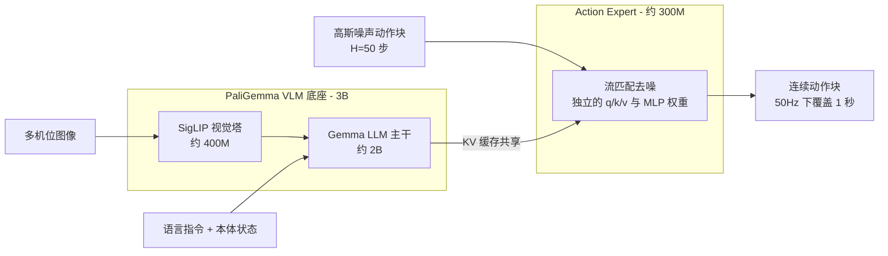
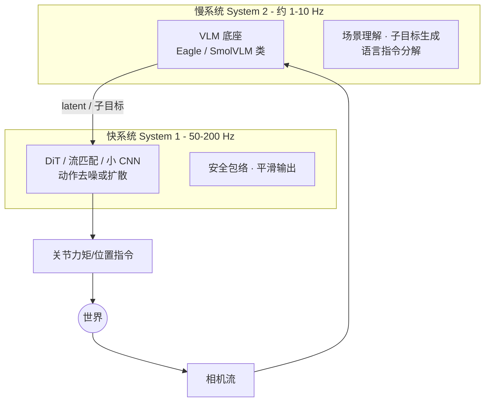

> **系列导航**：前四篇的所有积累在本篇汇流：大模型先验（00）+ 控制分层（01）+ 学习范式（02）+ 感知输入（03）+ 操作技能（04）。VLA（Vision-Language-Action Model）是当前整个领域的主赛道，本篇按时间线讲透架构演进的每一步"为什么"，并深潜 π0 的流匹配数学。

## TL;DR

> **TL;DR 1｜VLA 的定义**：以预训练 VLM 为底座、输出机器人动作的模型。RT-2 的历史性证明：动作可以就是**文本 token**，于是网络级语义知识（"什么是泰勒·斯威夫特"）零成本迁移到控制[1](https://arxiv.org/abs/2307.15818)。

> **TL;DR 2｜架构三大流派**：① 自回归离散 token（OpenVLA/FAST 系：简单、可复用 LLM 全套生态）；② 扩散头（Octo/RDT：多模态表达好）；③ **流匹配头（π0 系：连续动作+少步采样，正在成为新默认）**。分歧本质是"动作该离散还是连续"。

> **TL;DR 3｜双系统成为 2025 共识**：快系统（~50Hz 运动技能）+ 慢系统（Hz 级语义规划），GR00T N1[2](https://arxiv.org/abs/2503.14734)、Helix[3](https://www.figure.ai/news/helix)、Gemini Robotics[4](https://arxiv.org/abs/2503.20020)不约而同收敛到这一拓扑——与第 01 篇的分层控制遥相呼应，只是每一层都换成了学习出来的模块。

## 目录

- [1. 前史：把 Transformer 装进机器人](#1-前史把-transformer-装进机器人)
  - [1.1 Gato：一切皆序列](#11-gato一切皆序列)
  - [1.2 RT-1：Robotics Transformer 与数据工程范本](#12-rt-1robotics-transformer-与数据工程范本)
- [2. 2023 年的两个关键跳跃](#2-2023-年的两个关键跳跃)
  - [2.1 PaLM-E：把世界塞进 LLM 的上下文](#21-palm-e把世界塞进-llm-的上下文)
  - [2.2 RT-2：动作即 token](#22-rt-2动作即-token)
- [3. 开源化浪潮：OXE → Octo → OpenVLA](#3-开源化浪潮oxe-octo-openvla)
  - [3.1 Open X-Embodiment：给机器人界造「普通话」](#31-open-x-embodiment给机器人界造普通话)
  - [3.2 Octo：通用目标接口与扩散头](#32-octo通用目标接口与扩散头)
  - [3.3 OpenVLA：7B 开源的性价比之王](#33-openvla7b-开源的性价比之王)
- [4. Physical Intelligence π 系列：流匹配登基](#4-physical-intelligence-π-系列流匹配登基)
  - [4.1 为什么不用自回归 token](#41-为什么不用自回归-token)
  - [4.2 架构解剖：VLM 底座与 Action Expert 的混合注意力](#42-架构解剖vlm-底座与-action-expert-的混合注意力)
  - [4.3 流匹配深度推导：velocity field 视角](#43-流匹配深度推导velocity-field-视角)
  - [4.4 训练配方与部署工程](#44-训练配方与部署工程)
  - [4.5 π0.5：走向开放世界](#45-π05走向开放世界)
  - [4.6 FAST：自回归派的反击](#46-fast自回归派的反击)
- [5. 双系统时代：GR00T N1 / Helix / Gemini Robotics](#5-双系统时代gr00t-n1-helix-gemini-robotics)
  - [5.1 GR00T N1：DiT 动作头与频率解耦](#51-gr00t-n1dit-动作头与频率解耦)
  - [5.2 Helix：S1/S2 的延迟-带宽账本](#52-helixs1s2-的延迟-带宽账本)
  - [5.3 Gemini Robotics：语义底座加动作解码器](#53-gemini-robotics语义底座加动作解码器)
- [6. 中国力量与差异化路线](#6-中国力量与差异化路线)
- [7. 世界模型线：另一条通往通用的路](#7-世界模型线另一条通往通用的路)
  - [7.1 DreamerV3：RSSM 世界模型的目标函数](#71-dreamerv3rssm-世界模型的目标函数)
  - [7.2 Genie：从视频里学出「潜动作」](#72-genie从视频里学出潜动作)
  - [7.3 NVIDIA Cosmos：Physical AI 的合成数据工厂](#73-nvidia-cosmosphysical-ai-的合成数据工厂)
  - [7.4 两条落地路径：策略评测器与数据引擎](#74-两条落地路径策略评测器与数据引擎)
- [8. 架构三大流派总表（2025 中视角升级版）](#8-架构三大流派总表2025-中视角升级版)
- [9. 微调实战：LeRobot 工作流与 SmolVLA](#9-微调实战lerobot-工作流与-smolvla)
  - [9.1 LeRobot 五步工作流](#91-lerobot-五步工作流)
  - [9.2 SmolVLA：450M 的够用主义](#92-smolvla450m-的够用主义)
  - [9.3 微调配方速查表](#93-微调配方速查表)
- [10. 结语：三线合流](#10-结语三线合流)
- [Lab Exercises](#lab-exercises)
- [参考文献与延伸阅读](#参考文献与延伸阅读)

## 1. 前史：把 Transformer 装进机器人

### 1.1 Gato：一切皆序列

**Gato**（DeepMind, 2022）把所有任务统一成一个接口：文本、图像、按钮按下、关节力矩……全部序列化为 token，喂给同一个 transformer 打通 600+ 任务（打字幕、对话、操纵机械臂、玩 Atari……），证明"序列建模"是通用接口[5](https://arxiv.org/abs/2205.06175)。但它在机器人任务上表现平平——问题不在架构而在**数据**：机器人演示既稀少又异构，序列建模的红利兑现不了。Gato 留下的真正遗产是一个悬而未决的问题：*如果给足数据，同一套架构能不能直接学会控制？*

### 1.2 RT-1：Robotics Transformer 与数据工程范本

回答这个问题的是 **RT-1**（Google, 2022）。它的论文标题就叫 *Robotics Transformer*——结论先记住：**架构上没有发明任何新东西，真正的创新是把互联网级的"数据工程纪律"搬进了机器人实验室**：13 万条真机演示、700+ 任务指令、13 台机器人、17 个月、多栋厨房建筑的不间断采集，换来 97% 的训练任务成功率与对未见物体/背景/光照的强鲁棒性（对未见任务的成功率约为此前已发表方法的 3 倍，摘要口径）[6](https://arxiv.org/abs/2212.06817)。

#### 架构四件套

RT-1 只有约 35M 参数、推理 3Hz——刻意做小做快，因为控制的瓶颈是频率而不是容量。数据流如下：

1. **图像 token 化（EfficientNet）**：ImageNet 预训练的 EfficientNet[28](https://arxiv.org/abs/1905.11946) 作为视觉骨干，把相机帧编码为空间特征图。与后来 ViT 化的 VLA 不同，RT-1 用的是 CNN——2022 年这是"便宜、稳、好微调"的选择。
2. **FiLM 条件化（语言注入视觉）**：指令由 Universal Sentence Encoder[29](https://arxiv.org/abs/1803.11175) 编码为向量 \(c\)，在每个卷积块后做逐通道仿射变换：

$$
\text{FiLM}(h_i) = \gamma_i(c) \odot h_i + \beta_i(c)
$$

   其中缩放 \(\gamma_i\) 与偏移 \(\beta_i\) 由 \(c\) 经线性映射生成。FiLM[26](https://arxiv.org/abs/1709.07871) 的意义在于：**"往哪里看、看什么特征"由指令决定**——同样是"把杯子挪过去"，"轻轻放下"和"扔进去"会调制出不同的视觉表征。这比"视觉和语言最后才拼接"的方案耦合深得多。
3. **TokenLearner 空间压缩**：每张特征图用学习出的空间注意力池化压缩成仅 8 个 token[27](https://arxiv.org/abs/2106.11297)——比 ViT 的几百个 patch 少一个数量级，Transformer 的序列长度由此可控，3Hz 推理才有余量。
4. **Transformer 主干 + 因果掩码**：训练时对整条演示轨迹做 teacher forcing（每个时刻都预测下一时刻动作，损失处处生效）；在线推理时天然因果，单次前向出一个动作。本体状态（关节角度、夹爪开合）也 token 化拼进序列。

#### 动作离散化 bins

以 Fractal 平台为例，动作为 11 维：手臂末端增量位姿与夹爪模式（7 维）、移动底盘（3 维）、终止标志（1 维）。每一维**均匀切成 256 个 bin**，模型输出 \(11 \times 256\) 的 softmax 逐维取 argmax。这个"动作 = 分类问题"的设计此后被 RT-2、OpenVLA 全盘继承，成为自回归 VLA 的标准动作接口。

#### 它证明了什么、缺什么

RT-1 证明了：**规模化真机数据 + Transformer 序列建模 = 可泛化的操作技能**。但它没有利用任何语言模型先验——FiLM 里注入的只是句子编码器的浅层语义。"网络知识能不能迁移到控制"这个问题，要等一年后的 RT-2 来回答。

## 2. 2023 年的两个关键跳跃

### 2.1 PaLM-E：把世界塞进 LLM 的上下文

Google 把图像/状态等连续模态作为 token 注入 PaLM，得到 562B 参数的多模态 LLM，能做视觉问答式的规划（"把抽屉拉开后里面是什么颜色的薯片？"）[7](https://arxiv.org/abs/2303.03378)。它证明了：**embodied 数据不会损害语言能力，反而随规模出现正迁移**——为 RT-2 扫清了心理障碍。

这个结论在今天看来平淡无奇，在当时却是关键的心理障碍：社区普遍担心机器人数据的"低质量"会污染精心预训练的语言能力（灾难性遗忘）。PaLM-E 的正迁移曲线给了所有人信心：**embodied 不是 LLM 的下游应用，而是它的另一种语料**。

### 2.2 RT-2：动作即 token

RT-2（Google DeepMind, 2023）做了一个极简而深刻的替换：**把动作当成一种外语**。模型仍是标准 VLM，只是词表里多了"动作词"，解码出来的不再是文字而是机器人指令[1](https://arxiv.org/abs/2307.15818)。

$$
\text{Co-fine-tune:} \quad \underbrace{\mathcal{D}_{web}}_{\text{互联网图文}} \cup \underbrace{\mathcal{D}_{robot}}_{\text{真机轨迹}} \longrightarrow \pi_\theta(\,\text{tokens}\,)
$$

底座直接取自家最强 VLM：PaLI-X（55B）与 PaLM-E（12B），在 web 图文 + 机器人轨迹的混合数据上共同微调。

#### 2.2.1 动作 token 化的数学

连续动作到 token 的双向映射：

$$
b_j = \mathrm{clip}\!\left(\mathrm{round}\!\left(\frac{a_j + 1}{2} \times 255\right),\ 0,\ 255\right),
\qquad
\hat{a}_j = \frac{2\,b_j}{255} - 1
$$

其中 \(a_j \in [-1,1]\) 是归一化后的第 \(j\) 维动作，\(b_j\) 是 bin 序号。每维 256 级意味着量化分辨率 \(\Delta = 2/255 \approx 0.0078\)——对毫米级的末端增量已经足够。以主力平台的 8 维动作为例，词表新增 \(8 \times 256\) 个专用嵌入（各平台维度略有差异），推理时模型逐个解码动作 token，控制频率 1–3Hz。

三个值得咀嚼的设计决策：

1. **复用而非新建**：动作 token 走 LLM 原生的 embedding 层和 softmax 输出头，不添加任何新模块——这是"零架构成本接入语义先验"的关键；
2. **256 而非更多 bin**：词表预算与分辨率的折衷；bin 太多会让 softmax 变得尖锐难训；
3. **逐 token 解码天然支持任意动作维度数**：换个机器人只是换一组维度数，接口不变。

#### 2.2.2 Co-fine-tuning：两份数据的化学作用

RT-2 的消融揭示了混合训练的真实收益结构：

- **只用机器人数据微调**：控制学得好，但网络知识迅速遗忘——涌现能力大幅退化；
- **web + robot 共同微调（co-fine-tuning）**：两者兼得，且部分评测中机器人成功率本身也更高——web 数据起到了正则器的作用，防止模型把"看"和"动"的记忆割裂；
- **数据配比**：robot 数据占比下降也不崩（底座越大越明显），说明语义先验一旦保住，控制是"薄薄一层适配"。

这套"通用数据打底 + 专项数据微调"的配方，就是今天所有 VLA 预训练-后训练两段式流程的原型。

#### 2.2.3 涌现能力清单

RT-2 最著名的发现是**语义能力随底座规模涌现**：同底座的小尺寸变体在这类任务上接近失败，55B 成功率翻倍。论文归纳的涌现类别：

| 能力类别 | 指令示例（意译） | 需要的网络知识 |
|---------|----------------|--------------|
| 语义概念 | "把可乐挪到泰勒·斯威夫特的照片旁" | 人物识别 + 物体对应 |
| 符号理解 | "把恐龙挪到数字最小的物体旁" | OCR + 数值比较 |
| 人物偏好 | "帮我拿我常配早餐的那种饮料" | 生活常识关联 |
| 视觉推理 | "指出桌上能用来捡起纸杯的东西" | 功能可供性（affordance） |

这些任务没有任何一条机器人演示直接教过——它们是**网络知识的免费外溢**。这正是 VLA 相对传统 BC 策略的本质优势：你买的不是策略，是策略 + 一个看过整个互联网的世界观。

## 3. 开源化浪潮：OXE → Octo → OpenVLA

| 工作 | 年份 | 关键贡献 | 引用 |
|------|-----|---------|------|
| Open X-Embodiment (RT-X) | 2023 | 21 机构、22 种本体、100 万+ 轨迹统一格式；跨本体训练互相增益 | [8](https://arxiv.org/abs/2310.08864) |
| Octo | 2024 | 完全开源的通用策略：Transformer 骨干 + 扩散头，灵活观测/动作空间，可读 goal 图像 | [9](https://arxiv.org/abs/2405.12213) |
| OpenVLA | 2024 | 7B（Llama2 + DINOv2/SigLIP 双视觉塔），动作离散 256 bins；LoRA 微调友好；970k OXE 轨迹训练 | [10](https://arxiv.org/abs/2406.09246) |

### 3.1 Open X-Embodiment：给机器人界造「普通话」

NLP 有 Common Crawl，机器人学界此前只有一堆互不兼容的私有数据集。OXE 把 21 家机构的 100 万+ 条轨迹、22 种本体汇成统一格式[8](https://arxiv.org/abs/2310.08864)。组成（节选示意，完整清单见原文附录）：

| 数据集 | 主导机构 | 本体 | 动作空间特点 | 规模量级 |
|--------|---------|------|-------------|---------|
| Fractal | Google | 移动双臂操作台（EDR 系） | 末端增量 + 底盘 + 终止，11 维 | 约 13 万条 |
| BridgeV2 | UC Berkeley | WidowX-250 单臂 | 末端位姿增量 + 夹爪，7 维 | 6 万+ 条 |
| Berkeley Autolab UR5 | UC Berkeley | UR5 单臂 | 末端位置 + 夹爪 | 千级 |
| BC-Z | Google/Berkeley | Jaco、EDR 等混合 | 遥操作技能数据 | 万级（待核实） |
| Kuka | Google | KUKA iiwa | 目标相对位姿类 | 万级（待核实） |
| RoboTurk | Stanford | 双臂 Franka | 双臂联合高维 | 万级（待核实） |

**难点从来不在"合并文件"，而在动作空间的异构性**：末端速度 vs 关节位置、7 维 vs 14 维、弧度 vs 米——直接混训等于让模型同时学十种"方言"。RT-X 的方案朴素而有效：

$$
\hat{a}_j^{(d)} = \mathrm{clip}\!\left(\frac{2\,(a_j - m_j^{(d)})}{M_j^{(d)} - m_j^{(d)}} - 1,\ -1,\ 1\right)
$$

即**逐数据集 \(d\)、逐维度 \(j\) 用统计极值 \((m_j^{(d)}, M_j^{(d)})\) 归一化到 \([-1,1]\)**，训练时把不足最大维数的动作零填充并对损失加掩码，部署时再逆映射回该本体的原生单位与量纲。"跨 embodiment 泛化"的第一性难题其实是数据格式的统一。

回报立竿见影：RT-1-X（RT-1 架构 + OXE 重训）在多数成员数据集上显著超越各自的专项模型，平均带来约 50% 的性能提升；RT-2-X 在涌现技能评测上翻倍[8](https://arxiv.org/abs/2310.08864)。**跨本体数据不是稀释而是增益**——这一反直觉结论是 OXE 最大的学术贡献。

### 3.2 Octo：通用目标接口与扩散头

Octo（Berkeley 等, 2024）是完全开源的通用策略（权重 + 训练代码 + JAX 实现），在约 80 万条 OXE 轨迹（以 Bridge/Fractal 为主）上训练[9](https://arxiv.org/abs/2405.12213)：

- **通用目标接口**：任务既可以由语言定义，也可以由一张 goal 图像定义——两种条件都以 readout token 的形式注入 Transformer 序列，模型无需改架构就能切换任务类型；
- **灵活观测**：腕部相机 + 全局相机 + 本体状态可选组合，缺哪路就少读哪组 token；
- **扩散动作头**：骨干输出特征后，由 DDPM 式扩散头（cosine 噪声调度）去噪出动作块——这是它区别于 RT 系的关键：**扩散头天然表达多模态动作分布**（同一个路口既能左转也能右转，MSE 会输出"原地撞墙"的平均动作，第 04 篇 Diffusion Policy[35](https://arxiv.org/abs/2303.04137) 已详细推导）；
- **规模克制**：small/base 分别只有约 27M/93M 参数，刻意证明"数据多样性比参数堆砌优先"；
- **微调友好**：冻结主干、只训 readout 与动作头即可适配新本体，参数高效。

Octo 的历史角色是"开源世界的 RT-1"：在 OpenVLA 出现之前，它是学术界唯一玩得起的全套通用策略参考实现。

### 3.3 OpenVLA：7B 开源的性价比之王

OpenVLA（Stanford/Berkeley 等, 2024）把"开源通用 VLA"推到了实用线：7B 参数，970k 条 OXE 真机轨迹训练，在 29 项评测中以 7 倍小的参数量取得对 RT-2-X-55B 平均约 16.5% 的绝对成功率优势，消费级 RTX 4090 上推理 6Hz[10](https://arxiv.org/abs/2406.09246)。

**Prismatic 底座与双视觉编码器**。OpenVLA 基于 Prismatic VLM 工具链构建[31](https://arxiv.org/abs/2402.07865)：Llama-2-7B 作语言主干，视觉侧采用**双塔融合**——

- **DINOv2 ViT-L/14**[32](https://arxiv.org/abs/2304.07193)：自监督蒸馏，擅长空间细节与几何结构（"杯子边缘在哪里"）；
- **SigLIP ViT-SO400M**[33](https://arxiv.org/abs/2303.15343)：图文对比学习，擅长语义对齐（"这是一个可以抓的把手"）。

两塔的 patch 特征在通道维拼接后经小型 MLP 投影进 LLM 词嵌入空间（Prismatic fused 配方）。为什么要双塔？因为操作任务对视觉的需求是分裂的：抓取需要 DINOv2 式的像素级几何，指令跟随需要 SigLIP 式的概念级语义——单塔只能偏科。

**动作接口**：与 RT-2 相同的 256-bin 方案，每维一个专用 token，next-token prediction 直接产出，无动作分块（chunk）——这也埋下了它的频率瓶颈（见第 4 节）。

**LoRA 微调工程**。OpenVLA 的实用价值在于微调成本：单张 A100 用 LoRA[34](https://arxiv.org/abs/2106.09685) 即可在自有小数据上适配新机器人，这让高校实验室第一次玩得起基础模型。微调配方（示意）：

```python
# 基于 openvla 官方 repo（GitHub: openvla/openvla，未本地验证）
from peft import LoraConfig
lora_cfg = LoraConfig(r=32, lora_alpha=16,
                      target_modules=["q_proj","k_proj","v_proj","o_proj"])
# 冻结 7B 底座, 只训 LoRA 分支: 显存 ~40GB, 单 A100 可跑
```

工程要点：bf16 混合精度；rank 32 挂在全部注意力投影上即可（FFN 不必动）；数小时量级收敛；LoRA 权重只有几十 MB，方便分发与叠加。

**遗留短板**：自回归逐步解码 + 无分块，控制频率天花板明显——这正是下一节 π0 要解决的问题。

## 4. Physical Intelligence π 系列：流匹配登基

### 4.1 为什么不用自回归 token

自回归方案的两个痛点：① 每个动作维一个 bin，长动作块推理慢（控制频率上不去）——一个 \(H{=}50\) 步、7 维的动作块需要 350 次串行解码；② 离散化丢失连续微操精度。π0 的答案：**VLM 只管"想"，动作专家专管"动"**。

架构：PaliGemma VLM（3B）处理图文[30](https://arxiv.org/abs/2407.07726) → 动作专家（约 300M 的独立权重块）通过 cross-attention 复用 VLM 的 KV 缓存，输出**连续动作块** \(a_t \in \mathbb{R}^{H\times d_a}\)（\(H{=}50\) 步，50Hz 下 1 秒）[11](https://arxiv.org/abs/2410.24164)。

### 4.2 架构解剖：VLM 底座与 Action Expert 的混合注意力



**混合注意力机制**（Mixture-of-Transformers 风格）是 π0 最精巧的工程设计：同一组 Transformer 层里维护**两套权重**——VLM token（图文前缀）走 Gemma 的权重，噪声动作 token 走专家的小宽度权重（隐藏维约为主干的一半，openpi 参考实现口径）；两类 token 在注意力计算中互相可见，等效于动作专家对 VLM 的全部中间表征做交叉注意，但不需要单独搭一条 cross-attention 通路。

这个设计带来一个关键的推理经济学：**图文前缀每个观测窗口只前向一次，其 KV 缓存在整个流匹配积分过程中复用**；每一步去噪只需要前向约 300M 的专家部分。实时性的账就是这么省出来的。

参数分配一览：

| 模块 | 参数量（约） | 角色 |
|------|:---:|------|
| SigLIP 视觉塔 | 400M | 图像 → patch 特征 |
| Gemma LLM 主干 | 2B | 语义理解、世界知识、子任务推理 |
| Action Expert | 300M | 流匹配速度场 \(v_\theta\) |
| 合计 | 3.3B | 语义容量与控制频率的折衷点 |

### 4.3 流匹配深度推导：velocity field 视角

Flow Matching[36]（数学起源见 Lipman et al., ICLR 2023，延伸阅读）学习一个时变速度场，定义常微分方程 \(\frac{dx}{dt} = v_\theta(x, t)\)，把噪声分布"搬运"到数据分布。以下按五步把 π0 的训练目标从零推出。

**第一步：构造条件概率路径。** 取最简单的线性插值路径，\(t\in[0,1]\)，\(t{=}0\) 对应数据、\(t{=}1\) 对应噪声：

$$
x_t = (1-t)\,x_0 + t\,\epsilon, \qquad x_0\sim p_{data},\ \epsilon\sim\mathcal N(0,I)
$$

沿该路径的真实速度对时间求导（一步链式法则，\(x_0\) 与 \(\epsilon\) 视为常数）：

$$
\frac{d x_t}{dt} = \epsilon - x_0
$$

**第二步：写出条件回归目标。** 训练目标即回归这个速度场（条件于观测 \(o\)）：

$$
L_{FM} = \mathbb{E}_{t,x_0,\epsilon}\left[\big\|\,v_\theta(x_t,\ t,\ o) - (\epsilon - x_0)\,\big\|^2\right]
$$

**第三步：为什么回归"条件速度"就等于学到"边际速度"？** 这是 Flow Matching 定理的核心。MSE 的最优解是条件期望：

$$
v^*(x, t) = \mathbb{E}\big[\,\epsilon - x_0 \;\big|\; x_t = x\,\big]
$$

而连续正规化流（CNF）理论给出的边际速度场恰好就等于这个条件期望（对 \(p(x_0,\epsilon\mid x_t)\) 取期望后与边际概率流 ODE 的速度逐点一致）。于是有 \(\nabla_\theta L_{FM} = \nabla_\theta L_{CFM}\)：**逐点回归条件速度的梯度，就是回归真实边际场的梯度**——我们永远不需要知道边际场本身。这就是 Conditional Flow Matching 能工作的全部数学理由。

**第四步：为什么直线路径采样便宜。** 给定一对 \((x_0,\epsilon)\)，线性插值的速度沿途恒定——欧拉离散误差主要来自速度场在区间内的变化量。直线 + 近似恒定的速度意味着约 10 步欧拉积分就能到达数据流形，比 DDPM 的上百步去噪便宜一个数量级；Rectified Flow 进一步表明，对直线路径反复 reflow 可以把步数压到 1–2 步（延伸阅读）。

**第五步：推理方向与时间采样。** 注意方向约定：生成是从 \(t{=}1\)（纯噪声）积分到 \(t{=}0\)（数据），欧拉更新为 \(x \leftarrow x - v_\theta(x,t)\cdot\Delta t\)。另外训练时的 \(t\) 并非严格均匀采样——π0 采用偏向难区间的偏斜分布（openpi 参考实现用 \(\mathrm{Beta}(1.5, 1)\)，具体参数待核实），让容量花在靠近纯噪声端的高误差区域。

变量映射：

| 符号 | 代码变量 | Shape | 说明 |
|---:|:---|:---:|:---|
| \(x_0\) | `clean_action` | `(B, H, d_a)` | 专家动作块 |
| \(\epsilon\) | `noise` | `(B, H, d_a)` | 高斯噪声 |
| \(x_t\) | `noisy_action` | `(B, H, d_a)` | 插值中间态 |
| \(v_\theta\) | `action_expert` | `(B,H,d_a)→(B,H,d_a)` | 条件于 VLM 特征 |
| \(t\) | `time` | `(B,)` | 连续（区别于扩散的整数步） |

```python
import torch
B, H, Da = 8, 50, 32                      # π0: H=50 步动作块
x0   = torch.randn(B, H, Da)              # 专家动作（示意）
eps  = torch.randn(B, H, Da)
t    = torch.rand(B, 1, 1)                # 连续时间 U[0,1]
xt   = (1 - t) * x0 + t * eps             # 线性插值路径
v_target = eps - x0                       # dx/dt = ε - x₀
loss = torch.nn.functional.mse_loss(v_net(xt, t, obs_emb), v_target)
# 推理: x=x1(噪声) 出发, for i in range(N): x += v(x, t_i, emb) * dt
# 注意方向: t 从 1 积分到 0, 故 dt 为负; VLM 前缀 KV 只算一次全程复用
```

与 DDPM 的定位对照：

| | DDPM（ε-prediction） | Flow Matching（v-prediction） |
|--|---------------------|------------------------------|
| 加噪路径 | Markov 链式加噪 | 直线插值 |
| 训练目标 | 预测所加噪声 \(\epsilon\) | 预测速度 \(\epsilon - x_0\) |
| 采样形式 | SDE 或概率流 ODE，数十至上千步 | ODE，约 10 步 |
| 路径曲率 | 大（调度依赖） | 小（可再 reflow 拉直） |

### 4.4 训练配方与部署工程

π0 论文披露的配方值得整段抄录在笔记本上[11](https://arxiv.org/abs/2410.24164)：

- **预训练**：7 种机器人构型、68 个任务、超过 10000 小时的灵巧操作数据（真机遥操作为主），目标就是上面的 FM 损失——广度来自这里；
- **后训练**：切换到窄而精的高质量数据（如叠衣服）继续训练——流畅度来自这里。「广度靠预训练、精度靠后训」的两段式，与 LLM 的 SFT 哲学同构；
- **部署**：50Hz 控制，每次推理输出 \(H{=}50\) 的动作块，滑动窗口式重规划衔接块间过渡；KV 缓存复用使单卡 GPU 即可实时运行；
- **效果**：在开箱即用与微调两类评测中均优于 OpenVLA、Octo、RDT 等基线（摘要口径）。

另一个容易被忽略的设计空间：π0 支持给高频低层子系统（如移动底盘）配**离散 token 头**，与连续动作块并行输出——连续块管灵巧手，离散 token 管轮子，各取所长。

### 4.5 π0.5：走向开放世界

π0.5（2025）解决的问题是：预训练再广，部署环境永远是"没见过的厨房"。三个关键改动[13](https://arxiv.org/abs/2504.16054)：

1. **分层化**：高层就是 VLM 本身，直接生成文本形式的子目标（"打开橱柜" → "取出盘子" → …），低层沿用 π0 式流匹配专家执行子目标——语言成了层间的通用接口；
2. **异构共训**：网络多模态数据、多机器人数据、带子目标标注的数据放在同一个混合里训练，高层低层共享底座；
3. **Knowledge Insulation（知识绝缘）**：子目标预测的损失正常更新 VLM 主干，但低层动作损失的梯度被隔离、不回传进 VLM——防止海量低层数据冲刷掉网络知识。这是对 RT-2 时代"co-fine-tuning 保语义"经验的形式化升级。

结果是 VLA 第一次在**完全陌生的真实家庭**中完成多阶段长程任务（整理房间级别的开放式指令）——开放世界泛化的标志性里程碑。

### 4.6 FAST：自回归派的反击

Physical Intelligence 自己也补了自回归路线的短板。FAST（2025）的洞察：连续动作在时间轴上高度平滑，逐维独立做 256-bin 是信息论上的浪费——相邻时间步几乎携带相同的信息。它的流水线[12](https://arxiv.org/abs/2501.09747)：

1. **DCT 压缩**：对动作块的每一维沿时间轴做离散余弦变换，能量集中到少数低频系数；
2. **固定网格量化**：对 DCT 系数用固定量化网格转成整数；
3. **BPE 合并**：把系数序列当文本，训练 BPE 词表把反复出现的"子轨迹母题"合并成单个 token——序列长度最多缩短至原来的十几分之一，**训练效率提升约 14 倍**（摘要口径），π0-FAST 以纯自回归方式匹敌扩散版 π0 的表现，且推理延迟大幅下降。

两条技术路线的竞争远未终结。FAST 的深层启示是：**"自回归 vs 扩散"之争本质上是"tokenizer 质量"之争**——只要 token 化做得足够聪明，LLM 的全套生态（scaling law、RL 后训练、上下文学习）就能重新杀回高频控制。

## 5. 双系统时代：GR00T N1 / Helix / Gemini Robotics



| 系统 | 快系统设计 | 慢系统底座 | 特色 | 引用 |
|------|-----------|-----------|------|------|
| GR00T N1 (NVIDIA) | DiT 扩散头，"Flattened Action Tokens" | Eagle VLM | 全开源权重+仿真数据管线 | [2](https://arxiv.org/abs/2503.14734) |
| Helix (Figure) | S1: 80M 小 CNN，200Hz | S2: 7B VLM，7-9Hz | 上身 35 DoF 全 VLA 控制，家用场景部署 | [3](https://www.figure.ai/news/helix) |
| Gemini Robotics (DeepMind) | 动作解码器（ALOHA 类双臂验证） | Gemini 2.0 | 强调 zero-shot 本体迁移与物理交互推理 | [4](https://arxiv.org/abs/2503.20020)；1.5 版 [14](https://arxiv.org/abs/2510.03342) |

三家不约而同的架构选择不是巧合：VLM 前向太慢（物理约束），而小网络又缺语义——**只有异构分工能同时满足两个时钟域**。

### 5.1 GR00T N1：DiT 动作头与频率解耦

GR00T N1（NVIDIA, 2025）是总参约 2B 的开源人形基础模型[2](https://arxiv.org/abs/2503.14734)：

- **System 2（慢）**：NVIDIA Eagle 系列 VLM 承担场景理解与指令分解，低频刷新任务表征；
- **System 1（快）**：DiT 扩散动作头，用**流匹配式去噪**生成动作块，输入只有「当前观测 + S2 任务表征」——快系统完全不懂语言，只负责"照着意图伺服"；
- **Flattened Action Tokens**：人形机器人的动作是异构的（手臂关节、末端位姿、躯干、移动底盘各有量纲），N1 把多模态动作展平拼接成统一的 token 序列交给 DiT，一套头处理全身；
- **数据三角**：真机遥操作 + Isaac 仿真合成 + 人类视频（把人的手部运动经潜动作标注迁移给机器人——Genie 式思路，见第 7 节）；
- **彻底开源**：权重与训练框架公开（HuggingFace/GitHub，未本地验证），是目前复现门槛最低的双系统参考。

### 5.2 Helix：S1/S2 的延迟-带宽账本

Helix（Figure, 2025）把双系统的工程账算得最透明[3](https://www.figure.ai/news/helix)：

| 维度 | S2（慢系统） | S1（快系统） |
|------|------------|------------|
| 模型规模 | 7B VLM | 80M 小 CNN |
| 运行频率 | 7–9 Hz | 200 Hz |
| 输入 | 全身相机流 + 自然语言 | 局部子图 + S2 潜向量 |
| 输出 | 语义潜向量 | 上身 35 DoF 连续关节指令 |
| 时钟约束 | 百毫秒级前向延迟可接受 | 必须跟上关节动力学 |

**核心洞察是那条窄带接口**：S2 输出的只是一个数百维、每秒更新不到十次的潜向量——通信带宽近乎为零，却承载了全部任务意图。S1 因此可以完全不理解语言，只学习「跟随潜向量的伺服技能」；两个时钟域通过这条窄带彻底解耦，各自满足各自的物理约束。这与第 01 篇 WBC 的任务优先级分层在拓扑上同构，只是每一层的实现从解析模块换成了学习模块。

训练侧同样反直觉：Helix 未使用任何互联网规模的机器人数据，全部来自低成本遥操作（戴腕部相机的操作台），靠 VLM 的网络先验补语义、靠小模型的偏置补控制——"小数据 + 大先验"路线的代表。

### 5.3 Gemini Robotics：语义底座加动作解码器

Gemini Robotics（DeepMind, 2025）在 Gemini 2.0 之上加装动作解码器构成 VLA，强调 zero-shot 的本体迁移与物理交互推理，在 ALOHA 类双臂平台等配置上验证[4](https://arxiv.org/abs/2503.20020)。1.5 版（2025-10）补齐三件事[14](https://arxiv.org/abs/2510.03342)：**从视频学习新任务**（看演示就会）、显式的 **ER（Embodied Reasoning）中间产物 + thinking 机制**（让"想"的过程可控可审计）、以及面向端侧部署的轻量变体。Google 路线的赌注很清晰：**语义底座的规模红利最终会碾压手工架构优化**。

## 6. 中国力量与差异化路线

- **RDT-1B**（清华等）：1.2B 扩散 Transformer，双语双臂操作，强调扩散头的多模态表达能力[15](https://arxiv.org/abs/2410.07864)；
- **GR-1/GR-2**（字节跳动）：GR-1 用大规模视频生成预训练获得世界知识再接动作头[16](https://arxiv.org/abs/2312.13139)；GR-2 进一步做成 Web 级视频知识预训练的生成式 VLA[38](https://arxiv.org/abs/2410.06158)；
- **RoboFlamingo**（上海AI Lab）：开源 Flamingo 改造的语言条件操作基线[17](https://arxiv.org/abs/2311.01378)；
- **GraspVLA**（银河通用）：十亿级**合成**抓取数据预训练抓取基础模型，"合成数据优先"路线的代表[18](https://arxiv.org/abs/2505.03233)；
- **AgiBot World**（智元）：百台真机数据工厂产出百万级轨迹开源数据集（第 07 篇详述）[19](https://arxiv.org/abs/2503.06669)。

值得注意的是中国团队的差异化选择：RDT 押注扩散头、GraspVLA 押注合成数据、字节押注视频生成先验——都在绕开"纯真机遥操作数据军备竞赛"这张 Google/Figure 定义牌桌。

## 7. 世界模型线：另一条通往通用的路

VLA 学的是"看到 X 做 Y"的反应式映射；世界模型学的是 \(p(s_{t+1}|s_t,a_t)\)——**可想象、可规划、可评测**。这条线的祖师爷是 Ha & Schmidhuber 的《World Models》（VAE + MDN-RNN + 小控制器，2018）[36](https://arxiv.org/abs/1803.10122)，现代形态如下。

### 7.1 DreamerV3：RSSM 世界模型的目标函数

DreamerV3（Danijar Hafner 等, 2023）用同一套超参横扫 150+ 任务，并首次在不依赖人类数据的情况下在 Minecraft 采到钻石[20](https://arxiv.org/abs/2301.04104)；其前身 DayDreamer 直接在四个真实机器人上在线学习，数小时内学会行走[21](https://arxiv.org/abs/2206.14176)。

**RSSM 循环单元**（Recurrent State-Space Model）三件套：

$$
h_t = f_\phi(h_{t-1}, z_{t-1}, a_{t-1}), \qquad
\hat{z}_t \sim p_\phi(\hat{z}_t \mid h_t), \qquad
z_t \sim q_\phi(z_t \mid h_t, o_t)
$$

确定性隐状态 \(h_t\) 负责记忆，随机隐变量分两支：**先验** \(\hat z_t\)（不看当前观测，想象用）与**后验** \(z_t\)（看了观测，重建用）。解码头从 \((h_t, z_t)\) 重构观测、预测奖励 \(r_t\) 与延续标志 \(c_t\)。世界模型的目标函数：

$$
\mathcal{L}_{WM} = \mathbb{E}\Big[-\log p(o_t \mid h_t, z_t) - \log p(r_t \mid h_t, z_t) - \log p(c_t \mid h_t, z_t) + \beta\,\mathrm{KL}\big(q_\phi(z_t \mid h_t, o_t)\ \big\|\ \mathrm{sg}[p_\phi(\hat z_t \mid h_t)]\big)\Big]
$$

三项重构/预测损失 + 一项先验后验的 KL 正则。两个跨域稳定性的工程细节：KL 带 **free bits**（低于阈值的 KL 不施罚，防止后验坍缩成先验的复读机）与 **KL balancing**（先验、后验用不同的学习率系数）；奖励等信号统一过 **symlog 编码** \(\mathrm{sign}(x)\log(1+|x|)\)，把跨任务相差多个数量级的 reward 压到同一尺度——这就是"一套超参打天下"的秘密所在。

**想象中训练 actor-critic**：从后验播种初始状态，之后完全用先验 roll-out 想象轨迹，critic 学 \(\lambda\)-return，actor 沿想象轨迹优化——策略梯度穿过世界模型继续回传（Dreamer 系的特色）。真实环境的交互只用来收集数据、更新世界模型本身。

### 7.2 Genie：从视频里学出「潜动作」

Genie（DeepMind, 2024）从**无标注视频**学习"可玩的"世界模型[22](https://arxiv.org/abs/2402.15391)：潜动作模型在相邻帧之间推断一个 8 选 1 的离散潜动作 \(z_a\)，动力学模型据（当前帧， \(z_a\)）预测下一帧。训练完成后，任何视频都变成了可以用潜动作操控的交互环境。意义在于：**人类视频里蕴含着海量的"动作语法"**，Genie 式的潜动作标注把它变成可用的预训练信号——GR00T N1 的人类视频管线正是同一思想的工程化。

### 7.3 NVIDIA Cosmos：Physical AI 的合成数据工厂

NVIDIA Cosmos（2025）定位为"Physical AI 的世界基础模型平台"[23](https://arxiv.org/abs/2501.03575)：

- **视频 tokenizer 族**：连续与离散两类，按时空 patch（如 8×8×8）压缩视频，是生成与检索的统一货币；
- **WFM 家族**：Text2World / Video2World 等世界基础模型，从文本或视频出发生成物理合理的未来；
- **用途定位**：为机器人与自动驾驶提供可后训练定制的合成数据基础设施——NVIDIA 口中的"Physical AI 的 ChatGPT 时刻"。

### 7.4 两条落地路径：策略评测器与数据引擎

世界模型与 VLA 并非对立，目前有两条清晰的合流路径：

1. **当评测器**：在世界模型的潜空间里 roll-out 候选策略，离线筛选后再上真机。TD-MPC2 已示范雏形——模型预测控制直接跑在世界模型的潜空间[24](https://arxiv.org/abs/2310.16828)。优点是不碰真机、可大规模并行；代价是**模型偏差**：想象中的成功不等于现实的成功，评测结论的可信度受限于世界模型本身的保真度；
2. **当数据引擎**：生成边缘场景与合成轨迹扩充 VLA 训练集——Cosmos 的定位、GraspVLA 的十亿级合成抓取[18](https://arxiv.org/abs/2505.03233)、GR00T 的仿真数据三角都属于此路。代价是 sim-to-real 分布差，需要域随机化（第 02 篇）与真实数据锚定（第 07 篇）配合。

一句话总结这条线：**VLA 负责"怎么做"，世界模型负责"做了会怎样"**——前者是肌肉记忆，后者是想象力，通用的最后一块拼图大概率是两者的合体。

## 8. 架构三大流派总表（2025 中视角升级版）

| 维度 | 自回归 token | 扩散头 | 流匹配头 |
|------|-------------|--------|---------|
| 代表模型 | RT-2、OpenVLA、π0-FAST、GR-2 | Diffusion Policy、Octo、RDT-1B、GR00T N1 | π0/π0.5、SmolVLA |
| 动作表示 | 离散 bin token 序列 | 连续动作块 + 噪声迭代去噪 | 连续动作块 + 速度场积分 |
| 动作空间假设 | 可离散化、分辨率受 bin 数限制 | 连续、允许多峰 | 连续、偏好平滑分布 |
| 训练目标 | 交叉熵（next-token） | 去噪 MSE（DDPM 族） | 速度场回归 MSE |
| 多模态分布 | 差（模式坍缩风险） | 好 | 好 |
| 推理延迟 | 高（逐 token 串行解码） | 中（N 步全网络前向） | 低（约 10 步积分，KV 复用更低） |
| 输出粒度 | 单步为主（OFT 后可分块） | 长动作块 | 长动作块（如 H=50） |
| 高频控制适配 | 差 → FAST 后可用 | 好 | 好 |
| 可复用 LLM 生态 | ★★★ | ★ | ★★ |
| 连续控制精度 | 受 bin 分辨率限（256 级每维） | 高 | 高 |

判读要点：

1. **没有全能流派**——自回归赢在生态与语义耦合（动作天然接 RL/对话/规划），扩散与流匹配赢在控制物理（频率、平滑、多峰）；
2. **边界正在溶解**：FAST 用更好的 tokenizer 把自回归拉回牌桌，π0 用 KV 复用把扩散系的速度优势内化，OpenVLA-OFT 干脆给自回归装上连续头——三派在互相抄作业；
3. **2025 年的默认答案**：语义重的任务（长程、指令复杂）选自回归底座 + 快动作头；频率敏感的任务（灵巧装配、双臂协同）选流匹配/扩散动作块。

## 9. 微调实战：LeRobot 工作流与 SmolVLA

### 9.1 LeRobot 五步工作流

LeRobot（HuggingFace）是当前事实标准的开源机器人学习库（GitHub: huggingface/lerobot，未本地验证），API 与 CLI 迭代很快，以下步骤以官方 README 为准：

1. **环境**：安装 `lerobot`；硬件支持 SO-ARM100/101、Koch、ALOHA 等开源臂套件，仿真内置 PushT、ALOHA sim 等 gym 环境；
2. **数据采集**：用 `lerobot-record` 类 CLI 遥操作录制，落盘为 LeRobotDataset 格式——`parquet` 存观测/动作表格 + `mp4` 存多机位视频 + 元数据记录 fps 与 episode 索引；视频懒加载，内存友好；
3. **训练**：配置驱动，一行命令指定 `--policy.type=act / diffusion / smolvla / pi0` 等；断点续训与 W&B 集成齐全。ACT/Diffusion Policy 消费级单卡可训，SmolVLA 450M 亦然；
4. **评估**：内置 rollout 循环在仿真任务上计算成功率，微调前后对比一键可得；
5. **部署**：同一 checkpoint 加载进真机控制循环；SmolVLA 引入的异步推理栈可重叠「执行上一块动作」与「推断下一块」，吞吐显著提升。

数据格式示意（伪代码，版本相关，未本地验证）：

```python
from lerobot.datasets import LeRobotDataset          # 新旧版本模块路径有差异

ds = LeRobotDataset("lerobot/pusht")                  # 一行吃下 Hub 上的社区数据集
sample = ds[0]                                        # dict: image / state / action / episode_index
# 训练入口(CLI): lerobot-train --policy.type=smolvla --dataset.repo_id=...
```

### 9.2 SmolVLA：450M 的够用主义

SmolVLA（HuggingFace, 2025）是 VLA 的"经济舱"：450M 参数，小型 VLM 底座 + 流匹配动作专家（π0 配方的小号版），外加两个实用技巧——视觉 token 压缩（砍冗余 patch）与异步推理（执行与推断重叠）。关键主张：**在 LeRobot 社区数据集上训练，450M 就能逼近乃至反超更大的 VLA**，单张消费级 GPU 可训[25](https://arxiv.org/abs/2506.01844)。它的定位不是刷榜，而是把"微调一个 VLA"的成本压到任何实验室一个下午能完成的量级——入门与快速验证 idea 的默认起点。

### 9.3 微调配方速查表

| 方案 | 底座/规模 | 微调要点 | 硬件门槛 | 适用场景 |
|------|----------|---------|---------|---------|
| OpenVLA + LoRA | 7B | rank 32 挂注意力投影，bf16 | 单卡 A100 | 语义指令丰富、频率要求不高 |
| OpenVLA-OFT | 7B | 并行解码 + 连续动作头 + 分块 | 单卡起 | 要吞吐（论文报告 26–50 倍）与更高成功率[37](https://arxiv.org/abs/2502.19645) |
| SmolVLA | 450M | 全参微调 | 消费级单卡 | 入门、原型、社区数据快速迭代 |
| π0 微调 | 约 3.3B | FM 头继续训 + 窄域高质量后训 | 多卡 | 高频灵巧、长程任务 |

## 10. 结语：三线合流

回望这条演化链：RT-1 证明了**数据工程的杠杆**，RT-2 证明了**语义先验的可迁移**，OXE/OpenVLA 证明了**开源协作能摊平数据成本**，π0 证明了**生成式动作头的物理价值**，GR00T/Helix 证明了**双时钟域分工是落地必需**，世界模型线则在准备第三块拼图——**想象力**。三条线（自回归 token、扩散/流匹配动作头、世界模型）正在彼此吸收对方的核心部件，2026 年的竞争焦点已经不是"哪个架构对"，而是"谁的数据飞轮转得更快"。这也是下一篇开始我们要转向数据、仿真与评测的原因。

## Lab Exercises

1. **流匹配玩具实验**：一维双峰分布（如 \(\frac12\mathcal N(-2,0.1^2)+\frac12\mathcal N(2,0.1^2)\)），用两层 MLP 学 \(v_\theta\)，欧拉积分 10 步采样 1000 个样本画直方图，验证多峰被完整还原——对比直接 MSE 回归的均值坍缩。
2. **OpenVLA LoRA 微调**：官方 repo 提供 BridgeData 微调脚本，单卡 A100/H100 数小时可得适配 checkpoint；没有卡的话改跑 SmolVLA（450M 参数，消费级 GPU 可训，HuggingFace: `lerobot/smolvla_base`，未本地验证）[25](https://arxiv.org/abs/2506.01844)，在 LeRobot 内置仿真任务上对比微调前后成功率。
3. **架构考古报告**：精读 RT-2 论文 §3（动作表示）与 π0 论文 §3.2（action expert），各画一张张量流动图并标注 shape，写 500 字对比笔记——这是面试高频题。
4. **Helix 延迟-带宽预算题**：设 S2 为 7B VLM 以 8Hz 在云端 GPU 运行，S1 为 80M CNN 以 200Hz 机载运行；估算两者的每秒 FLOPs 量级，并假设潜向量为 512 维 fp16 计算 S1→S2 接口的带宽需求（MB/s 级别）。据此论证：为什么"窄带潜接口"是双系统能在同一具身体里共存的前提？
5. **世界模型 MPC 玩具**：在单摆系统上用两层 LSTM 学 latent dynamics，随后实现两条控制路线——随机 shooting 500 条候选序列 vs 在学到的模型上做 horizon=10 的贪心 MPC——对比样本效率与控制品质，体会"想象中评测策略"的计算红利与 model bias 的实际表现。

## 参考文献与延伸阅读

**正文编号引用**

- [1] RT-2 (Zitkovich et al., 2023). [arXiv:2307.15818](https://arxiv.org/abs/2307.15818)
- [2] GR00T N1 (NVIDIA, 2025). [arXiv:2503.14734](https://arxiv.org/abs/2503.14734)
- [3] Helix (Figure AI, 2025). [figure.ai/news/helix](https://www.figure.ai/news/helix)
- [4] Gemini Robotics (DeepMind, 2025). [arXiv:2503.20020](https://arxiv.org/abs/2503.20020)
- [5] Gato (DeepMind, 2022). [arXiv:2205.06175](https://arxiv.org/abs/2205.06175)
- [6] RT-1 (Brohan et al., 2022). [arXiv:2212.06817](https://arxiv.org/abs/2212.06817)
- [7] PaLM-E (Driess et al., 2023). [arXiv:2303.03378](https://arxiv.org/abs/2303.03378)
- [8] Open X-Embodiment / RT-X (2023). [arXiv:2310.08864](https://arxiv.org/abs/2310.08864)
- [9] Octo (Octo Model Team, 2024). [arXiv:2405.12213](https://arxiv.org/abs/2405.12213)
- [10] OpenVLA (Kim et al., 2024). [arXiv:2406.09246](https://arxiv.org/abs/2406.09246)
- [11] π0 (Physical Intelligence, 2024). [arXiv:2410.24164](https://arxiv.org/abs/2410.24164)
- [12] FAST (Physical Intelligence, 2025). [arXiv:2501.09747](https://arxiv.org/abs/2501.09747)
- [13] π0.5 (Physical Intelligence, 2025). [arXiv:2504.16054](https://arxiv.org/abs/2504.16054)
- [14] Gemini Robotics 1.5 (DeepMind, 2025). [arXiv:2510.03342](https://arxiv.org/abs/2510.03342)
- [15] RDT-1B (清华等, 2024). [arXiv:2410.07864](https://arxiv.org/abs/2410.07864)
- [16] GR-1 (ByteDance, 2023). [arXiv:2312.13139](https://arxiv.org/abs/2312.13139)
- [17] RoboFlamingo (上海AI Lab, 2023). [arXiv:2311.01378](https://arxiv.org/abs/2311.01378)
- [18] GraspVLA (银河通用, 2025). [arXiv:2505.03233](https://arxiv.org/abs/2505.03233)
- [19] AgiBot World (智元, 2025). [arXiv:2503.06669](https://arxiv.org/abs/2503.06669)
- [20] DreamerV3 (Hafner et al., 2023). [arXiv:2301.04104](https://arxiv.org/abs/2301.04104)
- [21] DayDreamer (Wu, Escontrela, Hafner et al., 2022). [arXiv:2206.14176](https://arxiv.org/abs/2206.14176)
- [22] Genie (DeepMind, 2024). [arXiv:2402.15391](https://arxiv.org/abs/2402.15391)
- [23] NVIDIA Cosmos (2025). [arXiv:2501.03575](https://arxiv.org/abs/2501.03575)
- [24] TD-MPC2 (Hansen et al., 2023). [arXiv:2310.16828](https://arxiv.org/abs/2310.16828)
- [25] SmolVLA (HuggingFace, 2025). [arXiv:2506.01844](https://arxiv.org/abs/2506.01844)
- [26] FiLM: Visual Reasoning with a General Conditioning Layer (Perez et al.). [arXiv:1709.07871](https://arxiv.org/abs/1709.07871)
- [27] TokenLearner: What Can 8 Learned Tokens Do for Images and Videos? (Ryoo et al.). [arXiv:2106.11297](https://arxiv.org/abs/2106.11297)
- [28] EfficientNet (Tan & Le, 2019). [arXiv:1905.11946](https://arxiv.org/abs/1905.11946)
- [29] Universal Sentence Encoder (Cer et al., 2018). [arXiv:1803.11175](https://arxiv.org/abs/1803.11175)
- [30] PaliGemma: A versatile 3B VLM for transfer (Google, 2024). [arXiv:2407.07726](https://arxiv.org/abs/2407.07726)
- [31] Prismatic VLMs (Stanford, 2024). [arXiv:2402.07865](https://arxiv.org/abs/2402.07865)
- [32] DINOv2 (Meta AI, 2023). [arXiv:2304.07193](https://arxiv.org/abs/2304.07193)
- [33] SigLIP (Zhai et al., 2023). [arXiv:2303.15343](https://arxiv.org/abs/2303.15343)
- [34] LoRA (Hu et al., 2021). [arXiv:2106.09685](https://arxiv.org/abs/2106.09685)
- [35] Diffusion Policy (Chi et al., 2023). [arXiv:2303.04137](https://arxiv.org/abs/2303.04137)
- [36] World Models (Ha & Schmidhuber, 2018). [arXiv:1803.10122](https://arxiv.org/abs/1803.10122)
- [37] Fine-Tuning Vision-Language-Action Models: Optimizing Speed and Success（OpenVLA-OFT, 2025）. [arXiv:2502.19645](https://arxiv.org/abs/2502.19645)
- [38] GR-2 (ByteDance, 2024). [arXiv:2410.06158](https://arxiv.org/abs/2410.06158)

**延伸阅读**

- Flow Matching 数学起源：Lipman et al., *Flow Matching for Generative Modeling*, ICLR 2023. [arXiv:2210.02747](https://arxiv.org/abs/2210.02747)
- Rectified Flow：Liu et al., *Flow Straight and Fast*. [arXiv:2209.03003](https://arxiv.org/abs/2209.03003)
- openpi（π0 官方开源实现，含 Beta 时间采样细节）：GitHub `physical-intelligence/openpi`（未本地验证）
- LeRobot 库与文档：GitHub `huggingface/lerobot`（未本地验证）
- Genie 2（更大规模可交互世界模型）：DeepMind 官方博客（未本地验证，检索官方名即可）
- 社区动态：Physical Intelligence 博客（physicalintelligence.company）、NVIDIA GTC 具身智能专场回放、HuggingFace LeRobot Discord（均为未本地验证入口，检索官方名即可）。

*下一篇：《06 导航与规划》——VLA 解决“手上的活”，那“去哪里、按什么顺序做”呢？SayCan 如何用价值函数给 LLM 说的话“验货”？*
