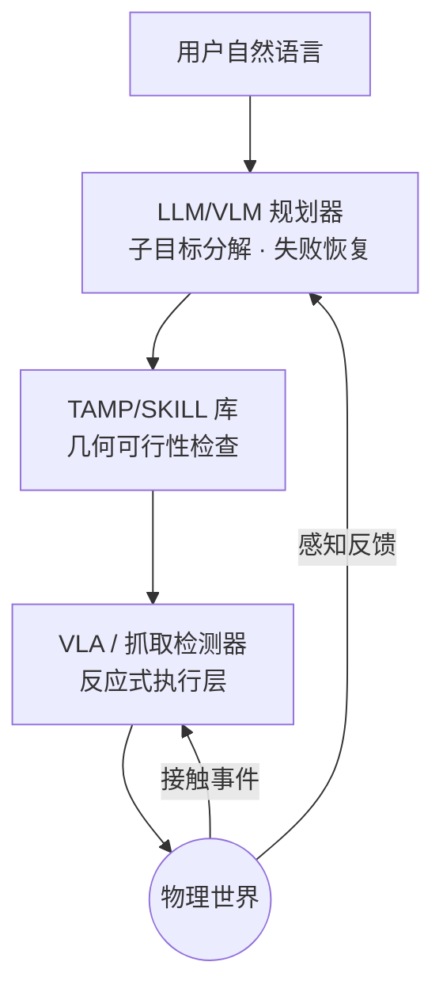

> **系列导航**：第 05 篇的 VLA 回答"手怎么动"，本篇回答"去哪里、先做哪件事"。规划是具身智能最古老的子问题（Shakey 时代就有 A*），也是 LLM 最先攻入机器人学的滩头阵地。经典与学习两条线都要讲：不懂 A*/RRT* 读不懂移动机器人论文，不懂 SayCan/VoxPoser 看不懂 2023 年后的"LLM 规划"热潮。

## TL;DR

> **TL;DR 1｜规划的分层本质**：任务规划（做什么，离散符号）→ 运动规划（怎么走，连续几何）→ 轨迹优化（走多顺，动力学）。LLM 没有取代任何一层，它接管的是最顶上那层"把人话翻译成子目标序列"，并且干得意外地好——前提是有人帮它"验货"。

> **TL;DR 2｜SayCan 的核心洞察**：LLM 只知道"什么话合理"，不知道"此刻什么事可行"。SayCan 用价值函数 $P(\text{skill}_i\mid\text{成功})$ 给每个候选技能打分，与 LLM 的语义得分 $P(\text{skill}_i\mid\text{指令})$ 相乘接地（grounding）[1](https://arxiv.org/abs/2204.01691)。"可行性 × 有用性"这个乘法结构值得背下来。

> **TL;DR 3｜视觉导航正在基础模型化**：GNM → ViNT → NoMaD 三部曲用扩散策略统一了"导航到图像目标/语言目标/自由探索"三种模式[2](https://arxiv.org/abs/2310.07896)[3](https://arxiv.org/abs/2306.14846)，思路与 VLA 完全同构。

## 1. 经典运动规划：十分钟修完的地基

### 1.1 图搜索：A* 与最优性

在占据栅格图上，A* 维护开放集并按 $f(n) = g(n) + h(n)$ 扩展节点（$g$：起点到 $n$ 的实际代价；$h$：$n$ 到终点的启发式估计）。当 $h$ 不高估真实代价（admissible，如欧氏距离），A* 保证找到最优路径。伪代码骨架：

```python
import heapq
def a_star(grid, start, goal):
    """grid: 二值占据栅格; 返回最短路径"""
    open_set = [(h(start), 0, start)]          # (f, g, node)
    came_from, g_score = {}, {start: 0}
    while open_set:
        _, g, cur = heapq.heappop(open_set)     # 取 f 最小的节点
        if cur == goal:
            return reconstruct(came_from, cur)
        for nxt in neighbors(cur):
            if grid[nxt] == OCCUPIED:           # 硬约束: 避开障碍
                continue
            tentative = g + cost(cur, nxt)
            if tentative < g_score.get(nxt, 1e9):
                g_score[nxt], came_from[nxt] = tentative, cur
                f = tentative + heuristic(nxt, goal)   # admissible 启发式
                heapq.heappush(open_set, (f, tentative, nxt))
```

### 1.2 采样规划：RRT* 与概率完备

高维构型空间（7-DoF 臂）栅格化会维度爆炸，改用随机树探索。RRT* 在 RRT 基础上加两步：为新节点**重新选父**（choose parent）+ 对邻域**重布线**（rewire），使树渐近收敛到最优解；代价是 $O(\log n)$ 的渐近速率[4](https://arxiv.org/abs/1105.1186)。工程组合拳常为：全局 RRT* 出粗路径 → 局部 DWA/TEB 或 MPC 跟踪并动态避障。

| 规划器 | 完备性 | 最优性 | 适用场景 |
|--------|--------|--------|---------|
| A*/D* Lite | 栅格完备 | 最优 | 低维已知/半知地图 |
| PRM | 概率完备 | 渐近最优(变体) | 静态多查询 |
| RRT/RRT* | 概率完备 | 渐近最优 | 高维单查询 |
| MPC | — | 滚动局部最优 | 动态避障+约束 |

## 2. 学习式导航：NoMaD 统一框架

传统导航栈（定位→建图→全局规划→局部规划）模块间误差层层传递。学习派直接学 $\pi(a|o, \text{goal})$：

- **GNM**（2020）：跨 12 种机器人的导航模仿基础模型雏形（项目页 general-navigation-models.github.io，未本地验证可达性）；
- **ViNT**（2023）：Transformer 骨干 + 目标图像条件化，19 个数据集训练后 zero-shot 迁移到新平台[3](https://arxiv.org/abs/2306.14846)；
- **NoMaD**（2023）：用**扩散策略 + 目标掩码**统一两种模式——掩住目标是"探索"，给出目标是"到达"[2](https://arxiv.org/abs/2310.07896)：

$$
a = \pi_\theta(o,\ g\ |\ m), \qquad m \in \{\text{masked},\ \text{given}\}
$$

这套"一个网络多种任务"的设计哲学后来被 VLA 全面继承。室内家庭场景之外，户外长距导航仍是 open problem（长尾地形+GPS 拒止）。

## 3. LLM 任务规划三部曲（2022–2023）

### 3.1 SayCan：语义 × 可行性

用户说"我饿了，来份薯片"，机器人技能库有 `{find(x), pick(x), bring_to(x,y)...}`。SayCan 对每个候选技能打两个分：

$$
\text{score}(i) = \underbrace{P_{LLM}(\text{skill}_i \mid \text{历史})}_{\text{有用性: LLM 说该干嘛}} \times \underbrace{P_{value}(\text{skill}_i\ \text{能成功})}_{\text{可行性: 价值函数验货}}
$$

其中 $P_{value}$ 来自 RL 训练的技能价值函数（affordance grounding）。贪心解码出技能序列后逐个执行[1](https://arxiv.org/abs/2204.01691)。局限也明显：技能库固定、无环境反馈重规划。

### 3.2 Inner Monologue：把反馈写回提示词

闭环版：执行结果（成功/失败检测、场景变化描述）作为文本注入 LLM 上下文，失败即触发重新规划——人类"心里嘀咕"的机器人版[5](https://arxiv.org/abs/2207.05608)。这是今天所有 agent 式系统的雏形。

### 3.3 Code as Policies / VoxPoser：从说话到写代码

- **Code as Policies**：让 LLM 直接生成可执行的策略代码（循环、感知 API 调用、控制原语组合），获得程序化的泛化（"对每个颜色相同的杯子…"自动变成 for 循环）[6](https://arxiv.org/abs/2209.07753)；
- **VoxPoser**：更进一步，LLM 输出代码调用 API 在体素空间**合成 3D 价值图与约束场**（吸引场指向目标、排斥场绕开障碍），再用模型预测控制跟踪零样本完成操纵——不需要为每个新任务微调任何东西[7](https://arxiv.org/abs/2307.05973)。Eureka 同期证明 LLM 还能写 RL 奖励函数[8](https://arxiv.org/abs/2310.12931)，三者共同确立了 "LLM as code/signal generator" 范式。


## 4. TAMP：符号派的反击与融合

Task and Motion Planning 是规划领域的正统学术：上层 PDDL 描述离散动作的前提/效果（如 `pick(b)` 要求 `handempty ∧ on_table(b)`），下层连续运动规划验证可行性，两者交替求解。代表工具链：PDDLStream、pybullet-planning（CMU Caelan Garrett 开源）。TAMP 的优势是**可验证的正确性保证**（解出来就一定可行）、劣势是建模成本爆炸且对感知噪声脆弱。

2024 年后的共识架构是把三方缝合：



**误差复合分析**（为什么分层必须配监控）：设每层成功率 $p_i$，串联 $k$ 个技能的长时程任务成功率为 $\prod p_i$——0.95 的五个环节连乘只剩 77%。这就是为什么 Inner Monologue 式的失败检测与重规划不是锦上添花而是必需品，也是第 08 篇"可靠性工程"话题的伏笔。

## Lab Exercises

1. **A* 手搓与启发式实验**：实现上面的 `a_star`，在同一张 100×100 随机障碍图上分别用曼哈顿距离和欧氏距离做启发式，统计扩展节点数差异；然后故意把 $h$ 放大 3 倍（破坏 admissible），观察路径不再最优但速度更快——亲手体会"速度换最优性"。
2. **SayCan 复刻玩具版**：定义 5 个仿真技能（goto/pick/place/open/close），手写每个技能的成功率函数，用任意开源 LLM API 计算 $P_{LLM}$，跑通 20 条厨房指令的分解与执行（可用 robosuite 的 Kitchen 场景，GitHub: `ARISE-Initiative/robosuite`，未本地验证），记录纯 LLM 分解 vs 加可行性乘法的失败率对比。
3. **VoxPoser 上手**：官方提供 Colab（项目页 voxposer.github.io，未本地验证），跑通"把抽屉打开再关上"示例，阅读其生成的代码，找出吸引场/排斥场的 API 调用位置并修改排斥强度观察轨迹变化。

## 参考文献与延伸阅读

- [1] Ahn et al., *Do As I Can, Not As I Say*（SayCan）. [arXiv:2204.01691](https://arxiv.org/abs/2204.01691)
- [7] Huang et al., *VoxPoser*. [arXiv:2307.05973](https://arxiv.org/abs/2307.05973)；[6] *Code as Policies*. [arXiv:2209.07753](https://arxiv.org/abs/2209.07753)
- 教材：LaValle《Planning Algorithms》全文免费（lavalle.pl/planning/）；高翔《视觉 SLAM 十四讲》（第 03 篇已推荐）。
- 综述：Kroemer et al., *A Review of Learning from Demonstration for Manipulation* 及近年 LLM-for-Robotics survey（检索标题即可获取最新版本）。

*下一篇：《07 数据·仿真·评测》——所有算法的燃料库：六大仿真器怎么选？百万级真机数据集长什么样？Real2sim 流水线如何把你的卧室扫进仿真？*
