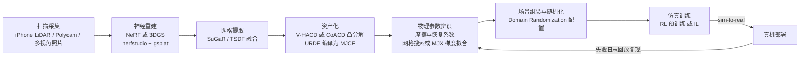

> **系列导航**：算法篇到此收官（01–06），本篇进入"基础设施"层。具身智能的摩尔定律不在芯片而在数据管线：谁能源源不断地生产"带动作标签的物理交互数据"，谁的模型就赢。本篇回答三件事：在哪练（仿真器）、拿什么喂（数据集）、怎么打分（评测）。

## TL;DR

> **TL;DR 1｜仿真器选型口诀**：接触保真选 MuJoCo[1](https://mujoco.readthedocs.io)，大规模 RL 选 Isaac Lab（Isaac Gym 的官方继任者）[2](https://arxiv.org/abs/2108.10470)，操作任务+资产生态选 ManiSkill/SAPIEN[3](https://arxiv.org/abs/2003.08515)[4](https://arxiv.org/abs/2302.04659)。Genesis 号称单卡每秒 4300 万步的极限速度（项目页数据，未复测）[5](https://genesis-embodied-ai.github.io)——但速度从来不是唯一指标，**接触求解器行为与真机的相关性**才是。

> **TL;DR 2｜数据集的三代演进**：一代是机构自采小数据（RT-1 的 13 万条）[27](https://arxiv.org/abs/2212.06817)；二代是多机构联盟拼盘（OXE 百万条，格式统一但质量参差[6](https://arxiv.org/abs/2310.08864)）；三代是**工业级数据工厂**（DROID 76k 条精细标定[7](https://arxiv.org/abs/2403.12945)、AgiBot World 百台机器人产线级数据[8](https://arxiv.org/abs/2503.06669)）。

> **TL;DR 3｜Scaling Law 已被实证**：清华团队在双臂平台上系统扫参发现：模仿学习性能随数据量呈幂律提升；**同量级下场景多样性带来的增益远大于演示条数**；且仿真预训练数据与真机微调数据存在可观的正迁移[9](https://arxiv.org/abs/2410.18647)。这给整个行业的数据战略提供了理论地基。

> **TL;DR 4｜评测正在经历信任危机**：LIBERO 被 VLA 刷到 95%+ 后区分度归零；仿真榜单排名与真机表现的相关性只在部分任务族成立[20](https://arxiv.org/abs/2405.05941)；20 次 rollout 的 80% 成功率置信区间宽达 ±17%。本篇给出三个补救工具：受控扰动基准（COLOSSEUM）[33](https://arxiv.org/abs/2402.08191)、仿真-真实校准协议（SimplerEnv）、统计显著性纪律（Wilson 区间 + 多种子）。

## 目录

- [1. 仿真器战场地图：从内核算法到选型决策](#1-仿真器战场地图从内核算法到选型决策)
  - [1.1 六大平台定位速览](#11-六大平台定位速览)
  - [1.2 MuJoCo 的软约束接触模型：数学一瞥](#12-mujoco-的软约束接触模型数学一瞥)
  - [1.3 Isaac Gym 与 Isaac Lab：GPU batched 求解器原理](#13-isaac-gym-与-isaac-labgpu-batched-求解器原理)
  - [1.4 MJX 与可微仿真：梯度穿过物理引擎意味着什么](#14-mjx-与可微仿真梯度穿过物理引擎意味着什么)
  - [1.5 Genesis：多求解器统一的野心与现实](#15-genesis多求解器统一的野心与现实)
  - [1.6 接触仿真的三个深坑](#16-接触仿真的三个深坑)
  - [1.7 最小可运行示例：二十行加载并步进一个 MuJoCo 世界](#17-最小可运行示例二十行加载并步进一个-mujoco-世界)
- [2. 数据集全景：三代演进与选型清单](#2-数据集全景三代演进与选型清单)
  - [2.1 从自采小数据到工业数据工厂](#21-从自采小数据到工业数据工厂)
  - [2.2 八大数据集对照大表](#22-八大数据集对照大表)
  - [2.3 读表要点与数据体检清单](#23-读表要点与数据体检清单)
- [3. 评测基准梯队：从刷分内卷到可信度量](#3-评测基准梯队从刷分内卷到可信度量)
  - [3.1 六大基准逐个拆解](#31-六大基准逐个拆解)
  - [3.2 饱和证据：高分内卷与真实部署的鸿沟](#32-饱和证据高分内卷与真实部署的鸿沟)
  - [3.3 评测科学三大未解问题](#33-评测科学三大未解问题)
  - [3.4 代码：带 Wilson 置信区间的 LIBERO 评测循环骨架](#34-代码带-wilson-置信区间的-libero-评测循环骨架)
- [4. Real2Sim 流水线分步深潜](#4-real2sim-流水线分步深潜)
- [5. 数据 Scaling Law：幂律、多样性与仿真预训练](#5-数据-scaling-law幂律多样性与仿真预训练)
- [6. 数据飞轮的设计模式](#6-数据飞轮的设计模式)
- [Lab Exercises](#lab-exercises)
- [参考文献与延伸阅读](#参考文献与延伸阅读)

## 1. 仿真器战场地图：从内核算法到选型决策

### 1.1 六大平台定位速览

| 平台 | 物理内核与接触求解器 | GPU 并行 | 强项与典型用户 | 引用 |
|------|---------|---------|------|---------|
| MuJoCo | 软约束凸优化接触模型；Newton/CG/PGS 求解 | MJX(JAX) 路线 | 接触精度口碑、bit 级可复现；学术界默认 | [1](https://mujoco.readthedocs.io) |
| Isaac Gym / Isaac Lab | PhysX（PGS/TGS 迭代求解）；GPU 上批量环境 | ✅ 数千环境并行 | 大规模 locomotion RL；legged 系论文标配 | [2](https://arxiv.org/abs/2108.10470)[38](https://isaac-sim.github.io/IsaacLab) |
| SAPIEN / ManiSkill2/3 | PhysX + 部件级关节资产 | ManiSkill3 ✅（含 GPU 渲染） | 操作任务丰富、铰链物体资产库；manipulation 论文主力 | [3](https://arxiv.org/abs/2003.08515)[4](https://arxiv.org/abs/2302.04659) |
| robosuite | MuJoCo 内核 | ❌ | 标准化操作 benchmark 套件；ALOHA/MimicGen 底座 | [10](https://arxiv.org/abs/2009.12293) |
| PyBullet | Bullet（Sequential Impulse/LCP） | ❌ | 安装零门槛；入门教学 | pybullet.org |
| Genesis | 多内核混合（刚体/MPM/FEM/SPH/PBD） | ✅ Taichi 后端 | 极速与多材料耦合（宣传口径）；社区新锐 | [5](https://genesis-embodied-ai.github.io) |

再把**工程生态属性**单独拉一张表——这些维度在选型时经常比"跑得快不快"更致命：

| 平台 | 渲染器/传感器模型 | 资产格式 | 许可证 | 适用任务建议 |
|------|------------------|----------|--------|--------------|
| MuJoCo | 内建 OpenGL 光栅化；相机/触觉/F-T 传感模型齐备 | MJCF（XML）、可导入 URDF/STL/OBJ | Apache 2.0 | 高保真操作、需要可复现性的学术实验 |
| Isaac Lab | RTX 光追渲染 + Replicator 域随机化管线 | USD（Universal Scene Description）为主，附 MJCF/URDF 转换器 | 框架 BSD-3，Isaac Sim 专有但免费使用 | 千环境 locomotion RL、视觉随机化训练 |
| SAPIEN/ManiSkill | Vulkan 批量光栅化，RGB-D 出图快 | URDF 扩展 + PartNet-Mobility 关节资产库 | MIT | 部件级操作、抽屉门轴类铰链任务 |
| robosuite | MuJoCo 渲染器 | MJCF（套件自带标准化任务） | MIT | 操作算法横向对比、遥操作数据采集底座 |
| PyBullet | CPU TinyRenderer/EGL | URDF/SDF/Bullet 格式 | zlib | 快速原型、课程教学 |
| Genesis | 光栅化+光追混合，含生成式场景模块 | MJCF 兼容 + YAML 场景配置 | Apache 2.0 | 多材料耦合研究（软体/流体/布料）、极限吞吐探索 |

选型一句话版：**locomotion 千环境扫奖励 → Isaac Lab；manipulation 发论文要可比 → robosuite/ManiSkill；接触行为要跟真机对标 → MuJoCo；想玩软体流体耦合或榨 GPU 吞吐极限 → Genesis（自担成熟度风险）**。

### 1.2 MuJoCo 的软约束接触模型：数学一瞥

MuJoCo 长期霸榜"接触行为最像真机"的口碑，根源在它把接触建模成**光滑的凸优化问题**，而不是 LCP 互补性问题（Bullet/PhysX 路线）。理解这一点的最小数学包如下。

每一步先用半隐式 Euler 积分：

$$
v_{t+1} = v_t + \Delta t \cdot a, \qquad q_{t+1} = q_t \oplus \Delta t \cdot v_{t+1}
$$

其中 $\oplus$ 表示按关节类型（滑动/转动/自由体四元数）复合位移。关键在 $a$ 怎么来：MuJoCo 把所有约束（接触、关节限位、等式约束）统一写成**约束空间的加速度优化问题**：

$$
\min_{a}\ \frac{1}{2}\,(a - a^{\mathrm{ref}})^{\mathsf T} A\,(a - a^{\mathrm{ref}})
\quad \text{s.t. 非穿透不等式与摩擦锥约束}
$$

变量映射：

| 符号 | 含义 | 表达式/来源 |
|------|------|------------|
| $a$ | 待求的广义加速度（含约束力贡献） | 决策变量 |
| $a^{\mathrm{ref}}$ | 参考加速度：无约束动力学 $M^{-1}(\tau - c)$ 加上阻抗模型给出的"期望回复加速度" | 由 solref 参数生成 |
| $A$ | 约束空间的逆惯性矩阵 | $J M^{-1} J^{\mathsf T} + R$，$J$ 为约束雅可比 |
| $R$ | 对角正则项（softness） | 让 $A$ 恒正定、解唯一 |

两个设计点值得专门记住：

1. **"软"体现在哪**：传统 LCP 要求约束严格满足（不可穿透），数值上是硬互补性条件；MuJoCo 则允许约束被"弹性地"违反——违反量 $r$ 通过阻抗函数映射为一个回复加速度 $a^{\mathrm{ref}}$，越深的穿透产生越强的回复趋势。这换来的是目标函数处处光滑、$A$ 恒正定，从而**解存在且唯一**。
2. **凸性买到了什么**：解唯一意味着同一份 XML + 同一初始状态 = **确定性结果**，这是 MuJoCo 成为学术复现黄金标准的第一原因。摩擦锥被线性化为金字塔约束以保持凸性；求解器可选 Newton（默认，配稀疏 Cholesky 预条件）、共轭梯度 CG、投影高斯-赛德尔 PGS——精度递减、速度递增，`solref/solimp` 两组参数控制接触的刚度与阻尼性格。

> **工程视角**：PhysX/Bullet 的迭代求解器每步做的是"近似满足互补性"，迭代次数不足时表现为穿透与幽灵弹跳；MuJoCo 的凸优化每步直接收敛到唯一解，但代价是单环境计算更贵。这就是"Isaac 快而糙、MuJoCo 慢而准"的数学根源——不是谁写得烂，是两条不同的建模路线。

### 1.3 Isaac Gym 与 Isaac Lab：GPU batched 求解器原理

Isaac Gym[2](https://arxiv.org/abs/2108.10470) 的贡献不是发明了新物理算法，而是**把整个 RL 训练循环搬进了 GPU 显存**：

1. **批量环境常驻显存**：数千个环境副本的状态张量（形状 `N_env × obs_dim`）一次性分配在 GPU global memory 里，物理求解按环境维并行展开——每个环境的约束求解是一个独立的 kernel 任务，互不通信；
2. **零主机往返**：观测张量直接喂给同在 GPU 上的策略网络，动作张量直接写回物理引擎，整条 `obs → policy → action → physics step` 链路不经过 CPU 内存。传统管线里每步几十毫秒的 PCIe 传输被彻底消掉；
3. **吞吐换精度**：GPU 上的 PGS 迭代次数有限，单环境接触精度低于 MuJoCo——但对 locomotion 这类"脚底接触 + 高频反馈"任务，策略学到的是扰动分布下的鲁棒行为，求解器的粗糙反而被域随机化吸收了。

Isaac Lab 作为官方继任者，把这套架构升级为：PhysX 5 内核、USD 资产体系、tensor API（numpy 式操作物理状态）、以及 Replicator 域随机化管线[38](https://isaac-sim.github.io/IsaacLab)。legged_gym→IsaacLab 的迁移已是四足/人形方向的事实标准路径。

> **关键认知**：Isaac 系的哲学是"**策略不需要精确的物理，只需要一致的物理**"。只要仿真内部自洽且随机化充分，策略学的是对一族物理参数的鲁棒响应——这与第 02 篇域随机化的数学表述完全同构。

### 1.4 MJX 与可微仿真：梯度穿过物理引擎意味着什么

Brax 首先示范了用 JAX 写物理引擎的路线[23](https://arxiv.org/abs/2106.13281)：把整个 `step` 函数写成纯 JAX 运算后，自动获得三样东西——`jit` 编译加速、`vmap` 环境批量化（GPU/TPU 上并行数千环境）、以及**自动微分**。MJX 是这条路线的 MuJoCo 官方实现：用 JAX 重写 MuJoCo 的步进管线，语义对齐原生 MuJoCo[39](https://mujoco.readthedocs.io/en/stable/mjx.html)。

可微仿真的真正价值不在"训练策略更快"，而在三件以前做不到的事：

1. **基于梯度的系统辨识**：把真机轨迹损失 $\mathcal{L}(\theta)=\sum_t \|q^{\text{real}}_t - q^{\text{sim}}_t(\theta)\|^2$ 对摩擦系数、质量等物理参数 $\theta$ 求梯度，直接梯度下降拟合——不用网格搜索；
2. **分析式策略梯度**：$\nabla_\phi \mathcal{L}$ 直接穿过物理引擎传回策略参数，绕开采样方差巨大的似然比估计器；
3. **灵敏度分析**：定量回答"哪个物理参数对任务成功影响最大"，指导域随机化的带宽分配。

但要清醒看到边界：接触事件本质是不连续的（碰撞瞬间法向力跳变），梯度在接触处要么爆炸要么消失；混沌系统中长 horizon 的梯度会指数发散。实践中的可行区间是**短 horizon 的参数辨识与轨迹优化**，而不是端到端长 episode 策略训练——后者还是 PPO + 域随机化的天下（第 02 篇）。

### 1.5 Genesis：多求解器统一的野心与现实

Genesis 的差异化在于**多物理求解器统一调度**：刚体、MPM（物质点法，沙/雪/胶体）、FEM（有限元，软体）、SPH（流体）、PBD（布料）共用一套场景图与交互接口，Taichi 内核保证跨平台 GPU 编译[5](https://genesis-embodied-ai.github.io)。项目页宣称的单卡每秒 4300 万步属于刚体空载场景的极限吞吐（宣传口径，未复测）。

它的现实定位：**多材料耦合研究与生成式管线的研究游乐场**，而不是生产环境的默认选择——接触求解行为与 MuJoCo/PhysX 的成熟度尚有差距，benchmark 结果的社区交叉验证还在积累期。给研究者的建议：软体/流体/可变形物体的课题值得押注；纯刚性操作发论文，现阶段仍优先 robosuite/ManiSkill/MuJoCo。

### 1.6 接触仿真的三个深坑

每个都值得写进事故报告：

1. **求解器迭代数不足** → 穿透与"幽灵弹跳"，随机化 solver 参数可能训出利用求解器 bug 的策略（例如把穿透当支撑面踩）；
2. **时间步长敏感**：刚性接触下 $\Delta t$ 减半结果剧变，跨平台迁移策略时首查此项；经验法则：接触事件的穿越深度应显著小于最小物体尺寸的 1/10；
3. **渲染-物理不一致**：视觉观测来自渲染器而真值来自物理引擎，域随机化要同时覆盖两者——只随机纹理不随机光照相位、只随机物理不随机相机位姿，都会留下策略可钻的"仿真指纹"。

### 1.7 最小可运行示例：二十行加载并步进一个 MuJoCo 世界

下面这段脚本可直接运行（`pip install mujoco numpy`，无需 GUI）：定义一个滑块推杆推箱子的微型场景，步进 2 秒后读出盒子位置与每个接触点的法向力——这正是调试操作任务时最高频的一组查询。

```python
import mujoco
import numpy as np

xml = """
<mujoco model="push_min">
  <option timestep="0.002"/>
  <worldbody>
    <light name="top" pos="0 0 2" dir="0 0 -1"/>
    <geom name="floor" type="plane" size="1 1 0.1"/>
    <body name="box" pos="-0.3 0 0.05">
      <freejoint/>
      <geom name="box_geom" type="box" size="0.05 0.05 0.05"
            mass="0.1" friction="0.6 0.005 0.0001" rgba="0.9 0.3 0.3 1"/>
    </body>
    <body name="pusher" pos="0.2 0 0.05">
      <joint name="slide_x" type="slide" axis="1 0 0" range="-0.5 0.5"/>
      <joint name="slide_y" type="slide" axis="0 1 0" range="-0.5 0.5"/>
      <geom name="tip" type="sphere" size="0.02" mass="1" rgba="0.2 0.4 0.9 1"/>
    </body>
  </worldbody>
  <actuator>
    <motor joint="slide_x" ctrlrange="-1 1"/>
    <motor joint="slide_y" ctrlrange="-1 1"/>
  </actuator>
</mujoco>
"""

model = mujoco.MjModel.from_xml_string(xml)   # 字符串/XML 文件皆可编译
data = mujoco.MjData(model)
data.ctrl = np.array([-1.0, 0.0])             # 沿 -x 方向推

for _ in range(1000):                          # 1000 步 × 2ms = 2 秒
    mujoco.mj_step(model, data)

print("盒子最终位置:", np.round(data.body("box").xpos, 4))
print("当前接触点数:", data.ncon)
for i in range(data.ncon):                     # 逐一读出接触力旋量
    force = np.zeros(6)
    mujoco.mj_contactForce(model, data, i, force)
    print(f"  接触{i}: 法向力 = {force[0]:.3f} N")
```

预期输出：盒子被推离初始位置（x 坐标明显小于 −0.3），推杆尖端与盒子之间出现 1 个接触点并输出非零法向力。把 `friction` 第一项（滑动摩擦系数）从 0.6 改成 0.2 再跑一遍，你会看到盒子滑得更远——这就是第 5 节 scaling law 实验要用的扰动手柄。

数学符号 ↔ 代码句柄对照表：

| 物理量 | 数学符号 | MuJoCo API | 形状 |
|--------|---------|------------|------|
| 广义位置 | $q$ | `data.qpos` | `(nq,)` |
| 广义速度 | $\dot q$ | `data.qvel` | `(nv,)` |
| 控制输入 | $\tau$ | `data.ctrl` | `(nu,)` |
| 刚体世界位姿 | $T_b(q)$ | `data.body("box").xpos/.xmat` | `(3,)` / `(3,3)` |
| 接触约束集合 | $\mathcal{C}_t$ | `data.ncon`、`data.contact[i]` | 标量 / 结构数组 |
| 接触力旋量 | $f_c$ | `mj_contactForce(...)` | `(6,)` |

真实机器人模型的 XML 不用手写：MuJoCo 官方 Menagerie 仓库收录了 Franka、UR、宇树等主流本体的现成 MJCF（GitHub: `google-deepmind/mujoco_menagerie`，未本地验证）。

## 2. 数据集全景：三代演进与选型清单

### 2.1 从自采小数据到工业数据工厂

**第一代（2022 前）——机构自采**：单一实验室、单一本体、数万条量级。代表是 RT-1 的 13 万条真机 episodes：13 台机器人 17 个月吃出来的数据集，证明了"够大的真机数据 + Transformer 架构"能涌现泛化[27](https://arxiv.org/abs/2212.06817)，但也暴露了自采模式的天花板——数据成本线性绑定人力与机器时长。

**第二代（2023）——联盟拼盘**：OXE 把 21 家机构的异构数据洗进统一格式，百万条轨迹、22 种本体[6](https://arxiv.org/abs/2310.08864)。跨本体训练第一次成为可能（RT-X 系列），但代价是子集间质量参差：控制频率不一、相机标定精度不一、成功率过滤标准不一。

**第三代（2024 至今）——工业数据工厂**：不再"凑数据"而是"造数据"——统一硬件、统一标定流程、统一质检标准的大规模采集体系。DROID 用 564 个场景的 Franka 集群把元数据规范性做到极致[7](https://arxiv.org/abs/2403.12945)；AgiBot World 直接建百台机器人产线[8](https://arxiv.org/abs/2503.06669)；RoboMIND/RH20T 代表清华系的多本体与人机配对路线[13](https://arxiv.org/abs/2412.13877)[14](https://arxiv.org/abs/2307.00595)。

### 2.2 八大数据集对照大表

| 数据集 | 规模（episode 数） | 本体 | 任务类型 | 采集方式 | 许可 | 引用 |
|--------|------|------|---------|------|------|------|
| Open X-Embodiment | 100万+ 轨迹 | 22 种 | 桌面操作为主、含移动操作杂烩 | 21 机构汇聚（遥操/脚本/自主混杂） | 各子集各自许可 | [6](https://arxiv.org/abs/2310.08864) |
| RT-1 自采 | 13 万条 | Everyday Robots | 厨房任务、700+ 指令 | 遥操作，13 台机器人 × 17 个月 | 未完整开源 | [27](https://arxiv.org/abs/2212.06817) |
| RoboNet | 16 万+ 轨迹（约 1500 万帧，论文口径） | 14 种 | 桌面推抓放置 | 多实验室历史数据汇总 | 待核实 | [12](https://arxiv.org/abs/1910.11215) |
| BridgeData V2 | 6 万+ 轨迹 | WidowX 250 | 桌面抓取/放置/倾倒等 | 遥操作 + 脚本化自主 | 待核实（官网为准） | [11](https://arxiv.org/abs/2308.12952) |
| DROID | 7.6 万条 / 564 场景 | Franka | 多场景桌面精细操作 | 分布式多国 VR 遥操作 | 待核实（官网为准） | [7](https://arxiv.org/abs/2403.12945) |
| AgiBot World | 规划百万级轨迹（分期发布中） | 智元自研人形 | 家庭/工业双臂长时程 | 百台机器人自有产线遥操 | 待核实（官网为准） | [8](https://arxiv.org/abs/2503.06669) |
| RoboMIND | 10.7 万条 | 5 种本体 | 双臂协作、灵巧手精细操作 | 多机构遥操作（清华系） | 待核实（官网为准） | [13](https://arxiv.org/abs/2412.13877) |
| RH20T | 11 万+ 轨迹（另含人类视频配对集） | 多本体 + 人类演示 | 日常多技能 | 遥操作 + 人机配对录制 | 待核实（官网为准） | [14](https://arxiv.org/abs/2307.00595) |

读表注意两点：其一，"轨迹"的定义并不统一——有的按一次完整任务计，有的按一段连续控制序列计，跨数据集比较规模时要先对齐口径；其二，标注了"待核实"的许可证信息请在使用前查各官网，开源协议直接影响能否商用。

### 2.3 读表要点与数据体检清单

**规模 ≠ 质量**。OXE 各子集的相机位姿精度、力矩标注、成功率过滤标准差异巨大——π0 团队公开分享过"子集配比比总量更重要"的经验教训[30](https://arxiv.org/abs/2410.24164)。拿到任何一份新数据集，建议过一遍这张体检清单：

1. **控制频率与动作空间**：10 Hz 还是 50 Hz？末端位姿还是关节力矩？与你策略头的输出格式差多少？
2. **观测同步性**：图像与本体状态的时间戳偏差超过半个控制周期就是隐患；
3. **失败片段是否保留**：负样本对 BC 是金子（DAgger 式修正信号），只留成功轨迹的数据集天然带幸存者偏差；
4. **元数据完整性**：相机内外参、夹爪宽度、任务语义标签有没有？DROID 的价值一半在这[7](https://arxiv.org/abs/2403.12945)；
5. **本体差距**：你的机器人与采集本体的运动学/动力学距离，决定了微调成本的下限。

## 3. 评测基准梯队：从刷分内卷到可信度量

### 3.1 六大基准逐个拆解

| Benchmark | 任务类型 | 特点 | 引用 |
|-----------|---------|------|------|
| Meta-World | 50 个机械臂任务 | 元 RL 经典 | [15](https://arxiv.org/abs/1910.10897) |
| RLBench | 100 个桌面任务 | 首个大规模式样化操作套件 | [16](https://arxiv.org/abs/1909.12271) |
| CALVIN | 语言条件长时程 | 技能串联、抗干扰矩阵 | [17](https://arxiv.org/abs/2112.03227) |
| LIBERO | 130 个终身学习任务 | 知识迁移四象限设计 | [18](https://arxiv.org/abs/2306.03310) |
| RoboCasa | 大规模厨房场景 | 资产生成+人视频动作合成 | [19](https://arxiv.org/abs/2406.02523) |
| SimplerEnv | 真实策略仿真重放 | 用真机数据建仿真来**校准 sim-real 相关度** | [20](https://arxiv.org/abs/2405.05941) |

逐个补充任务设计与指标细节——选 benchmark 时这些才是决定性信息：

- **Meta-World**[15](https://arxiv.org/abs/1910.10897)：50 个 Sawyer 机械臂任务共享同一动作/观测空间，切分为 MT10/MT50（多任务）与 ML1/ML10/ML45（元学习）协议，指标是各任务成功率均值——它考的是"一个网络同时装下 50 个任务"，是元 RL 时代的产物；
- **RLBench**[16](https://arxiv.org/abs/1909.12271)：CoppeliaSim 中的 100 个任务（从开抽屉到插积木），最大特色是**内置运动规划器自动生成演示**——不用人示教就能拿到 keyframe 序列，代价是演示风格偏"规划器味"，与人类示教分布有差距；
- **CALVIN**[17](https://arxiv.org/abs/2112.03227)：PyBullet 中的语言条件长时程评测，指标是**链式成功率** $L_1$ 到 $L_5$——连续执行 1/5 条语言指令全部成功的比例。链式指标对误差累积极其敏感，是考"技能串联稳定性"的最狠设计；
- **LIBERO**[18](https://arxiv.org/abs/2306.03310)：130 个任务拆成四个知识象限——Spatial（同物体变空间布局）、Object（同布局换物体）、Goal（同场景换目标）、LIBERO-100（长时程混合），每个任务配 50 条人示教。设计初衷是终身学习/知识迁移，阴差阳错成了 VLA 微调的标准试金石；
- **RoboCasa**[19](https://arxiv.org/abs/2406.02523)：robosuite 之上构建的大规模家庭厨房套件——120 种厨房场景、2500+ 物体资产（论文口径），演示靠少量真人遥操作经 MimicGen 自动扩增到十万级[26](https://arxiv.org/abs/2310.17596)；它考的是"场景多样性下的泛化"，是通往家庭场景的重要跳板；
- **SimplerEnv**[20](https://arxiv.org/abs/2405.05941)：严格说不是新任务集，而是一种**评测协议**——把真机数据集（BridgeData、Google Robot 场景）重建为视觉匹配的仿真，让已发布的 VLA 在仿真里重放，与论文报告的真机成绩对表。

### 3.2 饱和证据：高分内卷与真实部署的鸿沟

三条具体的证据链，说明"仿真刷分"已经无法预测"真机表现"：

1. **LIBERO 天花板已破**：OpenVLA-OFT 把 LIBERO 三套件平均成绩刷到约 97%（论文口径），推理速度还翻了数十倍[32](https://arxiv.org/abs/2502.19645)。当所有新方法都在 95%~98% 区间内互咬，这个 benchmark 已经失去区分新思想的能力——剩下的提升可能只是过拟合评测分布；
2. **仿真排名 ≠ 真机排名**：SimplerEnv 的核心发现是相关性**分任务族两极分化**——BridgeData/Fractal 一类桌面抓放的重放环境里，仿真与真机的策略排名高度一致；另一部分任务族则明显脱钩[20](https://arxiv.org/abs/2405.05941)。也就是说"仿真评测能信几分"这个问题没有全局答案，只有逐任务族的局部答案；
3. **受控扰动下集体跳水**：COLOSSEUM 在 RLBench 类任务上引入光照、纹理、干扰物、相机位姿等十余个受控扰动轴，同样的策略在扰动组合下成功率大幅下滑（论文口径）[33](https://arxiv.org/abs/2402.08191)。这暴露了常规 benchmark 的隐含设定——测试分布与训练分布几乎重合，考的不是泛化而是记忆。

### 3.3 评测科学三大未解问题

**问题一：仿真-真实相关度如何量化？**
不能停留在"看起来挺相关"。SimplerEnv 给出了正确姿势：固定一组已发表策略，在仿真重放环境与真机分别测排名，计算秩相关系数（如 Spearman ρ），按任务族分开报告[20](https://arxiv.org/abs/2405.05941)。工程含义：你在某个仿真 benchmark 上的名次，只有在被验证过高相关的任务族里才可信；其余场合应视为"冒烟测试"而非"验收测试"。

**问题二：泛化到底沿哪些维度定义？**
"泛化好"必须拆成可操作的轴。结合 LIBERO 的象限设计与 COLOSSEUM 的扰动 taxonomy[33](https://arxiv.org/abs/2402.08191)[18](https://arxiv.org/abs/2306.03310)，至少应区分：

| 泛化维度 | 定义 | 测试方法 |
|----------|------|----------|
| 物体泛化 | 训练未见过的实例/类别 | 换测试物体集，报告 novel-object 成功率 |
| 空间泛化 | 物体位置/布局变化 | 网格化扰动摆放位置 |
| 光照/纹理泛化 | 材质外观与照明条件 | 受控改变光源色温与环境反射 |
| 指令泛化 | 同义改写、未见措辞 | 指令模板 held-out 集 |
| 干扰物鲁棒 | 桌面多余物体 | 固定加入 k 个干扰物 |
| 相机/视角泛化 | 标定外参漂移 | 显著平移/旋转相机 |

一张合格的成绩单应该按维度分列，而不是报一个笼统的平均成功率——π0/OpenVLA 的技术报告已经开始这样做了[30](https://arxiv.org/abs/2410.24164)[31](https://arxiv.org/abs/2406.09246)。

**问题三：统计显著性为何长期缺席？**
机器人论文的默认配置"20 次 rollout + 报均值"在统计上接近不可用。算一笔账：成功率 $\hat p = 0.8$、$n=20$ 时，Wilson 95% 置信区间约为 $[58\%, 92\%]$——宽达 ±17 个百分点，大量论文声称的差异实际落在互相的重叠区间里。Wilson 区间的上半界为：

$$
\tilde p = \frac{\hat p + \frac{z^2}{2n} + z\sqrt{\frac{\hat p(1-\hat p)}{n} + \frac{z^2}{4n^2}}}{1 + \frac{z^2}{n}}
$$

（下半界把分子中间一项换成减号即可。）想可靠地区分 80% 与 85% 两个策略，双比例检验在 α=0.05、功效 0.80 下每组约需 **900 次 rollout**——这就是为什么严肃的真机评测动辄上千次试验。可执行的最低纪律：训练侧 ≥3 个随机种子报 mean±std；评测侧每条件 ≥50–100 次 rollout；比较策略时报置信区间或做置换检验，而不是裸均值排序。

### 3.4 代码：带 Wilson 置信区间的 LIBERO 评测循环骨架

以下为评测循环的结构骨架（`reset_task/env_step/policy.act` 为占位符，接入 LIBERO 官方 API 即可运行；Wilson 部分可直接使用）：

```python
import math

def wilson_ci(successes: int, n: int, z: float = 1.96):
    """二项成功率的 Wilson 95% 置信区间，返回 (lower, upper)"""
    p = successes / n
    denom = 1 + z * z / n
    center = (p + z * z / (2 * n)) / denom
    half = z * math.sqrt(p * (1 - p) / n + z * z / (4 * n * n)) / denom
    return max(0.0, center - half), min(1.0, center + half)

def evaluate_policy(policy, suite="libero_spatial",
                    n_tasks=10, rollouts_per_task=10,
                    max_steps=512, seeds=(0, 1, 2)):
    """LIBERO 式评测骨架：多种子 × 多任务 × 每 task 多次 rollout"""
    results = []                                   # 每元素: (seed, task_id, success)
    for seed in seeds:                             # 种子覆盖训练侧方差
        policy.reset(seed)
        for tid in range(n_tasks):
            obs, instruction = reset_task(suite, tid)   # 占位: 接官方 benchmark API
            for ep in range(rollouts_per_task):
                obs = env_reset(suite, tid, seed + ep)  # 占位: 环境复位
                done, success = False, False
                for t in range(max_steps):
                    action = policy.act(obs, instruction)   # 图像+语言 → 动作块
                    obs, done, info = env_step(action)      # 占位: 步进
                    success = info.get("success", False)
                    if done:
                        break
                results.append((seed, tid, success))

    s = sum(r for _, _, r in results)
    lo, hi = wilson_ci(s, len(results))
    print(f"总体: {s}/{len(results)} = {s/len(results):.1%}, "
          f"Wilson95 = [{lo:.1%}, {hi:.1%}]")
    for tid in range(n_tasks):                     # 分任务报区间，别只报总均值
        sub = [r for _, t, r in results if t == tid]
        lo, hi = wilson_ci(sum(sub), len(sub))
        print(f"task {tid}: {sum(sub)}/{len(sub)}, [{lo:.1%}, {hi:.1%}]")
```

两个使用要点：其一，`policy.act` 若输出动作块（chunk），内层循环要相应改为每次消耗多步——ACT/π0 类模型都是 chunk 化输出[28](https://arxiv.org/abs/2304.13705)[30](https://arxiv.org/abs/2410.24164)；其二，分任务报 Wilson 区间是底线，若两策略的同任务区间大量重叠，任何"我们更好"的结论都不成立。

## 4. Real2Sim 流水线分步深潜

Real2Sim 不是单一算法，而是一条五级流水线。每一步都有多个工具选项，也都有各自的失败模式：



**Step 1｜场景重建（衔接第 03 篇）**：输入是 iPhone LiDAR 扫描或多视角照片序列。经典路线走 COLMAP 做 SfM/MVS 得到稀疏点云与相机位姿，再用 NeRF[37](https://arxiv.org/abs/2003.08934) 或 3DGS[21](https://arxiv.org/abs/2308.04079) 做外观重建（nerfstudio/gsplat 是事实标准的训练框架）。3DGS 因实时渲染与照片级外观成为主流选择；但高斯点云**不能直接做碰撞检测**——这是下一步存在的理由。

**Step 2｜资产化**：从 NeRF/3DGS 提取可碰撞 mesh，SuGaR 类表面对齐方法是当前主流[24](https://arxiv.org/abs/2311.12775)，备选 TSDF 融合 + Poisson 重建（快但丢失薄结构）。得到的 mesh 要经过：Blender 清理 → 凸分解（V-HACD 或更精的 CoACD——物理引擎只吃凸体碰撞）→ 写成 URDF/MuJoCo 内建编译为 MJCF。质量与惯量没有 CAD 时按均匀密度假设由几何自动估算。不想自己建资产时，Objaverse 提供 80 万+ 开放 3D 模型[25](https://arxiv.org/abs/2212.08051)（注意其中多数没有干净的碰撞几何），PartNet-Mobility（随 SAPIEN 发布[3](https://arxiv.org/abs/2003.08515)）提供关节结构已定义好的家具。

**Step 3｜物理参数辨识**：mesh 对了、摩擦错了照样白搭。三个梯度的做法：① 查表——材质对（金属/木/橡胶）的典型摩擦系数文献值起步；② 网格搜索——让真机做推/滑/丢动作，扫描摩擦与恢复系数使仿真轨迹误差最小；③ 梯度拟合——用 MJX[39](https://mujoco.readthedocs.io/en/stable/mjx.html)/Brax[23](https://arxiv.org/abs/2106.13281) 的可微仿真对参数求梯度直接下降（见 1.4 节，注意接触处的梯度噪声）。辨识成本过高时，退回 dynamics randomization——不辨识，而是把不确定参数当作随机变量训鲁棒策略[35](https://arxiv.org/abs/1710.06537)。

**Step 4｜场景随机化**：在还原的场景上叠加 Domain Randomization[34](https://arxiv.org/abs/1703.06907)。随机化清单按收益排序：物体初始位姿 > 光照方向与强度 > 纹理/颜色 > 相机外参微扰 > 物理参数抖动。Isaac Lab 的 Replicator 与 robosuite/ManiSkill 的 wrapper 都支持声明式配置；原则只有一条——**随机化的每一个维度都要问"真机上它的真实分布是什么"**，盲目加大带宽会把策略逼向过度保守。

**Step 5｜数字孪生校准与闭环**：上线前的最后一道工序是把真机日志在孪生场景里回放，对比观测误差定位根因；部署后的失败案例回灌仿真复现（replay + 扰动搜索），找到根因后定向增广训练数据。SimplerEnv 的 visual matching 协议本质上就是 Step 1+4+5 的组合拳：分割出真实背景、图像修复贴回仿真、相机位姿逐帧对齐，使仿真画面与真机录像素级接近[20](https://arxiv.org/abs/2405.05941)。这条闭环是头部公司内部管线的核心地带，开源侧目前以 Isaac Lab 的 domain randomization 配置体系最完整（GitHub: `isaac-sim/IsaacLab`）[38](https://isaac-sim.github.io/IsaacLab)。

## 5. 数据 Scaling Law：幂律、多样性与仿真预训练

LLM 的 scaling law 改变了整个 AI 的资源分配逻辑；机器人版的对应问题是：**模仿学习性能随数据量的函数形状是什么？预算该往哪砸？**清华团队的 RPT 实验（双臂平台、四个操作任务、数据量从几条扫到上千条的系统性扫参）给出了目前最完整的实证答案[9](https://arxiv.org/abs/2410.18647)。

**结论一：性能随数据量呈幂律提升。** 拟合形式可写作：

$$
\mathrm{SR}(N) \approx c \cdot N^{\beta}, \qquad \beta > 0
$$

其中 $N$ 为演示条数、SR 为成功率，$\beta$ 与 $c$ 随任务复杂度和策略容量变化（不同任务的系数差异很大，具体数值见原文表格，此处不转述以免失真）。log-log 坐标下的线性关系意味着**边际收益递减但不归零**：数据翻倍的性能增益是可预测的常数比例，这给了数据采购一个可以算 ROI 的公式。

**结论二：多样性 > 数量。** 这是全文最有行动价值的发现：同等预算下，增加环境/物体/光照的组合种类带来的性能增益，远大于在同一环境里堆演示条数。直觉解释：同一场景的第 101 条演示与第 100 条高度共线，边际信息量趋近于零；而一个新场景强迫策略学习不变性本身。工程准则由此而来——**预算固定时，先买多样性，再买数量**；这也解释了为什么 RoboCasa 要造 120 种厨房[19](https://arxiv.org/abs/2406.02523)，以及为什么 OXE 的价值在"22 种本体"而不只是"百万条"[6](https://arxiv.org/abs/2310.08864)。

**结论三：仿真预训练有正迁移。** 先在仿真数据上预训练、再到少量真机数据微调的组合，优于纯真机从头训练——仿真数据的分布差异没有想象中致命，因为模仿学习主要消费"动作-观测的因果结构"而非像素细节。这为第 4 节的 Real2Sim 管线补上了经济学论证：仿真数据便宜，且**不是废数据**。

三条结论合起来是一份数据战略说明书：仿真合成打底（便宜、多样性无限扩展）→ 少量高质量真机数据对齐分布（贵的花在刀刃上）→ 按幂律曲线外推规划下一轮采购量。GR00T N1 等新一代人形基础模型的数据配方正是按这个逻辑设计的——海量异质数据预训练 + 高质量同分布数据后训练[36](https://arxiv.org/abs/2503.14734)。

## 6. 数据飞轮的设计模式

可持续的数据引擎不是"采一批训一版"，而是一个闭环。综合 π0/DROID/AgiBot World 的公开实践[30](https://arxiv.org/abs/2410.24164)[7](https://arxiv.org/abs/2403.12945)[8](https://arxiv.org/abs/2503.06669)，闭环包含五个阶段：


**阶段一：遥操作冷启动。** 冷启动的三条路各有生态位：① 遥操作工厂——ALOHA 主从臂路线人力密集但质量上限高[28](https://arxiv.org/abs/2304.13705)；② 手持夹爪 UMI 路线摆脱机器人机架，野外采集成本低[29](https://arxiv.org/abs/2402.10329)；③ 纯合成——GraspVLA 证明抓取这类"物理规律主导"的任务可以十亿级合成数据起家[22](https://arxiv.org/abs/2505.03233)。经验分工：接触丰富的精细操作靠①，开放场景语义任务靠②，物理规律主导的技能靠③。

**阶段二：策略部署。** 用冷启动数据训出的第一版策略上真机半自主运行。关键设计：**不要追求全自动**——保留人在环接管通道，接管的瞬间本身就是一条纠错演示（DAgger 思想的部署版）。

**阶段三：失败回收。** 部署产生的数据流里，失败轨迹比成功轨迹更值钱——它们精确标记了策略分布的空洞。全量记录（含接管前最后若干秒）是飞轮转起来的燃料底线。

**阶段四：自动标注。** VLM 自动生成语言指令、切片、去重；失败片段做根因分类（感知错误/抓取失败/规划死锁）供定向增广。MimicGen 展示了扩增环节的工业化形态：用少量人示教的末端位姿锚点，程序化重写为数百倍的新场景演示[26](https://arxiv.org/abs/2310.17596)——RoboCasa 十万级演示就是这么来的[19](https://arxiv.org/abs/2406.02523)。

**阶段五：再训练与回流。** 预训练（海量异质数据）→ 微调（高质量同分布数据）的两段式已成 VLA 标准流程[30](https://arxiv.org/abs/2410.24164)[31](https://arxiv.org/abs/2406.09246)；新一轮模型部署后回到阶段二。特斯拉 FSD 用十余年验证过的"影子模式 + 失败挖掘"飞轮，正在机器人领域以更高的单位数据价值重演——因为一条带动作标签的操作数据的稀缺度远高于一段驾驶视频。

> **一句话总结**：仿真决定下限（便宜的多样性），真机数据决定上限（昂贵的分布对齐），飞轮决定斜率（失败的回收效率）。三者乘起来才是具身智能公司的真实护城河。

## Lab Exercises

1. **仿真器横向对比实验**：同一台 Panda 机械臂 pick-and-place，分别在 PyBullet 和 ManiSkill2 中跑脚本化抓取，对比：① 同参数下的抓取成功率差异；② 把摩擦系数 ±30% 扰动后成功率的方差差异。你会直观看到"接触求解器性格不同"。
2. **MuJoCo 软约束手感实验**：以 1.7 节脚本为底，改动两组参数各跑 20 次（初值加噪声）：① `solref` 时间常数放大/缩小 10 倍；② timestep 从 0.002 改为 0.004。记录盒子最终位置的方差变化，体会"软约束参数就是接触的性格"。
3. **SimplerEnv 校准体验**：跑通 SimplerEnv 的 BridgeData 重放环境（GitHub: `simpler-env`，未本地验证），用同一个开源 VLA checkpoint 分别在 SimplerEnv 与其报告的真机成绩对比排名变化，体会"仿真评测能信几分"。
4. **Scaling 复现（缩小版）**：用 LIBERO-Spatial 子集，按 {5, 10, 25, 50} 条/任务采样演示训 Diffusion Policy，画 log-log 成功率曲线拟合幂律指数；再构造"同数量但翻倍场景光照/纹理"的对照组验证多样性红利。
5. **统计纪律自查**：翻最近读过的三篇机器人论文，找出所有 ≤30 次 rollout 的成功率数字，用 3.4 节的 `wilson_ci` 算出置信区间并列出互相重叠的对——你会重新理解一半的"SOTA"。

## 参考文献与延伸阅读

**仿真器**

- [1] MuJoCo 官方文档（软约束模型与求解器）: [mujoco.readthedocs.io](https://mujoco.readthedocs.io)
- [2] Makoviychuk et al., *Isaac Gym: High Performance GPU-Based Physics Simulation For Robot Learning*（2021）. [arXiv:2108.10470](https://arxiv.org/abs/2108.10470)
- [3] Xiang et al., *SAPIEN: A SimulAted Part-based Interactive ENvironment*（CVPR 2020）. [arXiv:2003.08515](https://arxiv.org/abs/2003.08515)
- [4] Gu et al., *ManiSkill2: A Unified Benchmark for Generalizable Manipulation Skills*（2023）. [arXiv:2302.04659](https://arxiv.org/abs/2302.04659)
- [5] Genesis 项目页（多求解器物理引擎）: [genesis-embodied-ai.github.io](https://genesis-embodied-ai.github.io)
- [10] Zhu et al., *robosuite: A Modular Simulation Framework and Benchmark for Robot Learning*（2020）. [arXiv:2009.12293](https://arxiv.org/abs/2009.12293)
- [23] Freeman et al., *Brax -- A Differentiable Physics Engine for Large Scale Rigid Body Simulation*（2021）. [arXiv:2106.13281](https://arxiv.org/abs/2106.13281)
- [38] Isaac Lab 官方文档: [isaac-sim.github.io/IsaacLab](https://isaac-sim.github.io/IsaacLab)
- [39] MJX（MuJoCo XLA）文档: [mujoco.readthedocs.io/en/stable/mjx.html](https://mujoco.readthedocs.io/en/stable/mjx.html)

**数据集**

- [6] Open X-Embodiment Collaboration, *Open X-Embodiment: Robotic Learning Datasets and RT-X Models*（2023）. [arXiv:2310.08864](https://arxiv.org/abs/2310.08864)
- [7] Khazatsky et al., *DROID: A Large-Scale In-The-Wild Robot Manipulation Dataset*（2024）. [arXiv:2403.12945](https://arxiv.org/abs/2403.12945)；droid-dataset.github.io
- [8] AgiBot Team, *AgiBot World Colosseo*（2025）. [arXiv:2503.06669](https://arxiv.org/abs/2503.06669)
- [11] Walke et al., *BridgeData V2: A Dataset for Robot Learning at Scale*（2023）. [arXiv:2308.12952](https://arxiv.org/abs/2308.12952)
- [12] Dasari et al., *RoboNet: Large-Scale Multi-Robot Learning*（2019）. [arXiv:1910.11215](https://arxiv.org/abs/1910.11215)
- [13] Liu et al., *RoboMIND*（2024）. [arXiv:2412.13877](https://arxiv.org/abs/2412.13877)
- [14] Fang et al., *RH20T: A Comprehensive Robotic Dataset*（2023）. [arXiv:2307.00595](https://arxiv.org/abs/2307.00595)
- [27] Brohan et al. (Google), *RT-1: Robotics Transformer for Real-World Control at Scale*（2022）. [arXiv:2212.06817](https://arxiv.org/abs/2212.06817)

**评测基准**

- [15] Yu et al., *Meta-World: A Benchmark and Evaluation for Multi-Task and Meta Reinforcement Learning*（2019）. [arXiv:1910.10897](https://arxiv.org/abs/1910.10897)
- [16] James et al., *RLBench: The Robot Learning Benchmark & Learning Environment*（2019）. [arXiv:1909.12271](https://arxiv.org/abs/1909.12271)
- [17] Mees et al., *CALVIN: A Benchmark for Language-Conditioned Policy Learning for Long-Horizon Robot Manipulation Tasks*（2021）. [arXiv:2112.03227](https://arxiv.org/abs/2112.03227)
- [18] Liu et al., *LIBERO: Benchmarking Knowledge Transfer for Lifelong Robot Learning*（2023）. [arXiv:2306.03310](https://arxiv.org/abs/2306.03310)
- [19] Li et al., *RoboCasa: Large-Scale Simulation of Everyday Tasks for Generalist Robots*（2024）. [arXiv:2406.02523](https://arxiv.org/abs/2406.02523)
- [20] Li et al., *Evaluating Real-World Robot Manipulation Policies in Simulation*（SimplerEnv, 2024）. [arXiv:2405.05941](https://arxiv.org/abs/2405.05941)
- [33] Pumacay et al., *THE COLOSSEUM: A Benchmark for Evaluating Generalization for Robotic Manipulation*（2024）. [arXiv:2402.08191](https://arxiv.org/abs/2402.08191)

**Real2Sim 与表示**

- [21] Kerbl et al., *3D Gaussian Splatting for Real-Time Radiance Field Rendering*（SIGGRAPH 2023）. [arXiv:2308.04079](https://arxiv.org/abs/2308.04079)（原理详解见本系列第 03 篇）
- [24] Guédon et al., *SuGaR: Surface-Aligned Gaussian Splatting for Efficient 3D Mesh Reconstruction*（2023）. [arXiv:2311.12775](https://arxiv.org/abs/2311.12775)
- [25] Deitke et al., *Objaverse: A Universe of Annotated 3D Objects*（2023）. [arXiv:2212.08051](https://arxiv.org/abs/2212.08051)
- [34] Tobin et al., *Domain Randomization for Transferring Deep Neural Networks from Simulation to the Real World*（2017）. [arXiv:1703.06907](https://arxiv.org/abs/1703.06907)
- [35] Peng et al., *Sim-to-Real Transfer of Robotic Control with Dynamics Randomization*（2017）. [arXiv:1710.06537](https://arxiv.org/abs/1710.06537)
- [37] Mildenhall et al., *NeRF: Representing Scenes as Neural Radiance Fields for View Synthesis*（2020）. [arXiv:2003.08934](https://arxiv.org/abs/2003.08934)

**Scaling Law 与数据引擎**

- [9] Lin et al., *Data Scaling Laws in Imitation Learning for Robotic Manipulation*（清华 RPT，2024）. [arXiv:2410.18647](https://arxiv.org/abs/2410.18647)
- [26] Jiang et al., *MimicGen: A Data Generation System for Scalable Robot Learning using Human Demonstrations*（2023）. [arXiv:2310.17596](https://arxiv.org/abs/2310.17596)
- [22] GraspVLA 团队, *GraspVLA: a Grasping Foundation Model Pre-trained on Billion-scale Synthetic Action Data*（2025）. [arXiv:2505.03233](https://arxiv.org/abs/2505.03233)

**策略与基础模型（数据消费侧）**

- [28] Zhao et al., *Learning Fine-Grained Bimanual Manipulation with Low-Cost Hardware*（ACT/ALOHA, 2023）. [arXiv:2304.13705](https://arxiv.org/abs/2304.13705)
- [29] Chi et al., *Universal Manipulation Interface: In-The-Wild Robot Teaching Without In-The-Wild Robots*（2024）. [arXiv:2402.10329](https://arxiv.org/abs/2402.10329)
- [30] Physical Intelligence, *π0: A Vision-Language-Action Flow Model for General Robot Control*（2024）. [arXiv:2410.24164](https://arxiv.org/abs/2410.24164)
- [31] Kim et al., *OpenVLA: An Open-Source Vision-Language-Action Model*（2024）. [arXiv:2406.09246](https://arxiv.org/abs/2406.09246)
- [32] Kim et al., *Fine-Tuning Vision-Language-Action Models: Optimizing Speed and Success*（OpenVLA-OFT, 2025）. [arXiv:2502.19645](https://arxiv.org/abs/2502.19645)
- [36] NVIDIA, *GR00T N1: An Open Foundation Model for Generalist Humanoid Robots*（2025）. [arXiv:2503.14734](https://arxiv.org/abs/2503.14734)

**生态入口**

- LeRobot：HuggingFace 开源库，统一了 ACT/Diffusion Policy/SmolVLA 的训练评测接口，是目前个人入门的最佳一站式入口（GitHub: `huggingface/lerobot`，未本地验证）。
- MuJoCo Menagerie：主流机器人本体的现成 MJCF 合集（GitHub: `google-deepmind/mujoco_menagerie`，未本地验证）。

*下一篇（终章）：《08 产业版图与学习路线图》——硬件解剖、公司棋局、岗位技能矩阵，以及一份可以直接照着做的 90 天上手动线。*
