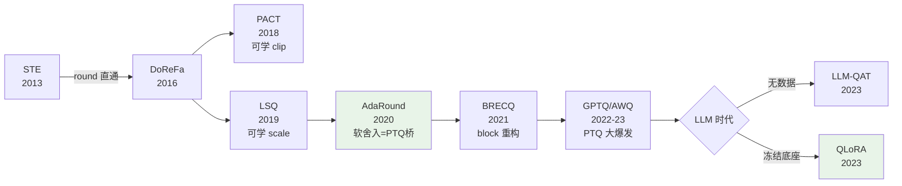

> **系列导航** ｜ [课程路线图](/quantization-roadmap/) ｜ **Part 4 · QAT** ｜ 第 21 篇 / 共 26 篇
>
> ← 20 蒸馏 + QAT（待写） ｜ 22 Reasoning QAT →（待写）

## TL;DR

> **TL;DR 1｜一句话**：QAT 把量化操作放进前向计算图、用梯度下降让权重和量化参数共同适应低比特网格；它的全部技术难点收敛为一个问题——round() 不可导，而过去十年的方法演进（STE → LSQ/PACT → AdaRound/BRECQ → LLM-QAT/QLoRA）就是这个问题在不同约束下的四种解法。

> **TL;DR 2｜反直觉发现**：QAT 并非总是优于 PTQ——在 4-bit 及以上，现代 PTQ（GPTQ/AWQ 配合旋转）几乎打平甚至超过轻量 QAT；QAT 的真正主场是 **2~4-bit 的 W2/W4 训练后精调、量化感知的蒸馏、以及 QLoRA 这类"冻结底座 + 量化分支反传"的参数高效场景**。

> **TL;DR 3｜系列定位**：本文是 QAT 方向的总纲，按"地基（STE）→ 参数学习（LSQ/PACT）→ PTQ 桥梁（AdaRound/BRECQ）→ LLM 实践（LLM-QAT/QLoRA）"四层组织。每层的数学内核都会给出完整推导，配套实验见文末读者 Lab。

## 符号约定与变量映射表

全文沿用 PTQ 主线的记号体系，新增 QAT 特有符号如下：

| 数学符号 | 含义 | 代码变量 | 典型形状 |
|---|---|---|---|
| \(w\) | 待量化的浮点权重 | `w` | `(K, N)` |
| \(\bar{w}\) | 量化后重建值 | `w_q` | `(K, N)` |
| \(s\) | 量化 step size（scale） | `scale` | 标量或 `(N,)` |
| \(z\) | 零点（affine 量化） | `zero_point` | 整数 |
| \(u = w/s\) | 缩放后的实值坐标 | `u` | 同 `w` |
| \(Q(u)\) | 线性量化算子（含 clamp+round） | `quantize(u)` | 同 `w` |
| \(\alpha\) | PACT 的 clamp 上界 / 裁剪系数 | `clip_alpha` | 标量 |
| \(v \in (0,1)\) | AdaRound 的连续舍入变量 | `rnd_soft` | `(K, N)` |
| \(h\) | 蒸馏的温度/软标签分布 | `soft_targets` | `(T, V)` |

## 1. PTQ 的能力边界：为什么还需要 QAT

PTQ 系列给出了一个清晰的结论链：per-group INT4 + 旋转/缩放校正可以做到几乎无损（[QuaRot](/2026/08/24/ptq-07-quarot-spinquant/)、[SmoothQuant](/2026/08/24/llm-quant-02-smoothquant-w8a8/)），但这条能力曲线在 2-bit 附近断崖式失效——我们在[量化00](/2026/08/23/llm-quant-00-quantizer-fundamentals-rtn/)里实测过，高斯分布在 b=2 时 SQNR 比 6.02b 规律低约 2.5 dB，网格太粗导致任何"事后校正"都无济于事。

此时只剩一条路：**让模型自己长成适合低比特网格的样子**。这就是 QAT（Quantization-Aware Training）的本质——量化不再是部署期的事后近似，而是训练目标的一部分。两种范式的系统对比：

| 维度 | PTQ | QAT |
|---|---|---|
| 是否需要训练数据/算力 | 少量校准集（数百样本） | 完整训练集或蒸馏数据 |
| 典型成本 | 分钟级（单卡可做） | 小时至天级（多卡） |
| 4-bit 表现 | 极佳（GPTQ/AWQ 已近无损） | 好，但相对优势小 |
| 2-bit 及以下 | 断崖失效 | 仍可用（配合蒸馏常可接受） |
| 部署友好度 | 高（离线完成） | 需要训练管线支持 |
| 代表工作 | GPTQ、AWQ、QuaRot | LSQ、AdaRound、QLoRA |

一个务实的决策规则：**先跑 PTQ 基线，只有当目标比特下 PTQ 掉点超过容忍度（如 ppl 劣化 >5%）时才升级 QAT**。这也是工业界 LLM 部署的主流路径——QLoRA 的爆红恰恰说明，多数团队需要的不是全量 QAT，而是"量化底座上的低成本适配"。

## 2. 地基：直通估计器（STE）

### 2.1 问题：round 不可导

线性量化算子写作：

$$\bar{w} = s \cdot Q(w/s), \quad Q(u) = \mathrm{clamp}\big(\mathrm{round}(u), -q_{max}, q_{max}\big)$$

`round` 是阶梯函数，导数几乎处处为零、在格点处无定义。反向传播经过它时梯度直接消失，无法训练。Bengio 等人在研究随机神经元时提出的处理方式后来被原样搬进了 QAT：**前向照常用 round，反向用一个替代函数的导数来更新**，即直通估计器（Straight-Through Estimator）：

$$\frac{\partial L}{\partial w} \approx \frac{\partial L}{\partial \bar{w}}$$

最常用的替代恒等函数（identity STE）：把 round 当作不存在，梯度原样通过。这显然是有偏的估计——但它简单、方差可控，且在实践中"偏差换可训性"是一笔划算的交易（原始论证见 [arXiv:1308.3432](https://arxiv.org/abs/1308.3432)）。

### 2.2 一个最小实现与两个工程细节

```python
class FakeQuant(torch.autograd.Function):
    """对称 per-tensor 假量化：前向离散、反向恒等直通。"""
    @staticmethod
    def forward(ctx, w, scale, qmax=127):
        return torch.clamp(torch.round(w / scale), -qmax, qmax) * scale

    @staticmethod
    def backward(ctx, grad_out):
        return grad_out, None, None      # 梯度原样穿过 round


# 细节一：scale 必须参与梯度截停判断——w/s 溢出 clamp 边界的部分
# 在 identity STE 下会拿到"虚假梯度"，主流框架（如 TensorFlow MOT、
# PyTorch FX 量化）会把它裁掉，只对 |u| <= qmax 的位置回传。
```

两个决定成败的细节：其一，**clamp 区间外的梯度要截断**，否则离群权重收到持续推向外界的梯度、训练震荡；其二，**scale 的取整稳定性**——若每步都用当前 min/max 重算 scale，量化网格会随权重漂移，损失曲面出现"移动台阶"。这两个细节正是下一节 LSQ/PACT 要形式化解决的问题。DoReFa-Net 则展示了把直通思想推广到低比特梯度本身的早期尝试（[arXiv:1606.06160](https://arxiv.org/abs/1606.06160)）。

## 3. 让量化参数也可学：LSQ 与 PACT

### 3.1 LSQ：step size 的精确梯度

LSQ（Learned Step Size Quantization，[arXiv:1902.08153](https://arxiv.org/abs/1902.08153)）的关键观察：与其每步从数据重估 scale，不如**把 scale 当作普通可学习参数**。设 \(v_i\) 是权重经线性变换后的实值激活，\(u_i = v_i / s\)，则：

$$\frac{\partial u_i}{\partial s} = \begin{cases} -v_i / s^2 & |u_i| \le q_{max} \\ 0 & \text{otherwise} \end{cases}$$

再配合 round 的 STE（\(\partial\,\mathrm{round}/\partial u \approx 1\)）与 clamp 的指示函数，得到完整的尺度梯度。这个看似简单的改动带来两个质变：其一，scale 从"被动统计量"变成"主动权衡者"——它会自动收缩以换取更小的整体重建误差；其二，训练后期可以给 scale 加上逐通道自由度，等效于学出一组最优粒度。

### 3.2 PACT：把截断上界交给训练

PACT（Parameterized Clipping Activation，[arXiv:1805.06085](https://arxiv.org/abs/1805.06085)）解决的是另一半问题：激活值的动态范围。它把激活的 clamp 上界参数化为 \(\alpha\)，前向 \(y = \min(x, \alpha)\)，反向梯度为 \(\mathbb{1}[x > \alpha]\)。随着训练推进，\(\alpha\) 单调收紧，激活分布被"修剪"进窄区间，使得低比特量化不再被尾部拖累。

| | LSQ | PACT |
|---|---|---|
| 可学对象 | step size \(s\) | 激活 clamp 上界 \(\alpha\) |
| 梯度来源 | \(u=w/s\) 对 \(s\) 求导 + STE | 指示函数 \(\mathbb{1}[x>\alpha]\) |
| 解决的问题 | 权重侧网格间距 | 激活侧动态范围 |
| 与 PTQ 的对应物 | MSE 最优裁剪（[量化00](/2026/08/23/llm-quant-00-quantizer-fundamentals-rtn/)） | OmniQuant 的可学习 clip（[OmniQuant](/2026/08/24/ptq-03-awq-omniq/)） |
| 典型用法 | 权重/激活统一量化训练 | 激活量化、与 LSQ 组合 |

值得玩味的是最后一行：LSQ/PACT 学的东西，OmniQuant 用免训练的方式也学了个七七八八——这是"PTQ 吞噬 QAT"叙事的第一个信号。

## 4. 通往 PTQ 的桥：AdaRound 与 BRECQ

### 4.1 AdaRound：舍入方向本身是优化变量

RTN 的舍入是最小化逐元素误差的贪心，但[量化全景](/2026/08/24/ptq-00-overview/)里我们推导过：正确的目标应是最小化**层输出误差** \(\|\Delta W x\|^2\)，其中每个权重的舍入方向（向上 or 向下）通过 Hessian 相互耦合。AdaRound（[arXiv:2004.10568](https://arxiv.org/abs/2004.10568)）把这个组合问题连续松弛：为每个权重引入软变量

$$v_i \in (0,1), \quad \tilde{\Delta}_i = h(v_i), \quad h(v)=\mathrm{clip}(v+\tfrac{1}{2}, 0, 1)$$

训练目标 = 层输出重构损失 + 正则项 \(-\lambda \sum_i \log^2(2v_i - |2v_i-1|)\)，后者在训练中自动把 \(v_i\) 推向 0 或 1（硬舍入），推理时零开销。**它不需要标签、不需要端到端反传，几百个样本即可**——所以 AdaRound 本质是 PTQ 方法，却用了 QAT 的优化语法，是两界之间的桥。

### 4.2 BRECQ：把重构单元升到 block 级

AdaRound 只在单层内做重构，跨层误差累积无人管辖。BRECQ（Li et al., AAAI 2021，*Towards Accurate Post-training Network Quantization via Bit-Split and Switching*）把重构单元提升为残差 block，并按 stage 划分位宽（敏感 stage 多给 bit），在 ImageNet 上首次把 8-bit 网络做到精度无损、4-bit 掉点 <1%。block 级重构的思想直接影响了后来的 GPTQ（按列消元的全局视角）与 QDrop 等工作。

## 5. LLM 时代的 QAT：LLM-QAT 与 QLoRA

进入 LLM 阶段，QAT 的形态发生了两个根本变化：**训练数据不可得**（预训练语料受限）与**全参数训练不可负担**（千亿参数的反传）。

**LLM-QAT**（[arXiv:2305.17888](https://arxiv.org/abs/2305.17888)）回应前者：data-free 蒸馏——从模型自身采样生成句首词、让原模型补全出合成数据集，再用原模型（teacher）对量化模型（student）做 token 级 KL 蒸馏。整条管线无需任何真实训练语料，把 7B/13B 模型压到 4-bit 权重+激活仍保持可用困惑度。

**QLoRA**（[arXiv:2305.14314](https://arxiv.org/abs/2305.14314)）回应后者：底座权重冻结并量化为 NF4（信息论最优的 4-bit 常数码本，我们已在实验中实测其 SQNR 约 20.7 dB，见配套实验 `fp8_mxfp4_formats`），反传时按需上转到 BF16 计算，可训练参数只有 LoRA 低秩分支。严格说 QLoRA 不训练底座、不算经典 QAT，但"**量化底座上的量化感知适配**"让它在工程语义上是 QAT 思想的最高效变体——单卡 48GB 微调 65B 模型的成绩单至今仍是行业标杆。



## 6. 批判与展望：Takeaway 与下一篇

### Takeaway

- **STE 是全部 QAT 的地基**：它的偏差换来可训性；clamp 截断与 scale 稳定性是两个必须处理的工程细节。
- **LSQ/PACT 把量化超参变成参数**，OmniQuant 证明了同样的事可以免训练完成——选型时先问自己是否真的需要梯度。
- **AdaRound/BRECQ 是 PTQ 与 QAT 的过渡带**：软变量优化 + 局部重构，无需端到端训练就能吃到 QAT 的大部分红利。
- **LLM 时代 QAT 的两个支点是数据与算力**：data-free 蒸馏解决前者，冻结底座+低秩分支解决后者（QLoRA）。
- 决策顺序永远是：**group-wise PTQ → 旋转/缩放校正 → （仍不够）→ AdaRound 类局部重构 → （极端低比特）→ 真 QAT / QLoRA**。

### 读者 Lab

配套实验仓库 [github.com/lrypcy/ipynbs](https://github.com/lrypcy/ipynbs) 的 `experiments/quantization/` 下有全部 PTQ 系列的可复现实验（纯 numpy，CPU 秒级）。动手试试：① 把 `omniq_learnable_clip/run.py` 里的黄金分割搜索换成 LSQ 式 scale 梯度，观察从分位数初始化出发能否追平逐列最优（我们已实测朴素 STE 从 MinMax 出发会失效，仅降 2.2%）；② 在 `fp8_mxfp4_formats/run.py` 里加一个 E3M4 格式，验证尾数/指数位分配对拉普拉斯分布的最优解偏移；③ 用 `gptq_obcq/run.py` 的 Hessian 框架复现 AdaRound 的单层重构目标，比较两种舍入策略的输出 MSE。

中文社区方面，知乎上「QLoRA 微调实践」「大模型量化」话题下有大量一手踩坑记录（zhihu.com），适合作为论文之外的工程参照。

下一篇将展开 QAT 系列的第一篇：《STE 深度解析：偏差、方差与随机舍入》，从梯度估计器的统计性质讲起。

## 参考清单

**核心论文**

1. Bengio et al., *Estimating or Propagating Gradients Through Stochastic Neurons for Conditional Computation*, 2013. [arXiv:1308.3432](https://arxiv.org/abs/1308.3432)（STE 起源）
2. Jacob et al., *Quantization and Training of Neural Networks for Efficient Integer-Arithmetic-Only Inference*, 2017. [arXiv:1712.05877](https://arxiv.org/abs/1712.05877)（假量化节点 + 训练部署一致性）
3. Zhu et al., *Trained Quantization Thresholds (TQT)*, 2019（与 LSQ 平行的阈值学习路线）
4. Choi et al., *PACT: Parameterized Clipping Activation for Quantized Neural Networks*, 2018. [arXiv:1805.06085](https://arxiv.org/abs/1805.06085)
5. Esser et al., *Learned Step Size Quantization*, ICLR 2020. [arXiv:1902.08153](https://arxiv.org/abs/1902.08153)
6. Nagel et al., *Up or Down? Adaptive Rounding for Post-Training Quantization*, ICML 2020. [arXiv:2004.10568](https://arxiv.org/abs/2004.10568)
7. Li et al., *BRECQ: Towards Accurate Post-training Network Quantization via Bit-Split and Switching*, AAAI 2021（会议论文，无 arXiv 预印本）
8. Dettmers et al., *QLoRA: Efficient Finetuning of Quantized LLMs*, NeurIPS 2023. [arXiv:2305.14314](https://arxiv.org/abs/2305.14314)
9. Liu et al., *LLM-QAT: Data-Free Quantization Aware Training for Large Language Models*, 2023. [arXiv:2305.17888](https://arxiv.org/abs/2305.17888)

**开源实现**

- [PyTorch torch.ao.quantization](https://pytorch.org/docs/stable/quantization.html)：FX 图模式 QAT 官方管线（LSQ 风格 observer + fake quant）
- [TensorFlow Model Optimization Toolkit](https://www.tensorflow.org/model_optimization)：Jacob et al. 假量化管线的参考实现
- [bitsandbytes](https://github.com/TimDettmers/bitsandbytes)：QLoRA 的 NF4 底座实现
- [HuggingFace PEFT](https://github.com/huggingface/peft)：LoRA/QLoRA 标准接入层

**系列互引**

- PTQ 总览与数学地基：[量化00](/2026/08/23/llm-quant-00-quantizer-fundamentals-rtn/) · [PTQ 全景](/2026/08/24/ptq-00-overview/)
- 本文对应的 PTQ 侧方法：[GPTQ](/2026/08/24/ptq-02-gptq/) · [AWQ/OmniQuant](/2026/08/24/ptq-03-awq-omniq/)
- 配套实验：[ipynbs/experiments/quantization](https://github.com/lrypcy/ipynbs/tree/main/experiments/quantization)
