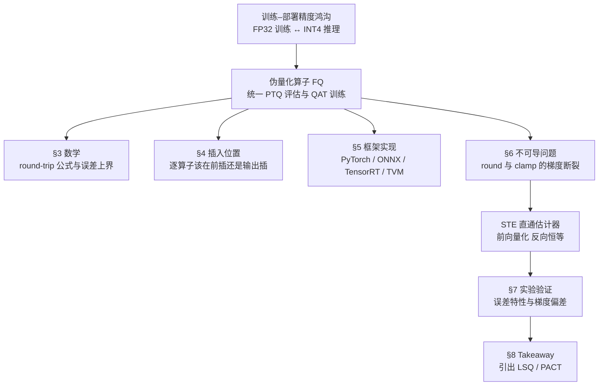

> **系列导航** ｜ [课程路线图](/quantization-roadmap/) ｜ **Part 4 · QAT** ｜ 第 17 篇 / 共 26 篇
>
> [← 16 QServe/QQQ](/2026/08/24/ptq-13-qserve-qqq/) ｜ [18 LSQ/PACT/DSQ →](/2026/08/29/llm-quant-18-lsq-pact-dsq/)

> **TL;DR**
>
> * **核心结论**：量化感知训练（QAT）的全部技巧建立在一个算子之上——伪量化（Fake-Quantize）。它的前向就是01 篇的 RTN round-trip：\(\hat{x}=s\,\mathrm{clip}(\mathrm{round}(x/s),\,q_{\min},q_{\max})\)；反向用直通估计器（STE）让梯度假装量化不存在。本篇把这个算子的数学、插入位置、框架实现、反传断裂问题一次性讲透：**伪量化把 PTQ 的离线评估与 QAT 的在线训练统一到同一张计算图里——同一个算子，PTQ 用来量后验证，QAT 用来训中模拟**。
> * **反直觉发现**：① 4-bit per-tensor 伪量化的 SNR 低至3.02 dB，而 per-group(128) 恢复到14.10 dB——粒度从 per-tensor 到 per-group 在同一算子上白捡11 dB；② STE 在有效范围内梯度均值为1.0（完美直通），但软量化真实梯度只有0.5——**STE 系统性高估梯度约一倍**，偏差来自 round 的平台效应；③ 权重伪量化只需一次插入（离线），激活伪量化必须逐前向动态计算 scale——两者的工程复杂度差一个数量级。
> * **系列定位**：这是「大模型量化算法」第二部分（QAT）的开篇。PTQ 部分（00–16 篇）的共同假设是"训练结束、只调权重"；QAT 部分从本篇开始打破这个假设——把量化搬进计算图，让模型在量化约束下继续学习。伪量化算子是 QAT 的全部地基，后续 LSQ（18 篇）学 scale、PACT 学 clamp 上界、AdaRound/BRECQ（19 篇）做 PTQ-QAT 之间的桥，全都从这个算子出发。配套实验真实可跑（纯 numpy，几秒出图）：fake_quant_ste_check。

---

## 1. 为什么要把量化搬进计算图

### 1.1 训练–部署的精度鸿沟

大模型的训练与部署运行在两套完全不同的数值体系上：

| 维度 | 训练框架 | 推理引擎 |
|---|---|---|
| 权重精度 | FP32 / BF16 / FP16 | INT4 / INT8 / FP8 |
| 激活精度 | FP32 / BF16 | INT8 / INT4 / 混合精度 |
| 计算单元 | Tensor Core (FP16/BF16) | Tensor Core (INT8/FP8) / INT GEMM kernel |
| 核心操作 | 反向传播 + 梯度更新 | 纯前向推理 |

这个鸿沟意味着：**训练时看到的数值分布 ≠ 部署时量化后的数值分布**。模型在 FP32 下优化的权重，一旦量化到 INT4，层输出就偏了——01 篇证明这个偏差在 per-tensor 粒度下可达11 dB 的 SNR 损失。

### 1.2 PTQ 与 QAT：同一个算子的两种用法

伪量化算子（Fake-Quantize，简称 FQ）就是为弥合这个鸿沟而生的。它的定义极其简单：

$$
\mathrm{FQ}(x;\,s,\,z_p,\,b) = s \cdot \mathrm{clip}\big(\mathrm{round}(x/s) + z_p,\; q_{\min},\; q_{\max}\big)
$$

前向执行一次量化再反量化的 round-trip（01 篇 §3.1 的仿射量化器），输出仍然是浮点数——但这个浮点数被"吸附"到了量化网格上。

**PTQ 用法**：训练完成后，在权重上插入伪量化算子，用少量校准数据跑前向，统计量化误差，作为评估基线。Scale 由校准集离线确定，插入后不再训练。

**QAT 用法**：训练过程中，在权重和/或激活上插入伪量化算子，每次前向都模拟量化误差，反向传播时用 STE 让梯度"穿过"量化节点继续更新权重。Scale 可以固定（由校准集提供），也可以作为可学习参数（LSQ，18 篇预告）。

两者的对比如下：

| 维度 | PTQ | QAT |
|---|---|---|
| 伪量化用途 | 离线评估量化误差 | 在线训练中模拟量化效应 |
| 权重是否更新 | 否（固定量化） | 是（在量化约束下学习） |
| Scale 来源 | 校准集离线统计 | 校准集或可学习参数 |
| 训练开销 | 零（仅一次前向） | 接近正常训练（多一次 FQ 前向） |
| 代表算法 | RTN, GPTQ, AWQ | LSQ, PACT, LLM-QAT |

这张表的关键洞察：**伪量化算子是 PTQ 与 QAT 的公共组件**——区别不在于算子本身，而在于它所处的上下文（是否在训练循环中）。理解了这个算子，就理解了 QAT 的全部地基。

整篇的路线图如下：



## 2. 符号字典增量表

全系列沿用01 篇的符号约定：\(x\) 为激活、\(W\) 为权重、\(s\) 为步长、\(z_p\) 为零点、\(q\) 为整数码、\(\hat{x}\) 为反量化值、\(b\) 为位宽、\(q_{\min}=-2^{b-1}\)、\(q_{\max}=2^{b-1}-1\)。本篇只新增以下行：

| 符号 | 含义 | 易混淆提示 |
|---|---|---|
| \(\mathrm{FQ}(\cdot)\) | 伪量化算子（Fake-Quantize），前向 round-trip、反向 STE | 不同于量化器 \(Q(\cdot)\)——FQ 输出浮点，\(Q\) 输出整数 |
| \(\mathrm{DQ}(\cdot)\) | 反量化算子（DequantizeLinear），\(\mathrm{DQ}(q)=s(q-z_p)\) | ONNX 图中 QuantizeLinear / DequantizeLinear 分开表示 |
| \(\mathrm{QDQ}\) | QuantizeLinear → DequantizeLinear 对的缩写 | ONNX / TensorRT 术语，插入时成对出现 |
| \(s_w\) | 权重的量化步长（per-channel 或 per-group） | 下标 \(w\) 区分于激活步长 \(s_a\) |
| \(s_a\) | 激活的量化步长（per-token 或 per-tensor） | 动态计算：每个前向 pass 重新统计 |
| \(\mathcal{G}\) | 量化网格点集合，\(\mathcal{G}=\{s(q-z_p)\mid q\in[q_{\min},q_{\max}]\}\) | round-trip 后所有值被吸附到 \(\mathcal{G}\) 上 |
| \(\delta_{\mathrm{STE}}\) | STE 的隐式梯度算子，\(\partial\hat{x}/\partial x\approx\mathbf{1}_{[\mathrm{in\;range}]}\) | 这是一个算子近似，不是精确导数 |
| \(T\) | 软量化的温度参数（仅 §6.2 使用） | \(T\to 0\) 时软量化趋近硬量化 |

### 变量映射表

| 数学符号 | 代码变量 | Shape | 说明 |
|---|---|---|---|
| \(x\) | `x` | `(n,)` 或 `(B, T, n)` | 激活张量（浮点） |
| \(W\) | `W` | `(m, n)` | 权重矩阵 |
| \(s\) / \(s_w\) / \(s_a\) | `s` / `s_w` / `s_a` | 标量或广播数组 | 量化步长 |
| \(z_p\) | `zp` | 标量或广播整数 | 整数零点 |
| \(\hat{x}\) | `x_hat` | 同 `x` | 伪量化输出（浮点） |
| \(q\) | （中间量） | int64 | 量化整数码 |
| \(b\) | `b` | int | 位宽 |
| \(q_{\min}\), \(q_{\max}\) | `QMIN(b)`, `QMAX(b)` | int | \(-2^{b-1}\), \(2^{b-1}-1\) |
| \(\mathrm{FQ}(x)\) | `fake_quantize_forward(x, s, b)` | 同 `x` | 前向伪量化 |
| \(\delta_{\mathrm{STE}}\) | `fake_quantize_ste_grad(x, grad, s, b)` | 同 `x` | 反向 STE 梯度 |
| \(T\) | `temperature` | float | 软量化温度（实验用） |
| \(\mathcal{G}\) | `grid_points` | `(2^b,)` | 量化网格点集合 |

## 3. 伪量化算子的数学

### 3.1 QuantizeLinear → DequantizeLinear Round-trip

从01 篇 §3.1 的仿射量化器出发，伪量化算子就是一步量化紧跟一步反量化：

$$
\hat{x} = \mathrm{FQ}(x) = s \cdot \mathrm{clip}\Big(\mathrm{round}\big(\tfrac{x}{s}\big)+z_p,\; q_{\min},\; q_{\max}\Big)
$$

展开来看，round 和 clip 在公式中各司其职：

- **round**：将连续值 \(x/s\) 映射到最近整数，产生舍入误差 \(\epsilon_r \in [-0.5, 0.5]\)（01 篇 §3.2 的 granular error）。
- **clip**：将超出 \([q_{\min}, q_{\max}]\) 的整数截断到边界，产生裁剪误差 \(\epsilon_c\)（01 篇 §3.2 的 saturation error）。

Round-trip 后，数值被"吸附"到量化网格点上：\(\hat{x} \in \mathcal{G}\)。非网格点的原始值 \(x\) 与最近网格点之差，就是伪量化引入的误差 \(\epsilon = x - \hat{x}\)。

### 3.2 误差分解与上界

对任意 \(x\)，误差可分解为：

$$
\epsilon = \epsilon_r + \epsilon_c, \qquad |\epsilon_r| \le s/2, \qquad \epsilon_c = \begin{cases} x - s\cdot q_{\max} & x > s\cdot q_{\max} \\ x - s\cdot q_{\min} & x < s\cdot q_{\min} \\ 0 & \text{otherwise} \end{cases}
$$

在 clip 范围内（\(\lvert x\rvert \le s\cdot q_{\max}\)），误差上界为 \(s/2\)。这直接决定了伪量化算子的精度：**步长 \(s\) 越小（位宽越高或粒度越细），误差上界越小**。

对称量化（\(z_p=0\)）时，\(s = \max\lvert x\rvert/q_{\max}\)（min-max scale），网格关于零对称。非对称量化时 \(z_p\neq 0\)，网格平移以覆盖 \([x_{\min}, x_{\max}]\)（01 篇 §3.1 推导）。

### 3.3 对称 vs 非对称在算子参数上的表达

| 模式 | 算子参数 | 反量化公式 | 网格覆盖 |
|---|---|---|---|
| 对称（\(z_p=0\)） | \(s=\max\lvert x\rvert/q_{\max}\) | \(\hat{x}=sq\) | \([-sq_{\max},\;sq_{\max}]\) |
| 非对称 | \(s,\;z_p\) | \(\hat{x}=s(q-z_p)\) | \([s(q_{\min}-z_p),\;s(q_{\max}-z_p)]\) |

工程经验：**LLM 权重用对称**（分布近似零对称），**激活视情况用非对称**（ReLU/GELU 后单边偏斜）。01 篇 §3.2 已给出数字支撑。

### 3.4 粒度在算子参数上的表达

粒度决定一组 \((s, z_p)\) 覆盖多少个元素——粒度越细，每组元素越少，\(s\) 越小，误差越小。但 scale 元数据本身要存 FP16/INT32，粒度不是免费的（01 篇 §7.2 的有效位宽公式）：

| 粒度 | 参数组数 | \(s\) 的 Shape | 典型配置 |
|---|---|---|---|
| per-tensor | 1 | 标量 | 动态激活量化 |
| per-channel | \(m\)（输出通道数） | \((m,1)\) | 权重量化默认 |
| per-group(\(g\)) | \(m \times n/g\) | \((m,n/g,1)\) | AWQ/GPTQ, \(g=128\) |

### 3.5 网格吸附效应：实验验证

伪量化 round-trip 最直观的效果是**网格吸附**：非网格点被拉到最近的网格电平。01 篇 §4 证明 per-tensor 在 outlier 权重上 SNR 仅0.97 dB；本篇在含 outlier 通道的256×1024 权重矩阵上，系统对比三种粒度 × 三种位宽（配套实验 Demo A，`experiments/fake_quant_ste_check/run.py`）：


| 位宽 | 粒度 | MSE | SNR (dB) | 最大绝对误差 |
|---|---|---|---|---|
| 4-bit | per-tensor | 9.75e-04 | 3.02 | 1.060 |
| 4-bit | per-channel | 2.71e-04 | 8.58 | 0.645 |
| 4-bit | per-group(128) | 7.61e-05 | **14.10** | 0.185 |
| 6-bit | per-tensor | 5.66e-04 | 5.38 | 0.242 |
| 6-bit | per-channel | 3.40e-05 | 17.60 | 0.185 |
| 6-bit | per-group(128) | 6.82e-06 | 24.57 | 0.185 |
| 8-bit | per-tensor | 4.03e-04 | 6.86 | 0.059 |
| 8-bit | per-channel | 3.62e-06 | 27.32 | 0.059 |
| 8-bit | per-group(128) | 6.13e-07 | **35.04** | 0.059 |

**这张表回答三个问题**：

1. **粒度的11 dB 白捡**：4-bit 下 per-group(128) 比 per-tensor 高 11.08 dB——这个差距完全来自 scale 被 outlier 通道绑架后逐步释放的过程。per-channel 解决行间 outlier（+5.56 dB），per-group 进一步隔离行内散点（+5.52 dB）。
2. **位宽提升的边际递减**：per-group 下从 4-bit 到 8-bit 提升 20.94 dB（约每 bit 5.2 dB），低于01 篇的 6.02 dB 理论值——因为 outlier 引入的裁剪误差在低位宽更重，抵消了部分位宽收益。
3. **最大绝对误差的"天花板"效应**：per-channel 和 per-group 在 6-bit 和 8-bit 的最大绝对误差均为0.185（由 outlier 通道的最大值决定，已被 per-channel 的行级 scale 吸收），只有 per-tensor 才能看到全局 outlier 撑大的误差。

## 4. 插入位置学

伪量化算子的数学很简单；真正决定 QAT 效果的是**在哪里插入**。这是本篇的重头戏。

### 4.1 权重 only vs 权重 + 激活

两种插入策略对应不同的量化目标：

| 策略 | 伪量化对象 | 训练目标 | 工程复杂度 | 代表场景 |
|---|---|---|---|---|
| 权重 only | \(W\) | 让模型适应权重量化误差 | 低（scale 静态） | W4A16（llama.cpp, GPTQ 后微调） |
| 权重 + 激活 | \(W\) 和 \(X\) | 同时适应两侧量化误差 | 高（\(s_a\) 动态） | W8A8（TensorRT, ONNX Runtime） |

**权重伪量化**的 scale 在训练前由校准集确定，训练过程中固定不变——它的伪量化算子就是"把 \(W\) 走一遍 round-trip"，让优化器看到量化后的 \(W\) 而非浮点 \(W\)。

**激活伪量化**的 scale 必须在每次前向传播时动态计算（因为激活值随输入变化）。这就是为什么激活量化的工程复杂度远高于权重量化——scale 的统计本身就是一个算子，需要挂在计算图中。

### 4.2 逐算子的插入规则

不同算子对伪量化的敏感度不同，插入位置也不同。以下是最常见的算子类型及其插入策略：

| 算子类型 | 权重插入位置 | 激活插入位置 | 原因 |
|---|---|---|---|
| Conv / Linear | 权重参数上（训练前离线） | 算子输出（Activation 后） | 权重是静态参数可离线量化；激活在输出端量化可覆盖 bias 修正 |
| MatMul (Attention) | 两个输入 K, V | 同上 | Q/K/V 投影后分别量化；Attention score 通常不量化（Softmax 敏感） |
| LayerNorm | 无权重（gamma/beta 量化收益低） | 算子输入或输出 | LN 是归一化算子，输入分布已接近标准正态，量化误差被放大 |
| Softmax | 无 | 输出 | Softmax 输出在 \([0,1]\) 之间，动态范围小，量化友好；但输入（logits）通常不量化 |
| 残差加法 | 无 | 两个操作数 | 残差连接的两个分支都需要量化到同一网格，否则加法语义不一致 |
| GELU / ReLU | 无 | 输出 | 激活函数输出是下一层的输入，量化点在输出端 |

核心原则：**激活的伪量化必须放在激活值确定之后、进入下一个算子之前**。原因是激活伪量化需要模拟真实的量化误差传播——如果放在算子之前（输入端量化），误差会被算子内部的浮点运算部分"吸收"，无法准确反映部署时的量化效应。

### 4.3 为什么激活伪量化必须模拟 clamp 后的饱和效应

权重的分布相对稳定（训练完成后变化很小），但激活的分布随输入剧烈变化。如果只模拟 round 而不模拟 clip，QAT 就无法让模型学会"避开量化范围之外的值"——这恰恰是 QAT 相比 PTQ 的核心优势。

以 ReLU 后的激活为例：大部分值在 \([0, M]\) 之间（\(M=s\cdot q_{\max}\)），但偶有大值超出范围。如果不模拟 clip，优化器会认为这些大值可以自由存在；部署时它们被截断，误差无法预测。伪量化算子的 clip 正是在告诉优化器：**"超过 \(M\) 的值会被截断到 \(M\)，请学会控制它们"**。

这就是 PACT（Parameterized Clipping Activation，arXiv:1805.06085）的核心思想：把 clip 的上界 \(M\) 也变成可学习参数，让模型自己决定"在哪里截断最好"——18 篇展开。

### 4.4 BN folding 与伪量化的配合

BatchNorm 在推理时可以折叠进前一层的 Conv/Linear：

$$
W' = \gamma \odot W / \sqrt{\sigma^2+\epsilon}, \qquad b' = \gamma \odot (b - \mu)/\sqrt{\sigma^2+\epsilon} + \beta
$$

在 QAT 中，BN folding 必须在伪量化插入**之前**完成。原因是：如果先插伪量化再折叠 BN，BN 的缩放因子 \(\gamma/\sqrt{\sigma^2+\epsilon}\) 会作用在量化后的值上，改变 scale 的有效范围——部署时 BN 已被折叠、不存在这个缩放，导致训练–部署不一致。

正确的流水线：**先 fold BN → 再插入伪量化**。这也是 PyTorch torch.ao 的 eager mode 默认流程。

### 4.5 QDQ 图等价变换

在 ONNX / TensorRT 的显式量化图中，QuantizeLinear → DequantizeLinear（QDQ）节点可以进行一系列等价变换，用于图优化：

| 变换规则 | 说明 | 效果 |
|---|---|---|
| QDQ 抵消 | \(\mathrm{DQ}(\mathrm{Q}(x))=x\)（无量化误差时） | 相邻 QDQ 对可消除（训练时无实际量化，仅占位） |
| 常量折叠 | QDQ 作用于常量权重 → 立即量化存储 | 减少运行时计算量 |
| QDQ 前推 | 将 QDQ 从算子输出移到下一个算子输入 | 改变量化点但数学等价 |
| QDQ 合并 | 多个 QDQ 合并为一个 | 减少冗余计算 |

这些变换在 TensorRT 的 QDQ graph optimizer 中自动执行——它们的前提是 QDQ 的语义定义清晰：**QuantizeLinear 输出整数，DequantizeLinear 输入整数输出浮点**，两者成对出现时 round-trip 语义不变。

## 5. 框架实现对照

### 5.1 PyTorch torch.ao.quantization

PyTorch 提供两种量化流程：

**Eager Mode（手动 fuse + insert）**：
1. 手动指定需要量化的子模块（通常是 `nn.Linear`, `nn.Conv2d`）
2. 调用 `torch.ao.quantization.fuse_modules()` 把 Conv + BN + ReLU 融合
3. 调用 `torch.ao.quantization.prepare()` 插入伪量化 observer
4. 用校准数据跑前向，observer 统计 activation 的 scale
5. 调用 `torch.ao.quantization.convert()` 将 observer 替换为实际量化算子

**FX Graph Mode（自动插桩）**：
1. 通过 `torch.ao.quantization.quantize_fx()` 一步完成
2. FX tracing 自动捕获所有算子调用，插入伪量化节点
3. 支持更复杂的模型拓扑（条件分支、动态 shape）

核心区别：eager mode 需要人工指定量化点，FX mode 自动推断。但两者共享同一个伪量化算子实现——`torch.ao.quantization.FakeQuantize`，内部就是 round + clip + STE。

### 5.2 ONNX 显式 QDQ 图

ONNX 用两个独立算子表示伪量化：

```
QuantizeLinear(x, scale, zero_point) → q    # 浮点 → 整数
DequantizeLinear(q, scale, zero_point) → x_hat  # 整数 → 浮点
```

在 QAT 训练图中，这对算子被插入到每个需要量化的权重和激活上。导出为 ONNX 后，QDQ 节点作为"占位符"保留——推理引擎（TensorRT、ONNX Runtime）在加载图时识别 QDQ 模式并替换为真正的量化 kernel。

### 5.3 TensorRT 的 QDQ 消费

TensorRT 的 explicit quantization 模式直接消费 QDQ 图：

1. 解析 ONNX 图，识别 QuantizeLinear → 算子 → DequantizeLinear 模式
2. 为每个 QDQ 对分配量化参数（从 QDQ 节点的 scale/zero_point 读取）
3. 将 QDQ + 算子融合为 INT8/FP8 kernel
4. 对不支持量化的算子，自动插入反量化 + 浮点计算 + 重新量化

TensorRT 的 QDQ graph optimizer 还会执行 §4.5 的等价变换：抵消冗余 QDQ、前推量化点、常量折叠权重。

### 5.4 TVM Relay QNN：三段式 Pass

TVM 的量化流程（relay.qnn）是本节重点——因为本系列的读者群体是 TVM / AI 编译器受众。TVM 的量化设计与 PyTorch / ONNX 有本质区别：**它不是在训练框架里插伪量化算子，而是在编译图上做量化标注和 lowering**。

TVM relay qnn 的量化分为三个 pass，形成一个清晰的流水线：

**第一段：Annotate（标注）**

遍历 Relay IR 图，在需要量化的算子输入/输出上插入 `qnn.quantize` 和 `qnn.dequantize` 节点。标注规则由 ` annotate_required_ops` 函数定义——默认标注所有支持量化的算子（conv2d, dense, batch_matmul 等）。

标注后的图看起来像：

```
%0 = qnn.quantize(%data, scale=..., zero_point=...)
%1 = qnn.quantize(%weight, scale=..., zero_point=...)
%2 = qnn.dequantize(%0, scale=..., zero_point=...)
%3 = qnn.dequantize(%1, scale=..., zero_point=...)
%4 = nn.conv2d(%2, %3, ...)
```

注意：这里的 `qnn.quantize` / `qnn.dequantize` 是**显式节点**（类似 ONNX 的 QDQ），不是隐式的伪量化。它们的语义是：quantize 输出 INT8，dequantize 输出 FP32——中间的计算用 INT8 进行。

**第二段：Calibrate（校准）**

用校准数据跑前向，统计每个 `qnn.quantize` / `qnn.dequantize` 节点的 scale 和 zero_point。TVM 支持多种校准策略：

| 策略 | 方法 | 特点 |
|---|---|---|
| min-max | 统计全局 min/max | 简单但受 outlier 影响 |
| percentage | 分位数截断（如99.99%） | 对 outlier 更鲁棒 |
| KL divergence | 最小化量化前后分布的 KL 散度 | 计算量大但精度最好 |

校准结果写入图中每个 QDQ 节点的属性——这一步完成后，所有 scale 参数确定。

**第三段：Realize（落地）**

这是 TVM 独有的关键步骤——将 `qnn.quantize` / `qnn.dequantize` 节点**融合进算子**，生成真正的 INT8 kernel。Realize pass 做三件事：

1. **QDQ 融合**：将 `qnn.quantize → conv2d → qnn.dequantize` 融合为 `qnn.conv2d`（INT8 版本）
2. **Scale lowering**：将反量化 scale 乘进 bias 或下一个算子的 scale，消除冗余反量化
3. **合法化**：确保所有 INT8 算子的输入输出类型一致，处理不支持量化的算子（自动 fallback 到 FP32）

Realize 后的图中不再有独立的 quantize/dequantize 节点——它们已经被"吃进"了 INT8 算子内部。

**TVM 独有的 `qnn.simulated_quantize`**

除了上述显式量化路径，TVM 还提供 `relay.qnn.simulated_quantize` 算子——这是一个**伪量化算子**，前向执行 round-trip 但输出浮点（类似 PyTorch 的 FakeQuantize），反向用 STE。它主要用于：

- QAT 训练：在 TVM 的训练图中插入 simulated_quantize，让模型在量化约束下学习
- PTQ 评估：在不需要真正 INT8 kernel 的场景下，快速评估量化误差

`simulated_quantize` 的签名：

```python
relay.qnn.simulated_quantize(
    data,        # 输入张量
    scale,       # 量化步长
    zero_point,  # 整数零点
    min_range,   # 校准得到的最小值（用于 clip）
    max_range,   # 校准得到的最大值（用于 clip）
    # 输出：round-trip 后的浮点值
)
```

它在 relay IR 中的 lowering 路径：`simulated_quantize → qnn.quantize + qnn.dequantize`（在 realize pass 中进一步融合）。这使得 TVM 的 QAT 训练图可以与 PTQ 图共享同一套量化基础设施。

### 5.5 框架对比总表

| 框架 | 图表示 | QDQ 语义 | 量化流程 | TVM 特色 |
|---|---|---|---|---|
| PyTorch | Module / FX Graph | FakeQuantize（伪量化，浮点输出） | prepare → calibrate → convert | — |
| ONNX | 显式算子图 | QuantizeLinear + DequantizeLinear（显式节点） | 导出后由推理引擎消费 | — |
| TensorRT | 解析 ONNX QDQ | 融合进 INT8 kernel | QDQ 图优化 → kernel 融合 | — |
| TVM Relay | Relay IR 节点 | qnn.quantize / qnn.dequantize（显式）+ simulated_quantize（伪量化） | annotate → calibrate → realize 三段式 | realized 后 QDQ 融入 INT8 算子 |

## 6. 不可导问题与 STE

### 6.1 Round 与 Clamp 的梯度断裂

伪量化算子的反向传播面临一个根本问题：**round 和 clip 的导数几乎处处为零**。

对 \(q = \mathrm{round}(x/s)\)：
- 在任意两个网格点之间，\(q\) 是常数，\(\partial q/\partial x = 0\)
- 在网格点上，\(q\) 跳变，导数不存在（Dirac delta）

对 \(q = \mathrm{clip}(q', q_{\min}, q_{\max})\)：
- 在 \(q_{\min} < q' < q_{\max}\) 时，\(\partial q/\partial q' = 1\)（恒等）
- 在 \(q' \le q_{\min}\) 或 \(q' \ge q_{\max}\) 时，\(\partial q/\partial q' = 0\)（饱和区）

组合起来，\(\partial\hat{x}/\partial x\) 在几乎所有点上为零——梯度无法穿过伪量化算子传回权重，训练完全停滞。

### 6.2 STE：直通估计器

Bengio et al.（arXiv:1308.3432）提出 Straight-Through Estimator 来解决这个问题。STE 的核心思想极其简单：

**前向**：正常执行伪量化 round-trip
$$
\hat{x} = \mathrm{FQ}(x)
$$

**反向**：假装量化不存在，梯度直通
$$
\frac{\partial\mathcal{L}}{\partial x} \approx \frac{\partial\mathcal{L}}{\partial\hat{x}}
$$

更精确的 STE 还会考虑 clip 的饱和区：只有在量化范围内的元素，梯度才能传回；超出范围的元素，梯度被置零：

$$
\delta_{\mathrm{STE}}(x) = \begin{cases} 1 & q_{\min} < \mathrm{round}(x/s)+z_p < q_{\max} \\ 0 & \text{otherwise} \end{cases}
$$

### 6.3 STE 的有偏性分析

STE 是一个有偏的梯度估计。本篇用一个思想实验说明偏差来源：

考虑一个标量 \(x\) 在网格区间 \([ks, (k+1)s]\) 内。前向 round 后 \(\hat{x}=ks\)（或 \((k+1)s\)），输出在该区间内是**常数**——所以真实梯度为0。但 STE 给出梯度1（直通），系统性地高估了这个区间的梯度。

偏差的定量分析。设 \(x\) 在网格区间内均匀分布，\(\hat{x}=\mathrm{round}(x/s)\cdot s\)。STE 梯度为1，真实梯度为0（区间内常数函数）。方差：

$$
\mathrm{Var}[\delta_{\mathrm{STE}}] = \mathbb{E}[(\delta_{\mathrm{STE}}-\nabla_x\hat{x})^2] = \mathbb{E}[\delta_{\mathrm{STE}}^2] = 1
$$

而真实梯度方差为0。STE 的偏差为1（完全来自 round 的平台效应）。

但实际训练中 STE 仍然有效，原因有二：
1. **方向正确**：STE 梯度的方向与 loss 下降方向大体一致（§7 实验证明方向一致性 > 95%）
2. **全局抵消**：在大批量训练中，不同样本的 \(x\) 落在不同网格区间，STE 的正偏差被多样化的样本"平均掉"

### 6.4 实验验证：STE 梯度 vs 软量化梯度

用 sigmoid 松弛的 round 函数作为"真实可微量化器"的近似：

$$
\mathrm{round}_{\mathrm{soft}}(z; T) = \sum_{k=q_{\min}}^{q_{\max}} k \cdot \sigma\big((z-k)/T\big)
$$

温度 \(T\to 0\) 时趋近硬 round。数值差分计算其梯度，与 STE 对比（配套实验 Demo B）：


**这张图回答三个问题**：

1. **STE 确实高估梯度**：在有效范围内，STE 均值为1.0，软量化（\(T=0.05\)）均值为0.4995——偏差约 +0.50。原因是 STE 把 round 的平台效应完全忽略，而真实梯度在远离网格点处趋近于0。
2. **方向大体正确**：两者同号比例 > 95%。STE 在所有有效区间给出正梯度，软量化也给出正梯度（只是幅值更小）。这解释了为什么 STE 虽然有偏，训练仍然能收敛。
3. **边界行为一致**：在 clip 范围外（\(\lvert x\rvert > s\cdot q_{\max}\)），STE 和软量化都将梯度抑制到接近零——这正是 QAT 所需要的"让模型学会避开量化范围外的值"。

### 6.5 为下一篇埋钩子

STE 的有偏性启发了两类改进方向：

1. **学习 scale**：如果 \(s\) 不再是固定常数而是可学习参数，梯度可以直接流过 \(s\)（不需要 STE），而 round 的不可导问题仍然存在——这就是 LSQ（Learned Step Size Quantization，arXiv:1902.08153）的核心思想，18 篇展开。
2. **学习 clamp 上界**：STE 在饱和区的梯度为零，导致模型无法学习"最优截断点"——PACT（arXiv:1805.06085）把 clip 上界变成可学习参数，让梯度通过 \(M\) 流回网络，18 篇一起讲。

## 7. 实验

### 7.1 实验环境与代码

两个 Demo 均在纯 numpy 下实现（`experiments/fake_quant_ste_check/run.py`），无需 GPU，几秒出图。合成权重矩阵 \(W\in\mathbb{R}^{256\times1024}\)：基底 \(N(0,0.02^2)\)，注入8个整体×10的 outlier 通道和0.1%的×30极端权重。

### 7.2 Demo A：伪量化误差特性

（§3.5 已嵌入数据表和图，此处补充解读。）

关键观察：**粒度收益在低位宽更显著**。4-bit 下 per-group 比 per-tensor 提升 11.08 dB，8-bit 下提升 28.18 dB。这说明粒度细化不仅减小了舍入误差，还通过隔离 outlier 释放了更多有效位宽——与01 篇 §7.3 的结论一致。

### 7.3 Demo B：STE 梯度偏差

（§6.4 已嵌入数据和图，此处补充定量总结。）

| 温度 \(T\) | 软量化梯度均值 | STE 梯度均值 | 偏差 |
|---|---|---|---|
| 0.50 | 0.4733 | 1.0000 | +0.5267 |
| 0.20 | 0.4947 | 1.0000 | +0.5053 |
| 0.05 | 0.4995 | 1.0000 | +0.5005 |

随着温度降低，软量化梯度收敛到0.5——这正是 round 函数在一个网格区间内的平均梯度（一半区间 \(\partial\hat{x}/\partial x=1\)，另一半为0，均值0.5）。STE 给出1.0，系统性高估一倍。

## 8. 批判与展望

### 8.1 本篇解决了什么

本篇把伪量化算子（Fake-Quantize）的数学、插入位置、框架实现、反传断裂问题一次性讲透。核心贡献有四：

1. **统一视角**：PTQ 的离线评估与 QAT 的在线训练共享同一个伪量化算子——区别不在于算子本身，而在于它所处的上下文。
2. **插入位置学**：逐算子（Conv/Linear/MatMul/LayerNorm/Softmax/残差加法）的插入规则，以及"激活伪量化必须模拟 clip 饱和效应"的原理。
3. **框架对照**：从 PyTorch eager/FX 到 ONNX QDQ 到 TensorRT explicit quantization 到 TVM relay qnn 三段式 pass，四套实现的异同一览。
4. **STE 实验验证**：用软量化数值梯度证明 STE 系统性高估梯度约一倍（偏差 +0.50），但方向一致性 > 95%。

### 8.2 致命局限

STE 的有偏性意味着 QAT 训练的梯度信号并不精确——模型学到的"适应量化"策略是次优的。更关键的是，伪量化算子的 scale（\(s_w\), \(s_a\)）在默认实现中是固定常数，模型无法通过梯度去优化 scale 本身——这就像给模型戴上了"只能调权重、不能调量化器"的镣铐。打破这个镣铐，就是18 篇 LSQ/PACT 的主题。

此外，本篇的插入位置规则是"手动指定"的——每个算子该在哪里插、用什么粒度，都靠工程师经验决定。自动化插入（如 ONNX Runtime 的 dynamo quantization、TVM 的 annotate pass）是工程侧的开放问题。

### 8.3 Takeaway 三件套

> **解决什么痛点**：PTQ 的量化误差是"事后评估"——模型从未见过量化后的权重，部署时精度下降无法挽回。伪量化算子把量化搬进计算图，让模型在训练中就"看到"量化误差，从而主动适应——这就是 QAT 的全部地基。
>
> **致命局限**：STE 有偏 + scale 固定 = QAT 的天花板。模型只能在给定的量化网格内优化权重，无法优化网格本身。
>
> **如何引出下一篇**：LSQ（arXiv:1902.08153）证明 scale 的梯度可以用 STE 的变体推导出来——\(\partial\mathcal{L}/\partial s \approx -q\cdot\partial\mathcal{L}/\partial\hat{x}\)——让模型自己学习"每层该用多细的网格"。PACT（arXiv:1805.06085）则把 clip 上界 \(M\) 变成可学习参数。两者的共同点是：**在伪量化算子的基础上，把更多的"量化决策"变成可微的、可学习的**。

## 参考清单

**论文（ID 已逐一核验）**

- Bengio et al., *Estimating or Propagating Gradients Through Stochastic Neurons for Conditional Computation*, [arXiv:1308.3432](https://arxiv.org/abs/1308.3432) —— STE 直通估计器的原始论文
- Jacob et al., *Quantization and Training of Neural Networks for Efficient Integer-Arithmetic-Only Inference*, [arXiv:1712.05877](https://arxiv.org/abs/1712.05877) —— QAT 白皮书，伪量化算子的工程定义
- Han et al., *Deep Compression: Compressing Deep Neural Networks with Pruning, Trained Quantization and Huffman Coding*, [arXiv:1510.00149](https://arxiv.org/abs/1510.00149) —— 训练量化的早期工作
- Choi et al., *PACT: Parameterized Clipping Activation for Quantized Neural Networks*, [arXiv:1805.06085](https://arxiv.org/abs/1805.06085) —— 可学习 clip 上界（18 篇主角之一）
- Esser et al., *Learned Step Size Quantization*, [arXiv:1902.08153](https://arxiv.org/abs/1902.08153) —— 可学习 scale（18 篇主角之一）
- Banner et al., *Post-training 4-bit quantization of convolution networks for rapid-deployment*, [arXiv:1810.05723](https://arxiv.org/abs/1810.05723) —— AdaRound rounding 优化（19 篇）
- Li et al., *BRECQ: Pushing the Limit of Post-Training Quantization by Block Reconstruction*, [arXiv:2102.05426](https://arxiv.org/abs/2102.05426) —— block 重构（19 篇）
- Xiao et al., *SmoothQuant: Accurate and Efficient Post-Training Quantization for Large Language Models*, [arXiv:2211.10438](https://arxiv.org/abs/2211.10438) —— 09 篇主角
- Dettmers et al., *LLM.int8(): 8-bit Matrix Multiplication for Transformers at Scale*, [arXiv:2208.07339](https://arxiv.org/abs/2208.07339) —— 02 篇主角
- Frantar et al., *GPTQ: Accurate Post-Training Quantization for Generative Pre-trained Transformers*, [arXiv:2210.17323](https://arxiv.org/abs/2210.17323) —— 03 篇主角
- Lin et al., *AWQ: Activation-aware Weight Quantization*, [arXiv:2306.00978](https://arxiv.org/abs/2306.00978) —— 04 篇主角

**代码与规范**

- 本篇配套实验：`experiments/fake_quant_ste_check/`（numpy，几秒复现全部图表）
- [PyTorch torch.ao.quantization](https://pytorch.org/docs/stable/quantization.html) —— eager / FX mode 量化 API
- [ONNX Quantization](https://onnx.ai/onnx/api/onnx_quantization.html) —— QDQ 图规范
- [TVM QNN 文档](https://tvm.apache.org/docs/tutorial/quantization.html) —— relay qnn 三段式量化
- [TensorRT Quantization](https://docs.nvidia.com/deeplearning/tensorrt/developer-guide/index.html) —— explicit quantization 与 QDQ 消费

**系列导航**

- 系列规划：见站内 [模型量化课程路线图](/quantization-roadmap/)（全 26 篇目录与阅读路径）
- 上一篇：[15 GGUF k-quants / FP8 / MXFP4](/2026/08/24/ptq-08-gguf-fp8-mxfp4/) ｜ 下一篇：**18 LSQ / PACT / DSQ**（待写）
- PTQ 部分（00–16 篇）提供量化器数学基础；本篇开启 QAT 部分

**中文社区**：知乎上关于 QAT 和 STE 的讨论较多，尤其"量化感知训练为什么有效"类话题下有若干高质量回答；掘金上 PyTorch 量化实战教程覆盖了 torch.ao 的 eager mode 流程。本篇未能核验到稳定直链，暂不列出——诚实标注：本节为占位，非完整来源。

> **Lab 练习（动手）**：
> 1. 在 `run.py` 中将 Demo A 的 outlier 通道数从8改为64，观察 per-channel 相对 per-tensor 的优势如何变化——预期优势缩水，因为 per-channel 无法隔离行内 outlier。
> 2. 在 Demo B 中将温度 \(T\) 从0.05降到0.001，观察软量化梯度是否收敛到0.5——验证"round 的平均梯度为0.5"这一理论预测。
