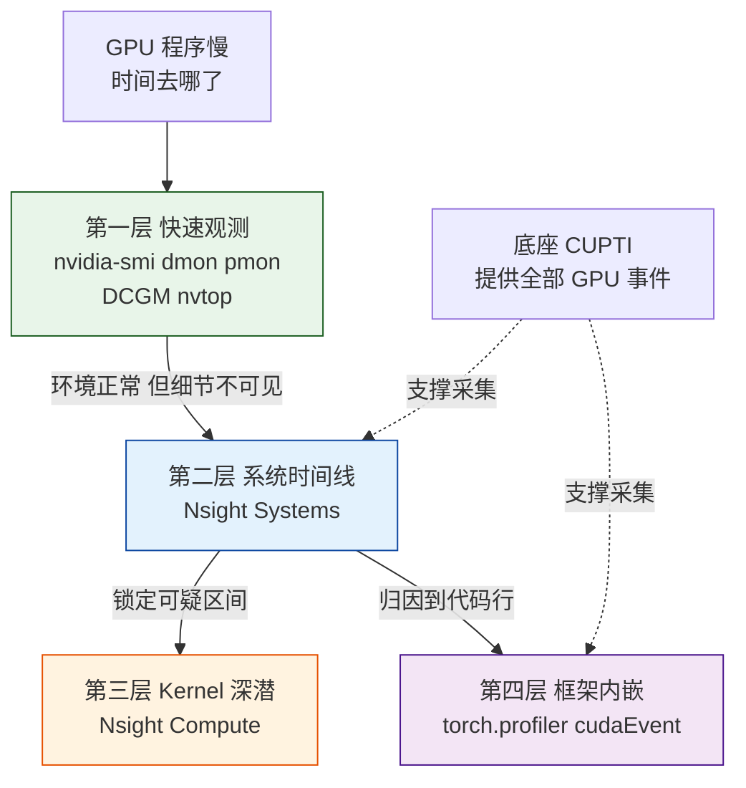
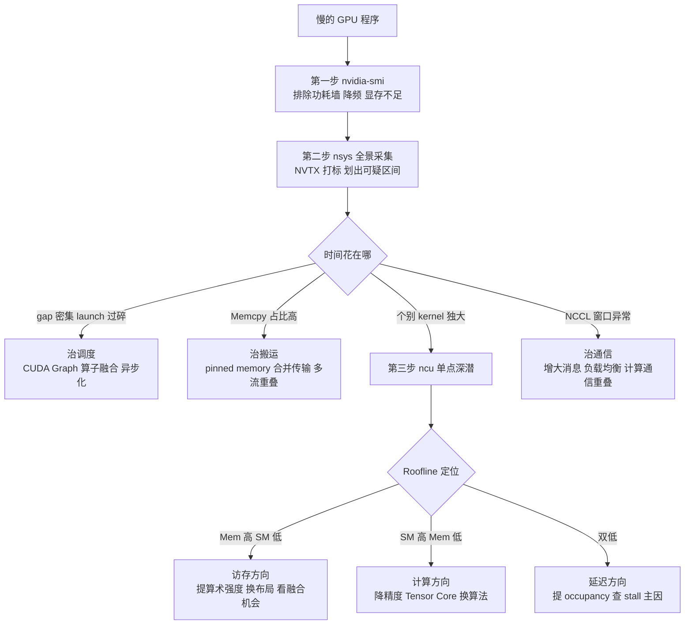

> **TL;DR**
> *   **背景**：大模型训练与推理工程师最常见的困境是——服务在跑、指标在涨，但没人说得清 GPU 的时间到底花在哪。`time.time()` 在 CUDA 异步执行下会系统性地说谎，而 NVIDIA 的剖析栈（nvidia-smi、Nsight Systems、Nsight Compute、torch.profiler）各自只回答一个问题，用错层级就会白忙一场。
> *   **核心结论**：GPU 剖析是一个分层漏斗——nvidia-smi 排除环境问题（功耗墙、降频、显存溢出），nsys 回答「时间去哪了」（launch gap、memcpy、通信窗口），ncu 回答「单个 kernel 为什么慢」（SOL 吞耗、warp stall、roofline 定位），torch.profiler 把时间归因到 Python 行；CUPTI 是这一切共同的底座。
> *   **反直觉发现**：① `nvidia-smi` 的 utilization 100% 只表示采样窗口内有 kernel 在执行，与算力饱和毫无关系；② decode 阶段 SM 利用率很低、而 HBM 带宽接近峰值才是健康形态；③ ncu 默认以 kernel replay 模式收集指标——它会序列化执行并反复重放被测 kernel，你看到的可能已经不是程序本来的样子。
> *   **工具选型一句话**：先 nsys 后 ncu，中间用 torch.profiler 关联 Python 行；永远不要跳过时间线直接看单 kernel。

---

## 1. 问题引入：GPU 程序为什么慢，以及计时器为什么骗人

### 1.1 慢的三类根因

一个「跑得慢」的 GPU 程序，剥掉表象后根因只有三类：

| 根因类别 | 典型形态 | 直观信号 |
|:---|:---|:---|
| **计算密度不足** | element-wise 算子链、小 batch GEMV，算术强度（FLOPs/Bytes）太低 | SM 在动但吞吐低，「计算」实际是在做数据搬运 |
| **访存瓶颈** | HBM 带宽打满、缓存命中率低、频繁的 host-device 拷贝 | kernel 时间随张量大小线性增长而非随 FLOPs 增长 |
| **调度空转** | kernel launch gap、CPU 侧准备慢、同步等待、多卡通信阻塞 | timeline 上大量空白；SM 大部分周期无 warp 可发射 |

《算子融合》一篇已经量化过第一类问题的严重性：不融合时大量 element-wise 算子让 99.9% 的计算能力闲置，GPU 沦为昂贵的「数据搬运工」。而本文要解决的是更前置的问题——**你怎么知道眼前这个慢程序属于哪一类**？答案是：按正确的顺序拿起正确的工具。

### 1.2 `time.time()` 计时的两种欺骗

CUDA 的 kernel 提交是异步的：CPU 调用 `cudaLaunchKernel` 后立即返回，kernel 排队等 SM 执行。这导致朴素的 Python 计时有两种经典死法：

```python
import time
import torch

x = torch.randn(4096, 4096, device="cuda")

# 骗法一：忘了 synchronize —— 测到的只是 launch 提交时间，
# 此刻 kernel 可能还在队列里排队，根本没开始算
t0 = time.perf_counter()
y = x @ x
t1 = time.perf_counter()          # 微秒级返回，与 kernel 实际耗时无关
print(f"骗法一: {(t1 - t0) * 1e6:.1f} us")

# 骗法二：加了 synchronize —— 时间对了，但你只能拿到一个总账：
# launch 开销、排队等待、真实计算全部混在一起，无法区分
torch.cuda.synchronize()
t2 = time.perf_counter()
for _ in range(100):
    y = x @ x
torch.cuda.synchronize()
t3 = time.perf_counter()
print(f"骗法二(均摊): {(t3 - t2) / 100 * 1e6:.1f} us")
```

更隐蔽的问题在于「kernel 排队掩盖真实瓶颈」：当 CPU 连续提交一串小 kernel 时，第一个 kernel 执行的同时 CPU 还在提交后续的，端到端时间看起来很平滑——但中间可能存在大量 GPU 空转的 gap，只是被流水线掩盖了。一旦某处出现同步点或 CPU 抖动，掩盖效应消失，延迟突然放大，你却没有任何证据定位。

这就是为什么需要一套专门的剖析栈：它把「CPU 提交」「GPU 执行」「内存搬运」拆成独立的时间线事件，让每一微秒都有归属。

## 2. 工具栈分层地图

### 2.0 五层结构总览

先给出全文骨架——五层剖析栈的总览图与对比表：



| 层级 | 代表工具 | 回答的问题 | 观测粒度 | 侵入开销 | 典型入口 |
|:---|:---|:---|:---|:---|:---|
| 快速观测层 | `nvidia-smi` / DCGM / nvtop | 卡是否正常？资源够不够？ | 秒级采样 | 几乎为零 | `nvidia-smi dmon` |
| 系统时间线层 | Nsight Systems（nsys） | 时间花在哪？谁在等谁？ | 微秒级事件 | 低（每 launch 数百 ns 至 μs） | `nsys profile` |
| Kernel 深潜层 | Nsight Compute（ncu） | 单个 kernel 为什么慢？ | 单 kernel 白盒 | 高（replay 重放） | `ncu --set full` |
| 框架内嵌层 | `torch.profiler` / cudaEvent | 时间对应哪一行 Python？ | op/kernel 级 | 中低 | `torch.profiler.profile` |
| 底座 | CUPTI | —— | —— | —— | 一切 GPU 事件的源头 |

原则只有一条：**自上而下逐层下钻，禁止跳层**。跳过时间线直接用 ncu 看 kernel，你会把精力浪费在根本不是瓶颈的 kernel 上；只用 nvidia-smi 下结论，则会被 utilization 误导（见 §2.1）。

### 2.1 快速观测层：nvidia-smi、DCGM 与 nvtop

`nvidia-smi` 是每个人都在用、也最容易被误读的工具。日常巡检之外，它有两个常被忽略的子命令更适合性能排查：

```bash
# 设备监控：每秒输出功耗/利用率/频率/温度/显存，连续采 60 次
nvidia-smi dmon -s pucmt -d 1 -c 60

# 进程级监控：每个进程各自的 SM 利用率与显存占用
nvidia-smi pmon -s um -d 1

# 结构化轮询：适合脚本采集，字段可自由组合
nvidia-smi --query-gpu=timestamp,name,utilization.gpu,memory.used,power.draw,clocks.sm \
           --format=csv,noheader -l 1
```

`dmon` 的 `-s` 参数按字母组选列：`p` 功耗与温度、`u` 利用率、`c` 时钟、`m` 显存容量、`t` PCIe 吞吐、`e` ECC 错误（默认 `pu`）。这些字段定义都来自 NVML 管理库的官方口径（[NVML 文档](https://developer.nvidia.com/management-library-nvml)）。

**utilization 100% ≠ 打满**——这是本篇最重要的反直觉点之一。NVML 对 `utilization.gpu` 的定义是：*采样周期内至少有一个 kernel 正在执行的时间占比*。换句话说，一个每秒只占 20 ms 的小 kernel 循环也能把 utilization 拉到 100%，哪怕 SM 有 95% 的周期在空转。同理 `utilization.memory` 只反映「有访存活动的时间占比」，与带宽占用率完全是两回事。

快速观测层的正确读法：

- **看趋势不看单点**：功耗、时钟、温度三条曲线一起看。功耗顶到上限且 `clocks.sm` 掉下来，说明撞了功耗墙/温度墙——同样的代码会莫名变慢，这不是软件问题；
- **显存看余量与碎片**：`memory.used` 逼近上限时 PyTorch 的 caching allocator 会触发重分配甚至 OOM；
- **进程对账**：多租户卡上用 `pmon` 确认「你以为你在独占，实际上隔壁进程在偷算力」。

再往上一层是 **DCGM**（Data Center GPU Manager）：它把 NVML 封装成常驻服务，提供健康诊断（DCGM FI）与 Prometheus exporter，是集群场景下替代手工 `nvidia-smi` 轮询的标准方案（[DCGM 官方页](https://developer.nvidia.com/dcgm)）。桌面环境下 `nvtop` 则提供了类 `htop` 的实时多卡视图，适合人眼盯梢，不适合自动化。

这一层的边界也要说清楚：nvidia-smi 家族**看不到任何 kernel 级信息**——它不知道你的程序在算什么，只知道卡的物理状态。要回答「时间花在哪」，必须进入下一层。

### 2.2 系统级时间线层：Nsight Systems（nsys）

nsys 是整张地图里性价比最高的工具：它沿着时间轴记录 CPU API 调用、kernel 执行、memcpy、NVTX 区间、NCCL 通信，把「谁在什么时候等谁」摊开给你看（[Nsight Systems](https://developer.nvidia.com/nsight-systems)、[用户指南](https://docs.nvidia.com/nsight-systems/UserGuide/index.html)）。

一条覆盖大多数场景的采集命令：

```bash
nsys profile -t cuda,nvtx,cudnn,cublas \
             --cuda-memory-usage=true \
             -o llm_inference \
             python infer.py

# 结束后自动打印统计报表；也可以事后单独出报表
nsys stats llm_inference.nsys-rep
```

常用参数速查：

| 参数 | 作用 | 典型取值 |
|:---|:---|:---|
| `-t,--trace` | 选择追踪目标 | `cuda,nvtx,cudnn,cublas,osrt` |
| `-o` | 输出报告名 | 语义化命名，如 `llm_inference` |
| `--stats=true` | 采集结束即打印统计表 | 长跑前先用它快速验证 |
| `--delay` / `--duration` | 只采集某个时间窗 | 稳定运行后截取代表性区间 |
| `--gpu-metrics-device` | 以固定频率采样 SM 占用率/DRAM 带宽等硬件计数器 | `0` 或 `all` |

**timeline 能回答的四类问题**：

1. **kernel launch gap**：相邻两个 kernel 之间的空档。gap 密集说明 CPU 侧跟不上——Python 开销、同步过多、或者 launch 本身太碎。《算子融合》中估算过 LLaMA-70B 不融合时有 15000+ 次 launch、累计约 75 ms 的固定开销，这个数字在 timeline 上就是密密麻麻的小空档。
2. **memcpy 与 compute 的重叠**：H2D/D2H 拷贝走独立的拷贝引擎，理想情况下应与 kernel 并行出现在不同 stream 的泳道里。若 memcpy 与 kernel 串行排布，说明 stream 划分或 pinned memory 用法有问题。
3. **NCCL 通信窗口**：多卡任务里 `ncclDevKernel` 开头的 kernel 成组出现，其窗口宽度与消息大小成正比。通信窗口前后若有大段空白，通常是 rank 间负载不均导致的 straggler 等待。
4. **CUDA Graph 行为**：使用 graph capture 后，原本几十次离散 launch 会折叠为一次 graph launch 节点，timeline 上表现为一长条连续 kernel 带——这是验证 CUDA Graph 是否生效的直接证据（[CUDA Graphs 官方博客](https://developer.nvidia.com/blog/cuda-graphs/)）。

为了让 timeline 可读，务必用 **NVTX** 给关键阶段打标：

```python
import torch

def train_step(model, batch):
    torch.cuda.nvtx.range_push("forward")
    loss = model(**batch).sum()
    torch.cuda.nvtx.range_pop()
    torch.cuda.nvtx.range_push("backward")
    loss.backward()
    torch.cuda.nvtx.range_pop()
    return loss
```

`range_push/range_pop`（[PyTorch CUDA NVTX API](https://pytorch.org/docs/stable/generated/torch.cuda.nvtx.range_push.html)）会在 timeline 上生成彩色区间，配合 `-t nvtx` 使用。没有 NVTX 的 timeline 是一堆匿名 kernel 名；有了它，forward/backward/optimizer 各阶段一目了然。

`nsys stats` 输出的报表里最有用的是三张：`cuda_gpu_kern_sum`（各 kernel 累计耗时排行）、`cuda_gpu_mem_time_sum`（各类 memcpy 耗时）、`cuda_api_sum`（CUDA API 调用次数与耗时，用来发现 launch 过多或同步滥用）。工作流上建议：**先用 `--stats=true` 看排行榜锁定可疑区间，再打开 GUI 细看该区间的因果链**。

### 2.3 Kernel 级深潜层：Nsight Compute（ncu）

nsys 告诉你哪个 kernel 占时间，ncu 回答这个 kernel 为什么是这个速度。它是单 kernel 的白盒分析仪：以 section 为单位收集硬件计数器，从指令发射到缓存命中逐层拆解（[Nsight Compute](https://developer.nvidia.com/nsight-compute)、[Profiling Guide](https://docs.nvidia.com/nsight-compute/ProfilingGuide/index.html)）。

```bash
# 全量 section 采集：跳过前 50 次 launch，连采 5 次名字含 gemm 或 flash 的 kernel
ncu --set full --launch-skip 50 --launch-count 5 \
    -k "regex:gemm|flash" -o gemm_report python bench.py

# 只关心几个核心指标的轻量采集
ncu --metrics sm__throughput.avg.pct_of_peak_sustained_elapsed,dram__throughput.avg.pct_of_peak_sustained_elapsed,lts__t_sector_hit_rate.pct \
    python bench.py

# 事后查看文本版报告
ncu --import gemm_report.ncu-rep --page details
```

五个最常用的 section：

| Section | 内容 | 先看什么 |
|:---|:---|:---|
| SpeedOfLight | SM 与 Memory 相对峰值的吞耗百分比 | 两根柱子哪根高（§3.1） |
| MemoryWorkloadAnalysis | DRAM/L2/L1 流量、L2 命中率、扇入扇出 | achieved bandwidth 与命中率的落差 |
| Occupancy | 理论/实际 occupancy 及限制因素 | 寄存器还是 shared memory 卡住了并发 |
| WarpStateStats | warp stall 原因分布 | 最多的 stall 类别（§3.3） |
| SchedulerStats | 每 cycle 发射率、eligible warp 数 | SM 是否「饿着」 |

需要强调：ncu 的所有数字都是**重放出来的**（默认 kernel replay 模式），它与实跑行为有系统性偏差，坑位详见 §6.1。所以正确姿势永远是 nsys 定靶、ncu 验尸，而不是拿 ncu 当秒表。

### 2.4 框架内嵌层：torch.profiler 与 cudaEvent

对 PyTorch 用户而言，框架内嵌剖析是摩擦最低的入口。`torch.profiler` 底层通过 Kineto 调用 CUPTI，能同时看到 CPU op 与 GPU kernel，并支持把 stack trace 关联到具体 Python 行（[PyTorch Profiler 文档](https://pytorch.org/docs/stable/profiler.html)）：

```python
import torch
from torch.profiler import (profile, ProfilerActivity,
                            tensorboard_trace_handler)

schedule = torch.profiler.schedule(wait=1, warmup=2, active=3)

with profile(
    activities=[ProfilerActivity.CPU, ProfilerActivity.CUDA],
    schedule=schedule,                                  # 跳过 1 步、预热 2 步、正式采集 3 步
    on_trace_ready=tensorboard_trace_handler("./log"),  # 自动落盘供 TensorBoard 查看
    record_shapes=True,
    profile_memory=True,
    with_stack=True,                                    # 关键：kernel 归因到 Python 行
) as prof:
    for step, batch in enumerate(loader):
        train_step(batch)
        prof.step()

print(prof.key_averages().table(sort_by="cuda_time_total", row_limit=10))
prof.export_chrome_trace("trace.json")                  # 可导入 Perfetto/Chrome tracing 查看
```

三个实践要点：

- **schedule 必须配 `prof.step()`**：wait/warmup/active 三段式可以避开初始化噪声和编译期开销（如 torch.compile 的首次编译，《动态 Shape 编译》一篇量化过这类一次性开销可达数秒）；
- **`with_stack=True` + TensorBoard 的 stack view** 能把 GPU 时间聚合到调用它的 Python 行，这是「框架层独有的、nsys 反而不方便提供」的能力；
- **导出 chrome trace** 后可与 nsys 的 timeline 相互印证，两者看到的 kernel 时长应当一致（同源于 CUPTI），差异只在呈现方式。

如果只需要一个可靠的「这段代码跑了多久」，正确姿势是 **cudaEvent**——它在 GPU 时间轴上打点，不受 CPU jitter 影响（[torch.cuda.Event](https://pytorch.org/docs/stable/generated/torch.cuda.Event.html)）：

```python
start = torch.cuda.Event(enable_timing=True)
end = torch.cuda.Event(enable_timing=True)

for _ in range(warmup):        # 预热：排除首次 launch/编译开销
    fn()
torch.cuda.synchronize()

start.record()
fn()
end.record()
torch.cuda.synchronize()       # 必须在 elapsed_time 之前同步
print(f"{start.elapsed_time(end):.3f} ms")
```

注意 event 计时给出的仍是「区间总账」：它能证明快慢，不能解释原因。解释原因请回到 nsys/ncu。

### 2.5 底座层：CUPTI

CUPTI（CUDA Profiling Tools Interface）是 NVIDIA 官方的剖析接口层，提供 activity API（kernel/memcpy/API 调用的时间戳流）与 performance counter API（[CUPTI 官方页](https://developer.nvidia.com/cupti)）。nsys 的 GPU 泳道、torch.profiler 的 kernel 记录、TensorBoard 的 trace，全部构建在 CUPTI 之上。理解这一点有一个实际推论：**多个工具看到的同一 kernel 时长理论上应一致**；若不一致，差异来自采集方式（采样 vs 全量事件）而非计时基准本身。

## 3. 关键指标解读

工具只是采集器，决定结论质量的是指标解读能力。本节按「从全局到微观」讲四个必懂指标族。

### 3.1 Speed of Light：两根柱子怎么读

ncu 详情页顶部有两根柱子：**Compute（SM）Throughput** 与 **Memory Throughput**，即所谓 Speed of Light（SOL）。它们的口径是「实际速率 ÷ 该管线的理论峰值持续速率」，取值区间 0–100%（[Profiling Guide: SpeedOfLight](https://docs.nvidia.com/nsight-compute/ProfilingGuide/index.html)）。Memory 柱取的是 DRAM/L2/L1 各存储管线中最忙那根的占比，而不是平均值——这一点决定了「Memory 80%」可能意味着 DRAM 打满，也可能意味着 L1TEX 打满，必须下钻 MemoryWorkloadAnalysis 确认。

两根柱子的组合构成四象限判读表：

| SM% | Mem% | 诊断 | 典型药方 |
|:---|:---|:---|:---|
| 高（≥75%，经验值） | 低 | 计算受限 | 换更低精度、减少冗余计算、检查是否用上 Tensor Core |
| 低 | 高（≥75%，经验值） | 访存受限 | 提算术强度：融合、tiling 复用、换数据布局 |
| 双低 | 双低 | 延迟/调度受限 | 查 occupancy、warp stall、launch 配置（grid 太小） |
| 双高 | 双高 | 接近平衡点 | 该算法形态已接近硬件上限，收益空间在算法层而非调参层 |

关于「什么算打满」要统一口径：SOL 百分比的分母是**理论峰值持续速率**（theoretical peak sustained），因此 90% 以上通常即可认为该管线饱和；但绝对带宽还要另算——achieved bandwidth（`dram__bytes.sum` 除以 elapsed time）对照的是显存规格峰值。公开规格参考：H100 SXM 的 HBM3 峰值为 3352 GB/s（[NVIDIA H100 页面](https://www.nvidia.com/en-us/data-center/h100/)），A100 80GB SXM 约 2 TB/s 量级（[NVIDIA A100 页面](https://www.nvidia.com/en-us/data-center/a100/)）。经验上有效带宽达到峰值的七八成即属优秀实现，超过九成基本到顶——此比例为工程经验值，未验证。

### 3.2 Launch overhead 与 gap ratio

单次 kernel launch 的固定开销在微秒量级——《算子融合》实测口径为 3–8 μs。它平时无害，但在两种场景下会成为主要矛盾：一是 kernel 极碎（decode 阶段每步数百个小 kernel），二是 CPU 侧变慢（Python 逻辑、GIL、频繁同步）。《动态 Shape 编译》讨论的 decode 场景 KV Cache 逐步增长还会叠加 shape 变化带来的重编译抖动，让 gap 问题雪上加霜。

定义一个便于量化的比值：

$$\text{gap ratio} = \frac{T_{wall} - T_{busy}}{T_{wall}}$$

其中 $T_{wall}$ 为所选时间窗总长，$T_{busy}$ 为窗内 kernel+memcpy 的占用时长。它可以从 nsys 的统计报表近似得出。经验判断量级：端到端 gap ratio 超过一到两成时，优化 kernel 本身的边际收益很小，应先治调度（融合、CUDA Graph、异步化）——阈值为经验值，未验证。

### 3.3 Occupancy 与 Warp Stall：微观归因

occupancy 衡量 SM 上实际驻留的 warp 数相对最大可驻留数的比例。ncu 同时给出 theoretical（受寄存器/shared memory/block size 三约束决定的上限）与 achieved（实际达到值）两个数：**两者差距大**说明调度供给不足（block 数太少、tail effect）；**theoretical 本身就低**则要查资源约束。《算子融合》§4.1 给过典型案例：融合后 kernel 每线程用到 255 个寄存器，occupancy 直接跌到 12.5%，性能反而回退——融合决策必须带着 occupancy 数据做。

当 occupancy 合理而速度仍上不去，看 **Warp State Statistics** 里 stall 原因的分布。stall 表示 warp 已发射却因某种依赖停等，各主因的含义与药方如下：

| Stall 原因（官方分类） | 含义 | 对症药方 |
|:---|:---|:---|
| Long scoreboard | 等 global memory/L2 返回（寄存器依赖未就绪） | 提高访问合并度、增大 tile 提升局部性、双缓冲预取 |
| Short scoreboard | 等 shared memory/MIO 操作返回 | 排查 bank conflict、减少 smem 往返次数 |
| Barrier | `__syncthreads` 等待块内其他 warp 到齐 | 缩小 block、均衡 warp 工作量消除长尾 |
| Wait | 固定延迟的指令依赖链 | 提升 ILP、手动软件流水 |
| Not selected | 有 eligible warp 但发射口被占 | 属正常现象，恰说明 SM 饱和 |
| Math pipe throttle | 计算管线满载（FP64、特殊函数尤甚） | 降精度、换算法绕开慢管线 |
| Branch resolving | 分支发散等待收敛 | 减少 warp 内分支发散、重排数据使分支一致 |

stall 分布的读法是「抓最大项」：long scoreboard 一家独大 → 访存模式问题；barrier 占比异常 → 块内并行度失衡；各项平均且 not_selected 很高 → SM 已经喂饱，瓶颈在别处。完整分类见 [Profiling Guide 的 Warp State 章节](https://docs.nvidia.com/nsight-compute/ProfilingGuide/index.html)。

### 3.4 变量映射表与指标速查

本篇涉及的量化符号与其在工具中的位置对照：

| 符号 | 含义 | 在哪里看 | 维度相关性 |
|:---|:---|:---|:---|
| $AI$ | 算术强度（FLOPs / Bytes） | ncu Roofline 图横轴 | 由 tile shape 与算子类型共同决定 |
| $\text{SOL}$ | SM%/Mem% 吞耗 | ncu 详情页顶部 | 与 grid/block 配置强相关 |
| $g$ | gap ratio（空转占比） | nsys 时间线统计 | batch×seq 组合越多越易恶化 |
| $B_{eff}$ | achieved bandwidth | ncu MemoryWorkloadAnalysis | 由张量 shape 决定访存总量 |
| $O_{occ}$ | achieved occupancy | ncu Occupancy section | 由 block 维度与寄存器用量决定 |

排查时的速查表（建议收藏）：

| 指标 | 含义 | 健康范围 | 异常时先查什么 |
|:---|:---|:---|:---|
| `utilization.gpu` | 采样窗内有 kernel 执行的时间占比 | 无法单独判优 | 结合 `clocks.sm`/功耗曲线判断是否降频假象 |
| SOL SM% | 相对峰值算力吞吐 | 目标导向：计算受限 kernel 应逼近高位 | 双低时查 occupancy 与 stall 分布 |
| SOL Mem% | 最忙存储管线占比 | 访存受限 kernel 应逼近高位 | 分清 DRAM 还是 L1TEX 打满 |
| L2 hit rate | 二级缓存命中率 | 无普适值，与自己基线比 | 改布局/tiling 前后对比；扇入扇出突增 |
| achieved occupancy | 实际活跃 warp 占比 | 接近 theoretical 值 | 差距大→block 数不足或 tail effect |
| gap ratio | 时间线空转占比 | 越低越好（经验阈值见 §3.2） | CPU 侧开销、过度同步、launch 过碎 |
| memcpy 总占比 | 数据搬运时间份额 | 占比应显著低于计算 | 未用 pinned memory、逐条小拷贝 |
| NCCL 窗口占比 | 通信时间份额 | 与并行策略匹配 | 小消息主导、straggler、重叠失效 |

## 4. 标准工作流：从全景到单点的下钻路径

把前面所有零件组装起来，就是面对任何慢 GPU 程序的标准动作：



流程的四个要点：

1. **环境先行**：降频与功耗墙会让一切软件优化结论失真，30 秒的 nvidia-smi 巡检不可省略；
2. **nsys 定靶，ncu 验尸**：热点 kernel 从 `cuda_gpu_kern_sum` 排行榜来，ncu 的 `-k regex:` 加 `--launch-skip/--launch-count` 保证只分析稳态下的目标 kernel；
3. **roofline 决定优化方向**：访存受限走「提高算术强度」路线——这正是《算子融合》的主战场（纵向融合、横向融合、FlashAttention 式重构都在提升 AI）；计算受限才考虑降精度与算法替换；双低则回到并行度本身；
4. **对比实验控制变量**：若程序存在动态 shape（《动态 Shape 编译》的场景），同一逻辑在不同 shape 下会命中不同的编译产物，profile 前先用 bucketing 固定 shape，否则前后对比没有意义。

## 5. LLM 推理场景的实战形态

### 5.1 Prefill 与 Decode：一张卡上的两种物种

LLM 推理的两个阶段在同一张卡上呈现出截然不同的 profile 形态：

| 维度 | Prefill | Decode（batch=1） |
|:---|:---|:---|
| 主力 kernel | 大形状 GEMM、批量 Attention | GEMV 化的窄 GEMM、单 query Attention |
| 算术强度 | 高（复用充分，接近 compute-bound） | 极低（每个权重字节只贡献一次乘加） |
| bound 方向 | 计算受限为主 | 访存受限为主 |
| timeline 形态 | 少而长的密集 kernel 带 | 细碎 kernel 链，gap 敏感 |
| SOL 形态 | SM% 高、Mem% 中等 | Mem%（DRAM）逼近高位、SM% 明显偏低 |
| 主要矛盾 | 算力利用与 attention IO | 权重读取带宽与 launch/gap 开销 |

Decode 的带宽下限可以直接从公开规格推导：batch=1 时每生成一个 token 至少要把全部权重读一遍，故单步时间满足 $T_{token} \ge W_{bytes}/B_{eff}$。以 13B FP16 模型为例，权重约 26 GB，即使有效带宽按 H100 峰值 3352 GB/s 的七折（约 2.3 TB/s）计，下限也在 11 ms/token 附近——这是规格推导出的量级演示，非实测。**推论**：decode 阶段看到「SM 利用率不高但 DRAM 带宽很高」不是病，是物理规律；此时任何提升 SM 占用的尝试都是徒劳，出路只有降低权重读取量（量化）或多请求摊薄（continuous batching）。这也是量化系列（如《伪量化算子插入》）在推理侧的核心价值所在。

### 5.2 量化 kernel 在 profile 里该看什么

INT8/FP8/W4A16 的量化 GEMM 在剖析时有专属关注点：

- **dequant 是否独立成 kernel**：W4A16 实现若把「反量化权重」做成独立 elementwise kernel，timeline 上会出现夹在主 GEMM 之前的窄条——这是最典型的融合缺失信号，参照《算子融合》的 pattern 表应将其吃进主 GEMM；
- **scale 的访存放大**：per-group 量化引入高频小 scale 张量读取，ncu 里表现为 L1TEX/L2 流量上升而 DRAM 流量下降——这是预期行为，但若 L2 命中率同时偏低，说明 group 划分与访存顺序不友好；
- **Tensor Core 管线确认**：INT8/FP8 GEMM 应看到对应的 tensor pipe 吞耗非零；若 SM 主管线在烧 FP32，说明 kernel 根本没走上量化路径。

### 5.3 NCCL 在多卡 timeline 上的正常与异常

多卡任务的 nsys 时间线上，NCCL 通信以 `ncclDevKernel` 系列内核呈现（[NCCL](https://developer.nvidia.com/nccl)）。健康形态：allreduce kernel 成组出现、窗口宽度与消息尺寸正相关、且能与计算重叠（藏在其他 stream 的泳道里）。三种典型病态：

- **大量极短 NCCL kernel**：消息太小，通信被 launch 与协议开销主导——解法是消息聚合或改用更合适的并行切分；
- **NCCL 窗口前的大段空白**：straggler 等待——某个 rank 因负载不均或 IO 抖动迟到，其余 rank 干等；
- **通信与计算完全串行**：重叠策略未生效，检查 stream 划分与通信时机安排。

## 6. 坑清单

> ⚠️ 以下每一条都有人踩过，且大多不会报错——只是让你得出错误结论。

1. **ncu 默认 replay 会改变被测对象**。默认 kernel replay 模式为了收集全部计数器，会把同一个 kernel 序列化后反复重放多次；同时默认 `--cache-control all` 每次重放前冲刷缓存、`--clock-control base` 锁定基础频率。结果：单 kernel 的计数器可比性很好，但**绝对耗时与实跑完全不可比**，kernel 间的 cache 交互也被抹掉。可选模式取舍：

   | 模式 | 行为 | 适用 |
   |:---|:---|:---|
   | kernel（默认） | 逐 kernel 重放，精度最高、侵入最强 | 单 kernel 调优 |
   | range | 按 NVTX range 粒度重放 | 阶段级折中 |
   | application | 整个应用重跑一遍 | 端到端时间敏感的指标 |

   （[Profiling Guide: Replay](https://docs.nvidia.com/nsight-compute/ProfilingGuide/index.html)）

2. **锁频带来的口径错位**。ncu 默认锁 base 频率以保证可复现，这意味着 ncu 报告里的绝对时间普遍慢于生产 boost 状态；跨机器、跨驱动对比 SOL 百分比尚可，对比毫秒数不行。

3. **容器环境权限**。GPU performance counter 默认仅管理员可用（驱动模块参数 `NVreg_RestrictProfilingToAdminUsers` 控制）；容器内跑 ncu 需要 root 或 `--cap-add SYS_ADMIN`，且镜像需包含 profiling 组件（CUDA 镜像以 `NVIDIA_DRIVER_CAPABILITIES=utils` 提供）。权限不足时报错往往晦涩，先查权限再怀疑工具（[Profiling Guide: 权限说明](https://docs.nvidia.com/nsight-compute/ProfilingGuide/index.html)）。

4. **profiler 本身的 overhead**。nsys 与 torch.profiler 的全量事件采集会给每次 launch 增加可观开销，kernel 越碎失真越大。纪律是：**关着 profiler 测端到端性能，开着 profiler 看结构占比**，不要把 profiler 开着的数字写进汇报。

5. **MIG 实例的限制**。开启 MIG 后实例可见的计算单元与计数器受限，部分 metric 可能不可用或数值口径变化，版本间行为还有差异（未验证）——在 MIG 环境得出的剖析结论外推到整卡时要格外保守。

6. **nsys 长时间采集的时钟漂移与大文件**。数十分钟以上的连续采集会产生巨大报告，且 CPU/GPU 两条时间轴可能出现漂移，表现为事件对齐错位（经验现象，未验证）。实践：用 `--delay/--duration` 只截取代表性窗口，别拿 profiler 录全程。

## 7. 批判与展望

### 7.1 这套栈的局限

- **静态快照 vs 长程行为**：nsys/ncu 都是「录一段」的离线工具，而训练任务的真实问题是数千小时内的缓慢劣化（梯度累积导致的负载变化、碎片化显存、间歇性降频）。常驻剖析目前只能靠 DCGM 这类粗粒度监控，细粒度与低开销不可兼得；
- **观察者效应不可避免**：CUPTI 的 per-launch 开销意味着「完全无感的全量剖析」不存在，越碎的 workload（decode！）失真越大——这恰好是大模型时代最重要的 workload；
- **多卡归因困难**：timeline 能看到 straggler 现象，但难以直接回答「谁拖累了谁」，跨 rank 的因果分析仍靠人工比对各 rank 的报告。

### 7.2 展望

- **剖析与编译器的闭环**：ncu 的 roofline 结论（访存受限、AI 偏低）理论上可以直接反馈给 Inductor/TVM 类编译器作为 fusion/tuning 的目标函数输入，目前这条链路还靠工程师肉眼缝合；《算子融合》《动态 Shape 编译》讨论的编译技术，最终都需要这样的反馈信号才能自动化；
- **面向 decode 的轻量常驻观测**：随着 decode 型负载占比上升，「每 launch 开销不可忽略」将推动采样式、聚合式的常驻剖析成为标配，而非事后抓取；
- **工具栈的收敛**：CUPTI 之上各家重复造轮子的局面正在收敛（Kineto、nsys GUI 内嵌 torch 语义），未来工程师需要维护的「视图」会更少，但对 SOL、stall、roofline 这些底层概念的解读能力，只会更重要。

---

## 参考清单

**官方文档（本篇关键论断来源）**

- [Nsight Systems 产品页](https://developer.nvidia.com/nsight-systems) ／ [用户指南](https://docs.nvidia.com/nsight-systems/UserGuide/index.html) —— nsys 命令行参数、stats 报表、GPU metrics 采样
- [Nsight Compute 产品页](https://developer.nvidia.com/nsight-compute) ／ [Profiling Guide](https://docs.nvidia.com/nsight-compute/ProfilingGuide/index.html) —— SOL 定义、section 说明、Warp State 分类、Replay 模式与权限要求
- [NVML 管理库](https://developer.nvidia.com/management-library-nvml) —— utilization 等字段的官方口径
- [DCGM](https://developer.nvidia.com/dcgm) —— 集群级常驻监控与诊断
- [CUPTI](https://developer.nvidia.com/cupti) —— 剖析栈底座：activity 与 performance counter API
- [PyTorch Profiler](https://pytorch.org/docs/stable/profiler.html) ／ [torch.cuda.Event](https://pytorch.org/docs/stable/generated/torch.cuda.Event.html) —— 框架内嵌剖析与 event 计时 API
- [NVIDIA H100 规格](https://www.nvidia.com/en-us/data-center/h100/) ／ [NVIDIA A100 规格](https://www.nvidia.com/en-us/data-center/a100/) —— HBM 带宽等公开规格
- [CUDA Graphs 博客](https://developer.nvidia.com/blog/cuda-graphs/) ／ [NCCL](https://developer.nvidia.com/nccl) —— launch 开销治理与集合通信

**论文**

- Dao et al., *FlashAttention: Fast and Memory-Efficient Exact Attention with IO-Awareness*, [arXiv:2205.14135](https://arxiv.org/abs/2205.14135) —— attention IO 优化的代表作，profile 中 attention kernel 形态的背景知识
- Kwon et al., *Efficient Memory Management for Large Language Model Serving with PagedAttention*, [arXiv:2309.06180](https://arxiv.org/abs/2309.06180) —— vLLM 论文，decode 服务形态与 KV Cache 管理的背景知识

**系列互引**

- 同目录姊妹篇：《算子融合：从计算图到高效 Kernel 的编译优化理论与实战》（`congyuan_blogs/technology/ai_compiler/performance/operator_fusion_deep_dive.md`）—— 本文 roofline「访存受限」分支的系统解法
- 同目录姊妹篇：《动态 Shape 编译：从重编译噩梦到符号维度追踪的编译器优化之路》（`congyuan_blogs/technology/ai_compiler/performance/dynamic_shape_compilation.md`）—— 本文 §4.4 与 §5.1 中 shape 相关干扰的控制方法
- 量化系列：《伪量化算子插入——QAT 的地基》（`lrypcy.github.io/_posts/2026-08-26-llm-quant-11-fake-quant-insertion.md`）—— §5.2 量化 kernel 的上游原理

**中文社区**：知乎上关于 nsys/ncu 使用技巧、「GPU 利用率为什么总是 100%」类话题有大量一线讨论，掘金上亦有 PyTorch profiler 实战教程；但多数为经验帖、直链稳定性差，本篇未能核验到可长期引用的具体条目——诚实标注：本节为占位，非完整来源。

> **Lab 练习（动手）**：
> 1. 任选一段 PyTorch 训练代码，用 `nsys profile --stats=true` 采集后，从 `cuda_gpu_kern_sum` 取前五名 kernel 的累计耗时、从 `cuda_api_sum` 读出 `cudaLaunchKernel` 的次数，手工估算所选窗口的 gap ratio，并判断该程序的下一步优化应该指向 kernel 还是调度。
> 2. 对同一个 GEMM 分别用 `ncu --set basic` 与 `ncu --clock-control none --set basic` 采集两次，对比 SpeedOfLight 读数与绝对耗时——体会锁频策略如何影响「可比性」与「真实性」的天平。

---

剖析是所有性能优化的前置工序——先看清时间去哪了，再谈怎么省。欢迎交流指正。
