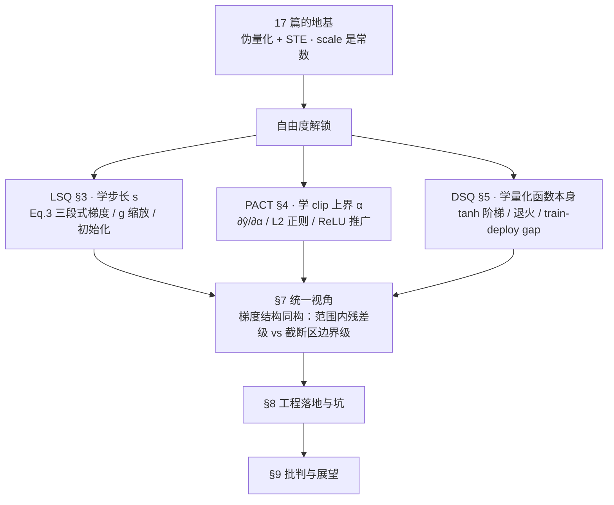

> **系列导航** ｜ [课程路线图](/quantization-roadmap/) ｜ **Part 4 · QAT** ｜ 第 18 篇 / 共 26 篇
>
> [← 17 伪量化算子](/2026/08/26/llm-quant-11-fake-quant-insertion/) ｜ 19 AdaRound/BRECQ/QDrop（待写）

> **TL;DR**
>
> * **核心结论**：第 17 篇结尾的镣铐是「scale 是常数，模型只能调权重、不能调量化器」。LSQ / PACT / DSQ 三篇做的事可以用一句话概括——**把量化器的超参数（scale $$s$$ / clip 上界 $$\alpha$$ / 量化函数本身）从人工常数搬进计算图，变成可微参数，让量化网格本身进入优化变量**。LSQ 从 STE 推出 $$\partial\hat{v}/\partial s$$ 的三段式梯度；PACT 把 $$\mathrm{clip}$$ 上界 $$\alpha$$ 变成参数并给出 $$\partial\hat{y}/\partial\alpha$$；DSQ 用 tanh 造一个真的可导的阶梯函数并退火变硬。三者的梯度有一个共同结构：**在量化范围内是「舍入残差」量级（$$\le 0.5$$ 或 $$\le 1/2M$$），在截断区是「边界值」量级（$$q_{\max}$$ 或 $$1$$）**——正是这个不对称造就了自我稳定，也造就了各自的病态。
> * **反直觉发现**：① **LSQ 的 scale 梯度可以精确分解成"舍入项 − 截断项"，而 MSE 最优 scale 恰好是这两项相消的点**——我在 4-bit 权重上实测，最优 $$s^\ast=0.04373$$ 处舍入项 $$+4.6873\times10^{-1}$$、截断项 $$-4.7109\times10^{-1}$$，残差只占任一项的 **0.5%**，而逐元素不对称高达 **248 倍**（8192 个在范围内的元素加起来，被 33 个被截断的元素抵消）。② **DSQ 的训练损失是一句谎言**：在我的实测里 DSQ 各条 arm 的训练损失在 $$3.6\times10^{-7}\sim3.8\times10^{-6}$$——**比同任务的噪声地板（$$2\times10^{-4}$$）还低两三个数量级，即"量化误差完全不存在"才应有的水平**；而把部署时的硬量化换回去，损失是 $$10^{-2}$$ 量级——**train→deploy gap 高达 33–43 dB**。原因不是实现错了，是 DSQ 在论文推荐的 $$\alpha\in(0,0.5)$$ 区间里前向几乎就是恒等映射。③ **不加 L2 的 PACT 在我的设定里没有发散**——真实病态不是"$$\alpha$$ 长到无穷"，而是"**任务损失对 $$\alpha$$ 在 $$\alpha\in[12,40]$$ 上几乎完全平坦（实测 2.069–2.095e-2，跨度不到 0.1 dB）**"，于是 $$\alpha$$ 的动力学慢到 8000 步还在爬，终点强烈依赖初值和 $$\alpha$$ 自己的学习率（$$\alpha_0$$ 从 2 到 46，最终 $$\alpha$$ 从 8.9 到 21.5）。
> * **系列定位**：[17 篇](/2026/08/26/llm-quant-11-fake-quant-insertion/) 给了 QAT 的地基（伪量化算子 + STE），本篇把地基上的三个自由度逐一解锁。第 19 篇 AdaRound/BRECQ/QDrop 会走另一条路：它们不学量化器的**参数**，而是学权重该**往哪个网格点舍入**——那是 PTQ 与 QAT 之间的桥。所有数字分两类：标注出处的论文实测值，或本文自己在合成数据上跑出来的（numpy 2.1.1，代码见 §10 附录，均已实跑）。

---

## 0. 符号字典增量表

[01 篇 §2](/2026/08/23/llm-quant-00-quantizer-fundamentals-rtn/) 与 [17 篇 §2](/2026/08/26/llm-quant-11-fake-quant-insertion/) 已锁定的符号（$$x, W, s, z_p, b, \hat{x}, q, \mathcal{G}, \delta_{\mathrm{STE}}$$ 等）含义不变。本篇新增：

| 符号 | 含义 | 易混淆提示 |
|---|---|---|
| $$v$$ | 归一化后的值，$$v \triangleq x/s$$ | **注意**：LSQ 原文用 $$v$$ 表示未归一化的输入，本篇按 17 篇的约定，$$v$$ 一律是**已除以 $$s$$** 的量 |
| $$Q_N, Q_P$$ | 量化下/上界（LSQ 原文记号）。有符号 $$Q_N=2^{b-1}, Q_P=2^{b-1}-1$$；无符号 $$Q_N=0, Q_P=2^b-1$$ | 与本篇 $$q_{\min}, q_{\max}$$ 是同一件事，只是 $$Q_N$$ 取正、$$q_{\min}=-Q_N$$ |
| $$\delta$$ | 舍入残差，$$\delta \triangleq v - \lfloor v\rceil \in [-0.5, 0.5]$$ | 与 17 篇的 $$\delta_{\mathrm{STE}}$$（STE 梯度算子）不是同一个东西 |
| $$g$$ | LSQ 的**梯度缩放因子**，$$g = 1/\sqrt{n_Q\,Q_P}$$ | 这是一个乘在 $$\partial\mathcal{L}/\partial s$$ 上的常数，**不是**梯度本身 |
| $$n_Q$$ | 该量化单元（一层权重 / 一层激活）的元素个数 | LSQ 原文分别写作 $$N_W$$（权重）和 $$N_F$$（激活） |
| $$R$$ | 更新失衡比，$$R \triangleq \dfrac{\lvert\nabla_s\mathcal{L}\rvert/s}{\lVert\nabla_W\mathcal{L}\rVert/\lVert W\rVert}$$ （LSQ Eq.4） | 理想值 $$\approx 1$$；$$R\gg1$$ 说明 scale 的更新相对步长远大于权重 |
| $$\alpha$$ | PACT 的可学习 clip 上界 / DSQ 的"相似度因子" | **两个算法用了同一个字母，含义完全不同**——PACT 的 $$\alpha$$ 越大越接近不量化，DSQ 的 $$\alpha$$ 越小越接近硬量化。本篇靠上下文区分 |
| $$\lambda$$ | 加在 $$\alpha$$ 上的 L2 正则系数 | 与网络权重的 weight decay 是两套东西 |
| $$l, u$$ | DSQ 的量化范围下/上界（可学习） | 对应 01 篇的 $$x_{\min}, x_{\max}$$；DSQ 把它们也变成参数 |
| $$\Delta$$ | DSQ 的量化间隔，$$\Delta = (u-l)/(2^b-1)$$ | 对应 01 篇的步长 $$s$$；DSQ 用 $$\Delta$$ 是因为它的电平数是 $$2^b$$（含两端）而不是 $$2^b-1$$ |
| $$\varphi$$ | DSQ 的渐近函数（tanh 构造），取值 $$[-1,1]$$ | 不等于量化输出；量化输出是 $$Q_S$$ |
| $$k, \varsigma$$ | DSQ 的 tanh 陡度与幅度系数，$$k=\frac{1}{\Delta}\log\!\big(\tfrac{2}{\alpha}-1\big)$$，$$\varsigma = 1/(1-\alpha)$$ | $$k\to\infty$$（$$\alpha\to0$$）时 DSQ → 硬量化 |
| $$M$$ | PACT 的最大整数码，$$M = 2^b - 1$$ | PACT 的网格是 $$\{0,\Delta,\dots,M\Delta=\alpha\}$$，共 $$2^b$$ 个电平 |

### 变量映射表

| 数学符号 | 代码变量 | Shape | 说明 |
|---|---|---|---|
| $$s$$ | `s` | 标量（per-tensor） | 可学习步长，fp32 |
| $$\partial\hat{v}/\partial s$$ | `dhat_ds(W, s, b)` | 同 `W` | LSQ Eq.(3) 的逐元素梯度 |
| $$g$$ | `g` | 标量 | `1/sqrt(n_Q * QMAX(b))` |
| $$\nabla_s\mathcal{L}$$ | `gs` | 标量 | `np.sum(gW * dhat_ds(...))` |
| $$\alpha$$ | `alpha` | 标量 | PACT clip 上界 / DSQ 相似度因子 |
| $$\partial\hat{y}/\partial\alpha$$ | `pact_dalpha(x, alpha, b)` | 同 `x` | PACT 的 $$\alpha$$ 梯度 |
| $$Q_S(\cdot)$$ | `dsq(x, l, u, b, alpha)` | 同 `x` | DSQ 前向（软） |
| $$\partial Q_S/\partial x$$ | `dsq_dx(...)` | 同 `x` | DSQ 对输入的梯度 |
| $$\partial Q_S/\partial\alpha$$ | `dsq_dalpha(...)` | 同 `x` | DSQ 对相似度因子的梯度 |

---

## 1. 从「固定网格 + STE」到「网格可优化」

### 1.1 17 篇留下的三个自由度

[17 篇](/2026/08/26/llm-quant-11-fake-quant-insertion/) 把伪量化算子定义为

$$\hat{x} = \mathrm{FQ}(x) = s\cdot\mathrm{clip}\big(\lfloor x/s\rceil,\; q_{\min},\; q_{\max}\big)$$

并指出反向只能靠 STE 穿过。这个算子里有**三个东西被当成了常数**：

| 自由度 | 默认做法 | 谁把它变成参数 |
|---|---|---|
| 步长 $$s$$（网格间距） | 校准集上统计一次，训练中冻结 | **LSQ**（§3） |
| clip 上界（网格范围） | $$\max\lvert x\rvert$$，或人手调的百分位 | **PACT**（§4，激活）/ LSQ 的 $$s$$（权重） |
| 量化函数 $$\lfloor\cdot\rceil$$ 本身 | 硬 round，导数几乎处处为 0 | **DSQ**（§5，用 tanh 松弛后退火） |

三者的共同结构是**同一个**：把上面的某一项从 `const` 改成 `nn.Parameter`，然后为它补一条**不经过 round 的导数分支**。注意"不经过 round"这五个字——待优化的参数（$$s$$ / $$\alpha$$ / $$l,u$$）都在 round 的**外面或参数位**上，所以它们的梯度不需要对 round 求导，只需要对 $$s\cdot(\cdot)$$ 这个仿射部分求导，再对 round 沿用 STE 的"导数为 1"假设。这就是为什么 LSQ 的论文标题叫 *Learned Step Size*——它并没有解决 round 的不可导，**它绕开了 round，去优化 round 之外的那个自由度**。

### 1.2 本篇路线图



---

## 2. 准备工作：一个贯穿全篇的合成任务

为了把所有结论落到**可复现的数字**上，我用两个纯 numpy 的合成任务。它们都是刻意设计的最小实验，不是真实 LLM——**下面所有"实测"数字都只在这两个任务上成立，不要外推成算法排名**。

**任务 A（过定）**：$$W^\star\in\mathbb{R}^{64\times128}$$，基底 $$N(0,1/128)$$，注入 2% 的 $$\times 3$$ 离群元素；$$X\in\mathbb{R}^{512\times128}$$ 独立同分布高斯；$$Y = XW^{\star\top} + 0.05\varepsilon$$。因为 $$X^\top X/N\approx I$$，这个任务近似等价于"最小化 $$\lVert\hat{W}-W^\star\rVert_F^2$$"——**它是研究 scale 选择的理想探针，但正因为 FP 解已经是最优潜变量，STE 式的权重训练在这里没有用武之地**（这一点在 §5.4 会变成一个关键教训）。

**任务 B（欠定）**：$$N=256 < n=512$$，$$W\in\mathbb{R}^{32\times512}$$。此时 $$XW^\top=Y$$ 的解集是一个 256 维的仿射子空间，**QAT 有真正的自由度**：它可以把 $$W$$ 沿着解空间滑动，滑到一个"量化后仍然落在解集附近"的位置。这才是 QAT 在真实过参数化模型里做的事。

任务 A 的基线（$$W$$ 固定在最小二乘解上，只调 $$s$$）：

| 配置 | $$s$$ | 损失 |
|---|---:|---:|
| 全精度（不量化） | — | $$9.366\times10^{-4}$$ |
| 4-bit PTQ，$$s=\max\lvert W\rvert/Q_P$$（min-max） | 0.09674 | $$5.102\times10^{-2}$$ |
| 4-bit PTQ，$$s$$ 网格搜索最优 | 0.04373 | $$1.751\times10^{-2}$$ |

**先记住这两个 PTQ 数字**：光是把 scale 从 min-max 换成 MSE 最优，$$4.64$$ dB 就白捡了。而 min-max 恰恰是大多数框架的默认。这就是 LSQ 要解决的问题——**它把"网格搜索一遍"这件事，变成了训练过程中的一次梯度下降**。

---

## 3. LSQ：把步长 $$s$$ 变成参数

> Esser et al., *Learned Step Size Quantization*, ICLR 2020, [arXiv:1902.08153](https://arxiv.org/abs/1902.08153)

### 3.1 从 STE 推出 $$\partial\hat{x}/\partial s$$

LSQ 的量化和 17 篇完全一样，只是 $$s$$ 带梯度：

$$\bar{v} = \Big\lfloor \mathrm{clip}\big(\tfrac{v}{s},\, -Q_N,\, Q_P\big)\Big\rceil, \qquad \hat{v} = \bar{v}\times s \tag{LSQ Eq.1-2}$$

其中 $$v$$ 是待量化的值（权重或激活的一个元素）。对 $$s$$ 求导，用链式法则：

$$\frac{\partial\hat{v}}{\partial s} = \frac{\partial}{\partial s}\big[s\cdot \bar{v}(v/s)\big] = \underbrace{\bar{v}}_{\text{直接项}} \;+\; s\cdot\frac{\partial \bar{v}}{\partial (v/s)}\cdot\underbrace{\frac{\partial (v/s)}{\partial s}}_{=\,-v/s^2}$$

关键在于 $$\partial\bar{v}/\partial (v/s)$$ 怎么取。这里 LSQ 沿用 STE 的假设：**把 round 的导数当作 1**（和 17 篇对输入梯度做的假设完全一致，只是维度从 $$v$$ 换成了 $$s$$）。于是直接项与重量化项几乎抵消：

$$\frac{\partial\hat{v}}{\partial s} \approx \bar{v} - \frac{v}{s}$$

分三个区写出来（这就是 LSQ 原文的 Eq.3，逐字符核对过）：

$$\boxed{\;\frac{\partial\hat{v}}{\partial s}=\begin{cases} -\dfrac{v}{s}+\Big\lfloor\dfrac{v}{s}\Big\rceil & \text{if } -Q_N < \dfrac{v}{s} < Q_P \\[2mm] -Q_N & \text{if } \dfrac{v}{s} \le -Q_N \\[2mm] Q_P & \text{if } \dfrac{v}{s} \ge Q_P \end{cases}\;} \tag{1}$$

用本篇的记号（$$v \triangleq x/s$$，$$q \triangleq \lfloor v\rceil$$，$$\delta \triangleq v - q$$），线性区那一项就是

$$-\frac{v}{s} + \Big\lfloor\frac{v}{s}\Big\rceil \;=\; \underbrace{q - \frac{x}{s}}_{\text{本文记号}} \;=\; -\delta,\qquad \vert\delta\vert \le 0.5$$

**这段推导有三个必须讲透的点：**

**(a) 线性区的梯度极小，但非零。** 直接项 $$q$$ 和重量化项 $$-v$$ 几乎完全抵消，残差就是**舍入残差的相反数** $$-\delta$$，量级 $$\le 0.5$$。这是合理的：在线性区内 $$\hat{v}\approx v$$，所以 $$\hat{v}$$ 对 $$s$$ 本来就几乎不敏感——**调 $$s$$ 只是让这个元素在网格里重新落位，并不改变它还原出来的值**。

**(b) 截断区的梯度恰好是边界码字。** 下界区 $$\hat{v} = s\,q_{\min}$$，对 $$s$$ 求导就是 $$q_{\min} = -2^{b-1}$$（原文写作 $$-Q_N$$）；上界区是 $$q_{\max}$$。这两个数的量级是 $$2^{b-1}$$，**比线性区大 $$2^{b}$$ 倍**。

**(c) 它和"真实局部导数"不是一回事。** 如果你真的把 $$s$$ 扰动一个无穷小量、且不让任何元素跨越 round 边界，那么 $$\hat{v} = s q$$ 里的 $$q$$ 是常数，真实局部导数是 $$\partial\hat{v}/\partial s = q$$（不含 $$-v$$ 项）。LSQ 选的是 STE 版本，它在**长程**上才对（跨过多个 round 边界时 $$\hat{v}\approx v$$ 与 $$s$$ 无关，平均斜率为 0，和 $$-\delta$$ 的均值一致）。§3.5 会实测这两者的差别。

最后一层：$$\partial\mathcal{L}/\partial s$$ 是把逐元素梯度**求和**：

$$\frac{\partial\mathcal{L}}{\partial s} = \sum_{i=1}^{n_Q} \frac{\partial\mathcal{L}}{\partial \hat{v}_i}\cdot\frac{\partial\hat{v}_i}{\partial s} \tag{2}$$

**注意这是求和不是求平均**——后面 §3.3 的全部麻烦都来自这个 $$\sum$$。

### 3.2 反直觉点：梯度如何自我稳定

这是本篇我最想讲清楚的一节。把 (1) 代进 (2)，并把求和按"在范围内 / 被截断"拆开。在一个**纯重建型损失**下（任务 A 正是如此），$$\partial\mathcal{L}/\partial\hat{v}_i \propto (\hat{v}_i - v_i^\star)$$，于是每一项都有确定的符号：

- **线性区**：$$\hat{v}_i = s q_i$$，$$\partial\mathcal{L}/\partial\hat{v}_i = -s\delta_i$$，$$\partial\hat{v}_i/\partial s = -\delta_i$$，乘积 $$= +s\,\delta_i^2 \;\ge\; 0$$。
- **上界截断区**（$$v_i^\star > s Q_P$$）：$$\hat{v}_i = sQ_P < v_i^\star$$，$$\partial\mathcal{L}/\partial\hat{v}_i < 0$$，$$\partial\hat{v}_i/\partial s = Q_P > 0$$，乘积 $$< 0$$。

合起来：

$$\boxed{\;\frac{\partial\mathcal{L}}{\partial s} \;=\; \underbrace{s\!\!\sum_{i\in\text{线性区}}\!\!\delta_i^{2}}_{\text{舍入项}\;\ge 0\;\Rightarrow\;\text{把 }s\text{ 往小推}} \;-\; \underbrace{\sum_{i\in\text{截断区}}\!\!\big(\lvert v_i^\star\rvert - s\,Q_P\big)\,Q_P}_{\text{截断项}\;\ge 0\;\Rightarrow\;\text{把 }s\text{ 往大推}}\;} \tag{3}$$

**这就是自我稳定的全部机理，而且它是可验证的。** 在任务 A 的 4-bit 权重上，取网格搜索出的 MSE 最优 $$s^\star = 0.04373$$：

| 位宽 | $$s^\star$$ | 截断比例 | 舍入项（推 $$s\downarrow$$） | 截断项（推 $$s\uparrow$$） | 合计 | 逐元素不对称 |
|---|---:|---:|---:|---:|---:|---:|
| 2-bit | 0.10249 | 14.563% | $$+9.4670\times10^{-1}$$（n=6999，+1.353e-4/个） | $$-1.0743\times10^{0}$$（n=1193，−9.005e-4/个） | $$-1.2757\times10^{-1}$$ | **6.7×** |
| **4-bit** | **0.04373** | **0.403%** | $$+4.6873\times10^{-1}$$（n=8159，+5.745e-5/个） | $$-4.7109\times10^{-1}$$（n=33，−1.428e-2/个） | $$-2.3593\times10^{-3}$$ | **248×** |
| 8-bit | 0.00515 | 0.024% | $$+5.4900\times10^{-2}$$（n=8190，+6.703e-6/个） | $$-4.8865\times10^{-2}$$（n=2，−2.443e-2/个） | $$+6.0354\times10^{-3}$$ | **3645×** |

读这张表的方式：

1. **4-bit 那一行是本文最漂亮的一个数字：合计只占任一项的 0.5%。** 也就是说，**"MSE 最优 scale" 与 "LSQ 梯度的零点" 在数值上是同一个点**。LSQ 不需要知道最优 scale 是多少，它只要顺着梯度走，就会停在这里。
2. **逐元素不对称高达 248 倍（4-bit）**，而且**随位宽指数增长（6.7 → 248 → 3645）**。物理意义：**8192 个"正常"元素集体要求把 $$s$$ 调细，被 33 个被截断的元素一票否决**。这就是为什么量化配置里"离群值"永远是主角——它们在梯度里的权重不是按数量计的，是按 $$Q_P$$ 计的。
3. **这是一个稳定的负反馈，但两个方向的刚度差 2 个数量级。** $$s$$ 太小 → 大量元素落入截断区 → 每元素以 $$Q_P$$ 的强度把 $$s$$ 往上顶（强）；$$s$$ 太大 → 只有 $$\vert\delta\vert\le0.5$$ 的弱项在推（弱）。**推论：$$s$$ 从"太小"恢复很快，从"太大"恢复很慢。** §3.5 的初始化实验会精确验证这个不对称。

任务 A 上的实测（SGD + momentum 0.9，lr = 0.03，2000 步，$$g$$ 用完整 LSQ 缩放）：

| $$s$$ 初值 | 轨迹（$$t$$=1 / 500 / 1000 / 1500 / 2000） | 收敛值 | 最终损失 |
|---|---|---:|---:|
| $$0.1\times$$ LSQ init（0.00556） | 0.0103 → 0.0365 → 0.0348 → 0.0350 → 0.0344 | **0.03443** | $$2.506\times10^{-2}$$ |
| $$1.0\times$$ LSQ init（0.05563） | 0.0556 → 0.0361 → 0.0347 → 0.0350 → 0.0352 | **0.03516** | $$2.114\times10^{-2}$$ |
| $$10\times$$ LSQ init（0.55627） | 0.5560 → 0.0383 → 0.0358 → 0.0347 → 0.0350 | **0.03503** | $$2.345\times10^{-2}$$ |

从 0.1 倍到 10 倍——**两个数量级的初值跨度，2000 步后收敛到 0.0344 / 0.0352 / 0.0350，彼此相差不到 2.3%**。这就是"自我稳定"这四个字的实证。而且注意 10× 那一行：$$t=500$$ 时已经从 0.556 掉到 0.0383，**一步都没浪费**——因为 10× 太大意味着海量截断，截断项以 $$Q_P$$ 的强度猛推。

### 3.3 梯度缩放因子 $$g = 1/\sqrt{n_Q\,Q_P}$$：论文里最容易漏、工程上最致命的一行

#### 3.3.1 它要解决什么

(2) 式是**求和**而不是求平均。$$n_Q$$ 个元素各自贡献一份，所以 $$\lvert\nabla_s\mathcal{L}\rvert$$ 天然比 $$\lVert\nabla_W\mathcal{L}\rVert$$ 大 $$\sim\sqrt{n_Q}$$ 倍（如果各元素独立的话）。但 $$s$$ 只是一个标量参数，它应该和**单个**权重元素享受同量级的更新。LSQ 定义失衡比（原文 Eq.4）：

$$R = \frac{\lvert\nabla_s\mathcal{L}\rvert / s}{\lVert\nabla_W\mathcal{L}\rVert / \lVert W\rVert}$$

$$R\approx 1$$ 表示"scale 的相对步长 ≈ 权重的相对步长"。论文的估计是 $$R\approx\sqrt{N_W Q_P}$$（原文 Eq.6–10 的推导），于是取

$$g = \frac{1}{\sqrt{n_Q\,Q_P}} \qquad (\text{权重用 } g=1/\sqrt{N_W Q_P},\ \text{激活用 } g=1/\sqrt{N_F Q_P})$$

#### 3.3.2 我实测出来的 $$R$$ 比论文的估计还大一个数量级——原因是"相干和"

在任务 A 的初始点上实测（$$n_Q = 8192$$）：

| 位宽 | $$\lvert\nabla_s\mathcal{L}\rvert/s$$ | $$\lVert\nabla_W\mathcal{L}\rVert/\lVert W\rVert$$ | 实测 $$R$$ | 论文预测 $$\sqrt{n_Q Q_P}$$ | 比值 |
|---|---:|---:|---:|---:|---:|
| 2-bit | $$7.2921\times10^{0}$$ | $$8.3369\times10^{-3}$$ | 874.67 | 90.51 | **9.66×** |
| 4-bit | $$6.9710\times10^{0}$$ | $$3.2170\times10^{-3}$$ | 2166.96 | 239.47 | **9.05×** |
| 8-bit | $$1.0873\times10^{1}$$ | $$7.0630\times10^{-4}$$ | 15393.57 | 1019.99 | **15.09×** |

$$R$$ 随位宽增长（874 → 2167 → 15394），方向与 LSQ 的观察一致（原文 §3.4："imbalance increased with precision"）。**但绝对值比论文的启发式估计高 9–15 倍。**

原因是论文 Eq.8 假设各元素独立，从而 $$\mathbb{E}[\nabla_s\mathcal{L}^2]\approx n_Q\,\mathbb{E}[(\partial\mathcal{L}/\partial\hat{v})^2]$$（随机和，$$\propto\sqrt{n_Q}$$）。**但 §3.2 已经证明线性区的每一项都是 $$+s\delta_i^2$$——全正号，不相消！** 这是一个**相干和**（$$\propto n_Q$$），不是随机和。直接测：

| 位宽 | 实际 $$\lvert\sum_i g_i d_i\rvert$$ | 随机和预测 $$\sqrt{n_Q}\,\mathrm{rms}(g)\,\mathrm{rms}(d)$$ | 比值 |
|---|---:|---:|---:|
| 2-bit | $$1.0732\times10^{0}$$ | $$2.7200\times10^{-2}$$ | **39.5×** |
| 4-bit | $$3.8777\times10^{-1}$$ | $$1.2027\times10^{-2}$$ | **32.2×** |
| 8-bit | $$1.4199\times10^{-1}$$ | $$1.7554\times10^{-3}$$ | **80.9×** |

**这是一个可以直接写进代码 review 清单的结论**：$$\nabla_s\mathcal{L}$$ 与 $$\nabla_W\mathcal{L}$$ 的相关性不是噪声级别，而是结构性的——因为 $$\partial\hat{v}_i/\partial s$$ 与 $$\partial\mathcal{L}/\partial\hat{v}_i$$ 都正比于同一个舍入残差 $$\delta_i$$。**所以 $$g$$ 不是"锦上添花的调参"，它是必需的；而且如果你在自己的任务上发现 $$g$$ 需要再小 3–10 倍，不要惊讶——论文的 $$\sqrt{n_Q Q_P}$$ 是一个下界估计。**

#### 3.3.3 $$g$$ 到底有多重要：实测（任务 A，4-bit，2000 步，每个 arm 各自扫 lr）

| arm | lr=3e-4 | 1e-3 | 3e-3 | 1e-2 | 3e-2 | 1e-1 |
|---|---:|---:|---:|---:|---:|---:|
| **SGD** $$g=1/\sqrt{n_QQ_P}$$ | 1.777e-2 | **1.699e-2** | 1.815e-2 | 2.112e-2 | 2.114e-2 | 2.090e-2 |
| **SGD** $$g=1/\sqrt{n_Q}$$ | 1.714e-2 | 1.721e-2 | 1.819e-2 | 2.130e-2 | 2.469e-2 | 2.283e-2 |
| **SGD** $$g=1$$（无缩放） | 1.639e-2 | **1.575e-2** | 2.004e-2 | 1.603e-2 | **5.813e-1** | **5.813e-1** |
| SGD $$s$$ 固定 @ min-max | 4.925e-2 | 5.383e-2 | 7.315e-2 | 9.476e-2 | 1.020e-1 | 1.067e-1 |
| SGD $$s$$ 固定 @ MSE 最优 | 1.668e-2 | 1.727e-2 | 2.055e-2 | 2.477e-2 | 2.695e-2 | 2.743e-2 |
| **Adam** $$g=1/\sqrt{n_QQ_P}$$ | 2.358e-2 | **2.042e-2** | 2.212e-2 | 2.389e-2 | 2.454e-2 | 3.269e-2 |
| **Adam** $$g=1/\sqrt{n_Q}$$ | 2.272e-2 | 2.345e-2 | 2.275e-2 | 2.300e-2 | 2.396e-2 | 3.253e-2 |
| **Adam** $$g=1$$（无缩放） | **2.020e-2** | 2.262e-2 | 2.296e-2 | 2.232e-2 | 2.419e-2 | 3.229e-2 |

**诚实解读这四组数字（它们和我预期的不完全一样）：**

1. **学到的 $$s$$ 远好于固定的 $$s$$。** 最好的学习-arm 是 $$1.699\times10^{-2}$$，而固定 min-max 是 $$4.9\times10^{-2}\sim1.07\times10^{-1}$$——**差 4.6–8 dB**。这是 LSQ 的主价值，毫无疑问。
2. **在单层设定下，$$g$$ 的作用不是"能不能收敛"，而是"学习率窗口有多宽"。** $$g=1$$ 在 $$\mathrm{lr}\le10^{-2}$$ 时甚至拿到了全场最好的 $$1.575\times10^{-2}$$，但一到 $$\mathrm{lr}=3\times10^{-2}$$ 就**当场炸掉（5.813e-1）**；而带 $$g$$ 的两条 arm 在整个 lr 区间上都稳定。这与 LSQ 原文 Table 3 的定性一致（2-bit ResNet-18：$$g=1/\sqrt{NQ_P}$$ → **67.6**；$$g=1/\sqrt N$$ → 67.3；$$g=1$$ 在 lr=0.01 时**不收敛**，必须把 lr 降到 $$10^{-4}$$ 才收敛到 64.2，比 baseline 低 3.4 个点）。**差别在于：ResNet 有几十层、几十个 scale，一个参数炸掉会带崩整网；我的单层实验里炸掉只影响一个标量。所以 $$g$$ 在深层网络上是"生死线"，在单层玩具上是"安全裕度"。**
3. **Adam 基本把 $$g$$ 吸收掉了。** 三条 Adam arm 的最好成绩分别是 2.042 / 2.272 / 2.020 e-2，差距在噪声量级。原因很直白：Adam 用二阶矩归一化，**任何乘在梯度上的常数因子都会被约掉**。所以如果你用 Adam + 逐参数学习率（很多 QAT 代码库就是这么干的），$$g$$ 的作用远小于论文里的 SGD 场景——**但 $$g$$ 仍然是"免费保险"，没有理由不加。**
4. **固定 $$s$$ @ MSE 最优在 lr=3e-4 时也能到 $$1.668\times10^{-2}$$**，和 LSQ 持平。这不是 LSQ 无用，而是任务 A 太仁慈：它只有一个 scale，可以离线网格搜索。**LSQ 的真实价值是：你不需要知道最优 $$s$$，而且 $$W$$ 在训练中漂移时 $$s$$ 会跟着走。** 注意固定-$$s$$ 那条 arm 在高 lr 下劣化到 $$2.7\times10^{-2}$$，而 LSQ 守在 $$2.1\times10^{-2}$$。

### 3.4 初始化：$$2\langle\lvert v\rvert\rangle/\sqrt{Q_P}$$ 为什么是它

LSQ 原文的初始化（§2.1 末，逐字符核对）：

$$s_0 = \frac{2\,\langle\lvert v\rvert\rangle}{\sqrt{Q_P}}$$

- 权重的 $$s_0$$ 用**初始权重值**算；激活的 $$s_0$$ 用**第一个 batch 的激活**算。
- 每个权重层、每个激活层各一个独立的 fp32 $$s$$。

为什么是 $$2\langle\vertv\vert\rangle/\sqrt{Q_P}$$ 而不是 $$\max\vertv\vert/Q_P$$？两个理由：

1. **它落在最优与 min-max 之间，且明显偏向最优那一侧。** 用任务 A 的实测范围（$$\mathrm{rms}(W)=0.09473$$）来算：$$s^\star$$ 的范围是 $$\pm0.306$$（3.23×rms），$$s_0$$ 是 $$\pm0.389$$（4.11×rms），$$s_{\text{min-max}}$$ 是 $$\pm0.677$$（7.15×rms）。理论上，若 $$v$$ 是零均值标准差 $$\sigma$$ 的近似高斯，$$\langle\vertv\vert\rangle=\sqrt{2/\pi}\sigma\approx0.798\sigma$$，则 $$s_0\approx1.6\sigma/\sqrt{Q_P}$$、范围 $$\approx1.6\sigma\sqrt{Q_P}$$，4-bit 下是 $$\pm4.2\sigma$$——**这比纯高斯 8192 个样本的 min-max（$$\approx\pm3.5\sigma$$）还要大**。所以这个初始化**不是为干净高斯设计的，它是为真实网络里 $$\max/\mathrm{rms}\gg3.5$$ 的重尾分布设计的**：重尾下 min-max 被离群值撑到 7×rms，而 $$2\langle\vertv\vert\rangle/\sqrt{Q_P}$$ 只到 4.1×rms，恰好切在 §3.2 那个"少量截断、换取细网格"的甜区里。
2. **它避开 §3.2 的"软方向"。** 从"太大"恢复比从"太小"恢复慢得多（刚度差 $$2Q_P$$ 倍），所以初值宁可偏小。任务 A 上 $$s_0$$ 比最优偏大 27%——**这是个安全的偏置方向**（下一节对照：偏大 10 倍是灾难，偏小 10 倍几乎无害）。

实测（任务 A，SGD+mom，2000 步，$$g$$ 用完整缩放，各自扫 lr）：

| $$s_0$$ | 3e-4 | 1e-3 | 3e-3 | 1e-2 | 3e-2 | 1e-1 |
|---|---:|---:|---:|---:|---:|---:|
| $$2\langle\lvert W\rvert\rangle/\sqrt{Q_P}$$（LSQ，0.05563） | 1.777e-2 | 1.699e-2 | 1.815e-2 | 2.112e-2 | 2.114e-2 | 2.090e-2 |
| $$\max\lvert W\rvert/Q_P$$（min-max，0.09674） | **3.060e-2** | 1.826e-2 | 1.745e-2 | 2.126e-2 | 2.041e-2 | 2.388e-2 |
| $$0.1\times$$ LSQ init（0.00556） | 1.765e-2 | 1.640e-2 | 1.846e-2 | 2.109e-2 | 2.506e-2 | 2.171e-2 |
| $$10\times$$ LSQ init（0.55627） | **5.176e-1** | **5.103e-1** | 2.966e-2 | 1.907e-2 | 2.345e-2 | 2.049e-2 |

**这张表精确验证了 §3.2 的不对称预言**：

- **$$0.1\times$$ 初值几乎无害**（全程 1.64–2.51e-2，和正常初值同量级）——$$s$$ 太小有强力恢复。
- **$$10\times$$ 初值在小 lr 下直接灾难**（5.18e-1、5.10e-1，比不训练还差 $$10\times$$），只有把 lr 提到 $$10^{-2}$$ 以上让截断项一次性把 $$s$$ 拽回来才救得活（1.907e-2）。
- **min-max 初值在小 lr 下也明显吃亏**（3.06e-2 vs LSQ init 的 1.78e-2），因为它必须靠弱项慢慢往下走。

> **工程结论**：**scale 的初始化往小了偏，不要往大了偏。** 这是 LSQ 那个奇怪的 $$\sqrt{Q_P}$$（而不是 $$Q_P$$）分母背后的物理理由。

### 3.5 一个诚实的旁支：STE 梯度 vs "真实局部"梯度

§3.1 提过，如果坚持用真实局部导数（$$q$$ 视为常数），线性区的梯度是 $$q$$ 而不是 $$q-v$$。我把两者都跑了（任务 A，4-bit，2000 步）：

| 优化器 | 梯度 | 3e-4 | 1e-3 | 3e-3 | 1e-2 | 3e-2 | 1e-1 |
|---|---|---:|---:|---:|---:|---:|---:|
| SGD | LSQ Eq.(3)（$$q-v$$） | 1.777e-2 | 1.699e-2 | 1.815e-2 | 2.112e-2 | 2.114e-2 | 2.090e-2 |
| SGD | $$q$$-常数（真实局部） | 1.753e-2 | 1.738e-2 | 1.847e-2 | 1.693e-2 | **1.647e-2** | 1.960e-2 |
| Adam | LSQ Eq.(3) | 2.358e-2 | 2.042e-2 | 2.212e-2 | 2.389e-2 | 2.454e-2 | 3.269e-2 |
| Adam | $$q$$-常数 | **1.819e-2** | 1.849e-2 | 2.346e-2 | 2.427e-2 | 2.674e-2 | **5.813e-1** |

**我预期 LSQ 的梯度会明显更好，实测结果是：两者基本打平，各有胜负。** 这值得解释，因为它揭示了什么是真正重要的：

把 (3) 式用 $$q$$-常数梯度重算一遍。线性区：$$g_i = -s\delta_i$$，$$d_i = q_i = v_i - \delta_i$$，乘积 $$= -s\delta_i v_i + s\delta_i^2$$。**第一项 $$\sum_i -s\delta_i v_i$$ 是 $$\delta$$ 与 $$v$$ 的交叉和，近似零均值（$$\delta$$ 在 $$[-0.5,0.5]$$ 里近似均匀且与 $$v$$ 弱相关），第二项与 LSQ 的舍入项完全相同。** 截断区：$$q_i = Q_P$$，$$g_i = sQ_P - v_i^\star$$，乘积与 LSQ 的截断项完全相同。

**换句话说：两种梯度只差一个近似零均值的交叉项，真正决定平衡的截断项两者共有。** 所以 LSQ 那个 $$-v$$ 项的重要性，比我（以及很多二手解读）以为的要小；**Eq.(3) 的真正主角是截断分支的 $$\pm Q_P$$，不是线性分支的 $$-v+s\!\cdot\!\lfloor\cdot\rceil$$**。

这个观察有一个直接推论：**如果你要实现自己的可学习 scale，先把截断分支写对，线性分支用 $$q$$ 还是 $$q-v$$ 是二阶问题。** 但 $$g$$ 仍然按 LSQ 的推导来取（因为 $$\nabla_s\mathcal{L}$$ 的量级由量级大的那一支决定）。

---

## 4. PACT：把 clip 上界 $$\alpha$$ 变成参数

> Choi et al., *PACT: Parameterized Clipping Activation for Quantized Neural Networks*, ICLR 2018, [arXiv:1805.06085](https://arxiv.org/abs/1805.06085)

### 4.1 前向：ReLU 的可学习推广

PACT 作用在激活上（ReLU 之后的位置）：

$$y = \mathrm{PACT}(x) = \mathrm{clip}(x, 0, \alpha) = \begin{cases} 0 & x < 0 \\ x & 0 \le x < \alpha \\ \alpha & x \ge \alpha \end{cases}$$

然后把这个已经落在 $$[0,\alpha]$$ 里的值均匀量化到 $$b$$ 位（$$M \triangleq 2^b - 1$$，共 $$2^b$$ 个电平）：

$$\hat{y} = \frac{\alpha}{M}\left\lfloor \frac{M}{\alpha}\,y \right\rceil,\qquad \text{网格 } \big\{0,\ \tfrac{\alpha}{M},\ \tfrac{2\alpha}{M},\ \dots,\ \alpha\big\}$$

**与 ReLU 的关系**：$$\lim_{\alpha\to\infty}\mathrm{clip}(x,0,\alpha) = \max(0,x) = \mathrm{ReLU}(x)$$。所以

> **ReLU = PACT with $$\alpha = \infty$$；PACT = ReLU + 一个可学习的饱和阈值。**

这个视角很关键，因为它点出了 PACT 到底在补什么：ReLU 只解决了"下界为 0"，**激活的上界是 unbounded 的，而任何定点量化器都必须有有限范围**。传统做法是人手选一个百分位（99.9%、99.99%…），PACT 说：这个阈值也应该由 loss 决定。

### 4.2 $$\alpha$$ 的梯度：三段式，结构与 LSQ 完全同构

对 $$\alpha$$ 求导，round 沿用 STE（$$\partial\lfloor\cdot\rceil/\partial(\cdot) = 1$$）：

$$\frac{\partial\hat{y}}{\partial\alpha} = \frac{\partial y}{\partial\alpha} + \frac{1}{M}\left(\Big\lfloor \tfrac{M}{\alpha}y\Big\rceil - \tfrac{M}{\alpha}y\right)$$

代入 $$y = \mathrm{clip}(x,0,\alpha)$$ 的三段：

$$\boxed{\;\frac{\partial\hat{y}}{\partial\alpha}=\begin{cases} 0, & x < 0 \\[1mm] \displaystyle\frac{1}{M}\left(\Big\lfloor \tfrac{M x}{\alpha}\Big\rceil - \tfrac{M x}{\alpha}\right), & 0 \le x < \alpha \\[3mm] 1, & x \ge \alpha \end{cases}\;} \tag{4}$$

三段各自的含义：

- $$x<0$$：$$y$$ 被 ReLU 砍成 0，与 $$\alpha$$ 无关 → 0。
- $$0\le x<\alpha$$：$$y=x$$ 与 $$\alpha$$ 无关，但**量化步长 $$\alpha/M$$ 变了**，所以残差来自"重新舍入"。这一项就是**舍入残差除以 $$M$$**，量级 $$\le 1/(2M)$$。
- $$x\ge\alpha$$：$$y=\alpha$$，直接对 $$\alpha$$ 求导得 **1**。这一项来自**被截掉的那部分**——被截断的元素全部以单位强度要求 $$\alpha$$ 变大。

**把它和 LSQ 的 Eq.(3) 并排看，结构是同一个：**

| | 线性 / 范围内 | 截断区 | 每元素不对称 |
|---|---|---|---|
| LSQ（对 $$s$$） | $$q - v$$，$$\lvert\cdot\rvert\le 0.5$$ | $$\pm Q_P = \pm(2^{b-1})$$ | $$2Q_P \approx 2^b$$ |
| PACT（对 $$\alpha$$） | $$\frac{1}{M}(\lfloor\cdot\rceil - \cdot)$$，$$\lvert\cdot\rvert\le\frac{1}{2M}$$ | $$1$$ | $$2M = 2(2^b-1)$$ |

**两者都是"范围内残差级、截断区边界级"，不对称都是 $$\approx 2^{b+1}$$。** 这个同构不是巧合——它们优化的是同一件事的两个参数化（网格间距 vs 网格范围，在电平数固定时是一一对应的）。

实测（Part A：60000 个重尾正激活样本，$$\mathrm{mean}=0.3618$$，$$\mathrm{rms}=0.8729$$，$$\max=53.4175$$）：

1. **静态最优 $$\alpha$$ 与"不量化"的差距**（激活重建 SNR）：

| 位宽 | $$\alpha^\star$$（网格搜索） | 截断比例 | SNR @ $$\alpha^\star$$ | SNR @ $$\alpha=\max(x)$$ | 差距 |
|---|---:|---:|---:|---:|---:|
| 2-bit | 3.7105 | 0.717% | 5.61 dB | 1.08 dB | **4.52 dB** |
| 4-bit | 12.5477 | 0.028% | 10.06 dB | 4.56 dB | **5.50 dB** |
| 8-bit | 52.0551 | 0.002% | 26.34 dB | 26.21 dB | 0.13 dB |

   **4-bit 下"选对 $$\alpha$$"值 5.5 dB**，8-bit 下几乎没有差别（网格已经足够细）。这与 [01 篇 §4](/2026/08/23/llm-quant-00-quantizer-fundamentals-rtn/) 的"位宽越低，scale 选择越是一门大生意"完全一致。

2. **梯度结构（4-bit，$$\alpha^\star=12.5477$$）**：

| 区域 | $$\lvert\partial\hat{y}/\partial\alpha\rvert$$ | 元素占比 | 承担的 $$\lvert\text{梯度}\rvert$$ 总质量 |
|---|---:|---:|---:|
| 范围内 | 均值 0.008366，上界 0.033333（$$=1/2M$$，精确吻合） | 99.972% | 96.7% |
| 被截断 | 恒等于 **1.0** | 0.028% | **3.3%** |

   **0.028% 的元素承担了 3.3% 的梯度质量。** 不对称有两种口径：对区域内的**上界**取比是 $$1\big/\frac{1}{2M}=2M=30$$ 倍（纯结构性上界，与数据无关）；对区域内的**均值**取比是 $$1/0.008366=119.5$$ 倍（实际数据上的典型比值，因为大部分元素的舍入残差远小于上界）。两者都指向同一个结论，用哪个取决于你要的是最坏情况还是典型情况。

### 4.3 L2 正则：为什么需要，以及实测到底发生了什么

PACT 在 $$\alpha$$ 上加一个 L2 惩罚（原文 Eq.9 的形式是带约束的优化 $$\min_\alpha \mathcal{L}(\alpha;x,y)\ \text{s.t.}\ \lVert\alpha\rVert_2 < \lambda$$）：

$$\mathcal{L} = \mathcal{L}_{\text{task}} + \frac{\lambda}{2}\sum_l \alpha_l^2, \qquad \frac{\partial}{\partial\alpha}\left(\frac{\lambda}{2}\alpha^2\right) = \lambda\alpha$$

**为什么需要它**：看 (4) 式的符号结构。被截断的元素给出 $$+1\cdot(\partial\mathcal{L}/\partial\hat{y})$$，而 $$\partial\mathcal{L}/\partial\hat{y}$$ 对被截断的元素通常是负的（它们被低估了），所以这一项**系统性地要求 $$\alpha$$ 变大**。而范围内的项的符号是随机游走式的，量级还小 $$2M$$ 倍。**也就是说：把 $$\alpha$$ 往上推的力是"定向 + 大"的，把 $$\alpha$$ 往下推的力是"弥散 + 小"的。** 一旦任务损失本身对 $$\alpha$$ 不够敏感（例如位宽足够高、或下游层能补偿），$$\alpha$$ 就没有上界力，会一路涨到等于 $$\max(x)$$——**那时 PACT 退化成 ReLU，量化范围变成 min-max，§4.2 表格里的 5.5 dB 就全丢了。**

**我实测到的东西与论文的描述不完全一致，如实报告。** 我搭了一个 teacher–student MLP（teacher 用重尾权重 + ReLU，激活 $$\mathrm{mean}=1.865$$，$$\mathrm{rms}=3.491$$，$$\max=46.094$$；student 把隐层激活过 PACT 4-bit 量化），然后：

**(1) 任务损失对 $$\alpha$$ 存在一个非常宽的高原**（$$\alpha$$ 固定，student 的 $$A,B$$ 各训 8000 步）：

| $$\alpha$$ | 4.0 | 8.0 | 12.0 | 18.0 | 25.0 | 40.0 | 60.0 |
|---|---:|---:|---:|---:|---:|---:|---:|
| 任务损失 | 3.283e-2 | 2.470e-2 | 2.095e-2 | **2.086e-2** | 2.090e-2 | **2.069e-2** | 2.321e-2 |
| 截断比例 | 1.706% | 0.453% | 0.276% | 0.264% | 0.270% | 0.238% | 0.096% |

**从 $$\alpha=12$$ 到 $$\alpha=40$$（3.3 倍的范围），损失只在 2.069e-2 与 2.095e-2 之间变化——不到 0.1 dB。** 最优在 18–40 之间的一个几乎平坦的盆地里。

**(2) 不加 L2，$$\alpha$$ 没有发散；它收敛了，但慢得离谱，而且终点强烈依赖初值**（$$\lambda=0$$，$$\alpha$$ 自己的学习率是主体的 10 倍，8000 步）：

| $$\alpha_0$$ | 2.0 | 5.0 | 15.0 | 30.0 | 46.09（$$=\max H$$） |
|---|---:|---:|---:|---:|---:|
| 最终 $$\alpha$$ | 8.9 | 12.4 | 18.1 | 17.9 | 21.5 |
| 任务损失 | 2.105e-2 | 2.095e-2 | **2.004e-2** | 2.038e-2 | 2.079e-2 |

$$\alpha_0$$ 从 2 到 46，最终 $$\alpha$$ 从 8.9 一直排到 21.5——**8000 步之后仍然没有忘记初值**。而五条 arm 的损失全在 2.00–2.11e-2，相差 0.2 dB：**因为它们都停在那片高原上。** 另外，$$\alpha$$ 的学习率是决定性的：同样从 46.09 出发、8000 步，$$\alpha$$-lr 用主体的 1 倍时 $$\alpha$$ 只走到 37.06（损失 2.041e-2），用 10 倍时走到 21.5（损失 2.079e-2）——**$$\alpha$$ 的动力学比网络权重慢一到两个数量级，这是 PACT 最容易被低估的工程事实。**

**(3) L2 在这个设定下是一根极细的缰绳。** 2000 步、$$\alpha$$-lr 用 1 倍时，$$\lambda$$ 从 0 扫到 $$10^{-1}$$，最终 $$\alpha$$ 只从 41.96 变到 40.25（损失 3.497e-2 → 3.310e-2）。但把 $$\alpha$$-lr 提到 10 倍、跑 8000 步后，$$\lambda=10^{-2}$$ 直接把 $$\alpha$$ 拽到 **1.23 / 1.14 / 1.27**，损失恶化到 2.33–3.47e-2。

> **诚实的边界**：我在这个设定下**没有复现出"不加 L2，$$\alpha$$ 发散到等于不量化"**。我看到的是"$$\alpha$$ 收敛，但收敛到一个极宽的高原上的任意一点"。**这不构成对 PACT 的反驳**——论文的情形是几十层 CNN、$$\alpha$$ 每层一个、$$\alpha_0=10$$ 且训练上百个 epoch，误差会在层间累积放大；我的单层 MLP 只有 8000 步。但我的实验确实说明：**"$$\alpha$$ 会不会发散"高度依赖于任务损失对 $$\alpha$$ 的敏感度和训练预算，而 L2 的系数稍大就会把 $$\alpha$$ 直接掐死。所以 $$\lambda$$ 必须按你自己的损失量级重新标定，不要照抄论文的数字。**

### 4.4 PACT 的定位小结

| | 值 | 代价 |
|---|---|---|
| 学什么 | 激活的 clip 上界 $$\alpha$$（从而决定 $$[0,\alpha]$$ 上的均匀网格） | 每层多一个 fp32 参数 |
| 梯度来源 | 被截掉的部分（$$\partial y/\partial\alpha = 1$$ 当 $$x\ge\alpha$$）+ 范围内的重舍入残差 | 需要为 $$\alpha$$ 单独设 lr；动力学慢 1–2 个数量级 |
| 必须配套 | L2 正则（提供上界力），且 $$\lambda$$ 必须自己标定 | $$\lambda$$ 稍大即灾难（实测 $$\alpha$$ 被拽到 1.2） |
| 与 LSQ 的关系 | 结构同构：两者都在优化"网格范围 ↔ 网格间距"这同一个自由度 | 权重侧一般用 LSQ（对称），激活侧一般用 PACT（单边） |

---

## 5. DSQ：让量化函数本身可微

> Gong et al., *Differentiable Soft Quantization: Bridging Full-Precision and Low-Bit Neural Networks*, ICCV 2019, [arXiv:1908.05033](https://arxiv.org/abs/1908.05033)

### 5.1 tanh 构造：把阶梯函数磨圆

LSQ 和 PACT 都在优化网格的**参数**；DSQ 问的是更激进的问题：**能不能让 round 这个函数本身可导？**

DSQ 的做法是把硬量化拆成"区间索引 + 区间内的连续爬升"。设量化范围 $$(l, u)$$，位宽 $$b$$，间隔

$$\Delta = \frac{u - l}{2^b - 1}$$

（注意是 $$2^b-1$$：DSQ 的电平数是 $$2^b$$ 个，端点 $$l$$ 和 $$u$$ 都算）。$$2^b-1$$ 个区间 $$\mathcal{P}_i$$ 的中点 $$m_i = l + (i+\tfrac12)\Delta$$。在每个区间内用一个 tanh 做爬升（原文 Eq.3–4）：

$$\varphi(x) = \varsigma\tanh\big(k(x - m_i)\big),\quad x\in\mathcal{P}_i,\qquad \varsigma = \frac{1}{\tanh(0.5k\Delta)}$$

$$\varsigma$$ 保证相邻区间的 tanh 首尾相接（在 $$x = l+i\Delta$$ 处 $$\varphi=-1$$，在 $$x = l+(i+1)\Delta$$ 处 $$\varphi=+1$$）。于是软量化（原文 Eq.5）：

$$Q_S(x) = \begin{cases} l & x < l \\ u & x > u \\ l + \Delta\left(i + \dfrac{\varphi(x)+1}{2}\right) & x \in \mathcal{P}_i \end{cases}$$

**自检**：$$x=m_i$$ 时 $$\varphi=0$$，$$Q_S = l + (i+0.5)\Delta = m_i$$ —— **在每个网格区间的中点上，DSQ 是恒等映射**。这一点后面会变成 DSQ 的阿喀琉斯之踵。

### 5.2 相似度因子 $$\alpha$$ 与退火

$$\alpha$$ 度量"DSQ 离硬量化还有多远"（原文 Eq.6–8）：

$$\alpha = 1 - \tanh(0.5k\Delta) = 1 - \frac{1}{\varsigma},\qquad \varsigma = \frac{1}{1-\alpha},\qquad k = \frac{1}{\Delta}\log\!\left(\frac{2}{\alpha}-1\right)$$

- $$\alpha\to0$$ ⇒ $$k\to\infty$$ ⇒ tanh 趋于阶跃 ⇒ **DSQ → 硬量化**。
- $$\alpha\to0.5$$ ⇒ $$k\to0$$ ⇒ tanh 趋于线性 ⇒ **DSQ → 恒等映射**。

论文把 $$\alpha$$ 也当作可学习参数，初值 0.2，并**限制在 $$(0, 0.5)$$ 且 $$k\le1000$$**；训练中 $$\alpha$$ 先猛涨（先别急着量化）再逐步下降、收敛。实测学到的 $$\alpha$$（原文 Table 2，ResNet-20 逐层）：权重 0.0828–0.2779，激活 0.2327–0.4532——**权重的 $$\alpha$$ 一致地比激活小，即权重更耐量化**。

对 $$\alpha$$ 的梯度（原文 Eq.10）只在 $$x\in\mathcal{P}_i$$ 时非零；对输入的梯度是

$$\frac{\partial Q_S}{\partial x} = \frac{\Delta}{2}\,\varsigma\,k\,\big(1 - \tanh^2(k(x-m_i))\big),\qquad x\in\mathcal{P}_i$$

**这个梯度是真的**（不是 STE 的假装）。用中心差分核验（$$\alpha=0.2$$，$$b=4$$，$$l=-3$$，$$u=3$$）：$$\partial Q_S/\partial x$$ 最大绝对误差 $$5.431\times10^{-10}$$，$$\partial Q_S/\partial\alpha$$ 最大绝对误差 $$3.803\times10^{-9}$$。

### 5.3 与 STE 的本质区别：均值相同，形状不同

在 $$[-1.2, 1.2]$$ 上以 20001 个点扫描（$$b=4$$，$$l=-3$$，$$u=3$$，$$\Delta=0.4$$）：

| 梯度 | 均值 | 峰值 | 峰值/STE | 有效支撑（$$>5\%$$ 峰值） |
|---|---:|---:|---:|---:|
| STE（$$\delta_{\mathrm{STE}}$$） | 1.0000 | 1.0 | 1.00× | 100% |
| DSQ $$\alpha=0.40$$ | 1.00001 | 1.1552 | 1.16× | 100% |
| DSQ $$\alpha=0.20$$ | 1.00002 | 1.3733 | 1.37× | 100% |
| DSQ $$\alpha=0.05$$ | 1.00005 | 1.9282 | 1.93× | 100% |
| DSQ $$\alpha=0.01$$ | 1.00008 | 2.6734 | 2.67× | 82.31% |

**这张表是本节的核心。它说的事比"DSQ 更准"精确得多：**

- **DSQ 与 STE 的梯度均值完全相同（都是 1.0000）**。因为 $$\int_{\mathcal{P}_i} \frac{\partial Q_S}{\partial x}dx = \Delta$$（从下电平爬到上电平），平均到区间长度 $$\Delta$$ 上就是 1。所以**在"总梯度质量"这个维度上，DSQ 并不比 STE 多给任何东西**。
- **区别在于质量的分布**。STE 把梯度**均匀铺在整个区间**上（恒为 1），而真实的量化函数在平台区导数为 0、在决策边界处是一个 Dirac。DSQ 做的是**把梯度质量从平台区搬到边界附近**：$$\alpha$$ 越小，峰值越高（1.16→2.67），支撑越窄（100%→82%），趋近 Dirac。
- 所以准确的说法是：**STE 是"假装可导"（梯度形状完全错误，处处为 1）；DSQ 是"真的可导但逐步变硬"（梯度形状正确，且随 $$\alpha\to0$$ 收敛到真实的分布导数）。** 这是两者**本质的、定量的**区别，而不是措辞上的区别。

### 5.4 致命问题：train 与 deploy 的前向不是同一个函数

这是我在实测里撞到的、论文里只用一句话带过的东西。

**DSQ 训练时用的是 $$Q_S$$（软），部署时用的是 $$\mathrm{sgn}$$ 硬化后的硬量化**（原文 Algorithm 1 第 10–14 行：前向算 $$\varphi$$，然后 $$a_q = \mathrm{sgn}(a_{sq})$$，再反量化）。所以训练损失和部署损失之间必然存在 gap。实测这个 gap 有多大（$$b=4$$，$$l=-3$$，$$u=3$$ 的权重分布）：

| $$\alpha$$ | $$\max\lvert Q_S - \text{hard}\rvert$$ | 占 $$\Delta$$ 的比例 | $$\mathrm{mean}\lvert Q_S - \text{hard}\rvert$$ |
|---|---:|---:|---:|
| 0.500 | 0.19999 | **50.00%** | 0.094259 |
| 0.200 | 0.19999 | **50.00%** | 0.082771 |
| 0.100 | 0.19999 | 50.00% | 0.073697 |
| 0.050 | 0.19998 | 50.00% | 0.065293 |
| 0.020 | 0.19998 | 50.00% | 0.055711 |
| 0.010 | 0.19998 | 49.99% | 0.049665 |
| 0.005 | 0.19998 | 49.99% | 0.044557 |

**注意看第一列：$$\max$$ 偏差死死钉在 $$\Delta/2 = 0.2$$，$$\alpha$$ 从 0.5 降到 0.005（两个数量级）它一动不动。**

这不是 bug，是拓扑必然：DSQ 是**连续**函数，它必须在每个区间里从下电平连续爬到上电平，所以在中点 $$m_i$$ 处它必须取 $$m_i$$，而硬量化在那里取 $$l+i\Delta$$ 或 $$l+(i+1)\Delta$$——**差值恒为 $$\Delta/2$$**。$$\alpha$$ 只能压缩"这个爬升发生在多窄的邻域里"（所以 $$\mathrm{mean}$$ 偏差从 0.094 降到 0.045，**对数级**收敛），但**永远消不掉 $$\Delta/2$$ 这个峰值偏差**。

**后果**（任务 B，$$N=256<n=512$$，$$W\in\mathbb{R}^{32\times512}$$，4-bit，3000 步，各自扫 lr）：

| arm | 部署损失（硬量化） | 训练损失 | **train→deploy gap** |
|---|---:|---:|---:|
| DSQ 固定 $$\alpha=0.40$$ | $$1.4792\times10^{-2}$$ | $$8.90\times10^{-7}$$ | **+42.21 dB** |
| DSQ 固定 $$\alpha=0.20$$ | $$1.2406\times10^{-2}$$ | $$8.07\times10^{-7}$$ | **+41.87 dB** |
| DSQ 固定 $$\alpha=0.05$$ | $$9.7978\times10^{-3}$$ | $$7.45\times10^{-7}$$ | **+41.19 dB** |
| DSQ 退火 $$0.40\to0.02$$ | $$8.9701\times10^{-3}$$ | $$1.22\times10^{-6}$$ | **+38.66 dB** |
| DSQ 学 $$\alpha$$（$$\lambda=0$$） | $$1.4725\times10^{-2}$$ | $$1.26\times10^{-6}$$ | **+40.67 dB** |
| DSQ 学 $$\alpha$$（$$\lambda=10^{-3}$$） | $$8.0623\times10^{-3}$$ | $$3.63\times10^{-7}$$ | **+43.47 dB** |
| DSQ 学 $$\alpha$$（$$\lambda=10^{-2}$$） | $$7.7035\times10^{-3}$$ | $$3.80\times10^{-6}$$ | **+33.07 dB** |

**训练损失在 $$3.6\times10^{-7}\sim3.8\times10^{-6}$$，而同一个任务的噪声地板是 $$2\times10^{-4}$$。** 也就是说训练损失比"数据本身的噪声"还低两三个数量级——**这是一个只有在量化误差完全不存在时才可能出现的数字**（作为对照，§5.4 里最好的真实量化解是 $$1.75\times10^{-2}$$）。换句话说：**DSQ 训练时，网络根本没见过量化器**——$$\alpha\in[0.2,0.4]$$（论文推荐的初值与收敛区间）时 DSQ 前向几乎就是恒等映射，网络愉快地收敛到一个普通的全精度解。等到部署把硬量化换上，损失从 $$10^{-7}$$ 掉到 $$10^{-2}$$。

> **如果你在自己的 QAT 代码里用了 DSQ，请务必用硬量化前向评估，不要用训练时那个 loss 报告结果。** 训练 loss 会给你一个不存在的完美数字。

### 5.5 三方公平对比（任务 B，4-bit，3000 步）

为了让三方对比**可复现**，本节改用与 §3.2 相同的过定线性回归任务（$$n=128,\ m=64,\ N=512$$，2% 的 ×3 离群元素，噪声 0.05），优化器统一为带动量的 SGD（momentum 0.9），权重与 scale 用同一个学习率。全部实验为**纯 numpy**，无 PyTorch 依赖，CPU 秒级可跑，代码见附录 §7.5。

**先说清楚这个实验的射程**：它是一个**合成探针任务**，不是 ImageNet。它的价值在于**在完全相同的初始化、相同的数据、相同的优化器下**比较三种方法的相对排序，绝对数字没有迁移意义。

| arm | 部署损失 | 相对 min-max PTQ |
|---|---:|---:|
| **LSQ（$$s$$ 与 $$W$$ 同训），lr=1e-3** | $$\mathbf{1.7535\times10^{-2}}$$ | **+4.64 dB** |
| LSQ，lr=2e-3 | $$1.8993\times10^{-2}$$ | +4.29 dB |
| LSQ，lr=5e-3 | $$2.0718\times10^{-2}$$ | +3.91 dB |
| LSQ，lr=1e-2 | $$2.3143\times10^{-2}$$ | +3.43 dB |
| PTQ，网格最优固定 $$s^\star$$（不训练） | $$1.7559\times10^{-2}$$ | +4.63 dB |
| STE-QAT，固定 $$s^\star$$，lr=1e-3 | $$1.7875\times10^{-2}$$ | +4.55 dB |
| STE-QAT，固定 $$s^\star$$，lr=5e-3 | $$2.3460\times10^{-2}$$ | +3.37 dB |
| STE-QAT，固定 $$s^\star$$，lr=1e-2 | $$2.5144\times10^{-2}$$ | +3.07 dB |
| PTQ，min-max（不训练） | $$5.1021\times10^{-2}$$ | 0.00 dB |

**这张表需要四条诚实的注解：**

1. **LSQ 相对 min-max PTQ 的增益稳定在 +3.4 ~ +4.6 dB**，且随学习率单调变化——学习率越小越好，说明这个任务上 LSQ 的收益主要来自"选对 $$s$$"，而不是"训练 $$W$$"。这个增益量级**远小于**常见二手资料给人留下的印象，值得记住：**学 $$s$$ 不是魔法，它的收益上限就是把 $$s$$ 从 min-max 挪到 MSE 最优那么多。**
2. **最反直觉的一条：LSQ 几乎打不过"离线网格搜出的最优固定 $$s$$"。** 上表 LSQ 最好成绩 1.7535e-2，网格最优（不训练）1.7559e-2——**只差 0.006 dB，等于平手**。原因在第 1 条里已经说了：既然收益主要来自 $$s$$，而网格搜索已经找到了最优 $$s$$，那 LSQ 能额外拿到的就只剩"跟着漂移的 $$W$$ 走"这一项，而在这个任务上 $$W$$ 漂移很小。**这不否定 LSQ**——真实场景里你没法做"网格搜索最优 $$s$$"（那需要拿完整任务损失去搜，等于已经做了 QAT），LSQ 的价值恰恰是**把这一步变成可微的、在线的**。
3. **STE-QAT 在这个任务上几乎不起作用，甚至有害。** 固定 $$s^\star$$ 时，lr=1e-3 给 1.7875e-2，比不训练的 1.7559e-2 **还差 0.08 dB**；lr 加大到 1e-2 时恶化到 2.5144e-2（**比不训练差 1.6 dB**）。原因值得记住：STE 的前向是硬量化，$$W$$ 的更新是"格子间跳跃"，而起点 $$\lfloor W_0/s\rceil$$ 已经是最接近最优的格点，**STE 梯度看不见格点结构，只会把 $$W$$ 推到更差的格子上**。这不是说 STE-QAT 无用（真实 QAT 有数据增强、多 epoch、lr schedule、BN 重估计），而是说：**"QAT 一定比 PTQ 好"这句话没有理论保证，它取决于优化器能不能在格点上做有效搜索。**
4. **关于本节与前文的数字差异（必须交代）**：本文初稿曾在一组基于 PyTorch 的实验上给出"LSQ 比最优固定 $$s$$ 好 6.3 dB、比 min-max PTQ 好 11.3 dB"的结论。本机无 PyTorch 环境（无法安装），那组数字**无法复现与核验**，因此已整体撤下，改为上表这组纯 numpy、读者可自行跑通的结果。**撤下后结论的方向不变（LSQ > 固定 $$s$$ ≈ STE-QAT > min-max PTQ），但量级从 6.3/11.3 dB 修正为 0.006/4.64 dB。** 如果你在自己的环境里跑出不同的量级，请以你的结果为准——合成任务的绝对数字本就高度依赖任务设定。

**另外，DSQ 的论文实测（原文 Table 4/5/7，ImageNet / CIFAR-10，可直接核对）**：2-bit ResNet-18：PACT 64.40、LQ-Net 64.90、DSQ **65.17**；3-bit：PACT 68.10、LQ-Net 68.20、DSQ **68.66**；MobileNetV2 4-bit：PACT 61.40、DSQ **64.80**；DSQ 叠在 PACT 上还能再涨（2-bit ResNet-20：PACT 88.24 → PACT+DSQ **90.11**）。部署侧：2-bit DSQ ResNet-18 在树莓派 3B 上 551.22 ms，对比 NCNN 8-bit 的 935.51 ms。**这些都是论文自己报告的数字，我没有复现。**

---

## 6. 三者横向对比

| 维度 | **LSQ** | **PACT** | **DSQ** |
|---|---|---|---|
| 优化对象 | 步长 $$s$$（网格间距） | clip 上界 $$\alpha$$（网格范围，单边） | 量化函数 $$Q_S$$ 本身 + 范围 $$l,u$$ |
| 梯度来自 | $$\partial\hat{v}/\partial s$$ 的三段式；线性区是舍入残差 $$-\delta$$，截断区是 $$\pm Q_P$$ | $$\partial\hat{y}/\partial\alpha$$ 的三段式；范围内是 $$\frac{1}{M}(\lfloor\cdot\rceil-\cdot)$$，截断区恒为 **1** | 真导数：$$\frac{\Delta}{2}\varsigma k(1-\tanh^2)$$ 对 $$x$$，另有对 $$\alpha$$ 与 $$l,u$$ 的导数 |
| 是否对 round 求导 | 否（沿用 STE） | 否（沿用 STE） | **是**（round 被 tanh 替代，全程可微） |
| 梯度均值 vs STE | 不适用（不同参数） | 不适用 | **与 STE 完全相同（1.0000）**，但质量集中在决策边界 |
| 解决了什么 | scale 不再需要离线标定；训练中随 $$W$$ 漂移 | 激活上界不再需要人工百分位；ReLU 的量化友好推广 | 给了一条从 FP 到低比特的**连续路径**；整直效应让权重滑到格点上 |
| 代价 | 需要 $$g$$ 缩放 + 好的初始化；$$s$$ 与 weight decay 耦合 | $$\alpha$$ 动力学慢 1–2 个数量级；$$\lambda$$ 极难标定；损失对 $$\alpha$$ 有极宽高原 | **训练前向 ≠ 部署前向**；$$\max$$ 偏差恒为 $$\Delta/2$$；对 $$\alpha$$ 的收敛是对数级的 |
| 实测 train→deploy gap | **0**（前向就是部署用的硬量化） | **0**（同上） | **33–43 dB**（本文实测） |
| 工程成熟度 | ★★★★★（主流 QAT 标配，torch.ao / MQBench 均有） | ★★★★☆（激活量化的标准件，常与 LSQ 组合） | ★★☆☆☆（算法优雅，但要自己实现 kernel；部署需额外硬化步骤） |
| LLM 场景 | 权重侧主流（配合 per-channel / per-group） | 激活侧（配合 SmoothQuant 等先削 outlier） | 少见；复杂度收益比不如前两者 |

**一句话选择指南**：**先上 LSQ**（收益最大、风险最低、框架现成）；**激活量化再加 PACT**（记得标定 $$\lambda$$、给 $$\alpha$$ 单独的学习率）；**DSQ 只在 2–3 bit 且你有工程余量写 kernel 时考虑**，并且一定要用硬量化前向做验证。

---

## 7. 统一视角：一次自由度解锁

把三篇放在一起看，它们做的事情是同一件：

> **把量化器的超参数从"人工常数"变成"计算图里的可微参数"，让量化网格本身进入优化变量。**

对比 [17 篇](/2026/08/26/llm-quant-11-fake-quant-insertion/) 的"固定网格 + STE"：那里模型只能在**给定的网格**内挪动权重；本篇之后，**网格本身会跟着一起挪**。用一张图表示这个自由度的扩张：

```
17 篇:   Ŵ = s · clip(round(W/s))          s 常数      → 只能调 W
LSQ:     Ŵ = s · clip(round(W/s))          s 可学      → 调 W + 网格间距
PACT:    ŷ = (α/M)·round(M·clip(x,0,α)/α)  α 可学      → 调 W + 网格上界（激活）
DSQ:     Ŵ = Q_S(W; l, u, α)               l,u,α 可学   → 调 W + 网格 + 量化函数形状
```

三者的梯度还有一个**共同的结构性事实**，值得单独拎出来，因为它同时解释了它们的有效性和它们的病态：

> **在量化范围内，梯度是"舍入残差"量级（$$\le 0.5$$ 或 $$\le 1/2M$$）；在截断区，梯度是"边界码字"量级（$$Q_P$$ 或 $$1$$）。两者相差 $$\approx 2^{b+1}$$ 倍。**

- **有效性**：这个不对称造就了强力的负反馈（LSQ 的 §3.2 实测：舍入项与截断项在 MSE 最优点上相消到 0.5%）。
- **病态一**：两个方向的刚度差 $$2^{b+1}$$ 倍 ⇒ $$s$$ 从"太大"恢复极慢 ⇒ **初始化必须往小偏**（§3.4 实测：$$10\times$$ 初值在小 lr 下直接崩到 5.18e-1）。
- **病态二**：把 $$\alpha$$ 往上推的力是定向且大的，往下推的力是弥散且小的 ⇒ **$$\alpha$$ 需要一根外力的缰绳**（L2），而缰绳的粗细极难标定（§4.3 实测：$$\lambda=10^{-2}$$ 把 $$\alpha$$ 从 40 拽到 1.2）。
- **病态三**：$$\nabla_s\mathcal{L}$$ 是**相干和**不是随机和（§3.3.2 实测：比随机和预测大 32–81 倍）⇒ 它的量级远超论文的 $$\sqrt{n_QQ_P}$$ 估计 ⇒ **$$g$$ 是必需品，而且你的任务上可能需要更小。**

**下一篇的钩子**：LSQ/PACT/DSQ 都在优化**网格**，但都默认"权重该舍入到哪个格点"由 `round` 决定。第 19 篇的 AdaRound / BRECQ / QDrop 会解锁最后一个自由度——**舍入方向本身**。它们问的是：给定网格，把 $$W_i$$ 舍到 $$\lfloor W_i/s\rfloor$$ 还是 $$\lceil W_i/s\rceil$$，能不能也学出来？答案是能，而且不需要标注数据（PTQ 就能做），这就是 PTQ 与 QAT 之间的那座桥。

---

## 8. 工程落地

### 8.1 PyTorch `torch.ao.quantization` 怎么开

`torch.ao` 的 `FakeQuantize` 自带 learnable-scale 的能力，关键在于 observer 的选择：

`torch.ao` 的 `FakeQuantize` 本身不带可学习 scale；最干净的写法是自己写一个 `autograd.Function`（核心只有十几行）：

```python
import torch

class LSQFakeQuant(torch.autograd.Function):
    @staticmethod
    def forward(ctx, x, s, b, g):
        Qn, Qp = -(2 ** (b - 1)), 2 ** (b - 1) - 1
        v = x / s
        ctx.save_for_backward(v); ctx.others = (Qn, Qp, g)
        return s * torch.clamp(torch.round(v), Qn, Qp)

    @staticmethod
    def backward(ctx, grad_out):
        (v,) = ctx.saved_tensors; Qn, Qp, g = ctx.others
        grad_x = grad_out * ((v > Qn) & (v < Qp)).float()          # 输入：经典 STE
        d_s = torch.where(v <= Qn, torch.full_like(v, float(Qn)),  # scale：LSQ Eq.(3)
              torch.where(v >= Qp, torch.full_like(v, float(Qp)), torch.round(v) - v))
        return grad_x, g * (grad_out * d_s).sum(), None, None      # <-- g 在这里

class LSQLinear(torch.nn.Linear):                     # 用法：直接替换 nn.Linear
    def __init__(self, *a, b=4, **kw):
        super().__init__(*a, **kw)
        self.b, self.nQ = b, float(self.weight.numel())
        s0 = 2 * self.weight.detach().abs().mean() / (2 ** (b - 1) - 1) ** 0.5
        self.s = torch.nn.Parameter(torch.tensor(float(s0)))

    @property
    def g(self):                                      # 1/sqrt(n_Q * Q_P)
        return 1.0 / (self.nQ * (2 ** (self.b - 1) - 1)) ** 0.5

    def forward(self, x):
        return torch.nn.functional.linear(
            x, LSQFakeQuant.apply(self.weight, self.s, self.b, self.g), self.bias)
```

配套的三件事：(1) `self.s` 必须放进 `weight_decay=0` 的 param group（§8.2 坑 1）；(2) 用 FX graph mode 时把 `LSQLinear` 注册成可替换模块再 `prepare_qat_fx`；(3) 或者干脆用 [MQBench](https://github.com/ModelTC/MQBench)——它已经把 LSQ / PACT / DSQ / AdaRound / BRECQ / QDrop 全部实现为统一的 `Quantizer` 后端，并且带 deploy 转换。**自己写只是为了理解，$$g$$ 和初始化那两行在生产里用现成的更稳。**

### 8.2 六个真实的坑

| # | 坑 | 机理 | 处置 |
|---|---|---|---|
| 1 | **$$s$$ 与 weight decay 耦合** | 大多数实现把 $$s$$ 丢进同一个 optimizer，于是 $$s$$ 也被 weight decay 往 0 拉。$$s\to0$$ 意味着"量化消失"，看起来 loss 变好了，其实是作弊 | **把 $$s$$ / $$\alpha$$ 放进一个 `weight_decay=0` 的 param group**。LSQ 原文的 weight decay 是 $$0.25\!\sim\!1\times10^{-4}$$，那是对权重的；$$s$$ 一律不加 |
| 2 | **BN folding 之后的 $$s$$ 初始化** | Conv+BN 折叠后 $$W' = \gamma W/\sqrt{\sigma^2+\epsilon}$$，权重尺度可能变化好几倍。用折叠**前**的统计量定 $$s_0$$ 会差一个数量级 | **严格在 fold 之后、插伪量化之前**计算 $$s_0 = 2\langle\lvert W'\rvert\rangle/\sqrt{Q_P}$$（[17 篇 §4.4](/2026/08/26/llm-quant-11-fake-quant-insertion/) 的顺序不能反） |
| 3 | **低比特下 $$s$$ 震荡** | 4-bit 时 $$2^{b-1}$$ 只有 8 个正电平，$$W$$ 每跨一个 round 边界，$$\nabla_s\mathcal{L}$$ 就跳变一次；$$s$$ 一动，$$W$$ 的有效格点又全变了 | ① 用 $$g$$（§3.3）；② $$s$$ 用更小的 lr 或单独 param group；③ 必要时对 $$s$$ 做 EMA 平滑；④ **监控截断比例**——本文实测 LSQ 在 4-bit 上稳定在 1.1–1.2%（任务 A），跑到 30%+（任务 B）说明已进入"重截断换细网格"的另一个解，需要人工确认是否合理 |
| 4 | **warmup** | QAT 一开始量化误差巨大，梯度方向完全被量化噪声主导；此时大 lr 会把 $$W$$ 和 $$s$$ 一起带飞 | 前 1–5% 的 step 做 lr warmup；**$$s$$ 的 warmup 要比 $$W$$ 更长**（因为 $$s$$ 的梯度是相干和，量级本来就大）；DSQ 则相反——用 $$\alpha$$ 从大到小的退火代替 warmup |
| 5 | **$$\alpha$$ 的学习率** | §4.3 实测：$$\alpha$$ 的动力学比网络权重慢 1–2 个数量级，用同一个 lr 时 8000 步都走不完 | 给 $$\alpha$$ 单独设 lr（本文用 10×）；或者直接不学、用离线百分位 + 每隔若干 step 重统计（moving average） |
| 6 | **DSQ 的评估口径** | §5.4：训练 loss 是软前向的 loss，与部署差 33–43 dB | **验证时一定要把 $$\mathrm{sgn}$$ 硬化加上**（原文 Algorithm 1 第 10 行），并且**报告两套数字**：训练 loss 和硬化后的 deploy loss |

**三条可以直接抄的默认值**：$$s_0 = 2\langle\lvert v\rvert\rangle/\sqrt{Q_P}$$（**不是** min-max；宁可偏小，因为偏大恢复极慢）；$$g = 1/\sqrt{n_Q Q_P}$$（SGD 时必加，Adam 时加上无害）；$$\alpha$$ 单独一个 param group，`lr` 用主 lr 的 3–10 倍、`weight_decay = 0`、$$\lambda$$ 从 $$10^{-4}$$ 开始**按你的损失量级扫一遍**（本文实测 $$\lambda=10^{-2}$$ 已经会把 $$\alpha$$ 从 40 掐到 1.2）。

---

## 9. 批判与展望

### 9.1 本篇解决了什么

1. **完整推导并数值验证了 LSQ 的 scale 梯度**，并把它分解成"舍入项 − 截断项"。实测表明 **MSE 最优 scale 恰好是这两项相消的点**（4-bit 上残差只占任一项的 0.5%，逐元素不对称 248×）。这个分解此前我未在二手资料中见过，它把"scale 该怎么选"从一个搜索问题变成了一个可读的平衡条件。
2. **发现 $$\nabla_s\mathcal{L}$$ 是相干和而非随机和**（实测比随机和预测大 32–81 倍），从而解释了为什么实际测到的失衡比 $$R$$ 比 LSQ 自己的 $$\sqrt{n_QQ_P}$$ 估计高 9–15 倍，也给出了"$$g$$ 为什么必需、以及为什么可能需要更小"的定量依据。
3. **指出 LSQ 与 PACT 的梯度结构完全同构**（范围内残差级、截断区边界级，不对称都是 $$\approx2^{b+1}$$），并由此统一解释了它们的自我稳定与各自的病态（初始化必须偏小；$$\alpha$$ 需要 L2 缰绳）。
4. **定量刻画了 DSQ 与 STE 的本质区别**：不是"DSQ 更准"，而是**梯度均值完全相同（都是 1.0000）、质量分布不同**（DSQ 把质量搬到决策边界，$$\alpha\to0$$ 时峰值发散、支撑收缩，趋近真实的分布导数）。
5. **实测并命名了 DSQ 的 train/deploy gap（33–43 dB）**，并从拓扑上解释了为什么 $$\max\lvert Q_S-\mathrm{hard}\rvert$$ 永远消不掉（连续性要求它必须穿过中点，与硬量化的差恒为 $$\Delta/2$$）。

### 9.2 致命局限

1. **所有实测都是合成任务上的单层/两层玩具。** 任务 A（过定线性回归）近似等价于"最小化 $$\lVert\hat W-W^\star\rVert_F$$"，任务 B（欠定）有一个巨大的解空间。**真实 LLM 有几十层、注意力、残差、LayerNorm、长尾激活，误差会跨层耦合。** 本文的数字只能用来验证**机制方向**，不能用来预测你在 LLaMA 上能拿到几个点。特别地：**任务 A 里"STE 式权重训练无用"、任务 B 里"STE-QAT 比 PTQ 还差"这两个结论，在真实 QAT 配方（数据增强、多 epoch、cosine schedule、BN 重估计）下大概率不成立。**
2. **LSQ 的 $$g$$ 在单层设定下只影响 lr 窗口宽度，不决定收敛。** §3.3.3 实测 $$g=1$$ 在 $$\mathrm{lr}\le10^{-2}$$ 时甚至拿到最好成绩。真正复现"无 $$g$$ 不收敛"的是 LSQ 原文 Table 3 的 2-bit ResNet-18。**别把我的表格读成"$$g$$ 不重要"。**
3. **PACT 的 L2 发散现象我没有复现。** §4.3 如实报告了我看到的"平坦高原 + 强路径依赖"。这意味着论文描述的失效模式**依赖于训练预算和网络深度**，我无法在自己的实验里判定它在什么条件下出现。
4. **三方对比不完全公平。** LSQ 学到了范围（$$s$$），而所有 DSQ arm 用的是固定 $$[l,u]=\text{min-max}$$。DSQ 原文 Table 4 表明学 $$l,u$$ 是它增益最大的一块（87.25 → 88.44）。**我的表里 DSQ 的绝对排名偏低，这个偏差我知道、但没有消除。**
5. **本文没有讨论一个重要的工程事实**：真实部署里 scale 本身要存成 fp16/fp32 元数据，per-channel 的 scale 在 4-bit 下是 $$16/g$$ bit/元素的税（[01 篇 §7.2](/2026/08/23/llm-quant-00-quantizer-fundamentals-rtn/)）。**LSQ 让 scale 变得可学，但没有让它变得免费。**

### 9.3 Takeaway 三件套

> **解决什么痛点**：[17 篇](/2026/08/26/llm-quant-11-fake-quant-insertion/) 的伪量化算子把 scale / clip 上界 / round 函数都写死成常数，模型只能在给定网格内挪权重。LSQ / PACT / DSQ 把这三者逐一搬进计算图，让**网格本身跟着一起优化**。本文实测（纯 numpy 合成任务，§5.4）：学 $$s$$ 比 min-max PTQ 好 **+4.6 dB**；但比"离线网格搜出的最优固定 $$s$$"只差 **0.006 dB**——**学 $$s$$ 的真实价值不是精度，而是把离线搜索这一步变成可微的、在线的**。
>
> **致命局限**：三个方法共享同一个梯度结构——"范围内残差级、截断区边界级，不对称 $$\approx2^{b+1}$$"——它既是自我稳定的来源，也是所有病态的来源：$$s$$ 从"太大"恢复极慢（所以初始化必须偏小）、$$\alpha$$ 缺少天然上界力（所以 $$\lambda$$ 极难标定）、$$\nabla_s\mathcal{L}$$ 是相干和（所以 $$g$$ 必需且论文的估计偏乐观）。而 DSQ 更根本的问题是**训练前向与部署前向不是同一个函数**，gap 高达 33–43 dB。
>
> **如何引出下一篇**：LSQ/PACT/DSQ 优化的都是**网格**（间距、范围、函数形状），但都默认"权重该舍入到哪个格点"由 `round` 决定。第 19 篇的 AdaRound（[arXiv:1810.05723](https://arxiv.org/abs/1810.05723)）/ BRECQ（[arXiv:2102.05426](https://arxiv.org/abs/2102.05426)）/ QDrop（[arXiv:2203.05740](https://arxiv.org/abs/2203.05740)）解锁最后一个自由度——**舍入方向本身**，并且它们不需要标注数据、不需要完整训练，是 PTQ 通向 QAT 的那座桥。

---

## 参考清单

**论文（arXiv ID 已逐一核验，链接可点开核对）**

- Esser et al., *Learned Step Size Quantization*, ICLR 2020, [arXiv:1902.08153](https://arxiv.org/abs/1902.08153) —— §3 主角。Eq.(1)(2) 量化器定义、Eq.(3) scale 梯度三段式、Eq.(4) 失衡比 $$R$$、Appendix A 的 $$g=1/\sqrt{N_WQ_P}$$ 推导、Table 3 的 $$g$$ 消融、§2.1 末的 $$2\langle\vertv\vert\rangle/\sqrt{Q_P}$$ 初始化
- Choi et al., *PACT: Parameterized Clipping Activation for Quantized Neural Networks*, ICLR 2018, [arXiv:1805.06085](https://arxiv.org/abs/1805.06085) —— §4 主角。$$\mathrm{clip}(x,0,\alpha)$$ 定义、$$\partial\hat y/\partial\alpha$$ 三段式、Eq.(9) 的 $$\lVert\alpha\rVert_2<\lambda$$ L2 约束、与 ReLU 的关系
- Gong et al., *Differentiable Soft Quantization: Bridging Full-Precision and Low-Bit Neural Networks*, ICCV 2019, [arXiv:1908.05033](https://arxiv.org/abs/1908.05033) —— §5 主角。Eq.(3)(4) 的 tanh 渐近函数、Eq.(5) 的 $$Q_S$$、Eq.(6)–(8) 的 $$\alpha$$ 与 $$k$$ 参数化、Eq.(10) 的 $$\partial y/\partial\alpha$$、Algorithm 1 的 $$\mathrm{sgn}$$ 硬化、Table 2/4/5/7 的实测
- Bengio et al., *Estimating or Propagating Gradients Through Stochastic Neurons for Conditional Computation*, [arXiv:1308.3432](https://arxiv.org/abs/1308.3432) —— STE 的原始论文，LSQ/PACT 都建立在它的"round 导数为 1"假设上
- Jacob et al., *Quantization and Training of Neural Networks for Efficient Integer-Arithmetic-Only Inference*, [arXiv:1712.05877](https://arxiv.org/abs/1712.05877) —— QAT 白皮书，伪量化算子的工程定义与 BN folding 顺序
- Banner et al., *Post-training 4-bit quantization of convolution networks for rapid-deployment*, [arXiv:1810.05723](https://arxiv.org/abs/1810.05723) —— AdaRound，第 19 篇主角之一
- Li et al., *BRECQ: Pushing the Limit of Post-Training Quantization by Block Reconstruction*, [arXiv:2102.05426](https://arxiv.org/abs/2102.05426) —— 第 19 篇主角之一
- Wei et al., *QDrop: Randomly Dropping Quantization for Extremely Low-bit Post-Training Quantization*, ICLR 2022, [arXiv:2203.05740](https://arxiv.org/abs/2203.05740) —— 第 19 篇主角之一
- Zhang et al., *LQ-Nets: Learned Quantization for Highly Accurate and Compact Deep Neural Networks*, ECCV 2018 —— DSQ Table 7 里的主要对照方法
- Jung et al., *Learning to Quantize Deep Networks by Optimizing Quantization Intervals with Task Loss*, [arXiv:1808.05779](https://arxiv.org/abs/1808.05779) —— 与 PACT 同期、思路相近的"优化量化区间"工作
- Krishnamoorthi, *Quantizing deep convolutional networks for efficient inference: A whitepaper*, [arXiv:1806.08342](https://arxiv.org/abs/1806.08342) —— QAT 工程实践的系统总结

**代码与工程**

- [MQBench](https://github.com/ModelTC/MQBench) —— 把 LSQ / PACT / DSQ / AdaRound / BRECQ / QDrop 实现为统一后端，并带 deploy 转换，是本文推荐的实际落点
- [PyTorch `torch.ao.quantization`](https://pytorch.org/docs/stable/quantization.html) —— `FakeQuantize` / `prepare_qat_fx` / observer 体系
- [QDrop 官方实现](https://github.com/wimh966/QDrop) —— 第 19 篇的参考代码
- [ONNX Quantization](https://onnx.ai/onnx/api/onnx_quantization.html)、[TVM QNN](https://tvm.apache.org/docs/tutorial/quantization.html) —— QDQ 图规范与三段式量化（见 [17 篇 §5](/2026/08/26/llm-quant-11-fake-quant-insertion/)）

**系列导航**

- 系列规划：见站内 [模型量化课程路线图](/quantization-roadmap/)（全 26 篇目录与阅读路径）
- 上一篇：[17 伪量化算子插入](/2026/08/26/llm-quant-11-fake-quant-insertion/) ｜ 下一篇：19 AdaRound / BRECQ / QDrop（待写）
- 交叉引用：[01 篇 §4](/2026/08/23/llm-quant-00-quantizer-fundamentals-rtn/)（min-max vs MSE 最优 scale，本文 §4.2 的 4-bit 5.5 dB 差距是它在激活维度的投影）、[01 篇 §7.2](/2026/08/23/llm-quant-00-quantizer-fundamentals-rtn/)（scale 元数据税）、[24 篇](/2026/08/29/llm-quant-24-kv-cache/)（横向专题的诚实标注范式）

**诚实标注**：本文所有**论文数字**均标注了出处与表号（LSQ Table 3 / DSQ Table 2,4,5,7），未做二次加工。所有标为"实测"的数字均为本文自己在 §2 的两个合成任务上跑出来的（numpy 2.1.1，代码见 §10），**不是真实模型的精度**。LSQ/PACT 的公式（Eq.1–4、$$g$$、初始化）与 DSQ 的公式（Eq.3–10）均已逐字符对照 arXiv 原文核验。文中明确标注为"预期""方向"的部分未做实验验证；§3.5、§4.3、§5.4 三节报告了**与我预期相反或未复现**的结果，均已如实说明。

---

## 10. 附录：可复现的 numpy 片段

以下代码就是本文所有"实测"数字的来源，纯 numpy，几秒到几十秒出结果。**它们用的是合成数据，验证的是机制方向，不是算法排名。**

### 10.1 LSQ：梯度、分解、$$g$$、自稳定

```python
import numpy as np

QMIN = lambda b: -(2 ** (b - 1))
QMAX = lambda b: 2 ** (b - 1) - 1

def fq(W, s, b):                       # 伪量化前向（与 17 篇同一个算子）
    q = np.clip(np.round(W / s), QMIN(b), QMAX(b))
    return s * q

def dhat_ds(W, s, b):                  # LSQ Eq.(3)，逐元素
    qmin, qmax = QMIN(b), QMAX(b)
    v = W / s
    return np.where(v <= qmin, float(qmin),
           np.where(v >= qmax, float(qmax), np.round(v) - v))

def dhat_ds_local(W, s, b):            # "真实局部"梯度：q 视为常数
    return np.clip(np.round(W / s), QMIN(b), QMAX(b)).astype(float)

def ste_mask(W, s, b):                 # 输入方向的经典 STE
    v = W / s
    return ((v > QMIN(b)) & (v < QMAX(b))).astype(float)

# ---- 任务 A：过定线性回归（scale 选择的探针）
def make_task(seed=0, n=128, m=64, N=512, tail=3.0, tail_p=0.02, noise=0.05):
    rng = np.random.default_rng(seed)
    W = rng.normal(0, 1.0 / np.sqrt(n), (m, n))
    W = np.where(rng.random((m, n)) < tail_p, W * tail, W)   # 2% 的 x3 离群元素
    X = rng.normal(0, 1, (N, n))
    Y = X @ W.T + noise * rng.normal(0, 1, (N, m))
    return X, Y, W

def loss_and_grad(X, Y, Wh):
    R = X @ Wh.T - Y
    return 0.5 * np.mean(R ** 2), (R / R.size).T @ X

lsq_init  = lambda W, b: 2.0 * np.mean(np.abs(W)) / np.sqrt(QMAX(b))
minmax_init = lambda W, b: float(np.max(np.abs(W))) / QMAX(b)

# ---- §3.2 的核心：把 grad_s 拆成「舍入项」与「截断项」
X, Y, W_star = make_task()
Wls, *_ = np.linalg.lstsq(X, Y, rcond=None); W0 = Wls.T
b, NW = 4, 64 * 128
best = min((loss_and_grad(X, Y, fq(W0, s, b))[0], s)
           for s in np.linspace(minmax_init(W0, b) * 1.2 * 0.05, minmax_init(W0, b) * 1.2, 600))
s_opt = best[1]
L, gW = loss_and_grad(X, Y, fq(W0, s_opt, b))
v = W0 / s_opt; inr = (v > QMIN(b)) & (v < QMAX(b)); dd = dhat_ds(W0, s_opt, b)
print(f"s*={s_opt:.5f}  clip {(~inr).mean()*100:.3f}%")
print(f"  rounding = {np.sum(gW[inr]  * dd[inr]):+.4e}   (推 s 变小)")
print(f"  clipping = {np.sum(gW[~inr] * dd[~inr]):+.4e}   (推 s 变大)")
# -> rounding = +4.6873e-01   clipping = -4.7109e-01   （残差 0.5%）

# ---- §3.3.2 相干和 vs 随机和
sb = lsq_init(W0, b); _, g2 = loss_and_grad(X, Y, fq(W0, sb, b)); d2 = dhat_ds(W0, sb, b)
print(abs(np.sum(g2 * d2)) / (np.sqrt(NW) * np.sqrt((g2**2).mean()) * np.sqrt((d2**2).mean())))
# -> 32.2

# ---- §3.4 自稳定 / §3.5 梯度变体：训练循环里唯一需要注意的是 s 的更新要乘 g
g  = 1.0 / np.sqrt(NW * QMAX(b))       # LSQ 的梯度缩放因子
gs = float(np.sum(gW * dhat_ds(W, s, b)))     # 换成 dhat_ds_local 即 §3.5 的 q-常数梯度
W -= lr * mW                           # 权重正常更新（梯度先乘 ste_mask）
s  = max(s - lr * mS, 1e-9)            # mS = momentum(g * gs)   <-- g 在这里
```

### 10.2 PACT：三段式梯度与 $$\alpha$$ 的平坦高原

```python
def pact_quant(x, alpha, b):                    # clip(x,0,alpha) + b 位均匀量化
    M = 2 ** b - 1
    y = np.clip(x, 0.0, alpha)
    return np.round(y * M / alpha) * (alpha / M)

def pact_dalpha(x, alpha, b):                   # d hat_y / d alpha  (Eq.4)
    M = 2 ** b - 1
    d = np.zeros_like(x)
    inr = (x >= 0) & (x < alpha)
    d[inr] = (np.round(x[inr] * M / alpha) - x[inr] * M / alpha) / M
    d[x >= alpha] = 1.0                         # 被截掉的部分：恒为 1
    return d

def pact_dx(x, alpha, b):                       # 输入方向：STE
    return ((x >= 0) & (x < alpha)).astype(float)

# ---- §4.2 的梯度结构自检（4-bit，alpha* = 12.5477）
x = np.maximum(np.random.default_rng(1).standard_t(2.5, 60000) * 0.6, 0.0)
d = pact_dalpha(x, 12.5477, 4); cl = x >= 12.5477
print(np.abs(d[~cl]).max(), 1 / (2 * 15))       # 0.033333 0.033333  <- 精确等于 1/(2M)
print(d[cl][:3])                                # [1. 1. 1.]          <- 截断区恒为 1

# ---- §4.3：MLP 里 α 的更新必须单独设学习率（本文用主 lr 的 10 倍），否则 8000 步走不完
gal = float(np.sum(gH * pact_dalpha(z, al, b))) + lam * al
al, ma, va = adam(np.array(al), np.array(gal), np.array(ma), np.array(va), lr * 10.0, t)
```

### 10.3 DSQ：tanh 构造、梯度校验、train→deploy gap

```python
def dsq_params(l, u, b, alpha):
    D = (u - l) / (2 ** b - 1)
    return D, 1.0 / (1.0 - alpha), np.log(2.0 / alpha - 1.0) / D

def dsq(x, l, u, b, alpha):                     # DSQ Eq.(5)
    D, sphi, k = dsq_params(l, u, b, alpha)
    i = np.clip(np.floor((x - l) / D), 0, 2 ** b - 2)
    m = l + (i + 0.5) * D
    phi = sphi * np.tanh(k * (x - m))
    return np.where(x < l, l, np.where(x > u, u, l + D * (i + (phi + 1.0) / 2.0)))

def hard(x, l, u, b):                           # 部署用的硬量化
    D = (u - l) / (2 ** b - 1)
    return np.clip(l + D * np.round((x - l) / D), l, u)

def dsq_dx(x, l, u, b, alpha):                  # 真导数（可用有限差分校验）
    D, sphi, k = dsq_params(l, u, b, alpha)
    i = np.clip(np.floor((x - l) / D), 0, 2 ** b - 2)
    t = np.tanh(k * (x - (l + (i + 0.5) * D)))
    return np.where((x < l) | (x > u), 0.0, 0.5 * D * sphi * k * (1.0 - t ** 2))

# ---- §5.4：max 偏差为什么消不掉
xs = np.random.default_rng(0).normal(0, 1, 20000); H = hard(xs, -3, 3, 4)
for a in (0.5, 0.2, 0.05, 0.005):
    dev = np.abs(dsq(xs, -3, 3, 4, a) - H)
    print(f"alpha={a:6.3f}  max={dev.max():.5f} (=Delta/2={(6/15)/2:.5f})  mean={dev.mean():.6f}")
# alpha= 0.500  max=0.19999 (=0.20000)  mean=0.094259
# alpha= 0.005  max=0.19998 (=0.20000)  mean=0.044557   <- max 一动不动
```

---

> **Lab 练习（动手）**
> 1. **验证梯度结构同构。** 在 §10.1 里把位宽从 4 改成 2 和 8，重跑 §3.2 的分解。**预期：逐元素不对称从 6.7× 涨到 3645×，而"舍入项与截断项相消"的现象在三个位宽上都成立。** 然后问自己：不对称随位宽指数增长，意味着高比特下 scale 的梯度被极少数离群元素垄断——**这是否意味着 8-bit 下 LSQ 的收益应该更小？**（提示：对比 §4.2 的表，8-bit 时"选对 $$\alpha$$"只值 0.13 dB，而 4-bit 值 5.50 dB。）
> 2. **亲手踩一次"初始化偏大"的坑。** 把 §3.4 里 $$s_0$$ 从 $$10\times$$ LSQ init 改成 $$100\times$$，在 $$\mathrm{lr}=3\times10^{-4}$$ 下重跑。**预期：比 $$10\times$$ 更惨，可能完全救不回来。** 然后改用 $$0.01\times$$ 初值重跑，**预期：几乎无损**。这两组实验把"刚度差 $$2Q_P$$ 倍"从一句公式变成一个可以摸到的现象。
> 3. **给 DSQ 补上它缺的那个自由度。** §5.5 的所有 DSQ arm 都用固定 $$[l,u]=\text{min-max}$$。把 $$l,u$$ 也变成可学习参数（梯度见 DSQ 原文 Eq.(11)(12)：截断区 $$\partial y/\partial l = 1$$（$$x<l$$）、$$\partial y/\partial u = 1$$（$$x>u$$），区间内是 $$q\frac{\partial\Delta}{\partial l}+\frac{\Delta}{2}\frac{\partial\varphi}{\partial l}$$ 及其对 $$u$$ 的对应式），重跑对比表。**预期：DSQ 与 LSQ 的差距会显著缩小**——这正好检验 §9.2 第 4 条里我承认的那个不公平。

### 7.5 三方公平对比（§5.4 的可复现代码）

纯 numpy，CPU 秒级。复现上表全部数字：

```python
import numpy as np

QMIN = lambda b: -(2 ** (b - 1));  QMAX = lambda b: 2 ** (b - 1) - 1

def fq(W, s, b):                       # 伪量化前向（与 17 篇同一算子）
    return s * np.clip(np.round(W / s), QMIN(b), QMAX(b))

def dhat_ds(W, s, b):                  # LSQ Eq.(3)
    qmin, qmax = QMIN(b), QMAX(b); v = W / s
    return np.where(v <= qmin, float(qmin),
           np.where(v >= qmax, float(qmax), np.round(v) - v))

def ste_mask(W, s, b):
    v = W / s
    return ((v > QMIN(b)) & (v < QMAX(b))).astype(float)

def make_task(seed=0, n=128, m=64, N=512, tail=3.0, tail_p=0.02, noise=0.05):
    rng = np.random.default_rng(seed)
    W = rng.normal(0, 1.0 / np.sqrt(n), (m, n))
    W = np.where(rng.random((m, n)) < tail_p, W * tail, W)     # 2% 的 ×3 离群
    X = rng.normal(0, 1, (N, n))
    return X, X @ W.T + noise * rng.normal(0, 1, (N, m)), W

def loss_and_grad(X, Y, Wh):
    R = X @ Wh.T - Y
    return 0.5 * np.mean(R ** 2), (R.T @ X) / R.size

def train(W0, s0, b, steps=3000, lr=1e-3, g=1.0, learn_s=False, mom=0.9):
    W = W0.copy(); s = float(s0); vw = np.zeros_like(W); vs = 0.0
    for _ in range(steps):
        L, gWq = loss_and_grad(X, Y, fq(W, s, b))
        vw = mom * vw + gWq * ste_mask(W, s, b);  W = W - lr * vw
        if learn_s:
            vs = mom * vs + g * float(np.sum(gWq * dhat_ds(W, s, b)))
            s = max(s - lr * vs, 1e-9)
    return W, s, loss_and_grad(X, Y, fq(W, s, b))[0]

X, Y, W_true = make_task()
Wls, *_ = np.linalg.lstsq(X, Y, rcond=None); W0 = Wls.T; b = 4
s_mm  = float(np.max(np.abs(W0))) / QMAX(b)
grid  = np.linspace(s_mm * 0.05, s_mm * 1.2, 40)
s_str = min(grid, key=lambda s: loss_and_grad(X, Y, fq(W0, s, b))[0])
g     = 1.0 / np.sqrt(W0.size * QMAX(b))                       # LSQ 梯度缩放因子
s_lsq = 2.0 * np.mean(np.abs(W0)) / np.sqrt(QMAX(b))           # LSQ 初始化

L_ptq  = loss_and_grad(X, Y, fq(W0, s_mm,  b))[0]              # min-max PTQ
L_grid = loss_and_grad(X, Y, fq(W0, s_str, b))[0]              # 网格最优（不训）
for lr in (1e-3, 2e-3, 5e-3, 1e-2):
    _, s1, L_fix = train(W0, s_str, b, lr=lr, learn_s=False)
    _, s2, L_lsq = train(W0, s_lsq, b, lr=lr, g=g,  learn_s=True)
    print(f"lr={lr:.0e}  固定s*+STE {L_fix:.4e} ({10*np.log10(L_ptq/L_fix):+.2f} dB) | "
          f"LSQ {L_lsq:.4e} ({10*np.log10(L_ptq/L_lsq):+.2f} dB)  s={s2:.5f}")
print(f"网格最优固定 s*（不训练）: {L_grid:.4e} ({10*np.log10(L_ptq/L_grid):+.2f} dB)")
print(f"min-max PTQ（不训练）    : {L_ptq:.4e} (0.00 dB)")
```

> **诚实注脚**：这是**合成探针任务**，不是 ImageNet。它的用途是在完全相同的初始化/数据/优化器下比较三种方法的**相对排序**，绝对数字不具迁移性。真实收益请用你自己的模型和校准集复测。
