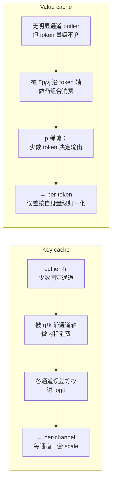
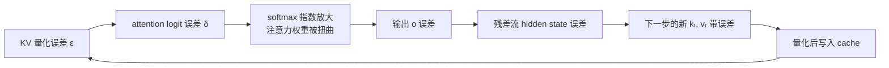
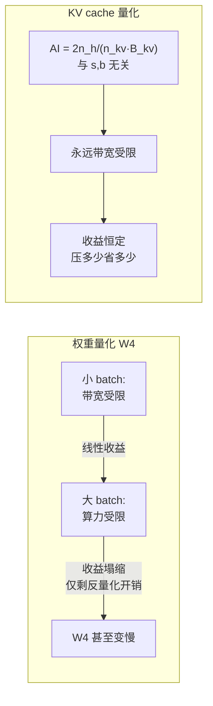

> **系列导航** ｜ [课程路线图](/quantization-roadmap/) ｜ **Part 5 · 横向专题** ｜ 第 24 篇 / 共 26 篇
>
> [← 23 LLM PTQ 统一视角](/2026/08/29/llm-quant-23-unified-view/) ｜ 25 Mixed-Precision（待写）

> **TL;DR**
>
> * **核心结论**：权重量化省的是"加载一次"的成本，KV cache 量化省的是"每一步都要读"的成本——这是两者经济学的根本差别。本篇给出一个可解析计算的判据：decode 阶段 attention 的算术强度恒为 $$\mathrm{AI}_{\text{attn}} = \dfrac{2\,n_h}{n_{\text{kv}}\,B_{\text{kv}}}$$ FLOP/byte，**与序列长度 $$s$$ 和 batch $$b$$ 都无关**，在 H100 上 FP16 KV 只有 4 FLOP/byte，比 roofline 拐点（约 295）低两个数量级。这意味着 attention 永远不会因为上下文变长而变成算力受限——**你把 KV 压到 2-bit（32 FLOP/byte）它仍然在带宽墙下面**。所以 KV 量化的带宽收益是"几乎无条件线性"的，而权重量化的收益会在 batch 变大时被算术强度吃掉。这就是"W4 不一定是最大瓶颈"的数学根据。
> * **反直觉发现**：① **Key 必须 per-channel、Value 必须 per-token，而且这不是调参经验，是被下游的消费方式决定的**——Key 被 $$q^\top k_j$$ 沿**通道轴**做内积消费，每个通道的误差等权进入 logit；Value 被 $$o=\sum_j p_j v_j$$ 沿 **token 轴**做凸组合消费，只有少数 $$p_j$$ 大。KIVI 论文实测把 Value 换成 per-channel，输出误差从 3.55% 炸到 49.89%（约 15 倍），CoQA 从 63.53 掉到 2.88[arXiv:2402.02750](https://arxiv.org/abs/2402.02750) Table 1–2。② **RoPE 是 KV 量化最大的隐藏陷阱**：它是保范正交变换，不制造 outlier，但它把 outlier 从"固定通道"变成"位置相关的通道混合"，于是"先量化再做 RoPE"与"先做 RoPE 再量化"严格不等价；KVQuant 实测 pre-RoPE 比 post-RoPE 便宜 0.82 PPL（7.05 → 6.23，LLaMA-7B 3-bit）[arXiv:2401.18079](https://arxiv.org/abs/2401.18079) Table 10。③ **在 Hopper 上，W4 在大 batch 下几乎不省时间**——Hopper 的 tensor core 不原生支持 INT4 dense GEMM，W4 必须先反量化成 FP16/BF16 再喂 tensor core，于是 W4 只省**带宽**、不省**算力**；一旦 batch 大过拐点使 GEMM 变成算力受限，W4 的收益就塌缩，剩下的只有反量化开销（QServe 实测 20–90%）[arXiv:2405.04532](https://arxiv.org/abs/2405.04532)。
> * **系列定位**：[23 篇](/2026/08/29/llm-quant-23-unified-view/) 结尾明确承认了它的三个盲区，第二个就是"只讲权重与激活，没讲 KV Cache"。本篇来补这个洞。读完它你应该能回答：我这个服务的 batch 和序列长度落在哪个区间？该优先压权重、还是优先压 KV、还是压 KV 只是为了**装得下**而不是为了**跑得快**？以及——为什么 KV 量化在 vLLM 这类分页系统里比在论文里难得多。

---

## 0. 符号表

本篇只**新增**与 KV cache 相关的记号，[01 篇 §2](/2026/08/23/llm-quant-00-quantizer-fundamentals-rtn/) 与 [23 篇](/2026/08/29/llm-quant-23-unified-view/) 已锁定的符号（$$W, x, s, z_p, b, g, \epsilon, C$$ 等）含义不变，不重复列出。

### 0.1 模型与缓存的形状

| 符号 | 含义 | 易混淆提示 |
|---|---|---|
| $$L$$ |  transformer 层数 | 与损失函数 $$\mathcal{L}$$ 区分 |
| $$n_h$$ | query head 数 | **区别于** $$n_{\text{kv}}$$；MHA 下二者相等，GQA/MQA 下 $$n_{\text{kv}} < n_h$$ |
| $$n_{\text{kv}}$$ | **KV head 数**（写入 cache 的） | 决定 KV cache 大小的直接因子；GQA 的全部价值就在压这个数 |
| $$d_h$$ | 每个 head 的维度 | 注意 $$n_h d_h = d_{\text{model}}$$，但 KV cache 只按 $$n_{\text{kv}} d_h$$ 计 |
| $$s$$ | 序列长度（prompt + 已生成） | 本篇中始终指**单条**序列的长度，不含 batch |
| $$b$$ | batch 中并发序列数 | 与位宽 $$b$$ 撞车——**本篇位宽一律写作 $$B$$ 系列，见下** |
| $$P$$ | 模型参数量 | 权重字节数 $$= P B_w$$ |

### 0.2 位宽（本篇专用记号）

| 符号 | 含义 | 典型值 |
|---|---|---|
| $$B_{\text{kv}}$$ | KV cache 每个元素的**字节数** | FP16/BF16 $$=2$$，FP8/INT8 $$=1$$，INT4 $$=0.5$$，INT2 $$=0.25$$ |
| $$B_w$$ | 权重每个元素的字节数 | 同上 |

> **为什么要改记号**：[01 篇](/2026/08/23/llm-quant-00-quantizer-fundamentals-rtn/) 用小写 $$b$$ 表示**位宽**（bit），但服务领域习惯用 $$b$$ 表示 **batch size**，二者在本篇会同时高频出现。为避免歧义，本篇**位宽一律用 $$B$$ 表示字节数、用 $$X$$-bit 表示位宽**，小写 $$b$$ 只保留给 batch。

### 0.3 性能分析

| 符号 | 含义 | 说明 |
|---|---|---|
| $$\mathrm{AI}$$ | 算术强度（arithmetic intensity），FLOP/byte | 与 roofline 拐点 $$F/\mathrm{BW}$$ 比较即可判定算力受限还是带宽受限 |
| $$\mathrm{BW}$$ | HBM 带宽（byte/s） | H100 SXM 取 $$3.35\times10^{12}$$ |
| $$F_{\text{BF16}}$$ / $$F_{32}$$ | BF16 tensor core 峰值 / FP32 CUDA core 峰值 | H100 SXM 取 $$989.4\times10^{12}$$ / $$66.9\times10^{12}$$ |
| $$\kappa$$ | 反量化每个元素需要的 CUDA-core 运算次数 | §4.2 的核心判据量，$$\kappa\approx 3$$ 是典型值 |
| $$f$$ | attention 占单个 decode step 时间的比例 | §4.2 决策表的自变量，**必须实测** |

### 0.4 量化与 KV 专用

| 符号 | 含义 | 出处 / 说明 |
|---|---|---|
| $$R$$ | **残差长度**：最近多少个 token 保留 FP16 | KIVI，默认 $$R=128$$；也是 FP16 滑动窗口的长度 |
| $$G$$ | 分组大小（group size） | KIVI 用 $$G=32$$；**注意它必须与 page size 对齐**，见 §4.1 |
| $$z_j,\ \delta_j$$ | 第 $$j$$ 个 token 的注意力 logit 及其量化误差 | $$\delta_j = q^\top\epsilon_j/\sqrt{d_h}$$ |
| $$p_j$$ | softmax 后的注意力权重 | $$\sum_j p_j = 1$$，实测稀疏（KIVI 报 84.3%） |
| $$R_n$$ | 位置 $$n$$ 处的 RoPE 块对角旋转矩阵 | 正交，保 $$\ell_2$$ 范数；$$Q(R_n k) \neq R_n Q(k)$$ |
| $$\theta_i$$ | RoPE 第 $$i$$ 个通道对的角频率 | $$\theta_i = \text{base}^{-2i/d_h}$$；NTK/YaRN 会改它 |

---

## 1. 把账算清楚：KV cache 的显存与带宽账单

这一节的所有数字都可以从公式直接推出来。我会把每一个中间步骤写出来，并且用一个已发表论文的实测值反向校验公式——**如果我的公式和论文的公开数字对不上，那一定是我的推导有问题。**

### 1.1 解析公式

一个 decoder-only 模型，自回归生成时在第 $$l$$ 层要把该层所有 KV head 的 Key 与 Value 缓存下来。设：

- $$L$$：层数
- $$n_{\text{kv}}$$：KV head 数（GQA/MQA 下小于 query head 数 $$n_h$$；MHA 下 $$n_{\text{kv}}=n_h$$）
- $$d_h$$：每个 head 的维度
- $$s$$：每条序列的上下文长度（prompt + 已生成）
- $$b$$：batch 中并发的序列数
- $$B$$：每个元素的存储字节数（FP16/BF16 为 2，FP8/INT8 为 1，INT4 为 0.5）

那么 KV cache 的总字节数是

$$
\boxed{\;M_{\text{KV}} \;=\; \underbrace{2}_{\text{K 与 V}} \cdot L \cdot n_{\text{kv}} \cdot d_h \cdot s \cdot b \cdot B\;}
$$

这个式子简单到容易被跳过，但它已经能说明三件事：

1. **对 $$s$$ 和 $$b$$ 都是线性的**。上下文翻倍或并发翻倍，KV 显存就翻倍。权重不是这样——权重是**常数**，与 $$s, b$$ 完全无关。
2. **它随层数、KV head 数、head 维度线性增长，但与模型宽度（$$n_h d_h$$）无关**。这就是为什么 GQA/MQA 是长上下文服务的第一杠杆：把 $$n_{\text{kv}}$$ 从 32 降到 8，KV cache 直接除以 4，而权重一点没变。
3. **$$B$$ 是一个纯粹的线性因子**。压到 4-bit 就是除以 4，没有隐藏的常数项——这跟权重量化不同，权重量化还要付 scale/zero-point 的元数据税（[01 篇 §7.2](/2026/08/23/llm-quant-00-quantizer-fundamentals-rtn/)）。

第 3 点值得单独说一句。权重量化的 $$b_{\text{eff}} = b + 16/g$$ 里，那个 $$16/g$$ 是"粒度越细、税越重"。KV cache 也有同样的税，但它**被摊到了 $$s$$ 这么长的轴上去**——per-channel 的 scale 是一个长度为 $$d_h$$ 的向量，摊到 $$s$$ 个 token 上，当 $$s=4096$$ 时税是 $$16/(4096)\approx 0.004$$ bit/元素，**完全可以忽略**。这是 KV cache 相对于权重的一个结构性优势：**量化轴（通道）与被摊薄的轴（序列）正交，元数据成本天然被稀释**。

### 1.2 算例：7B 模型，seq=32k，batch=16

取一个 Mistral-7B / LLaMA-3-8B 形态的配置：

$$L = 32,\quad n_{\text{kv}} = 8,\quad d_h = 128,\quad n_h = 32,\quad P = 7\times 10^9\ \text{参数}$$

**step 1：每条序列每个 token 的字节数。**

$$2 \cdot L \cdot n_{\text{kv}} \cdot d_h \cdot B = 2 \times 32 \times 8 \times 128 \times 2\ \text{B} = 131{,}072\ \text{B} = 128\ \text{KiB}$$

也就是说，**每多缓存一个 token，就要 128 KiB**。这个数字值得记住：一条 4k 的对话，光 KV cache 就是 $$4096 \times 128\ \text{KiB} = 512\ \text{MiB}$$。

**step 2：seq = 32768。**

$$M_{\text{KV}} = 131{,}072 \times 32768 \times 16 = 68{,}719{,}476{,}736\ \text{B} = 64\ \text{GiB}$$

**step 3：与权重的对比。**

| 项 | 字节数 | GiB |
|---|---:|---:|
| 权重 FP16（$$7\times10^9 \times 2$$ B） | $$1.40\times10^{10}$$ | **13.04** |
| 权重 INT4（$$7\times10^9 \times 0.5$$ B） | $$3.50\times10^{9}$$ | **3.26** |
| KV cache FP16（$$s{=}32768,\ b{=}16$$） | $$6.87\times10^{10}$$ | **64.00** |
| KV cache FP8 | $$3.44\times10^{10}$$ | 32.00 |
| KV cache INT4 | $$1.72\times10^{10}$$ | 16.00 |

三个比值：

$$\frac{M_{\text{KV}}^{\text{FP16}}}{M_{W}^{\text{FP16}}} = \frac{64}{13.04} = 4.91,\qquad
\frac{M_{\text{KV}}^{\text{FP16}}}{M_{W}^{\text{INT4}}} = \frac{64}{3.26} = \mathbf{19.6},\qquad
\frac{M_{\text{KV}}^{\text{INT4}}}{M_{W}^{\text{INT4}}} = \frac{16}{3.26} = 4.91$$

**这就是全文的立论基础**：在这个配置下，FP16 的 KV cache 是 FP16 权重的 4.9 倍，是 **INT4 权重的 19.6 倍**。你把权重从 FP16 压到 INT4，省下 9.78 GiB；而 KV cache 还在那里躺着 64 GiB 纹丝不动。**W4A16 的整套努力，被 KV cache 一个零头就盖过去了。**

更扎心的是：即便你把 KV 也压到 4-bit（16 GiB），**KV 仍然是 W4 权重的 4.9 倍**。也就是说在这个工作点上，KV4 + W4 的组合里，**显存的大头依然是 KV**。

### 1.3 用一篇论文反向校验公式

我不放心只报自己的推导，所以拿 KVQuant 论文里的公开数字对一下。KVQuant Table 8 报告：**LLaMA-7B，seq = 128K，FP16 KV cache = 64.0 GB**。

LLaMA-7B 是 MHA（不是 GQA），所以 $$n_{\text{kv}} = 32$$（不是 8），$$L=32$$，$$d_h=128$$。代入公式：

$$2 \times 32 \times 32 \times 128 \times 131072 \times 2 = 6.87\times10^{10}\ \text{B} = 64\ \text{GiB}$$

**完全吻合**（论文写 "GB"，实际是 GiB，这是行业惯例的记号混用）。同一张表里 fp16 权重标注为 12.6 GB，即 $$6.7\times10^9 \times 2\ \text{B} = 13.4\ \text{GB} = 12.5\ \text{GiB}$$，同样吻合。

公式可信。顺便把常见模型的"每 token 字节数"列成一张表，方便你以后心算：

| 模型形态 | $$L$$ | $$n_{\text{kv}}$$ | $$d_h$$ | FP16 每 token |
|---|---:|---:|---:|---:|
| LLaMA-2-7B（MHA） | 32 | 32 | 128 | 512 KiB |
| **Mistral-7B / LLaMA-3-8B（GQA）** | 32 | 8 | 128 | **128 KiB** |
| Qwen2-7B（GQA，更激进） | 28 | 4 | 128 | 56 KiB |
| LLaMA-2-70B（GQA） | 80 | 8 | 128 | 320 KiB |
| DeepSeek-V2（MLA，$$d_c{=}512 + d_r{=}64$$，$$L{=}60$$） | — | — | — | ≈ 67.5 KiB |

最后一行是**架构派**的答案：DeepSeek-V2 的 MLA 把 KV cache 压成一个低维潜向量，论文报告 KV cache 减少 **93.3%**[arXiv:2405.04434](https://arxiv.org/abs/2405.04434)。560 亿参数的 MoE 模型，每 token 的 KV 开销比 7B 的 Qwen2 还低。这提醒我们一件事：**KV cache 问题的最优解可能不在量化这一层，而在架构那一层**。本篇讨论的是"给定架构，怎么量化"；架构本身能不能改，那是另一回事（见 §6）。

### 1.4 不只是显存：decode 的带宽账单

显存只决定"能不能装下"。真正决定"跑多快"的是带宽。我们来算**一个 decode step 要搬多少字节**。

decode 阶段每一步，对 batch 中的 $$b$$ 条序列各生成 1 个 token：

- **权重**：不管 batch 多大，每个 decode step 都要把全部权重从 HBM 过一遍。但关键点是——**这 $$P\cdot B_w$$ 个字节是被 $$b$$ 条序列共享的一次读取**。这就是 batching 的全部意义。
- **KV cache**：每条序列要读自己的 $$s$$ 个 token，共 $$2 L n_{\text{kv}} d_h s b B_{\text{kv}}$$ 字节。**没有任何共享**（除非做 prefix caching）。

所以单步的字节账单是

$$M_{\text{step}} = \underbrace{P\,B_w}_{\text{共享一次}} \;+\; \underbrace{2 L n_{\text{kv}} d_h\, s\, b\, B_{\text{kv}}}_{\text{每序列各自一份}}$$

注意这两项在 $$b$$ 上的行为完全不同：第一项**与 $$b$$ 无关**，第二项**与 $$b$$ 成正比**。这直接给出"KV 什么时候超过权重"的临界条件：

$$2 L n_{\text{kv}} d_h\, s\, b\, B_{\text{kv}} \;=\; P\,B_w
\quad\Longrightarrow\quad
\boxed{\;s\cdot b \;=\; \frac{P\,B_w}{2 L n_{\text{kv}} d_h\, B_{\text{kv}}}\;}$$

对我们的 7B 配置代入 $$2 L n_{\text{kv}} d_h = 65{,}536$$：

$$s\cdot b = \frac{7\times10^9}{65536}\cdot\frac{B_w}{B_{\text{kv}}} = 106{,}812\cdot\frac{B_w}{B_{\text{kv}}}$$

| 配置 | 临界 $$s\cdot b$$ | 在 $$b=16$$ 时的临界 $$s$$ |
|---|---:|---:|
| W-FP16 + KV-FP16 | 106,812 | 6,676 |
| **W-INT4 + KV-FP16** | **26,703** | **1,669** |
| W-INT4 + KV-FP8 | 53,406 | 3,338 |
| W-INT4 + KV-INT4 | 106,812 | 6,676 |

**读第二行**：在一个 W4 的服务上，只要 batch=16 的每条序列超过约 **1,669** 个 token，KV cache 的字节账单就已经超过全部 4-bit 权重了。1,669 token 是什么概念？大约一页半 A4 纸的中文。**这不是"长上下文"场景，这是"正常"场景。**

### 1.5 prefill 与 decode：两种完全不同的瓶颈

同一个模型、同一份数据，prefill 和 decode 卡在完全不同的地方。用 roofline 的语言说，就是**算术强度（arithmetic intensity, AI）不同**。

**prefill**：一次处理 $$s$$ 个 token。GEMM 部分是 $$\text{(s × d)} \times \text{(d × d)}$$ 的矩阵乘，AI 随 $$s$$ 增长；attention 部分是 $$\text{(s × d)} \times \text{(d × s)}$$，FLOPs $$\propto s^2$$ 而 KV 读写在 FlashAttention 下 $$\propto s$$。粗算一下（7B 配置，$$s=2048$$，FP16）：

$$\text{FLOPs} \approx 4 L n_h d_h \frac{s^2}{2} + 2Ps \approx 3.0\times10^{13},\qquad
\text{Bytes} \approx 2P + M_{\text{KV}} \approx 1.4\times10^{10}$$

$$\mathrm{AI}_{\text{prefill}} \approx \frac{3.0\times10^{13}}{1.4\times10^{10}} \approx 2\times10^{3}\ \text{FLOP/byte}$$

H100 SXM 的 roofline 拐点是

$$\frac{F_{\text{BF16}}}{\mathrm{BW}} = \frac{989.4\times10^{12}}{3.35\times10^{12}} \approx 295\ \text{FLOP/byte}$$

$$2\times10^3 \gg 295$$，所以 **prefill 是算力受限（compute-bound）**。在 prefill 里压 KV 的位宽，省的那点带宽被淹没在算力的汪洋里——**基本没有收益**。

**decode**：每步只算 1 个 query 位置。GEMM 退化成 GEMV，AI 变成 $$2b/B_w$$；attention 变成"一个 query 向量对 $$s$$ 个 key 做内积"。我们精确算一下 attention 部分：

$$\text{FLOPs} = \underbrace{2 s d_h n_h}_{QK^\top} + \underbrace{2 s d_h n_h}_{AV} = 4\, L\, s\, d_h\, n_h\ (\text{乘} L \text{层})$$

$$\text{Bytes} = 2\, L\, s\, d_h\, n_{\text{kv}}\, B_{\text{kv}}$$

$$\boxed{\;\mathrm{AI}_{\text{attn}} = \frac{4 L s d_h n_h}{2 L s d_h n_{\text{kv}} B_{\text{kv}}} = \frac{2\,n_h}{n_{\text{kv}}\,B_{\text{kv}}}\;}$$

**$$L$$、$$s$$、$$d_h$$、$$b$$ 全部约掉了。** 这个结果值得停下来看三秒：

> **decode 阶段 attention 的算术强度与序列长度无关、与 batch 大小无关，只取决于 GQA 分组比和 KV 的位宽。**

代入 $$n_h=32,\ n_{\text{kv}}=8$$：

| KV 精度 | $$\mathrm{AI}_{\text{attn}}$$ | 距 H100 拐点（295） |
|---|---:|---:|
| FP16 ($$B=2$$) | **4.0** | 低 74 倍 |
| FP8 / INT8 ($$B=1$$) | 8.0 | 低 37 倍 |
| INT4 ($$B=0.5$$) | 16.0 | 低 18 倍 |
| INT2 ($$B=0.25$$) | 32.0 | 低 9 倍 |

对照一下 GEMM 部分：它的 AI 是 $$2b/B_w$$，**随 $$b$$ 线性增长**。所以：

- **小 batch**：GEMM 的 AI 也很低（$$b=1$$, W4 → 4 FLOP/byte），权重带宽是主要成本 → **W4 直接线性省时间**。
- **大 batch**：GEMM 的 AI 越过 295，变成算力受限 → 权重带宽不再是瓶颈 → **W4 的带宽红利被吃掉**。
- **attention**：AI 恒为 4，永远够不着 295。就算你把 KV 压到 2-bit，AI 也只有 32，还在算力墙下面 9 倍。

> **结论一句话**：GEMM 那部分会随着 batch 增大而"毕业"（从带宽受限升到算力受限），attention 那部分**永远毕不了业**。你把它压到多低位宽，它都还是纯带宽账单，压多少省多少。

至于 MHA（$$n_h=n_{\text{kv}}=32$$）的 FP16 attention，AI = 1.0 FLOP/byte——比 GQA 还惨 4 倍。所以 GQA 不只是省显存，它顺手把 attention 的算术强度也提高了 4 倍。

### 1.6 立论：两种成本的经济学

把这一节收成一句话：

| | 权重量化 | KV cache 量化 |
|---|---|---|
| 省的是什么 | **加载一次**的成本 | **每一步都要读**的成本 |
| 单步成本结构 | $$P B_w$$（与 $$s,b$$ 无关） | $$2 L n_{\text{kv}} d_h s b B_{\text{kv}}$$（随 $$s,b$$ 增长） |
| 随 batch 的边际收益 | **递减**（GEMM 会变成算力受限） | **不变**（AI 恒为常数） |
| 随序列长度的边际收益 | **不变**（权重与 $$s$$ 无关） | **递增**（线性） |
| 主要受益场景 | 小 batch、显存装不下 | 大 batch、长上下文 |
| 在 prefill 里 | 有效（算力受限，低位宽 = 高算力） | **基本无效** |
| 在 decode 里 | 小 batch 有效，大 batch 塌缩 | **一直有效** |

最后一行是本篇最想传达的东西：**权重量化的收益曲线是随 batch 递减的，KV cache 量化的收益曲线是平的。** 两条曲线会交叉，交叉点就在 §5 的决策图上。

---

## 2. KV cache 的分布特性：它既不像权重，也不像激活

前面 23 篇建立的所有直觉——"权重近似高斯、激活有 emergent outlier 通道"——都不能直接搬到 KV cache 上。原因不是 KV 更奇怪，而是 **KV 有两个张量，它们的分布形状和被消费的方式都不一样**。

### 2.1 K 与 V 的不对称：粒度不是调参，是被"下游怎么用"决定的

KIVI 的作者做了一件很朴素但很关键的事：把 KV cache 的元素幅值按位置可视化，然后发现[arXiv:2402.02750](https://arxiv.org/abs/2402.02750) §3.1：

- **Key**：有少数**固定的通道**，幅值异常大。这个 outlier 结构**跨 token 稳定**——同一个通道在整条序列上都是大值。
- **Value**：没有明显的通道级 outlier 模式。

这个观察本身不稀奇（它和 LLM 激活的 emergent outlier 是同一类现象）。真正有意思的问题是：**为什么这导致 K 用 per-channel、V 用 per-token？**

答案藏在这两个张量**被谁消费、怎么消费**里。

**Key 被内积消费。** 注意力分数是

$$z_j = \frac{q^\top k_j}{\sqrt{d_h}} = \frac{1}{\sqrt{d_h}}\sum_{c=1}^{d_h} q_c\, k_{jc}$$

这是沿**通道轴**的求和。量化误差 $$\epsilon_j = k_j - \hat k_j$$ 引起的分数误差是

$$\delta_j = \frac{q^\top \epsilon_j}{\sqrt{d_h}}$$

展开成各通道贡献之和：**没有哪个通道的误差天然更应该被原谅**。outlier 通道幅值大，但它乘的 $$q_c$$ 未必大；普通通道幅值小，误差照样等权进 logit。

所以 Key 需要的是"**各通道统一的相对精度**"。而 Key 恰恰是通道间幅值差几十倍——用 per-token（沿通道轴共享一个 scale），scale 会被那几个 outlier 通道撑爆，剩下 120 多个正常通道全被压进最粗的几格。用 per-channel（每个通道一套 scale，沿 token 轴共享），每个通道各管各的量级，正好对上需求。

**而 per-channel 之所以可行，正是因为 outlier 结构跨 token 稳定**——通道 $$c$$ 的 scale $$s_c$$ 校准一次就能用于整条序列，甚至可以用于所有请求。这一点在 §3.2 讲 KVQuant 的离线校准时会回来。

**Value 被凸组合消费。** 注意力输出是

$$o = \sum_{j=1}^{s} p_j\, v_j,\qquad p_j \ge 0,\ \sum_j p_j = 1$$

这是沿 **token 轴**的加权平均，且 $$p$$ 是稀疏的（KIVI 实测 84.3% 稀疏度）。误差传播：

$$\|o - \hat o\|_2 = \Big\|\sum_j p_j \epsilon_j\Big\|_2 \;\le\; \sum_j p_j \|\epsilon_j\|_2$$

关键量不是 $$\|\epsilon_j\|$$ 的绝对大小，而是**它相对 $$\|v_j\|$$ 的大小**。因为 $$o$$ 是加权平均，token $$j$$ 对输出的贡献是 $$p_j v_j$$，所以真正要紧的是每个 token 的**相对**误差。两种粒度给出的保证完全不同：

- **per-token**：每个 token 独享 scale，误差按自己的量级归一化，
  $$\frac{\|\epsilon_j\|}{\|v_j\|} \;\le\; \eta \qquad\text{—— 与 } \|v_j\| \text{ 无关，各 token 一致}$$
  代入三角不等式：$$\|o - \hat o\| \le \eta\sum_j p_j\|v_j\|$$。这个界随 $$p$$ 集中在小量级 token 上而变小。
- **per-channel**：通道 $$c$$ 的 scale 被**该通道最大的那个 token** 撑开，于是每个 token 的**绝对**误差界是同一个常数 $$E \approx \sqrt{\sum_c (s_c/2^b)^2}$$，与 $$\|v_j\|$$ 无关。于是
  $$\frac{\|\epsilon_j\|}{\|v_j\|} \;\le\; \frac{E}{\|v_j\|} \qquad\text{—— 随 } \|v_j\| \text{ 减小而爆炸}$$

一句话：**per-token 保证每个 token 的"相对"误差一致地好；per-channel 只保证"绝对"误差一致，于是小量级 token 的相对误差可以任意差。** 而稀疏的 $$p$$ 意味着 attention 质量压在少数几个 token 上——**那几个 token 是不是"大量级 token"，完全不受你控制**。所以 per-channel 的输出误差界里含有一个不可控的 $$1/\min\{\|v_j\| : p_j \text{ 大}\}$$ 因子。

我在 §7.1 给了一个直接测量这件事的诊断量：**逐 token 相对误差 $$\|\epsilon_j\|/\|v_j\|$$ 的变异系数（CV）**。per-token 的 CV 应当接近 0（各 token 一视同仁），per-channel 的 CV 应当显著更大——这是上面两行公式的可执行版本。

KIVI 的实测证实了这一点，而且是**反直觉**的那种证实：

| Value 量化方式（2-bit，Llama-2-13B） | 重建误差 $$\lVert X_V - X'_V\rVert_F/\lVert X_V\rVert_F$$ | **输出误差** $$\lVert AX_V - AX'_V\rVert_F/\lVert AX_V\rVert_F$$ |
|---|---:|---:|
| per-token | 4.57 | **3.55** |
| per-channel | **3.73**（更低！） | **49.89**（高 14 倍） |

注意这张表的陷阱：**per-channel 的重建误差更低（3.73 < 4.57），输出误差却高 14 倍。** 如果只用"重建 MSE/SNR"来选量化配置（这正是 [01 篇 §6.2](/2026/08/23/llm-quant-00-quantizer-fundamentals-rtn/) 反复警告的 $$C$$ 加权问题），你会选错。

下游指标更触目惊心（Llama-2-13B，2-bit，CoQA / TruthfulQA）：

| 配置 | CoQA | TruthfulQA |
|---|---:|---:|
| FP16 baseline | 66.37 | 29.53 |
| **K per-channel + V per-token（KIVI）** | **63.53** | **28.60** |
| K per-channel + V per-channel | **2.88** | **0.74** |
| K per-token + V per-channel | **2.80** | **0.26** |

**只要 Value 走 per-channel，模型就直接崩掉**——不是掉几个点，是掉到随机水平。这是整个 KV 量化领域最硬的一条工程纪律。

Key 那边的对比（同一篇 Table 2）：K per-token 的注意力分数误差 47.00 vs K per-channel 的 9.60，**差 5 倍**。



### 2.2 RoPE：KV 量化最大的隐藏陷阱

这一小节是本篇我最想写清楚的部分，因为它是**最容易踩、且踩了以后最难 debug** 的坑。

RoPE（Rotary Position Embedding）对 Key 施加一个位置相关的块对角旋转：把第 $$n$$ 个位置的 Key 按通道对 $$(k_{2i}, k_{2i+1})$$ 旋转角度 $$n\theta_i$$：

$$
\begin{pmatrix} \tilde k_{2i} \\ \tilde k_{2i+1} \end{pmatrix}
=
\begin{pmatrix} \cos n\theta_i & -\sin n\theta_i \\ \sin n\theta_i & \phantom{-}\cos n\theta_i \end{pmatrix}
\begin{pmatrix} k_{2i} \\ k_{2i+1} \end{pmatrix},
\qquad \theta_i = 10000^{-2i/d_h}
$$

**第一个事实：RoPE 是正交变换，它保 $$\ell_2$$ 范数。** 对每个通道对，$$\tilde k_{2i}^2 + \tilde k_{2i+1}^2 = k_{2i}^2 + k_{2i+1}^2$$。所以 RoPE **不制造 outlier**，也不放大整体能量。

那问题出在哪？出在**它把 outlier 重新分配了。**

设通道 $$2i$$ 是一个 outlier 通道（幅值 $$A$$），通道 $$2i+1$$ 是普通通道（幅值 $$a \ll A$$）。旋转后：

$$\tilde k_{2i} = k_{2i}\cos n\theta_i - k_{2i+1}\sin n\theta_i$$

- 在 $$n\theta_i \approx 0$$ 的位置：$$\tilde k_{2i} \approx k_{2i}$$，outlier 保持在本通道；
- 在 $$n\theta_i \approx \pi/2$$ 的位置：$$\tilde k_{2i} \approx -k_{2i+1}$$，**outlier 跑到对面通道去了，本通道只剩小值**；
- 在 $$n\theta_i \approx \pi/4$$ 的位置：两个通道各分到 $$A/\sqrt 2$$。

于是"哪些通道是 outlier"变成了**位置的函数**。KVQuant 论文的表述是：post-RoPE 的 Key 分布"less structured"，outlier 通道的幅值"less consistent"。

这带来两个独立的坏消息：

**（1）动态范围扩张。** 对高频维度（$$\theta_i$$ 大、旋转快），$$n\theta_i$$ 随 $$n$$ 快速扫过整个圆周，于是通道 $$2i$$ 的取值在 $$[-A, A]$$ 之间来回振荡。per-channel 的 scale 必须覆盖 $$\max_n \vert\tilde k_{2i,n}\vert \approx A$$——**这个通道原本只有 $$a$$ 的量级，现在要按 $$A$$ 来定尺子**。原本"小通道"和"大通道"各用各的尺子的好处，被 RoPE 抹平了：现在每个通道的峰值和这对通道的 $$\ell_2$$ 范数同阶，**per-channel 退化的结果就是 per-pair，精度白丢一半**。

**（2）非交换性。** 记 $$R_n$$ 为位置 $$n$$ 的旋转矩阵，$$Q$$ 为量化-反量化算子。那么

$$Q\big(R_n k\big) \;\neq\; R_n\, Q\big(k\big)$$

左边是"先旋转再量化"（post-RoPE），右边是"先量化再旋转"（pre-RoPE）。二者不等价的原因是根本性的：**$$Q$$ 是逐通道独立的非线性算子，$$R_n$$ 是跨通道混合的线性算子，两者不对易。** 具体说：

- **pre-RoPE**：对未旋转的 $$k$$ 做 per-channel 量化，误差 $$\epsilon$$ 满足 $$\vert\epsilon_c\vert \le s_c/2$$，各通道独立。反量化后再旋转，误差变成 $$R_n\epsilon$$。由正交性：
  $$\|R_n \epsilon\|_2 = \|\epsilon\|_2$$
  **误差的 $$\ell_2$$ 范数被旋转精确保持**——旋转不会让误差变大。而分数误差由 Cauchy–Schwarz：
  $$\vert\delta_j\vert = \frac{\vertq^\top R_n \epsilon_j\vert}{\sqrt{d_h}} \le \frac{\|R_n^\top q\|_2 \,\|\epsilon_j\|_2}{\sqrt{d_h}} = \frac{\|q\|_2 \,\|\epsilon_j\|_2}{\sqrt{d_h}}$$
  这里用到了 $$\|R_n^\top q\| = \|q\|$$。**上界与位置 $$n$$ 无关**，且 $$\|\epsilon_j\|$$ 由 pre-RoPE 的紧凑通道分布控制。
- **post-RoPE**：直接量化 $$R_n k$$，误差 $$\epsilon'$$ 的 scale 必须按旋转后的（被撑开的）通道范围来定，$$\|\epsilon'\| > \|\epsilon\|$$，上界更松，而且**随位置 $$n$$ 变化**。

所以从理论上 pre-RoPE 严格占优。KVQuant 的实测（LLaMA-7B，3-bit，per-channel K + per-token V，Wikitext-2）：

| 方案 | PPL | KV cache @128K |
|---|---:|---:|
| FP16 baseline | 5.68 | 64.0 GB |
| INT3 **post-RoPE** | 7.05 | 12.0 GB |
| INT3 **pre-RoPE** | **6.23** | 12.0 GB |

**pre-RoPE 便宜 0.82 PPL**，而代价完全相同（12.0 GB）。这是白捡的[arXiv:2401.18079](https://arxiv.org/abs/2401.18079) Table 10。

**代价是什么？** pre-RoPE 不能在写 cache 的时候一次性把 RoPE 做完——你必须**每读一次 cache 就在 kernel 里补一次旋转**。这有三层工程后果：

1. **每步多一次旋转计算**。KVQuant 用 fused kernel 把它和反量化融合掉（他们的论证是：反正 KV 加载是带宽受限的，这点 CUDA core 算力是"免费"的——§4.2 会验证这个论证的边界）。
2. **K cache 里存的不再是标准实现里的那个量**。这意味着它**不能作为 drop-in 替件**塞进任何现成的 serving 栈——vLLM、SGLang、TensorRT-LLM 都默认 K cache 是 post-RoPE 的。要上 pre-RoPE，得改 attention kernel。
3. **不是所有模型都给得出这个 hook**。pre-RoPE 要求 RoPE 是一个作用在 $$K$$ 投影之后的、可被单独抽出来的算子。对于 ALiBi、NoPE，或者把 RoPE 融进投影层权重里的实现（某些推理框架为了省一次 kernel 会这么做），这条路就不通。

**一个更微妙的坑**：有些长上下文扩展方法（NTK-aware scaling、YaRN、LongRoPE 等）会修改 $$\theta_i$$ 的基数或对维度做分段缩放。这些修改**只影响 RoPE 的角频率，不影响 pre-RoPE vs post-RoPE 的选择**——但你必须在校准和推理时用**同一套频率**。如果校准用 base=10000、推理用 base=1000000，你量化的 pre-RoPE 分布和实际消费的 post-RoPE 分布就错配了。这是一个非常具体的、会静默掉点的坑。

### 2.3 误差的累积性质：与权重量化根本不同

权重量化的误差是**一次性的**：$$\Delta W$$ 是一个固定的矩阵，它引起的输出误差 $$\Delta W x$$ 随输入 $$x$$ 变化，但 $$\Delta W$$ 自己不会长大。跨层有累积（[23 篇](/2026/08/29/llm-quant-23-unified-view/) §8 承认了这是 layer-wise PTQ 的盲区），但误差源本身是静态的。

KV cache 的误差有三点不同。

**（1）同一个误差被反复消费。** token $$j$$ 的 KV 在写入时被量化一次，产生一个**固定的** $$\epsilon_j$$。之后在位置 $$j+1, j+2, \dots, s$$ 的每一个 decode step 里，这个**完全相同的** $$\epsilon_j$$ 都会被读出来，系统性地偏移 token $$j$$ 的注意力权重。

对比一下：权重的误差 $$\Delta W$$ 也是固定的，但每步遇到的是**新的**激活 $$x^{(t)}$$，所以 $$\Delta W x^{(t)}$$ 在不同步之间像噪声一样抖动，有部分抵消。而 $$\epsilon_j$$ 面对的是缓慢变化的 $$q^{(t)}$$，产生的 $$\delta_j^{(t)} = q^{(t)\top}\epsilon_j/\sqrt{d_h}$$ 在相邻步之间**高度相关**——它是一个**系统偏置，不是噪声**。系统偏置不会通过平均抵消。

**（2）softmax 是指数放大。** 注意力权重对分数误差的响应不是线性的：

$$\frac{\hat p_j}{p_j} = \frac{e^{z_j + \delta_j}}{\sum_i p_i e^{z_i + \delta_i}} \cdot \frac{\sum_i p_i e^{z_i}}{e^{z_j}}
= \frac{e^{\delta_j}}{\sum_i p_i e^{\delta_i}}$$

任意两个 token 的**胜率比**变化为

$$\frac{\hat p_j / \hat p_k}{p_j / p_k} = e^{\delta_j - \delta_k}$$

**分数误差是被取指数的。** $$\delta_j - \delta_k = 1$$（1 nat）就能让二者的相对优势改变 $$e \approx 2.72$$ 倍。这解释了一个重要的工程事实：**对 Key 的精度要求是以"绝对 logit 单位"计的，而不是以相对精度计的**，而且这个要求**不随 $$s$$ 增大而放松**——因为 softmax 的分母 $$\sum_i p_i e^{\delta_i}$$ 的平均效应大致抵消了 $$s$$ 的影响，两个 token 之间的相对关系只取决于 $$\delta$$ 的**差值**。

**（3）误差会写回 cache 本身。** 这是最不像权重量化的一点。第 $$t$$ 步的 hidden state 有误差 $$\Delta h^{(t)}$$，那么由它算出的新 $$k_t, v_t$$ 也就有误差：

$$k_t = W_K\, h^{(t)} \;\longrightarrow\; k_t + W_K \Delta h^{(t)}$$

这个带误差的 $$k_t$$ 被量化（误差叠加）后**写进 cache**，然后在第 $$t+1, t+2, \dots$$ 步被反复消费，反过来继续污染后续步的 hidden state。

这就形成了一个**反馈环**：



权重量化没有这个环：$$\Delta W$$ 不会改变 $$W$$。KV cache 量化有。

**诚实的边界**：我不打算给这个反馈环一个"误差按 $$O(s)$$ 增长"之类的增长率公式——那需要具体的假设（$$W_K$$ 的谱性质、$$p$$ 的集中度、误差的相关性结构），我没有实测数据支撑任何一个具体假设，编一个增长率是伪科学。我能诚实说的是三件事：**(a)** 误差是系统偏置而非白噪声，所以不能用"逐层/逐步平均抵消"来安慰自己；**(b)** softmax 是指数放大，所以 logit 域的绝对误差预算是紧的；**(c)** 存在一个 cache → state → cache 的反馈路径，这是权重量化不具备的定性风险。这三件事合起来足以解释一个在长上下文任务上反复被观察到的现象：**长上下文 benchmark（RULER、passkey retrieval）对 KV 量化的敏感度，远高于短上下文的困惑度指标**。KVQuant Table 4 就是这么组的数据：LLaMA-2-7B-32K 在 RULER 上，FP16 得 56.40，KIVI-2（3.05 bit）得 39.78，KVQuant-2bit-1%（2.33 bit）得 36.54。**同一个量化配置，在 Wikitext-2 上 PPL 只掉 0.29，在 RULER 上掉掉 20 分。**

> **这是本篇最重要的一条实践建议**：**评价 KV 量化方案时，Wikitext-2 困惑度几乎是无效指标。** 你必须看长上下文检索/推理任务。困惑度衡量的是"下一个 token 预测得准不准"，而短上下文下 KV cache 只有几百个 token、attention 权重相对分散，量化误差被平均掉了；长上下文任务考察的恰恰是"能不能从几万个 token 里精确捞出那一个"——这正是 softmax 指数放大最致命的场景。

---

## 3. 主流方法：各自的数学抓手与代价

### 3.1 KIVI：不对称粒度 + 残差长度

**抓手**：用 §2.1 的"消费方式决定粒度"原则，Key 走 per-channel、Value 走 per-token，然后各自按 $$G=32$$ 分组。

分组的具体切法（这是实现时最容易搞错的地方）：

- **Key**：沿 **token 轴**每 $$G=32$$ 个 token 切成一组，组内**每个通道**独立量化。即 scale 张量形状 $$(s/G,\ d_h)$$。
- **Value**：沿 **通道轴**每 $$G=32$$ 个通道切成一组，组内**每个 token** 独立量化。即 scale 张量形状 $$(s,\ d_h/G)$$。

注意这两者的 scale 形状是**转置关系**。这是因为 per-channel 量化天然沿 token 轴聚合统计量，per-token 量化天然沿通道轴聚合统计量。

**残差长度（residual length）$$R$$**。这是 KIVI 的另一个关键设计，也是**纯工程约束逼出来的漂亮解法**。

问题：per-channel 量化需要沿 token 轴做统计，但 decode 是流式的——新 token 一个一个来，**没凑够 $$G$$ 个 token 就没法做 per-channel 量化**（统计量不完整）。

KIVI 的解法：把 cache 切成两段。

- **已量化段** $$X_{Kg}$$：$$s - R$$ 个 token，按上面的规则量化。
- **残差段** $$X_{Kr}$$：最近 $$R$$ 个 token，**保持 FP16**。

每来一个新 token，先以 FP16 追加到残差段；残差段攒够 $$R$$ 个后，一次性量化、并入已量化段，残差段清空。注意力计算时两段拼接参与运算。

$$R=128$$ 是论文默认（消融扫过 32/64/96/128，$$R\le 128$$）。

**这个设计的收益远不止"解决流式问题"**：它顺手造了一个 **FP16 的滑动窗口**。KIVI 指出这个全精度窗口对硬生成任务至关重要。Llama-2-7B GSM8K 的数据：

| 配置 | GSM8K |
|---|---:|
| FP16 baseline | 13.50 |
| fake-2bit（K per-channel + V per-token，**无** FP16 窗口） | 5.76 |
| **KIVI-2（有 FP16 残差窗口）** | **12.74** |

**没有那个 FP16 窗口，同样粒度的 2-bit 量化直接掉 57%。** 这个数字说明"最近邻 token 的精度"在自回归生成里有特殊地位——和 §2.3 的"误差写回 cache"是同一枚硬币的两面：最近生成的 token 直接决定了下一步的 hidden state，它们的误差会以最短路径污染未来。

而且这个窗口**几乎免费**：$$R=128$$ 个 token 的 FP16 cache 是 $$128\ \text{tokens} \times 128\ \text{KiB/token} = 16\ \text{MiB}$$ per sequence，相对 32k 序列的 4 GiB 是 **0.4%**。用 0.4% 的显存买回 57% 的任务分数，这是全篇性价比最高的一笔交易。

**另一个隐藏代价**：per-token 的 Value 量化，每来一个新 token 就要**在线**算一次它的 scale（无法离线校准，因为 Value 的 outlier token 是动态的）。这是一次跨 $$d_h$$ 的 reduction，每个 token 每层每 head 都要做。KVQuant 把类似的在线统计 offload 到 CPU 上（见 §3.2）。

**KIVI 的系统侧**：作者实现了 `Q_MatMul`——在 CUDA 里把反量化融合进矩阵乘的 tiling 层级，量化 kernel 用 Triton 写。整体报告 **2.6× 峰值显存下降（含模型权重）、4× batch size、2.35×–3.47× 吞吐**。

### 3.2 KVQuant：把每一个自由度都榨一遍

KVQuant 是"全面堆叠"路线，四个组件各打一个点[arXiv:2401.18079](https://arxiv.org/abs/2401.18079)：

**(i) Per-Channel Key 量化** —— 与 KIVI 同款，见 §2.1。

**(ii) Pre-RoPE Key 量化** —— 见 §2.2，白捡 0.82 PPL。

**(iii) NuQX 非均匀量化** —— 这是 KVQuant 最有特色的一环。动机是：KV 加载是带宽受限的，所以**反量化的算力开销是"免费"的**（这个论证在 §4.2 会被量化检验）。既然算力免费，就可以用非均匀网格换取精度。

具体做法：

1. 离线在校准集上，对每个向量先归一化到 $$[-1,1]$$：$$A_{i,\text{norm}} = (A_i - z_i)/s_i$$（Key 用 per-channel 的 $$s_i, z_i$$，Value 用 per-token 的）；
2. 在归一化后的数据上跑 **k-means**，得到 $$2^X$$ 个非均匀电平（signposts）；
3. 推理时，KV 存的是 $$X$$-bit 的**索引**，反量化时查表得到 FP16 值，再乘 $$s_i$$ 加 $$z_i$$。

**关键细节：k-means 是加权的**。目标函数用对角 Fisher 信息 $$\mathcal{F}_{ii}$$ 加权：

$$Q(A)^{*} \simeq \arg\min_{Q}\ \sum_{i=1}^{N} \mathcal{F}_{ii}\, s_i^2\big(A_{i,\text{norm}} - Q(A_{i,\text{norm}})\big)^2$$

这个 $$\mathcal{F}_{ii} s_i^2$$ 的权重结构是**必需的**，不是锦上添花。消融（LLaMA-7B，3-bit，Wikitext-2）：

| 数据类型 | PPL |
|---|---:|
| FP16 baseline | 5.68 |
| INT3（均匀） | 6.23 |
| NF3（NormalFloat） | 6.05 |
| nuq3 **无权重** k-means | **6.84**（比均匀还差！） |
| nuq3 Fisher 加权（不含 $$s_i$$） | 6.01 |
| **nuq3（Fisher + 逐通道 $$s_i$$）** | **5.94** |

**不加权的 k-means（6.84）比均匀量化（6.23）还差。** 原因是 k-means 会把码字往高密度区域堆，而高密度区域未必是高敏感度区域——这个失败模式和 [01 篇 §6.2](/2026/08/23/llm-quant-00-quantizer-fundamentals-rtn/) 讲的一模一样：**不按损失加权的最优化，优化的是错误的目标**。这里 $$\mathcal{F}_{ii}$$ 扮演的正是 $$C = \mathbb{E}[xx^\top]$$ 的角色。

**(iv) Per-Vector Dense-and-Sparse** —— 每个向量（per-channel for Key / per-token for Value）用**各自的阈值**挑出 1% 的 outlier，以 CSR/CSC 稀疏格式存 FP16，其余稠密部分用 nuqX。

"per-vector 阈值"这个细节有讲究：一个元素在这个通道是 outlier，在另一个通道未必是。全局共用一个阈值会挑错。消融（nuq3，LLaMA-7B）：

| 配置 | PPL | KV @128K |
|---|---:|---:|
| nuq3（不隔离 outlier） | 5.94 | 12.0 GB |
| nuq3 + 1% **per-matrix** 阈值 | 5.85 | 13.3 GB |
| **nuq3 + 1% per-vector 阈值** | **5.75** | 13.3 GB |

per-vector 比 per-matrix 便宜 0.10 PPL。**代价**：稀疏格式（CSR/CSC）是 kernel 的敌人——这在 [23 篇](/2026/08/29/llm-quant-23-unified-view/) 的 F7 里被点名为"部署噩梦"最集中的一维，这里再次应验。

**(v) Attention-Sink 感知** —— 承接 StreamingLLM 的发现[arXiv:2309.17453](https://arxiv.org/abs/2309.17453)：LLM 会给**首个 token** 分配异常大的注意力分数，即使它语义上不重要。因此模型对首个 token 的量化误差**不成比例地敏感**。

KVQuant 的做法简单到几乎不算算法：**把第一个 token 排除在量化之外，保持 FP16**。它被排除在三件事之外——量化、nuqX 码本推导、Key 的离线 scale 校准。

这个技巧在**低位宽且不用 dense-and-sparse 时**收益最大（nuq2，LLaMA-7B：8.47 → 7.23，便宜 1.24 PPL）；配了 dense-and-sparse 之后收益收窄（nuq2-1%：6.05 → 6.01）。这说明 attention sink 的误差和 1% 稀疏 outlier 的误差**有重叠**——首个 token 本身就是那 1% 里的一员。

**离线 vs 在线的划分**（这是工程上最值得记住的一条）：

| 张量 | 粒度 | scale / zero-point / 阈值 | 为什么 |
|---|---|---|---|
| Key | per-channel（pre-RoPE） | **离线**校准 | 在线更新意味着每来一个新 token 就要重算统计量并**更新所有已缓存的 Key**——不可接受 |
| Value | per-token | **在线**计算 | 存在动态的 outlier token，离线校准不准；且 per-token 的在线计算不需要更新历史 token |
| nuqX 码本 | per-layer | **离线**（k-means） | 一次性推导，全层复用 |

在线的 Value 统计被 offload 到 CPU 上执行。这是一个很聪明的安排：GPU 只管算 attention，CPU 在下一个 token 到来之前把 scale 算好传回来。

**关于"1-bit"的一个更正。** 我在准备这篇的时候，读到一些二手资料把 KVQuant 描述成"做到 1-bit"。**核对原文后可以确认：KVQuant 没有报告任何 1-bit 结果。** 全部表格里的最低精度是 2-bit（int2 / nf2 / KVQuant-2bit）。摘要里说的 "sub-4-bit" 在这篇论文里指 3-bit 和 2-bit。KVQuant-2bit-1% 的平均位宽是 **2.33 bit**（稀疏 outlier 的开销摊进去）。

**1-bit KV 也不是完全没人做**：SKVQ 报告了 **2-bit Key + 1.5-bit Value** 的组合[arXiv:2405.06219](https://arxiv.org/abs/2405.06219)，7B 模型在 80GB 卡上跑 1M 上下文，解码最高 7× 加速。它的抓手是**通道重排**——先把通道按相似度重排（让量化组内通道更齐次），再做分组的 clipped dynamic 量化，再加上高精度的最近窗口。这个"重排"思路很有意思，它本质上是 F5（等效变换）思想在 KV 上的应用：通道置换对注意力是严格等价的（同时置换 $$q$$ 的对应维度即可），但它改变了量化分组的齐次性。

### 3.3 WKVQuant：权重与 KV 的联合量化

前面所有方法都默认"权重量化已定，我只管 KV"。WKVQuant 问的是：**这两个能不能一起优化？**[arXiv:2402.12065](https://arxiv.org/abs/2402.12065)

三个组件：

1. **Past-only quantization（只对历史量化）**。核心洞察：当前步新产生的 token 的 K/V **不量化**，只用全精度参与本次 attention；从下一步起才转成量化格式。这和 KIVI 的残差窗口是同一个思想，但粒度更细（KIVI 是攒 $$R$$ 个再量化，WKVQuant 是当步不量化、下一步就量化）。
2. **二维量化（two-dimensional quantization）**。同时考虑 token 维和通道维的统计量，用一个 $$s \times d$$ 的二维分块策略处理 KV 分布，而不是在 per-token 和 per-channel 之间二选一。
3. **跨块重建正则化（cross-block reconstruction regularization）**。这是唯一带有"参数优化"味道的组件——在优化量化参数时，显式地把**相邻块之间的重建误差**耦合起来，避免逐块独立优化导致的误差方向在系统层面叠加。

论文的定位陈述很克制：WKVQuant 达到"接近 weight-activation 量化的显存节省，同时接近 weight-only 量化的精度"。

**批评**：WKVQuant 的"联合"程度其实有限。它没有回答一个更重要的问题——**给定总显存预算 $$M$$，权重和 KV 各分几个 bit 才最优？** 这才是"联合量化"真正的含义，而它需要一个把两者放在同一个目标函数里的框架。这个框架是 [25 篇](/2026/08/29/llm-quant-25-mixed-precision/) 的主题。WKVQuant 做的更像是"两件事都做了，并且互相不打架"。

一个有用的观察是：**W4 + KV4 与 W8 + KV2 的平均位宽可能相同，但精度差很远**，因为权重误差和 KV 误差的下游敏感度完全不同（§2.3）。这就需要一个跨两者的敏感度模型——目前还没有令人满意的公开工作。

### 3.4 FP8 KV cache：硬件原生路线

这是**工业界默认选择**，理由是工程而不是精度。

**两种格式怎么选。** FP8 有两种编码[arXiv:2209.05433](https://arxiv.org/abs/2209.05433)：

| | E4M3 | E5M2 |
|---|---|---|
| 指数位 / 尾数位 | 4 / 3 | 5 / 2 |
| 有效位 | 4（隐含位 + 3） | 3（隐含位 + 2） |
| **最大 ULP（相对）** | $$2^{-4} = 6.25\%$$ | $$2^{-3} = 12.5\%$$ |
| 动态范围（约） | $$2^{-9} \sim 2^{8}$$ | $$2^{-16} \sim 2^{15}$$ |
| 设计用途 | 权重 / 激活 | 梯度（训练反向） |

**KV cache 一律用 E4M3。** 理由很直接：FP8 KV 一定会配一个 per-tensor 或 per-head 的 scale，scale 已经把**动态范围**这件事解决了，剩下的唯一诉求就是**相对精度**。E4M3 的 ULP 是 E5M2 的一半，所以选 E4M3。E5M2 是为梯度设计的——梯度需要极端动态范围，而 KV cache 不需要。

**FP8 相对 INT8 的取舍。** 两者都是 1 字节。差别在网格形状：

- **INT8 + per-token/per-channel scale**：网格是**均匀**的，绝对精度处处相同。对幅值接近分布中心的绝大多数元素是浪费（那里不需要那么细的绝对精度），对尾部 outlier 又不够（那里需要更粗的格距）。
- **FP8 E4M3**：网格在**对数尺度上近似均匀**——每个 binade（$$2^k$$ 到 $$2^{k+1}$$）内均匀，binade 之间格距翻倍。结果是**相对精度在整个动态范围内大致恒定（6.25%）**。

KV cache 是重尾、跨通道量级跨度几十倍的分布。**FP8 的"恒定相对精度"正好对上"各通道等权进 logit"的需求**（§2.1）。这是它在 KV 场景上赢 INT8 的数学原因。

但真正的工程优势在这里：

> **FP8 KV 只需要一个 per-tensor（或 per-head）的标量 scale。**

而 INT8/INT4 KV 要达到同等精度，需要 per-token 或 per-channel 的 scale。这个差别在 §4.1 会变成决定性的——**因为分页存储（PagedAttention）对"元数据存在哪里"极其敏感**。一个全局标量可以随便放；一个 per-token 的向量必须和它描述的那些 token 一起换页、一起被共享、一起被驱逐。

**硬件侧**：H100/H800/H200 的 FP8 tensor core 吞吐是 BF16 的 2 倍（1979 vs 989.4 TFLOPS dense），并且有原生的 FP8 转换指令。虽然 attention 在 decode 阶段够不着算力墙（§1.5，AI=8 vs 拐点 295），但在 **prefill** 阶段和**大 batch decode** 下 FP8 的算力优势是实的。

**FP8 的诚实定位**：它是"精度足够好的最简单方案"，不是"精度最好的方案"。在 4-bit 以下，FP8 撑不住，必须回到 INT4/NuQX 路线。

### 3.5 粒度权衡总表

把 §2.1、§3.1–3.4 的粒度讨论收成一张表：

| 粒度 | scale 形状 | 何时用 | 优点 | 代价 |
|---|---|---|---|---|
| **per-tensor** | 标量 | FP8 KV、短序列、快速落地 | 元数据可忽略，对分页最友好 | 对 K 的通道 outlier 完全无防护 |
| **per-head** | $$(n_{\text{kv}},)$$ | FP8 KV 的折中 | 每 head 一个标量，仍很轻 | 只解决 head 间差异，不解决通道内差异 |
| **per-channel** | $$(d_h,)$$ | **Key 的默认选择** | 隔离固定通道 outlier；可**离线**校准 | 与 RoPE 冲突（需 pre-RoPE）；与按 token 分页冲突（元数据跨页共享） |
| **per-token** | $$(s,)$$ | **Value 的默认选择** | 误差按 token 自身量级归一化；在线计算不需回改历史 | 必须**在线**算 scale（每 token 每 head 一次 reduction） |
| **per-group** | $$(s/G,\, d_h)$$ 或 $$(s,\, d_h/G)$$ | KIVI 用 $$G=32$$ | 折中，把 outlier 关进更小的格子 | **分页系统的噩梦**：组边界与页边界要对齐（§4.1） |
| **per-vector dense-and-sparse** | 每向量一个阈值 + 稀疏索引 | 2–3 bit 保精度 | 1% outlier 隔离便宜 0.10–0.19 PPL | CSR/CSC 稀疏格式，kernel 复杂 |

---

## 4. 工程现实：论文里没有的三件事

### 4.1 PagedAttention 下的 scale 元数据：一个真实的工程难题

PagedAttention 的核心不变量是：**一个 page（block，通常 16 或 32 个 token）是自包含的**——它不依赖任何其他 page 就能被解释、被复制、被共享、被驱逐。这个不变量是 vLLM 能做到近零碎片、prefix 共享、抢占恢复的前提[arXiv:2309.06180](https://arxiv.org/abs/2309.06180)。

量化元数据放哪里，直接决定这个不变量还成不成立。

**情况一：per-tensor / per-head（FP8 的主场）。** scale 是一个（或 $$n_{\text{kv}}$$ 个）标量，描述整个 K cache。**它不属于任何 page**，就放在全局。page 照常分页、共享、驱逐，元数据岿然不动。**不变量保持。** 这就是为什么 FP8 KV cache 是先于 INT4 KV cache 落地的——**不是因为精度更好，是因为它对分页系统的侵入性为零。**

**情况二：per-token。** 一个 token 的 scale 只描述这个 token。page 里有 16 个 token，就带 16 份 scale——**元数据天然住在 page 内部**。复制 page 时元数据跟着走，共享时一起共享。**不变量保持。** 这也是 KIVI 的 Value 路线能对接分页系统的原因。

**情况三：per-channel。** scale 是一个 $$(d_h,)$$ 向量，被**所有** token 共享。它必须放在 page 之外，按 (layer, head) 存一份。**不变量保持**（因为它是全局常量），但有一个前提：**所有 page 必须用同一套 scale**。这意味着 per-channel 的 scale 必须离线校准（KVQuant 就是这么做的，见 §3.2）。如果你想做"在线逐请求校准 per-channel scale"——抱歉，那套 scale 会随请求变化，而共享的 page 不知道自己该用谁的 scale。**所以 KV 的 per-channel 量化必须是全局离线校准的，不能是按请求自适应的。**

**情况四：per-group（真正的难题）。** KIVI 的 $$G=32$$：Key 的 scale 张量形状是 $$(s/32,\ d_h)$$——**一个 scale 条目描述 32 个 token**。如果 page size 是 16，那么：

- 一组 = 32 token = **2 个 page**；
- 一个 scale 条目被 2 个 page 共享；
- 如果其中一个 page 被驱逐、或者被另一个请求共享（prefix caching），**另一个 page 就失去了自己的 scale**。

三条出路：

1. **让 page size 等于 $$G$$（或 $$G$$ 的整数倍）**。即 block_size = 32。这是最干净的解法，代价是**量化算法反过来约束了服务系统的内存管理参数**——而这本来应该是由显存碎片和命中率决定的。
2. **scale 按 page 冗余存储**。每个 page 存一份自己那 16 个 token 的 scale（尽管内容和对面 page 那份一样）。浪费 2× 的 scale 存储，但 scale 相对 KV 本体极小（$$d_h$$ 个 FP16 / 每组 32 token × $$d_h$$ 个 4-bit 元素 = $$16 d_h/(16 d_h) = 100\%$$... 等等，这个比例不小）。

   让我算清楚：一组 32 个 token × 128 通道，2-bit 存储 = $$32\times128\times0.25 = 1024$$ B。per-channel scale 是 128 个 FP16 = 256 B。**元数据占 25%！** 如果冗余存 2 份就是 50%。**这是个真实的、不可忽略的开销**——在 2-bit 下它相当于把有效位宽从 2.0 拉到 $$2.0\times1.25 = 2.5$$ bit，冗余后到 3.0 bit。

   这个数字值得警惕：**KV 量化的元数据税在低位宽下一点都不便宜**，因为它是按"每组 $$d_h$$ 个通道一个 scale"摊的，而摊薄的轴只有 $$G$$ 个 token。$$G=32$$ 时每元素摊到 $$16/G = 0.5$$ bit 的税；若再冗余一份，就是 1.0 bit。**在 2-bit 的总预算下，这是 50% 的税。** 相比之下，权重量化 $$g=128$$ 时税是 $$16/128 = 0.125$$ bit（4-bit 下 3%）——差了 4 倍。
3. **维护一个独立的、按绝对 group id 索引的 scale 区域**。功能上可行，但**打破了"page 自包含"不变量**：page 换页时要额外搬 scale，page 共享时 scale 区域的引用计数要单独管理，抢占恢复时两边要保持一致。这基本上是把 PagedAttention 的复杂度重新发明一遍。

> **工程结论**：**上 KV 量化之前，先确认你的 page size 和量化 group size 是否对齐。** 这个检查在论文里从不会出现（论文用的是连续 buffer），但在 vLLM/SGLang 里是能不能落地的问题。KIVI 官方 repo 的吞吐数字是在自己的 kernel 上测的，那个 kernel 没有分页——把它搬进 vLLM 时，上面这些问题会一个一个冒出来。

### 4.2 反量化开销与转折点：什么时候量化反而变慢

KV 量化的收益是省带宽，代价是多做反量化。我们来把这个转折算清楚。

**判据一：反量化的 ALU 预算。**

设 KV 元素总数为 $$N = 2 L n_{\text{kv}} d_h s b$$，反量化每个元素需要 $$\kappa$$ 次 CUDA-core 运算（int→fp 转换、减 zero-point、乘 scale，$$\kappa \approx 3$$；若用 NuQX 查表，还要加一次 LUT 读取）。

- 反量化时间：$$T_{\text{deq}} = \kappa N / F_{32}$$
- 量化后的加载时间：$$T_{\text{load}} = N B_{\text{kv}} / \mathrm{BW}$$

反量化能被完全隐藏的条件是 $$T_{\text{deq}} \le T_{\text{load}}$$，即

$$\boxed{\;\kappa \;\le\; B_{\text{kv}}\cdot\frac{F_{32}}{\mathrm{BW}}\;}$$

H100 SXM 上 $$F_{32} = 66.9$$ TFLOPS（非 tensor 的 CUDA core），$$\mathrm{BW} = 3.35$$ TB/s，所以 $$F_{32}/\mathrm{BW} = 20.0$$ ops/byte：

| KV 精度 | $$\kappa$$ 预算（ops / element） | 典型 $$\kappa\approx 3$$ 是否够用 |
|---|---:|---|
| FP16 ($$B=2$$) | 39.9 | 极宽松（但没有收益，本来就是 FP16） |
| FP8 / INT8 ($$B=1$$) | **20.0** | 宽松，还有余量做查表 |
| INT4 ($$B=0.5$$) | **10.0** | 够，但余量不大 |
| INT2 ($$B=0.25$$) | **5.0** | **紧张**——$$\kappa=3$$ 只剩 2 的余量，LUT 读取、寄存器压力、占用率损失都会吃掉它 |

**这张表解释了为什么 2-bit KV 必须写 fused CUDA kernel**：KIVI 在 CUDA 里把反量化融进矩阵乘的 tiling 层级，KVQuant 用自定义 CUDA kernel 并报告相比 FP16 matrix-vector 乘最多 **1.7×** 加速。**不是算法更聪明，是工程上必须把 $$\kappa$$ 压到 5 以下。** QServe 那句"LLM serving 的效率被低吞吐 CUDA core 上的操作严重影响"[arXiv:2405.04532](https://arxiv.org/abs/2405.04532)，说的就是这同一件事。

**判据二：attention 在 decode 步里的时间占比 $$f$$。**

就算反量化被完全隐藏，量化也只能加速 attention 那一部分。设 attention 占单步 decode 时间的比例为 $$f$$，其余为 $$1-f$$（权重 GEMM、MLP、kernel launch、采样等）。那么单步加速比

$$S = \frac{T_{\text{step}}}{T'_{\text{step}}} = \frac{1}{(1-f) + f\cdot B_{\text{kv}}/2}$$

| $$f$$ | KV8 ($$B{=}1$$) | KV4 ($$B{=}0.5$$) | KV2 ($$B{=}0.25$$) |
|---:|---:|---:|---:|
| 0.02 | 1.010 | 1.015 | 1.018 |
| 0.05 | 1.026 | 1.039 | 1.046 |
| 0.10 | 1.053 | 1.081 | 1.096 |
| 0.20 | 1.111 | 1.176 | 1.212 |
| 0.30 | 1.176 | 1.290 | 1.356 |
| 0.50 | 1.333 | 1.600 | 1.778 |
| 0.70 | 1.538 | 2.105 | 2.581 |
| 0.90 | 1.818 | 3.077 | 4.706 |

**读这张表的方式**：先看 $$f$$。

> **如果 attention 只占你 decode 步的 5%，那么 KV4 只给你 3.9% 的加速——而这还没算反量化开销和 quantize-on-write 的开销。算上之后大概率是负的。**

**"quantize-on-write"是第三个、也是最容易忘的成本**：KV 不是量化好再写进去的，是**写进去的时候要顺手量化**。prefill 阶段要量化 $$s$$ 个 token（一次性，可摊）；decode 阶段每步要量化 $$b$$ 个新 token（每步都有）。这部分是**纯增加的成本**，在收益侧没有任何对应物。所以它随着解码步数线性累积，**生成越长，这笔固定税占总成本的比例越低**——又一个"长序列才划算"的理由。

**转折点的粗略判断依据**（三条，按重要性排序）：

1. **$$f > 0.2$$**（attention 占 decode 步 20% 以上）才值得为**速度**做 KV 量化。$$f$$ 可以用 §1.5 的两个 AI 公式估，也可以直接用 profiler 量（本站《[NVIDIA GPU 性能分析工具链](/2026/08/26/nv-gpu-profiling-toolkit/)》）。
2. **$$s \cdot b$$ 超过 §1.4 的临界值**才值得为**容量**做 KV 量化（W4 + KV-FP16 是 26,703；W4 + KV-FP8 是 53,406）。注意这是两个不同的动机：**为了装得下 vs 为了跑得快**，阈值不同，别混。
3. **$$\kappa$$ 预算**（判据一）决定你能在多低的位宽上真正拿到收益。**INT8/FP8 几乎是稳赚的（$$\kappa$$ 预算 20）；INT4 需要认真的 kernel 融合（预算 10）；INT2 需要极致的工程（预算 5）。**

**什么时候一定不要做**：短序列（$$s < 512$$）+ 小 batch（$$b \le 4$$）的低延迟场景。此时 $$f$$ 通常 < 5%，KV 显存也远小于权重，量化的唯一效果是**增加延迟**。

### 4.3 与 prefix caching / chunked prefill 的相互影响

**prefix caching。** 共享前缀的 KV 只存一份，靠引用计数管理。

- **机制上**：不同粒度的适配性同 §4.1——per-tensor 和 per-channel 的 scale 是全局的，与共享无冲突；per-token 的元数据住在 page 里，跟着 page 一起被共享；**per-group 的 scale 跨 page，是唯一的麻烦**。
- **收益上**：**prefix caching 和 KV 量化是互相削弱的**。prefix caching 让"每条请求真正独有的 KV"变小（共享部分只读一次、且常被 L2 命中），于是量化能省的**独有**部分也变小。反过来，量化让你在同样显存里能缓存**更多前缀** → 命中率上升 → 又减少了 KV 的总读写。
- **净效应**：取决于你的前缀命中率。高命中率（>50%，比如共用 system prompt 的 API 服务）时，KV 量化的**带宽**收益被摊薄，但**容量**收益仍然是实的（能缓存更多前缀）。低命中率时，量化收益接近 §4.2 的裸估计。

**chunked prefill。** 把长 prefill 切成 chunk 与 decode 交错，避免长 prompt 阻塞整个 batch。

- **收益侧**：chunked prefill 下，**每个 chunk 都要 attend 到之前所有 chunk 的 KV**。所以 KV 不再只被读 $$O(1)$$ 次，而是被读 $$O(s/\text{chunk})$$ 次。这让 KV 带宽在 prefill 阶段的占比上升——**量化 KV 在 chunked prefill 下的收益，比在一次性 prefill 下要大**。
- **代价侧**：**chunk 边界必须和量化 group 边界对齐**，否则每个 chunk 结束时会留下一个不满 $$G$$ 的残组，必须跨 chunk 携带 FP16 状态——这正好是 KIVI 残差段要解决的问题，只是现在残差段的生命周期跨越了 chunk 边界，状态管理更复杂。**实践建议：让 chunk size 是 $$G$$ 的整数倍。**

**speculative decoding（顺带一提）。** 验证阶段一次用多个候选 token 的 query 去 attend 同一份 KV。这让 attention 的算术强度乘以候选数 $$\gamma$$：

$$\mathrm{AI}_{\text{attn}}^{\text{verify}} = \frac{2\gamma\, n_h}{n_{\text{kv}} B_{\text{kv}}}$$

$$\gamma=5$$、FP16 KV 时 AI 从 4 升到 20——仍然远低于 295，所以验证阶段还是带宽受限，**KV 量化在 spec decode 下依然有效**，只是收益比纯 decode 小（因为 $$\gamma$$ 个 query 分摊了同一份 KV 读取）。

---

## 5. 回到标题：W4 什么时候是瓶颈，KV 什么时候是

前面四节的所有材料，最后要回答的是开篇那个问题。

### 5.1 一个被忽略的事实：Hopper 上没有 INT4 tensor core

这是整个论证最关键、也最少被讲清楚的一环。

Hopper（H100/H800/H200）的 tensor core 支持 TF32 / BF16 / FP16 / FP8 / INT8 / FP64。**它不原生支持 INT4 的 dense GEMM。** 所有在生产里跑的 W4 kernel（Marlin、QServe 的 W4A8、llama.cpp 的 Q4_K 等），走的都是同一条路：

$$\text{INT4 权重} \;\xrightarrow[\text{寄存器内}]{\text{反量化}}\; \text{FP16/BF16} \;\xrightarrow{\text{tensor core}}\; \text{输出}$$

这意味着：**W4 在 Hopper 上只省带宽，不省算力。** 每减少一位权重位宽，省下的是 HBM 流量；matmul 部分该跑多少 FLOP 还是多少 FLOP（甚至更多，因为多了反量化）。

于是 W4 的收益曲线长这样：

- **小 batch（GEMV，带宽受限）**：权重带宽占主导 → W4 直接省 → **收益接近线性**。这是 W4 的甜蜜点，也是 llama.cpp 在笔记本上跑 70B 的全部根据。
- **大 batch（GEMM，算力受限）**：带宽已经不是瓶颈，算力才是 → W4 省不掉任何 FLOP，反而**多付了反量化开销**。

QServe 在摘要里就是这么说的，而且给了数字：现有 INT4 方法在 GPU 上反量化权重或部分和时，运行时开销达 **20–90%**[arXiv:2405.04532](https://arxiv.org/abs/2405.04532)。他们的解法是 **W4A8KV4**：既然 W4 只省带宽，那就让**激活也进 8-bit**，这样 tensor core 的吞吐真的翻倍（FP8/INT8 是 BF16 的 2 倍），算力也省下来了——**W4 负责省带宽，A8 负责省算力，各管一段。** 再加上 KV4 啃掉长上下文的带宽账单。

**而 KV cache 那边的情况完全相反**（§1.5）：AI 恒为 $$2n_h/(n_{\text{kv}}B_{\text{kv}})$$，**永远够不着算力墙**。所以 KV 量化没有"大 batch 就失效"的问题——它的收益是平的。

两条曲线的对比：



### 5.2 决策图

把两个判据合起来。第一个判据是 §1.4 的容量临界（KV 字节 = 权重字节），第二个是 §5.1 的算力临界（GEMM 从带宽受限转到算力受限）。

**算力临界 batch**（由 $$\mathrm{AI}_{\text{GEMM}} = 2b/B_w = 295$$ 解出）：

$$b^{*} = \frac{295\cdot B_w}{2} \quad\Longrightarrow\quad
\begin{cases}
\text{W-FP16:} & b^{*} \approx 295 \\
\text{W-INT8:} & b^{*} \approx 148 \\
\text{W-INT4:} & b^{*} \approx 74
\end{cases}$$

以 7B 配置（$$L{=}32, n_{\text{kv}}{=}8, d_h{=}128$$，$$n_h{=}32$$，$$P{=}7\times10^9$$）、W4 为例，画 $$(b, s)$$ 平面：

```
  s (序列长度)
  32k ┤                                    ┌──────────────────┐
      │                                    │  C. KV 主导       │
      │                                    │  (带宽 + 容量)    │
   8k ┤            ┌───────────────────────┤  → KV 量化优先    │
      │            │  B. 两者都重要         │  权重已不是瓶颈   │
   2k ┤  ┌─────────┤  → W4 + KV4 都要      │                  │
      │  │ A. 权重 │  KV 已超权重字节      │                  │
 512  ┤  │   主导  │  (s·b > 26,703)       │                  │
      │  │ → W4   │                       │                  │
  128 ┤  │  KV 量化│                       │                  │
      │  │ 只省容量│                       │                  │
      └──┴────────┴───────────────────────┴──────────────────┘
        1    4    16           74                    256      b (batch)
                          ↑
                    b* ≈ 74：GEMM 越过算力拐点
                    W4 的带宽红利在此塌缩

  分界线 1（斜线）：s·b = P·B_w/(2·L·n_kv·d_h·B_kv) = 26,703（W4 + KV-FP16）
  分界线 2（竖线）：b* = 295·B_w/2 = 74（W4）
```

三个区域的操作建议：

| 区域 | 条件 | 主要瓶颈 | 该做什么 | 不该做什么 |
|---|---|---|---|---|
| **A** | $$b \lesssim 16$$ 且 $$s\cdot b \ll 27{,}000$$ | 权重带宽 + 显存容量 | **W4**（或 W4A8）优先。KV 量化只为极端长序列留后手 | 别指望 KV 量化提速（$$f$$ 太小，§4.2） |
| **B** | $$16 \lesssim b \lesssim 74$$，或 $$s\cdot b > 27{,}000$$ | 两者相当 | **W4 + KV8/FP8** 是性价比最优组合。KV 已经开始超权重的字节量 | 别上 KV4——$$\kappa$$ 预算 10，且 $$f$$ 还不够大 |
| **C** | $$b \gtrsim 74$$（GEMM 算力受限） | **KV 带宽**（唯一还在带宽墙上的） | **KV4 是此时唯一还有线性收益的手段**。权重侧应该转 W4**A8**（省算力）而不是继续降位宽 | **别再把权重压到 W2/W3**——算力没省，反量化更贵 |

**区域 C 就是标题的答案。** 在云端大 batch 服务里：

1. 权重的 GEMM 已经算力受限 → W4 省不掉 FLOP → **继续降权重量级几乎没有收益**；
2. attention 的 AI 恒为 4 → 永远带宽受限 → **KV 量化是唯一还有线性收益的杠杆**；
3. 而且 KV 的字节量已经是 W4 权重的数倍 → **它本来就是显存的大头**。

三条叠加，结论：**在大 batch 长上下文的云端服务里，KV cache 才是主角，W4 只是入场券。**

反过来，区域 A（边缘、单卡、小 batch）里 W4 是绝对主角——这恰好是 llama.cpp、LM Studio、个人部署的场景。**所以"W4 是不是最大瓶颈"这个问题没有普适答案，它取决于你在 $$(b, s)$$ 平面的哪个位置。** 这两个场景分别是"个人跑模型"和"公司服务模型"，它们的经济学完全不同，而很多关于量化的争论，本质上是两边在用自己的场景反驳对方。

**如果只记一句话，记这句**：权重量化是在优化一个常数项的系数，KV cache 量化是在优化一个随 $$s\cdot b$$ 线性增长的项——后者迟早会赢，**这不是算法优劣的问题，是增长阶的问题**。而 §1.5 那个"attention 的 AI 与 $$s, b$$ 无关"的结果说的是一件更强的事：KV 量化不只在增长阶上赢，**它在单位收益上也永远不会被边际递减惩罚**——压到 2-bit（AI=32）都还在算力墙下面 9 倍。这是一条没有尽头的收益曲线，只要你付得起工程代价（$$\kappa$$ 预算、分页对齐、kernel 融合）。

---

## 6. 批判与展望

**本篇解决了什么**：把 KV cache 量化从"两篇论文的名字"变成了一个有解析判据的工程问题。具体给了四样东西——(a) 显存与带宽的解析公式，并用一篇论文的公开数字反向校验过（§1）；(b) 一个不依赖调参的粒度选择原理："粒度由下游消费方式决定"（§2.1），以及 K/V 不对称的完整误差界推导；(c) RoPE 与量化的非交换性及其严格上界论证（§2.2）；(d) 三个可计算的工程判据：容量临界 $$s\cdot b$$、算力临界 $$b^\ast$$、反量化 ALU 预算 $$\kappa$$（§4, §5）。以及最重要的一条负面结论：**困惑度不是评价 KV 量化的有效指标**（§2.3）。

**致命局限**（三条，都很难绕）：

1. **§5 的决策图用的是 H100 标称峰值**。roofline 拐点 295 FLOP/byte 假设 GEMM 能跑到峰值，实际大 batch GEMM 效率通常在 60–80%，拐点实际更低（约 180–240），所以 $$b^\ast$$ 会比我算的 74 更小——**方向上是"W4 更早失效"，结论更强而不是更弱**。但具体到你的卡、你的 kernel、你的模型形态，这个数必须自己量。我给出的公式是给你一个量的时候知道该测什么，不是一个可以照抄的常数。
2. **误差累积那一节（§2.3）只有定性论证，没有增长率。** 我明确拒绝编造"误差按 $$O(\sqrt s)$$ 增长"这类公式——那需要关于 $$W_K$$ 谱性质、$$p$$ 的集中度、误差相关结构的假设，我没有实测数据支撑任何一个。cache → state → cache 的反馈环是真实存在的结构，但它的增益是否大于 1（是否真的发散）**取决于模型**，我不知道，也没看到有人给过可信的测量。**这是一个开放的、值得做的研究问题。**
3. **分页系统的适配问题（§4.1）我只能指出问题，给不出标准答案。** 据我所知，在 vLLM/SGLang 这类分页框架里支持 per-group KV 量化的公开生产级实现，到本文写作时仍然稀少。这不是理论困难，是"没人愿意为这个复杂度买单"——**工程现实往往就是这样判生死的。**

**Takeaway 三件套**

> **解决什么痛点**：做 LLM 推理优化时默认"先压权重"，结果在大 batch 长上下文服务上压完发现吞吐没变——因为瓶颈根本不在权重。
>
> **致命局限**：本文所有数字都是**解析推导 + roofline 估算**，不是端到端实测。容量账（§1）可以精确到字节，时间账（§4.2, §5）只有数量级可信，**上生产前必须自己 profile**。
>
> **如何用起来**：三个数——① 算 $$s\cdot b$$ 是否超过 $$P B_w/(2Ln_{\text{kv}}d_h B_{\text{kv}})$$，判断 KV 是否已是显存大头；② 用 profiler 量 attention 在 decode 步的时间占比 $$f$$，$$f<0.2$$ 就别为速度做 KV 量化；③ 确认 page size 与量化 group size 对齐，否则先解决这个再谈精度。

---

## 参考清单

**论文（arXiv ID 已逐一核验，链接可点开核对）**

- Liu et al., *KIVI: A Tuning-Free Asymmetric 2bit Quantization for KV Cache*, ICML 2024, [arXiv:2402.02750](https://arxiv.org/abs/2402.02750) —— §2.1 的 K/V 不对称粒度、§3.1 的残差长度；Table 1/2 是"Value 不能用 per-channel"的硬证据
- Hooper et al., *KVQuant: Towards 10 Million Context Length LLM Inference with KV Cache Quantization*, NeurIPS 2024, [arXiv:2401.18079](https://arxiv.org/abs/2401.18079) —— §2.2 的 Pre-RoPE（Table 10）、§3.2 的 NuQX 与 attention-sink（Table 11/13）、§1.3 的公式校验数据（Table 8）
- Yue et al., *WKVQuant: Quantizing Weight and Key/Value Cache for Large Language Models Gains More*, [arXiv:2402.12065](https://arxiv.org/abs/2402.12065) —— §3.3，past-only 量化与二维量化
- Duanmu et al., *SKVQ: Sliding-window Key and Value Cache Quantization for Large Language Models*, [arXiv:2405.06219](https://arxiv.org/abs/2405.06219) —— §3.2，通道重排 + 2-bit Key / 1.5-bit Value 的极端位宽
- Lin et al., *QServe: W4A8KV4 Quantization and System Co-design for Efficient LLM Serving*, [arXiv:2405.04532](https://arxiv.org/abs/2405.04532) —— §5.1 的核心论据：INT4 在大 batch 云端服务上失效、20–90% 反量化开销
- Kwon et al., *Efficient Memory Management for Large Language Model Serving with PagedAttention*, SOSP 2023, [arXiv:2309.06180](https://arxiv.org/abs/2309.06180) —— §4.1 的 page 自包含不变量
- Xiao et al., *Efficient Streaming Language Models with Attention Sinks*, ICLR 2024, [arXiv:2309.17453](https://arxiv.org/abs/2309.17453) —— attention sink 现象的原始发现
- Micikevicius et al., *FP8 Formats for Deep Learning*, [arXiv:2209.05433](https://arxiv.org/abs/2209.05433) —— §3.4 的 E4M3 / E5M2 格式定义
- Sheng et al., *FlexGen: High-Throughput Generative Inference of Large Language Models with a Single GPU*, [arXiv:2303.06865](https://arxiv.org/abs/2303.06865) —— 最早把权重与 KV cache 一起压到 4-bit 的系统工作
- Pope et al., *Efficiently Scaling Transformer Inference*, [arXiv:2211.05102](https://arxiv.org/abs/2211.05102) —— 推理的显存/算力解析模型，MQA 对上下文长度的扩展性分析
- DeepSeek-AI, *DeepSeek-V2: A Strong, Economical, and Efficient Mixture-of-Experts Language Model*, [arXiv:2405.04434](https://arxiv.org/abs/2405.04434) —— MLA，KV cache 减少 93.3%，§1.3 的架构派答案
- Liu et al., *IntactKV: Improving Large Language Model Quantization by Keeping Pivot Tokens Intact*, ACL 2024 Findings, [arXiv:2403.01241](https://arxiv.org/abs/2403.01241) —— pivot token（attention sink）无损保留，与 KV 量化正交，可叠加

**代码与工程**

- [KIVI 官方实现](https://github.com/jy-yuan/KIVI) —— per-channel K / per-token V + 残差段的参考实现与 CUDA/Triton kernel
- [QServe / OmniServe](https://github.com/mit-han-lab/omniserve) —— W4A8KV4，SmoothAttention 与 fused attention 的工程标杆
- [vLLM](https://github.com/vllm-project/vllm) —— PagedAttention 参考实现；FP8 KV cache 的落地现状可查其文档
- [FlashInfer](https://github.com/flashinfer-ai/flashinfer) —— 支持 KV-cache 异构存储格式（block-sparse、composable formats）的 attention 引擎，[arXiv:2501.01005](https://arxiv.org/abs/2501.01005)；是做自定义 KV 量化 kernel 时最现实的落脚点
- [llama.cpp](https://github.com/ggerganov/llama.cpp) —— §5 区域 A 的代表：小 batch 下 W4 的甜蜜点

**系列导航**

- 系列规划：见站内 [模型量化课程路线图](/quantization-roadmap/)（全 26 篇目录与阅读路径）
- 上一篇：[23 LLM PTQ 统一视角](/2026/08/29/llm-quant-23-unified-view/)｜下一篇：25 Mixed-Precision（待写）
- 交叉引用：[01 篇 §6.2](/2026/08/23/llm-quant-00-quantizer-fundamentals-rtn/)（$$C$$ 加权损失与"重建误差 ≠ 输出误差"）、[16 篇 QServe](/2026/08/24/ptq-13-qserve-qqq/)（W4 在大 batch 下的失效）

**诚实标注**：本篇所有**显存与带宽**数字均为本文自行推导（§1 的公式已用 KVQuant Table 8 反向校验）；所有**精度**数字（PPL / GSM8K / CoQA / RULER / 吞吐加速比）均标注了出处论文与表号，未做任何二次加工或外推。文中明确标注为"推导""估算""预期趋势"的部分，均未做实验验证。

---

## 7. 附录：可复现的 numpy 片段

这一节给的代码**我都跑过**，下面写的"预期趋势"是实际观察到的方向。但它们用的是**合成数据**，不是真实模型的 KV cache——所以不要把这些当成算法的实测精度，只当成"机制是否成立"的验证。要拿真实数字，把 `K` / `V` 换成你自己模型 dump 出来的 cache 即可。

> **一个必须前置说明的坑（我自己在写这篇时踩了）**：下面 `sym_quant` 默认对裁剪比例 $$\alpha$$ 做 MSE 网格搜索，而**不是**用 $$\max\vertx\vert$$ 定 scale。
>
> 这不是讲究，是必需。我在第一版里图省事用了 max-scale，结果 **Key 的 per-channel 反而输给 per-token**——和 KIVI 的实测完全相反。把 scale 换成 MSE 最优裁剪后，排序立刻翻回来。
>
> 原因见 [01 篇 §4](/2026/08/23/llm-quant-00-quantizer-fundamentals-rtn/)：2-bit 对称网格只有 4 个电平（$$\{-2,-1,0,1\}$$），用 $$\max\vertx\vert$$ 定 scale 意味着 $$m\approx 3.5\sigma$$，九成以上样本被舍入到 0，per-channel 的"每个通道各管各量级"这个优势被粗网格彻底淹没。而 per-token 的 scale 由 outlier 通道撑开，**恰好**给了能量占绝对多数的那几个通道一个合适的尺子——于是它在粗网格下反而占了便宜。
>
> **换句话说：在低比特下，scale 策略的选择能翻转 per-channel 与 per-token 的优劣排序。** 这不是 KV cache 特有的现象，而是 [01 篇 §4](/2026/08/23/llm-quant-00-quantizer-fundamentals-rtn/) 那句"位宽越低，scale 选择越是一门大生意"在粒度维度上的投影。你要比较两种粒度，先保证 scale 策略是同一个、且是最优的，否则比的是 scale 不是粒度。

### 7.1 公共工具：带 MSE 最优裁剪的对称量化

```python
import numpy as np

def sym_quant(X, b, axis, alpha=None):
    """对称均匀量化。axis=-1 -> per-token；axis=0 -> per-channel。
       alpha=None 时对裁剪比例做 MSE 网格搜索（[01 篇 §4] 的骨架）。"""
    qmax = 2 ** (b - 1) - 1
    mmax = np.max(np.abs(X), axis=axis, keepdims=True)

    def _q(m):
        m = np.maximum(m, 1e-12)
        return np.clip(np.round(X / m * qmax), -qmax - 1, qmax) * (m / qmax)

    if alpha is None:                       # MSE 最优裁剪
        best = None
        for a in np.linspace(0.05, 1.0, 40):
            Q = _q(mmax * a); e = ((X - Q) ** 2).sum()
            if best is None or e < best[0]: best = (e, Q)
        return best[1]
    return _q(mmax * alpha)                 # alpha=1.0 即 max-scale

def rel(a, b):
    return np.linalg.norm(a - b) / np.linalg.norm(a)
```

### 7.2 Key / Value 的粒度：为什么一个要 per-channel、一个要 per-token

```python
rng = np.random.default_rng(0)
s, d = 4096, 128

# Key: 少数固定通道幅值很大（「大幅值 + 随机符号」，模拟 DC 型 outlier 通道）
och = np.array([0, 2, 4, 6])               # 注意：只占 RoPE 配对通道的一半，原因见 §7.3
K = rng.normal(0, 0.5, (s, d))
K[:, och] = K[:, och] * 0.3 + 10 * np.sign(rng.normal(0, 1, (s, 4)))

# Value: 通道齐次，但 token 量级不齐（模拟 attention sink / 标点 token）
V = rng.normal(0, 1, (s, d)) * np.exp(rng.normal(0, 0.8, (s, 1)))

q = rng.normal(0, 1, d)
print("### Key (2-bit) —— 被 qᵀk 沿通道轴消费")
for lab, Kh in [("per-token  ", sym_quant(K, 2, -1)),
                ("per-channel", sym_quant(K, 2, 0))]:
    print(f"  {lab}: 重建 {rel(K, Kh):.4f} | logit 误差 std {((K - Kh) @ q / np.sqrt(d)).std():.4f}")

# 稀疏的 attention 权重（有效参与 token 数十几个，接近真实 LLM 的集中度）
p = rng.dirichlet(np.ones(s) * 0.02); p /= p.sum()
o = p @ V
print("### Value (2-bit) —— 被 Σpⱼvⱼ 沿 token 轴消费")
for lab, Vh in [("per-token  ", sym_quant(V, 2, -1)),
                ("per-channel", sym_quant(V, 2, 0))]:
    print(f"  {lab}: 重建 {rel(V, Vh):.4f} | 输出 {rel(o, p @ Vh):.4f}")

print("### 诊断：逐 token 相对误差是否恒定（§2.1 那两行公式的可执行版本）")
for lab, Vh in [("per-token  ", sym_quant(V, 2, -1)),
                ("per-channel", sym_quant(V, 2, 0))]:
    r = np.linalg.norm(V - Vh, axis=1) / np.linalg.norm(V, axis=1)
    print(f"  {lab}: 相对误差 CV = {r.std() / r.mean():.3f}")
```

**已观察到的趋势**（合成数据上的实际方向，与 §2.1 的推导一致）：

1. **Key：per-channel 在"重建误差"和"logit 误差"两个口径上都优于 per-token。** 这印证了 §2.1 的核心论点——Key 被沿通道轴内积消费，各通道误差等权进 logit，所以必须给每个通道独立的尺子。
2. **Value：per-token 在"重建误差"和"输出误差"两个口径上都优于 per-channel。**
3. **诊断量 CV：per-token 约 0.08，per-channel 约 0.30。** 这正是 §2.1 那两行公式说的——per-token 让每个 token 的相对误差基本一致（CV 接近 0），per-channel 让相对误差随 token 量级剧烈波动。**这个 CV 是"误差是否与 token 量级解耦"的直接测量，也是整套 Value 论证的枢纽。**

**一个诚实的差距说明**：合成数据上 Value 的输出误差差距只有约 1.4 倍，而 KIVI 在真实 Llama-2-13B 上测到的是 **14 倍**（3.55 vs 49.89）。差距来源有两个，都值得记下来：

- **注意力集中度**。把上面 `dirichlet` 的浓度参数从 `0.02` 调大（比如 `0.5`），让权重摊到上千个 token 上，你会发现**差距缩小甚至反向**。但这是**度量假象**而非真实现象：当 $$p$$ 摊得极平时，$$o=\sum_j p_j v_j$$ 变成大量近零均值向量的平均，$$\|o\|$$ 本身趋近于 0（实测相对误差超过 100%），这个分母已经失去意义。**真实 LLM 的 attention 是稀疏的（KIVI 实测 84.3%），所以要看集中情形**——这也是为什么必须用稀疏 $$p$$ 才有意义。
- **真实 Value 的 token 量级跨度比我的 `lognormal(0, 0.8)` 更大**，且 per-channel 在真实数据上会撞上系统性的通道偏置（不只是量级差异），这部分误差不会在加权平均里抵消。

所以这段代码验证的是**机制方向**，不是**效应量级**。要拿效应量级，请换成真实模型的 cache。

### 7.3 RoPE：非交换性与"outlier 漂移"

```python
def rope(X, n0=0, base=10000.0):
    """X: (s, d) -> 施加 RoPE，位置从 n0 开始"""
    s, d = X.shape
    ang = np.arange(n0, n0 + s)[:, None] / (base ** (np.arange(0, d, 2) / d))
    cos, sin = np.cos(ang), np.sin(ang)
    Xp = X.reshape(s, d // 2, 2)
    out = np.empty_like(Xp)
    out[:, :, 0] = Xp[:, :, 0] * cos - Xp[:, :, 1] * sin
    out[:, :, 1] = Xp[:, :, 1] * cos + Xp[:, :, 0] * sin
    return out.reshape(s, d)

Kt = rope(K)                                     # 真值（post-RoPE）
print("### pre-RoPE vs post-RoPE (Key, per-channel, 2-bit)")
for lab, Kh in [("pre-RoPE ", rope(sym_quant(K, 2, 0))),      # 先量化，再旋转
                ("post-RoPE", sym_quant(rope(K), 2, 0))]:     # 先旋转，再量化
    print(f"  {lab}: 重建 {rel(Kt, Kh):.4f} | logit std {((Kt - Kh) @ q / np.sqrt(d)).std():.4f}")

# (a) RoPE 保范 —— 它不制造 outlier，只重新分配 outlier
print("  保范:", np.allclose(np.linalg.norm(K.reshape(s, d // 2, 2), axis=2),
                            np.linalg.norm(rope(K).reshape(s, d // 2, 2), axis=2)))

# (b) outlier 是否变成「位置相关」：通道幅值沿位置的振荡系数 std/mean
osc = lambda X: np.abs(X).std(0) / np.maximum(np.abs(X).mean(0), 1e-9)
print(f"  outlier 通道位置振荡系数: pre {osc(K)[och].mean():.3f} -> post {osc(rope(K))[och].mean():.3f}")

# (c) per-channel 的动态范围是否被撑大 -> per-channel 退化为 per-pair
ptn = och + 1                                    # 与 outlier 通道配对的普通通道
print(f"  配对普通通道的动态范围 max|·|: pre {np.abs(K).max(0)[ptn].mean():.2f}"
      f" -> post {np.abs(rope(K)).max(0)[ptn].mean():.2f}")
```

**已观察到的趋势**：

1. **pre-RoPE 在重建误差和 logit 误差上都明显优于 post-RoPE**（合成数据上重建约 0.24 vs 0.34，logit std 约 0.44 vs 0.63）。方向与 KVQuant Table 10（INT3：7.05 → 6.23 PPL）一致。
2. **保范检查通过**（`True`）——证实 §2.2 的第一个事实：RoPE 是正交变换，**不放大总能量，只是重新分配**。
3. **outlier 通道的"位置振荡系数"从约 0.015 升到约 0.485（约 30 倍）。** 这是"outlier 从固定通道变成位置相关"最直接的量化证据：pre-RoPE 时该通道的幅值沿位置几乎是常数，post-RoPE 时它在整个 $$\pm A$$ 区间内来回振荡。
4. **配对普通通道的动态范围从约 1.95 撑到约 10.46（约 5 倍），并收敛到 outlier 通道的幅值。** 这就是 §2.2 说的"per-channel 退化为 per-pair"——旋转后同一对两个通道的 $$\max\vert\cdot\vert$$ 趋于一致，per-channel 的尺子不再能区分它们，精度白丢一半。

**为什么 §7.2 里 `och` 要取 `[0, 2, 4, 6]` 而不是 `[0, 1, 2, 3]`？** 因为 RoPE 只在**配对内部**（$$(2i, 2i+1)$$）混。如果 outlier 占满整个对（比如 0 和 1 都很大），那么旋转只是把两个大值翻来覆去，**通道幅值剖面的均值几乎不变**——我实测这种情况下"pre vs post 通道剖面相关系数"是 1.000，看起来像"RoPE 毫无影响"，但那是假象。只有让 outlier 只占配对的一半，才能看到 outlier 泄漏到对面通道。

> 这个细节本身就是个好例子：**RoPE 与量化的相互作用，取决于 outlier 落在旋转对的哪一侧。** 如果你的诊断指标选错了（用通道剖面均值而不是位置振荡系数），你会得出完全错误的结论。

### 7.4 顺手复现：频率错配的静默掉点

§2.2 末尾提到过那个坑：长上下文扩展方法（NTK / YaRN / LongRoPE）会改 $$\theta_i$$ 的基数，校准和推理必须用同一套频率。最小复现：

```python
# 校准时用 base=10000 量化，推理时用 base=500000 旋转
Kt_wrong = rope(K, base=500000)
print("pre-RoPE  频率错配:", rel(Kt_wrong, rope(sym_quant(K, 2, 0), base=500000)))
print("post-RoPE 频率错配:", rel(Kt_wrong, sym_quant(rope(K), 2, 0)))
```

**预期趋势**：`pre-RoPE` 那一路**几乎不受影响**（因为量化发生在旋转之前，与频率无关）；`post-RoPE` 那一路**严重劣化**（量化网格是按 base=10000 的分布定的，推理分布已经变了）。

这其实是 pre-RoPE 的一个**额外好处**，论文里没强调：**pre-RoPE 的量化网格与位置编码频率解耦**，所以它对 RoPE 参数的后续修改是鲁棒的。如果你在一个需要动态切换上下文扩展策略的系统上做 KV 量化，这一点很值钱。

---

> **Lab 练习（动手）**
> 1. **算你自己的账。** 拿你正在服务的模型，把 $$L, n_{\text{kv}}, d_h, P$$ 代进 §1.4 的公式，算出你的 $$s\cdot b$$ 临界值。再打开监控看你的服务实际跑在什么 $$(b, s)$$ 上。**如果实际工作点在临界值右边 10 倍，那么你现在做的权重量化可能根本没打到痛点上。**
> 2. **量出你的 $$f$$。** 用 Nsight Systems profile 一次真实的 decode step，量出 attention kernel 占总 step 时间的比例 $$f$$。代进 §4.2 的表，读出你的 KV 量化收益上限。**如果 $$f < 0.1$$，请诚实面对：你上 KV 量化不是为了速度，是为了装得下——那就按容量算账，别按延迟算。**
> 3. **亲手踩一次 max-scale 的坑。** 在 §7.2 里把 `sym_quant(K, 2, -1)` 改成 `sym_quant(K, 2, -1, alpha=1.0)`、`sym_quant(K, 2, 0)` 改成 `sym_quant(K, 2, 0, alpha=1.0)`，重跑。**预期：Key 的 per-channel 优势会消失甚至反转为劣势。** 然后再把位宽从 2 提到 4，观察这个反转是否依然存在（提示：位宽越高，网格越细，scale 策略的影响越小——验证"位宽越低，scale 越是一门大生意"）。
> 4. **检验"V 必须 per-token"的前提。** 把 §7.2 里 `V` 的 `np.exp(rng.normal(0, 0.8, (s, 1)))` 换成 `np.ones((s, 1))`（即 token 量级齐次），重跑 Value 那段。**预期：per-token 与 per-channel 的差距大幅缩水甚至消失。** 这直接检验了 §2.1 那个论证的前提是不是"token 量级不齐"——**如果前提不成立，结论就不该成立**。
> 5. **试 attention 集中度的影响。** 把 `dirichlet(np.ones(s) * 0.02)` 的浓度参数扫过 `0.002 / 0.02 / 0.1 / 0.5`，打印每次的"有效参与 token 数" $$1/\sum_j p_j^2$$。**预期：浓度越稀疏，per-token 对 per-channel 的优势越明显；浓度参数大到让输出变成近零均值向量的平均时，相对误差指标本身会失效（>100%），此时不要相信这个数字。**
> 6. **（进阶）** 找一个支持 FP8 KV 的 serving 框架（vLLM 或 SGLang），把 KV cache dtype 从 `auto` 强制成 `fp8`，在长上下文 + 大 batch 下对比吞吐；再把 batch 降到 1、序列降到 512 重测。**预期：前者有收益，后者几乎必然变慢。** 这是 §4.2 决策表的一次端到端验证。
