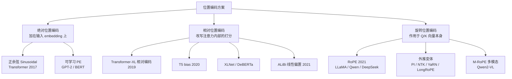

> **系列导航** ｜ 第 00 篇 / 共 08 篇
>
> [01 正余弦与可学习位置编码 →](/2026/08/29/posem-01-sinusoidal-learned/)

> **TL;DR**
>
> * **核心问题**：self-attention 是一个"集合算子"——把输入 token 顺序打乱，输出只是相应换位，模型对顺序本身**一无所知**。"我吃苹果"和"苹果吃我"在无位置编码的 Transformer 看来是同一个句子。位置编码就是把这个被丢弃的信息重新注入模型的机制。
> * **分类学**：按"位置信息以什么形式参与注意力计算"，全部方案可以分三大类——**绝对位置编码**（Sinusoidal、GPT/BERT 的可学习 PE）加在输入上；**相对位置编码**（Transformer-XL、T5 bias）改在注意力内部；**旋转位置编码**（RoPE 及其全家桶）作用于 Q/K，用绝对形式实现相对信息。ALiBi 归入"相对偏置"一支。
> * **本系列主线**：位置编码方案的自然选择史，本质是**外推性（extrapolation）**问题的求解史——训练时 4k 上下文，推理时怎么撑到 128k？RoPE 一统天下之后，PI → NTK-aware → YaRN → LongRoPE 这条改进链，以及多模态时代的 M-RoPE，都是围绕这一主线的变奏。
> * **参考视角**：本系列大量参考了科学空间（苏剑林）[《Transformer升级之路》系列](https://spaces.ac.cn/archives/8265)的推导视角——尤其是"绝对形式实现相对位置"这一统一框架，它几乎是理解 RoPE 的最短路径。

---

## 1. 为什么需要位置编码：attention 是集合算子

### 1.1 从 attention 的数学形式说起

回顾缩放点积注意力的核心计算：

$$
\text{Attention}(Q, K, V) = \text{softmax}\!\left(\frac{QK^\top}{\sqrt{d_k}}\right)V
$$

对第 $$m$$ 个位置的输出：

$$
\boldsymbol{o}_m = \sum_{n=1}^{L} \alpha_{mn} \boldsymbol{v}_n, \qquad
\alpha_{mn} = \frac{\exp(\boldsymbol{q}_m \cdot \boldsymbol{k}_n / \sqrt{d_k})}{\sum_{n'} \exp(\boldsymbol{q}_m \cdot \boldsymbol{k}_{n'} / \sqrt{d_k})}
$$

注意这个求和结构：$$\boldsymbol{o}_m$$ 是所有 $$\boldsymbol{v}_n$$ 的加权**求和**。求和是交换的——$$\sum_n \alpha_{mn}\boldsymbol{v}_n$$ 不关心 $$n$$ 的排列顺序。换句话说，如果我们把输入序列做一个置换 $$\pi$$，把第 $$n$$ 个 token 换到位置 $$\pi(n)$$，那么输出也只是被同样的置换重排，模型内部的每个计算没有任何变化（不考虑 causal mask 时；causal mask 只引入"前/后"的粗糙顺序信息，且这与语义顺序是两回事）。

这是一个**排列不变性（permutation invariance）**：无位置编码的 self-attention 是作用在 token **集合**而非**序列**上的算子。而自然语言显然不是集合——"猫追狗"和"狗追猫"的 token 集合相同、语义相反。

### 1.2 需要注入的是什么样的信息？

更深一层的问题是：模型需要的究竟是什么？

- **绝对位置**：token $$x_m$$ 在句中的下标 $$m$$。用于"句首的'的'很可疑"这类判断；
- **相对位置**：$$x_m$$ 与 $$x_n$$ 的距离 $$m-n$$。用于局部搭配、指代消解（"它"指代三句话之前的实体）；
- **结构信息**：句法树深度、图像的二维坐标 $$(h,w)$$、视频的时间步——当 Transformer 走出 NLP，"位置"泛化为任意结构化坐标。

一个好的位置编码方案，理想上应该同时满足：**表达相对位置**（语言学证据表明相对距离比绝对下标更重要）、**因果/平移等变性**（把整句平移不应改变注意力分布）、**可以泛化到训练时没见过的长度**（外推性）。原始 Transformer 论文的作者们当年并没有想得这么清楚——这条需求清单是被后续十年的方案迭代逐步"逼"出来的。

## 2. 分类学：一张地图

按位置信息注入的位置和形式，主流方案分三大类：

三类方案的本质区别用一句话概括：

| 类别 | 注入位置 | 形式 | 代表 | 位置信息 |
|---|---|---|---|---|
| 绝对 PE | 输入层 $$x_m + p_m$$ | 加性 | Sinusoidal、Learned | 绝对下标 $$m$$（隐式含相对） |
| 相对 PE | 注意力 logits | 加性 bias | T5、Transformer-XL、ALiBi | 显式 $$m-n$$ |
| 旋转 PE | 每层 Q/K | 乘性旋转 | RoPE 及变体 | 绝对形式实现相对 $$m-n$$ |

三个值得提前埋下的伏笔：

1. **绝对 PE 并非不含相对信息**——Sinusoidal 编码的内积 $$\boldsymbol{p}_m\cdot\boldsymbol{p}_n$$ 是 $$m-n$$ 的函数，这是它相对可学习 PE 的关键优势（详见 [01 篇](/2026/08/29/posem-01-sinusoidal-learned/)）；
2. **相对 PE 的早期方案都改了注意力公式**，与 KV cache、线性注意力等后续工程优化摩擦不断，这是它们最终让位于 RoPE 的工程原因；
3. **RoPE 的巧妙之处在于不改公式**：只对 Q/K 做一个位置相关的线性变换（旋转），让 $$\boldsymbol{q}_m\cdot\boldsymbol{k}_n$$ 自动只依赖 $$m-n$$——绝对形式，相对内容（详见 [03 篇](/2026/08/29/posem-03-rope/)）。

## 3. 外推性：贯穿本系列的主线

**外推（extrapolation）**：训练长度 $$L_{\text{train}}$$，推理长度 $$L_{\text{test}} > L_{\text{train}}$$ 时，模型能否保持性能？这个问题在长上下文（128k、1M token）成为军备竞赛的今天，是位置编码研究的核心战场。

各方案的外推性画像提前给出：

| 方案 | 外推性 | 原因概述 |
|---|---|---|
| Sinusoidal | 理论无约束，实测一般 | 训练分布外的位置组合内积行为未见过 |
| 可学习 PE | **零** | $$L_{\text{train}}$$ 之外的 embedding 根本不存在 |
| T5 bias | 零（bucket 截断） | 相对距离超过 bucket 范围无参数 |
| ALiBi | **好**（有限距离内） | 偏置 $$-s\vertm-n\vert$$ 对任意 $$m-n$$ 都有定义 |
| RoPE（原版） | 差 | 训练外的高频旋转组合爆炸（[04 篇](/2026/08/29/posem-04-extrapolation-pi-ntk/)分析"罪魁频率"） |
| RoPE + YaRN/LongRoPE | 好 + 少量微调 | 重整频率谱 + 注意力温度 |

于是本系列的结构就是这条主线的展开：[01](/2026/08/29/posem-01-sinusoidal-learned/)–[02](/2026/08/29/posem-02-relative-t5/) 篇是"史前史"（绝对与相对的经典方案），[03](/2026/08/29/posem-03-rope/) 篇是主角登场，[04](/2026/08/29/posem-04-extrapolation-pi-ntk/)–[05](/2026/08/29/posem-05-yarn-longrope/) 篇是外推攻坚战，[06](/2026/08/29/posem-06-alibi/) 篇讲 RoPE 之外另一条好外推的路线 ALiBi，[07](/2026/08/29/posem-07-mrope-multimodal/) 篇把视野扩展到多模态。

## 4. 一个统一的观察框架

苏剑林在科学空间的系列里反复使用一个分析框架，本系列沿用：**任何位置编码都可以写成对 Q/K/V 的位置相关变换**

$$
\boldsymbol{q}_m \to g_q(\boldsymbol{q}_m, m),\quad
\boldsymbol{k}_n \to g_k(\boldsymbol{k}_n, n)
$$

然后问：注意力打分 $$g_q(\boldsymbol{q}_m, m)\cdot g_k(\boldsymbol{k}_n, n)$$ 里，位置 $$m, n$$ 以什么方式出现？

- Sinusoidal：$$m, n$$ 通过 $$(\boldsymbol{x}_m+\boldsymbol{p}_m)$$ 里的加性项纠缠出现，且经过第一层之后的 MLP 非线性，位置信息与内容无法分离——"位置泄露到内容里"；
- RoPE：$$m, n$$ **只以 $$m-n$$ 出现**，且变换是正交的（纯旋转），位置与内容完全解耦；
- ALiBi：$$m, n$$ 只以 $$m-n$$ 出现，但形式是加性偏置而非乘性调制。

"位置与内容解耦的程度"和"以相对形式出现的纯粹程度"，是评价一切位置编码的两个标尺。带着这两把尺子往下读，整个领域的历史会显得非常连贯。

## 5. 系列安排与阅读建议

- 想直接上手的工程师：读 [03](/2026/08/29/posem-03-rope/) → [05 YaRN](/2026/08/29/posem-05-yarn-longrope/) 即可覆盖 90% 的生产实践；
- 想理解设计思想的：按顺序通读，02 → 03 的过渡（从"改公式"到"不改公式"）是全系列最重要的思想跳跃；
- 做多模态的：[07](/2026/08/29/posem-07-mrope-multimodal/) 篇独立可读，但建议先过 03 篇的 RoPE 推导。

**Lab 练习**：取任意一个小型 causal LM（如 GPT-2），删掉其位置 embedding 后在两个乱序句子上跑前向，验证输出只发生相应置换——亲手确认"attention 是集合算子"这句话。

## 参考文献

1. Vaswani et al., *Attention Is All You Need*, 2017. [arXiv:1706.03762](https://arxiv.org/abs/1706.03762)
2. 苏剑林，《Transformer升级之路：4、RoPE是一种很好的位置编码》，科学空间. [spaces.ac.cn/archives/8265](https://spaces.ac.cn/archives/8265)
3. Su et al., *RoFormer: Enhanced Transformer with Rotary Position Embedding*, 2021. [arXiv:2104.09864](https://arxiv.org/abs/2104.09864)
