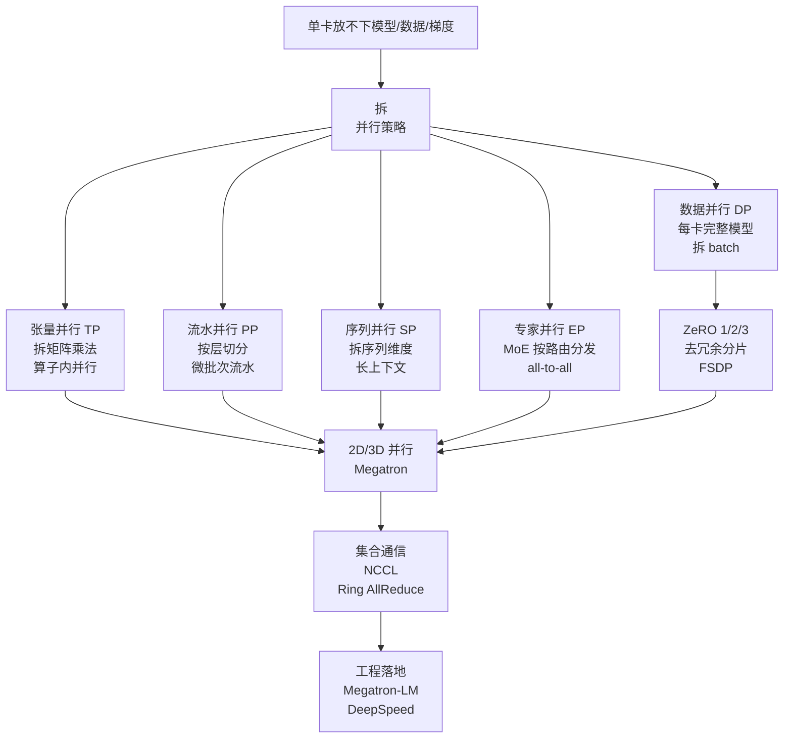

> **分布式训练系列 · 第 00 篇 / 共 08 篇**
>
> 本系列面向**已经把推理搞到能上生产、但训练只在单卡/单机跑过**的工程师：帮你把"分布式训练"从黑话（DDP、FSDP、TP、PP、SP、EP、ZeRO……）变成一张可以在白板上画出来的地图，并把每一条并行策略的**通信开销公式**推导到位。
>
> - 01 数据并行 → 02 显存优化 ZeRO/FSDP → 03 张量并行 → 04 流水并行 → 05 序列并行 → 06 专家并行 → 07 集合通信地基 → 08 组合实战（Megatron/DeepSpeed）

**TL;DR**
> * **问题的本质只有一个**：单卡装不下 → 必须拆；拆了 → 就得通信；通信 → 就有开销。所有并行策略都是"**拆的粒度** × **通信的模式**"这个二维空间里的一个点。看懂这张图，分布式训练就只剩工程细节。
> * **四个基本并行**：数据并行（DP，每卡一份完整模型、拆数据）、张量并行（TP，每卡一份模型分片、拆算子内部的矩阵）、流水并行（PP，每卡一层或多层、拆层）、序列并行（SP，拆序列维度）。**MoE 模型的专家并行（EP）**是第五种，本质是"按路由把 token 送到对应专家所在的卡"。
> * **显存优化的主线索是 ZeRO**：把 DP 的冗余彻底去掉——参数/梯度/优化器状态各按 rank 分片，代价是通信量从"每步一次 all-reduce"变成"每步三次通信"（分片 reduce-scatter + 参数 all-gather + 梯度 all-gather）。FSDP 是 PyTorch 对 ZeRO-3 的原生实现。
> * **通信开销才是分布式训练的第一性约束**：$T_{\text{step}}$ = 计算时间 + 通信时间。并行度大到一定程度后，通信时间反超计算时间，扩展效率 $\eta = \frac{T_1}{N \cdot T_N}$ 开始掉。**本篇给出全部公式，后续每篇推一个具体策略**。
> * **给读者的锚点**：如果只记住一句话——**"DP 拆数据、TP 拆矩阵、PP 拆层、SP 拆序列、EP 拆专家，ZeRO 管显存，NCCL 管通信"**。

---

## 1. 先回答"为什么必须分布式"

三个独立的原因，任何一个都足以逼你上分布式：

**① 显存放不下（capacity wall）**。一个 $L$ 层的 Transformer，参数量约 $12Lh^2$（$h$ 为 hidden size）。训练一个 70B 模型，单纯 FP16 参数就要 **140 GB**；加上梯度和 Adam 优化器状态（每参数 16 字节 FP32 m/fp 各 8 字节），**总显存需求 ≈ 20 倍参数量 ≈ 1.4 TB**。单张 H100（80 GB）装不下，必须拆。

**② 单卡算力喂不饱训练（throughput wall）**。SOTA 模型在数万亿 token 上训练，单卡即使是 H100 也需要数百年。集群的算力拼起来，才能把训练压缩到数月甚至数周——**前提是并行效率不崩**。

**③ 数据太多传不动（bandwidth wall）**。既然必须多卡，梯度/参数就要在卡间流动。**通信带宽远比计算慢**：比如单个 70B 模型的梯度是 140 GB，在 400 Gbps（50 GB/s）的网卡上裸传要 2.8 秒——而一次 step 的计算可能只要几百毫秒。**通信开销决定一种并行策略能不能用**。

> **一句话**：显存墙决定"必须拆"，算力墙决定"拆了划算"，带宽墙决定"怎么拆才不亏"。三面墙把"分布式训练"从可选项变成必选项。

---

## 2. 显存都去哪了：20 倍参数量的分解

训练一个 Transformer 时，显存被四类数据瓜分（以 Adam 优化器、FP16 混合精度为例，$P$ = 参数量）：

| 项目 | 每参数字节数 | 70B 模型 |
|---|---|---|
| 模型权重（FP16） | 2 B | 140 GB |
| 梯度（FP16） | 2 B | 140 GB |
| Adam 一阶矩 $m$（FP32） | 4 B | 280 GB |
| Adam 二阶矩 $v$（FP32） | 4 B | 280 GB |
| **优化器状态小计** | **12 B** | **840 GB** |
| 激活值（activation） | 与 batch × 序列长度成正比，最多可与权重同级 | 数十~数百 GB |

**总显存 ≈ 2+2+4+4 = 12 B/参数（不含激活）** —— 这就是"20 倍参数量"的来源。注意：**优化器状态占大头（12/16 = 75%）**，这也是为什么 ZeRO-1（只分片优化器状态）就能省下 3/4 显存的根本原因。

> 本系列 02 篇将沿 ZeRO-1 → 2 → 3 的路径，把"省显存=啥时候通信、通信多少"全部推导一遍。

---

## 3. 并行的坐标系：拆的粒度 × 通信的模式

所有并行策略都可以放进这个格子里。先给一张"策略 → 拆什么 → 通信什么 → 通信量"速查表，后续每篇填坑：

| 策略 | 拆的粒度 | 每卡数据 | 通信模式 | 每 step 通信量（近似） |
|---|---|---|---|---|
| 数据并行 DP | batch 维度 | 完整模型副本 | All-Reduce（梯度） | $2\Phi$（$\Phi$=参数量） |
| ZeRO-1/2 | 优化器状态/梯度 | 模型完整、状态分片 | Reduce-Scatter + All-Gather | $(16\Phi)/N + 2\Phi$ |
| ZeRO-3 / FSDP | 参数+梯度+状态 | 全部分片 | 三阶段通信 | $\approx 16\Phi/N \cdot 3$ |
| 张量并行 TP | 矩阵的列/行 | 模型算子级分片 | All-Reduce（每算子 2 次） | 与层内吞吐相关 |
| 流水并行 PP | 层 | 各卡一层/几层 | 点对点激活转发 | $\propto$ 层间激活 |
| 序列并行 SP | 序列维度 | 算子沿序列切 | 部分 All-Reduce | 与 TP 配合 |
| 专家并行 EP | 专家（MoE） | 每卡一组专家 | All-to-All | $\propto$ token 转发量 |

**读法**：DP 通信量 $2\Phi$ 与卡数无关（每步都要把完整梯度全规约一遍）；ZeRO 把它变成 $O(\Phi/N)$ 但多了两轮通信。**TP 通信发生在每个算子内部**（因此要求 NVLink 级别的卡间带宽，跨机基本不可用）；PP/EP 的通信量远小于 TP，但引入气泡（bubble）或负载不均。

---

## 4. 性能的第一性原理：扩展效率与通信-计算比

设 $T_1$ 为单卡全局 batch 顺序训练一个 step 的时间，$N$ 卡训练时：

$$T_N = \frac{T_{\text{compute}}}{N} + T_{\text{comm}}(N)$$

扩展效率（scaling efficiency）：

$$\eta = \frac{T_1}{N \cdot T_N} = \frac{1}{1 + \frac{T_{\text{comm}}(N)}{T_{\text{compute}}/N}}$$

定义**通信-计算比** $r = \frac{T_{\text{comm}}(N)}{T_{\text{compute}}/N}$，则 $\eta = 1/(1+r)$。**这就是分布式训练的总纲公式**：任何策略优化的都是 $r$——要么压低 $T_{\text{comm}}$（更好的通信实现、通信计算重叠），要么压低需要通信的频率（更大的本地 batch、梯度累积）。

Amdahl 定律的分布式版本：即使通信只占一个 step 的 1%，扩展到 256 卡时 $\eta \approx \frac{1}{1 + 0.01 \times 256} \approx 28\%$。**所以"小模型配大集群"必然浪费**；模型越大，通信占比相对越小，扩展效率才越高——这也是为什么只有大模型才"配得上"大规模分布式。

---

## 5. 系列路线图（共 8 篇）

| 篇 | 主题 | 核心交付 |
|---|---|---|
| 01 | 数据并行 DDP | 梯度 All-Reduce 推导、同步/异步语义、梯度累积 |
| 02 | ZeRO / FSDP | 优化器状态分片 → 显存曲线、三阶段通信开销 |
| 03 | 张量并行 | Megatron 列/行并行、All-Reduce 在哪、NVLink 约束 |
| 04 | 流水并行 | GPipe/PipeDream/1F1B、气泡分析、微批次 |
| 05 | 序列并行 | 长上下文训练、Ring Attention、与 TP 的配合 |
| 06 | 专家并行 | MoE 路由、All-to-All、负载均衡 |
| 07 | 集合通信地基 | Ring AllReduce 数学、NCCL、拓扑感知 |
| 08 | 组合实战 | 2D/3D 并行编排，Megatron-LM + DeepSpeed 最小可运行配置 |

> 每篇都会回答三个问题：**拆什么、通信多少、什么时候不该用**。

---

## 6. 参考文献与延伸

1. Rajbhandari et al. *ZeRO: Memory Optimizations Toward Training Trillion Parameter Models*. arXiv:1910.02054（ZeRO 系列三篇的基础）
2. Shoeybi et al. *Megatron-LM: Training Multi-Billion Parameter Language Models Using Model Parallelism*. arXiv:1909.08053（张量并行原始实现）
3. Narayanan et al. *Efficient Large-Scale Language Model Training on GPU Clusters Using Megatron-LM*. arXiv:2104.04473（3D 并行组合，1F1B）
4. Narayanan et al. *PipeDream: Generalized Pipeline Parallelism for DNN Training*. arXiv:1806.03377（流水并行与气泡）
5. Li et al. *PyTorch Distributed: Experiences on Accelerating Data Parallel Training*. arXiv:2006.15704（DDP 设计）
6. Liu et al. *Ring Attention with Blockwise Transformers for Near-Infinite Context*. arXiv:2310.06201（序列并行方向）
7. NVIDIA. *NCCL 文档*: https://docs.nvidia.com/deeplearning/nccl/user-guide/docs/index.html
8. PyTorch. *FSDP 文档*: https://pytorch.org/docs/stable/fully_sharded_data_parallel.html

---

*下一篇：[01 数据并行 DDP](/2026/08/31/dist-train-01-data-parallel/) —— 从单卡到多卡的第一步，梯度 All-Reduce 的完整推导。*