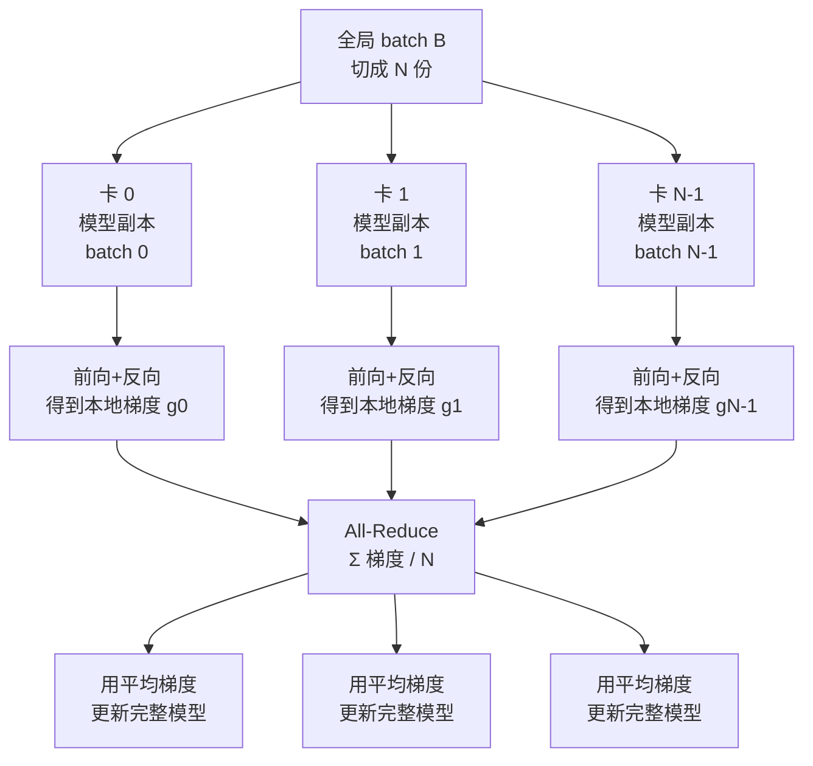

> **分布式训练系列 · 第 01 篇 / 共 08 篇**
>
> [00 全景总览](/2026/08/31/dist-train-00-overview/) ← **本篇** → [02 显存优化 ZeRO/FSDP](/2026/08/31/dist-train-02-zero-fsdp/)

**TL;DR**
> * 数据并行（DP）是所有策略里**唯一不需要动模型结构**的并行：每卡放**完整模型副本**，把全局 batch 切成 $N$ 份喂给 $N$ 张卡，每步结束做一次**梯度 All-Reduce**。正确性由"梯度均值 + 同步 SGD"保证，与单卡训练在数学上**完全等价**（无 dtype 误差时）。
> * 通信量是**每步 $2\Phi$ 字节**（$\Phi$ = 参数量），**与卡数 $N$ 无关**——这是 DP 的天然瓶颈：模型翻倍，梯度通信就翻倍；卡再多，也躲不掉这把"全量梯度必须全场广播"的锁。
> * **All-Reduce 的两种实现**：朴素实现是收集-归约-广播（$2(N-1)$ 次传输）；现代实现是 **Ring All-Reduce**——把 $N$ 卡排成环，梯度切 $N$ 块流水转圈，通信量从 $O(N)$ 降到 $O(1)$ 的**理论下限** $\frac{2(N-1)}{N}\Phi$。
> * **工程现实的三个坑**：①梯度必须**先除 $N$**（等价的另一种做法是 All-Reduce 后除 $N$，语义上都是"平均梯度"）；②**梯度累积**与 DP 的交互——accumulation step 只对本地梯度求和，All-Reduce 只在微批边界做；③通信与计算的重叠（gradient bucketing + 反向传播边算边传）是 DDP 比其他实现快的核心秘密。
> * **什么时候不该用 DP**：模型大到单卡放不下（→ 见 02 ZeRO）、或卡间带宽是跨机以太网（DP 的 $2\Phi$ 通信会压垮带宽）。



---

## 1. 数据并行的语义：数学上等价于单卡大 batch

设全局 batch $\mathcal{B} = \{b_1, \dots, b_B\}$，参数量 $\Phi$。单卡训练一轮的梯度是：

$$g = \frac{1}{B}\sum_{j=1}^{B} \nabla_\theta \mathcal{L}(x_{b_j}, \theta)$$

数据并行把 $\mathcal{B}$ 均匀切成 $N$ 份，第 $i$ 张卡持有 $\mathcal{B}_i$（$|\mathcal{B}_i| = B/N$），算本地梯度：

$$g_i = \frac{1}{B/N}\sum_{j \in \mathcal{B}_i} \nabla_\theta \mathcal{L}(x_{b_j}, \theta)$$

**关键代数**：本地梯度是"局部均值"，而全局梯度是"全局均值"。它们的换算关系是：

$$g = \frac{1}{N} \sum_{i=1}^{N} g_i$$

证明：$\frac{1}{N}\sum_i g_i = \frac{1}{N}\sum_i \frac{N}{B}\sum_{j\in\mathcal{B}_i} \nabla = \frac{1}{B}\sum_{j=1}^{B} \nabla = g$。**所以只要把 $N$ 张卡的梯度加起来除以 $N$，就得到与单卡完全一致的梯度**。这正是 All-Reduce（求和 ÷ N）做的事。

> **注意**：每个 worker 的本地 batch 大小是 $B/N$，因此本地梯度计算用的是 $\frac{1}{B/N}$ 归一。如果写成 $g_i = \frac{1}{B}\sum_{\mathcal{B}_i}$（除以全局 B），则换算公式变成 $g = \sum_i g_i$。**归一化方式决定了是"求和"还是"求平均"——这是 DDP 实现里最容易出错的 1 行。**

PyTorch DDP 的做法是：**不归一化本地梯度**（每个 worker 算的是局部和 $\tilde g_i = \sum_{\mathcal{B}_i}\nabla$），All-Reduce 用 SUM，最后再除以 $N$。因此 `loss` 在 DDP 下应该**除以全局 batch 大小**（PyTorch 官方推荐 `loss = loss / world_size` 在每卡上做），避免各卡算出的 `loss` 求和后多了一个 $1/N$。

---

## 2. 通信量：$2\Phi$ 与卡数无关，这是 DP 的天花板

一步训练需要把 $N$ 份梯度规约为一份。梯度总量是 $\Phi$ 个浮点（与 batch、序列长度无关，只与模型有关）。All-Reduce 本质上需要**把每个 worker 的梯度"送出去、再收回来"**，因此：

- **上界**（朴素收集-归约-广播）：每卡收 $N-1$ 份、发 $N-1$ 份，共 $2(N-1)\Phi$ 字节——**随 $N$ 线性增长**。
- **下界**（Ring All-Reduce，见 07 篇）：每卡恰好发送 $\frac{N-1}{N}\Phi$、接收 $\frac{N-1}{N}\Phi$，总通信量 $\frac{2(N-1)}{N}\Phi$——**随 $N$ 增长趋近于 $2\Phi$**。

所以在带宽受限的集群里，DP 扩展到 $N$ 卡的**每步通信时间 ≈ $2\Phi / B_{\text{net}}$**，与 $N$ 几乎无关（Ring 算法）。对比计算时间 $\approx T_{\text{compute}}/N$，扩展效率（00 篇公式）为：

$$\eta = \frac{1}{1 + \frac{2\Phi / B_{\text{net}}}{T_{\text{compute}}/N}} = \frac{1}{1 + \frac{2\Phi N}{B_{\text{net}} T_{\text{compute}}}}$$

**这是 DP 全景最重要的一个公式**：$\eta$ 随 $N$ 线性衰减（分母里的 $N$）。也就是说——**DP 的扩展效率总会被通信吃掉，且模型越小吃得更快**。

数值例子：$\Phi=7\text{B}$（7B 模型，梯度 14 GB FP16），$T_{\text{compute}} = 1\text{s}$（H100 上 7B 的一个 step），机内 NVLink 带宽 $B_{\text{net}}=900\text{ GB/s}$：

| N | 通信时间 $2\Phi/B$ | $T_{compute}/N$ | $\eta$ |
|---|---|---|---|
| 8 | 14GB/900GB/s ≈ 16 ms | 125 ms | ≈ 89% |
| 32 | 16 ms | 31 ms | ≈ 66% |
| 64 | 16 ms | 16 ms | ≈ 50% |
| 128 | 16 ms | 8 ms | ≈ 33% |

换成跨机 400 Gbps 以太网（$B_{\text{net}}=50\text{ GB/s}$），8 卡时通信就要 280 ms——$\eta \approx 31\%$。**这就是为什么"DDP 只适合单机多卡"的直觉来源。**（这也是 ZeRO 与 TP 出现的直接动机：见 02、03 篇。）

---

## 3. All-Reduce 快速入门：它到底把什么抽到什么

不细讲算法（07 篇完整推导 Ring All-Reduce 与拓扑），这里只建立直觉：

**All-Reduce（SUM）** = 每个 rank 提供一份向量，结束后每个 rank 得到所有向量的和。可以用三句话概括实现：

1. **Reduce-Scatter**：把 $\Phi$ 个梯度切成 $N$ 块，沿环把每块"边收边加"转一圈——最后每个 rank 持有 1 块**全量部分和**。
2. **All-Gather**：每个 rank 把自己持有的部分和广播给所有人。
3. 拼起来，人人都有一份完整总和。÷N 即平均梯度。

数学上，若把梯度向量记为 $g^{(i)} \in \mathbb{R}^{\Phi}$，切成 $N$ 块 $g^{(i)} = (g^{(i)}_1, \dots, g^{(i)}_N)$，则：

$$\text{Reduce-Scatter: } h^{(i)}_i = \sum_{j=0}^{N-1} g^{(j)}_i \qquad \text{（第 } i \text{ 卡持有第 } i \text{ 块总和）}$$

$$\text{All-Gather: } \forall i, \ \bar{g} = \frac{1}{N}(h^{(0)}_0, \dots, h^{(N-1)}_{N-1})^\top = \frac{1}{N}\sum_{j} g^{(j)}$$

---

## 4. 工程实现：为什么 DDP 比"朴素多卡"快

PyTorch DDP 的核心不是"每步结束做一次同步"那么简答，而是三个设计：

**① Gradient Bucketing（梯度分桶）**。把梯度过小的张量合并成 ~25MB 的桶，减少 All-Reduce 调用次数（通信启动开销 2–10μs/次）。

**② 通信与反向传播重叠（overlap）**。DDP 把反向传播看作"按层顺序的梯度生成"，**每算完一个桶的梯度就立即对该桶发起 All-Reduce**，而不是等全部反向结束。训练 step 的真实耗时从 $T_{\text{fwd}} + T_{\text{bwd}} + T_{\text{comm}}$ 变成 $\approx T_{\text{fwd}} + \max(T_{\text{bwd}}, T_{\text{comm}})$。

**③ 静态图假设与延迟启动的通信后端**。DDP 在第一次迭代时记录模型参数与梯度结构，后续迭代零开销构建通信计划；NCCL 作为后端时由驱动管理 ring/树拓扑。

**梯度累积（gradient accumulation）的含义**：accumulation step 之间**不触发 All-Reduce**——本地梯度持续累加，只在 $\text{acc\_steps} \times$ 之后、真正更新权重时规约一次。注意这时所有 worker 的 batch 都扩大为 $\text{acc\_steps} \times B/N$，**全局有效 batch $= \text{acc\_steps} \times B$**，学习率需按乘法规则调整。

```python
# 最小 DDP 骨架（torch.distributed）
import torch, torch.distributed as dist
from torch.nn.parallel import DistributedDataParallel as DDP

dist.init_process_group("nccl")
rank, world = dist.get_rank(), dist.get_world_size()

model = DDP(MyModel().to(rank))
opt = torch.optim.AdamW(model.parameters(), lr=LR * world)  # 线性缩放规则

for x, y in loader:  # loader 按 rank 切分
    loss = model(x, y) / world            # 关键：除以 world_size
    loss.backward()                        # 梯度已经过 DDP hook 完成 All-Reduce
    opt.step(); opt.zero_grad()
```

---

## 5. 完整的时间线（无重叠 vs 有重叠）

| 阶段 | 朴素实现耗时 | DDP 实现耗时 |
|---|---|---|
| 前向 | $T_f$ | $T_f$ |
| 反向 | $T_b$ | $T_b$（但每桶边算边传） |
| 梯度规约 | $T_c$（在反向之后全部发生） | 与 $T_b$ 重叠，额外 $\approx 0$ |
| 单步总耗时 | $T_f + T_b + T_c$ | $T_f + \max(T_b, T_c)$ |

**结论**：当 $T_c < T_b$（模型够大、带宽够好），DDP 的重叠让通信 "免费"。当 $T_c \gg T_b$（模型小、跨机、带宽差），通信暴露成主要瓶颈——这时 DDP 的收益迅速归零，必须切换到 02 篇的 ZeRO-1/2。

---

## 6. 什么时候别用 DDP（决策清单）

1. **单卡放不下模型** → DDP 无能为力（每卡都要完整副本）→ 02 ZeRO / 03 TP。
2. **跨机且带宽 < 100 GB/s 级** → 每步 $2\Phi$ 通信压垮扩展 → 优先 ZeRO-2/3（通信量 $\sim \Phi/N$）。
3. **batch 已经大到单卡放不下激活** → 无法简单切数据 → 需要序列并行（05）或减小 batch（梯度累积）。
4. **模型小到通信时间 $\ge$ 计算时间** → 分布式本身不划算，回单卡。
5. **需要 strict determinism（逐位复现）** → DDP 的求和顺序因拓扑而异（Ring 顺序 → 不同卡上部分和顺序不同），必要时用 `--deterministic` 或改为树 allreduce。

---

## 7. 参考文献与延伸

1. Li et al. *PyTorch Distributed: Experiences on Accelerating Data Parallel Training*. arXiv:2006.15704（DDP 设计背后的动机、overlap 的量化分析）
2. Sergeev & Del Balso. *Horovod: fast and easy distributed deep learning in TensorFlow*. arXiv:1802.05799（Ring All-Reduce 在框架层的实战：梯度压缩、分层实现）
3. NVIDIA. *NCCL 用户指南（AllReduce 拓扑与性能）*: https://docs.nvidia.com/deeplearning/nccl/user-guide/docs/usage/communicators.html
4. PyTorch. *DDP 文档与设计笔记*: https://pytorch.org/docs/stable/notes/ddp.html
5. Rajbhandari et al. *ZeRO*: arXiv:1910.02054（02 篇将证明 DP 的冗余，本系列迈出 DP 的第一步）

---

*下一篇：[02 显存优化 ZeRO/FSDP](/2026/08/31/dist-train-02-zero-fsdp/) —— 为什么把优化器状态分片就能省 3/4 显存，通信又变成什么样。*