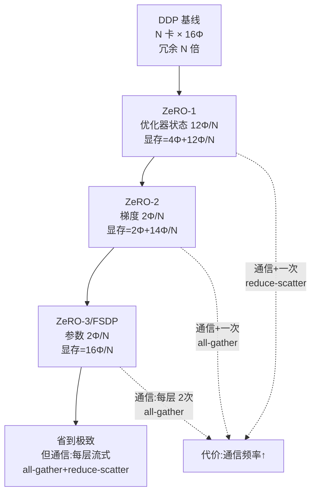

> **分布式训练系列 · 第 02 篇 / 共 08 篇**
>
> [01 数据并行 DDP](/2026/08/31/dist-train-01-data-parallel/) ← **本篇** → [03 张量并行](/2026/08/31/dist-train-03-tensor-parallel/)

**TL;DR**
> * 01 篇留下的问题：DDP 每卡放完整模型 + 优化器状态，**显存冗余因子 = N**（N 张卡存了 N 份一样的优化器状态）。ZeRO 的核心洞察是——**冗余不是必要，只是"避免多一轮通信"的偷懒**。把优化器状态（12B/参数）按 rank 切分，每卡只留 $1/N$，显存从 $16\Phi$ 降到 $4\Phi + \frac{12\Phi}{N}$。
> * **ZeRO 三个档位，每一档换一份显存，代价是多一轮通信**：
>   - **ZeRO-1**：只分片优化器状态 → 显存 $\approx 4\Phi + 12\Phi/N$，通信多一次 reduce-scatter（优化器状态更新前）。
>   - **ZeRO-2**：分片优化器状态 + 梯度 → 显存 $\approx 2\Phi + 14\Phi/N$，通信：梯度 reduce-scatter + 参数 all-gather。
>   - **ZeRO-3 / FSDP**：连参数也分片 → 显存 $\approx 16\Phi/N$，通信：每层前向/反向都要 all-gather 该层参数——**通信量从"每步一次 $2\Phi$"变成"每步约 $3\times$ 全量梯度+参数的流式搬运"**。
> * **对性能和扩展的数学影响**：ZeRO-2 的通信总量 $= \frac{(N-1)}{N} \cdot 2\Phi$（reduce-scatter + all-gather 各一遍），与 DDP 的 $2\Phi$ 相比在 $N$ 大时也接近，但**峰值显存被压平、batch 可以开得更大** → 线性扩展比 DDP 更持久。ZeRO-3 的每层流式通信让**单机内带宽够用但跨机必崩**——通常配合 TP（卡间 NVLink）使用。
> * **FSDP 是什么**：PyTorch 官方的 ZeRO-3 实现（`torch.distributed.fsdp.FullyShardedDataParallel`），核心差异是**把"分片"当作一等 api（sharding_strategy）、显式区分 state_dict 的 gather**。它让"代码不动只换封装"成为可能——你依然写普通 nn.Module，只是套 FSDP。



---

## 1. ZeRO 洞察：DDP 的显存冗余从哪来，怎么去掉

01 篇里提到 DDP 每卡持有**完整模型 + 完整优化器状态**。设每参数内存 $m = 16$B（FP16 权重 2 + 梯度 2 + Adam 状态 12），则：

- DDP：$N$ 卡总显存 $= N \cdot 16\Phi$，但**有效利用只有 $16\Phi$**——冗余因子 $N$。
- 冗余的每一份都在做"其他卡也在做同样的事"：**每张卡的 Adam 状态完全一致**（梯度一样 → 更新一样），纯属浪费。

ZeRO 的彻底方案：把"必须持有"的数据按 rank 分片。设 $N$ 卡，每卡持有 $1/N$——三类数据分别分片得到三个档次：

| ZeRO 档位 | 分片对象 | 每卡内存（忽略激活） | 相比 DDP 节省 |
|---|---|---|---|
| 1 | Adam 状态（12B/参数） | $4\Phi + \frac{12\Phi}{N}$ | 最多 75%（$N$ 大时） |
| 2 | Adam 状态 + 梯度（+2B） | $2\Phi + \frac{14\Phi}{N}$ | 最多 87.5% |
| 3 | 全部（+2B 参数） | $\frac{16\Phi}{N}$ | 最多 $1-\frac{1}{N}$ |

数学上：ZeRO-3 的显存 = $16\Phi/N$，意味着**70B 模型只需 $\sim 1.4T/128 \approx 11$ GB/卡（128 卡）**——这就是"用 128×80GB 卡训 70B"的来历。

> 注意：激活值没有被 ZeRO 管（它是 batch × seq 的函数，不随模型重复）。激活真正的问题交给梯度检查点（activation checkpointing）或序列并行（05 篇）处理。ZeRO 研究的是**权重/梯度/优化器**这类"参数级"内存。

---

## 2. 各档位的通信代价推导

### ZeRO-1：一次 reduce-scatter + 与 DDP 相同的 all-reduce

- 反向传播算出完整梯度 $g \in \mathbb{R}^{\Phi}$（每卡都有）。
- **Reduce-Scatter**：把 $g$ 切成 $N$ 块，每卡收到对应块的**全局和**（用于更新自己那 $1/N$ 份优化器状态）。通信量 $\frac{N-1}{N}\Phi \times 2$（收+发）。
- 更新只在每卡持有的 $1/N$ 状态上进行。
- **与 DDP 对比**：DDP 是"全量 all-reduce 后每卡各自更新完整状态"；ZeRO-1 是"只归约自己那块的梯度，只更新自己那份状态"。**数学上一模一样**（每份状态由对应的梯度分块更新，而梯度分块的和是全局的），但**通信量减半**：DDP 是 $2\Phi$，ZeRO-1 是 $\approx 2\Phi \cdot \frac{N-1}{N}$。

### ZeRO-2：梯度也分片，不需要全量梯度

- 反向后梯度 reduce-scatter（同上），每卡只剩 $\Phi/N$ 的梯度块。
- 更新对应优化器状态。
- **额外通信**：每卡在反向时需要"别人算出的梯度"才能拿到自己那块的全量和——这就是 reduce-scatter 本身。因此 ZeRO-2 的通信总量与 ZeRO-1 相同，但**梯度不再整份驻留**，峰值显存更低。
- 注意 ZeRO-2 本身不额外 all-gather 参数（参数仍每卡完整持有）。

### ZeRO-3 / FSDP：参数也流式

参数分片后，**每个算子计算前需要完整参数**——于是每次前向/反向层计算前都要 `all-gather` 该层参数，计算后丢弃（或者梯度算完再 `reduce-scatter`）。设 Transformer 的层数 $L$、每层参数量 $\Phi/L$：

- **前向**：第 $\ell$ 层，all-gather $\Phi/L$ → 计算 → 释放。通信 $\approx L \cdot \frac{N-1}{N}\cdot \frac{\Phi}{L} = \frac{N-1}{N}\Phi$（每次 gather 一遍）。
- **反向**：同理，且梯度还要 reduce-scatter 回分片。
- **总计**：每 step 通信 $\approx 3 \times \frac{N-1}{N}\Phi$（前向 gather + 反向 gather + 反向 scatter），即**约 $3\Phi$**——是 DDP（$2\Phi$）的 1.5 倍。

**直觉**：ZeRO-3 用"多 1.5 倍的通信"换来"显存减到 1/N"。N 越大越值得，但**通信也越大**——所以 ZeRO-3 的扩展曲线是"先升后降"：N 小的时候显存省得有限、通信却按 3Φ 起步；N 大的时候通信压垮扩展。工程上这决定 ZeRO-3 要和 TP 混用（见 08 篇），把高频通信留在 NVLink 内。

---

## 3. FSDP：PyTorch 的 ZeRO-3

**FSDP = FullyShardedDataParallel**，是 PyTorch 官方对 ZeRO-3 的完整实现。设计哲学差异：

- **分片是一等 api**：`sharding_strategy=SHARD_GRAD_OP`（ZeRO-2 语义）或 `FULL_SHARD`（ZeRO-3）、`NO_SHARD`（DDP）、`HYBRID_SHARD`（节点内 ZeRO-3 + 节点间 DDP 复制）。
- **state_dict 自动 gather**：保存 checkpoint 时自动还原完整权重（`state_dict_type=FULL_STATE_DICT`）或按 rank 分片保存（节省存储）。
- **自动通信切分**：`forward_prefetch`、`backward_prefetch` 把参数 gather 提前到边界，隐藏通信；`cpu_offload` 把参数/梯度/状态放 CPU 内存。

最小配置示例（关键点：**sharding_strategy 决定档位，auto_wrap_policy 决定分片粒度**）：

```python
from torch.distributed.fsdp import FullyShardedDataParallel as FSDP
from torch.distributed.fsdp import ShardingStrategy
from torch.distributed.fsdp.wrap import transformer_auto_wrap_policy

fsdp_model = FSDP(
    model,
    sharding_strategy=ShardingStrategy.FULL_SHARD,      # ZeRO-3
    auto_wrap_policy=transformer_auto_wrap_policy(      # 按 Transformer 块分片
        transformer_layer_cls={MyTransformerBlock}
    ),
    use_orig_params=True,                                # 保留 param 语义，方便 optimizer 处理
)
```

> **FSDP 与 DeepSpeed ZeRO 的关系**：DeepSpeed 是"全能框架"（含 ZeRO-3、Offload、MoE 等），PyTorch FSDP 是"系统内建实现"。两者 API 形态不同但数学等价；FSDP 与 torch 生态集成更顺（TorchDynamo/编译/Checkpoint），DeepSpeed 提供更多进阶开关。**选型建议**：主用 FSDP，遇到 Offload 或特殊拓扑需求再上 DeepSpeed。

---

## 4. 什么时候用 ZeRO-1/2/3（决策树）

```
模型能在单卡放下吗？
├─ 能 → 显存够，5 顿真没有 → 直接用 DDP（01 篇）
└─ 不能：
   ├─ 差一点（单卡能放参数，放不下优化器状态）
   │   → ZeRO-1 或 ZeRO-2（通信几乎白拿）
   ├─ 差较多（参数那 2Φ 也放不下）
   │   → ZeRO-3 / FSDP，且优先配 TP（03 篇）把通信压进 NVLink
   └─ 差巨大（几十 T 参数的 MoE / 长上下文）
       → ZeRO-3 + TP + PP + EP 组合（08 篇）+ CPU Offload
```

**工程检查单（按顺序跑）**：
1. `torchrun --nproc_per_node=N script.py`（NCCL）+ `FULL_SHARD` → 先验证能跑通、显存降幅符合预期。
2. 把 batch 尽量开大（ZeRO 省出的显存走路出去放大 batch）→ **扩展效率主要靠大 batch 拉回来**。
3. 加 `forward_prefetch=True, backward_prefetch=BACKWARD_PRE`，看 step 时间是否下降。
4. 若跨机（低带宽）→ 立刻切 `HYBRID_SHARD` 或加 TP。

---

## 5. 参考文献与延伸

1. Rajbhandari, Samyam et al. *ZeRO: Memory Optimizations Toward Training Trillion Parameter Models*. arXiv:1910.02054
2. Rajbhandari et al. *ZeRO-Infinity: Breaking the GPU Memory Wall for Extreme Scale Deep Learning*. arXiv:2104.07857（Offload 与 NVMe 扩展）
3. Ren et al. *ZeRO++: Extremely Efficient Collective Communication for Giant Model Training*. arXiv:2306.10209（通信优化：分块/量化/分层）
4. Zhao et al. *PyTorch FSDP: Experiences on Scaling Fully Sharded Data Parallel*. arXiv:2304.11277（FSDP 与 ZeRO-3 的实现对比与性能数据）
5. PyTorch. *FSDP 官方文档*: https://pytorch.org/docs/stable/fully_sharded_data_parallel.html
6. Microsoft. *DeepSpeed ZeRO 文档*: https://www.deepspeed.ai/tutorials/zero/

---

*下一篇：[03 张量并行](/2026/08/31/dist-train-03-tensor-parallel/) —— 把矩阵乘法拆开：Megatron 的列/行并行与 All-Reduce 在内核里的位置。*