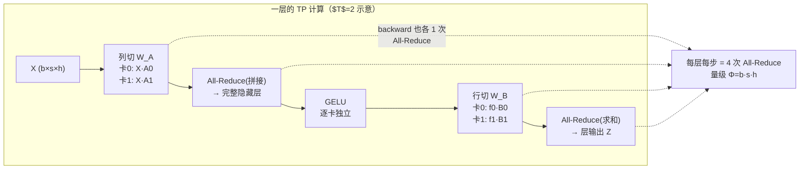
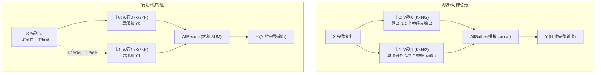
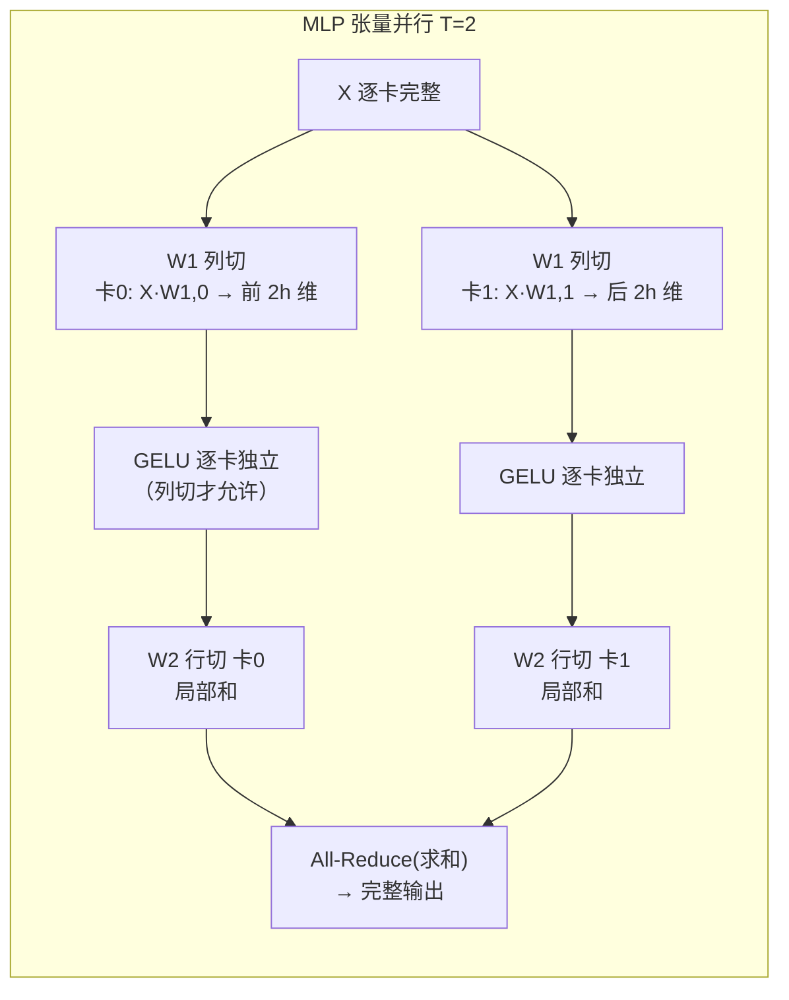
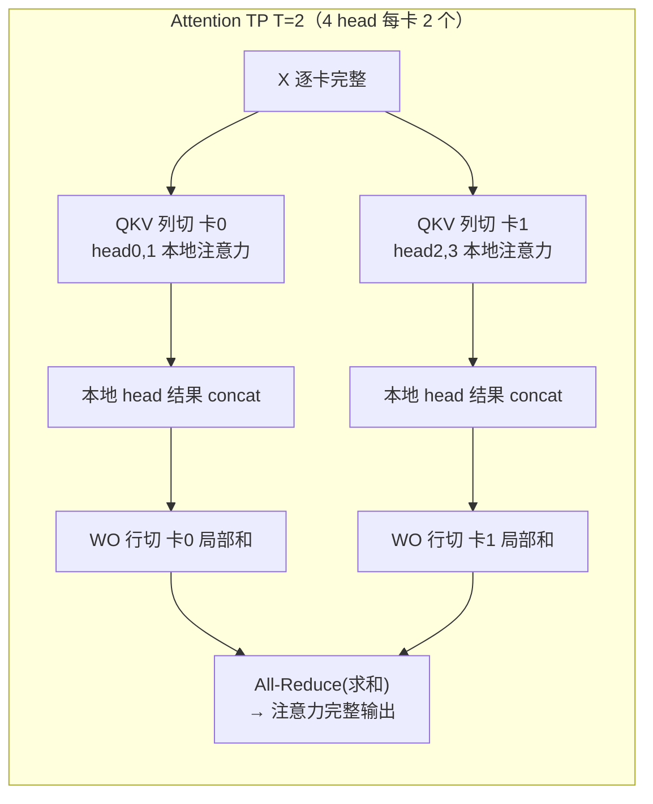
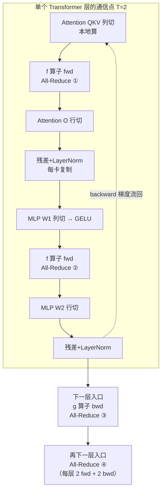

> **分布式训练系列 · 第 03 篇 / 共 08 篇**
>
> [02 ZeRO/FSDP](/2026/08/31/dist-train-02-zero-fsdp/) ← **本篇** → [04 流水并行](/2026/08/31/dist-train-04-pipeline-parallel/)

**TL;DR**
> * ZeRO 拆的是"参数存哪儿"（显存维度），**张量并行（TP）拆的是"一次矩阵乘法怎么算"**（计算维度）：把权重矩阵沿列/行切开，分布在 $T$ 张卡上，每卡算一部分，靠 **All-Reduce 缝合结果**。NVIDIA 的 Megatron-LM 是其最成熟的 1D 实现 [1][3]。
> * **切分的语义**（见张二森的视角 [4]）：**列切 = 切神经元**（每列权重喂给一个神经元，各神经元输出独立 → 最后 concat）；**行切 = 切输入特征**（每行权重把一个特征扩散给所有神经元 → 各卡的部分和必须相加）。这个直觉比背矩阵公式重要得多。
> * **为什么"先列后行"**：① 中间的非线性激活（GELU/ReLU）要求前一层**列切**——列切后激活可逐卡独立计算，行切则必须先 All-Reduce 再激活（违背代价最小化）[3][4]；② "列→行"配对让上层的 concat 与下层的 split 在本地完成，**每层只多出 2 次 All-Reduce（forward + backward 各 1 次缝合）**。
> * **每层每步的通信 = 4 次全量 All-Reduce**（Attention 的 QKV concat + 输出求和，MLP 的升维/降维各一），每次规约一个激活大小的张量 $\Phi = b\cdot s\cdot h$。**通信-计算比与 batch 无关，只取决于模型宽度与算力/带宽比**：$r \propto \frac{(T-1)\cdot F}{h \cdot \beta}$。实测量级：70B / H100 / TP=8 下约 **13%**（50% 计算效率假设），8B 模型同样的 TP=8 会升到 **25%**——**TP 只对大模型划算**。
> * **工程铁律**：TP 的 All-Reduce 发生在**每个内核内部的同步点上**（一进一出两把通信，共 $4L$ 次/step，且在关键路径上不可重叠），因此 **TP 必须跑在 NVLink 上、绝不做跨机**（除非 NVL72 这类全 NVLink 互连）。**"TP=8 单机"是大模型训练的事实标准起步值**；更宽的模型在 TP 之外再叠加 PP/SP/ZeRO。

---

## 1. 切分矩阵的两种方式：列切是"切神经元"，行切是"切特征"

设输入 $X \in \mathbb{R}^{B\times K}$（$B$ 个样本/ token，$K$ 个特征），权重 $W \in \mathbb{R}^{K \times N}$（$N$ 个输出神经元）。单卡算 $Y = XW$。当 $W$ 大到单卡装不下（或算力不够一次算完），就用 $T$ 张卡。两种切法对应完全不同的直觉 [3][4]：

### 列切（Column Parallel）—— 切的是"神经元"

$$W = \big[\,W_0 \mid W_1 \mid \cdots \mid W_{T-1}\,\big], \qquad W_t \in \mathbb{R}^{K \times (N/T)}$$

**物理含义**：$W$ 的一列 $K\times 1$ 向量就是"把 $K$ 个输入特征喂给**同一个神经元**"的变换。切列 = 把 $N$ 个输出神经元分成 $T$ 组，各卡各算一组。**因为神经元之间互相独立，每组输出直接 concat 就是完整结果**——通信只要一次 **All-Gather（拼接语义）**：

$$Y = \text{AllGather}\big(Y_0 \parallel Y_1 \parallel \cdots \parallel Y_{T-1}\big)$$

> 注：Megatron 的 `f`/`g` 算子实现里，这个拼接用 All-Reduce 完成（每卡把已有部分填到对应位置），量级一致，分析时统一按"一次全量规约"计。

### 行切（Row Parallel）—— 切的是"输入特征"

$$W = \left[\begin{matrix} W_0 \\ \hline \vdots \\ \hline W_{T-1} \end{matrix}\right], \qquad W_t \in \mathbb{R}^{(K/T) \times N}$$

**物理含义**：$W$ 的一行 $1\times N$ 向量是"把**一个**输入特征扩散给全部 $N$ 个神经元"的变换。切行 = 把 $K$ 个特征分成 $T$ 组，**输入 X 也必须按列切**（$X = [X_0 \mid \cdots \mid X_{T-1}]$），各卡算局部和。**因为每个输出神经元都依赖全部输入特征**，最终要**相加**——通信是**求和语义的 All-Reduce**：

$$Y = \text{AllReduce}\big(Y_0 + Y_1 + \cdots + Y_{T-1}\big)$$

**记忆锚点**：列切→concat（拼起来），行切→sum（加起来）。一个切"纵"一个切"横"，正好对应神经元轴和特征轴。

---

## 2. MLP：为什么一定是"列切升维 + 行切降维"

Transformer 的 MLP 是两层线性 + 中间激活：

$$\text{MLP}(X) = \text{GELU}\big(X W_1\big)\, W_2$$

Megatron 的切法是固定的：**$W_1$（升维 h→4h）列切，$W_2$（降维 4h→h）行切** [1][3][4]。

**原因一：非线性激活函数不允许"边拆边算"**。GELU/ReLU 这类激活是非线性的，$f(a+b) \neq f(a) + f(b)$。若对 $W_1$ 行切，各卡的 $X_t W_{1,t}$ 是**部分和**，必须先 All-Reduce 成完整输入再激活——损失了逐卡独立的唯一好处；而列切后 $X W_1 = [X W_{1,0} \mid X W_{1,1}]$ 是**直接的拼接**，激活可以逐卡独立算 [3][4]。

**原因二：通信最小化**。列切引入一次 All-Gather（量级 $\Phi$），行切引入一次 All-Reduce（量级 $2\Phi$）[4]。若"行切 + 行切"或"列切 + 列切"配对，中间要额外通信；**"列→行"配对让 $W_1$ 输出在本地完成拼接（就是下一层行切所需的按列分块），两层之间零额外通信**，唯一的通信就是行切后那一次求和 All-Reduce——以及 backward 对应的一次。

**反传是"共轭"的**：设第一层列切、第二层行切。反向传播时梯度也要穿过这两层：
- $W_2$（forward 行切）的反向：$\nabla X_2 = \nabla Y \cdot W_2^\top$，$W_2^\top$ 按**列**切（即对输入侧而言是列切），各卡独立算 $\nabla X_{2,t}$，最后 All-Reduce 求和得到传给上一层的完整梯度；
- $W_1$（forward 列切）的反向：$\nabla W_1 = X^\top \nabla Y$。因为 $Y$ 是拼接的，$\nabla Y$ 也按同样的列位置切开,各卡独立算各自权重梯度，**梯度本身天然分片**，无需额外通信（若有 DP，梯度交给 DP 的 All-Reduce，见 §6.3）。

简言之：**反传的切分方式是前传的"转置镜像"——前传行切的层，反传在输入侧列切**，这就是 Megatron `f`/`g` 算子天然共轭的原因（张二森文 §6 用 $C@D=E \Rightarrow \nabla E @ D^\top = \nabla C$ 这张图讲透了这一点 [4]）。

> **Dropout 细节**：dropout 作用在完整行上。列切后 row-parallel 的输入在每卡被切了一半，Megatron 论文 §3.1 专门处理了这个细节——保证 Dropout mask 按各自的局部列生成，语义与单卡一致 [1]。

---

## 3. Self-Attention：QKV 列切、输出行切——多头巨无霸的天然并行

多头注意力的四块权重：$W_Q, W_K, W_V \in \mathbb{R}^{h\times h}$（三块，每块又按 head 分成 $h/\text{head\_dim}$ 段）和输出投影 $W_O \in \mathbb{R}^{h\times h}$。

- **QKV 用列切**：三块权重各自按列切开，每卡持有若干 head 的 $Q_t, K_t, V_t$。**每个 head 的注意力完全在本地计算，不跨卡**——这是整个 TP 里最"免费"的并行：本来就独立的 head 被直接分到不同卡上 [3]。
- **输出投影 $W_O$ 用行切**：各卡把本地所有 head 的注意力输出 concat 后乘 $W_O$ 的局部行块，再 All-Reduce 求和，得到完整的残差输入。
- **约束**：head 总数必须能被 $T$ 整除（GQA 场景是 KV head 数能被 $T$ 整除），否则列宽对不齐头部边界——Megatron 用 `--num-attention-heads` 和 `--tensor-model-parallel-size` 做整除校验。

**通讯量分析与 MLP 完全同构**：forward 一次 All-Reduce（$W_O$ 求和）、backward 一次（梯度通过 QKV 输入侧）。因此一个 Transformer 层（Attention + MLP）每步 forward+backward 一共 **4 次全量 All-Reduce** [3][4]，每次规约 $b\cdot s\cdot h$ 大小的张量——这是后面所有数据分析的起点。

---

## 4. Embedding 与词表并行：把 $b\cdot s\cdot v$ 的通信压成 $b\cdot s$

### 4.1 输入 Embedding：按词表行切 + All-Reduce 补零

word embedding 是 $v \times h$（词表 $\times$ 隐藏层）。按**行（词表维度）**切成 $T$ 份，每卡持有 $v/T$ 个词向量。输入 token 查找时：**查得到就返回词向量，查不到全置 0**，然后所有卡 All-Reduce（求和）——因为每个 token 只在恰好一张卡上命中了非零向量，求和后每卡都拿到完整 embedding [3]。

### 4.2 输出层 / LM Head：与输入共享权重

输出层把隐藏状态映射回词表（`logits = hidden @ Embedding^\top`），通常与输入共享同一份 embedding 权重。**共享带来的梯度问题**：输出层的词表梯度与输入层 embedding 的梯度都要累加到同一份权重上。当输入/输出层在**不同卡**（典型是流水并行把模型劈开，见 04 篇）时，权重更新前必须对两处的梯度做一次 All-Reduce [3]。

### 4.3 交叉熵的经典优化：两次小 All-Reduce 替代一次大 All-Gather

朴素做法：把各卡局部的 logits（$b\times (v/T)$）All-Gather 成完整 $b\times v$，再算 softmax——通信量 $b\cdot s\cdot v$。词表 $v$=128K 时这是天文数字。**Megatron 的解法**（猛猿文 §5 的图解 [3]，张二森文 §8 的 softmax 数值细节 [4]）：

1. 每卡先算自己那 $v/T$ 列的逐行 $\max$，All-Reduce 拿全局 $\max$（通信量 $b\cdot s$）；
2. 每卡算局部 $\sum e^{x-\max}$，All-Reduce 拿全局分母（通信量 $b\cdot s$）；
3. 每卡直接对本地列做 softmax、只数本地词的交叉熵贡献，最后把每卡的 scalar loss All-Reduce 相加（通信量 $T$）。

**总通信从 $b\cdot s\cdot v$ 降到 $2b\cdot s + T$**。以 $s=4096, v=128K, b=1$ 举例：**1.05 GB → 约 33 KB**，差 3 万倍——词表并行是 Megatron 里"性价比最高"的一段优化。[3]

---

## 5. 一次反传走遍两层：切分在 backward 里如何"镜像"

把前两节的 forward/backward 拼成一张完整计算图（参考猛猿文 §1 的 $f$/$g$ 算子图 [3]）：

- **$g$（列切输出的缝合点）**：forward 做 All-Reduce 拼接，backward 只需把 $\nabla_Y$ **广播**回各卡，各卡独立算权重梯度——$g$ 的 backward 零通信；
- **$f$（行切输入的缝合点）**：forward 是 identity（各卡已有自己的 $X_t$），backward 把各卡算出的 $\nabla X_t$ **All-Reduce 求和**成完整 $\nabla_X$ 传给下一层——$f$ 的 backward 一次全量规约。

所以整层 4 次 All-Reduce 的分布是：**forward 2 次（f 在 Attention 输出、MLP 输出），backward 2 次（f 的梯度规约在每层入口）**。这 4 次都在**关键路径上**——后面的层必须等规约完成才能开始，这是 TP 与 DDP 最本质的区别（DDP 的梯度规约可以跟反向计算重叠，TP 的规约是生产依赖）。

> **激活冗余 vs 参数分片**：TP 的参数不冗余（每卡只有 $W_t$），但**"非线性算子"（LayerNorm/Dropout/残差）两侧的激活是复制的**——每卡都要持有完整序列的激活副本（张二森文 §9 明确点出 [4]）。长序列下这部分激活显存会反超权重，解法是序列并行（05 篇）——把 LayerNorm/Dropout 等沿序列切开，顺便把上图的 4 次全量 All-Reduce 也切成更小的 reduce-scatter/all-gather。

---

## 6. 计算-通信比的数据分析：什么时候 TP 划算

这是本篇的核心。我们把一个 Transformer 层在 TP 下的时间账算清楚。设：微批次 $b$、序列长 $s$、隐藏宽 $h$、TP 大小 $T$、每卡有效带宽 $\beta$（bytes/s）、每卡峰值算力 $F$（FLOPs/s，BF16 dense）、计算效率（MFU）$\eta_{\text{calc}}$。

### 6.1 公式推导

**通信时间**：每层每步 4 次 All-Reduce，每次规约一个 $\Phi = b\cdot s\cdot h$ 的张量（BF16，2 字节）。沿 07 篇的 Ring 公式 [7]（$T_{\text{AR}} = 2(T-1)\alpha + \frac{2(T-1)}{T}\frac{D}{\beta}$，带宽项为主）：

$$T_{\text{comm/layer}} = 4 \cdot \frac{2(T-1)}{T}\cdot\frac{b\cdot s\cdot h\cdot 2\text{B}}{\beta} = \frac{16(T-1)}{T}\cdot\frac{b\cdot s\cdot h}{\beta}$$

**计算时间**：Transformer 层每 token 的 fwd+bwd FLOPs ≈ $72h^2 + 12sh$（$72h^2$ 是经典 "6N" 里每层的份额；$12sh$ 是注意力随序列的部分）[8]，TP 把每卡的负载降到 $1/T$：

$$T_{\text{comp/layer}} = \frac{(72h^2 + 12sh)\cdot b\cdot s}{T\cdot F\cdot \eta_{\text{calc}}}$$

**通信-计算比**（两者相除，$12sh$ 项在 $s \lesssim 6h$ 时可忽略）：

$$\boxed{\,r = \frac{T_{\text{comm}}}{T_{\text{comp}}} \approx \frac{16(T-1)\cdot F\cdot \eta_{\text{calc}}}{72\cdot h\cdot \beta} = \frac{2(T-1)}{9}\cdot\frac{F\cdot\eta_{\text{calc}}}{h\cdot\beta}\,}$$

三个惊人干净的结论：

1. **与 batch、序列长度无关**（$b\cdot s$ 同时消掉了）——增大 micro-batch 只会等比例放大 comm 和 compute，比例不动；
2. **$r \propto (T-1)$**——TP 翻倍，通信占比近似翻倍，**TP 不是加的越多越好**；
3. **$r \propto 1/h$**——模型越宽，通信占比越低。同时对比三代 GPU：$F/\beta$ 在进化（A100→H100→B200 每单位 NVLink 带宽对应的算力越来越大），**新 GPU 上同样的 TP 配置通信占比反而更高**。

### 6.2 数值表

下表统一假设 $\eta_{\text{calc}}=50\%$、$s=4096$、$b=1$、NVLink 有效带宽取峰值七折（A100 600 GB/s→450，H100 900→650，B200 1.8 TB/s→1.3 TB/s），行切注意力的 $12sh$ 项已计入：

**表 1｜通信占每层总时间的比例 $r$（%），H100**

| 模型（宽度 h） | TP=2 | TP=4 | TP=8 |
|---|---|---|---|
| 8B（h=4096） | 3.5% | 10.6% | **24.8%** |
| 70B（h=8192） | 1.9% | 5.7% | **13.3%** |
| 405B（h=16384） | 1.0% | 3.0% | **6.9%** |

**表 2｜同样的配置在 A100 上**（算力弱、相对带宽富余 → 占比更低）

| 模型（宽度 h） | TP=2 | TP=4 | TP=8 |
|---|---|---|---|
| 8B（h=4096） | 1.6% | 4.8% | **11.3%** |
| 70B（h=8192） | 0.9% | 2.6% | **6.1%** |
| 405B（h=16384） | 0.5% | 1.4% | **3.2%** |

**表 3｜70B 一层的绝对时间账（H100，TP=8，b=1, s=4096）**

| 项目 | 数值 |
|---|---|
| fwd+bwd 计算 | 5.42 ms（21.4 TFLOPs ÷ 8 卡 ÷ 494 TFLOPS 有效） |
| 4 次 All-Reduce 通信 | 0.72 ms（4 × 117 MB ÷ 650 GB/s，Ring 因子 1.75） |
| 通信占比 | 13.3% |
| 80 层全模型 comm | 57.8 ms/step |

**读法**：
- **8B 模型在 H100 上 TP=8 有 25% 通信开销**——这就是为什么 8B 级模型几乎没人把 TP 开满（见 §8：7B/8B 用 FSDP 或 TP=2/4）。
- 70B 级 TP=8 的 13% 是"甜点区"：能显著压激活显存、且通信可接受。**这正是全行业 70B 都配 TP=8 的原因**。
- 405B 级 TP=8 只有 7%——模型越大 TP 越便宜，所以大模型反而是 TP 用得最满的地方。

### 6.3 和 DP（数据并行）的通信对比

每层每步，TP 通信量 $= 4 \times \frac{2(T-1)}{T} \cdot b\cdot s\cdot h \cdot 2\text{B}$；DP 通信量 $= \frac{2(D-1)}{D}\cdot 12h^2 \cdot 2\text{B}$（每层权重梯度，$12h^2$ 参数/层）。**关键区别是它们随什么增长**：

- TP 随 **激活**（$b\cdot s\cdot h$）增长 → 跟 micro-batch 和序列长度走；
- DP 随 **参数**（$12h^2$）增长 → 跟模型大小走、与 batch 无关。

70B（h=8192）、b=1、s=4096、T=D=8 时：TP 每层 469 MB，DP 每层 3.1 GB——**小微批次下 TP 反而比 DP 便宜**；但当把全局 batch 拉大（比如 16 个 micro-batch），TP 通信 ×16 到 7.5 GB/层，迅速反超。这个不对称性解释了工程上的标准布置（下节和第 08 篇）：

> **TP 负责"把单份模型摊到 8 卡里"，DP 负责"靠大 batch 撑吞吐"；TP 通信锁进 NVLink，DP 通信可以放出去。**

这也和猛猿文 §6 的结论一致：TP 与 DP 每层通信量的比较约化为 $b\cdot s$ 对 $h$（"本例前者可能略大，但量级相同"）[3]——我们把 $12h^2$ 的常数修正后得到更精确的比例 $\frac{1}{3}\cdot\frac{b\cdot s}{h}$。

### 6.4 和张二森实测的互验

张二森文 §7.2 给的例子：Llama-3-70B、$b=8$、$s=4096$、$h=8192$、FP16（FP32 累积），单次 All-Reduce 传输量 $4096\times8\times8192\times2\text{B}=537\text{MB}$，Ring 8 卡因子 $2\times7/8=1.75$ → 940 MB @ 450 GB/s ≈ **2.0 ms，与本节公式 $\frac{2(T-1)}{T}\cdot\frac{D}{\beta}$ 完全吻合**（他文中的 1.99 ms 即此值）[4]。他据此估计通信占一个 Transformer block 计算时间的 20%~25%——**注意这对应约 90% 的极高计算效率假设**；在更现实的 50% 效率（表 3）下，同样的通信时间只占 6%~13%。**通信时间是带宽决定的硬账，占比高低取决于分母（计算效率）**——这也是为什么实测 MFU 和理论值差距大时，TP 通信在 profiler 里显得"没那么夸张"。

---

## 7. 1D TP 的扩展极限：为什么大模型要放弃"更细的切法"

1D TP 有两个先天短板（llm_interview_note 的总结 [5]）：

1. **激活不切分**：每卡仍持有整条序列的激活副本（§5 末尾已提），显存随序列长度线性膨胀；
2. **通信随 $T$ 增长**：$r \propto (T-1)$（§6.1），$T$ 从 8 到 16 时 70B 的占比从 13% 爬到 27%。

针对后者，Colossal-AI 提出了 2D/2.5D/3D 张量并行（SUMMA 类算法把权重切成二维/三维网格，激活也随之分片）[5]，理论成本对比如下（$P=q\times q$ 或 $q^2 d$ 或 $q^3$ 个处理器）：

| 方案 | 计算 | 参数内存 | 激活内存 | 通信带宽 | 通信延迟 |
|---|---|---|---|---|---|
| 1D（Megatron） | $O(1/P)$ | $O(1/P)$ | $O(1)$ | $O(2(P-1)/P)$ | $O(2(P-1))$ |
| 2D（SUMMA） | $O(1/q^2)$ | $O(1/q^2)$ | $O(1/q^2)$ | $O(6(q-1)/q)$ | $O(6(q-1))$ |
| 2.5D | $O(1/dq^2)$ | $O(1/q^2)$ | $O(1/dq^2)$ | $O(3(q-1)(d+1)/dq)$ | $O(6(q-1))$ |
| 3D | $O(1/q^3)$ | $O(1/q^3)$ | $O(1/q^3)$ | $O(6(q-1)/q^3)$ | $O(6(q-1))$ |

（成本表引自 llm_interview_note 对 Colossal-AI 论文的整理 [5]，原始论文为 2D: arXiv:2104.05343、2.5D: arXiv:2105.14500、3D: arXiv:2105.14436。）

**但工程现实是：这些方案从来没有成为主流。** 原因有三：
1. 1D TP 配合 **序列并行（05 篇）** 就把"激活/通信"两个短板同时补上了——SP 把 LayerNorm 附近的复制激活切成序列分片，并把全量 All-Reduce 换成 reduce-scatter/all-gather，通信量降一半；
2. 多维切分要求 $T$ 是完全平方/立方数，跟单机 8 卡这种现实拓扑对不齐；
3. 更细的网格切分把通信从"少数大消息"变成"更多小消息"，延迟成本上升。

**结论**：Megatron 的 1D TP（≤8）+ SP 就是今天的实际解法；多维 TP 的意义主要在论文与专门场景。

---

## 8. 不同训练场景的典型张量并行配置

下面按训练场景给出工程上"会真的这么配"的 TP 设置速查表。先给硬约束，再给配置。

### 8.1 硬约束（决定 TP 能不能这么设）

1. **整除性**：head 数 % $T$ == 0（GQA 则 KV head 数 % $T$ == 0）；词表 % $T$ == 0（词表并行前提）；
2. **拓扑**：$T$ ≤ 单机 NVLink 域内 GPU 数（标准 8 卡机器 $T\le8$）。跨机 TP 只有一种例外——NVL72/GB200 这类把 72 卡用全 mesh NVLink 焊在一起的机柜；
3. **比值红线**：$r$ 超过 ~20% 就该停（§6.2 表 1：8B 模型 TP=8 已达 24.8%）；
4. **显存线**：TP 的收益=省参数显存（每卡 $1/T$）+ 省不了激活（需 AC/SP/小 batch）。

### 8.2 速查表

| 训练场景 | 典型硬件 | 典型配置（TP × PP × DP/其他） | 理由 |
|---|---|---|---|
| 7B/8B dense 预训练 | 1 节点 8×H100 | **TP=1** + FSDP（或 TP=2/4） | 8B 的 16B/参需要 128 GB，FSDP 足以；TP=8 通信占比 25%（表 1）不划算 [9] |
| 13B dense 预训练 | 1 节点 8×80GB | TP=4（或 8）× DP=2 | 权重 208 GB 需分片；TP=4 与 head 数对齐、通信占比 ~8% |
| 70B dense 预训练 | 1 节点 8×H100 | **TP=8** + ZeRO-1/2 + AC | 事实标准：显存必须分、13% 通信可接受 [1][2] |
| 70B 多节点（16~32 卡） | 2~4 节点 | **TP=8（节点内）× PP=2~4（跨节点）** | 黄金法则：TP 锁 NVLink、PP 过网络（04 篇）；参考 GPT-3 175B 的 TP=8×PP=4×DP=3（96×A100）[2] |
| 200B~400B dense | 多节点 | TP=8 × PP=16 × DP=128（长上下文再加 CP） | Llama 3 405B 用 4D 并行（TP+PP+CP+FSDP），TP=8×PP=16×DP=128 摊到 16,384 张 H100 [9] |
| MoE（Mixtral 8x7B、DeepSeek-V3 等） | 多节点 | 常见：注意力 dense 层 TP + 专家层 EP（all-to-all）；DeepSeek-V3 特例：**PP=16 × EP=64 + ZeRO-1，完全不用 TP** | 专家参数放进 EP 网格更省通信；DeepSeek-V3 靠 DualPipe 把 EP 的 all-to-all 藏进计算，TP 反而是多余开销 [11] |
| 长上下文预训练（s≥32K） | 1 节点 | **TP=8 + SP=8** + AC | SP 把复制激活切掉、All-Reduce 减半（05 篇）；Megatron `--sequence-parallel` |
| MoE 推理 / 大模型 serving | vLLM/SGLang | TP=8（单机）；低并发下 PP 更优 | TP 在低 batch 下受延迟项拖累（§6.1 的 $\alpha$ 项），PP 跨机更省带宽 |
| NVL72（Blackwell 机柜） | 72×B200 单机柜 | **TP 可开到 8 以上**（72 卡全 mesh NVLink 1.8 TB/s） | 唯一的"宽 TP"例外：NVLink 域=整柜 [12] |

> **为什么 70B 是 TP=8 的"甜点"**：8B 级 TP 通信占比太高（表 1）；而 70B 上 TP=8 占 13% + ZeRO 管优化器显存 → 用最少的并行种类解决最实际的问题。**"先填满单机的 TP，再跨机加 PP，最后用 DP/ZeRO 撑吞吐"** 是 2D/3D 并行的完整口诀（08 篇展开）。

### 8.3 给 4 卡机器的建议

实际单机常见的是 4×A100/H100。此时 TP=4 是天然上限：8B/13B 模型用 TP=4 + DP=2（每 GPU 一个 DP 副本、TP 组内 4 卡）；若 head 数不能被 4 整除（如 28 head），退而 TP=2 × DP=4。**不要为凑 TP=8 强行跨机**——跨机 NVLink 不存在，$r$ 会直接涨 5~10 倍。

---

## 9. 决策清单

1. **何时上 TP**：ZeRO-3 之后显存仍不够、或单卡激活放不下（长序列/大 batch）→ 上 TP。TP 省的是**参数**显存，**省不了激活**（几乎只有 SP 和 AC 管激活）。
2. **TP 大小怎么定**：先看整除性，再看 $r$（§6.2）——$r\ge20\%$ 就收手。8B 级用 TP≤4，70B 级 TP=8，再大模型才考虑更大但别超 NVLink 域。
3. **先 TP 还是先 PP**：**优 先 TP**——通信少、数学干净、无气泡；PP 引入气泡且要调微批次（04 篇），只有 TP 到顶后才加 PP。
4. **绝不跨机 TP**（NVL72 除外）：跨机带宽是 NVLink 的 1/8~1/20，$r$ 爆炸。
5. **TP × DP / ZeRO**：TP 负责摊模型，DP/ZeRO 负责吞吐与优化器显存——Llama 3 405B 的 4D 并行就是这个套路；纯 MoE 大模型（DeepSeek-V3）则用 EP 取代 TP（08 篇）。
6. **长序列必配 SP**：TP=8+SP=8+AC 是 32K+ 上下文的默认组合（05 篇）。
7. **词表并行别忘了**：$b\cdot s\cdot v \to 2b\cdot s$ 的交叉熵优化是 Megatron 默认行为，自己的实现一定照做（§4.3）。

---

## 10. 参考文献与延伸（含 Clippings 本地存档）

1. Shoeybi et al. *Megatron-LM: Training Multi-Billion Parameter Language Models Using Model Parallelism*. arXiv:1909.08053（Column/Row Parallel 原始推导、f/g 算子、Dropout 细节 §3.1）
2. Narayanan et al. *Efficient Large-Scale Language Model Training on GPU Clusters Using Megatron-LM*. arXiv:2104.04473（3D 并行组合与 GPT-3 175B 的 TP=8/PP=4/DP=3 配置、1F1B）
3. 猛猿. *图解大模型训练之：张量模型并行，Megatron-LM*. 知乎专栏. https://zhuanlan.zhihu.com/p/622212228 （本仓库存档：`Clippings/图解大模型训练之：张量模型并行(TP)，Megatron-LM.md`——f/g 算子图解、每层 4 次 All-Reduce 的通讯量推导、Embedding/词表并行与交叉熵优化、TP 与 DP 通讯量对比）
4. 张二森. *大模型工程炼金术（六）分布式训练之张量并行*. 知乎专栏. https://zhuanlan.zhihu.com/p/2035041746850161108 （本仓库存档：`Clippings/大模型工程炼金术（六）分布式训练之张量并行.md`——"列切=神经元/行切=特征"的直觉、反传镜像切分、NVLink/NVSwitch 带宽分析、Llama-3-70B 的 All-Reduce 实测估算、词表并行 softmax 细节）
5. wdndev. *llm_interview_note：04.分布式训练/4.张量并行*. GitHub. https://github.com/wdndev/llm_interview_note/blob/main/04.%E5%88%86%E5%B8%83%E5%BC%8F%E8%AE%AD%E7%BB%83/4.%E5%BC%A0%E9%87%8F%E5%B9%B6%E8%A1%8C/4.%E5%BC%A0%E9%87%8F%E5%B9%B6%E8%A1%8C.md （本仓库存档：`Clippings/llm_interview_note04.分布式训练4.张量并行4.张量并行.md at main.md`——1D/2D/2.5D/3D 成本表、SUMMA 推导、PyTorch DTensor 用法）
6. PyTorch. *Tensor Parallel 教程 / DTensor 文档*: https://pytorch.org/tutorials/intermediate/TP_tutorial.html 与 https://pytorch.org/tutorials/recipes/distributed_tensor_parallel.html
7. Patarasuk & Yuan. *Ring Allreduce: A Scalable Approach to Data-Parallel Training*. ICS 2009（本系列 07 篇的 Ring 公式来源）
8. Kaplan et al. *Scaling Laws for Neural Language Models*. arXiv:2001.08361（"6N FLOPs/token"的训练算力经验式，本文 §6.1 的 $72h^2$ 结论依据）
9. Liu et al. *The Llama 3 Herd of Models*. arXiv:2407.21783；及 *Scaling Llama 3 Training with Efficient Parallelism Strategies*（ISCA 2025）（8B 用 FSDP；405B 用 4D 并行：TP=8 × PP=16 × DP=128（×CP），共 16,384 张 H100）
10. NVIDIA. *Megatron-LM 官方仓库*: https://github.com/NVIDIA/Megatron-LM
11. DeepSeek-AI. *DeepSeek-V3 Technical Report*. arXiv:2412.19437（训练用 PP=16 + EP=64 + ZeRO-1；原文明确"optimize the memory footprint…train DeepSeek-V3 without using costly TP"，即 MoE 大模型可完全弃用张量并行）
12. NVIDIA. *DGX GB200 NVL72 / Blackwell 白皮书*: https://www.nvidia.com/en-us/data-center/dgx-gb200-nvl72/（全 mesh NVLink 支持跨 72 GPU 的 TP）

---

*下一篇：[04 流水并行](/2026/08/31/dist-train-04-pipeline-parallel/) —— 按层切分的另一种思路：GPipe/PipeDream/1F1B 与气泡的数学。*