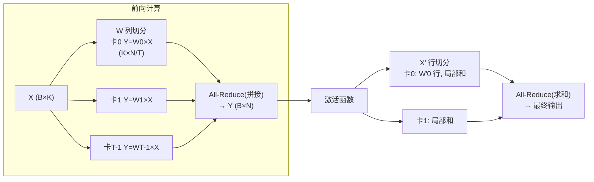

> **分布式训练系列 · 第 03 篇 / 共 08 篇**
>
> [02 ZeRO/FSDP](/2026/08/31/dist-train-02-zero-fsdp/) ← **本篇** → [04 流水并行](/2026/08/31/dist-train-04-pipeline-parallel/)

**TL;DR**
> * ZeRO 拆的是"参数存哪儿"（显存维度），**张量并行（TP）拆的是"一次矩阵乘法怎么算"**（计算维度）：把权重矩阵沿列/行切开，分布在 $T$ 张卡上，每卡算一部分，**两次 All-Reduce 缝合结果**。
> * **核心数学**：对线性层 $Y = XW$（$X \in \mathbb{R}^{B\times K}$，$W \in \mathbb{R}^{K\times N}$）——**Column Parallel**：$W = [W_0, W_1, \dots, W_{T-1}]$ 按列切，每个 $W_t \in \mathbb{R}^{K \times N/T}$，$Y_t = X W_t$，最后 All-Reduce 拼接；**Row Parallel**：$W = [W_0; W_1; \dots]^\top$ 按行切，每个 $X_t$ 算部分和，All-Reduce 求和。
> * **为什么每层有 2 次 All-Reduce**：MLP 前向 = $W_1$（column）→ 激活 → $W_2$（row），Column 后需要一次 All-Reduce，Row 前又需要一次——**一进一出两把通信**。多头注意力的 QKV（column）与输出（row）也遵循同一模式。
> * **TP 的硬约束**：All-Reduce 发生在**每个内核内部**，一层的通信频率 = 两次全量 All-Reduce（量级 ~ 激活大小，与 batch 正相关）。因此 **TP 必须跑在 NVLink/近内存带宽上**——跨机跑 TP 通信延迟会直接吃穿整个训练。**TP 是"单机内"并行，绝不做跨机**（除非有超高性能互连）。
> * **什么时候用**：显存已经由 ZeRO 撑住但仍不够、或 batch 已经大到激活放不下 → 上 TP。典型配置：**TP=8（单机 8 卡 NVLink full mesh）**是大模型训练的事实标准起步值。

---

## 1. 从"一个矩阵"出发：Column 与 Row 切分

设单卡无法容纳 $W \in \mathbb{R}^{K\times N}$（或算力不够一次算完），我们用 $T$ 张卡。两种切法，对应两个 All-Reduce 语义：

### Column Parallel（沿列切，用于第一层与 QKV）

$$W = \big[\,W_0 \mid W_1 \mid \cdots \mid W_{T-1}\,\big], \qquad W_t \in \mathbb{R}^{K \times N/T}$$

每卡持有 $W_t$，计算 $Y_t = X W_t \in \mathbb{R}^{B \times N/T}$。因为**每卡只有输出的一部分列**，需要把列拼起来（concat），实现为 All-Reduce（每卡把自己的 $Y_t$ 放在对应位置的拼接）：

$$Y = \text{AllReduce}\big(Y_0 \parallel Y_1 \parallel \cdots \parallel Y_{T-1}\big) \in \mathbb{R}^{B\times N}$$

> 注意这里的 All-Reduce 是**拼接语义（All-Gather）**而不是求和。技术上 All-Gather 即可；Megatron 实现里通常用 All-Reduce（把每卡的已有部分和补齐）以避免额外的内存拷贝。

### Row Parallel（沿行切，用于第二层）

$$W = \left[\begin{matrix} W_0 \\ \hline W_1 \\ \hline \vdots \\ \hline W_{T-1} \end{matrix}\right], \qquad W_t \in \mathbb{R}^{K/T \times N}$$

每卡持有 $W_t$ 和对应的输入 $X_t$（**输入也必须按行切**，前一层 Column 输出经过拼接后再按行分给下一层）。$Y = \sum_t X_t W_t$ —— 这就是**求和语义的 All-Reduce**：

$$Y = \text{AllReduce}\big(Y_0 + Y_1 + \cdots + Y_{T-1}\big)$$

### 关键洞察：MLP 天然"列进列出"

Transformer 的 MLP 通常是两层线性（$W_1$ 升维 + $W_2$ 降维）+ 中间激活：

$$\text{MLP}(X) = f(X W_1)\, W_2$$

恰好符合 **Column → Row** 的配对：$W_1$ 用 Column（输出需要拼接成完整维度喂给激活），$W_2$ 用 Row（输入来自上一层的完整激活，按行切开后各算局部和再 All-Reduce）。**而 Dropout 因为作用于完整行，可以安全地在 Row 之前应用**——activation 在每卡被切了一半，Dropout mask 仍按各自的局部列生成，语义一致（Megatron 论文的 §3.1 精确处理了这一细节）。

---

## 2. 注意力的张量并行：QKV 一个模子

多头注意力：$Q=XW_Q$、$K=XW_K$、$V=XW_V$（Column）然后 $\text{softmax}\left(\frac{QK^\top}{\sqrt{d_k}}\right)V$（整块输出），最后 $O W_O$（Row）。

- **QKV 用 Column Parallel**：三组权重都沿输出列切，每卡算 $Q_t, K_t, V_t$——**注意力在每个头内部计算，不跨卡**（只要头的划分与列划分一致）。
- **输出投影用 Row Parallel**：把各卡的注意力输出（不同头）拼起来再投影，All-Reduce 求和。
- 若 head num 不能被 $T$ 整除，把列宽对齐到 head 大小即可（Megatron 用 `--num-attention-heads` 与 `tensor-model-parallel-size` 兼容检查）。

---

## 3. 通信频率与量级：为什么 TP 只能待在 NVLink 里

一次 Transformer block（含 MLP + Attention）在 TP 下的通信 = **4 次全量 All-Reduce**（Attention 的 QKV concat + 输出求和；MLP 的两层各一次）。设激活大小 $\approx B \times d_{model}$：

- 单 block 通信量 $\approx 4 \times B \times d_{model} \times 4\text{B}$（FP32 或 FP16）。
- 与 DP（$2\Phi$，每步一次）相比：**TP 的通信是每层都发生、且随 batch 变大而变大**（激活随 batch 增长）。
- 所以 TP 的扩展效率公式（沿用 00 篇）以**层内计算时间**为分母：

$$\eta_{\text{TP}} = \frac{1}{1 + \frac{T_{\text{layer-comm}}}{T_{\text{layer-compute}}}}$$

层内计算 $T_{\text{layer-compute}} \propto B \cdot d^2$（矩阵乘），层内通信 $T_{\text{layer-comm}} \propto B \cdot d$（激活级 All-Reduce）。两者比值 $\propto 1/d$ —— **模型越大（$d$ 越大），TP 的通信占比越小，扩展效率越高**。这解释了：**TP 只对大模型划算**；对 8B 级模型，TP=8 的通信开销可能吃掉大部分收益。

**结论（工程铁律）**：TP=8 单机 NVLink 是默认；TP 跨机（哪怕 800Gbps RoCE）绝大多数时候是不划算的。要跨机并行 → 用 PP（04 篇）或 DP/ZeRO。

---

## 4. Megatron-LM 的引擎视角：一次"推理 + 训练"都是同一套图

Megatron-LM（NVIDIA）是最成熟的 TP 实现，核心是**在翻译层（model.py）把每个线性层替换成 Column/Row Parallel 版本**，用 `model_parallel` 工具函数管理 All-Reduce 进程组与参数名分片。对使用者：

- 用 `--tensor-model-parallel-size T` 切分；
- 自动处理权重初始化（每个分片用 $\text{std} = 1/\sqrt{K}$ 等）、Dropout、LayerNorm 的组装；
- 反向传播自动切分梯度（Column 的梯度沿行 all-reduce，Row 的梯度沿列 all-reduce），保证与单卡数学一致。

> **一个重要细节**：TP 的**参数不冗余**（每卡只有 $W_t$），但**激活冗余**（前一层输出完整复制到所有卡）——所以 TP 省显存靠的是"参数分片"，不省激活；激活问题交给激活检查点/序列并行（05 篇）。

---

## 5. 决策清单

1. **何时引入 TP**：ZeRO-2/3 之后显存仍不够、或单卡 batch 无法再大（激活溢出）→ 加 TP。
2. **先 TP 还是先 PP**：**优先 TP**（通信少、实现简单、数学干净）；PP 引入气泡（04 篇讲透）且需要微批次调优，只有在 TP 已到硬件上限（TP=8 max on 单机 8 卡）才加 PP。
3. **TP × 机数**：单机 8 卡 → TP≤8；单机 4 卡 → TP≤4。**绝不跨机 TP**。
4. **与 ZeRO 组合**：ZeRO-3 + TP 是"大模型训练"的事实默认（DeepSeek-V3 的 DSA 即 ZeRO-3 + 细粒度专家并行，见 06 篇；Megatron 用 TP+ZeRO 双引擎，见 08 篇）。
5. **与序列并行（05）组合**：Transformers 的 LayerNorm/Dropout 是"沿序列独立"的算子，可在 TP 之外叠加序列切分——**一个二合一优化**，把 LayerNorm 那点通信也省了。

---

## 6. 参考文献与延伸

1. Shoeybi et al. *Megatron-LM: Training Multi-Billion Parameter Language Models Using Model Parallelism*. arXiv:1909.08053（Column/Row Parallel 的原始推导与 Attention 拆分细节）
2. Narayanan et al. *Efficient Large-Scale Language Model Training on GPU Clusters Using Megatron-LM*. arXiv:2104.04473（TP 通信行为的系统测量，含不同 TP 值的扩展数据）
3. NVIDIA. *Megatron-LM 官方仓库*: https://github.com/NVIDIA/Megatron-LM
4. PyTorch. *Tensor Parallel 教程*: https://pytorch.org/tutorials/intermediate/TP_tutorial.html

---

*下一篇：[04 流水并行](/2026/08/31/dist-train-04-pipeline-parallel/) —— 按层切分的另一种思路：GPipe/PipeDream/1F1B 与气泡的数学。*