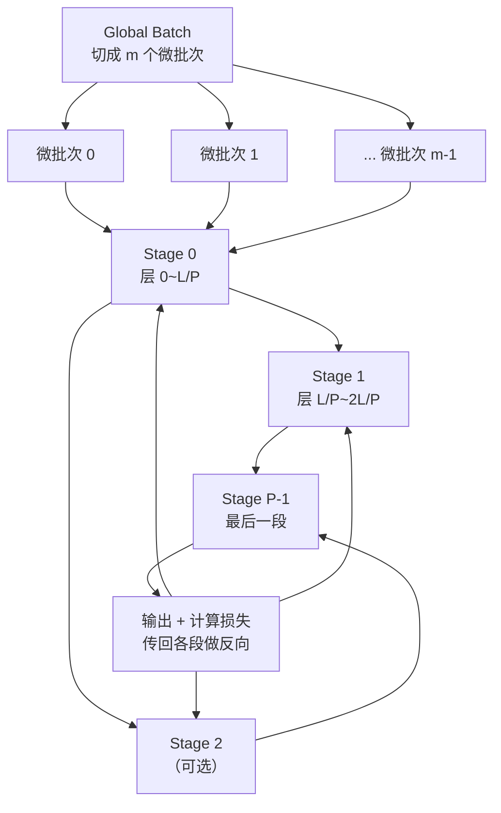

> **分布式训练系列 · 第 04 篇 / 共 08 篇**
>
> [03 张量并行](/2026/08/31/dist-train-03-tensor-parallel/) ← **本篇** → [05 序列并行](/2026/08/31/dist-train-05-sequence-parallel/)

**TL;DR**
> * TP 拆矩阵（算子内并行），**流水并行（PP）拆的是"层"**：把模型切成 $P$ 段，每张卡（或每组卡）负责一段。通信只在**相邻段边界**传一次激活张量——因此 PP 的通信量远小于 TP/DP，**适合跨机部署**。
> * **天真 PP 的致命伤：气泡（bubble）**。按"一个 batch 顺序流过所有段"的方式，任何时刻只有一个段在算，利用率只有 $1/P$——$P$ 越大浪费越狠。**微批次（micro-batch）是解法**：把 batch 切成 $m$ 个微批次，错峰灌入流水线，让各段同时算不同的微批次。
> * **三种主流调度**，气泡率各不相同：
>   - **GPipe**（论文 2019）：$m$ 个微批次同步推进，气泡率 $= (P-1)/(m+P-1)$。要求 $m \ge P$ 才有效率，代价是单卡显存需要一次缓存 $m$ 条激活。
>   - **PipeDream**（2019）：异步 1F1B 交错，利用反向传播的"权重版本"规避流水线不一致，气泡最小但实现复杂、内存翻倍。
>   - **1F1B（One-Forward-One-Backward，Megatron 采用）**：微批次前向/反向严格交替（一个前向接着一个反向），气泡率 $= (P-1)/(m+P-1)$ 且**显存优化**——激活只需保留当前微批次 + 后续即将前向的微批次。**1F1B 是今天大模型 PP 的事实标准。**
> * **什么时候该用 PP**：TP 已到单机上限（如单机 8 卡 TP=8 仍不够）→ PP 是跨机扩展的正道；或模型段之间天然边界清晰（encoder-decoder、MoE 层）。**代价是三样：气泡、微批次调优的复杂度、流水线末尾的显存尖峰。**



---

## 1. 拆层的直觉：通信变少，但要处理"流水线气泡"

把 Transformer 的 $L$ 层切成 $P$ 段，第 $i$ 段放第 $\lfloor iL/P \rfloor \sim \lfloor (i+1)L/P \rfloor$ 层。一次前向：段 0 算完把中间激活传给段 1，段 1 接着算……只有**相邻段之间传一个激活**，数据量是 $B \times d_{model}$ 量级，远小于 DP 的 $2\Phi$（参数）和 TP 的层内多次 All-Reduce。**这是 PP 天然适合跨机的根本原因。**

但"串行依赖"立刻带来问题：

**气泡定义**：若把整个模型看作一条装配线，微批次 $j$ 在段 $p$ 上的计算需要微批次 $j-1$ 已经离开 $p$。若我们等一个完整 batch 的全部层算完再开始下一个 batch，**每一时刻只有一段在工作**，GPU 利用率 $= 1/P$。令 $m$ = 微批次个数、$P$ = 流水段数，GPipe 的气泡率：

$$\text{bubble} = \frac{T_{\text{idle}}}{T_{\text{total}}} = \frac{(P-1)\cdot \tau}{(m+P-1)\cdot \tau} = \frac{P-1}{m+P-1}$$

其中 $\tau$ = 一个微批次经过一段的时间（假设各段均匀）。**公式看清两件事**：
- $P$ 固定时，$m \to \infty$，气泡 $\to 0$（$m \ge 4P$ 是工程经验值）；
- $m$ 固定时，$P$ 增大，气泡 $\to 1$——**加流水段不免费**，气泡随段数线性恶化。

---

## 2. GPipe vs PipeDream vs 1F1B：三种调度的时间线

### GPipe（同步，2019）
时间线：先让所有 $m$ 个微批次填满流水线（前向），然后统一反向。气泡集中在**流水线首尾两端**。推论：GPipe 想高效必须 $m \gg P$，而每段需要同时缓存 $m$ 个微批次的激活 → 显存尖峰 = $m \times$（单微批次激活）。

### PipeDream（异步，2019）
引入**权重版本（weight stashing）**：每个微批次携带"进入流水线时的权重版本"，反向时用同一版本更新——打破了"权重要是最新"的约束，允许异步 1F1B。气泡率公式同 GPipe，但**开始阶段的流水线可以立即进入反向**，整体吞吐略优于 GPipe。代价：每段需要保存多个权重版本，内存开销大，且收敛行为对调度敏感（拜"更新不同步"所赐）。

### 1F1B（One-Forward-One-Backward，2021 + Megatron 落地）
规则极简：**一个微批次前向结束后，下一个微批次立即前向；一旦有微批次反向结束、下一即反向**——维持"前向/反向 1:1"的节奏。数学上它的气泡率与 GPipe 相同（$\frac{P-1}{m+P-1}$），但显著优势是**激活内存**：段 $p$ 只需要保留"已经前向完、但还未反向"的微批次激活缓存：

$$\text{激活驻留（1F1B）} \approx (P - p) \text{ 个微批次} \quad \text{（比 GPipe 的 } m \text{ 个少得多）}$$

Megatron 用 1F1B + 交错（interleaved）调度：每个 rank 持有多段不连续的层块，把"首尾气泡"拆碎成零散小块，进一步压低气泡。**这是当今 8B+ 模型 PP 的事实配置。**

---

## 3. 1F1B 的数学时序：证明气泡率公式

设 $m$ 微批次、$P$ 段、$\tau$=单微批次经过单段的时间。**关键观察**：在 1F1B 中，段 0（第一段）只在开头连续前向 $P$ 个微批次后转入"来一个微批反一个"的稳态。

考虑**段 0 的空闲总量**：
- 稳态前，段 0 连续处理前向 $\Rightarrow$ 无空闲；
- 稳态后，它每次反向结束后等待"第 $P$ 个微批次的前向结果传回" $\Rightarrow$ 每个微批次平均空闲 $(P-1)\tau$？

更干净的方式（推导 GPipe 的标准结果）：总时间为 **填满流水线（$P-1$ 个 $\tau$）** + **m 个微批次依次走完（$m$ 个 $\tau$）** + **排空（$P-1$ 个 $\tau$）**，其中下一步反向也嵌在其中。完整训练 $m$ 个微批次的总时距 $= (m + P - 1)\tau$（前向后向各一次 $\tau$，首位各露出 $(P-1)\tau/2$ 的空泡）。**理想的零气泡时间是 $m\tau$（每段一直忙）**，于是：

$$\text{bubble}_{1F1B} = \frac{(m+P-1)\tau - m\tau}{(m+P-1)\tau} = \frac{P-1}{m+P-1}$$

与 GPipe 完全一致。推到这的直觉：**气泡只由"流水线首尾的空档"决定**，只要你还是一条"单进单出"的流水线，这个下限就逃不掉。唯一的出路是**交错式**（interleaved）把一段拆成多块，让空档被切成碎片、穿插进更小的计算里：

$$\text{bubble}_{interleaved} \approx \frac{P/s - 1}{m + P/s - 1} \qquad (s=\text{每 rank 的块数})$$

$s$ 越大气泡越小——代价是通信次数变为 $2s(P-1)$ 次/步（每块边界都要传激活）。

---

## 4. 工程实现要点（Megatron 的 PP 默认）

1. **PP 进程组 = 按"模型并行度"分组**：世界 = (DP × PP × TP)。每个 rank 有明确的 `pipeline_parallel_rank`，**前向只有 rank 0 有输入、rank P-1 有输出**；中间阶段只转发激活（+ 反向传播的梯度）。
2. **激活重计算（activation recomputation）**：PP 的气泡公式建立在"每段只需少量激活"假设上，但 1F1B 仍然缓存 $(P-p)$ 个微批次的激活 → 对长序列仍是显存大头。**配合重计算可以把"激活缓存"转为"反向时重算"**，是 PP + 长上下文的标配。
3. **均匀切分层数**：$\tau$ 依赖各段计算时间的均等。**不均匀会直接放大气泡**（快段等慢段）。经验：让每段的 FLOPs 尽可能相等（含 embed 与 LM head 的对齐）。
4. **跨机配置**：PP 通信是每微批次一次 point-to-point 激活（~GB 级），跨机 800Gbps 可用；**把 PP 放在跨机上、把 TP 锁在单机 NVLink 内**是 2D 并行的黄金法则（08 篇详细编排）。

```python
# Megatron-LM / NeMo 启用水流并行的最小 flag 示意
# --tensor-model-parallel-size 8   (单机内，NVLink)
# --pipeline-model-parallel-size 4 (跨机，每台一个 stage，激活 P2P)
# --num-microbatches 32            (m，建议 ≥ 4×P)
# --sequence-parallel / --recompute-activations
```

---

## 5. 何时不该用 PP（决策清单）

1. **单机即可满足** → 不需要 PP（PP 引入气泡 + 调参成本）。
2. **TP 还能再撑** → 优先 TP：TP 没有气泡，数学干净；PP 是"TP 后仍不够"的第二选择。
3. **段数太多（气泡恶化的场景）** → $P > 8$ 一般不值得：先加 TP/ZeRO。
4. **各层计算量极不均匀**（如混合了超长 attention 与轻量 FFN）→ 气泡将失控，除非交错式。
5. **强同步语义（如 strict determinism）** → 1F1B 的调度天然依赖微批次边界，PipeDream 的异步更糟；能用 GPipe 就用 GPipe。

---

## 6. 参考文献与延伸

1. Huang et al. *GPipe: Easy Scaling with Micro-Batch Pipeline Parallelism*. arXiv:1811.06965（气泡率公式原始出处）
2. Narayanan et al. *PipeDream: Generalized Pipeline Parallelism for DNN Training*. arXiv:1806.03377（异步 1F1B 与权重版本）
3. Narayanan et al. *Efficient Large-Scale Language Model Training on GPU Clusters Using Megatron-LM*. arXiv:2104.04473（1F1B 正式落地 Megatron，含气泡/显存实验）
4. NVIDIA. *Megatron-LM 仓库（pipeline_parallel.py 实现细节）*: https://github.com/NVIDIA/Megatron-LM
5. Habib & Kübler. *A Survey of Pipeline Parallelism*: https://arxiv.org/abs/2401.08623（横向综述，含交错式的量化对比）

---

*下一篇：[05 序列并行](/2026/08/31/dist-train-05-sequence-parallel/) —— 当上下文冲到 128K：把注意力沿序列切开，Ring Attention 登场。*