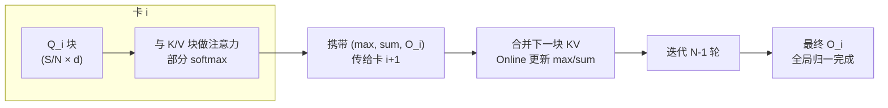

> **分布式训练系列 · 第 05 篇 / 共 08 篇**
>
> [04 流水并行](/2026/08/31/dist-train-04-pipeline-parallel/) ← **本篇** → [06 专家并行](/2026/08/31/dist-train-06-expert-parallel/)

**TL;DR**
> * DP 拆 batch、TP 拆矩阵、PP 拆层——**序列并行（SP）拆的是"序列"**：当上下文长度 $S$ 大到单卡放不下注意力矩阵/激活时，把序列切成 $N$ 段分发到 $N$ 张卡。**超长上下文（128K+）训练/推理的基本盘就是它。**
> * 两种"序列并行"要分清：
>   - **Megatron 的序列并行（SP，2022）**：只把 LayerNorm / Dropout 这类"沿序列独立"的算子沿序列切开，配合 TP 复用同一套 All-Reduce **省掉一组激活的归约**，通信量几乎不变、显存略降——**它是 TP 的附赠优化**，不是独立并行。
>   - **上下文并行 / Ring Attention（2023-）**：把注意力计算本身沿序列切分，卡间用 **Ring All-to-All** 传递 KV 分块，让**注意力矩阵不用整体驻留**就能算完——**这才是真正解决"单卡装不下超长序列"的并行**。
> * **Ring Attention 的核心数学**：把完整注意力 $O = \text{softmax}(QK^\top)V$（$Q,K,V \in \mathbb{R}^{S\times d}$）切成 $N$ 块 $Q_i, K_j, V_j$。每个 query 块 $O_i$ 需要全部 $N$ 个 key/value 块，串联成环每次只持有一个 $K_j,V_j$ 块、**用 Online Softmax 的流式技巧**（分片 max/sum 的可结合性）逐块更新 $O_i$——总通信量 = 每卡传 $N-1$ 轮 KV 块，**约 $2 \times \frac{N-1}{N} \times$ 单卡 KV 总量**，与 07 篇 Ring All-Reduce 同构。
> * **工程铁律**：SP 的正确性取决于 **Online Softmax 分片更新的可结合性**；别用朴素 $\frac{e^{q\cdot k}}{\sum e^{q\cdot k}}$ 逐块拼接（必须全局归一）。配合 Flash Attention 的 kernel 内融合，Ring Attention 在现代实现里就是"FA + 环传输"。

---

## 1. 问题定义：注意力是"全对全"，序列长了就爆显存

单头注意力计算 $O = \text{softmax}(Q K^\top / \sqrt{d}) V$。**中间量 $QK^\top \in \mathbb{R}^{S \times S}$ 是平方级**：

- $S = 128K$、FP16：$128K \times 128K \times 2B = 32$ GB——**一张 H100（80GB）都放不下，还只是单头**。
- Flash Attention 用分块 + online softmax 把 $S\times S$ 矩阵压进 SRAM 不落地主存（显存 $O(S)$），**但它把激活压在单卡**——单卡放不下 $Q,K,V$ 本身时，Flash Attention 也无能为力。

**SP 的目标**：把 $Q,K,V$ 沿序列切到 $N$ 卡，且**不损失数学等价性**（结果与单卡完全一致）。

---

## 2. Ring Attention 的数学：分块 softmax 的正确姿势

设 $Q,K,V$ 每块大小 $B = S/N$。卡 $i$ 持有 $Q_i, K_i, V_i$。注意力输出块：

$$O_i = \text{softmax}\left(\frac{Q_i K^\top}{\sqrt{d}}\right) V, \qquad K = [K_0; K_1; \dots; K_{N-1}],\ V = [V_0; \dots; V_{N-1}]$$

$O_i$ 依赖**全部** KV 块 → 朴素做法需要每卡持有全量 KV（通信 $O(N)$ 每轮）。Ring 的关键是**分块在线 softmax**：

记 $S_j = Q_i K_j^\top / \sqrt{d} \in \mathbb{R}^{B\times B}$（卡 $i$ 与 KV 块 $j$ 的分数）。滑动窗口里已有部分 $O^{(t)} = \sum_{j<t} a_j V_j$、$m^{(t)} = \max_j \text{rowmax}(S_j)$、$l^{(t)} = \sum_j e^{S_j - m^{(t)}} \mathbf{1}$。合并新块 $t$：

$$m^{(t+1)} = \max(m^{(t)},\ \text{rowmax}(S_t)), \qquad l^{(t+1)} = l^{(t)} e^{m^{(t)} - m^{(t+1)}} + e^{S_t - m^{(t+1)}} \mathbf{1}$$

$$O^{(t+1)} = O^{(t)} \cdot e^{m^{(t)} - m^{(t+1)}} + e^{S_t - m^{(t+1)}} V_t$$

**只要每个节点携带三元组 $\left(m^{(t)}, l^{(t)}, O^{(t)}\right)$ 流式向下传，最终 $O_i = O^{(N)} / l^{(N)}$ 与一次性全局 softmax 完全相同。** 这是 Online Softmax（FlashAttention 的数学）与 Ring 传输的组合——**数学上绝对等价**，是这篇所有正确性声明的基石。

**通信量**：每轮每卡转发一个 KV 块（$2B \times d$ 元素）；$N-1$ 轮。每卡总发送 $\frac{N-1}{N} \times 2Sd$ 元素 ≈ 全量 KV 的 $2(1-1/N)$——与 Ring All-Reduce 的 $\frac{2(N-1)}{N}$ 系数同构（07 篇详推）。**对 128K 上下文、32 卡，每卡只需驻留 4K 片段的 QKV**。

---

## 3. 另一种"序列并行"：Megatron-SP（TP 的附赠品）

Megatron 的 Sequence Parallel（2022，与 Colossal-AI 同期）完全不是一回事：

- Transformer 里 **LayerNorm 与 Dropout 是"沿序列逐 token 独立"的算子**：输出第 $s$ 行只依赖输入第 $s$ 行。
- 在 TP=2/4/8 时，这些算子的输入 $X \in \mathbb{R}^{S \times d}$ 被**每卡完整复制**（因为矩阵算子的 All-Reduce 输出完整激活）。SP 把 $X$ 沿序列切成 $N$ 份给 $N$ 卡，**让 LayerNorm/Dropout 各算各的，省掉一次激活的跨卡复制**。
- 代价：在矩阵算子边界仍要 Hit 一次 All-Reduce 把激活拼回来。**净效果：通信量不变（或略省），显存省下"LayerNorm/Dropout 的激活复制"那份**。

结论：**Megatron-SP 是小优化；真正解决长序列的是 Ring Attention / Context Parallel（上下文并行）。** 大模型实践通常两者叠加（Transformer 矩阵部分用 TP-Ring，Norm/Dropout 用 SP），DeepSeek 的 DeepSeek-V3 也用了 Sparse Attention 的 context parallel 变体。

---

## 4. 工程实现要点

1. **Ring Attention 的 kernel 选择**：最佳实现是 FlashAttention 的 kernel 融合 + 分块 KV 缓存 + 环传输。参考实现：`flash-attn` 的 ring 变体（`ring_flash_attn` in Liger/FlashAttention-3 相关）、PyTorch 2.2+ 的 `context_parallel`、以及 `fms`（IBM）的 Ring Attention。2025-2026 年社区主流是 **PyTorch `context_parallel` API**（`torch.distributed.tensor.parallel` 之外的自研）与 **DeepSeek 的 sparse attention**。
2. **负载均衡**：Ring 要求各段的 KV 块**等长**。变长序列（如文档级推理）需要 padding 或用 poplar 式的变长 SP。
3. **与 PP/TP 的组合**：SP 独立于 TP/PP——推荐顺序：**TP（单机）→ SP（上下文）→ PP（跨机）**；128K 训练的组合通常为 TP=8 × SP（Ring 覆盖全部上下文）× DP/ZeRO。
4. **因果掩码的妙处**：LLM 的注意力是 causally masked（右上三角为 0）。Ring Attention 可以更激进：**query 块 $i$ 只需要 $j \le i$ 的 KV 块**，环可以只转"下半环"，通信量再省一半（实现如 DeepSeek-V3 的 FA 改进）。

---

## 5. 决策清单：什么时候序列并行，而不是别的

| 场景 | 选择 | 理由 |
|---|---|---|
| 序列很长但 batch 小或单卡就是装不下激活 | **Ring Attention / Context Parallel** | 唯一的序列轴切分方案，显存线性降 |
| 单卡 batch 已经很大、但序列长度折磨 LayerNorm 复制 | Megatron-SP | 通信免费的显存小优化 |
| 上下文 128K+ 训练 | Ring Attention（+sequence packing） | 必须拆序列；顺便用 `--use-flash-attn` kernel 融合 |
| 上下文长且要推理（prefill） | Ring Attention（prefill 阶段） | 与训练完全同构，直接复用 |

**跨机约束**：Ring Attention 的通信是**每轮一次全量 KV 转发**，跨机 800Gbps 可用但延迟敏感（$N$ 轮串行）。**推荐：环尽量放在单机/甚至 NVLink 内；跨机部分用 DP/ZeRO 而非 Ring。**

---

## 6. 参考文献与延伸

1. Liu et al. *Ring Attention with Blockwise Transformers for Near-Infinite Context*. arXiv:2310.06201
2. Dao et al. *FlashAttention: Fast and Memory-Efficient Exact Attention with IO-Awareness*. arXiv:2205.14135（Online Softmax 的原始数学）
3. Korthikanti et al. *Reducing Activation Recomputation in Large Transformer Models*. arXiv:2205.05198（Megatron SP 伴随论文，激活分析的基准）
4. Li et al. *Sequence Parallelism: Long Sequence Training from System Perspective*. arXiv:2105.13120（SP 的另一独立发展路线）
5. DeepSeek-AI. *DeepSeek-V3 Technical Report*. arXiv:2412.19437（SP + 稀疏注意力的工业级 6K→128K 实践）
6. PyTorch. *Context Parallel / TP 笔记*: https://pytorch.org/tutorials/intermediate/TP_tutorial.html

---

*下一篇：[06 专家并行](/2026/08/31/dist-train-06-expert-parallel/) —— MoE 的 All-to-All：token 去哪张卡，负载怎么均衡。*