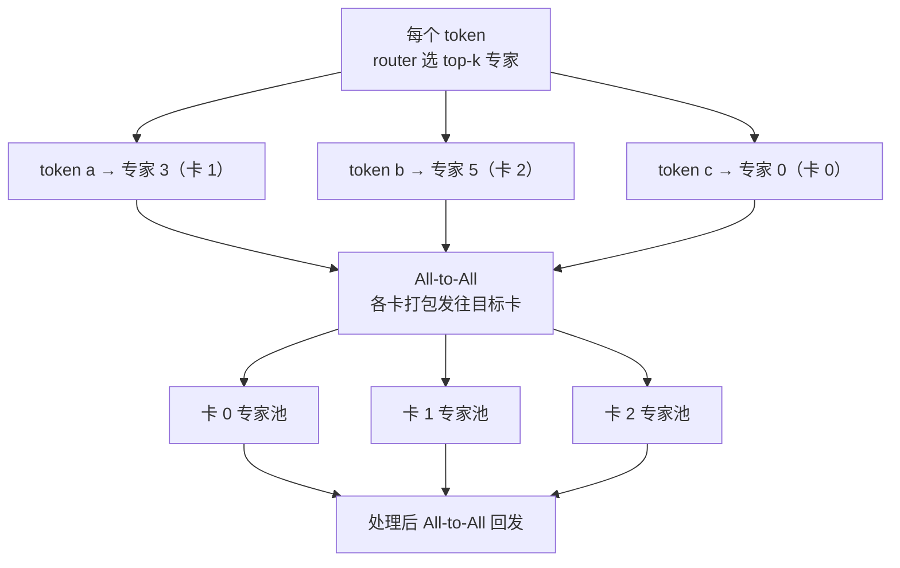

> **分布式训练系列 · 第 06 篇 / 共 08 篇**
>
> [05 序列并行](/2026/08/31/dist-train-05-sequence-parallel/) ← **本篇** → [07 集合通信地基](/2026/08/31/dist-train-07-collective-comm/)

**TL;DR**
> * **专家并行（EP）**是唯一为 **Mixture-of-Experts（MoE）**定制的并行：把 $E$ 个专家（FFN 子网络）**切到 $N$ 张卡**，每卡一组专家，token 按路由决策**现场搬到对应卡**——通信原语是 **All-to-All**（区别于 DP/TP 的 All-Reduce）。
> * 其他并行策略处理 MoE 都别扭：DP 会让每张卡复制全部专家（显存爆炸）；TP 会把每个专家切碎（专家太小，切分收益趋零）；PP 会把专家按层固定（路由跨节点就瘫痪）。**只有 EP 让"token 流动、专家不流动"。**
> * **核心数学**：设每 token 激活 $k$ 个专家、token 总数 $T$，则**搬运量 $\approx k \cdot T$ 个 token-专家对**。对上 All-to-All（每个 rank 同时向所有人收发不等量数据）体现为 $\sum_j |\text{从 }i\text{ 到 }j|$ 的通信矩阵。**路由越均衡，通信越接近最优；路由倾斜（某个专家过热），最热的卡成为瓶颈。**
> * **负载均衡是 EP 的唯一真正敌人**：专家过热 → 单卡 token 堆积 → All-to-All 带宽空耗 + 计算不并行 + 掉队者拖慢全局 step。解法：**辅助平衡损失（aux loss，router 惩罚过热专家）**、专家容量（expert capacity）限制、token drop / overflow 丢弃、以及 DeepSeek-V3 的 **细粒度专家 + 无辅助损失的负载均衡**（DSA 架构）。
> * **什么时候不该用 EP**：确认型（每个 token 只走一个专家）但专家很小 → TP 内并并行即可；路由对性能不敏感（如只有 2 个专家）→ 用 TP 更省事。**EP 的甜点区：专家数量大（几十~几千）、token 量大、专家间负载可控。**

---

## 1. MoE 复习：为什么 EP 是"刚需"

MoE 层 = 一个 router（$g(x)$ 把 token 分给 $k$ 个专家）+ $E$ 个专家 FFN（通常被 $k$ 个 token 复用）。经典配置（GShard / Switch Transformer）：$E \approx 64\mathord{\sim}512$，$k=1\mathord{\sim}2$。

- 单卡放不下全部 $E$ 个专家 → 需要跨卡。
- 每个 token **只需要 $k/E$ 的专家参与** → 每卡算力按需占用，理论上总 FLOPs 比稠密模型同规模低。
- 关键：**token 到专家的映射是动态的**（依赖输入），不可能像 TP/PP 那样静态切分 → **数据必须"跟着路由走"** → All-to-All。

**为什么 TP 对 MoE 无解**：TP 切的是矩阵，一个专家 FFN 就是个小矩阵（几十 MB），切 8 份后每份小到 kernel 都填不满 SM——**粒度太细**。TP 的 All-Reduce 也是全卡同步，而 MoE 是异步激活。**EP + TP（专家内做 TP、专家间做 EP）是现代超大 MoE（Switch、GShard、Mixtral、DeepSeek）的标准姿势。**

---

## 2. All-to-All：与 All-Reduce 的模型差异

| 通信原语 | 语义 | 数据量特征 | 用于 |
|---|---|---|---|
| All-Reduce | 所有卡得到**同一**结果 | 每卡发出 1 份、收回完整结果 | DP 梯度、TP 激活缝合 |
| All-to-All | 每卡把**不同数据**发往不同卡 | 数据**因人而异**，不对称 | MoE 路由搬运、序列切分 |

All-to-All 的性能模型（01 篇的通信-计算比公式同样适用）：

$$T_{\text{a2a}} \approx \underbrace{T_{\text{latency}} \cdot \log N}_{\text{延迟（树/多段转发）}} + \underbrace{\frac{\max_j |M_{i \to j}|}{B_{\text{net}}}}_{\text{最热目的卡的传输时间}}$$

**瓶颈是最热目的卡**：即使全局负载均衡，只要某卡的专家过热，$M_{i\to j}$ 就撑爆带宽。因此 All-to-All 的利用率正比于「路由分布 vs 硬件拓扑」的匹配度。

---

## 3. 负载均衡数学与工程手段

设专家 $e$ 收到的 token 数 $c_e \propto$ 路由概率 $p_e$。理想均匀：$p_e = 1/E$。

**辅助平衡损失**（Switch/GShard）：对每个专家加惩罚项

$$\mathcal{L}_{\text{aux}} = \alpha \cdot E \sum_{e=1}^{E} \bar{f}_e \cdot \bar{P}_e$$

其中 $\bar{f}_e$ = 专家 $e$ 实际分到的 token 比例（聚合），$\bar{P}_e$ = router 给专家 $e$ 的平均概率。当分布均匀时 $\sum_e \bar f_e \bar P_e = \frac{1}{E} \cdot E = 1$，达到下界；一旦倾斜（某专家概率高且分到的多），乘积陡增——**梯度推动 router 平摊概率**。$\alpha$ 通常是 0.01 量级（太大伤害模型质量，太小不管用）。

**专家容量（capacity）**：每个专家每轮最多处理 $C = \lceil k \cdot \frac{T}{E} \rceil$ 个 token，超出即丢弃（overflow）。它是"硬性负载均衡"——宁可丢 token 也不能让某卡撑爆。Switch 论文发现 overflow 通常 < 5%，几乎无损。

**DeepSeek-V3 的 DSA（DeepSeek Sparse Attention 的兄弟，指 DeepSeekMoE 的细粒度专家 + 共享专家）**：
- **细粒度专家**（把 1 个大专家拆成多个小专家）→ 路由粒度更细，倾斜更易平摊；
- **无辅助损失（aux-loss-free）**：不用 $\mathcal{L}_{\text{aux}}$ 惩罚项，而是每次路由时**对过热专家直接按概率退避**（bias toward & random routing to underloaded experts）——论文证明这在保持质量的同时把负载方差压到极低，配合 All-to-All 在 671B/37B 激活下跑出工业级 MFU。

> **工程要点**：EP 的负载均衡有三个层面——①router 训练时平衡（aux loss / DSA）；②通信时平衡（expert capacity + drop）；③集群时平衡（专家卡数 ≥ 每 token 的 top-k，保证任意路由都有卡接得住）。**三者必须同时做**。

---

## 4. EP 与 TP/DP 的组合（DeepSeek 的启示）

MoE 大模型的通用编排（DeepSeek-V3、Mixtral）：

- **专家内**：一个专家 FFN 尺寸仍大 → 内部再套 **TP=2/4**（专家权重分片）；
- **专家间**：$E$ 个专家（每组内 TP）分布在 $N_{\text{ep}}$ 张卡，**按"组"划 EP**；
- **非专家层**（attention / router / norm）：DP+TP 常规处理；
- **token 流动**：每层 MoE 前 All-to-All \* 2（去 + 回）。

**DeepSeek-V3 的关键扩展**：EP 粒度 = **单卡一个专家组**，attn 层不用 TP（用 attention 的 Multi-Head Latent Attention + Sparse Attention 把 KV 显存打下来），从而把 EP 的 All-to-All 限制在 NVLink 内——**这是"EP 必须贴近硬件拓扑"的范例**。

通信量估算（每 token 每专家往返）：设 $\bar{k}=2$、token $T$=1M、每 token 128B 向量：总搬运 $\approx 2 \times 2 \times 1M \times 128B = 512$ MB/层/step——**与 DP 的 $2\Phi$ 同量级，但好处是它只发生在 MoE 层**（attention 层仍是 DP/TP 的经济通信）。

---

## 5. 决策清单：何时 EP、何时用 TP/PP 处理 MoE

1. **专家数量大（$E \ge 32$）且每个专家中型** → EP。
2. **专家极少（$E \le 8$）或专家要全层共享**（每个 token 都访问） → 用 TP 切专家更简单（少一次 All-to-All）。
3. **路由天然偏斜**（如某些领域 token 集中） → 必须 aux loss / capacity，否则 EP 白搭。
4. **跨机 EP** → 只在 800Gbps+ 且路由近乎均匀时考虑；否则把 EP 锁单机（DeepSeek-V3 方案）。
5. **推理场景** → EP 同样适用（prefill 的 token 批量大），但注意整批的 All-to-All 延迟；可用 **EP 推理改进（如 DeepSeek 的 overlap 与调度）**。

---

## 6. 参考文献与延伸

1. Lepikhin et al. *GShard: Scaling Giant Models with Conditional Computation and Automatic Sharding*. arXiv:2006.16668（MoE 并行的原始 All-to-All + aux loss）
2. Fedus et al. *Switch Transformers: Scaling to Trillion Parameter Models with Simple and Efficient Sparsity*. arXiv:2101.03961（大 $E$ 的容量与负载均衡经验法则）
3. DeepSeek-AI. *DeepSeek-V3 Technical Report*. arXiv:2412.19437（无 aux-loss 负载均衡 + 细粒度专家）
4. Jiang et al. *Mixtral of Experts*. arXiv:2401.04088（8×7B 的 EP 实践与路由统计）
5. NVIDIA. *Megatron Core MoE 文档*: https://github.com/NVIDIA/Megatron-LM/tree/main/megatron/core/transformer/moe（EP 实现与 overlapping 机制）

---

*下一篇：[07 集合通信地基](/2026/08/31/dist-train-07-collective-comm/) —— Ring All-Reduce 的数学、NCCL 拓扑、从树到环的演进。*