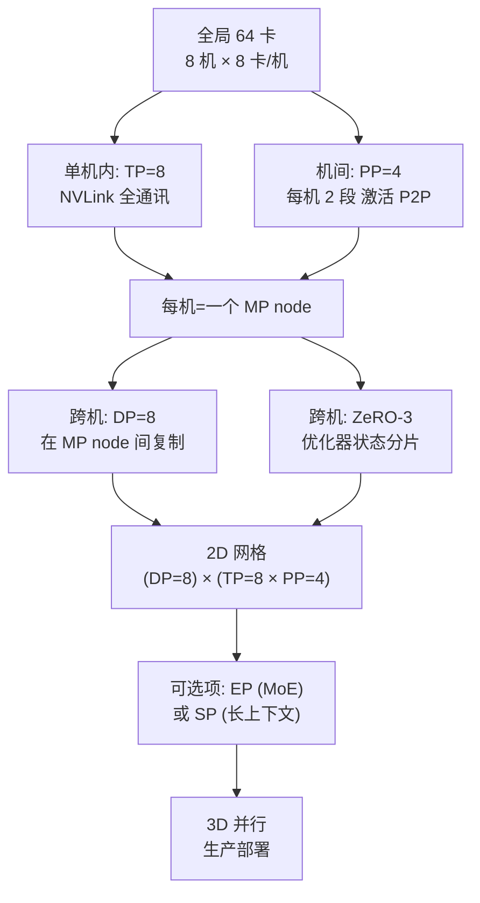

> **分布式训练系列 · 第 08 篇 / 共 08 篇**
>
> [07 集合通信地基](/2026/08/31/dist-train-07-collective-comm/) ← **本篇**（系列完结）→ [00 全景总览](/2026/08/31/dist-train-00-overview/)

**TL;DR**
> * 前 7 篇各解决一个轴，**真正的生产系统是"多维并行"的组合**：把 DP、ZeRO、TP、PP、EP、SP 按"通信必须靠近硬件"的纪律编排进 2D/3D 并行网格。**目标函数只有一句话：高频通信锁 NVLink，低频通信过跨机网络。**
> * **2D 并行＝（跨机 DP/ZeRO）×（单机 TP+PP，Megatron 式）**：最常见的工业配置是 **DP=跨机数 × TP=8 × PP=每机段数**。每个"TP×PP"进程组构成一张"模型并行卡组（MP node）"，DP 在组间复制——梯度 All-Reduce 只在组间发生。
> * **3D 并行＝在 2D 上再叠一层**：要么加 **EP**（超大 MoE），要么加 **SP**（超长上下文）。DeepSeek-V3 的 DSA 就是 3D 的教科书：ZeRO-3（DP 轴）+ TP/EP（域内）+ Sparse Attention（SP）。**关键等式**（全局卡数 = DP × TP × PP × EP 所用的轴乘积）：$N_{\text{total}} = N_{\text{DP}} \times N_{\text{TP}} \times N_{\text{PP}} \times N_{\text{EP}}$。
> * **编排顺序是性能的一半**：先决定"单机内并行组合"（TP+PP 或 TP+EP），再决定"跨机复制"（DP/ZeRO），最后决定"序列/上下文轴"（SP）。**模型规模 → 轴分配表**是唯一的仲裁官（见 §5 决策树）。
> * **最小可运行配置**：`Megatron-LM + DeepSpeed` 双引擎（Transformer 层用 Megatron TP/PP、优化器用 DeepSpeed ZeRO）是 700B 级训练的标准组合；本节给出**一套 64 卡可跑的 2D 配置的 step-by-step 清单**。



---

## 1. 为什么"组合"不是灵机一动，而是被带宽逼出来的

刷一遍前 7 篇的通信/带宽属性，唯一的硬约束浮现出来：

| 策略 | 通信位置 | 消息尺寸 | 频率 | 能跨机吗 |
|---|---|---|---|---|
| DP 梯度 All-Reduce | 每步 | $2\Phi$ | 每 step 1 次 | 勉强（ZeRO 后可跨） |
| ZeRO-2/3 | 每步 | $\sim \Phi/N$ ~ $3\Phi$ | 每 step 数阶段 | 可行（但通信不小） |
| TP | 每算子 | 激活级 | **每层数次** | **❌ 必须 NVLink** |
| PP | 段边界 | 激活（每微批） | **低频** | ✅ 最合适跨机 |
| EP | 每 MoE 层 | token 块 | 每层 2 次 | 勉强（DeepSeek 锁单机） |
| SP (Ring) | 每轮 | KV 块 | **串行每轮** | 延迟敏感，域内优先 |

**结论是铁律**：TP 永远在 NVLink 内；PP 是最好的跨机候选；DP/ZeRO 是"最灵活"的轴（任何地方都能加，只需管好梯度带宽）；EP 和 SP 要贴着拓扑。**于是最小可行组合 = (TP×PP) 组内 + (DP/ZeRO) 组间——这就是 2D 并行的全部秘密。**

---

## 2. 2D 并行：Megatron 式 (TP×PP) + (DP/ZeRO)

构造过程（8 机 × 8 卡，TP=8、PP=4、DP=8）：

1. **进程组划分**：`world_size=64`。定义两个组：
   - `model_parallel_group`（TP×PP）= 每 8 卡（1 机）一个 TP 组；每 4 机（32 卡）组成一条流水线；
   - `data_parallel_group` = 跨"模型并行组"的复制组（8 条流水线的同序号卡）。
2. **TP 通信**：只在 `model_parallel_group` 内 All-Reduce（NVLink，4 μs 级延迟）。
3. **PP 通信**：`p2p` 只发生在流水线相邻段（跨机，但低频大量）。
4. **梯度同步**：DP 的 All-Reduce 走 `data_parallel_group`（跨机那条链路），每步 1 次 $2\Phi$。
5. **ZeRO 合并 DP**：把 DP 的 All-Reduce 换成 ZeRO-2/3 的 reduce-scatter + all-gather（跨机带宽此刻被平摊成 $\Phi/N$）。

**为什么这样是对的（性能账）**：TP=8 × PP=4 时，跨机通信只有两条：PP 激活（每微批 1 次）与 DP 梯度（每步 1 次）。对比"无脑 DP=64"——梯度 All-Reduce 每步 $2\Phi$ 且**每台机器都要跨机传**，跨机带宽瞬间耗光。**编排的本质就是在带宽受限的边界上少发消息。**

> **Megatron-LM 的 `parallel-size` 三个 flag** 与上述一一对应：`--tensor-model-parallel-size 8`、`--pipeline-model-parallel-size 4`、`--data-parallel-size 2`（最后算出来的 DP = total / (TP*PP)，无需显式给出——**不用手填 `--data-parallel-size`**，分布在你配置的一组命令里；Tensor 并行与流水并行的大小和机制详见 Megatron 仓库注释）。

---

## 3. 3D 并行：何时叠 EP、何时叠 SP

**叠 EP（MoE 模型）**：TP/PP/DP 保持，把 MoE 层重排为"专家并行"：

- 非 MoE 层走 2D（TP×PP+DP）；
- MoE 层上的专家按 EP 放满一张机器（NVLink 内），All-to-All 只在机内；
- 于是轴数 = DP × TP × PP × EP(每卡专家数)。**DeepSeek-V3 的 671B：DP(×1) × TP(1) × EP(专家跨 32 机) + Sparse Attention（SP 轴）——摩尔定律式堆砌的教科书。**

**叠 SP（长上下文）**：上下文并行把序列切成 N 段放 N 卡，Ring Attention 在 N 之间流转 KV。位置：把 SP 组叠在 DP 复制之外——SP 卡组之间不再共享整个 batch，而是共享同一序列的不同片段。**SP × DP 的区别**：DP 复制模型、SP 复制模型但切序列。**用 SP 的前提**：单机 EP/TP 的 KV 显存已经打不下来长序列。

**优先级（工程上几乎总是这个顺序）**：TP → PP（或 EP）→ DP/ZeRO → SP。**先榨干单机，再上跨机，序列轴最后考虑。**

---

## 4. Megatron-LM + DeepSpeed 双引擎：最小可运行配置

最经典组合：**Megatron 负责 TP/PP（模型并行），DeepSpeed 负责 ZeRO（优化器/梯度分片）**。步骤清单（64 卡，TP=8、PP=2、ZeRO-2 分片梯度，DP=4）：

```bash
# 0. 环境准备
df -h /   # 确认工作目录在共享存储
which nccl-tests all_reduce_perf || echo "装 nccl-tests 并先验证带宽"  # 第 7 篇纪律

# 1. 数据切分（DeepSpeed/Megatron 都会自动处理，但确认每个 rank 数据不同）
#    megatron: --train-data /data/book-corpus --data-impl mmap

# 2. 单机验证（先跑 1 机 8 卡，把 TP=8 跑通、测显存）
# torchrun --nproc_per_node 8 \
#   pretrain_gpt.py --tensor-model-parallel-size 8 \
#   --pipeline-model-parallel-size 1 --micro-batch-size 4 ...

# 3. 上跨机（2 机 16 卡 → 2D：TP=8, PP=2 每机 1 段, DP=2）
# torchrun --nnodes 2 --nproc_per_node 8 --rdzv-endpoint host0:29500 \
#   pretrain_gpt.py \
#   --tensor-model-parallel-size 8 \
#   --pipeline-model-parallel-size 2 \
#   --num-microbatches 16 \
#   --optimizer adamw --fp16

# 4. 接 DeepSpeed 的 ZeRO-2 削减显存
#   --deepspeed --deepspeed_config ds_config.json
#   ds_config:  {"train_micro_batch_size_per_gpu": 4, "zero_optimization": {"stage": 2}}

# 5. 观测并迭代（按第 7 篇的检查单）
#   nvidia-smi dmon / monitoring GPU 利用率、网络吞吐（torch.profiler）
```

**关键迭代规则（照这个顺序排错）**：
1. 显存爆 → 加 ZeRO stage / 减 micro-batch / 开激活重计算；
2. 吞吐低 → 看是否是 TP 跑到了跨机（NCCL 日志会告诉你是 NVLink 还是 IB 链路）；
3. PP 气泡大 → 加 micro-batch（$m \ge 4\times PP$）；
4. 跨机网络吃满 → 加大 DP 复制数、减少单机内部机间流量（把 TP 再往单机挤）。

---

## 5. 决策树：给任意模型定一个并行方案

```
问 1：模型显存 vs 单卡显存？
  单卡够 → DDP（01）
  单卡不够 → 问 2
问 2：单卡放不下的是参数还是激活？
  参数 → ZeRO-2/3（02）→ 若 ZeRO-3 通信太大 → 加 TP（03）
  激活 → 序列并行 SP（05）或激活重计算
问 3：模型是 MoE 吗？
  是 → EP（06）+ 非 MoE 层 2D 编排
  否 → 问 4
问 4：单机一层 TP 之后还差多少？
  TP 到顶（TP=8）仍需跨机 → PP（04）把模型劈成流水线，DP/ZeRO 复制
  64 卡内能搞定 → 2D：(TP=8 × PP=k) × (DP/ZeRO)
问 5：还有余力？
  长上下文 → 叠 SP（05）
  MoE 大 routing → 叠 EP（06）
  预算到顶 → 用 07 篇的带宽账本再压一轮
```

**收尾一句话**：这一串决策的终点不是一个"配置文件"，而是**一张通信账本**——把每一步通信标上"在哪条链路上、多大、多频繁"，你的并行方案是否合格，账本一算即知。

---

## 6. 参考文献与延伸

1. Narayanan et al. *Efficient Large-Scale Language Model Training on GPU Clusters Using Megatron-LM*. arXiv:2104.04473（3D 并行与 1F1B 的系统化编排）
2. Rajbhandari et al. *ZeRO-Infinity*. arXiv:2104.07857（ZeRO + 跨机 + Offload 的一体化）
3. DeepSeek-AI. *DeepSeek-V3 Technical Report*. arXiv:2412.19437（3D + EP + Sparse Attention 的工业级实例）
4. NVIDIA. *Megatron-LM 配置说明*: https://github.com/NVIDIA/Megatron-LM#setup（所有 parallel-size flag 与前置条件）
5. Microsoft. *DeepSpeed 与 Megatron 集成的官方教程*: https://github.com/microsoft/DeepSpeed/tree/master/blogs/deepspeed/megatron
6. Habib & Kübler. *A Survey of Pipeline Parallelism*. arXiv:2401.08623（PP 的横向定位）

---

*系列完结，回到 [00 全景总览](/2026/08/31/dist-train-00-overview/)，或到 [我的博客首页](/) 浏览其他分类。*