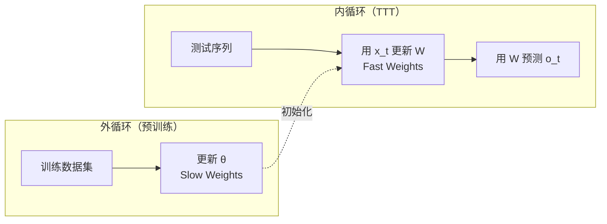
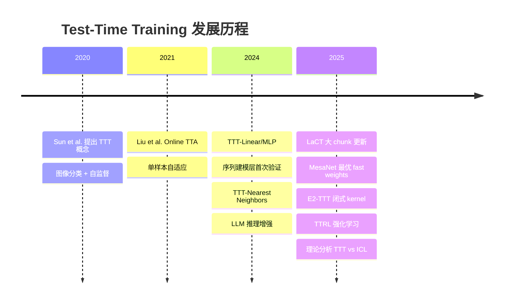
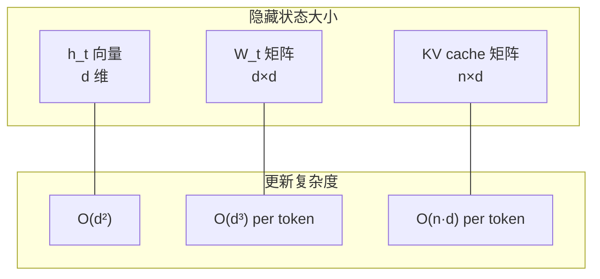
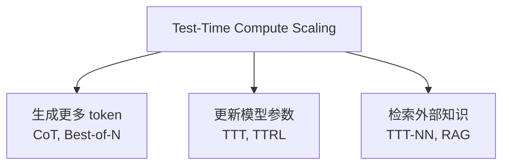

> **Test-Time Training 系列 · 第 00 篇 / 共 04 篇**
>
> 本系列面向**熟悉 Transformer、但不清楚"推理时还能训练"这个新范式**的读者：把 TTT"是什么、凭什么有效、数学上怎么构成、工程上怎么落地、和 DeltaNet/Mamba/Titans 有什么关系"讲透。按你之前确认的目标，这套调研落到了 `LLM算法` 分类。
>
> - 01 核心数学 + 序列建模层 → 02 LLM 推理增强 + 工程优化 → 03 相关工作全景 + 前沿 + 实践指南

**TL;DR**
> * **一句话**：TTT（Test-Time Training）不是"训练一个模型去预测"，而是**在推理时用当前测试输入本身，去训练一个能更好处理这个输入的模型**。它把传统"训练一次、推理冻结"的范式打破了。
> * **两个关键概念**：**Fast weights**（隐藏状态本身是一个小模型 $f_W$，测试与训练时都更新）和 **Slow weights**（预训练模型参数 $\theta$，测试时冻结）。推理时每来一个 token，就用它做一步梯度下降去更新 $W$。
> * **两条主线**：① **序列建模层**（TTT-Linear/MLP 替代 Transformer 的 attention，线性复杂度 + 固定内存 + 长上下文持续下降的 perplexity）；② **LLM 推理增强**（TTT-NN 检索近邻微调、TTT-FewShot 用示例训练、TTRL 用强化学习在 test time 训练）。
> * **本质是"把测试输入当数据集"**：$\ell(f_W(k_t), v_t) = \|f_W(k_t) - v_t\|^2$ 的自监督重建损失，驱动快权重在推理时持续"记忆"当前上下文的 key-value 关联。
> * **锚点**：如果只记住一句——**"TTT = 推理时用测试数据自己训练自己，隐藏状态就是一个可训练的模型"。**

---

## 1. 什么是 TTT：核心直觉

传统深度学习假设"训练好了就冻结"。TTT 打破这个限制——**每个测试样本都定义一个自己的学习问题**：

- 常规做法：预测 $f(x)$，其中 $f$ 是对所有训练样本平均最优的预测器。
- TTT 做法：先根据测试样本 $x$ 构造一个学习问题，训练一个模型 $f_x$（通常以预训练模型 $f$ 做初始化），再用 $f_x$ 去预测。

这个"训练"发生在 test time，因此得名 **Test-Time Training**。

**类比**：Slow weights 是"基础知识"，Fast weights 是"针对当前具体问题的解题技巧"。预训练教会模型基础知识，TTT 让模型在遇到具体问题时快速调整解题策略。

### 为什么需要 TTT？

| 问题 | 传统方法 | TTT 方法 |
|:---|:---|:---|
| **分布偏移** | 模型在训练分布上最优，测试分布可能偏移 | 推理时自适应，适应当前分布 |
| **上下文长度限制** | Transformer KV cache 线性增长，内存受限 | 固定大小的快权重矩阵，内存恒定 |
| **个性化需求** | 所有输入共享同一套权重 | 每个测试序列有独特的快权重 |

---

## 2. 两个关键概念

### Fast weights vs Slow weights

| 概念 | 符号 | 作用 | 更新时机 |
|:---|:---:|:---|:---|
| **Fast weights** | $W$ | 隐藏状态本身是一个小模型，编码当前上下文 | 训练和推理时都更新 |
| **Slow weights** | $\theta$ | 传统模型参数，编码通用知识 | 仅预训练时更新 |

### Self-Supervised Task

TTT 需要一个自监督任务来驱动快权重的更新。最常用的设计是 **reconstruction loss**：

$$
\ell(f_W(k_t), v_t) = \|f_W(k_t) - v_t\|^2
$$

$k_t$ 是当前 token 的 key，$v_t$ 是对应的 value，$f_W$ 是由快权重参数化的模型。

**直觉**：这个损失鼓励快权重学会"看到 key 就能预测出 value"，本质上是在测试时建立 key-value 的关联记忆。

---

## 3. TTT 的两条发展主线

### 路线一：TTT 作为序列建模层

将 TTT 设计成可以替代 Transformer self-attention 的 RNN 层，具有线性复杂度 $O(n)$。

| 工作 | 年份 | 核心贡献 |
|:---|:---:|:---|
| TTT-Linear/MLP | 2024 | 首次将 TTT 作为实用的序列建模层，125M-1.3B scale 验证 |
| LaCT | 2025 | 大 chunk 更新 + 滑动窗口注意力，提高硬件利用率 |
| MesaNet | 2025 | 最优 fast weight programming，使用共轭梯度法 |
| E2-TTT | 2025 | 闭式 scalar kernel，平衡表达性与效率 |

### 路线二：TTT 用于 LLM 推理增强

在现有 LLM 推理时，用测试输入更新 LoRA adapter 或内部表示。

| 工作 | 年份 | 核心贡献 |
|:---|:---:|:---|
| TTT-Nearest Neighbors | 2024 | 用最近邻检索构造训练数据，更新模型内部表示 |
| TTT-Few-Shot | 2025 | 用 few-shot prompt 中的示例训练，显著提升推理能力 |
| TTRL | 2025 | Test-Time Reinforcement Learning，用 RL 在 test time 训练 |
| VDS-TTT | 2025 | Verifier-Driven Sample Selection，用验证器选择伪标签 |

### 路线对比

| 维度 | 序列建模层 | LLM 推理增强 |
|:---|:---|:---|
| **目标** | 替代 Transformer，降低推理复杂度 | 增强现有 LLM 的推理能力 |
| **更新粒度** | 每个 token 一步梯度 | 整个测试序列（或 few-shot set） |
| **适用场景** | 长序列建模（100k+ tokens） | 复杂推理、数学问题、代码生成 |
| **代表模型** | TTT-MLP, MesaNet | LLaMA/DeepSeek + TTT |

---

## 4. 历史脉络

### 早期工作（2020-2023）

- **TTT (Sun et al., ICML 2020)**：在图像分类中引入 test-time training，用自监督任务（旋转预测）在测试时更新模型权重，提高分布偏移下的泛化能力。
- **Online TTA (Liu et al., 2021)**：将 TTT 扩展到 online setting，支持单样本自适应。

### 突破期（2024）

- **TTT-Linear/MLP (Sun et al., 2024)**：将 TTT 重新设计为序列建模层，证明在 125M-1.3B scale 下可以替代 Transformer 的 self-attention，同时保持线性复杂度。
- **TTT-Nearest Neighbors (Hardt & Sun, ICLR 2024)**：在 LLM 推理中使用 TTT，通过最近邻检索构造训练数据，更新模型内部表示。

### 成熟期（2025）

- **工程优化**：LaCT、MesaNet、E2-TTT 解决了 TTT 的硬件利用率和内存 I/O 问题。
- **理论分析**：Gozeten et al. (2025) 证明 TTT 可以减少 in-context learning 的样本复杂度。
- **应用扩展**：TTRL、VDS-TTT 将 TTT 与强化学习、验证器驱动方法结合。

---

## 5. 统一视角：所有序列建模层 = 隐藏状态 + 更新规则

TTT 的一个重要贡献是提供了一个统一视角：**所有序列建模层都可以表示为"隐藏状态 + 更新规则"**。

| 模型 | 隐藏状态 | 更新规则 |
|:---|:---|:---|
| **Transformer** | KV cache (动态增长) | 追加新 KV 对 |
| **RNN** | 向量 $h_t \in \mathbb{R}^d$ | $h_t = \tanh(W h_{t-1} + x_t)$ |
| **Mamba** | 向量 $h_t \in \mathbb{R}^d$ | 选择性状态空间更新 |
| **TTT** | 矩阵 $W_t \in \mathbb{R}^{d \times d}$ | 梯度下降：$W_t = W_{t-1} - \eta \nabla \ell$ |
| **DeltaNet** | 矩阵 $\Phi_t \in \mathbb{R}^{d \times d}$ | Delta rule：$\Phi_t = \gamma \Phi_{t-1} + \beta v_t k_t^\top$ |

**关键权衡**：
- RNN 用固定大小向量，表达能力有限
- Transformer 用 KV cache，表达能力强但内存线性增长
- TTT 用 $d \times d$ 矩阵，固定大小且表达能力强，但更新代价高

---

## 6. 与其他 Test-Time Compute 方法的关系

TTT 是 **test-time compute scaling** 家族的一员：

| 方法 | 核心思想 | 计算代价 |
|:---|:---|:---|
| **Chain-of-Thought** | 让模型"思考"更多步骤 | 生成更多 token |
| **Best-of-N** | 生成 N 个回答，选最好的 | N 倍生成 + 验证 |
| **TTT** | 用测试输入训练模型 | 梯度更新（内循环） |
| **TTRL** | 用 RL 在 test time 训练 | 策略梯度更新 |

---

## 7. 关键术语表

| 术语 | 英文 | 定义 |
|:---|:---|:---|
| 快权重 | Fast Weights | 在 test time 更新的参数，编码当前上下文 |
| 慢权重 | Slow Weights | 预训练参数，test time 冻结 |
| 内循环 | Inner Loop | TTT 的梯度更新过程 |
| 外循环 | Outer Loop | 预训练过程，学习 slow weights |
| 自监督任务 | Self-Supervised Task | 驱动 fast weights 更新的损失函数 |
| 对偶形式 | Dual Form | TTT 的高效计算等价形式，提高 5x 训练速度 |

### 参考论文

1. Sun et al. *Learning to (Learn at Test Time): RNNs with Expressive Hidden States* — arXiv:2407.04620（序列建模层，01 篇核心）
2. Hardt & Sun. *Test-Time Training on Nearest Neighbors for Large Language Models* — ICLR 2024, arXiv:2305.18466（LLM 推理增强，02 篇核心）
3. Behrouz et al. *Titans: Learning to Memorize at Test Time* — arXiv:2501.00663（遗忘机制 + 动量，03 篇）
4. Wang et al. *Test-Time Regression: A Unifying Framework* — arXiv:2501.12352（统一视角，03 篇）

*下一篇：[01 核心数学与序列建模层](/2026/09/02/ttt-01-math-sequence/) —— 深入 TTT 的数学形式化、内/外循环推导、TTT-Linear/MLP 实现细节、对偶形式为什么能加速 5 倍。*
