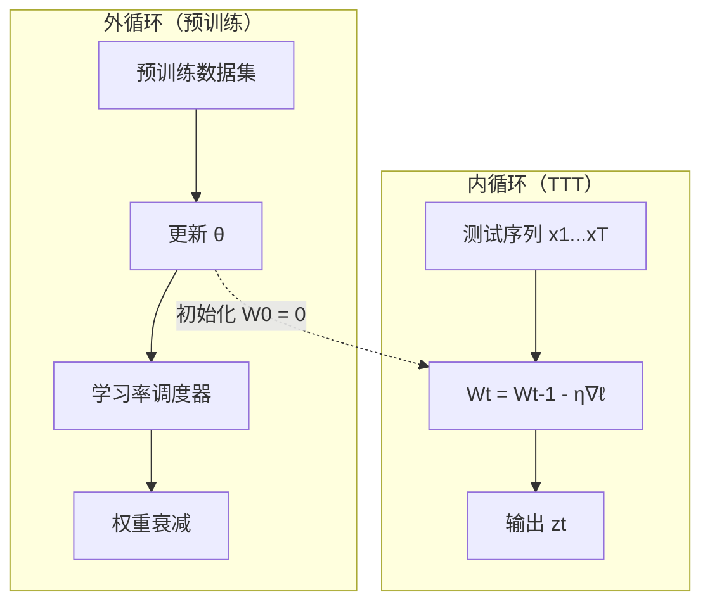
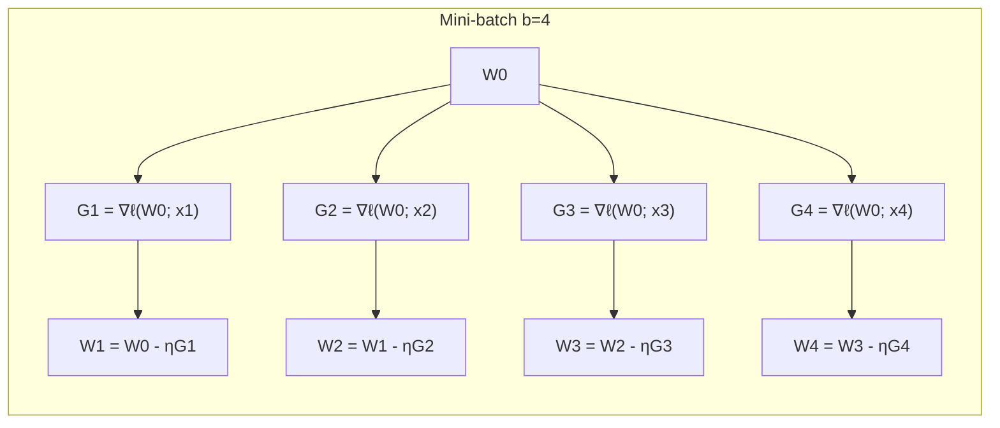
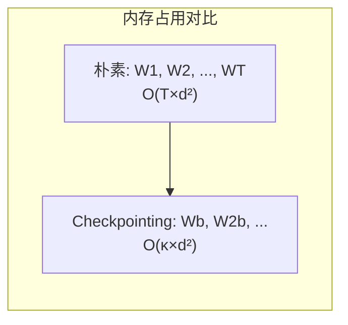

> **Test-Time Training 系列 · 第 01 篇 / 共 04 篇**
>
> [00 全景总览](/2026/09/02/ttt-00-overview/) ← **本篇** → [02 LLM 推理增强与工程优化](/2026/09/02/ttt-02-llm-inference/)
>
> 本篇把 TTT 的**数学地基**讲透：统一框架、fast/slow weights 的内外循环、TTT-Linear/MLP 的推导、为什么朴素实现无法并行、mini-batch 与对偶形式如何救场。**数学推导扎实、生产优化有理有据**是主线。

**TL;DR**
> * **统一框架**：所有序列建模层 = 隐藏状态 + 更新规则。TTT 的创新是让隐藏状态 $W_t \in \mathbb{R}^{d\times d}$ 本身是一个可训练模型，更新规则是一步梯度下降。
> * **TTT-Linear 更新式**：$W_t = W_{t-1} - 2\eta (W_{t-1} k_t - v_t) k_t^\top$，来自 reconstruction loss $\ell = \|W k_t - v_t\|^2$ 的梯度。这本质上是对 Hebbian 学习的修正版——"预测错了就调权重，让下次看到该 key 时预测更准"。
> * **内外循环**：内循环用单个 token 更新 fast weights $W$；外循环用整个序列的 next-token prediction 更新 slow weights $\theta$。外循环不学"怎么做 TTT"，只学"如何初始化/设计架构让 TTT 更有效"。
> * **并行是最大工程难点**：朴素更新 $W_t$ 依赖 $W_{t-1}$，无法并行。**Mini-batch TTT**（两两通道：cumsum + gradient）+ **对偶形式**（把顺序外积变成矩阵乘法）把训练加速 **5 倍以上**。
> * **梯度 checkpointing**：TTT 隐藏状态是 $W_t$，别存全部 $W_1\dots W_T$，只存每个 mini-batch 末端的 $W$（$\kappa=T/b$ 个），内存从 $O(Td^2)$ 降到 $O(\kappa d^2)$。

---

## 1. 统一框架：隐藏状态 + 更新规则

所有序列建模层都可以表示为：

$$
s_t = \text{Update}(s_{t-1}, x_t) \quad \text{(更新规则)}
$$
$$
z_t = \text{Output}(s_t, x_t) \quad \text{(输出规则)}
$$

其中 $s_t$ 是隐藏状态，$x_t$ 是当前输入 token，$z_t$ 是输出。

| 模型 | 隐藏状态 $s_t$ | 更新规则 | 输出规则 |
|:---|:---|:---|:---|
| **RNN** | $h_t \in \mathbb{R}^d$ | $h_t = \tanh(W_h h_{t-1} + W_x x_t)$ | $y_t = W_y h_t$ |
| **Transformer** | KV cache $(K_{1:t}, V_{1:t})$ | 追加 $(k_t, v_t)$ | $\text{softmax}(q_t K_t^\top) V_t$ |
| **TTT** | $W_t \in \mathbb{R}^{d \times d}$ | $W_t = W_{t-1} - \eta \nabla \ell(W_{t-1}; x_t)$ | $z_t = f_{W_t}(x_t)$ |

**TTT 的核心创新**：让隐藏状态 $W_t$ 本身是一个可学习的模型，更新规则是一步梯度下降。

---

## 2. TTT 数学形式化

### 符号定义

| 符号 | 含义 | Shape |
|:---:|:---|:---:|
| $x_t$ | 第 $t$ 个 token 的输入表示 | $(d,)$ |
| $q_t, k_t, v_t$ | Query, Key, Value 投影 | $(d,)$ |
| $W_t$ | Fast weights（隐藏状态） | $(d, d)$ |
| $f_W$ | 由 $W$ 参数化的模型 | $\mathbb{R}^d \to \mathbb{R}^d$ |
| $\eta$ | 内循环学习率 | 标量 |
| $\ell$ | 自监督损失函数 | 标量 |

### TTT-Linear（线性 fast weights）

**输出规则**：用当前快权重 $W_t$ 处理 query

$$
z_t = f_{W_t}(q_t) = W_t q_t
$$

**更新规则**：用当前 token 做一步梯度下降

$$
W_t = W_{t-1} - \eta \nabla_W \ell(f_{W_{t-1}}(k_t), v_t)
$$

其中自监督损失为 reconstruction loss：

$$
\ell(f_W(k_t), v_t) = \|W_t k_t - v_t\|^2
$$

展开梯度：

$$
\nabla_W \ell = 2(W_t k_t - v_t) k_t^\top
$$

**完整更新**：

$$
\boxed{W_t = W_{t-1} - 2\eta (W_{t-1} k_t - v_t) k_t^\top}
$$

**直觉理解**：这个更新相当于 Hebbian 学习的修正版——如果 $W_{t-1} k_t$ 不能准确预测 $v_t$，就调整 $W$ 使得下次看到 $k_t$ 时能更好地预测 $v_t$。

### TTT-MLP（非线性 fast weights）

**隐藏状态**：两层 MLP 的权重

$$
W_t = \{W_t^{(1)}, b_t^{(1)}, W_t^{(2)}, b_t^{(2)}\}
$$

**输出规则**：

$$
z_t = f_{W_t}(q_t) = W_t^{(2)} \cdot \text{GELU}(W_t^{(1)} q_t + b_t^{(1)}) + b_t^{(2)}
$$

**更新规则**：通过反向传播计算梯度

$$
W_t^{(i)} = W_{t-1}^{(i)} - \eta \nabla_{W^{(i)}} \ell(f_{W_{t-1}}(k_t), v_t)
$$

**梯度计算**（链式法则）：

$$
\frac{\partial \ell}{\partial W^{(2)}} = (f_{W_{t-1}}(k_t) - v_t) \cdot h_1^\top
$$

$$
\frac{\partial \ell}{\partial W^{(1)}} = \left((f_{W_{t-1}}(k_t) - v_t) \cdot (W^{(2)})^\top \cdot \text{GELU}'(z_1)\right) k_t^\top
$$

其中 $h_1 = \text{GELU}(W^{(1)} k_t + b^{(1)})$ 是第一层的激活。

---

## 3. 外循环与内循环

TTT 有两层嵌套的学习过程：

| 维度 | 内循环（TTT） | 外循环（预训练） |
|:---|:---|:---|
| **数据** | 单个 token $x_t$ | 整个序列 $x_1, \dots, x_T$ |
| **训练集** | 当前测试序列 | 预训练数据集 |
| **目标** | Reconstruction loss $\ell$ | Next-token prediction |
| **参数** | Fast weights $W$ | Slow weights $\theta$ |



### 元训练（Meta-Training）

外循环的目标是学习 slow weights $\theta$，使得内循环的 TTT 能更有效：

$$
\theta^* = \arg\min_\theta \sum_{\text{sequences}} \mathcal{L}_{\text{ntp}}(f_\theta(x_1, \dots, x_T))
$$

**关键洞察**：外循环不需要学习如何做 TTT（内循环会自己学），只需要学习如何**初始化**和**架构设计**使得 TTT 更有效。

### 学习率与初始化

| 参数 | TTT-Linear | TTT-MLP |
|:---|:---:|:---:|
| 内循环基础学习率 $\eta_{\text{base}}$ | 1.0 | 0.1 |
| 外循环学习率 | 与 Transformer 相同 | 与 Transformer 相同 |
| $W_0$ 初始化 | 0 | 0 |
| 学习率预热 | 无 | 内循环前 10% 步数 |

**为什么 $W_0 = 0$？** 因为在 test time 开始时，模型还没有看到任何上下文信息，用零初始化是最中性的选择。外循环会学习如何设计 $f$ 的结构，使得从零开始训练能快速收敛。

---

## 4. Mini-Batch TTT：并行化

### 朴素实现的问题

朴素 TTT 的更新是**顺序的**：$W_t$ 依赖 $W_{t-1}$，无法并行计算。

$$
W_1 \to W_2 \to W_3 \to \cdots \to W_T
$$

### Mini-Batch 策略

将序列分成大小为 $b$ 的 mini-batch，在每个 batch 内并行计算梯度：

$$
G_t = \nabla_W \ell(W_{t'} ; x_t), \quad t' = t - (t \bmod b)
$$

其中 $t'$ 是当前 mini-batch 的起始时间步。

**信息传递通道**：
1. **Cumsum 通道**：$W_t = W_{t-1} - \eta G_t$，始终活跃
2. **Gradient 通道**：$G_t$ 的计算依赖 $W_{t'}$，仅在 mini-batch 边界活跃



**权衡**：$b$ 越大，并行度越高，但每个 token 的梯度计算越不精确（用的是 mini-batch 起始的 $W_{t'}$ 而不是 $W_{t-1}$）。实验表明 $b=16$ 是最佳平衡点。

---

## 5. 对偶形式（Dual Form）

### 动机

朴素实现需要 materialize 中间状态 $G_1, \dots, G_b$ 和 $W_1, \dots, W_b$，这在 $d$ 很大时会导致严重的内存 I/O 瓶颈。

### 核心观察

我们**不需要**显式计算 $G_t$ 和 $W_t$，只要能直接得到最终的 $W_b$ 和输出 $z_1, \dots, z_b$。

### TTT-Linear 的对偶形式

**计算 $W_b$**（batch 终止时的权重）：

$$
W_b = W_0 - 2\eta \sum_{t=1}^b (W_0 x_t - x_t) x_t^\top = W_0 - 2\eta (W_0 X - X) X^\top
$$

其中 $X = [x_1, \dots, x_b] \in \mathbb{R}^{d \times b}$。

**计算输出 $Z = [z_1, \dots, z_b]$**：

定义累积梯度影响 $\Delta = [\delta_1, \dots, \delta_b]$，其中：

$$
\delta_t = \sum_{s=1}^t (W_0 x_s - x_s) x_s^\top x_t
$$

可以证明：

$$
\Delta = (W_0 X - X) \cdot \text{mask} \cdot X^\top X
$$

其中 $\text{mask}$ 是上三角 mask（类似 attention mask，但用 0 而不是 $-\infty$）。

最终输出：

$$
Z = W_0 X - 2\eta \Delta
$$

### 对偶形式的优势

| 方面 | Primal form | Dual form |
|:---|:---|:---|
| **内存** | 需要存储 $G_t, W_t$ | 只需存储最终 $W_b$ |
| **计算** | $O(b \times d^2)$ | $O(b \times d^2) + O(b^2 \times d)$ |
| **硬件利用率** | 低（顺序依赖） | 高（矩阵乘法） |
| **实际速度** | 基准 | 5x 加速（JAX 实现） |

**为什么更快？** 对偶形式将顺序的外积运算转化为矩阵乘法，更好地利用 GPU/TPU 的并行计算单元。

---

## 6. 内存优化：Gradient Checkpointing

### 问题

TTT 层的隐藏状态是 $W_t$，标准实现会保存 $W_1, \dots, W_T$ 用于反向传播，内存占用 $O(T \times d^2)$。

### 解决方案

使用 **time-wise gradient checkpointing**：

1. 只保存每个 mini-batch 结束时的 $W$（共 $\kappa = T/b$ 个 checkpoint）
2. 反向传播时，从 checkpoint 重新计算中间状态
3. 内存从 $O(T \times d^2)$ 降到 $O(\kappa \times d^2)$



---

## 7. TTT vs Self-Attention 的理论对比

| 维度 | Self-Attention | TTT |
|:---|:---|:---|
| **计算复杂度** | $O(n^2 \times d)$ | $O(n \times d^2)$ |
| **内存复杂度** | $O(n \times d)$ KV cache | $O(d^2)$ 固定 |
| **长上下文能力** | KV cache 线性增长 | 固定大小，理论上无限 |
| **表达能力** | 非参数化（依赖上下文长度） | 参数化（依赖模型容量） |
| **硬件友好度** | 高（矩阵乘法） | 中（需要对偶形式优化） |

**关键洞察**：当 $n > d$ 时（长序列），TTT 的 $O(n \times d^2)$ 优于 Self-Attention 的 $O(n^2 \times d)$。

---

## 8. 实验验证（Sun et al. 2024）

### 性能对比（1.3B scale）

| 模型 | 8k PPL | 16k PPL | 32k PPL | 64k PPL |
|:---|:---:|:---:|:---:|:---:|
| Transformer | 10.89 | 10.41 | 10.11 | 9.94 |
| Mamba | 10.97 | 10.62 | 10.68 | 10.71 |
| **TTT-Linear** | 10.85 | 10.34 | 10.01 | 9.83 |
| **TTT-MLP** | 10.81 | 10.28 | 9.92 | 9.74 |

**关键发现**：
- TTT-Linear 和 TTT-MLP 在所有上下文长度上都匹配或超越 Transformer
- Mamba 在 16k 之后 perplexity 停止下降，而 TTT 持续下降
- TTT-MLP 表现最好，但 memory I/O 挑战更大

---

## 9. 变量映射表

| 数学符号 | 代码变量 | Shape | 描述 |
|:---:|:---|:---:|:---|
| $x_t$ | `XK_mini_batch` | (B, nh, K, d) | 输入 token 的 key 投影 |
| $q_t$ | `XQ_mini_batch` | (B, nh, K, d) | Query 投影 |
| $k_t$ | `XK_mini_batch` | (B, nh, K, d) | Key 投影 |
| $v_t$ | `XV_mini_batch` | (B, nh, K, d) | Value 投影 |
| $W_t$ | `W1_init` | (B, nh, d, d) | Fast weights |
| $z_t$ | `XQW_mini_batch` | (B, nh, K, d) | 输出 |
| $\eta$ | `eta_mini_batch` | (B, nh, K, 1) | 学习率 |
| $b$ | `mini_batch_size` | 标量 | Mini-batch 大小 |

---

## 10. Lab Exercise

### 实验 1：验证 TTT-Linear 更新公式（primal vs dual）

```python
import torch

# 设置
d = 64
B, nh, K = 2, 8, 16  # batch, num_heads, mini_batch_size
eta = 0.1

# 初始化
W = torch.randn(B, nh, d, d) * 0.01
XK = torch.randn(B, nh, K, d)  # keys
XV = torch.randn(B, nh, K, d)  # values

# Primal form: 顺序更新
W_primal = W.clone()
for t in range(K):
    grad = 2 * (W_primal @ XK[:,:,t] - XV[:,:,t]).unsqueeze(-1) * XK[:,:,t:t+1].transpose(-1,-2)
    W_primal = W_primal - eta * grad

# Dual form: 矩阵乘法
X = XK.transpose(-1, -2)  # (B, nh, d, K)
WX = W @ X  # (B, nh, d, K)
W_dual = W - 2 * eta * (WX - X) @ X.transpose(-1, -2)

# 验证两者等价（在数值误差内）
print(f"Max diff: {(W_primal - W_dual).abs().max().item():.6f}")
# 预期输出: 接近 0 的一个小值（如 1e-6 量级）
```

### 实验 2：Mini-Batch 大小对性能的影响

```python
# 测试不同 mini-batch 大小的 perplexity
for b in [1, 4, 8, 16, 32, 64]:
    model = TTTModel(mini_batch_size=b)
    ppl = evaluate(model, val_data)
    print(f"b={b:2d}: PPL={ppl:.2f}")
# 预期：b=1 最好但最慢，b=16 最佳平衡
```

### 参考论文

- Sun et al. *Learning to (Learn at Test Time): RNNs with Expressive Hidden States* — arXiv:2407.04620
- 官方实现：[ttt-lm-pytorch](https://github.com/test-time-training/ttt-lm-pytorch)、[ttt-lm-kernels](https://github.com/test-time-training/ttt-lm-kernels)

*下一篇：[02 LLM 推理增强与工程优化](/2026/09/02/ttt-02-llm-inference/) —— TTT-NearestNeighbors、TTT-FewShot、LoRA-TTT、chunk 更新策略与 GPU 落地。*
