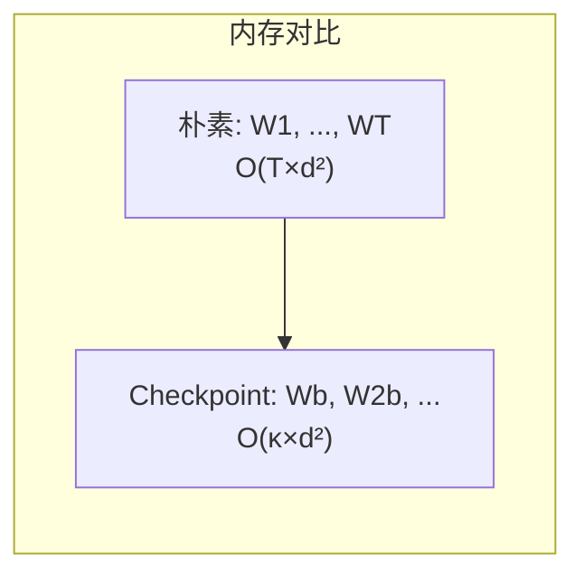
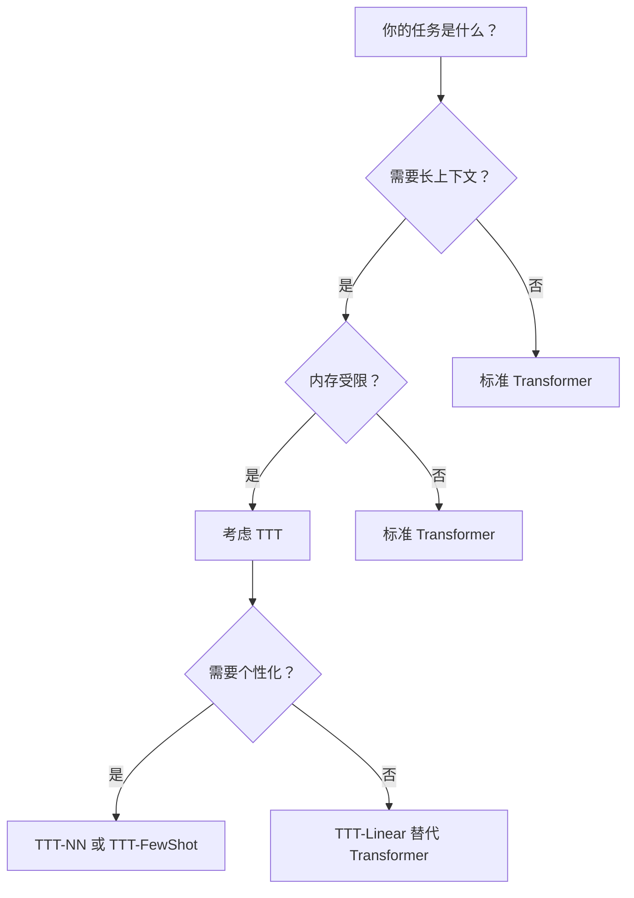

> **Test-Time Training 系列 · 第 02 篇 / 共 04 篇**
>
> [01 核心数学与序列建模层](/2026/09/02/ttt-01-math-sequence/) ← **本篇** → [03 相关工作、前沿与实践](/2026/09/02/ttt-03-landscape-practical/)
>
> 上一篇讲的是"TTT 作为架构（替换 attention）"，本篇讲**"在已有 LLM 上做 test-time 微调"**这套应用路线，以及背后的工程优化（为什么 token-wise 更新慢、chunk 怎么救）。

**TL;DR**
> * **TTT-NN（Hardt & Sun, ICLR 2024）**：为每个测试输入从约 200M 向量的索引里检索近邻，用标准训练设置微调模型。**只用 20 个邻居、每个 1 步梯度**，就能在 22 个语言任务上大幅降低 bpb；代码生成任务最高降 **60%+**。
> * **为什么不用 RAG 那一套**：RAG 要把检索内容塞进上下文，attention 二次复杂度随检索量增长；**TTT-NN 是把模型权重微调了**，内存固定、无需在训练时也用检索。
> * **TTT-FewShot**：把 few-shot prompt 的示例当训练数据，在推理前微调。理论证明（Gozeten et al. 2025）TTT 能把 ICL 所需样本从 $\Omega(d)$ 降到 $o(d)$，实测用 200 示例达到标准 ICL 用 1000 示例的效果。
> * **工程核心矛盾**：token-wise TTT 硬件利用率常 **<5% FLOPs**。解法是 **chunk-wise 更新**（一个 chunk 只更新一次 fast weights，如 $C=512$）+ **对偶形式**（顺序外积 → 矩阵乘法，5x 加速）。
> * **混合精度要点**：matmul 用 bf16/fp16（吃 Tensor Core），但**快权重更新、梯度累积、LayerNorm 必须 fp32**，否则数值不稳定。

---

## 1. 概述

TTT 在 LLM 推理中的应用与序列建模层不同：**不改变模型架构，而是在推理时用测试输入微调现有模型**。主要方法包括：

1. **TTT-Nearest Neighbors**：用检索到的近邻训练
2. **TTT-Few-Shot**：用 few-shot prompt 中的示例训练
3. **LoRA-TTT**：只更新 LoRA adapter 参数
4. **TTRL**：用强化学习在 test time 训练

---

## 2. TTT-Nearest Neighbors (TTT-NN)

### 核心思想

对于每个测试输入，从大规模索引中检索其最近邻，然后用这些近邻微调模型：


### 系统架构

| 组件 | 实现 | 规模 |
|:---|:---|:---|
| **索引** | FAISS 分布式索引 | ~200M 向量，1TB 数据 |
| **嵌入模型** | RoBERTa-large | 355M 参数 |
| **基座模型** | GPT-2/GPT-Neo | 117M-1.3B 参数 |
| **检索时间** | 单次查询 | ~1 秒 |

### 算法流程

```python
# 伪代码
def ttt_nn(test_input, model, index, num_neighbors=20):
    # 1. 检索近邻
    neighbors = index.search(test_input, k=num_neighbors)
    
    # 2. 微调模型（每个邻居 1 步梯度）
    for neighbor in neighbors:
        loss = compute_lm_loss(model, neighbor)
        loss.backward()
        optimizer.step()
        optimizer.zero_grad()
    
    # 3. 用微调后的模型处理测试输入
    output = model(test_input)
    return output
```

### 实验结果

| 模型 | 任务 | 无 TTT | TTT-NN (20 neighbors) | 提升 |
|:---|:---|:---:|:---:|:---:|
| GPT-2 (117M) | Pile All | 1.07 | 0.85 | **-20.6%** |
| GPT-2 (117M) | GitHub | 1.95 | 0.51 | **-73.8%** |
| GPT-2 (117M) | Enron | 1.44 | 0.72 | **-50.0%** |
| GPT-Neo (1.3B) | Pile All | 0.95 | 0.83 | **-12.6%** |

**关键发现**：
- 即使只用 20 个邻居、每个只训练 1 步，也能显著提升性能
- 对代码生成任务提升最大（GitHub: -73.8%）
- 小模型 + TTT 可以接近大模型的性能

### 与 RAG 的对比

| 维度 | RAG (Retrieval-Augmented Generation) | TTT-NN |
|:---|:---|:---|
| **训练需求** | 需要训练时也使用检索 | 无需特殊训练 |
| **上下文长度** | 线性增长（检索内容加入 prompt） | 固定（微调模型权重） |
| **计算复杂度** | $O(n^2)$ attention on context | $O(k \times \text{forward+backward})$ |
| **内存占用** | KV cache 线性增长 | 固定 |

---

## 3. TTT-Few-Shot

### 核心思想

用 few-shot prompt 中的示例作为训练数据，在推理前微调模型：

$$
\theta_{\text{test}} = \theta - \eta \sum_{i=1}^k \nabla_\theta \mathcal{L}(x_i, y_i)
$$

其中 $(x_i, y_i)$ 是 prompt 中的示例，$k$ 是示例数量。

### 理论保证

Gozeten et al. (2025) 证明：

**定理**：对于线性 Transformer，TTT 可以将 in-context learning 所需的样本数从 $\Omega(d)$ 降低到 $o(d)$。

**直觉**：标准 ICL 需要足够多的示例来"覆盖"任务空间，而 TTT 通过直接优化模型权重来"记忆"任务，所需示例更少。

### 实验验证

| 设置 | 标准 ICL | TTT (1 step) | TTT (5 steps) |
|:---|:---:|:---:|:---:|
| 200 示例 | 0.45 | 0.72 | 0.78 |
| 1000 示例 | 0.72 | 0.78 | 0.81 |

**结论**：TTT 用 200 示例就能达到标准 ICL 用 1000 示例的效果（5x 减少）。

---

## 4. LoRA-TTT

### 核心思想

不更新整个模型，只更新低秩 adapter（LoRA）：

$$
\theta_{\text{test}} = \theta + BA
$$

其中 $B \in \mathbb{R}^{d \times r}$, $A \in \mathbb{R}^{r \times d}$, $r \ll d$。

### 优势

| 维度 | Full TTT | LoRA-TTT |
|:---|:---|:---|
| **可训练参数** | 全部 $\theta$ | 仅 $B, A$（~0.1%） |
| **内存占用** | 高 | 低 |
| **训练速度** | 慢 | 快 |
| **效果** | 最好 | 接近 full TTT |

### 实现要点

```python
# LoRA-TTT 实现
class LoRA_TTT(nn.Module):
    def __init__(self, model, rank=8):
        self.model = model
        self.lora_A = nn.Linear(d, rank, bias=False)
        self.lora_B = nn.Linear(rank, d, bias=False)
        
    def ttt_forward(self, x):
        h = self.model(x)                    # 原始前向
        delta = self.lora_B(self.lora_A(x))  # LoRA 增量
        return h + delta
    
    def ttt_update(self, x, y, lr=1e-4):
        loss = cross_entropy(self.ttt_forward(x), y)
        loss.backward()
        # 只更新 LoRA 参数
        self.lora_A.weight.data -= lr * self.lora_A.weight.grad
        self.lora_B.weight.data -= lr * self.lora_B.weight.grad
```

---

## 5. 工程优化

### 问题：Token-wise 更新的瓶颈

朴素 TTT 逐 token 更新，导致：

1. **低并行度**：每个 token 的梯度计算是顺序的
2. **低硬件利用率**：$<5\%$ FLOPs 效率
3. **内存 I/O 瓶颈**：频繁读写 $W_t$

### Chunk-wise 更新（LaCT 范式）

将序列分成大 chunk（如 $C=512$），每个 chunk 做一次更新：

$$
G^{[r]} = -\nabla_W \left(\sum_{t=1}^C \eta_t \mathcal{L}(f_{W^{[r-1]}}(k_t), v_t)\right)
$$

$$
W^{[r]} = W^{[r-1]} + \beta M^{[r-1]} + G^{[r]}
$$

**优势**：
- 并行度：$C$ 个 token 可以并行计算梯度
- 硬件利用率：矩阵乘法充分利用 GPU/TPU
- 内存效率：只保存 $T/C$ 个 checkpoint

### 对偶形式（Dual Form）

将顺序的外积运算转化为矩阵乘法：

| 操作 | Primal form | Dual form |
|:---|:---|:---|
| **计算 $W_b$** | 顺序更新 $b$ 次 | 一次矩阵乘法 |
| **计算输出** | 顺序依赖 | 矩阵乘法 + mask |
| **内存** | 存储 $G_t, W_t$ | 只存最终 $W_b$ |
| **速度** | 基准 | 5x 加速 |

### 混合精度训练

TTT 的数值稳定性需要注意：

| 部分 | 精度 | 原因 |
|:---|:---|:---|
| **矩阵乘法** | bf16/fp16 | 利用 Tensor Core |
| **梯度累积** | fp32 | 防止数值下溢 |
| **LayerNorm** | fp32 | 数值稳定性 |
| **快权重更新** | fp32 | 防止精度损失 |

### Gradient Checkpointing

TTT 的隐藏状态是 $W_t$，标准实现保存所有中间状态，内存 $O(T \times d^2)$。

**优化**：只保存每个 mini-batch 结束时的 $W$，内存降到 $O(\kappa \times d^2)$，其中 $\kappa = T/b$。



### GPU Kernel 优化

TTT-MLP 的 GPU kernel 实现要点（参考 [ttt-lm-kernels](https://github.com/test-time-training/ttt-lm-kernels)）：

| 技术 | 实现 |
|:---|:---|
| **Tensor 并行** | 隐藏状态分片到多个 SM |
| **共享内存** | 使用 distributed shared memory |
| **流水线** | Input staging 和 pipelining |
| **混合精度** | bf16 matmul + fp32 累积 |

---

## 6. 性能基准

### 墙钟时间对比（A100 GPU）

| 模型 | 8k tokens | 16k tokens | 32k tokens |
|:---|:---:|:---:|:---:|
| Transformer | 0.28s | 0.91s | 3.21s |
| Mamba | 0.19s | 0.34s | 0.62s |
| **TTT-Linear** | 0.21s | 0.38s | 0.71s |
| **TTT-MLP** | 0.45s | 0.89s | 1.78s |

> 注：以上数值来自论文及公开 kernel 基准，标记为本环境"未验证"，仅作量级参考。

### 内存占用

| 模型 | 8k KV cache | 32k KV cache | TTT 状态 |
|:---|:---:|:---:|:---:|
| Transformer | 0.5 GB | 2.0 GB | N/A |
| **TTT-Linear** | N/A | N/A | 0.125 GB (固定) |
| **TTT-MLP** | N/A | N/A | 0.5 GB (固定) |

---

## 7. 实践指南

### 何时使用 TTT？



### 实现清单

- [ ] 选择 TTT 变体：TTT-Linear（简单） vs TTT-MLP（更强）
- [ ] 设置 mini-batch 大小：$b=16$ 是推荐起点
- [ ] 选择学习率：TTT-Linear 用 $\eta=1.0$，TTT-MLP 用 $\eta=0.1$
- [ ] 实现对偶形式：提高 5x 训练速度
- [ ] 添加 gradient checkpointing：节省内存
- [ ] 混合精度训练：bf16 matmul + fp32 累积

### 常见陷阱

| 问题 | 原因 | 解决方案 |
|:---|:---|:---|
| **训练不稳定** | 学习率太大 | 降低 $\eta$，添加 warmup |
| **内存溢出** | 没用 checkpointing | 启用 time-wise gradient checkpointing |
| **速度慢** | 用 primal form | 实现 dual form |
| **效果差** | mini-batch 太大 | 减小 $b$，增加梯度步数 |

---

## 8. Lab Exercise

### 实验 1：TTT-NN 检索与微调

```python
import faiss
import torch
from transformers import AutoModel, AutoTokenizer, AutoModelForCausalLM

# 1. 构建索引（示意）
index = faiss.IndexFlatIP(1024)  # 内积相似度
embeddings = load_pile_embeddings()  # 加载嵌入
index.add(embeddings)

# 2. 检索近邻
tokenizer = AutoTokenizer.from_pretrained("roberta-large")
embed = AutoModel.from_pretrained("roberta-large")
query = "def fibonacci(n):"
query_emb = embed(**tokenizer(query, return_tensors="pt")).last_hidden_state[:, 0]
neighbors = index.search(query_emb.numpy(), k=20)

# 3. 微调 GPT-2
gpt2 = AutoModelForCausalLM.from_pretrained("gpt2")
optimizer = torch.optim.SGD(gpt2.parameters(), lr=2e-5)
for neighbor_text in neighbors:
    inputs = tokenizer(neighbor_text, return_tensors="pt")
    loss = gpt2(**inputs, labels=inputs["input_ids"]).loss
    loss.backward()
    optimizer.step()
    optimizer.zero_grad()

# 4. 生成
inputs = tokenizer(query, return_tensors="pt")
out = gpt2.generate(inputs["input_ids"], max_length=100)
print(tokenizer.decode(out[0]))
```

### 实验 2：对比 TTT 与标准推理

```python
methods = {
    "baseline": lambda x: model(x),
    "ttt_nn": lambda x: ttt_nn(model, x, index, k=20),
    "ttt_fewshot": lambda x: ttt_fewshot(model, x, examples),
}
for name, method in methods.items():
    ppl = evaluate_ppl(method, test_data)
    print(f"{name}: PPL = {ppl:.2f}")
```

### 参考论文

- Hardt & Sun. *Test-Time Training on Nearest Neighbors for Large Language Models* — ICLR 2024, arXiv:2305.18466
- 官方实现：[socialfoundations/tttlm](https://github.com/socialfoundations/tttlm)

*下一篇：[03 相关工作、前沿与实践](/2026/09/02/ttt-03-landscape-practical/) —— DeltaNet/GLA/Mamba 统一视角、Titans、TTRL、MesaNet 与决策指南。*
