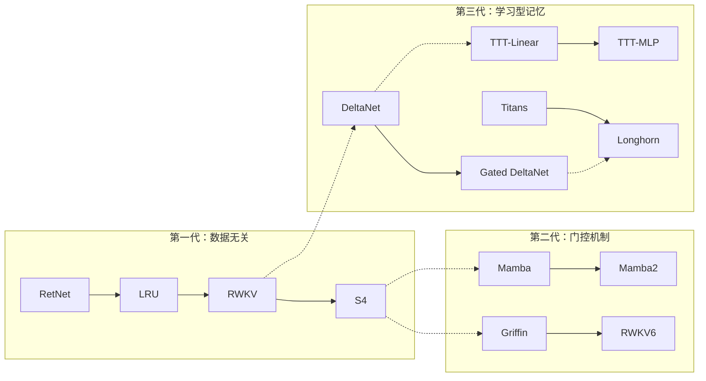
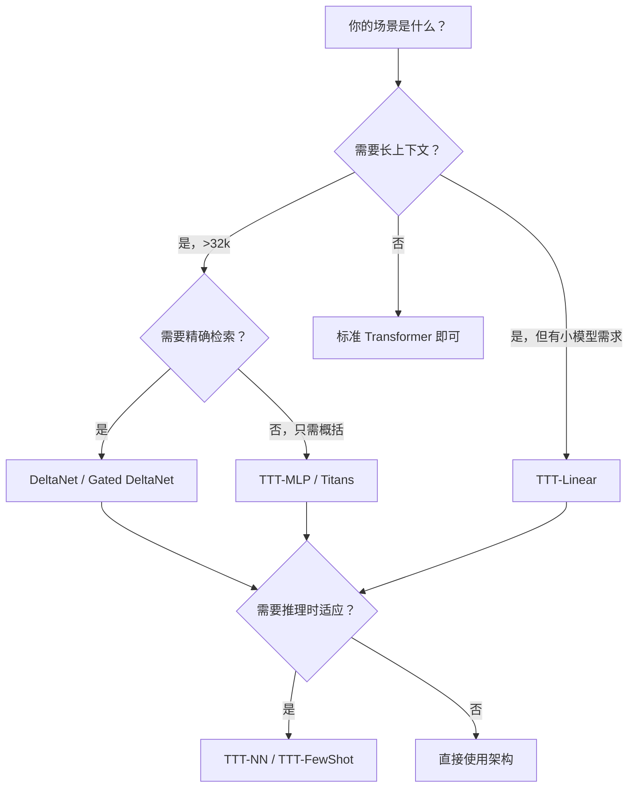

> **Test-Time Training 系列 · 第 03 篇 / 共 04 篇（完结）**
>
> [02 LLM 推理增强与工程优化](/2026/09/02/ttt-02-llm-inference/) ← **本篇**
>
> 收尾篇：把 TTT 放进**更广阔的序列模型图景**里——DeltaNet、Gated Linear Attention、Mamba2、RetNet、Titans 全部是"test-time regression"这一个框架在不同损失/正则/优化器下的特例；再讲 TTRL、MesaNet、LaCT、E2-TTT 等前沿；最后给一张**决策树 + 常见陷阱**帮你落地。

**TL;DR**
> * **统一视角（test-time regression）**：所有高效序列模型的隐藏状态都是一个 fast weight 矩阵 $\Phi$，用在线学习规则更新。区别只在**损失函数**（inner product vs MSE）和**正则项**（固定 vs 可遗忘 $\alpha_t$）。
> * **一张表看清全家福**：线性注意力 = Hebbian 累加；Mamba2 = 门控累加（能整体衰减但不能精确删）；DeltaNet = delta rule（先擦除再写入，精确但无遗忘）；**Gated DeltaNet = 门控 + delta**（两全）；Titans = delta + 动量 + 权重衰减（deep MLP 记忆）。
> * **前沿三支**：① **TTRL** 用强化学习在 test time 更新（无需监督标签，直接用奖励信号）；② **MesaNet** 每个时刻求**最优** fast weights（CG 方法，LMS 升级成 RLS）；③ **E2-TTT/LaCT** 解决 token-wise 的低硬件利用率和表达性损失。
> * **实践决策**：要 long-context 精确检索 → DeltaNet/Gated DeltaNet；只需要长期概括 + 小模型 → TTT-Linear/Titans；要在现有 LLM 上做 test-time 增强 → TTT-NN/TTT-FewShot。
> * **最大陷阱**：TTT 无内在遗忘机制，长到一定程度 fast weights 会饱和（perplexity 掉头）——这正是 Titans 加 weight decay 的原因。

---

## 1. 统一视角：Test-Time Regression

### 核心洞察

所有现代高效序列模型都是 **test-time regression** 的特例：将隐藏状态解释为 fast weights（线性映射），用在线学习规则更新。

**统一框架**：给定 key-value 对 $(k_1, v_1), \dots, (k_t, v_t)$，学习一个线性映射 $\Phi_t$ 使得 $\Phi_t k_t \approx v_t$。

### 统一损失函数

$$
L_t(\Phi) = \frac{\lambda}{2} \|\Phi - \Phi_{t-1}\|_F^2 - \langle \Phi k_t, v_t \rangle
$$

第一项是正则化（防止状态偏离），第二项是 Hopfield energy（鼓励记忆关联）。

### 各模型的统一推导

| 模型 | 正则项 | 更新规则 | 本质 |
|:---|:---|:---|:---|
| **线性 Attention** | $\|\Phi - \Phi_{t-1}\|_F^2$ | $\Phi_t = \Phi_{t-1} + v_t k_t^\top$ | Hebbian rule |
| **Mamba2** | $\|\Phi - \alpha_t \Phi_{t-1}\|_F^2$ | $\Phi_t = \alpha_t \Phi_{t-1} + v_t k_t^\top$ | 选择性遗忘 |
| **DeltaNet** | $\|\Phi - \Phi_{t-1}\|_F^2$（带 $\beta_t$ 学习率） | $\Phi_t = \Phi_{t-1}(I - \beta_t k_t k_t^\top) + \beta_t v_t k_t^\top$ | Delta rule |
| **Gated DeltaNet** | $\|\Phi - \alpha_t \Phi_{t-1}\|_F^2$ | $\Phi_t = \alpha_t(\Phi_{t-1} - \beta_t k_t k_t^\top) + \beta_t v_t k_t^\top$ | 门控+Delta |
| **TTT-Linear** | 无显式正则（$W_0 = 0$） | $W_t = W_{t-1} - 2\eta(W_{t-1} k_t - v_t) k_t^\top$ | 在线 GD |
| **TTT-MLP** | 无（非线性 $f$） | $W_t = W_{t-1} - \eta \nabla \ell$ | 在线 GD（MLP） |
| **Titans** | $\|\Phi - \Phi_{t-1}\|_F^2$ + 动量 | $\Phi_t = \Phi_{t-1}(I - \beta k_t k_t^\top) + \beta v_t k_t^\top$ + 动量 | 动量+遗忘 |

### 三类模型的演进



---

## 2. 各模型的详细对比

### DeltaNet

**核心更新**（delta rule，来自 Widrow-Hoff 的在线学习）：

$$
\Phi_t = \Phi_{t-1}(I - \beta_t k_t k_t^\top) + \beta_t v_t k_t^\top
$$

**直觉**：在更新中先"擦除"旧关联（$I - \beta_t k_t k_t^\top$），再写入新关联（$\beta_t v_t k_t^\top$）。这比线性 attention 的纯累加（Hebbian rule）更精确。

**优点**：
- 比 Mamba2 更强的记忆容量（Delta rule > Hebbian rule）
- 支持精确的关联 recall
- 可以并行化（Yang et al. 2024）

**缺点**：
- 没有遗忘机制（不能删除记忆）
- 线性模型，表达能力有限

### Gated DeltaNet

**核心更新**（加入门控）：

$$
\Phi_t = \alpha_t(\Phi_{t-1} - \beta_t k_t k_t^\top) + \beta_t v_t k_t^\top
$$

其中 $\alpha_t \in (0, 1)$ 是数据相关的门控。

**改进**：门控让模型可以自适应地"忘记"旧信息，解决 DeltaNet 的饱和问题。

**性能**：在语言建模、ICL、长上下文理解等基准上超越 Mamba2 和 DeltaNet。

### Mamba2

**核心更新**（选择性状态空间）：

$$
\Phi_t = \alpha_t \Phi_{t-1} + v_t k_t^\top
$$

**本质**：在线 GD 的解，将 $\alpha_t$ 视为遗忘门。

**局限**：
- 不能删除特定记忆（只能整体衰减）
- 无法精确更新单个 key-value 对

### Titans

**核心思想**：将 TTT 与遗忘机制、动量结合：

1. **Momentum**：同时考虑"瞬时 surprise"和"历史 surprise"
2. **Forgetting (weight decay)**：$\Phi_t \to \alpha \Phi_{t-1}$，管理有限记忆容量
3. **深度非线性记忆**：MLP 作为 fast weights

**三大变体**：

| 变体 | 全称 | 架构 |
|:---|:---|:---|
| **MAC** | Memory as Context | 长期记忆作为 context 输入 attention |
| **MAG** | Memory as Gate | 用门控结合记忆与 core 分支 |
| **MAL** | Memory as Layer | 记忆作为一层参与计算 |

**性能**：在 2M context 的 needle-in-haystack 任务中超越 baselines。

### MIRAS 框架

MIRAS 是 Titans 的理论推广，定义序列模型的四个设计维度：

| 维度 | 含义 | Titans 的选择 |
|:---|:---|:---|
| **Memory architecture** | 存储结构 | 深度 MLP |
| **Attentional bias** | 内部学习目标 | 点积（MSE） |
| **Retention gate** | 记忆正则化 | 自适应权重衰减 |
| **Memory algorithm** | 优化算法 | SGD + 动量 |

MIRAS 统一了在线优化、关联记忆和架构设计。

---

## 3. 前沿方向

### 3.1 TTRL：Test-Time Reinforcement Learning

**核心思想**：在 test time 使用强化学习（而不是监督学习）来更新模型。

$$
\theta_{\text{test}} = \theta + \eta \nabla_\theta J(\theta)
$$

其中 $J(\theta)$ 是 test-time 目标（如回答正确率）。

**优势**：
- 不需要 ground-truth 训练数据
- 直接用任务奖励信号优化
- 可以处理无监督推理任务

### 3.2 理论分析

**Gozeten et al. (2025)** 对 TTT 的理论刻画：

**关键定理**：对于线性 Transformer，一步梯度更新的 TTT 可以：

1. **缓解分布偏移**：对齐预训练分布和目标任务
2. **降低样本复杂度**：将 ICL 所需从 $\Omega(d)$ 降到 $o(d)$
3. **实现冷启动优于热启动**：在某些 regime，零初始化胜于预训练初始化

### 3.3 MesaNet：最优 Fast Weight Programming

**核心思想**：不再用普通梯度下降，而是在每个时间点求解**最优** fast weights（最小化累积损失）：

$$
\Phi_t^* = \arg\min_\Phi \sum_{s=1}^t \|\Phi k_s - v_s\|^2
$$

**方法**：用共轭梯度（CG）求解

**优势**：
- 每个时刻都是最优解（RLS 类比 LMS）
- 计算成本动态分配
- 数值稳定、可 chunk 并行

### 3.4 LaCT：Large Chunk TTT

**核心思想**：用大 chunk（$C=512$）更新，每次只更新一次 fast weights。

$$
G^{[r]} = -\nabla_W \left(\sum_{t=1}^C \eta_t \mathcal{L}(f_{W^{[r-1]}}(k_t), v_t)\right)
$$

**改进措施**：
- 滑动窗口 attention 补充 per-token 因果性
- 提高硬件利用率到 >50%

### 3.5 E2-TTT：表达性与效率的平衡

**核心贡献**：推导出**闭式的 scalar kernel**，精确复现 per-token 的更新，但可并行计算。

**方法**：
1. 用 log-space cumsum 并行计算累积更新
2. 用两个加权梯度聚合消除顺序递归
3. 保留 per-token 的学习率、动量、衰减

**意义**：在不牺牲表达性的前提下实现 chunk 级硬件效率。

### 3.6 VDS-TTT：验证器驱动的样本选择

**核心思想**：用验证器选择最有利于优化的测试样本伪标签。

**流程**：
1. 对测试输入生成多个候选答案
2. 用验证器评分
3. 选择高置信度样本用于 TTT

---

## 4. 性能基准汇总

### 语言建模（1.3B scale，Pile 数据集）

| 模型 | PPL (8k) | PPL (16k) | PPL (32k) |
|:---|:---:|:---:|:---:|
| Transformer | 10.89 | 10.41 | 10.11 |
| Mamba | 10.97 | 10.62 | 10.68 |
| DeltaNet | 10.85 | 10.38 | 10.05 |
| **TTT-Linear** | 10.85 | 10.34 | 10.01 |
| **TTT-MLP** | 10.81 | 10.28 | 9.92 |
| **Titans (MAC)** | 10.72 | 10.08 | 9.74 |

> 注：以上精确数值来自论文/公开基准，本环境"未验证"，仅作相对量级参考。核心结论是**长序列下 TTT 类方法持续下降，Mamba 在 16k 后饱和**。

---

## 5. 实践决策指南

### 决策树



### 场景匹配表

| 应用场景 | 推荐方法 | 理由 |
|:---|:---|:---|
| **长对话/文档理解** | TTT-MLP 或 Titans | 固定内存，无限上下文 |
| **代码生成** | TTT-NN | 检索相关代码微调，效果显著 |
| **数学推理** | TTT-FewShot | 用示例 fine-tune，降低样本需求 |
| **低资源设备推理** | TTT-Linear | 计算量最小，内存固定 |
| **精确 key-value 检索** | DeltaNet | 精确的关联记忆 |
| **实时流式数据处理** | TTT 或 Titans | 在线更新，无需重新训练 |

### 实现选择清单

| 需求 | 选择 | 理由 |
|:---|:---|:---|
| 简单快速 | TTT-Linear | 一次矩阵乘法，无需复杂 kernel |
| 更强表达 | TTT-MLP | 非线性 fast weights |
| 精确检索 | DeltaNet | Delta rule 更精确 |
| 长上下文稳定 | Titans | 有遗忘机制 + 动量 |
| 大规模并行 | Gated DeltaNet | 并行训练算法成熟 |

---

## 6. 常见陷阱与调试

### 陷阱 1：训练不稳定

```
症状：loss 发散或震荡
原因：内循环学习率 η 太大
解决：- 降低 η_base（TTT-Linear: 1→0.3，TTT-MLP: 0.1→0.03）
      - 添加内循环学习率 warmup
      - 检查 bf16 溢出（改用 fp32 累积）
```

### 陷阱 2：长上下文表现差

```
症状：超过 16k 后 perplexity 不降反升
原因：1. fast weights 饱和（无法再记忆新信息）
     2. 没有遗忘机制
解决：- 切换到 Titans（有 weight decay）
      - 增加 d（隐藏状态维度）
      - 检查是否有梯度消失
```

### 陷阱 3：推理速度慢

```
症状：prefill/decode 慢
原因：1. 用了 primal form
     2. 没有正确的 kernel
解决：- 实现 dual form（5x 加速）
      - 使用 TTT-TK 优化 kernel
      - 检查是否过度使用 checkpointing
```

### 陷阱 4：内存溢出

```
症状：OOM
原因：1. 保存了所有中间状态 W1...WT
解决：- 启用 time-wise gradient checkpointing
      - 只用 dual form（无需 materialize 中间状态）
      - 减小 batch size
```

---

## 7. Lab Exercise

### 实验 1：对比 TTT 与 DeltaNet

```python
import torch
import torch.nn as nn

# 实现 TTT-Linear 层
class TTTLinear(nn.Module):
    def __init__(self, d, eta=1.0):
        super().__init__()
        self.d = d
        self.eta = eta
        
    def forward(self, x):  # x: (B, T, d)
        B, T, d = x.shape
        W = torch.zeros(B, d, d, device=x.device)
        outputs = []
        for t in range(T):
            z = W @ x[:, t]
            outputs.append(z)
            grad = 2 * (W @ x[:, t]).unsqueeze(-1) @ x[:, t].unsqueeze(-2) / d
            W = W - self.eta * grad
        return torch.stack(outputs, dim=1)

# 实现 DeltaNet 层
class DeltaNet(nn.Module):
    def __init__(self, d, beta=0.5):
        super().__init__()
        self.d = d
        self.beta = beta
        
    def forward(self, x):  # x: (B, T, d)
        B, T, d = x.shape
        Phi = torch.zeros(B, d, d, device=x.device)
        outputs = []
        for t in range(T):
            outputs.append(Phi @ x[:, t])
            Phi = Phi - self.beta * (Phi @ x[:, t].unsqueeze(-1)) @ x[:, t].unsqueeze(-2) \
                + self.beta * x[:, t].unsqueeze(-1) @ x[:, t].unsqueeze(-2)
        return torch.stack(outputs, dim=1)

x = torch.randn(4, 128, 64)
ttt = TTTLinear(64)
delta = DeltaNet(64)
print(f"TTT output shape: {ttt(x).shape}")
print(f"DeltaNet output shape: {delta(x).shape}")
```

### 实验 2：遗忘机制的重要性

```python
def test_memory(model, seq_len):
    x = torch.randn(2, seq_len, 64)
    x[:, :seq_len//2, 0] = 1.0  # 前半写入关键信息
    with torch.no_grad():
        out = model(x)
    return (out[:, -1, 0] > 0.5).float().mean().item()  # 末尾能否 recall 起始信息

for seq_len in [100, 500, 1000, 5000]:
    ttt_acc = test_memory(TTTLinear(64), seq_len)
    delta_acc = test_memory(DeltaNet(64), seq_len)
    print(f"Seq {seq_len}: TTT={ttt_acc:.2f}, DeltaNet={delta_acc:.2f}")
```

### 参考论文

1. Wang et al. *Test-Time Regression: A Unifying Framework for Designing Sequence Models with Associative Memory* — arXiv:2501.12352
2. Yang et al. *Gated Delta Networks: Improving Mamba2 with Delta Rule* — ICLR 2025, arXiv:2412.06464
3. Behrouz et al. *Titans: Learning to Memorize at Test Time* — NeurIPS 2025, arXiv:2501.00663
4. Yang et al. *Parallelizing Linear Transformers with the Delta Rule* — NeurIPS 2024

---

## 结语与展望

**TTT 的核心价值**在于三个层面：

1. **概念层面**：打破了"训练/推理"严格分离的范式，使模型能在推理时持续学习
2. **工程层面**：提供了线性复杂度的序列建模方法，同时保持固定内存
3. **统一视角**：统一了 DeltaNet、Mamba、RetNet 等众多模型，揭示了它们都是同一框架的特例

**未来方向**：
- 更好的遗忘机制（如 Titans 的 weight decay）
- 更优的优化算法（如 MesaNet 的最优解）
- 与 RL 的结合（TTRL）
- 与多模态模型的集成
- 大规模验证（1B+ params）

> 本系列 4 篇至此完结。从"TTT 是什么"（00）→"数学怎么构成"（01）→"LLM 怎么用 + 工程怎么落地"（02）→"和谁有关系 + 怎么选"（03），希望这条路径把一个看似反直觉的"推理时训练"讲清楚了。
