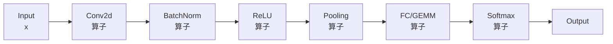
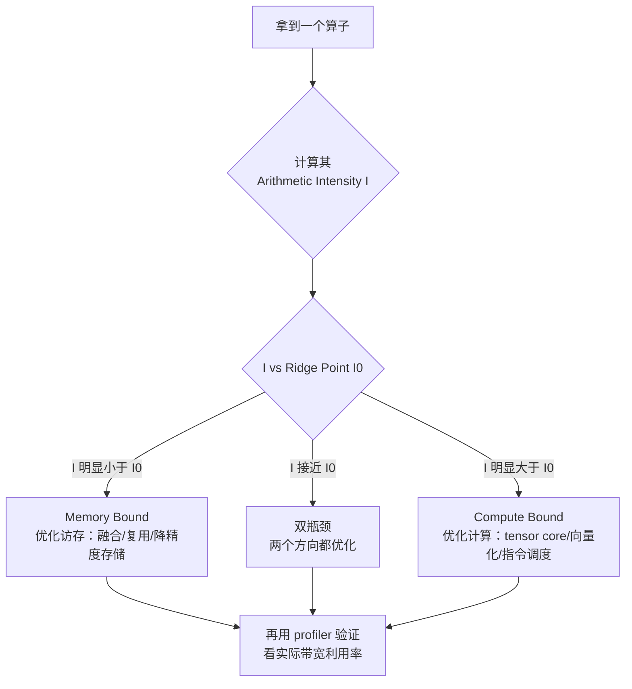
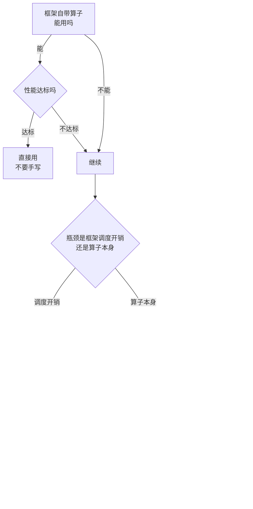

> **算子开发与优化系列 · 第 00 篇 / 共 14 篇**
>
> 本系列面向有算子使用经验（PyTorch/CUDA 基础）、想进阶资深工程师、下一步目标是算子专家的读者。全系列 14 篇，从"算子的本质"讲起，经硬件原理、语言选型、跨硬件 Profiling 工具链、性能分析方法论、优化技术体系，到五大经典案例实战（GEMM / FlashAttention / 归约归一化 / 卷积 / 超越函数），再深入到国产 NPU 实战与编译器集成，最后上升到算子库设计、性能模型与 AI 辅助开发。
>
> → [01 硬件架构](/2026/09/03/op-01-hardware/)

**TL;DR**
> * **背景**：很多工程师会"用"算子（`torch.matmul`、`F.softmax`），但遇到性能问题就束手无策——不知道该不该手写 kernel、瓶颈在计算还是访存、优化从哪下手。
> * **核心发现**：决定算子性能的不是"算得有多快"，而是**计算量与访存量的比值（Arithmetic Intensity）与硬件 ridge point 的关系**。Roofline 模型把算子的性能边界画成一目了然的两条线：计算上限和访存上限。
> * **收益**：掌握 Roofline 后，你可以在写任何 kernel 之前就**预判**它的性能上限、判断瓶颈类型、决定优化方向——这是从"算子使用者"迈向"算子开发者"的第一道分水岭。
> * **适用人群**：会用 PyTorch/CUDA 算子、写过简单 kernel、但没系统做过性能调优的工程师。

---

## 1. 算子的本质定义与分类

### 1.1 什么是算子（Operator / Kernel）

**算子（Operator）** 是神经网络计算图（DAG）中的基本计算单元。从执行角度，它对应一个在加速器上运行的 **Kernel**（内核函数）。

一个模型就是一张图，图的每个节点是一个算子：



每个算子都需要消耗两类资源：

1. **计算资源（FLOPS）**：算术逻辑单元（ALU）、Tensor Core 的执行吞吐
2. **访存资源（Bytes）**：从各级存储（HBM → L2 → L1 → Shared → 寄存器）搬运数据

**关键洞察**：算子的性能瓶颈取决于这两类资源中**先被耗尽的那一个**。这引出了贯穿全系列的核心概念——Arithmetic Intensity。

### 1.2 算子分类：计算密集 vs 访存密集

按"计算量/访存量"的比值，算子天然分成两类：

| 类别 | 特征 | 典型算子 | 性能上界 |
|---|---|---|---|
| **计算密集** | 计算量 >> 访存量 | GEMM、Conv、Attention(QK^T、PV) | 受 FLOPS 上限约束 |
| **访存密集** | 访存量 >> 计算量 | Elementwise(ReLU/Add)、Reduce(Sum/Softmax)、Layout(Transpose/Permute) | 受带宽上限约束 |

**为什么这个分类如此重要？** 因为两类算子的优化手段**完全不同**：

- 计算密集算子：优化目标是**提高计算效率**（tiling 提升数据复用、Tensor Core、降低非计算开销）
- 访存密集算子：优化目标是**减少访存量**（算子融合、一次读多次用、避免中间结果落盘）

很多初学者把 GEMM 的优化套路套到 Softmax 上，结果越优化越慢——因为 Softmax 的瓶颈是带宽，不是算力。

> **判断口诀**：如果一个算子每读一次数据只做 1 次算术运算（如 ReLU：读 1 个数、算 1 次、写 1 个数），它一定是访存密集的；如果一个算子读入的数据被复用了成千上万次（如 GEMM：每个元素参与多次乘加），它才是计算密集的。

---

## 2. Roofline 模型：量化算子的性能边界

### 2.1 一个直觉：算子执行 = "搬数据" + "做运算"

先别急着看公式。把问题变得具体——无论什么算子，在硬件上执行时**只有两件事**在发生：

1. **搬数据**：把数据从内存搬进计算单元（算完再写回）
2. **做运算**：在计算单元里做加减乘除

而硬件为这两件事提供两种**产能**：

| 产能 | 符号 | 类比 | 单位 |
|---|---|---|---|
| 每秒能做多少次运算 | $\pi$ | 厨师炒菜的速度 | FLOPS |
| 每秒能搬多少字节 | $\beta$ | 服务员上菜的速度 | Bytes/s |

**瓶颈 = 先被耗尽的产能**。就像餐厅：如果厨师炒得飞快但服务员端不过来，客人等的是上菜（访存瓶颈）；如果服务员很勤快但厨师太慢，客人等的是出菜（计算瓶颈）。

> **Roofline 的全部内容就是一句话**：一个算子（给定"每字节数据做多少次运算"）的性能天花板，由"算力"和"带宽"中**较弱的那个**决定。

### 2.2 先把单位搞清楚：FLOPs vs FLOPS

这两个词长得太像，是初学者最容易混的地方，务必先分清：

| 术语 | 含义 | 例子 |
|---|---|---|
| **FLOP** | Floating-point OPeration，一次浮点运算 | 一次 $a + b$ |
| **FLOPs** | FLOP 的复数，表示**运算次数**（总量） | 一次 GEMM 要做 $2MNK$ FLOPs |
| **FLOPS** | FLOPs **per Second**，每秒运算次数（**速度**） | H100 FP16 dense 峰值约 495 **T**FLOPS |
| **Byte** | 字节（数据量） | FP16 一个数占 2 Bytes |
| **Bytes/s** | 每秒字节数（**带宽**，速度） | H100 峰值 3.35 **T**B/s |

**区分技巧**：带 "/s" 的（FLOPS、Bytes/s）是**速度**；不带的是**总量**。下面的推导里速度和时间相乘会消掉总量，就是靠这个单位关系。

### 2.3 核心概念：逐个建立直觉

| 概念 | 符号 | 定义 | 直觉 |
|---|---|---|---|
| 计算量 | $W$ | 总共要做多少次运算（FLOPs） | 工作量 |
| 访存量 | $Q$ | 总共要搬多少字节（Bytes） | 搬运量 |
| **算术强度** | $I = W/Q$ | 每搬 1 字节，做几次运算（FLOPs/Byte） | **"搬运的含金量"** |
| 峰值算力 | $\pi$ | 硬件每秒最多做多少次运算（FLOPS） | 算力天花板 |
| 峰值带宽 | $\beta$ | 硬件每秒最多搬多少字节（Bytes/s） | 带宽天花板 |
| **Ridge Point** | $I_0 = \pi/\beta$ | 算力与带宽的平衡点（FLOPs/Byte） | **分水岭** |
| 实际性能 | $P$ | 实际达到的 FLOPS | 真实速度 |

**算术强度 $I$ 的直觉**：它衡量"每次搬运的含金量"。

- $I$ 大（如 GEMM）：搬 1 字节数据进来，能反复用它做上千次运算 → 运算主导，**计算密集**
- $I$ 小（如 ReLU）：搬 1 字节进来，只做 1 次运算就扔了 → 搬运主导，**访存密集**

### 2.4 公式推导：为什么 P_bound = min(π, β·I)

**Step 0：写出两个独立的耗时**

只考虑算力（数据瞬间到位）时，做完所有运算需要的时间：

$$
T_{\text{calc}} = \frac{W}{\pi} \quad \text{（总运算量 ÷ 每秒运算量 = 秒）}
$$

只考虑带宽（算力瞬间完成）时，搬完所有数据需要的时间：

$$
T_{\text{mem}} = \frac{Q}{\beta} \quad \text{（总搬动量 ÷ 每秒搬动量 = 秒）}
$$

**Step 1：总时间 = 两者的最大值（短板效应）**

搬运和运算是配合进行的（搬一部分 → 算一部分），**总时间由更慢的那个环节决定**：

$$
T \ge \max(T_{\text{calc}}, T_{\text{mem}})
$$

**Step 2：换算成性能**

性能（FLOPS）= 总运算量 ÷ 总时间：

$$
P = \frac{W}{T} \le \frac{W}{\max(W/\pi, Q/\beta)}
$$

**Step 3：化简**

对 $\frac{W}{\max(a, b)}$ 化简，它等价于 $\min(\frac{W}{a}, \frac{W}{b})$，代入得：

$$
P_{\text{bound}} = \min\left(\frac{W}{W/\pi}, \frac{W}{Q/\beta}\right) = \min\left(\pi, \frac{W}{Q}\cdot\beta\right) = \min(\pi, \beta\cdot I)
$$

**Step 4：单位验证（务必自己验一遍）**

- $\pi$：单位是 FLOPS ✓
- $\beta \cdot I$：$(\text{Bytes/s}) \times (\text{FLOPs/Bytes}) = \text{FLOPs/s} = \text{FLOPS}$ ✓

**两边单位一致，公式成立。** 这就是 Roofline 上界公式：

$$
\boxed{P_{\text{bound}}(I) = \min(\pi, \beta \cdot I)}
$$

### 2.5 Ridge Point：两条线的交点为什么是分水岭

当 $I$ 恰好让两个耗时相等（$T_{\text{calc}} = T_{\text{mem}}$）时：

$$
\frac{W}{\pi} = \frac{Q}{\beta} \implies \frac{W}{Q} = \frac{\pi}{\beta} \implies I = I_0
$$

这个临界值 $I_0$ 就是 **Ridge Point**（山脊点）：

$$
\boxed{I_0 = \frac{\pi}{\beta}}
$$

**它的直觉意义**：$I_0$ 是"每搬 1 字节数据，恰好需要做这么多运算，才能把算力耗尽"的临界值。

- $I > I_0$：每字节数据要做的运算**多于**平衡值 → 运算成为瓶颈 → **Compute Bound**（计算密集）
- $I < I_0$：每字节数据的运算量**不足以**耗尽算力 → 搬运成为瓶颈 → **Memory Bound**（访存密集）
- $I = I_0$：两者恰好平衡 → 双瓶颈，两个方向都要优化

### 2.6 读懂 Roofline 图

#### 为什么用双对数坐标

横轴 $I$ 的取值范围从 ReLU 的 ~0.17 到 GEMM 的 ~1345，跨越 **4 个数量级**；纵轴性能也跨越多个数量级。线性坐标下小数值会被压扁在原点附近什么都看不见，所以 Roofline 图一律用**对数坐标**。

对数坐标有个好性质：在双对数坐标下，$P = \beta\cdot I$ 变成一条**斜率为 1 的直线**（因为 $\log P = \log\beta + \log I$），而 $P = \pi$ 仍是水平线。两条线拼起来就像屋顶——这正是它叫 **Roofline（屋顶线）** 的原因：

```
性能 P (log scale)
   ^
 π |══════════════════════╗  ← 算力上限 P = π（水平线，"屋脊"）
   |                      ║
   |                    ╱ ║
   |                  ╱   ║  ← 访存上限 P = β·I（45° 斜线，"屋顶斜坡"）
   |                ╱     ║
   |              ╱       ║
   |            ╱  ●G     ║     G = GEMM（I≈1345，落在水平段，计算瓶颈）
   |          ╱           ║
   |        ╱             ║
   |      ╱  ●R           ║     R = ReLU（I≈0.17，落在斜线段，访存瓶颈）
   |    ╱                 ║
   |  ╱                   ║
   +╱─────────────────────╗→  Arithmetic Intensity I (log scale)
        ridge point I0 = π/β

任何算子的性能点都只能落在"屋顶"下方：
- 点落在斜线段 → 访存受限，优化方向 = 减少访存 / 提升算术强度
- 点落在水平段 → 算力受限，优化方向 = 提升计算效率
- 点离屋顶越远 → 优化空间越大
```

#### 三步读图法

| 步骤 | 做什么 | 结果 |
|---|---|---|
| 1. 算 $I$ | $I = W/Q$（FLOPs/Byte） | 算子的横坐标 |
| 2. 查 $I_0$ | $I_0 = \pi/\beta$（硬件规格） | 分水岭位置 |
| 3. 比大小 | $I$ 在 $I_0$ 哪一侧 | 判断瓶颈方向 |

### 2.7 一个关键认知：算术强度是"实现属性"，不是算子固有属性

这一点最容易被忽略，但对理解后续所有优化至关重要：**同一个算子，用不同方式实现，$I$ 可以完全不同。**

以 GEMM 为例：

| 实现 | $I$ | 瓶颈 | 相对性能 |
|---|---|---|---|
| naive 实现（每个线程算 1 个输出，零复用） | ~1/d（FP32 ≈ 0.25） | Memory Bound | ~1% 峰值 |
| tiling 实现（数据上片、反复复用） | ~1345 | Compute Bound | ~85% 峰值（dense FP16） |

**"优化"的本质，就是把算子的点沿着横轴向右推（提升 $I$），直到跨过 ridge point。** 这个视角能帮你理解后面所有优化手段为什么有效：

- **为什么访存密集算子要融合？** 因为融合把多次搬运合并成一次，$Q$ 变小，$I$ 变大
- **为什么 GEMM 要 tiling？** 因为数据复用让每个字节被用更多次，$W$ 不变但 $Q$ 摊薄，$I$ 变大
- **为什么算力用不满？** 因为你的点还在斜线段，优化计算毫无意义

> **一句话总结本节**：Roofline 告诉你"瓶颈在哪一侧"，而"把点往右推"就是全部优化工作的本质。06 篇的 GEMM 金字塔就是这条思路的完整展开。

### 2.8 常见误解

| 误解 | 纠正 |
|---|---|
| "Roofline 是实测模型" | 它是**理论天花板**，实际永远到不了，但它告诉你"值不值得优化、往哪个方向优化" |
| "FLOPs 就是 FLOPS" | FLOPs 是总运算次数，FLOPS 是每秒运算次数（速度） |
| "算术强度是算子固有属性" | 它是**实现属性**，优化 = 提升 $I$（见 2.7） |
| "GPU 算力高所以算子都快" | 访存密集算子受带宽限制，算力再高也用不上（见 3.1 的 Elementwise Add 算例） |
| "Ridge point 越低越好" | 越低确实越容易跨入计算受限区（对性能有利），但它由 $\pi/\beta$ 决定，单个算子改不了；你能改的只有算子的 $I$ |

---

## 3. 用 Roofline 判断算子瓶颈：一个完整算例

### 3.1 算例设定：在 H100 上评估一个 Elementwise Add

**硬件参数（NVIDIA H100 SXM）**：

| 参数 | 值 | 来源 |
|---|---|---|
| FP16 Tensor Core 峰值算力 $\pi$ | 494.7 TFLOPS（dense；含 2:4 稀疏为 989.4） | [NVIDIA H100 白皮书](https://resources.nvidia.com/en-us-tensor-core/cta-downloads) |
| HBM3 峰值带宽 $\beta$ | 3.35 TB/s | 同上 |

> **注**：989 TFLOPS 是 H100 SXM 的 FP16 **含 2:4 结构稀疏** 峰值；普通 dense 算子用不到稀疏规格，实际上限是 494.7 TFLOPS。本系列统一以 dense 峰值作为算力上限。

**Ridge Point**：

$$
I_0 = \frac{\pi}{\beta} = \frac{494.7 \times 10^{12}}{3.35 \times 10^{12}} \approx 148 \text{ FLOPs/Byte}
$$

**算子分析：向量相加 `C[i] = A[i] + B[i]`**

- 运算量：每输出 1 个元素，1 次加法 = 1 FLOP（或按 FMA 算 2 FLOPs）
- 访存量：读 A、读 B、写 C，各 2 字节（FP16）= 6 Bytes/元素
- **算术强度**：

$$
I = \frac{W}{Q} = \frac{1 \text{ FLOP}}{6 \text{ Bytes}} \approx 0.17 \text{ FLOPs/Byte}
$$

**判断**：

$$
I (0.17) \ll I_0 (148)
$$

**结论：强烈 Memory Bound。** 它的理论性能上限是多少？代入 Roofline 公式，此时 $\beta \cdot I < \pi$，取最小值得：

$$
P_{\text{bound}} = \min(\pi, \beta\cdot I) = \beta \cdot I = 3.35 \times 10^{12} \times 0.17 \approx 5.7 \times 10^{11} \text{ FLOPS} \approx 0.57 \text{ TFLOPS}
$$

**也就是说：即使带宽被完全榨干，这个算子的性能也只有 0.57 TFLOPS——H100 dense 的 494.7 TFLOPS 算力连千分之一都用不上。** 算力利用率：

$$
\text{算力利用率} = \frac{P_{\text{bound}}}{\pi} = \frac{\beta \cdot I}{\pi} = \frac{0.17}{148} \approx 0.1\%
$$

**这种情况下优化方向 100% 是减少访存，而不是优化计算**——因为瓶颈根本不在计算。

### 3.2 对照：GEMM 的算术强度

设 GEMM 计算 $C_{M\times N} = A_{M\times K} \cdot B_{K\times N}$，其中 $M=N=K=4096$：

- 计算量：$W = 2 \times M \times N \times K = 2 \times 4096^3 \approx 1.37 \times 10^{11}$ FLOPs
- 访存量（理想情况，数据复用充分）：$Q \approx (M\times K + K\times N + M\times N) \times 2 \text{ Bytes} \approx 1.0 \times 10^8$ Bytes
- **算术强度**：

$$
I = \frac{1.37 \times 10^{11}}{1.0 \times 10^{8}} \approx 1345 \text{ FLOPs/Byte} > I_0
$$

**结论：Compute Bound。** 代入 Roofline 公式，此时 $\beta \cdot I > \pi$，取最小值得：

$$
P_{\text{bound}} = \min(\pi, \beta\cdot I) = \pi = 494.7 \text{ TFLOPS}
$$

也就是说，理论上这个 GEMM 可以跑满 H100 的 dense 算力峰值。**GEMM 每次从 HBM 读入的数据被复用了上千次，所以它的优化核心是让计算单元跑满**（Tensor Core、指令调度）。

> **对比小结**：同一个 H100，Elementwise Add 的理论上界只有 0.57 TFLOPS（带宽说了算），GEMM 的理论上界是 494.7 TFLOPS（算力说了算）——差别约 870 倍。这就是"瓶颈类型决定优化方向"最直观的例证。

### 3.3 实操判断流程



**验证方法**：判断完理论瓶颈后，用 profiler（ncu/nsys）看实际数据——如果 Memory Throughput > 80% 峰值而 SM Throughput 很低，证明确实是 Memory Bound，理论判断正确。

---

## 4. 算子性能的度量指标

判断"一个算子写得好不好"，需要一组标准指标：

### 4.1 核心指标

| 指标 | 定义 | 计算方式 | 好值参考 |
|---|---|---|---|
| **FLOPs 利用率** | 实际 FLOPS / 峰值 FLOPS | `实测时间` 反推 | 计算密集算子 > 60% 优秀 |
| **带宽利用率** | 实际带宽 / 峰值带宽 | `访存量/时间` | 访存密集算子 > 80% 优秀 |
| **有效算力** | 处理有效工作量的速度 | 排除 padding/空转 | 越接近真实 FLOPs 越好 |
| **Arithmetic Intensity** | 见第 2 节 | $W/Q$ | 决定瓶颈类型 |

### 4.2 实际性能的计算

```
实测性能 P = 总 FLOPs / 实测时间
实测带宽 B = 总访存 Bytes / 实测时间
```

> **避坑**：衡量 kernel 性能一定要用**实测时间**，不要用理论值。很多博客声称"达到 90% 峰值"其实用的是理论 FLOPs 且没算 padding 开销。

### 4.3 与库函数的对比基准

评估一个手写 kernel 是否有价值，标准做法是**与厂商优化库对比**：

- CUDA 生态：cuBLAS（矩阵运算）、cuDNN（卷积）、CUB（归约）
- 国产芯片：各家的算子库（华为 CANN、寒武纪 NeuWare）

对比指标：同输入 shape 下的延迟、吞吐、显存占用。**如果你的手写 kernel 只比 cuBLAS 慢 20%，且能带来融合收益，就是成功的；如果慢 10 倍，说明优化没入门。**

---

## 5. 什么时候需要手写 Kernel：决策树

不是所有算子都要手写。下面这个决策树帮你判断：



### 5.1 手写 Kernel 的充分条件（满足其一即可）

1. **性能差距**：实测比厂商库慢 > 2 倍，且该算子是热点（占模型总时间 > 10%）
2. **融合需求**：多个连续算子融合成一个，框架没提供现成融合 kernel（如 FlashAttention、LayerNorm+激活融合）
3. **硬件特性**：目标硬件有框架未暴露的指令（Tensor Core、稀疏计算、特殊存储）
4. **框架缺失**：新算子（新模型架构引入），框架还没实现或性能很差
5. **精度需求**：需要特殊精度处理（FP8 训练、混合精度归一化），框架默认实现不满足

### 5.2 不该手写 Kernel 的情况

- 框架自带算子已跑满带宽/算力（用 profiler 验证过）
- 算子不是热点（优化了 99% 的时间只花在 1% 的算子上，没意义）
- 你还没用 profiler 确认瓶颈（先测量，再优化）

> **核心原则**：**先测量，再优化**。没有 profiling 数据支撑的"优化"都是玄学。这是全系列反复强调的第一原则。

---

## 6. 总结与进阶预告

### 6.1 本篇核心收获

1. **算子的本质**是计算图节点，性能取决于计算与访存谁先耗尽
2. **Arithmetic Intensity** $I = W/Q$ 是判断瓶颈类型的唯一标准
3. **Roofline 模型** $P_{\text{bound}} = \min(\pi, \beta\cdot I)$ 给出任何算子的性能上界
4. **Ridge Point** $I_0 = \pi/\beta$ 是分界线：大于它是 Compute Bound，小于它是 Memory Bound
5. **写 kernel 前先判断**：瓶颈类型决定了完全不同的优化方向

### 6.2 本系列接下来的路线

| 篇目 | 主题 | 你将获得 |
|---|---|---|
| 01 | 硬件架构 | 为什么 GPU 内存层次决定了 kernel 怎么写 |
| 02 | Kernel 语言三件套 | CUDA / Triton / Ascend C 怎么选 |
| 03 | 跨硬件 Profiling 工具链 | 三层 profiling 工具选型与实操流程 |
| 04 | 性能分析方法论 | 15 分钟定位算子瓶颈的实操流程 |
| 05 | 优化技术体系 | tiling / 向量化 / 双缓冲 / 布局优化工具箱 |
| 06-10 | 五大案例 | GEMM、FlashAttention、归约归一化、卷积、超越函数完整实战 |
| 11-13 | 进阶 | 国产 NPU、编译器集成、专家之路 |

**下一篇（01）预告**：Roofline 告诉你要优化"算力"还是"带宽"，但你得先知道硬件到底有多少算力、带宽在哪一层——这就是硬件架构篇要回答的问题。

---

## 7. Lab Exercises

### Exercise 1：计算你自己环境的 Ridge Point

在你的机器上（无论 A100/H100/消费级 GPU），查一下：
- 峰值算力 $\pi$（FP16 或 FP32，查官方白皮书）
- 峰值带宽 $\beta$（`nvidia-smi` 不直接提供带宽字段，用 `nvidia-smi --query-gpu=name` 查出型号后查官方白皮书）

然后计算 $I_0 = \pi/\beta$，填入下表并判断：

| 算子 | 估算 $I$ | 与 $I_0$ 对比 | 瓶颈类型 |
|---|---|---|---|
| GEMM 4096³ | ~1345 | > or < | ? |
| ReLU (elementwise) | ~0.17 | > or < | ? |
| Softmax (整个行) | ? | ? | ? |

**预期结果**：GEMM 和 ReLU 应该毫无悬念，Softmax 处于中间地带（取决于实现）。

### Exercise 2：用 PyTorch 实测验证理论判断

```python
import torch
import time

# 对比一个计算密集算子（GEMM）和一个访存密集算子（Add）
a = torch.randn(4096, 4096, device="cuda")
b = torch.randn(4096, 4096, device="cuda")
x = torch.randn(1 << 26, device="cuda")  # 6700 万元素
y = torch.randn(1 << 26, device="cuda")

def bench(fn, iters=20):
    fn()  # warmup
    torch.cuda.synchronize()
    t0 = time.perf_counter()
    for _ in range(iters):
        fn()
    torch.cuda.synchronize()
    return (time.perf_counter() - t0) / iters

t_gemm = bench(lambda: a @ b)
t_add = bench(lambda: x + y)

# GEMM: 2 * 4096^3 FLOPs
flops_gemm = 2 * 4096**3
print(f"GEMM: {flops_gemm/t_gemm/1e12:.1f} TFLOPS")
# Add: 读取 x、y 各 4 字节(FP32)，写回 4 字节 = 12 bytes/元素
bytes_add = 3 * (1 << 26) * 4
print(f"Add: {bytes_add/t_add/1e9:.0f} GB/s")
```

**预期结果**：GEMM 的 TFLOPS 远低于标称峰值（因为 PyTorch 默认实现不够极致，但仍是计算密集），Add 的带宽利用率应该很高（接近硬件峰值）——验证了"Add 是 Memory Bound，GEMM 是 Compute Bound"。

---

## 8. 参考资料

1. Williams, Waterman, Patterson. *Roofline: An Insightful Visual Performance Model for Multicore Architectures*. [CACM 2009](https://cacm.acm.org/magazines/2009/4/22932-roofline-an-insightful-visual-performance-model-for-multicore-architectures/fulltext)
2. NVIDIA H100 Tensor Core GPU Whitepaper. [NVIDIA](https://resources.nvidia.com/en-us-tensor-core/cta-downloads)
3. CUDA C++ Best Practices Guide — *Performance Metrics*. [NVIDIA Docs](https://docs.nvidia.com/cuda/cuda-c-best-practices-guide/)
4. 知乎专栏：AI 编译器架构与算子优化实践. [知乎](https://zhuanlan.zhihu.com/p/361060409)
5. CUDA Programming Model Overview. [NVIDIA Docs](https://docs.nvidia.com/cuda/cuda-c-programming-guide/)

---

*下一篇：[01 硬件架构](/2026/09/03/op-01-hardware/) —— 为什么 GPU 内存层次决定了 kernel 怎么写。*