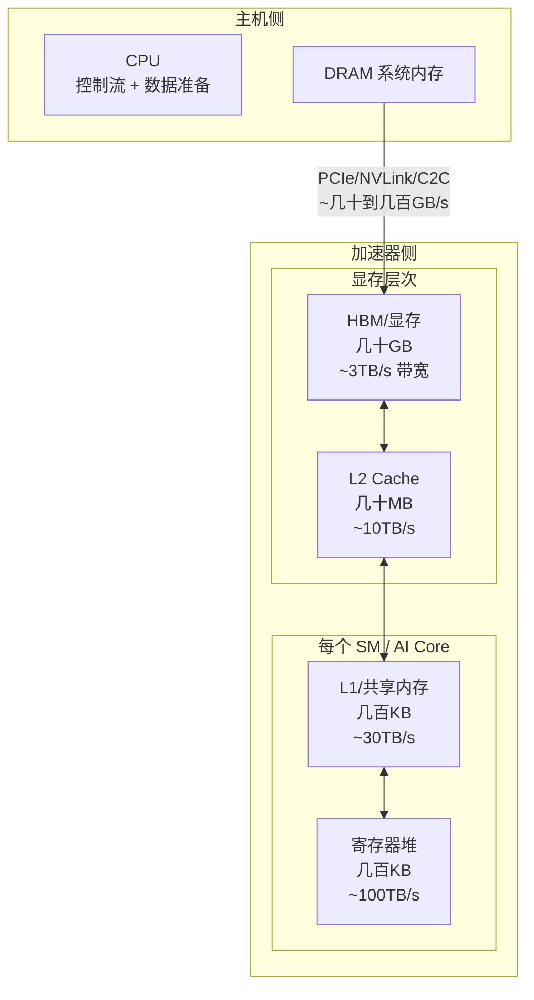
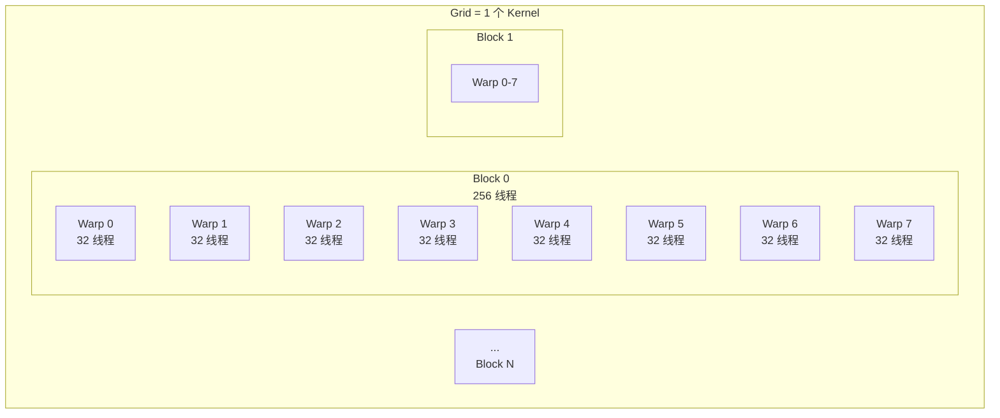
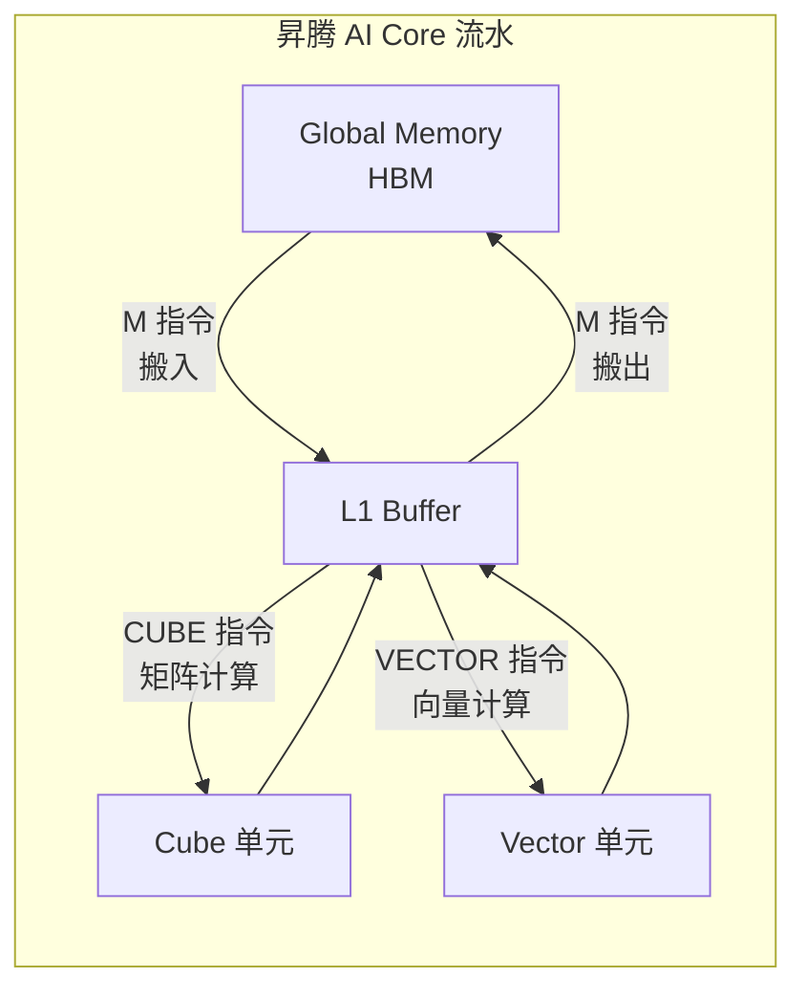
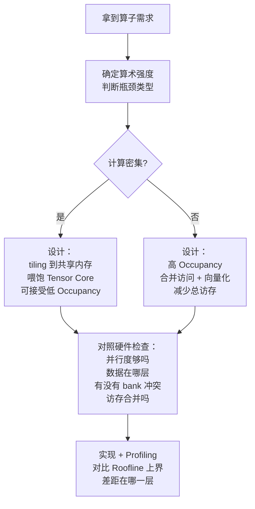

> **算子开发与优化系列 · 第 01 篇 / 共 13 篇**
>
> [00 算子本质与 Roofline](/2026/09/03/op-00-fundamentals/) ← **本篇** → [02 Kernel 语言](/2026/09/03/op-02-kernel-languages/)

**TL;DR**
> * **背景**：上一篇用 Roofline 模型判定了瓶颈是"算力"还是"带宽"，但"带宽"有好多层——寄存器、共享内存、L2、HBM，每一层的带宽和延迟差一个数量级。不懂内存层次，就无法理解为什么"把数据挪到共享内存"能快几十倍。
> * **核心发现**：GPU/NPU 是**分层存储 + 层级并行**的机器。Kernel 性能的 90% 由三件事决定：① 数据放在哪一层（寄存器 vs 共享内存 vs 全局内存）；② 并行度够不够（能否填满所有执行单元）；③ 计算是否用对了单元（Tensor Core vs CUDA Core）。
> * **收益**：理解硬件执行模型后，你会明白 kernel 里每一行的代价，能解释"为什么这个 kernel 慢"，并建立写高性能 kernel 的直觉。
> * **适用人群**：写过简单 CUDA kernel，但对硬件内部机制（warp、SM、内存层级、Tensor Core）理解模糊的工程师。

---

## 1. 为什么硬件架构决定了 Kernel 的写法

先看一个反直觉现象：

```
同一个向量加法 kernel（C[i] = A[i] + B[i]），在同一个 GPU 上：

写法 A：每个线程直接读全局内存        → 访存 12 Bytes/元素，慢
写法 B：先用向量化读（float4）        → 一次读 16 Bytes，带宽利用率翻倍
写法 C：分块 + 共享内存暂存           → 对 elementwise 反而更慢（无复用）

为什么？因为不同写法消耗的"存储层级路径"不同。
```

**核心心智模型**：加速器是"数据搬运机"，不是"计算器"。算力已经过剩，真正的瓶颈几乎总在**数据搬运的路径**上。而数据搬运的路径，完全由硬件架构决定。



**注意这个图的带宽数字**：每一层往上一层的带宽提升约 3-10 倍，同时容量缩小几十倍。**这就是为什么"数据放得越靠近执行单元，kernel 越快"——带宽是金字塔形的，顶层最贵。**

---

## 2. GPU 执行模型：从线程到 Warp 到 SM

### 2.1 层级并行结构

NVIDIA GPU 的并行是四层嵌套：

| 层级 | 概念 | 数量级 | 调度单位 |
|---|---|---|---|
| Grid | 一个 Kernel 的所有线程 | 单个 kernel | 由 CPU 启动 |
| Block | 线程块，可同步 | 成百上千 | 分配到 SM |
| **Warp** | 32 个线程，锁步执行 | Block 内多个 | SM 的调度单位 |
| Thread | 单线程 | 每个 warp 32 个 | 执行指令 |



### 2.2 Warp：SIMT 与锁步执行

**SIMT（Single Instruction Multiple Thread）** 是 GPU 的核心执行模型：一个 warp 里的 32 个线程**执行同一条指令**，但操作各自的数据。

**关键机制——分支分歧（Divergence）**：

```cuda
if (tid % 2 == 0) {
    // 只有偶数线程走这里
    expensive_computation();
}
```

由于 warp 是锁步的，这段代码会让**奇数线程也等着**，两个分支串行执行。所以：

> **规则 1：Warp 内尽量避免分支分歧。** 如果必须分支，让分歧发生在 warp 边界上（通过 thread ID 对齐 32 的倍数）。

### 2.3 为什么 Block 必须是 32 的倍数

**先厘清一个常见误区**：一个 SM **不是**只运行 32 个线程。SM 是物理硬件单元（A100/H100 上每个 SM 含 128 个 FP32 Core + 4 个 Warp Scheduler，可同时驻留最多 2048 线程 = 64 个 warp）；warp（32 线程）只是**指令调度的最小单位**——每个 warp scheduler 每周期从就绪队列里挑一个 warp 发指令，4 个 scheduler 并行，所以 SM 每周期最多执行 4 条 warp 指令。一个 SM 同时运行几十个 warp，正是靠这个并行度掩盖访存延迟。

如果 Block 大小不是 32 的倍数（比如 100，会切成 4 个 warp、最后一个只占 4/32），就会产生"残 warp"，浪费约 22% 的执行槽位。

**常见 Block 配置**：128、256、512 线程。经验法则：**每个 SM 保持 8-16 个 active warp**，才能用延迟隐藏（latency hiding）掩盖访存延迟。

### 2.4 延迟隐藏：GPU 靠并行掩盖慢速访存

CPU 靠大缓存 + 乱序执行掩盖访存延迟；GPU 几乎不依赖缓存，而是靠**高并行度**：当一个 warp 在等数据时，调度器立刻切换到另一个 warp。

**Occupancy（占用率）** = 活跃 warp 数 / 最大 warp 数。这个指标决定了延迟隐藏效果：

| Occupancy | 延迟隐藏 | 适用场景 |
|---|---|---|
| 高（>50%） | 好 | 访存密集、低算术强度算子 |
| 中 | 中 | 通用 |
| 低（<25%） | 差 | 高寄存器占用、高算术强度算子（如 GEMM 靠 Tensor Core 时低占用率也可接受） |

> **规则 2：访存密集算子追求高 Occupancy；计算密集算子（用 Tensor Core）反而可以接受低 Occupancy**，因为 Tensor Core 运算时间长，不需要那么多 warp 来掩盖延迟。

---

## 3. 内存层次详解：每一层的用途与代价

### 3.1 全局内存（HBM / 显存）

- **特点**：容量大（几十 GB），带宽高（~3TB/s），但延迟极高（~500-800 cycles）
- **访问单位**：cache line / sector（32 Bytes）
- **最佳实践**：
  - **合并访问（Coalescing）**：同一 warp 的 32 个线程要访问**连续的**地址，硬件才能一次合并成一个/几个事务。如果线程访问的是跨步地址，事务数暴增，带宽浪费。
  - **向量化**：用 `float4` 一次读 16 Bytes，减少指令数并提高合并效率。

```cuda
// 好的访问模式：线程 tid 访问地址 tid（连续）
float x = a[tid];  // warp 内 32 个线程访问 a[0..31]，合并为 1 个 128B 事务

// 坏的访问模式：线程 tid 访问地址 tid * 8（跨步）
float x = a[tid * 8];  // 每次只用到 4 Bytes，浪费 28/32 的带宽
```

### 3.2 L2 Cache

- 位于 SM 之外，所有 SM 共享
- 命中率高的场景：数据被多个 block 复用（如 GEMM 中相邻 tile 共享边）
- **persistent kernel / L2 persistence** 技术可以锁定热点数据

### 3.3 共享内存（Shared Memory）

- 位于 SM 内，同一 Block 内所有线程可见
- **关键用途**：Block 内数据复用（如 GEMM 的 tile）、线程间数据交换
- 带宽 ~30TB/s，比 L2 快数倍
- **Bank 冲突（Bank Conflict）**：共享内存被分为 32 个 bank，若同一 warp 内多个线程访问**同一 bank 的不同地址**，会产生冲突串行化。连续访问时（线程 i 访问 bank i）无冲突。

> **规则 3：共享内存是 kernel 优化最常用的武器**——把反复使用的数据从全局内存搬到共享内存，一次搬入多次使用。

### 3.4 寄存器（Register File）

- 每个线程私有，SM 内速度最快（~100TB/s 聚合带宽）
- 容量极小：每个 SM 的寄存器总量固定（如 H100 每个 SM 256KB，65536 个 32-bit 寄存器），**寄存器越多 → Occupancy 越低**
- 编译器自动分配，但程序员可通过控制每线程的活跃变量数量影响分配

### 3.5 完整的内存优化优先级

```
kernel 内数据访问速度排序（从快到慢）：
寄存器 > 共享内存 > L1 Cache > L2 Cache > HBM 全局内存

优化手法优先级（从高到低）：
1. 减少访存总量（融合、复用、压缩）
2. 把数据放进更快的层级（tiling 到共享内存，向量化到寄存器）
3. 提高访存效率（合并访问、对齐、避免 bank conflict）
```

---

## 4. Tensor Core：为什么 GEMM 能跑到接近峰值

### 4.1 CUDA Core vs Tensor Core

| 特性 | CUDA Core | Tensor Core |
|---|---|---|
| 运算类型 | 标量 FP32/INT 等 | 矩阵乘加（FP16/INT8/FP8/BF16） |
| 指令粒度 | 一次 1 个 FMA | 一次 4x4x4 或 16x8x8 等矩阵块 |
| 用途 | 通用计算、elementwise | GEMM、卷积、Attention |
| H100 峰值 | 67 TFLOPS (FP32) | 494.7 TFLOPS (FP16 dense，含 2:4 稀疏为 989.4) |

**关键认识**：GEMM 如果只用 CUDA Core 跑，最多到 FP32 的 67 TFLOPS；用 Tensor Core 可以到 dense FP16 的 494.7 TFLOPS，**差约 7.4 倍**（按含稀疏规格 989.4 算则是 14.7 倍，但 dense 算子用不到）。所以现代高性能矩阵运算 kernel **必须**用 Tensor Core。

### 4.2 Tensor Core 的编程视角

在 CUDA 里用 WMMA（Warp Matrix Multiply-Accumulate）API 或 mma.sync 指令：

```cuda
// 每个 warp 合作计算一个 16x16x16 的矩阵乘加
// 数据必须提前布局到合适的寄存器分布
wmma::fragment<wmma::matrix_a, 16, 16, 16, half, wmma::row_major> a_frag;
wmma::fragment<wmma::matrix_b, 16, 16, 16, half, wmma::col_major> b_frag;
wmma::fragment<wmma::accumulator, 16, 16, 16, float> c_frag;

wmma::load_matrix_sync(a_frag, a_ptr, lda);
wmma::load_matrix_sync(b_frag, b_ptr, ldb);
wmma::mma_sync(c_frag, a_frag, b_frag, c_frag);  // C += A*B
wmma::store_matrix_sync(c_ptr, c_frag, ldc, wmma::mem_row_major);
```

**要点**：
- 数据要**先布局**到正确的 fragment 分布（每个线程持有矩阵的一部分）
- 计算单元本身是"免费"的（延迟隐藏由 Tensor Core 内部流水线处理），**瓶颈变成数据供给**——所以 GEMM 优化的核心是**让 Tensor Core 不饿着**（喂数据的速度 >= 计算速度）

> **规则 4：Tensor Core 时代，GEMM 优化的本质是"数据搬运调度"而不是"计算优化"。** 计算指令是固定的，你能优化的是什么时候把哪块数据放到哪个寄存器。

### 4.3 用 Triton 避开底层繁琐

CUDA 手写 Tensor Core 布局非常繁琐，Triton 用 `tl.dot` 一行搞定，编译器负责布局：

```python
import triton
import triton.language as tl

@triton.jit
def gemm_kernel(a_ptr, b_ptr, c_ptr, M, N, K,
                stride_am, stride_ak, stride_bk, stride_bn,
                stride_cm, stride_cn, BLOCK_M: tl.constexpr, ...):
    pid_m = tl.program_id(0)
    pid_n = tl.program_id(1)
    offs_m = pid_m * BLOCK_M + tl.arange(0, BLOCK_M)
    offs_n = pid_n * BLOCK_N + tl.arange(0, BLOCK_N)
    offs_k = tl.arange(0, BLOCK_K)
    a_ptrs = a_ptr + offs_m[:, None] * stride_am + offs_k[None, :] * stride_ak
    b_ptrs = b_ptr + offs_k[:, None] * stride_bk + offs_n[None, :] * stride_bn
    acc = tl.zeros((BLOCK_M, BLOCK_N), dtype=tl.float32)
    for k in range(0, K, BLOCK_K):
        a = tl.load(a_ptrs)
        b = tl.load(b_ptrs)
        acc = tl.dot(a, b, acc)   # 编译器自动生成 mma.sync
        a_ptrs += BLOCK_K * stride_ak
        b_ptrs += BLOCK_K * stride_bk
    c_ptrs = c_ptr + offs_m[:, None] * stride_cm + offs_n[None, :] * stride_cn
    tl.store(c_ptrs, acc)
```

---

## 5. 国产 NPU：昇腾的硬件视角

昇腾 910B 与 NVIDIA GPU 的执行模型有本质差异，理解这些差异是第 08 篇深入的基础：

| 维度 | NVIDIA GPU | 昇腾 AI Core |
|---|---|---|
| 执行模型 | SIMT（warp 锁步） | **Vector + Cube** 分离架构 |
| 计算核心 | CUDA Core + Tensor Core | **Cube 单元**（矩阵）+ Vector 单元（向量） |
| 编程模型 | CUDA C（线程模型） | **Ascend C**（数据搬运显式管理） |
| 数据搬运 | 隐式（缓存 + 编译器） | **显式**（M（搬入）→ Cube/Vector（计算）→ M（搬出）） |

**昇腾的关键差异：数据搬运是显式编程的。** 这有好有坏：

- 好：开发者对数据流有完全控制，能写出可预测的高性能 kernel
- 坏：编程复杂度高，需要考虑每块数据的搬运时机，容易出错



> **规则 5：写昇腾 kernel 时，"数据在哪里、谁在搬、搬多久"是你脑子里必须时刻清晰的图景**——因为编译器不会替你优化数据流。

---

## 6. 硬件理解如何反哺 Kernel 设计（方法论总结）

把本章的硬件知识串成一个 kernel 设计清单：



**自查清单（写任何 kernel 前过一遍）**：
1. 并行度：Grid 够大吗？Block 是 32 的倍数吗？Occupancy 合适吗？
2. 访存模式：warp 内合并访问吗？数据对齐 16B/128B 吗？
3. 数据复用：能 tiling 到共享内存吗？每字节数据被用了几次？
4. 计算单元：该用 Tensor Core / Cube 的用了吗？
5. 分歧：warp 内有没有分支？

---

## 7. Lab Exercises

### Exercise 1：实测内存层级的速度差异

用 CUDA 写三个 kernel，分别计算 `C[i] = A[i] * 2`：
- v1：每线程直接读写全局内存（标量，无向量化）
- v2：每线程用 `float4` 向量化访问
- v3：先整块拷入共享内存，再从共享内存算（对无复用场景应该更慢）

**预期结果**：
- v2 比 v1 快 3-4 倍（向量化 + 合并访问）
- v3 比 v2 慢（共享内存拷贝是额外开销，没有复用时纯浪费）

这个实验能帮你建立"该用共享内存时用，不该用时别用"的直觉。

### Exercise 2：用 Triton 实验不同 Block 大小

```python
# 对上面 Triton GEMM，分别试 BLOCK_M/BLOCK_N = 16/32/64/128
# 记录每个配置的 TFLOPS
# 用 nvidia-smi 或 triton.testing.do_bench 计时
```

**预期结果**：过小的 block（16）并行度不足，过大的 block（128+）寄存器溢出，中间某个值最优。你会直观理解"并行度"和"资源占用"的权衡。

### Exercise 3：验证合并访问的重要性

写一个 `transpose` kernel，对比两种写法：
- 写法 A：`out[row][col] = in[col][row]`（读合并、写不合并）
- 写法 B：用共享内存做转置缓冲（读写都合并，中间通过共享内存换手）

**预期结果**：写法 B 快 5-10 倍。这就是"共享内存换手"解决 bank/coalescing 问题的经典案例。

---

## 8. 参考资料

1. NVIDIA. *CUDA C++ Programming Guide — Hardware Model*. [docs.nvidia.com](https://docs.nvidia.com/cuda/cuda-c-programming-guide/)
2. NVIDIA. *H100 Tensor Core GPU Architecture*. [NVIDIA Developer](https://developer.nvidia.com/blog/nvidia-hopper-architecture-in-depth/)
3. 华为. *昇腾 AI 处理器架构*. [昇腾社区](https://www.hiascend.com/)
4. NVIDIA. *Using Shared Memory in CUDA C/C++*. [NVIDIA Developer Blog](https://developer.nvidia.com/blog/using-shared-memory-cuda-cc/)
5. 知乎. *深入理解 Tensor Core*. [知乎专栏](https://zhuanlan.zhihu.com/p/583802828)

---

*上一篇：[00 算子本质与 Roofline](/2026/09/03/op-00-fundamentals/)*
*下一篇：[02 Kernel 语言](/2026/09/03/op-02-kernel-languages/) —— CUDA / Triton / Ascend C 三件套怎么选。*