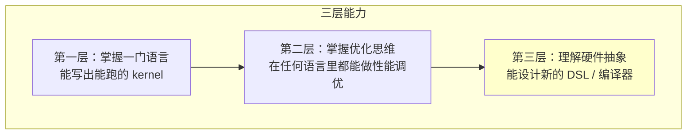
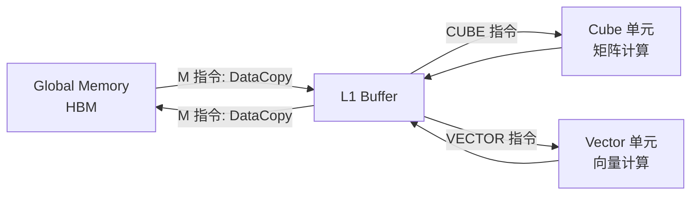
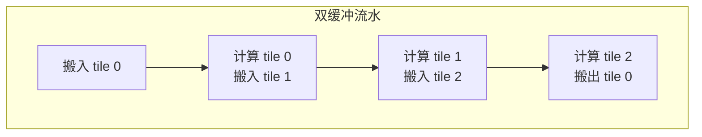
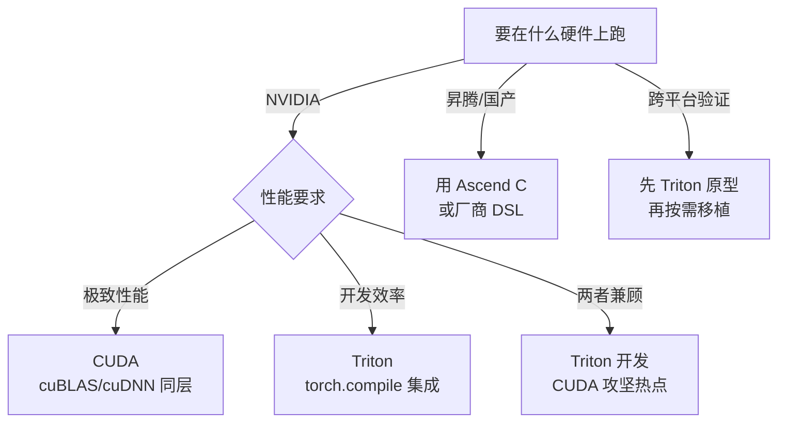

> **算子开发与优化系列 · 第 02 篇 / 共 13 篇**
>
> [01 硬件架构](/2026/09/03/op-01-hardware/) ← **本篇** → [03 性能分析](/2026/09/03/op-03-performance-analysis/)

**TL;DR**
> * **背景**：理解硬件（01 篇）之后，第一个现实问题就是：用什么语言写 kernel？CUDA 灵活但繁琐，Triton 高效但受限，Ascend C 是国产化必须。选错语言，轻则开发慢，重则被硬件特性困死。
> * **核心发现**：这三门语言本质上是**同一套硬件心智模型的三套表达**。CUDA 给你最底层控制（性能上限最高），Triton 把底层优化交给编译器（开发效率最高），Ascend C 介于两者之间且显式管理数据流。**高性能 kernel 的思维是通用的，语言只是语法糖。**
> * **收益**：掌握三门语言的定位与取舍后，你能在 10 分钟内为任意算子选对语言，并且看懂不同语言写出的 kernel 在做什么——这是"算子专家"的核心能力。
> * **适用人群**：会用 PyTorch、想深入 kernel 层，但还没系统对比过 CUDA/Triton/Ascend C 的工程师。

---

## 1. 为什么要学三门语言

先看一个行业现实：

- **NVIDIA 生态**：CUDA 是底层标准，Triton 是上层效率工具，被 torch.compile 和 OpenAI 大量使用
- **国产化生态**：昇腾用 Ascend C，寒武纪有 BANG C，海光/沐曦走 ROCm 或 CUDA 兼容路线（类 CUDA），思路都与 Ascend C 高度相似
- **大厂招聘**：算子开发岗面试必问 CUDA 优化细节，也越来越多问 Triton 和国产 NPU

**能力模型**：



**本文定位**：帮你在"第一层"快速补齐三门语言，同时建立"第二层"的迁移思维——**优化的本质是共通的，语言差异只是表达方式不同**。

---

## 2. CUDA C++：底层之王，性能上限最高

### 2.1 核心心智模型

CUDA 让你直接面向硬件编程。你的每个决策都直接影响硬件行为：

| CUDA 概念 | 硬件对应 | 编程控制点 |
|---|---|---|
| Thread / Block / Grid | 硬件线程 / SM 内 block / kernel | 手动指定规模 |
| Register | 寄存器堆 | 间接控制（编译器分配） |
| Shared Memory | SM 内高速存储 | 手动管理生命周期 |
| Global Memory | HBM + L2 | 手动控制合并访问 |
| `__syncthreads()` | block 内同步 | 手动保证数据可见性 |
| Warp / `warpShuffle` | warp 内寄存器交换 | 手动利用 |

### 2.2 一个完整的 CUDA Kernel：向量加法

```cuda
__global__ void vector_add(const float* a, const float* b, float* c, int n) {
    int idx = blockIdx.x * blockDim.x + threadIdx.x;
    if (idx < n) {
        c[idx] = a[idx] + b[idx];
    }
}

// 启动：<<<grid, block>>> 语法
int n = 1 << 20;
int block = 256;
int grid = (n + block - 1) / block;
vector_add<<<grid, block>>>(d_a, d_b, d_c, n);
```

**关键语法点**：
- `__global__`：在设备上执行、从主机调用
- `blockIdx` / `blockDim` / `threadIdx`：内建变量，用于计算线程全局 ID
- 启动配置 `<<<grid, block>>>`：手动指定并行度

### 2.3 用 CUDA 做性能优化：以访存优化为例

```cuda
// 优化 1：向量化访问（float4，一次读 16 字节）
__global__ void vector_add_vec4(const float4* a, const float4* b, float4* c, int n) {
    int idx = blockIdx.x * blockDim.x + threadIdx.x;
    if (idx < n) {
        c[idx].x = a[idx].x + b[idx].x;
        c[idx].y = a[idx].y + b[idx].y;
        c[idx].z = a[idx].z + b[idx].z;
        c[idx].w = a[idx].w + b[idx].w;
    }
}
```

### 2.4 CUDA 的典型瓶颈与对策

| 瓶颈 | 原因 | 对策 |
|---|---|---|
| 访存不合并 | warp 内线程访问跨步地址 | 重新组织索引计算，保证连续访问 |
| 共享内存 bank 冲突 | 同 warp 多线程访问同 bank | padding、调整访问模式 |
| 低 Occupancy | 寄存器/共享内存占用过高 | 减少每线程资源、拆 block |
| 分支分歧 | warp 内条件分叉 | 按 warp 对齐分支、predication |

> **CUDA 适合**：需要极致性能、精细控制、或涉及厂商 SDK 深度集成的场景（cuBLAS/cuDNN 底层、NCCL、自研算子库）。

---

## 3. Triton：编译器接管优化的效率工具

### 3.1 为什么需要 Triton

CUDA 的痛点是**编译器只负责指令调度，数据布局、共享内存、流水线都得人写**。Triton 的理念相反：**程序员只写逻辑，编译器负责指令生成、布局、流水线**。

| 维度 | CUDA | Triton |
|---|---|---|
| 编程粒度 | 线程级（每个线程做什么） | **Tile 级**（每个 block 处理一块数据） |
| 数据布局 | 程序员手动管理（fragment 等） | 编译器自动推导 |
| 共享内存 | 手动声明 + 手动拷贝 | 自动 tiling 与同步 |
| Tensor Core | 手动 wmma/mma 指令 | `tl.dot` 自动生成 |
| 性能 | 上限最高，但高度依赖人 | 接近手写（通常 80-95%），开发快 10 倍 |

### 3.2 Triton 核心概念

```python
import triton
import triton.language as tl

@triton.jit
def add_kernel(x_ptr, y_ptr, output_ptr, n_elements, BLOCK_SIZE: tl.constexpr):
    pid = tl.program_id(0)  # 类似 blockIdx.x
    block_start = pid * BLOCK_SIZE
    offsets = block_start + tl.arange(0, BLOCK_SIZE)  # 一维 tile 索引
    mask = offsets < n_elements
    x = tl.load(x_ptr + offsets, mask=mask)
    y = tl.load(y_ptr + offsets, mask=mask)
    output = x + y
    tl.store(output_ptr + offsets, output, mask=mask)
```

**理解 Triton 的三个心智模型**：

1. **Tile 思维**：你操作的不是单个元素，而是一块数据（`tl.arange` 生成索引数组）
2. **自动优化**：编译器自动决定如何用 warp、如何排共享内存、如何生成 Tensor Core 指令
3. **Mask 处理边界**：`mask=` 参数处理越界访问，编译器生成 predicated 代码

### 3.3 Triton 的 GEMM（对比 05 篇的 CUDA 版）

```python
@triton.jit
def matmul_kernel(
    a_ptr, b_ptr, c_ptr,
    M, N, K,
    stride_am, stride_ak, stride_bk, stride_bn, stride_cm, stride_cn,
    BLOCK_M: tl.constexpr, BLOCK_N: tl.constexpr, BLOCK_K: tl.constexpr,
):
    pid_m = tl.program_id(0)
    pid_n = tl.program_id(1)
    offs_m = pid_m * BLOCK_M + tl.arange(0, BLOCK_M)
    offs_n = pid_n * BLOCK_N + tl.arange(0, BLOCK_N)
    offs_k = tl.arange(0, BLOCK_K)

    acc = tl.zeros((BLOCK_M, BLOCK_N), dtype=tl.float32)
    for k in range(0, K, BLOCK_K):
        a = tl.load(a_ptr + offs_m[:, None] * stride_am + offs_k[None, :] * stride_ak)
        b = tl.load(b_ptr + offs_k[:, None] * stride_bk + offs_n[None, :] * stride_bn)
        acc = tl.dot(a, b, acc)
    tl.store(c_ptr + offs_m[:, None] * stride_cm + offs_n[None, :] * stride_cn, acc)
```

**注意**：这里没有 `__syncthreads`、没有共享内存声明、没有 Tensor Core fragment——**全部由编译器搞定**。

### 3.4 Triton 的局限

| 局限 | 说明 |
|---|---|
| 不擅长不规则控制流 | while 循环、动态索引较难表达 |
| 算子范围有限 | 更适合计算规则、shape 固定的算子 |
| 调试困难 | 编译产物不透明，`tl.static_print` 有限 |
| 硬件支持 | 主要面向 NVIDIA，对国产 NPU 支持有限 |

> **Triton 适合**：快速开发新算子（配合 torch.compile）、原型验证、需要融合的模型算子（FlashAttention 等）、以及不追求最后一丁点性能的场景。

---

## 4. Ascend C：国产 NPU 的显式数据流编程

### 4.1 核心差异：显式数据搬运

昇腾 AI Core 的架构是 **Cube + Vector 分离**，数据流通过 **M（搬运）指令** 显式管理：



### 4.2 Ascend C 编程模型：以向量加法为例

```cpp
#include "kernel_operator.h"

using namespace AscendC;

constexpr int32_t BUFFER_NUM = 2;  // 双缓冲

class KernelAdd {
public:
    __aicore__ inline KernelAdd(GM_ADDR x, GM_ADDR y, GM_ADDR out,
                                uint32_t totalLength, uint32_t tileLength)
        : xGlobal(x), yGlobal(y), outGlobal(out),
          totalLength(totalLength), tileLength(tileLength) {}

    __aicore__ inline void Init() {
        // 1. 分配全局内存视图（GlobalTensor 是对 GM 的抽象）
        xGm.SetGlobalBuffer((__gm__ float*)xGlobal, totalLength);
        yGm.SetGlobalBuffer((__gm__ float*)yGlobal, totalLength);
        outGm.SetGlobalBuffer((__gm__ float*)outGlobal, totalLength);

        // 2. 分配本地内存（LocalTensor 是对 L1/UB 的抽象）
        pipe.InitBuffer(inQueueX, BUFFER_NUM, tileLength * sizeof(float));
        pipe.InitBuffer(inQueueY, BUFFER_NUM, tileLength * sizeof(float));
        pipe.InitBuffer(outQueue, BUFFER_NUM, tileLength * sizeof(float));
    }

    __aicore__ inline void Process() {
        // 3. 按 tile 遍历数据（为简洁省略末尾不足一个 tile 的余数处理，
        //    生产代码需按 totalLength % tileLength 单独处理最后一块）
        for (int32_t i = 0; i < totalLength / tileLength; i++) {
            CopyIn(i);   // 搬入：GM -> L1
            Compute(i);  // 计算：L1 上的 Vector 指令
            CopyOut(i);  // 搬出：L1 -> GM
        }
    }

private:
    __aicore__ inline void CopyIn(int32_t i) {
        LocalTensor<float> xLocal = inQueueX.AllocTensor<float>();
        LocalTensor<float> yLocal = inQueueY.AllocTensor<float>();
        DataCopy(xLocal, xGm[i * tileLength], tileLength);
        DataCopy(yLocal, yGm[i * tileLength], tileLength);
        inQueueX.EnQue(xLocal);
        inQueueY.EnQue(yLocal);
    }

    __aicore__ inline void Compute(int32_t i) {
        LocalTensor<float> xLocal = inQueueX.DeQue<float>();
        LocalTensor<float> yLocal = inQueueY.DeQue<float>();
        LocalTensor<float> outLocal = outQueue.AllocTensor<float>();
        Add(outLocal, xLocal, yLocal, tileLength);  // Vector 加法指令
        inQueueX.FreeTensor(xLocal);
        inQueueY.FreeTensor(yLocal);
        outQueue.EnQue(outLocal);
    }

    __aicore__ inline void CopyOut(int32_t i) {
        LocalTensor<float> outLocal = outQueue.DeQue<float>();
        DataCopy(outGm[i * tileLength], outLocal, tileLength);
        outQueue.FreeTensor(outLocal);
    }

private:
    GlobalTensor<float> xGlobal, yGlobal, outGlobal;
    TPipe pipe;
    TQue<QuePosition::VECIN, BUFFER_NUM> inQueueX, inQueueY;
    TQue<QuePosition::VECOUT, BUFFER_NUM> outQueue;
    uint32_t totalLength, tileLength;
};

extern "C" __global__ __aicore__ void add_kernel(GM_ADDR x, GM_ADDR y,
                                                 GM_ADDR out, GM_ADDR workspace) {
    GET_TILING_DATA(tilingData, workspace);
    KernelAdd op(x, y, out, tilingData.totalLength, tilingData.tileLength);
    op.Init();
    op.Process();
}
```

### 4.3 Ascend C 的核心心智模型

| Ascend C 概念 | 说明 |
|---|---|
| `GlobalTensor` | 对 GM（全局内存）的抽象，类似 CUDA 的全局指针 |
| `LocalTensor` | 对本地内存（L1/UB）的抽象 |
| `TQue` / `TPipe` | 队列/流水，管理数据双缓冲与同步 |
| `DataCopy` | 显式数据搬运指令（M 指令） |
| `Add` / `Muls` / `Axpy` | Vector 单元指令 |
| `tiling` | 把大张量切分成小块的核心策略 |

**关键理解**：
- **没有隐式缓存**：数据必须显式 `DataCopy` 进 L1 才能计算
- **流水线显式化**：`EnQue`/`DeQue` 是生产者-消费者队列，实现双缓冲
- **Tiling 策略**：`totalLength` 被切成 `tileLength` 的块，每块走一遍 搬入→计算→搬出

### 4.4 Ascend C 的双缓冲

双缓冲是昇腾 kernel 性能的核心：**搬入第 N+1 块时，计算第 N 块**。



`BUFFER_NUM = 2` 就是双缓冲：队列里同时有两块 buffer，一块在计算、一块在搬运。

---

## 5. 三门语言选型决策树



### 5.1 选型决策表

| 场景 | 推荐 | 理由 |
|---|---|---|
| NVIDIA 上追求峰值性能 | CUDA | 精细控制，但开发慢 |
| 快速实现新算子/融合算子 | Triton | 10 倍开发效率，80-95% 性能 |
| 昇腾部署/国产化 | Ascend C | 唯一选择（或 CANN 库） |
| 算子库/框架底层 | CUDA | 与 cuBLAS 等生态对齐 |
| 教学/原型 | Triton | 心智负担最小 |
| 需要极致显存控制 | CUDA | Triton 显存管理较黑盒 |

### 5.2 一个实战策略：Triton 先行，CUDA 攻坚

对大多数业务算子，推荐**混合策略**：

1. **先用 Triton 写**，跑通逻辑、拿到 80% 性能基线
2. **用 profiler 定位**（03 篇）真正是热点的 kernel
3. **对热点 kernel 手写 CUDA**，精确控制访存和指令调度
4. **回归测试**：新 CUDA 版本必须比 Triton 版本快且正确

这个策略兼顾了开发效率和最终性能。

---

## 6. 三种语言的通用优化思维（迁移清单）

三门语言语法不同，但**优化思维的 80% 是共通的**：

| 优化维度 | CUDA 表达 | Triton 表达 | Ascend C 表达 |
|---|---|---|---|
| 减少访存 | 手动 tiling + 共享内存 | 编译器自动 | 手动 tiling + DataCopy |
| 提高复用 | 共享内存换手 | `tl.dot` 自动 | L1 Buffer + 双缓冲 |
| 并行度 | 手动配 grid/block | `num_warps` 参数 | 自动 + tiling 策略 |
| 向量化 | `float4` | 编译器自动 | 自动（Vector 指令） |
| 同步 | `__syncthreads()` | 自动 | `EnQue/DeQue` 队列 |
| 分支优化 | predication | mask | 尽量少分支 |

**核心结论**：**当你理解了一种语言的性能优化，就能迁移到另一种语言。** 你学的是"如何让硬件高效工作"，语言只是表达工具。

---

## 7. Lab Exercises

### Exercise 1：三种语言写同一个算子

用 CUDA、Triton、Ascend C（如有环境）分别实现向量加法，对比：
- 代码行数（Ascend C 通常最多，Triton 最少）
- 开发时间（自己计时）
- 性能（在 NVIDIA 上对比前两者，用 `triton.testing.do_bench`）

**预期结果**：Triton 代码量约为 CUDA 的 1/3，性能通常达到 CUDA 的 80-100%（对 elementwise 这种简单算子可能完全打平）。

### Exercise 2：Triton 写出 GEMM 并对比 cuBLAS

用 05 篇的 Triton GEMM 代码，在 4096³ 输入上与 `torch.matmul`（底层 cuBLAS）对比：
- 调整 `BLOCK_M/BLOCK_N/BLOCK_K` 和 `num_warps`
- 记录每个配置的 TFLOPS
- 看差距是否在 10% 以内（是则说明 Triton 自动优化已经很好）

### Exercise 3：理解 Ascend C 的数据流（无硬件也可做）

即使没有昇腾硬件，也可以阅读 [昇腾官方 Kernel 开发指南](https://www.hiascend.com/) 的向量加法样例，用纸面画出：
- 每个 tile 的数据在 GM/L1/Vector 之间的流动
- 双缓冲下时间轴上"搬入-计算-搬出"的排布
- 思考：如果把 `BUFFER_NUM` 改成 3（三缓冲），流水线还能再压缩什么空闲？

---

## 8. 参考资料

1. NVIDIA. *CUDA C++ Programming Guide*. [docs.nvidia.com](https://docs.nvidia.com/cuda/cuda-c-programming-guide/)
2. Tillet et al. *Triton: An Intermediate Language and Compiler for Tiled Neural Network Computations*. [arXiv:2002.09960](https://arxiv.org/abs/2002.09960)
3. 华为昇腾. *Ascend C 算子开发指南*. [昇腾社区](https://www.hiascend.com/document)
4. OpenAI. *Triton Language Documentation*. [triton-lang.org](https://triton-lang.org/)
5. 知乎. *从 CUDA 到 Triton：算子开发效率与性能的平衡*. [知乎专栏](https://zhuanlan.zhihu.com/p/662514989)

---

*上一篇：[01 硬件架构](/2026/09/03/op-01-hardware/)*
*下一篇：[03 性能分析](/2026/09/03/op-03-performance-analysis/) —— 15 分钟定位算子瓶颈的方法论。*