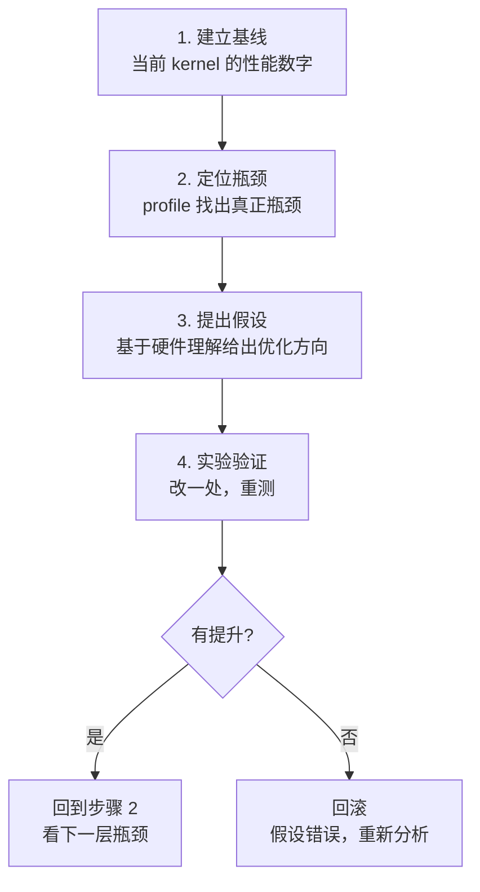
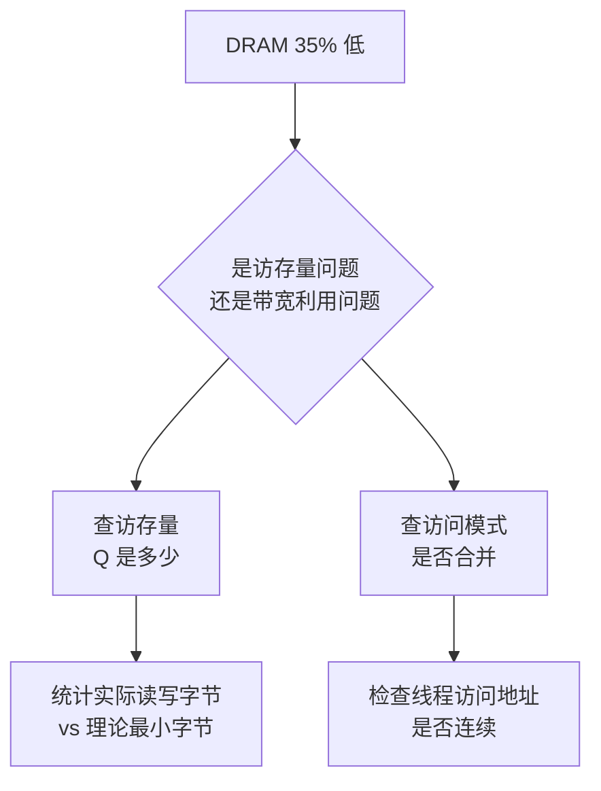

> **算子开发与优化系列 · 第 03 篇 / 共 13 篇**
>
> [02 Kernel 语言](/2026/09/03/op-02-kernel-languages/) ← **本篇** → [04 优化技术](/2026/09/03/op-04-optimization-techniques/)

**TL;DR**
> * **背景**：Roofline 模型给了你理论判断，但实际 kernel 往往"感觉慢"却说不出慢在哪。没有 profiling 数据的优化是玄学——这是算子开发最核心的一条纪律。
> * **核心发现**：定位瓶颈有一套**固定流程**：先用工具拿到**全局视图**（哪些 kernel 最慢、GPU 利用率多少），再对目标 kernel 做**微观分析**（瓶颈是访存/算力/延迟/占用率），最后用**假设-实验**闭环验证。90% 的算子性能问题能在 15 分钟内定位。
> * **收益**：掌握 Nsight Compute/Systems 的关键指标解读，建立"先测后优"的工程纪律，杜绝拍脑袋优化。
> * **适用人群**：写过 kernel 但 profiling 只停留在"看个时间"阶段的工程师。

---

## 1. 为什么性能分析要先于优化

**铁律：没有 profiling 数据的优化都是玄学。**

一个典型反例：

> 工程师 A 花了 3 天把 kernel 的共享内存分配改成了动态分配，觉得"应该更快"，结果性能下降 20%。他完全没测过——原 kernel 的瓶颈其实是 L2 未命中，共享内存改动毫无意义。

**正确的顺序永远是**：



**关键纪律**：
- **一次只改一个变量**（改两个变量无法归因）
- **每次改动都要重测**（保存基线和每次实验的数字）
- **没有数据支撑的"优化"不做**（尊重 profiler，不尊重直觉）

---

## 2. 第一层：全局视图（Nsight Systems）

### 2.1 Nsight Systems 定位什么

Nsight Systems（`nsys`）回答**"时间花在哪里"**——它是系统级 profiler：

| 能回答的问题 | 典型输出 |
|---|---|
| 哪些 kernel 占了最多时间？ | Timeline + kernel 耗时排序 |
| GPU 利用率是多少？有没有空闲气泡？ | GPU Utilization 曲线 |
| 有没有 host-device 同步等待？ | `cudaMemcpy`、同步点高亮 |
| 有没有 CPU 端瓶颈？ | CPU 侧函数栈 |

### 2.2 基本用法

```bash
# 采集（profile 一个 Python 脚本）
nsys profile -o myapp --force-overwrite true python my_model.py

# 查看结果（GUI 或 CLI）
nsys stats myapp.nsys-rep
```

**Timeline 怎么看**：

```mermaid
gantt
    title GPU Timeline 示意
    dateFormat  X
    axisFormat  %s
    section Kernel A
    GEMM: 0, 5
    section Kernel B
    Softmax: 5, 8
    section Kernel C
    GEMM: 8, 13
    section Gap
    空闲: 13, 15
```



### 2.3 全局视图的三种典型病症

| 病症 | 表现 | 对策 |
|---|---|---|
| **Kernel 少但慢** | 时间集中在几个大 kernel | 去微观分析（第 3 节） |
| **Kernel 多但碎** | 大量短 kernel 密集排布 | 做算子融合/图优化 |
| **大量空闲气泡** | GPU 利用率低、等待 CPU | 异步化、减少同步、用 CUDA Graph |

> **要点**：全局视图告诉你**优化哪个 kernel**，而不是怎么优化。

---

## 3. 第二层：微观分析（Nsight Compute）

### 3.1 Nsight Compute（`ncu`）回答什么

`ncu` 回答**"单个 kernel 为什么慢"**。它对每个 kernel 给出上百个硬件计数器，其中最关键的几个：

| 指标 | 含义 | 判断标准 |
|---|---|---|
| `Compute (SM) Throughput` | 计算单元利用率 | > 80% = 计算瓶颈 |
| `Memory Throughput` | 访存单元利用率 | > 80% = 访存瓶颈 |
| `DRAM Throughput` | 实际带宽利用率 | 访存密集算子的关键 |
| `Achieved Occupancy` | 实际占用率 | 与理论值对比 |
| `Registers Per Thread` | 每线程寄存器数 | 过高会压占用率 |
| `Warp Stall` 分布 | warp 卡在哪 | 定位延迟原因 |
| `Achieved FLOPS` | 实际算力 | 与 Roofline 对比 |

### 3.2 基本用法

```bash
# 只 profile 指定的 kernel（--kernel-name 过滤）
ncu --kernel-name regex --launch-count 1 ./my_kernel

# 输出关键 section
ncu --section SpeedOfLight --section Occupancy --section WarpStateStats ./my_kernel
```

### 3.3 瓶颈判定的三查法

拿到 ncu 输出后，按顺序做三个判断：

**第一步：查 Speed of Light（SOL）**

```
Compute (SM) Throughput:  25.3%
Memory Throughput:        91.2%
DRAM Throughput:          87.5%
```

- 谁高谁就是瓶颈。这里 Memory 91% >> Compute 25%，**访存瓶颈**实锤。

**第二步：查 Occupancy 与资源**

```
Achieved Occupancy:  45.3%  (理论 62.5%)
Registers Per Thread: 128
```

- 如果占用率远低于理论，找原因：寄存器太多？共享内存太多？block 太小？

**第三步：查 Warp 状态（为什么 stall）**

```
Warp State Statistics:
  Stall Long Scoreboard:  48.2%   ← 等全局内存数据
  Stall Wait:             15.0%
  Stall MIO Throttle:     12.0%
```

- `Long Scoreboard` 高 = 大量线程在等全局内存 → 访存密集/延迟未隐藏
- `Short Scoreboard` 高 = 等共享内存 → 共享内存瓶颈或 bank 冲突
- `Wait` 高 = 等待同 block 其他 warp → 同步/负载不均

### 3.4 瓶颈-对策速查表

| 瓶颈信号 | 根因 | 对策 |
|---|---|---|
| Memory Throughput 高 + Compute 低 | 访存密集 | 减少访存、融合、提高复用 |
| Compute Throughput 高 + Memory 低 | 计算密集 | 用 Tensor Core、减少无用计算 |
| Occupancy 远低于理论 | 资源超配 | 减寄存器、减共享内存、调 block |
| Long Scoreboard 高 | 全局内存延迟暴露 | 提高占用率、预取、双缓冲 |
| Short Scoreboard 高 | 共享内存延迟/冲突 | 消 bank 冲突、减小共享内存粒度 |
| MIO Throttle 高 | 访存指令过密 | 合并指令、向量化 |

---

## 4. 第三步：假设-实验闭环（优化迭代）

### 4.1 完整案例分析：一个慢的 Softmax

**场景**：手写 Softmax kernel，`ncu` 数据显示 DRAM Throughput 只有 35%。

**分析路径**：



**假设 1：访存不合并**
- 检查线程访问模式 → 发现 `exp()` 后的临时数组写入是跨步的
- 修正：改为连续写入 → DRAM 升到 60%

**假设 2：访存量过大**
- 统计发现算了两次 `exp`（一次求 max 一次求 exp）→ 额外读写了中间结果
- 修正：Online Softmax（06 篇会详讲）一次遍历 → DRAM 升到 85%

**假设 3：带宽利用不足**
- 检查向量化：标量访问 vs float4 → 向量化后升到 92%

**结果**：三个假设依次验证，每个改动都带来可量化提升。这就是"假设-实验"闭环。

### 4.2 建立实验记录表

| 实验 | 改动 | 基线性能 | 新性能 | 提升 | 结论 |
|---|---|---|---|---|---|
| 基线 | 无 | 35% DRAM | - | - | - |
| E1 | 连续写入 | 35% | 60% | +25pp | 合并访问有效 |
| E2 | Online 算法 | 60% | 85% | +25pp | 减访存量有效 |
| E3 | 向量化 | 85% | 92% | +7pp | 带宽利用到位 |

**这就是可审计的优化**——每一步都有数据支撑，可回滚，可复现。

---

## 5. 常见 profiling 陷阱

### 5.1 陷阱列表

| 陷阱 | 说明 | 规避 |
|---|---|---|
| **Warmup 不足** | 首次调用含编译/初始化 | 预热后再计时 |
| **同步缺失** | CUDA 异步导致计时不准 | `torch.cuda.synchronize()` |
| **只看平均时间** | 忽略 tail latency | 看 P50/P99 |
| **profile 开销** | ncu 的插桩改变行为 | 用 `--launch-count` 限制 |
| **忽略 L2 污染** | 数据没进缓存就测 | 多次运行取稳定值 |
| **错误统计 FLOPs** | 没算 padding/sparse | 用真实有效 FLOPs |
| **结论跳过验证** | 优化后不重测 | 每次都回归 |

### 5.2 计时工具的正确用法

```python
import torch
import triton.testing as tt

# 用 Triton 的计时工具（自带 warmup + sync）
time_ms = tt.do_bench(lambda: my_kernel(), warmup=25, rep=100)
```

```bash
# CUDA 端标准计时
nvcc -o bench bench.cu && ncu --section SpeedOfLight ./bench
```

---

## 6. 面向生产环境的 profiling 工作流

生产环境往往不能跑交互式 ncu，需要**可复现的自动化基准**：

```
1. 建 benchmark 脚本（固定 shape、固定数据、自动 warmup）
2. 保存基线 JSON（每个 kernel 的耗时、TFLOPS、带宽）
3. 每次改动跑 benchmark，diff 前后差异
4. 用 CI 门禁：性能回退 > 5% 则拦截合并
```

**推荐工具**：
- `triton.testing.do_bench`：快速可靠
- `torch.profiler`：PyTorch 内嵌分析
- `nsys/ncu`：深入硬件级
- 自研 benchmark harness：长期项目必备

---

## 7. Lab Exercises

### Exercise 1：完整 profiling 一个 GEMM

用 Triton 实现一个 GEMM，然后：
1. `nsys` 全局视图：GEMM 是不是耗时最多的 kernel？
2. `ncu --section SpeedOfLight`：Compute vs Memory Throughput 谁高？
3. 调整 `BLOCK_K`（16→64→128），观察占用率和带宽变化
4. 记录完整实验表，写一段分析结论

**预期结果**：Compute Throughput 明显高于 Memory，符合计算密集判断；BLOCK_K 有最优值（太小访存次数多、太大寄存器溢出）。

### Exercise 2：制造并诊断一个性能问题

故意写一个**访存不合并**的 kernel（例如 `a[tid * stride]` 跨步访问），然后：
1. 用 ncu 确认 Memory Throughput 异常低
2. 用 Speed of Light section 确认瓶颈是访问模式而非访存量
3. 修复为合并访问，对比提升

**这是训练"读指标→归因"能力的最佳练习。**

### Exercise 3：建立你自己的 benchmark 模板

写一个 Python 脚本模板，包含：
- `warmup` + `rep` 参数
- 自动输出 TFLOPS / GB/s / 延迟
- 可保存为 JSON 方便 diff

以后每次写 kernel 都套这个模板，形成纪律。

---

## 8. 参考资料

1. NVIDIA. *Nsight Compute User Guide*. [docs.nvidia.com](https://docs.nvidia.com/nsight-compute/)
2. NVIDIA. *Nsight Systems User Guide*. [docs.nvidia.com](https://docs.nvidia.com/nsight-systems/)
3. NVIDIA. *Profiling and Performance Tuning Guide*. [NVIDIA Developer](https://developer.nvidia.com/blog/tag/profiling/)
4. 知乎. *Nsight Compute 关键指标解读*. [知乎专栏](https://zhuanlan.zhihu.com/p/600750191)
5. NVIDIA. *Speed of Light 分析框架*. [docs.nvidia.com](https://docs.nvidia.com/nsight-compute/ProfilingGuide/)

---

*上一篇：[02 Kernel 语言](/2026/09/03/op-02-kernel-languages/)*
*下一篇：[04 优化技术](/2026/09/03/op-04-optimization-techniques/) —— 优化技术体系全景。*