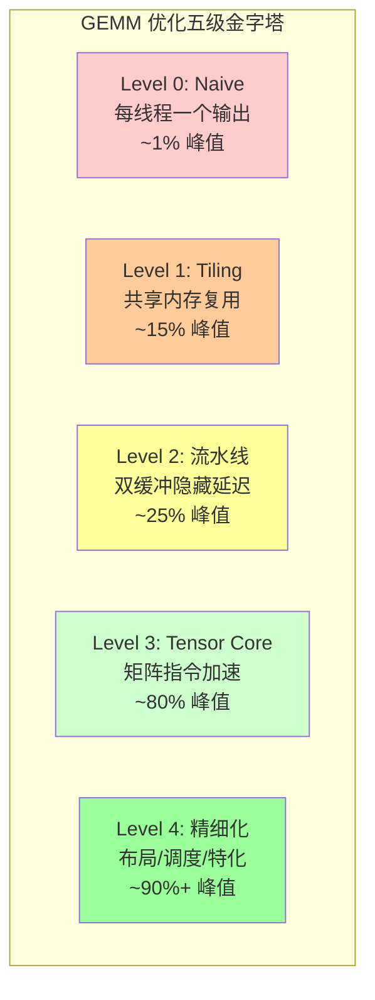
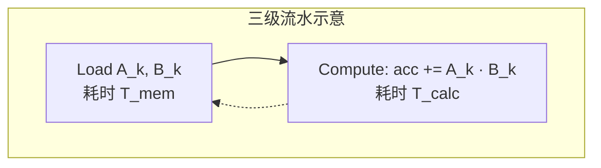

> **算子开发与优化系列 · 第 05 篇 / 共 13 篇**
>
> [04 优化技术](/2026/09/03/op-04-optimization-techniques/) ← **本篇** → [06 Attention 案例](/2026/09/03/op-06-case-attention/)

**TL;DR**
> * **背景**：GEMM 是深度学习计算量最大的算子（Transformer 的 90%+ 计算量来自矩阵乘），也是算子优化领域最经典的教科书案例。理解了 GEMM 的金字塔式优化路径，就理解了一半的 kernel 优化。
> * **核心发现**：GEMM 性能从 naive 到峰值要跨过 **5 个台阶**——Naive（~1% 峰值）→ Tiling（~15%）→ 共享内存 + 流水线（~25%，逼近 FP16 CUDA Core 上限）→ Tensor Core（~80%）→ 精细化（~90%+）。每一步都由一个明确的瓶颈驱动，这也是为什么 GEMM 是学习优化的最佳教材。
> * **收益**：亲手走完整个金字塔后，你将理解"优化是逐步逼近 Roofline 上界的过程"，并掌握一套可迁移到任意算子的优化方法论。
> * **适用人群**：会用 PyTorch/Triton 写 GEMM、想理解 cuBLAS 为什么能跑那么快、以及想建立完整优化路径认知的工程师。

---

## 1. GEMM 的定义与性能上界

### 1.1 数学定义

GEMM（General Matrix Multiplication）：

$$
C_{M \times N} = \alpha \cdot A_{M \times K} \cdot B_{K \times N} + \beta \cdot C_{M \times N}
$$

深度学习中最常见的是 $\alpha=1, \beta=0$ 的简化形式：$C = A \cdot B$。

### 1.2 计算量与算术强度

- **计算量**：$W = 2 \times M \times N \times K$ FLOPs（每输出一个元素做 K 次乘加 = 2K FLOPs）
- **访存量**（理想 tiling 后）：$Q \approx (M \cdot K + K \cdot N) \times \text{bytes}$（C 的写回相对小）
- **算术强度**：$I = \frac{W}{Q} = \frac{2MNK}{(MK + KN) \times 2\,\text{B}}$（FP16 每元素 2 字节）

以 $M=N=K=4096$ 为例：

$$
I = \frac{2 \times 4096^3}{(4096^2 + 4096^2) \times 2} = \frac{1.37 \times 10^{11}}{6.71 \times 10^7} \approx 2048 \text{ FLOPs/Byte}
$$

> **口径说明**：这里 $Q$ 只算 A、B 的读入（C 的写回相对很小）；若像 00 篇那样把 C 的写回也算进 $Q$，则 $I \approx 1345$。两种口径都远大于 H100 dense FP16 的 ridge point（$\sim148$），**GEMM 是典型的 Compute Bound**——优化目标是算力利用率，不是带宽。

### 1.3 性能上界（H100 示例）

| 硬件 | FP16 峰值 | 理论上界（dense 算力利用率 85-93%） |
|---|---|---|
| H100 SXM | 494.7 TFLOPS（dense；含 2:4 稀疏为 989.4） | ~420-460 TFLOPS（需 Tensor Core + 完美调度） |
| A100 | 312 TFLOPS | ~250-280 TFLOPS |
| 4090 | 82.6 TFLOPS | ~65-75 TFLOPS |

---

## 2. 性能金字塔全景



每一级都由**前一级的瓶颈**驱动。下面逐级展开。

---

## 3. Level 0：Naive 实现（为什么慢）

### 3.1 代码

```cuda
// Naive: 每个线程计算一个输出元素
__global__ void gemm_naive(const float* A, const float* B, float* C,
                           int M, int N, int K) {
    int row = blockIdx.y * blockDim.y + threadIdx.y;
    int col = blockIdx.x * blockDim.x + threadIdx.x;
    if (row < M && col < N) {
        float sum = 0.0f;
        for (int k = 0; k < K; k++) {
            sum += A[row * K + k] * B[k * N + col];
        }
        C[row * N + col] = sum;
    }
}
```

### 3.2 为什么只有 ~1% 峰值

**瓶颈分析**（对照 03 篇的 ncu 指标）：

| 问题 | 根因 | 后果 |
|---|---|---|
| **零数据复用** | 每个线程只算 1 个输出元素，A 行/B 列被不同线程重复读取但没有片上共享 | 算术强度 ≈ 1/d（FP32 约 0.25），远低于 ridge point（~148） |
| **访存总量 O(MNK)** | 每个输出元素都要从 HBM 读 A 行 + B 列共 2K 个数据 | DRAM 流量 = 2MNK·d，很快打满带宽 |
| **L2 无法兜底** | 矩阵工作集远大于 L2（4096²×4B ≈ 64MB/个），重复读取无法命中 | 每次读取都落 HBM |

**核心问题**：这个 naive 实现实际上变成了 **Memory Bound**！算术强度 $I \approx 0.25$（FP32），远低于 ridge point ~148，所以它根本到不了计算峰值——**它在浪费算力**。

> **关键教训**：GEMM naive 慢不是"计算不够快"，而是"数据复用不够"，把计算密集的算法写成了访存密集的。

---

## 4. Level 1：Tiling + 共享内存

### 4.1 思路

把矩阵切成 tile，每个线程块负责一个输出 tile。数据先整块读入共享内存，**每个元素被块内所有线程复用**。

### 4.2 代码（Triton 版，更清晰）

```python
import triton
import triton.language as tl

@triton.jit
def gemm_tiled(a_ptr, b_ptr, c_ptr, M, N, K,
               stride_am, stride_ak, stride_bk, stride_bn, stride_cm, stride_cn,
               BM: tl.constexpr, BN: tl.constexpr, BK: tl.constexpr):
    pid_m = tl.program_id(0)
    pid_n = tl.program_id(1)

    offs_m = pid_m * BM + tl.arange(0, BM)
    offs_n = pid_n * BN + tl.arange(0, BN)
    offs_k = tl.arange(0, BK)

    a_ptrs = a_ptr + offs_m[:, None] * stride_am + offs_k[None, :] * stride_ak
    b_ptrs = b_ptr + offs_k[:, None] * stride_bk + offs_n[None, :] * stride_bn

    acc = tl.zeros((BM, BN), dtype=tl.float32)

    for k in range(0, K, BK):
        a = tl.load(a_ptrs)      # 编译器自动放共享内存
        b = tl.load(b_ptrs)
        acc = tl.dot(a, b, acc)  # 编译器自动生成 mma 指令
        a_ptrs += BK * stride_ak
        b_ptrs += BK * stride_bk

    c_ptrs = c_ptr + offs_m[:, None] * stride_cm + offs_n[None, :] * stride_cn
    tl.store(c_ptrs, acc)
```

### 4.3 为什么提升到 ~15%

- **数据复用**：每个 A 元素被 BN 个输出列复用，每个 B 元素被 BM 个输出行复用（BM=BN=128 时各复用 128 次）
- **算术强度**：从 naive 的 1/d（FP16 约 0.5）提升到 $2BM \cdot BN / ((BM+BN) \cdot d)$（FP16、BM=BN=128 时约 64 FLOPs/Byte）
- **访存合并**：tile 内连续访问，带宽利用率大幅提升

**剩余瓶颈**：load 和 dot 串行执行——等数据加载完才计算，访存延迟暴露。

---

## 5. Level 2：双缓冲 / 流水线

### 5.1 思路

让"加载第 k+1 块"和"计算第 k 块"重叠，隐藏访存延迟。Triton 编译器对上述代码**自动做 pipelining**，但理解原理仍然重要。

### 5.2 原理（软件流水线）



理想重叠条件：$T_{mem} \le T_{calc}$（搬运比计算快，则延迟完全隐藏）。

**量化**（量级参考，具体因 GPU/SM 而异）：`BK=16`、`BM=BN=128` 时单次迭代搬运 A/B 各 4KB（共 8KB），而计算量仅 $2 \times 128 \times 128 \times 16 \approx 52$ 万 FLOPs——按单 SM 的 Tensor Core dense 峰值（约 3.7 TFLOPS）计算约 140ns；8KB 搬运受每 SM 访存流水（LSU/共享内存）吞吐限制，通常也在几十到百 ns 量级，两者接近时双缓冲能让它们重叠。如果搬运明显更慢（小 BK 的典型情况），就加大 BK 或加深流水线。

### 5.3 CUDA 手动实现要点

```cuda
// 核心：cp.async 异步拷贝 + 双缓冲轮换
__shared__ float As[2][BM][BK], Bs[2][BK][BN];

// 预取第 0 块
cp.async(As[0], ...); cp.async(Bs[0], ...);
cp.async.commit_group();

for (int k = 0; k < K; k += BK) {
    int cur = (k / BK) % 2;
    int nxt = (cur + 1) % 2;
    // 预取下一块
    if (k + BK < K) {
        cp.async(As[nxt], ...); cp.async(Bs[nxt], ...);
        cp.async.commit_group();
    }
    cp.async.wait_group(1);  // 等当前块就绪
    __syncthreads();
    compute(cur);             // 计算当前块
    __syncthreads();
}
```

**收益**：访存延迟被计算隐藏，性能逼近 FP16 CUDA Core 上限（134 TFLOPS），约为 Tensor Core dense 峰值的 ~25%。

---

## 6. Level 3：Tensor Core

### 6.1 为什么必须用 Tensor Core

前面 3 级即使做到完美，也只是把 **CUDA Core** 跑满（FP32 67 / FP16 134 TFLOPS on H100）。而 GEMM 想要 >300 TFLOPS，必须用 **Tensor Core**（FP16 dense 494.7 TFLOPS）。

**差异的本质**：Tensor Core 的 `mma.m16n16k16` 一条 warp 指令完成 16×16×16 = 4096 次 FMA（每线程 128 次），而普通 FMA 指令每线程只做 1 次——单条指令的运算量高 128 倍，再叠加独立的 Tensor Core 硬件流水，FP16 dense 峰值是 FP32 CUDA Core 的约 7.4 倍。因此**矩阵指令让数据供给成为唯一瓶颈**。

### 6.2 Triton 一行搞定

Triton 的 `tl.dot` 在检测到数据类型匹配（FP16/BF16）后**自动生成 Tensor Core 指令**（`mma.sync` 或 Hopper 的 `wgmma`）。上面 Level 1 的代码其实已经是 Tensor Core 版了。

### 6.3 CUDA WMMA 手动版

```cuda
#include <mma.h>
using namespace nvcuda;

// 每个 warp 计算 16x16 输出 tile，用 16x16x16 mma
wmma::fragment<wmma::matrix_a, 16, 16, 16, half, wmma::row_major> a_frag;
wmma::fragment<wmma::matrix_b, 16, 16, 16, half, wmma::col_major> b_frag;
wmma::fragment<wmma::accumulator, 16, 16, 16, float> c_frag;

wmma::fill_fragment(c_frag, 0.0f);
for (int k = 0; k < K; k += 16) {
    wmma::load_matrix_sync(a_frag, &A_s[0][k], BK);   // 从共享内存加载
    wmma::load_matrix_sync(b_frag, &B_s[k][0], BN);
    wmma::mma_sync(c_frag, a_frag, b_frag, c_frag);   // C += A*B
}
wmma::store_matrix_sync(&C_s[0][0], c_frag, BN, wmma::mem_row_major);
```

**关键**：warp 内 32 个线程合作完成 16×16 输出，每个线程持有 c_frag 的 8 个元素。数据布局（fragment）由 API 决定，程序员负责把数据搬到共享内存的正确位置。

---

## 7. Level 4：精细化（布局 / 调度 / 特化）

### 7.1 剩余瓶颈是什么

到 Level 3，GEMM 已经能到 ~80% 峰值（dense）。剩下的 ~10-20% 在 cuBLAS 级别的实现里被榨干，手段包括：

| 手段 | 解决什么 | 收益 |
|---|---|---|
| **Warp 级 tiling**（Swizzling） | 每个 block 内多个 warp 如何分配 tile，减少共享内存 bank 冲突 | +5-10% |
| **异步流水**（cp.async.bulk / TMA on Hopper） | 搬运指令不占用寄存器/计算 | +5% |
| **Double-buffer 加深**（多级流水） | 搬运延迟隐藏更彻底 | +3-5% |
| **L2 优化**（tile 调度顺序） | 相邻 block 共享 L2 中的数据 | +2-3% |
| **输出 epilogue 特化**（激活/转置融合） | 省掉单独的处理 kernel | 融合收益 |
| **FFMA 融合**（fp32 accumulate） | 精度 + 减少指令 | 精度收益 |

### 7.2 Swizzling：消除共享内存 bank 冲突

问题：多个 warp 同时读共享内存的 A tile，若读取模式固定，会命中相同 bank 组。

解法：**按块序交错排列共享内存数据**（swizzle pattern），让不同 warp 访问不同 bank。

```cuda
// 经典 swizzle: 把共享内存索引 XOR 上块号，打散 bank 分布
int swizzled_col = col ^ (row & 0x7);  // 8 路 swizzle
```

### 7.3 特化：SGEMM / HGEMM / 稀疏

- **SGEMM**（FP32）：不用 Tensor Core，靠 FFMA 流水
- **HGEMM**（FP16/BF16）：Tensor Core 主力
- **IMMA**（INT8）：量化推理
- **稀疏 GEMM**（2:4 structured sparsity on Ampere+）：跳过零元素，2 倍吞吐

---

## 8. 完整金字塔的性能数字（H100 示意）

以下数字基于公开的优化实验（具体以实测为准，量级有参考价值）。**Level 0-2 是 FP16 CUDA Core 实现（上限约 134 TFLOPS），Level 3 起切到 Tensor Core，峰值占比统一以 dense FP16 峰值（494.7 TFLOPS）为分母**：

| Level | 手段 | 预估性能 | 峰值占比 |
|---|---|---|---|
| 0 | Naive（CUDA Core） | ~5 TFLOPS | ~1% |
| 1 | Tiling + 共享内存（CUDA Core） | ~60-70 TFLOPS | ~13-14% |
| 2 | + 双缓冲流水（CUDA Core，逼近 134 TFLOPS 上限） | ~110-130 TFLOPS | ~23-26% |
| 3 | + Tensor Core | ~400 TFLOPS | ~80% |
| 4 | + 精细化 | ~445 TFLOPS | ~90% |
| cuBLAS 参考 | 官方库 | ~470 TFLOPS | ~95% |

**注意**：每个台阶的绝对数值因 GPU 型号/精度而异，但**相对提升规律**是普适的——这正是"金字塔"的意义。

> **CUTLASS 的位置**：Level 1-3 的手工实现（共享内存、双缓冲、mma）在 CUTLASS 里全部被模板参数化——`GemmShape` 对应 tiling、`stages` 对应流水深度、mma shape 对应 Tensor Core。**写 CUTLASS 配置 = 在声明金字塔的每一级**，具体实战见第 10 节。

---

## 9. Triton 的自动优化 vs 手写 CUDA

| 维度 | Triton（`tl.dot`） | 手写 CUDA |
|---|---|---|
| 达到 Level | 自动做到 L2-L3 | 可达 L4 |
| 代码量 | 50 行 | 500+ 行 |
| 灵活性 | 布局由编译器决定 | 完全控制 |
| 调试 | 黑盒 | 透明 |
| 适用 | 业务算子、快速迭代 | 算子库、极致性能 |

**实战建议**：先用 Triton 拿到 L2-L3 的性能基线，如果 profiler 显示还有大空间且该算子是热点，再手写 CUDA 攻坚。

---

## 10. CUTLASS 实战：三分钟搭出生产级 GEMM

### 10.1 CUTLASS 是什么

CUTLASS（CUDA Templates for Linear Algebra Subroutines and Solvers）是 NVIDIA 开源的 CUDA 模板库，核心价值：**把 GEMM 这类算子拆成"可组合的模板积木"**——你换 tile 大小、换数据布局、换 MMA 指令，不用重写整个 kernel。它本质上就是 **Level 4 精细化优化的工程化封装**。

三种使用姿势，从易到难：

| 姿势 | 抽象层次 | 适用 |
|---|---|---|
| 官方 examples | 编译好的示例 | 最快上手、抄配置 |
| C++ 模板 API | 声明式选型 | 生产接入、定制算子 |
| Python 前端 | JIT 编译 | 快速 benchmark 选配置 |

### 10.2 路线 A：CUTLASS 2.x 经典模板（最容易读懂）

CUTLASS 2.x 的 `device::Gemm` 是最直白的入口——**只用改模板参数就能生成不同配置的 GEMM**：

```cpp
#include "cutlass/gemm/device/gemm.h"
#include "cutlass/epilogue/thread/linear_combination.h"

// 模板参数 = 选型表，逐项声明硬件配置
using Gemm = cutlass::gemm::device::Gemm<
    cutlass::half_t, cutlass::layout::RowMajor,     // A: fp16, RowMajor
    cutlass::half_t, cutlass::layout::ColumnMajor,  // B: fp16, ColumnMajor
    cutlass::half_t, cutlass::layout::RowMajor,     // C: fp16, RowMajor
    cutlass::float_t,                               // 累加器: fp32
    cutlass::arch::OpClassTensorOp,                 // 用 Tensor Core
    cutlass::arch::Sm80,                            // Ampere (A100)
    cutlass::gemm::GemmShape<128, 128, 32>,         // block tile: 128x128x32
    cutlass::gemm::GemmShape<64, 64, 32>,           // warp tile
    cutlass::gemm::GemmShape<16, 8, 16>,            // mma 指令形状 (m16n8k16)
    cutlass::epilogue::thread::LinearCombination<   // epilogue: C = alpha*A*B + beta*C
        cutlass::half_t, 8, cutlass::float_t, cutlass::float_t>,
    cutlass::gemm::threadblock::GemmIdentityThreadblockSwizzle<>,
    3                                               // 流水线 stages（双缓冲+1）
>;

// 调用：像传统 cuBLAS 一样
Gemm gemm_op;
Gemm::Arguments args(
    {M, N, K},            // 问题规模
    {d_a, lda},           // A 指针 + leading dim
    {d_b, ldb},
    {d_c, ldc},
    {d_d, ldd},
    {1.0f, 0.0f});        // alpha, beta
gemm_op.initialize(args);
gemm_op();               // 启动 kernel
```

**核心学习点**：看懂这个模板列表，就等于看懂了 GEMM 优化的全部维度——tile 形状、数据布局、MMA 指令形状、epilogue、流水线深度。这正好对应本节的 Level 1-4 金字塔：block tile ↔ tiling、warp tile ↔ warp 调度、mma shape ↔ Tensor Core、stages ↔ 双缓冲流水、LinearCombination ↔ epilogue 融合。

### 10.3 路线 B：CUTLASS 3.x + CuTe（当前主流，SM90+）

3.x 是重写版，引入了 **CuTe**（布局/张量模板库）和 Collective 架构，API 更灵活但更复杂。典型用法（3.5+ 的简化入口）：

```cpp
#include "cutlass/cutlass.h"
#include "cutlass/gemm/device/gemm_universal_adapter.h"
#include "cutlass/gemm/kernel/gemm_universal.hpp"
#include "cutlass/gemm/collective/collective_builder.hpp"

using ElementA = cutlass::half_t;
using ElementB = cutlass::half_t;
using ElementAccum = cutlass::float_t;

// CollectiveBuilder：让编译器按 架构+指令类型+布局 自动推导整个 mainloop
using CollectiveOp = cutlass::gemm::collective::CollectiveBuilder<
    cutlass::arch::Sm90,                     // Hopper
    cutlass::arch::OpClassTensorOp,          // Tensor Core
    ElementA, cutlass::layout::RowMajor,
    ElementB, cutlass::layout::ColumnMajor,
    ElementAccum,
    ElementA, cutlass::layout::RowMajor      // C/D
>::CollectiveOp;

using GemmKernel = cutlass::gemm::kernel::GemmUniversal<CollectiveOp>;
using Gemm = cutlass::gemm::device::GemmUniversalAdapter<GemmKernel>;

// 调用
Gemm gemm;
Gemm::Arguments args(cutlass::gemm::GemmUniversalMode::kGemm,
                     {M, N, K}, 1, {1, 1}, {1, 1}, {1, 1},
                     d_a, d_b, d_c, d_d, {1.0f, 1.0f});
gemm.initialize(args);
gemm();
```

> ⚠️ **注意**：3.x 的模板参数顺序在 3.2/3.5/3.7 之间有变动，直接抄老教程会编译失败。**最佳实践**：先跑官方 `examples/` 里对应架构的例子（SM90 的 `55/56_...`，Ampere 的 `47/70_...`），改参数而不是重写。

**CuTe 的独立价值**：CuTe 可以脱离 GEMM 单独用来做矩阵布局变换、`cute::gemm` 三循环玩具实现，是学习"布局如何影响性能"的好工具：

```cpp
#include <cute/tensor.hpp>
using namespace cute;

// 用 CuTe 声明一个 8x8 的 RowMajor 布局
auto layout = make_layout(make_shape(Int<8>{}, Int<8>{}),
                          LayoutLeft{});   // (8,8) 列主序
```

### 10.4 路线 C：CUTLASS Python 包（类 Triton 体验）

如果想快速验证"CUTLASS 的配置能跑多快"而不想碰 C++ 模板，用 Python 前端：

```python
import cutlass
import torch

# 声明 GEMM 配置（和路线 A 的模板参数一一对应）
plan = cutlass.op.Gemm(
    element=cutlass.float16,          # 输入精度
    layout=cutlass.Layout.RowMajor,   # A/B 布局
    alignment=8,                      # 内存对齐
)

x = torch.randn(1024, 1024, device="cuda", dtype=torch.float16)
y = torch.randn(1024, 1024, device="cuda", dtype=torch.float16)
z = plan(x, y)   # 直接调用，JIT 编译 + 缓存
```

Python 前端最大的价值：**快速 benchmark 不同配置**（换 `element`、`layout`、tile），找到最佳配置后再回 C++ 落地。它还可以通过 `plan.operations` 导出生成的 CUDA kernel 源码给你读——这是极好的学习材料。

### 10.5 构建与编译注意事项

CUTLASS 是 **header-only**（编译期模板实例化），接入项目很轻：

```bash
git clone https://github.com/NVIDIA/cutlass.git
```

```cmake
# CMakeLists.txt
add_subdirectory(cutlass)          # 或直接把 include 路径加进来
target_link_libraries(my_app PRIVATE cutlass::cutlass)
```

```bash
# 编译：必须指定架构，且 SM90 需要 'a' 后缀（TMEM 等特性）
nvcc -std=c++17 -arch=sm_90a -I cutlass/include my_gemm.cu -o my_gemm
```

**常见坑**：

| 坑 | 现象 | 解决 |
|---|---|---|
| 忘加 `a` 后缀（`sm_90` vs `sm_90a`） | 找不到 TMEM 相关符号 | `-arch=sm_90a` |
| 3.x 用 C++14 编译 | 模板报错 | 至少 `-std=c++17` |
| 模板实例化爆炸 | 编译极慢 | 只实例化要用的配置，不要 include 全部头 |

### 10.6 怎么用 CUTLASS 学习（推荐路径）

1. **先跑官方示例**：`examples/47_ampere_gemm_universal`（Ampere）或 `55/56`（Hopper），`make` 后看输出
2. **改一个参数看性能变化**：把 tile 从 `128x128x32` 改成 `64x64x32`，用 ncu 看差异——这比读十篇文档都有效
3. **对照本节的 GEMM 金字塔**：naive → shared memory → Tensor Core → 流水线 → swizzling，每一级都能在 CUTLASS 里找到对应模板参数
4. **终极用法**：读 CUTLASS 源码 = 读一份"工程化最优 GEMM"的教科书，它的 `mma` 指令封装、epilogue 设计直接可以抄进自己的算子

**一句话总结**：CUTLASS 不是"要学的新语言"，而是**把 CUDA GEMM 优化的所有工程经验打包成模板参数**——你调它的参数，就是在和 NVIDIA 的专家对话。

---

## 附录：手写 CUDA GEMM 进阶路径（Level 0-2 的完整实战）

前面讲的是金字塔的"理论级"，这一节是一篇完整的**手写 CUDA 实战**（基于 RTX 4060 Ti / CUDA 12.8 的实测，参考知乎专栏《CUDA GEMM 算子详解》）。它把 Level 0-2 的每一步落实到代码和实测数字上——同样的思想：**每一步都由一个明确的瓶颈驱动**。

### A.1 基准：cuBLAS

先用官方库建立参考线（列优先存储，FP32）：

```cpp
cublasStatus_t cublasSgemm(cublasHandle_t handle,     // cuBLAS context 的 handle
                          cublasOperation_t transa,   // 矩阵 A 对应的 op
                          cublasOperation_t transb,   // 矩阵 B 对应的 op
                          int m,                      // 矩阵 A 和矩阵 C 的行数
                          int n,                      // 矩阵 B 和矩阵 C 的列数
                          int k,                      // 矩阵 A 的列数，矩阵 B 的行数
                          const float* alpha,         // 标量 alpha
                          const float* A,             // 矩阵 A 的指针
                          int lda,                    // 矩阵 A 的主维度
                          const float* B,             // 矩阵 B 的指针
                          int ldb,                    // 矩阵 B 的主维度
                          const float* beta,          // 标量 beta
                          float* C,                   // 矩阵 C 的指针
                          int ldc)                    // 矩阵 C 的主维度
```

基准：`cublasSgemm` 1.44 ms，作为 100% 参考。

### A.2 naiveGEMM：每线程一个元素（10.4%）

```cpp
// 每个 thread 负责计算 C 中的一个元素
__global__ void naiveGEMM(float* A, float* B, float* C, const int M, const int K, const int N) {
  int r = blockIdx.y * blockDim.y + threadIdx.y;
  int c = blockIdx.x * blockDim.x + threadIdx.x;

  if (r >= M || c >= N) { return; }

  float value = 0.f;
  for (int k = 0; k < K; ++k) { value += A[r * K + k] * B[k * N + c]; }
  C[r * N + c] = value;
}
```

**为什么只有 10.4%？** 以单个 warp 为例（尺寸 32×1），一次循环 32 个线程访问 A 中**同一个元素**、B 中**同一行 32 个元素**，共读 `(1 + 32) * 4 = 132` 字节，做 `32 * 2 = 64` 次 OP，计算访存比 `64/132 ≈ 0.48`。RTX 4060 Ti FP32 算力 22 TFLOP/s，跑满需要 `22 / 0.48 ≈ 45.8 TB/s` 带宽，远大于其 288 GB/s 的全局内存吞吐（即使 L2 命中率 100%、约 1586 GB/s 也差两个数量级）——**naiveGEMM 是带宽受限**。这正是 00 篇 Roofline 判断的实战验证。

### A.3 blockTileGEMM：共享内存分块（50.3%）

核心思路：**每个 block 负责 C 中一个 (Bm, Bn) 分块**，把参与计算的 tileA/tileB 预先读入共享内存。由于共享内存装不下整个 (Bm × K)，需要在 K 维度上循环（**K-Loop**），参数取 Bm=Bn=128、Bk=8（值为 2 的幂，便于后续位运算优化）。

K-Loop 中每次迭代计算访存比为 $\frac{2Bm \cdot Bn}{Bm + Bn} = 32$（与 Bk 无关），此时跑满算力只需 `22 / 32 = 704 GB/s` 带宽，L2 命中率高于 33% 即可达到（同一行/列的 block 读取相同的矩阵分块，复用天然抬升命中率）。

完整实现（关键点已注释）：

```cpp
// 每个 Block 负责计算 C 中 (Bm, Bn) 大小的分块 tileC
template<int Bm = 128, int Bn = 128, int Bk = 8, int blockSize = 256, int A_BLOCK_X = 8,
         int B_BLOCK_X = 32, int C_BLOCK_X = 16>
__global__ void blockTileGEMM(float* A, float* B, float* C, const int M, const int K, const int N) {
  __shared__ float As[Bm][Bk];  // 存储 tileA
  __shared__ float Bs[Bk][Bn];  // 存储 tileB

  // 计算 block 负责的 tileC 左上角元素的行列坐标
  int r0 = blockIdx.y * Bm;
  int c0 = blockIdx.x * Bn;

  // 当前 thread 的编号（默认为一维 block 配置）
  int tid = threadIdx.x;

  /*------ tileA ------*/
  // 写入 A tile 时，block 中 thread 排布尺寸为 (A_BLOCK_X, blockSize / A_BLOCK_X) = (8, 32)
  constexpr int A_BLOCK_Y = blockSize / A_BLOCK_X;

  // 对于 tid 号线程，其位于 blockA 中的行列坐标为 (tid / A_BLOCK_X, tid % A_BLOCK_X)
  int A_THREAD_Y = tid / A_BLOCK_X;
  int A_THREAD_X = tid % A_BLOCK_X;

  /*------ tileB ------*/
  // 写入 B tile 时，block 中 thread 排布尺寸为 (B_BLOCK_X, blockSize / B_BLOCK_X) = (32, 8)
  constexpr int B_BLOCK_Y = blockSize / B_BLOCK_X;

  // 对于 tid 号线程，其位于 blockB 中的行列坐标为 (tid / B_BLOCK_X, tid % B_BLOCK_X)
  int B_THREAD_Y = tid / B_BLOCK_X;
  int B_THREAD_X = tid % B_BLOCK_X;

  /*------ tileC ------*/
  constexpr int C_BLOCK_Y = blockSize / C_BLOCK_X;

  // 对于 tid 号线程，其位于 blockC 中的行列坐标为 (tid / C_BLOCK_X, tid % C_BLOCK_X)
  int C_THREAD_Y = tid / C_BLOCK_X;
  int C_THREAD_X = tid % C_BLOCK_X;

  // 每个 thread 负责 Tm * Tn 个元素计算
  constexpr int Tm = Bm / C_BLOCK_Y;
  constexpr int Tn = Bn / C_BLOCK_X;
  float Ct[Tm][Tn] = {0.0};

  // K- Loop
  for (int k = 0; k < K; k += Bk) {
    /* ------ 读取 global memory，存入 shared memory ------ */
    // 使用跨步循环，行方向的 stride 为 A_BLOCK_Y, 列方向的 stride 为 A_BLOCK_X
#pragma unroll
    for (int i = A_THREAD_Y; i < Bm; i += A_BLOCK_Y) {
      int r = r0 + i;
#pragma unroll
      for (int j = A_THREAD_X; j < Bk; j += A_BLOCK_X) {
        int c = k + j;
        As[i][j] = (r < M && c < K) ? A[r * K + c] : 0.f;
      }
    }

    // 使用跨步循环，行方向的 stride 为 B_BLOCK_Y, 列方向的 stride 为 B_BLOCK_X
#pragma unroll
    for (int i = B_THREAD_Y; i < Bk; i += B_BLOCK_Y) {
      int r = k + i;
#pragma unroll
      for (int j = B_THREAD_X; j < Bn; j += B_BLOCK_X) {
        int c = c0 + j;

        Bs[i][j] = (r < K && c < N) ? B[r * N + c] : 0.f;
      }
    }

    __syncthreads();

    /* ------ 计算 tileA * tileB ------ */
    // 先循环 k 维度，按向量外积的方式计算
#pragma unroll
    for (int p = 0; p < Bk; ++p) {
      // 使用跨步循环，行方向的 stride 为 C_BLOCK_Y, 列方向的 stride 为 C_BLOCK_X
#pragma unroll
      for (int i = 0; i < Tm; ++i) {
        int r = C_THREAD_Y + i * C_BLOCK_Y;
#pragma unroll
        for (int j = 0; j < Tn; ++j) {
          int c = C_THREAD_X + j * C_BLOCK_X;
          Ct[i][j] += As[r][p] * Bs[p][c];
        }
      }
    }

    __syncthreads();
  }

  // 将 Ct 写入 C
#pragma unroll
  for (int i = 0; i < Tm; ++i) {
    int r = r0 + C_THREAD_Y + i * C_BLOCK_Y;
#pragma unroll
    for (int j = 0; j < Tn; ++j) {
      int c = c0 + C_THREAD_X + j * C_BLOCK_X;

      if (r < M && c < N) { C[r * N + c] = Ct[i][j]; }
    }
  }
}
```

**关键设计点**：tileA（行 8 × 列 32）与 tileB（行 32 × 列 8）的线程排布不同，是为了保证读取 global 时**对齐且连续**（同一行元素由相邻线程读取）、写入 shared 时一 warp 内 32 个线程写连续 32 个数据**无 bank conflict**。计算 `Ct` 使用**向量外积**（先循环 p 维度）——A 的列向量和 B 的行向量各参与一次计算，可被寄存器缓存，为后续优化埋下伏笔。

### A.4 threadTileGEMM：寄存器缓存向量（50.5%）

在 thread 层级重复 block 的思路：每线程计算 subA × subB（8×8），用寄存器缓存 A 的列向量和 B 的行向量：

```cpp
// before K-Loop
float regA[Tm] = {0.0f};  // 存储 A 中列向量
float regB[Tn] = {0.0f};  // 存储 B 中行向量

// in K-Loop，p-Loop 按向量外积计算
for (int p = 0; p < Bk; ++p) {
  // 存储 A 中列向量到 regA
  for (int i = 0; i < Tm; ++i) {
    int r = C_THREAD_Y + i * C_BLOCK_Y;
    regA[i] = As[r][p];
  }
  // 存储 B 中行向量到 regB
  for (int j = 0; j < Tn; ++j) {
    int c = C_THREAD_X + j * C_BLOCK_X;
    regB[j] = Bs[p][c];
  }
  // 计算 regA 与 regB 的向量外积
  for (int i = 0; i < Tm; ++i) {
    for (int j = 0; j < Tn; ++j) { Ct[i][j] += regA[i] * regB[j]; }
  }
}
```

**本质**：用更高速的寄存器换低速的共享内存，与"shared 换 global"是同一个思想。但从 50.3% 到 50.5% 提升很小——**共享内存访问已经不是主要瓶颈了**。

### A.5 warpGEMM：调整 warp 尺寸（50.9%）

计算 `Ct` 时 blockC 的线程排布默认为 16×2 warp。shared memory 有广播机制：同一 warp 读取同一地址会合并为一次访存。分析可得计算访存比与 warp 的列数成反比，**最佳 warp 尺寸应为 8×4**（列数最小、每列只读 2 个 float），代码上只需改 `laneX / laneY` 的计算：

```cpp
// 按 8*4 排列 warp
int warpId = tid / WARP_SIZE;
int laneId = tid % WARP_SIZE;
constexpr int C_WARP_DIM_X = C_BLOCK_X / C_WARP_X;   // 2

int warpX = warpId % C_WARP_DIM_X;
int warpY = warpId / C_WARP_DIM_X;
int laneY = laneId / C_WARP_X;   // laneId / 8
int laneX = laneId % C_WARP_X;   // laneId % 8

int C_THREAD_Y = warpY * C_WARP_Y + laneY;
int C_THREAD_X = warpX * C_WARP_X + laneX;
```

### A.6 float4GEMM：向量化访存（60.3%，+10%）

把 shared 读取向量化（`float4` 一条指令读 4 个 float）。向量化要求**连续的 4 个元素**，而原实现按"同一列"读 As——冲突。解法：**转置 tileA**，让 As 按行存储：

```cpp
__shared__ float As[Bk][Bm];  // 存储转置后的 tileA
// ...
As[j][i] = (r < M && c < K) ? A[r * K + c] : 0.f;  // 转置写入：j 是行、i 是列

// p-Loop 内向量化读取
#define FLOAT4(value) (reinterpret_cast<float4*>(&(value))[0])
for (int i = 0; i < Tm / 4; ++i) {
  int r = (C_THREAD_Y + i * C_BLOCK_Y) * 4;
  FLOAT4(regA[i * 4]) = FLOAT4(As[p][r]);
}
```

**收益**：访存指令数降为 1/4，缓解硬件聚合访存压力，效率提升近 10%。

> **注意**：向量化读 global 需要在地址 4 对齐的前提下（列数是 4 的倍数），会让算子失去通用性——**shared 里做向量化**的约束则小得多（tile 尺寸是预定义的）。

### A.7 float4GEMMnoBC / zorderGEMM：解决 bank conflict 与 z-order

转置后 As 的同一列落在同一 bank，写入时产生 bank conflict。padding 一列会让列数变成 129 无法对齐，所以用 **swizzling**（数据重排）：用 XOR 打散物理列，同时保证连续 4 个元素仍连续：

```cpp
As[j][i ^ (4 * j)] = ...;   // 写入时重排
FLOAT4(regA[i * 4]) = FLOAT4(As[p][r ^ (4 * p)]);  // 读取时按同一规则还原
```

由于引入循环展开的写法问题，该版本实测 57.6% 反而略降（写法修正后更优）。

**z-order** 进一步优化 shared 访存的事务数：float4 访存按 quarter-warp（8 线程一组）拆分 memory transaction，将 quarter-warp 排成 **4×2** 可以让 tileA/tileB 都触发广播合并，理论更优：

```cpp
// z-order 排布，计算当前 thread 在 warp 中的 x, y 坐标
int laneY = laneId % 2 + laneId / 16 * 2;
int laneX = laneId % 16 / 2;
```

### A.8 optimGEMM：写法优化（92.9%）

写法级优化带来两次大跃升：

1. **位运算代替除/取模**（+19%）：2 的幂次方除法/取余改成位移/与运算——`x / 2^n` → `x >> n`，`x % 2^n` → `x & (2^n - 1)`。几乎全部索引计算都满足，耗时从 2.45ms → 1.85ms。
2. **循环展开修正**（+15.1%）：内层循环（A_BLOCK_X = Bk = 8）其实只有一次，省略；外层循环初始值改为 0 让 `#pragma unroll` 真正生效——耗时 1.85ms → 1.55ms。

```cpp
// 优化后 tileA 读取：省略内层循环 + 展开生效
int c = k + A_THREAD_X;
#pragma unroll
for (int i = 0; i < Bm; i += A_BLOCK_Y) {
  int r = r0 + i + A_THREAD_Y;
  As[A_THREAD_X][(i + A_THREAD_Y) ^ (A_THREAD_X << 2)] =
      (r < M && c < K) ? A[r * K + c] : 0.f;  // 转置
}
```

### A.9 doublebufferingGEMM：双缓冲（96.6%）

p-Loop 与 K-Loop 各做一次双缓冲，让"读取阶段"和"计算阶段"重叠：

- **p-Loop 双缓冲**：`regA[2][Tm]` / `regB[2][Tn]`——计算第 p-1 次的同时预取第 p 次的数据（FFMA 单元与 LSU 单元并行）；
- **K-Loop 双缓冲**：`As[2][Bk][Bm]` / `Bs[2][Bk][Bn]`——计算第 k-1 块的同时搬运第 k 块（覆盖 global 延迟）。K-Loop 无法 unroll，需把 k=0 提前读取、循环多跑一次，用 `buffer_id ^= 1` 轮换。

```cpp
__shared__ float As[2][Bk][Bm];  // 双缓冲存储转置后的 tileA
__shared__ float Bs[2][Bk][Bn];

int buffer_id = 0;
// 预先读取 k = 0 数据（代码略，与 K-Loop 内一致）...
__syncthreads();

for (int k = Bk; k < K + Bk; k += Bk) {
  // 计算阶段：用 As[buffer_id] 计算第 k-1 次循环结果（代码略）...
  // 预取阶段：读第 k 次 tileA/tileB 到 As[buffer_id ^ 1]
  if (k < K) {
    // ... tileA/tileB 读取到 buffer_id ^ 1
    __syncthreads();
  }
  buffer_id ^= 1;  // 切换缓冲区
}
```

### A.10 完整性能阶梯（RTX 4060 Ti，FP32）

| 版本 | Time (ms) | 相对效率（cuBLAS = 100%） | 核心手段 |
|---|---|---|---|
| cublasSgemm | 1.44 | 100% | 官方库参考 |
| naiveGEMM | 13.85 | 10.4% | 无复用，带宽受限 |
| blockTileGEMM | 2.86 | 50.3% | 共享内存分块 + K-Loop |
| threadTileGEMM | 2.85 | 50.5% | 寄存器缓存向量 |
| warpGEMM | 2.83 | 50.9% | warp 尺寸 8×4 |
| float4GEMM | 2.39 | 60.3% | 转置 + 向量化访存 |
| float4GEMMnoBC | 2.50 | 57.6% | swizzle（写法待修正） |
| zorderGEMM | 2.45 | 58.8% | z-order 线程排布 |
| optimGEMM | 1.55 | 92.9% | 位运算 + 循环展开 |
| doublebufferingGEMM | 1.49 | 96.6% | p-Loop + K-Loop 双缓冲 |

**对照金字塔**：naive → blockTile 对应 Level 0→1，float4/双缓冲对应 Level 2 的向量化与流水线。这串数字就是"每一步都由一个明确的瓶颈驱动"的实证——且注意 FP32 版本没有 Tensor Core，**96.6% 是 CUDA Core 的天花板**；想再进一步必须切 Tensor Core，这正是金字塔 Level 3 的意义。

**完整代码**：[github.com/lmyybh/cuda-kernel/gemm/gemm.cu](https://github.com/lmyybh/cuda-kernel/blob/master/gemm/gemm.cu)（也推荐阅读《[施工中] CUDA GEMM 理论性能分析与 kernel 优化》等文，见参考资料）

---

## 11. Lab Exercises

### Exercise 1：跑通 Triton GEMM 并测速

```python
import torch
import triton
import triton.testing as tt

# 用第 2 节的 gemm_tiled kernel
# 测试 4096x4096x4096, fp16
# 与 torch.matmul 对比 TFLOPS
```

**预期**：Triton 版达到 cuBLAS 的 80-95%。

### Exercise 2：观察 Tiling 对算术强度的影响

固定 `BM=BN=128`，变化 `BK`（16/32/64/128），用 ncu 观察：
- `DRAM Throughput`（小 BK 时高，因为频繁读全局）
- `Compute Throughput`（大 BK 时高）
- 找出拐点

### Exercise 3：对比 FP16 与 FP32

同一 kernel，分别用 FP16 和 FP32 输入，记录：
- FP16 用 Tensor Core 的 TFLOPS
- FP32 用 CUDA Core 的 TFLOPS
- 比值是否接近硬件的 TC/CC 峰值比（H100 dense FP16/FP32 约 7.4 倍；按含稀疏规格才是 14.7 倍，dense GEMM 不适用）

### Exercise 4：理解 cuBLAS 的 epilogue 融合

用 `torch.nn.functional.linear` 配合 `torch.compile` 观察：
- 单独 GEMM + ReLU 的耗时
- fused 版本的耗时
- 理解"epilogue 融合省一次全局读写"的价值

---

## 12. 参考资料

1. NVIDIA. *CUTLASS: Fast Linear Algebra in CUDA C++*. [github.com/NVIDIA/cutlass](https://github.com/NVIDIA/cutlass)
2. Fasi et al. *Numerical Behavior of NVIDIA Tensor Cores*. [arXiv:2207.09666](https://arxiv.org/abs/2207.09666)
3. Tillet et al. *Triton*（GEMM 示例）. [triton-lang.org](https://triton-lang.org/main/getting-started/tutorials/06-fused-attention.html)
4. NVIDIA. *CUTLASS GEMM 教程*. [NVIDIA Developer Blog](https://developer.nvidia.com/blog/cutlass-linear-algebra-cuda/)
5. 知乎. *GEMM 优化系列（从 naive 到 CUTLASS）*. [知乎专栏](https://zhuanlan.zhihu.com/p/410278370)
6. NVIDIA. *CUTLASS 3.x CollectiveBuilder 示例（SM90）*. [github.com/NVIDIA/cutlass/tree/main/examples](https://github.com/NVIDIA/cutlass/tree/main/examples)
7. 李少侠. *[施工中] CUDA GEMM 理论性能分析与 kernel 优化*. [知乎专栏](https://zhuanlan.zhihu.com/p/441146275)
8. Pzzzzz. *传统 CUDA GEMM 不完全指北*. [知乎专栏](https://zhuanlan.zhihu.com/p/584236348)

---

*上一篇：[04 优化技术](/2026/09/03/op-04-optimization-techniques/)*
*下一篇：[06 Attention 案例](/2026/09/03/op-06-case-attention/) —— FlashAttention 与 Online Softmax。*