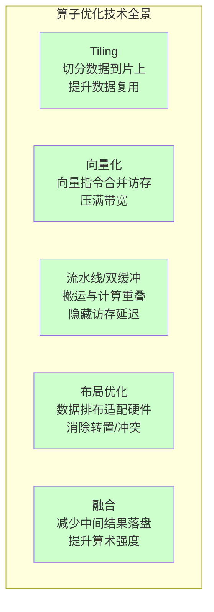
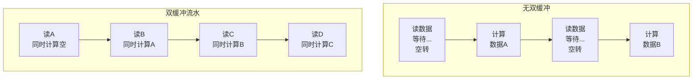
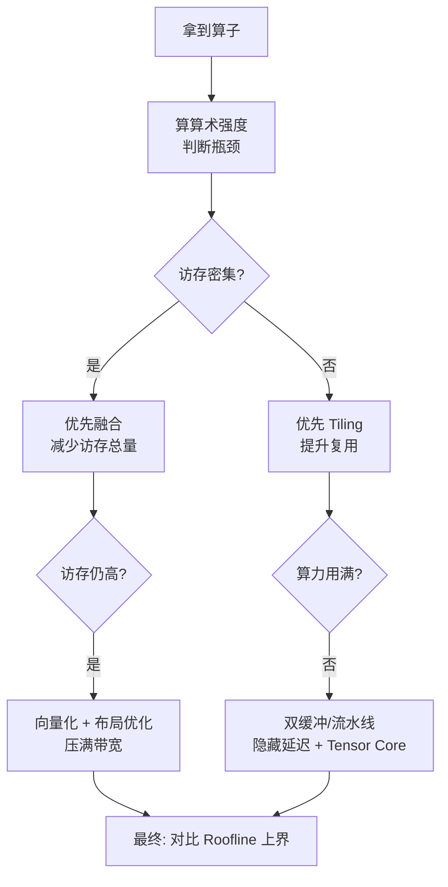

> **算子开发与优化系列 · 第 05 篇 / 共 14 篇**
>
> [04 性能分析](/2026/09/03/op-04-performance-analysis/) ← **本篇** → [06 GEMM 案例](/2026/09/03/op-06-case-gemm/)

**TL;DR**
> * **背景**：前面四篇建立了"判断瓶颈"的能力（Roofline、硬件理解、语言掌握、profiling 纪律），但判断完瓶颈后，"怎么改"才是真正的战场。这一篇给出可复用的**优化技术工具箱**，每项技术讲清"解决什么问题、代价是什么、什么时候用"。
> * **核心发现**：所有高性能 kernel 优化最终收敛到四个核心手法——**Tiling（切分数据提升复用）、向量化（合并访存压满带宽）、双缓冲/流水线（隐藏访存延迟）、布局优化（让数据天然适配硬件）**。GEMM、FlashAttention、LayerNorm、卷积、超越函数五大案例（后续各篇）都是这四件套的具体组合。
> * **收益**：拿到任何算子，都能从工具箱里选出正确的优化组合，并预判每项优化的收益量级。
> * **适用人群**：会写简单 kernel、想系统建立优化方法论的工程师。

---

## 1. 优化技术的全景地图

先给一张全局图，后续每一节展开讲：



**选择逻辑**（结合 Roofline 判断）：

| 瓶颈类型 | 首选技术 | 次选技术 |
|---|---|---|
| 访存密集（带宽受限） | 融合（T5）、向量化/合并访问（T2） | Tiling（T1，仅当存在复用空间时） |
| 计算密集（算力受限） | Tiling（T1）、Tensor Core | 布局优化（T4） |
| 延迟未隐藏 | 流水线（T3）、提高占用率 | 向量化（T2） |
| 访存不合并/冲突 | 布局优化（T4） | 向量化（T2） |

---

## 2. Tiling：把大数据切到片上

### 2.1 解决的问题

GPU 的片上存储（共享内存/寄存器）只有几百 KB，而算子要处理的数据可能是 GB 级。**Tiling 就是把大数据切成小片（tile），让每片都能放进片上存储，实现数据复用。**

### 2.2 原理分析：为什么 Tiling 能提升算术强度

以 GEMM $C_{M\times N} = A_{M\times K} \cdot B_{K\times N}$ 为例。

**无 Tiling**（naive）：每个线程算一个输出元素，需要读 A 的一行（K 个元素）和 B 的一列（K 个元素），无复用。

**有 Tiling**：每个线程块算 $C$ 的一个 $BM \times BN$ 块，整块数据（A 的 $BM \times K$ + B 的 $K \times BN$）搬入片上反复复用。

算术强度分析（$d$ 为每个元素的字节数）：

- 无 Tiling：每个输出元素做 $2K$ 次运算、读 $2K$ 个数据 → 算术强度 $I = \frac{2K}{2K \cdot d} = \frac{1}{d}$（FP32 约 0.25 FLOPs/Byte），极小
- 有 Tiling：每块算 $2 \cdot BM \cdot BN \cdot K$ 次运算、读 $(BM + BN) \cdot K \cdot d$ 字节 → 算术强度 $I = \frac{2BM \cdot BN \cdot K}{(BM+BN) \cdot K \cdot d} = \frac{2BM \cdot BN}{(BM+BN) \cdot d}$

**数据复用次数**（Tiling 的核心收益）：每个 A 元素被 $BN$ 个输出列复用、每个 B 元素被 $BM$ 个输出行复用，平均每个输入元素参与的乘累加次数为：

$$
\text{平均参与 FMA 次数} = \frac{2 \cdot BM \cdot BN}{BM + BN}
$$

当 $BM = BN = 128$、FP16（$d=2$）时：

$$
I = \frac{2 \times 128 \times 128}{(128 + 128) \times 2} = 64 \text{ FLOPs/Byte}
$$

对比 naive 的 $1/d = 0.5$ FLOPs/Byte，算术强度提升了 **128 倍**——这就是 Tiling 的价值：把内存受限的算法变成计算受限。

### 2.3 Tiling 参数怎么定

| 参数 | 含义 | 约束 | 经验值 |
|---|---|---|---|
| Tile 大小 | 每块处理的数据量 | 必须适配共享内存容量 | GEMM 常用 64-128 |
| Block 数 | 总 tile 数 | 至少要填满所有 SM | 数千个起 |
| 维度选择 | 沿哪一维切 | 取决于数据布局 | K 维优先（复用最多） |

**关键权衡**：
- Tile 太大 → 放不进共享内存，占用率下降
- Tile 太小 → 复用不足，访存比例高

**经验公式**（共享内存容量约束）：

$$
BM \cdot BK + BK \cdot BN \le \text{Shared Memory per Block}
$$

以 H100（每 SM 228KB 共享内存）、$BM=BN=128, BK=16$，FP16 计算：

$$
(128 \cdot 16 + 16 \cdot 128) \times 2 \text{ Bytes} = 8192 \text{ Bytes} = 8\text{ KB}
$$

8KB 远小于 228KB，所以可以加大 tile 或加双缓冲。

---

## 3. 向量化：一次处理多个元素

### 3.1 解决的问题

GPU 的访存是按"合并事务"服务的：同一 warp 的 32 个线程访问连续 4 字节时，正好合并成一个 128 字节事务，**标量连续访问本身就能打满带宽**。真正的问题在别处：

- **指令开销**：一条 4 字节的标量 load 每线程只搬 4 字节；向量化（`float4` = 16 字节）后一条指令搬 16 字节，**访存指令数降为 1/4**，LSU（访存流水）吞吐压力、指令发射压力和延迟暴露都随之降低；
- **跨步访问**：只有线程访问跨步地址（如 `a[tid * 8]`）时带宽才会被浪费——每个 32 字节 sector 只用到 4 字节，这才是真正需要"合并访问"解决的。

**向量化**就是让每个线程一次读/写多个连续元素（如 `float4` = 16 字节），既减少访存指令数，又天然保证 16 字节对齐的连续访问。

### 3.2 CUDA 中的向量化

```cuda
// 标量版本：每线程 1 个 float（4 字节）
__global__ void add_scalar(const float* a, const float* b, float* c, int n) {
    int i = blockIdx.x * blockDim.x + threadIdx.x;
    if (i < n) c[i] = a[i] + b[i];
}

// 向量化版本：每线程 4 个 float（16 字节）
__global__ void add_vec4(const float4* a, const float4* b, float4* c, int n4) {
    int i = blockIdx.x * blockDim.x + threadIdx.x;
    if (i < n4) {
        c[i].x = a[i].x + b[i].x;
        c[i].y = a[i].y + b[i].y;
        c[i].z = a[i].z + b[i].z;
        c[i].w = a[i].w + b[i].w;
    }
}
```

**收益**：访存指令数减少 4 倍，带宽利用率显著提升（访存密集算子通常 50% → 90%+）。

### 3.3 向量化的要求

- **数据对齐**：指针必须 16 字节对齐（`cudaMalloc` 天然对齐，但手动切片时要注意）
- **元素数整除**：`n` 必须能被 4 整除，否则要处理余数
- **连续布局**：向量化只对连续内存有效（跨步访问无法向量化）

### 3.4 Triton 中编译器自动向量化

```python
# Triton 里无需手动 float4 —— 编译器自动向量化
@triton.jit
def add_kernel(x, y, out, n, BLOCK: tl.constexpr):
    pid = tl.program_id(0)
    offs = pid * BLOCK + tl.arange(0, BLOCK)
    mask = offs < n
    tl.store(out + offs, tl.load(x + offs, mask=mask) + tl.load(y + offs, mask=mask), mask=mask)
```

> **要点**：向量化在 CUDA 是手动工作，在 Triton 是编译器默认行为。这也是 Triton 开发效率高的原因之一。

---

## 4. 双缓冲 / 流水线：用搬运隐藏延迟

### 4.1 问题的本质

访存延迟是"死时间"：线程发出 load 指令后要等几百个周期才能拿到数据。**双缓冲**让这个等待时间被其他工作填满。

### 4.2 原理：软件流水线



**核心**：第 N 块数据在计算时，第 N+1 块已经在搬运。计算和搬运重叠，访存延迟被完全隐藏。

### 4.3 CUDA 双缓冲实现

```cuda
// 共享内存双缓冲 + cp.async：两个 buffer 交替，搬运与计算重叠
__shared__ float buf[2][TILE_SIZE];

// 预取第 0 块（异步搬运，不阻塞计算流水）
cp.async(buf[0], ...);        // 全局 -> 共享内存
cp.async.commit_group();      // 把本次搬运登记为一组

for (int k = 0; k < K; k += TILE_SIZE) {
    int cur = (k / TILE_SIZE) % 2;
    int nxt = cur ^ 1;
    // 预取下一块
    if (k + TILE_SIZE < K) {
        cp.async(buf[nxt], ...);   // 下一块开始异步搬运
        cp.async.commit_group();
    }
    cp.async.wait_group(1);        // 等"当前块"就绪（最多 1 组在途）
    __syncthreads();               // 保证块内所有线程看到搬运完成
    compute(buf[cur], ...);        // 计算当前块，同时下一块在搬运
    __syncthreads();               // 防止下一轮覆盖尚未读完的 buffer
}
```

**注意**：只有 `cp.async` 这类异步拷贝才能真正让搬运和计算重叠——普通的同步 `copy_global_to_shared` 写在循环里只会串行执行，上面的 if 也形同虚设。Hopper 的 `cp.async.bulk`（TMA）更进一步，搬运完全由硬件引擎执行、不占用线程。

### 4.4 Triton 中的自动流水线

```python
# Triton 自动生成双缓冲/多缓冲流水
# 只要循环体里 load 和 dot 交替，编译器自动 pipelining
for k in range(0, K, BLOCK_K):
    a = tl.load(a_ptrs)   # 编译器自动预取下一轮
    b = tl.load(b_ptrs)
    acc = tl.dot(a, b, acc)
    a_ptrs += BLOCK_K * stride_ak
    b_ptrs += BLOCK_K * stride_bk
```

> **要点**：Triton 编译器自动做 `pipelining`（通常 2-3 级流水），CUDA 需要手动 `cp.async`。这就是为什么 Triton GEMM 性能逼近手写。

---

## 5. 布局优化：让数据天生适配硬件

### 5.1 布局问题的根源

矩阵在内存里只有一种排法（行主序或列主序），但不同算子对布局的偏好不同：

- GEMM 喜欢连续的 K 维（便于 tile 加载）
- 转置/置换需要跨步访问（慢）
- Tensor Core 要求特定的 fragment 布局

**布局优化** = 在设计数据排布时就让硬件高兴，避免运行时的转置和数据重排。

### 5.2 常见布局问题与解法

| 问题 | 表现 | 解法 |
|---|---|---|
| 行主序 A × 列主序 B 不匹配 | 误以为需要物理转置 | cuBLAS/cuBLASLt 原生支持任意 row/col-major 组合，API 里声明 layout 即可，无需转置数据 |
| 共享内存 bank 冲突 | 同 warp 访问同一 bank 的**不同地址** | padding 一列：`float sm[TILE][TILE+1]` |
| NCHW vs NHWC | 卷积访存模式不同 | 对硬件/算法选择最优通道序 |
| 非对齐 | 向量化失败 | 分配时对齐 128B，切片保持对齐 |

**bank 冲突详解**：

```cuda
// 共享内存默认布局：sm[row][col]
// 如果 32 个线程访问不同行、同一列（地址不同，但都落在同一 bank）→ 串行化 32 次
// 注意：若 32 个线程访问的是完全相同的地址，则是广播（broadcast），不产生冲突
// 解法：加 padding，让每行错开一个 bank
__shared__ float sm[32][32 + 1];  // 每行多 1 个元素，天然错开
```

### 5.3 布局优化在 Triton 里的表现

Triton 里布局是编译器管理的，程序员通过 `tl.trans` 表达意图，编译器自动优化：

```python
# 显式转置意图，编译器生成最优的加载/存储序列
b_t = tl.trans(b)  # 需要时让编译器处理
acc = tl.dot(a, b_t)
```

---

## 6. 融合：从算子层面消灭访存

### 6.1 原理

**算子融合**（Fusion）把多个连续算子合并成一个 kernel，中间结果**不落全局内存**，直接留在寄存器/共享内存。这直接**提升了算术强度**——同样的数据被更多计算复用。

### 6.2 融合的收益量化

以 Transformer 块里的 `LayerNorm → 残差相加 → 激活` 融合为例（08 篇的完整案例）：

| 方案 | 访存量 | 算术强度 | 说明 |
|---|---|---|---|
| 分开执行 | 3 个 kernel：读 x、y1、y2、residual，写 y1、y2、y3（7 次张量级访问） | 低 | 每个中间结果都走一遍 HBM |
| 融合执行 | 1 个 kernel：读 x、residual，写 y3（3 次） | 高 | 中间结果留在寄存器/共享内存 |

访存量降为原来的约 40%，且带宽利用率不变的情况下端到端延迟接近同比例下降。

**融合是访存密集算子唯一能"变出"性能空间的手段**——因为访存密集算子本身算力用不满，融合后多个算子的计算叠加在一起，算术强度提升，可能跨过 ridge point 变成计算受限。

### 6.3 融合的实现方式

1. **手写融合 kernel**：把多个算子的逻辑写进一个 kernel（如 FlashAttention 融合 QK^T + softmax + PV）
2. **编译框架自动融合**：`torch.compile`（Triton）、TVM Ansor、XLA 的融合 pass
3. **算子库融合 API**：cuDNN Graph API、cuBLASLt 的 epilogue

---

## 7. 综合决策：给定算子怎么选技术组合



**案例预告**（后续五篇案例实战将是这套工具的组合应用）：

| 案例 | 主要技术 | 次要技术 |
|---|---|---|
| GEMM（06） | Tiling + Tensor Core + 流水线 | 布局优化、向量化 |
| FlashAttention（07） | 融合 + Online Softmax | Tiling、寄存器布局 |
| LayerNorm（08） | 融合 + 归约优化 | 向量化、Warp Shuffle |
| 卷积（09） | 隐式 GEMM / Winograd | 复用 GEMM 的 tiling 思路 |
| 超越函数（10） | 多项式近似 / 查表 | 与访存融合（减缓超越压力） |

---

## 8. Lab Exercises

### Exercise 1：Tiling 效果的实测

用 Triton GEMM，把 `BLOCK_K` 从 16 调到 128，记录 TFLOPS：
- 观察小 BLOCK_K 时带宽利用率高还是算力利用率高
- 找出"访存瓶颈 → 计算瓶颈"的转变点

**预期结果**：小 BLOCK_K 时 Memory Throughput 高（访存频繁），大 BLOCK_K 时 Compute Throughput 高（复用充分）。

### Exercise 2：向量化对比

用 CUDA 写两个向量加法（标量 vs `float4`），用 ncu 对比：
- 访存指令数（标量版是向量版的 4 倍）
- 带宽利用率（向量版明显更高）

### Exercise 3：双缓冲观察

用 `ncu --section MemoryWorkloadAnalysis` 看一个循环 GEMM：
- 观察 `Long Scoreboard` 比例
- 对比 Triton 自动流水线（pipelining）和关闭流水线的差异

---

## 9. 参考资料

1. NVIDIA. *CUDA C++ Best Practices Guide — Data Transfer, Shared Memory, Vectorization*. [docs.nvidia.com](https://docs.nvidia.com/cuda/cuda-c-best-practices-guide/)
2. NVIDIA. *CUDA 共享内存与 bank 冲突*. [NVIDIA Developer Blog](https://developer.nvidia.com/blog/using-shared-memory-cuda-cc/)
3. Tillet et al. *Triton: An Intermediate Language...*（pipelining 与自动向量化）. [arXiv:2002.09960](https://arxiv.org/abs/2002.09960)
4. NVIDIA. *CUDA Graphs 与流水线*. [NVIDIA Developer Blog](https://developer.nvidia.com/blog/cuda-graphs/)
5. 知乎. *算子融合为什么能提升性能*. [知乎专栏](https://zhuanlan.zhihu.com/p/558847615)

---

*上一篇：[04 性能分析](/2026/09/03/op-04-performance-analysis/)*
*下一篇：[06 GEMM 案例](/2026/09/03/op-06-case-gemm/) —— 从 Naive 到 Tensor Core 的性能金字塔。*