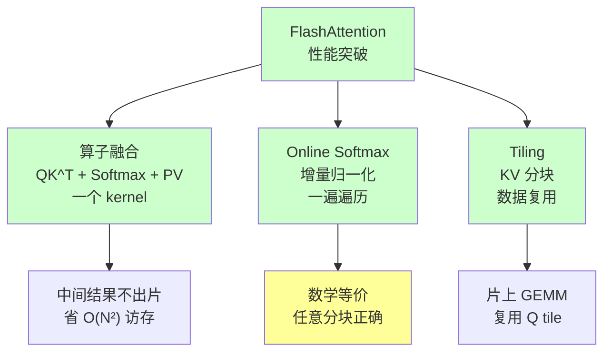

> **算子开发与优化系列 · 第 06 篇 / 共 13 篇**
>
> [05 GEMM 案例](/2026/09/03/op-05-case-gemm/) ← **本篇** → [07 归约案例](/2026/09/03/op-07-case-normalization/)

**TL;DR**
> * **背景**：FlashAttention 是近年来算子优化的标志性成果——它把 Transformer 的注意力从"显存读写受限"变成"算力受限"，让长序列训练成为可能，并启发了 PagedAttention 等一系列工作。对算子工程师而言，它是"融合 + Online 算法"两个思想的完美结合案例。
> * **核心发现**：传统 Attention 慢的根本原因是**中间矩阵 QK^T 和 Softmax 结果要写回全局内存**（$O(N^2)$ 访存），FlashAttention 用 **Online Softmax（分块增量归一化）+ 算子融合** 把中间结果留在片上，访存量降到接近 $O(N \cdot d)$，性能提升 2-4 倍，显存占用从 $O(N^2)$ 降到 $O(N)$。
> * **收益**：掌握 FlashAttention 的数学推导（Online Softmax 为什么数学上等价）和实现思路，你将理解"融合能带来多大的性能收益"以及"增量算法"这种优化武器。
> * **适用人群**：理解基础 Softmax 和 GEMM、想深入理解现代注意力算子实现原理的工程师。

---

## 1. 传统 Attention 为什么慢

### 1.1 Attention 的数学定义

对单个 query 行，注意力计算为：

$$
\text{Attention}(Q, K, V) = \text{softmax}\left(\frac{QK^T}{\sqrt{d_k}}\right) V
$$

展开成三个步骤：

| 步骤 | 数学 | 输出 shape | 计算量 |
|---|---|---|---|
| 1. QK^T | $S = Q \cdot K^T / \sqrt{d_k}$ | $N \times N$ | $O(N^2 \cdot d)$ |
| 2. Softmax | $P = \text{softmax}(S)$（按行） | $N \times N$ | $O(N^2)$ |
| 3. PV | $O = P \cdot V$ | $N \times d$ | $O(N^2 \cdot d)$ |

### 1.2 慢的根源：中间结果落盘

**关键认识**：$N \times N$ 的中间矩阵 $S$ 和 $P$ 在传统实现中必须**写回全局内存**（显存），再读回来：

```
传统 Attention 的访存模式（以 N=4096 为例）：
S = Q·K^T      → 写入 S (4096×4096×2B = 32MB)
P = softmax(S) → 读 S (32MB)，写 P (32MB)
O = P·V        → 读 P (32MB)
总访存量 ≈ 96MB+（每层），且随 N² 增长
```

**算术强度分析**：注意力对每个输出元素 $o_{ij}$，需要 $N$ 维的 softmax 权重加权——算术强度约 $O(d)$，是**低算术强度**的。传统实现下：

$$
I \approx \frac{4N^2 d}{6N^2 \times 2} = \frac{d}{3}
$$

当 $d = 64$ 时 $I \approx 21$，仍然远低于 H100 dense FP16 的 ridge point（~148）——**传统 Attention 是 Memory Bound**。

> 对照 03 篇的流程走一遍：算术强度低于 ridge point → 先别优化计算，先把访存压下去。FlashAttention 做的正是这件事。

---

## 2. Online Softmax：FlashAttention 的核心数学

### 2.1 传统 Softmax 的"两步走"问题

Softmax 的数学定义需要**先知道整行的最大值**（数值稳定），因此标准实现必须两遍遍历：

$$
m = \max_i(s_i), \quad p_i = \frac{e^{s_i - m}}{\sum_j e^{s_j - m}}
$$

两遍遍历 = 数据读两次。**问题：能不能一遍遍历就算出正确结果？**

### 2.2 增量 Softmax 的核心洞察

**洞察**：当我们已经处理了前 $t$ 个元素时，维护两个量：

- 已见部分的最大值 $m_t = \max_{i \le t}(s_i)$
- 已见部分的和 $l_t = \sum_{i \le t} e^{s_i - m_t}$

新来元素 $s_{t+1}$ 后，**更新公式**（关键！）：

$$
m_{t+1} = \max(m_t, s_{t+1})
$$

$$
l_{t+1} = l_t \cdot e^{m_t - m_{t+1}} + e^{s_{t+1} - m_{t+1}}
$$

**为什么成立**：当最大值变大（$m_{t+1} > m_t$），旧项 $e^{s_i - m_t}$ 需要重归一化到新基准 $e^{s_i - m_{t+1}} = e^{s_i - m_t} \cdot e^{m_t - m_{t+1}}$——即乘以一个缩放因子 $e^{m_t - m_{t+1}}$。

**这就是 Online Softmax**：一遍遍历，滚动更新 $m$ 和 $l$。

### 2.3 变量映射表

| 数学符号 | 含义 | 代码变量 | Shape |
|---|---|---|---|
| $m_t$ | 前 t 个元素的最大值 | `m_i` | $(BM,)$ |
| $l_t$ | 前 t 个元素的 exp 和 | `l_i` | $(BM,)$ |
| $s_i$ | QK^T 的第 i 行 | `s` | $(BM, BK)$ |
| $p_i$ | softmax 后权重 | `p` | $(BM, BK)$ |
| $o_t$ | 前 t 块的加权输出 | `acc` | $(BM, d)$ |
| $m_{new}$ | 更新后最大值 | `m_ij` | $(BM,)$ |

### 2.4 为什么最终结果等价于标准 Softmax

**归纳证明**：处理完所有块后，$m = $ 全行最大值，$l = $ 全行 exp 和。所有中间的 exp 项都经历了正确的缩放重归一化，所以最终：

$$
o = \frac{\sum_j e^{s_j - m} v_j}{l} = \text{标准 Attention 结果}
$$

**分块不影响正确性**——这是 Online Softmax 最美的性质：**任意顺序、任意分块，结果精确等价**。

---

## 3. FlashAttention 的完整算法

### 3.1 算法流程

```
输入: Q, K, V 在全局内存, block 尺寸 BM, BN
每个 block (query 块 i, 键块 j) 计算:

对每个 query 块 i（外层循环）:
  加载 Q_i 到片上
  初始化: acc = 0 (BM×d), m_i = -inf, l_i = 0

  对每个键块 j（内层循环）:
    加载 K_j, V_j
    S_ij = Q_i · K_j^T / sqrt(d)          # 片上 GEMM
    m_ij = rowmax(S_ij)                   # 当前块行最大值
    P_ij = exp(S_ij - m_ij)               # 当前块 exp
    l_ij = rowsum(P_ij)                   # 当前块和

    # Online 更新（核心）
    m_new = max(m_i, m_ij)
    alpha = exp(m_i - m_new)
    beta = exp(m_ij - m_new)
    acc = acc * alpha + P_ij * beta · V_j  # 加权更新输出
    l_i = l_i * alpha + l_ij * beta
    m_i = m_new

  输出: O_i = acc / l_i                   # 最终归一化
```

### 3.2 访存收益量化

| 方案 | 全局内存访存 | 说明 |
|---|---|---|
| 传统 | $O(N^2 \cdot d)$ | 中间 S、P 落盘（$N^2$ 的中间矩阵写读各一遍） |
| FlashAttention | $O(N^2 \cdot d^2 / M)$（$M$=片上内存，见论文 Theorem 1） | 只读 Q/K/V 各一次 + 写 O 一次 |

当片上内存 $M$ 足够大（能容纳整行 KV 块）时，Q/K/V 各只被读一次，访存量**从 $O(N^2 \cdot d)$ 降到接近 $O(N \cdot d)$**。

**性能对比**（FlashAttention 论文，A100 实测）：

| 序列长度 N | 传统 Attention (TFLOPs) | FlashAttention | 加速比 |
|---|---|---|---|
| 512 | 138 | 281 | 2.0x |
| 1K | 120 | 282 | 2.4x |
| 2K | 94 | 280 | 3.0x |
| 4K | 68 | 277 | 4.1x |

**注意**：序列越长，传统 Attention 访存压力越大，FlashAttention 的相对优势越明显。

### 3.3 Triton 实现（官方教程精简版）

```python
import triton
import triton.language as tl
import torch

@triton.jit
def flash_attn_kernel(
    Q_ptr, K_ptr, V_ptr, O_ptr,
    N_CTX, scale,
    stride_q, stride_k, stride_v, stride_o,
    BLOCK_M: tl.constexpr, BLOCK_N: tl.constexpr, HEAD_DIM: tl.constexpr,
):
    start_m = tl.program_id(0)
    offs_m = start_m * BLOCK_M + tl.arange(0, BLOCK_M)
    offs_n = tl.arange(0, BLOCK_N)
    offs_d = tl.arange(0, HEAD_DIM)

    q_ptrs = Q_ptr + offs_m[:, None] * stride_q + offs_d[None, :]
    k_ptrs = K_ptr + offs_n[None, :] * stride_k + offs_d[:, None]
    v_ptrs = V_ptr + offs_n[:, None] * stride_v + offs_d[None, :]

    q = tl.load(q_ptrs)
    acc = tl.zeros((BLOCK_M, HEAD_DIM), dtype=tl.float32)
    m_i = tl.full((BLOCK_M,), float("-inf"), dtype=tl.float32)
    l_i = tl.zeros((BLOCK_M,), dtype=tl.float32)

    for start_n in range(0, N_CTX, BLOCK_N):
        offs_n = start_n + tl.arange(0, BLOCK_N)
        k = tl.load(k_ptrs + offs_n[None, :] * stride_k)
        qk = tl.dot(q, k, allow_tf32=False)          # QK^T
        qk = qk * scale

        m_ij = tl.max(qk, 1)                          # rowmax
        p = tl.exp(qk - m_ij[:, None])                # exp
        l_ij = tl.sum(p, 1)                           # rowsum

        m_new = tl.maximum(m_i, m_ij)
        alpha = tl.exp(m_i - m_new)
        beta = tl.exp(m_ij - m_new)
        p = p * beta[:, None]

        acc = acc * alpha[:, None]                    # 缩放旧输出
        v = tl.load(v_ptrs + offs_n[:, None] * stride_v)
        acc += tl.dot(p.to(tl.float16), v)            # PV 累加
        l_i = l_i * alpha + l_ij * beta               # 更新分母
        m_i = m_new

    acc = acc / l_i[:, None]                          # 最终归一化
    o_ptrs = O_ptr + offs_m[:, None] * stride_o + offs_d[None, :]
    tl.store(o_ptrs, acc)
```

**注意要点**：
- `m_i` / `l_i` / `acc` 都在**寄存器**中滚动更新，从不落盘
- 内层循环只读 K/V tile，Q 在寄存器复用
- `scale` 在 QK^T 后应用（等价于除以 $\sqrt{d}$）

---

## 4. FlashAttention 的技术亮点拆解

### 4.1 三个思想的组合



**这三个思想每一个都来自前面的技术篇**：融合（04 篇）、Tiling（04 篇）、数值稳定技巧。**FlashAttention 不是发明了新硬件特性，而是把已有优化技术做到了极致组合。**

### 4.2 数值稳定性验证

Online Softmax 的数值精度与标准两遍 Softmax 几乎一致（误差在 FP32 累加精度内）。原因是每次更新都对旧值做了正确的指数缩放，从未丢失数值范围信息。

---

## 5. 后续演进：FlashAttention 2/3 与衍生工作

| 版本 | 核心改进 | 效果 |
|---|---|---|
| **FlashAttention-1**（2022） | Online Softmax + 融合 | 2-4x 加速，$O(N)$ 显存 |
| **FlashAttention-2**（2023） | 减少非矩阵乘开销、并行化外层循环 | 2x 再加速，GQA/MQA 支持 |
| **FlashAttention-3**（2024） | Hopper 专用异步/重叠指令 | 进一步逼近峰值 |
| **PagedAttention** | KV Cache 分页管理 | 推理吞吐 2-4x |
| **Flash-Decoding** | 长序列解码优化 | 推理加速 |

**算子工程师启示**：这些工作展示了"同一个算子，随着硬件特性和算法理解深入，能持续迭代出 10 倍性能提升"——优化永无止境。

---

## 6. Lab Exercises

### Exercise 1：跑通 Triton FlashAttention 并验证正确性

```python
# 使用第 3 节的 kernel
# 与 torch.nn.functional.scaled_dot_product_attention 对比
# 验证 max 误差 < 1e-3，并对比性能
```

### Exercise 2：观察访存收益

用 `torch.profiler` 对比传统 Attention（拆成三个算子）和 FlashAttention 的内存流量：
- 传统：QK^T 中间结果会出现在显存分配中
- Flash：无中间分配

### Exercise 3：推导 Online Softmax 的等价性

**数学练习**：设 $s = [1, 2, 3]$，手工分两块（[1,2] 和 [3]）做 Online Softmax：
1. 计算 $m_1, l_1$（处理 [1,2] 后）
2. 用更新公式计算 $m_2, l_2$（加入 [3]）
3. 验证 $l_2 = e^{1-3} + e^{2-3} + e^{0} = e^{-2} + e^{-1} + 1$

**预期结果**：与直接计算 $\sum e^{s_i - 3}$ 完全一致。

### Exercise 4：改 BLOCK 大小看性能

调节 `BLOCK_M` / `BLOCK_N`（32/64/128），观察：
- 小 block：访存频繁，性能低
- 大 block：片上内存压力大，可能降低占用率
- 找到最优配置（通常 BM=64 或 128）

---

## 7. 参考资料

1. Dao et al. *FlashAttention: Fast and Memory-Efficient Exact Attention with IO-Awareness*. [arXiv:2205.14135](https://arxiv.org/abs/2205.14135)
2. Dao. *FlashAttention-2: Faster Attention with Better Parallelism and Work Partitioning*. [arXiv:2307.08691](https://arxiv.org/abs/2307.08691)
3. Shah et al. *FlashAttention-3: Fast and Accurate Attention with Asynchrony and Low-precision*. [arXiv:2407.08614](https://arxiv.org/abs/2407.08614)
4. Triton Tutorial. *06 - Fused Attention*. [triton-lang.org](https://triton-lang.org/main/getting-started/tutorials/06-fused-attention.html)
5. Milakov et al. *Online Normalizer Calculation for Softmax*（Online Softmax 原始思想）. [arXiv:1805.02867](https://arxiv.org/abs/1805.02867)

---

*上一篇：[05 GEMM 案例](/2026/09/03/op-05-case-gemm/)*
*下一篇：[07 归约案例](/2026/09/03/op-07-case-normalization/) —— LayerNorm 与访存密集算子优化。*